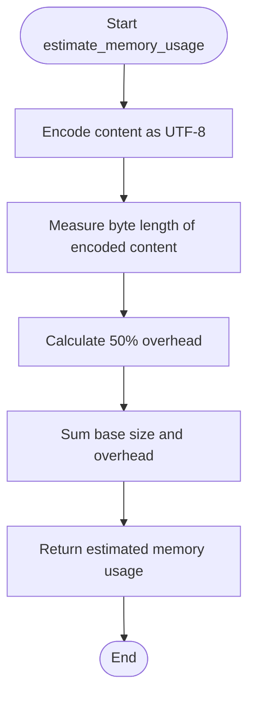

# Memory Efficiency

<cite>
**Referenced Files in This Document**   
- [performance.py](file://markdown_chunker/chunker/performance.py)
- [core.py](file://markdown_chunker/chunker/core.py)
- [types.py](file://markdown_chunker/chunker/types.py)
</cite>

## Table of Contents
1. [Introduction](#introduction)
2. [MemoryEfficientProcessor Class Overview](#memoryefficientprocessor-class-overview)
3. [process_in_chunks Method](#process_in_chunks-method)
4. [estimate_memory_usage Method](#estimate_memory_usage-method)
5. [Integration with Chunking System](#integration-with-chunking-system)
6. [Performance Optimization and Streaming](#performance-optimization-and-streaming)
7. [Best Practices for Memory Management](#best-practices-for-memory-management)
8. [Use Cases for Large Documents](#use-cases-for-large-documents)

## Introduction
The MemoryEfficientProcessor class is designed to handle large markdown documents by processing content in manageable chunks to prevent memory overflow. This documentation explains the key methods and integration patterns for efficient processing of multi-megabyte documentation files. The processor implements streaming capabilities and memory usage estimation to optimize performance based on system constraints.

## MemoryEfficientProcessor Class Overview

The MemoryEfficientProcessor class provides memory-efficient processing capabilities for large documents. It is initialized with a configurable chunk_size parameter that defaults to 10,000 characters. This class is integrated into the performance optimization system and works in conjunction with other components to handle documents of various sizes efficiently.

**Diagram sources**
- [performance.py](file://markdown_chunker/chunker/performance.py#L184-L207)

**Section sources**
- [performance.py](file://markdown_chunker/chunker/performance.py#L184-L207)

## process_in_chunks Method

The process_in_chunks method splits content into configurable chunks to reduce memory usage during processing. It takes a string content and a processor function as parameters, applying the processor to each chunk sequentially. The default chunk_size is 10,000 characters, but this can be configured during initialization.

The method iterates through the content using the specified chunk_size, creating substrings and applying the processor function to each chunk. Results from each processed chunk are collected in a list and returned as the final result. This approach prevents loading the entire document into memory at once, which is essential for processing large files.

**Diagram sources**
- [performance.py](file://markdown_chunker/chunker/performance.py#L190-L200)

**Section sources**
- [performance.py](file://markdown_chunker/chunker/performance.py#L190-L200)

## estimate_memory_usage Method

The estimate_memory_usage method calculates approximate memory consumption based on UTF-8 encoded content size with a 50% processing overhead. It first determines the base size by encoding the content as UTF-8 and measuring its length in bytes. Then it calculates the overhead as 50% of the base size and returns the sum as the estimated total memory usage.

This estimation helps determine whether to use caching, streaming, or other optimization strategies based on available system memory. The method provides a conservative estimate that accounts for additional memory requirements during processing operations.

**Diagram sources**
- [performance.py](file://markdown_chunker/chunker/performance.py#L202-L207)

**Section sources**
- [performance.py](file://markdown_chunker/chunker/performance.py#L202-L207)

## Integration with Chunking System

The MemoryEfficientProcessor is integrated into the overall chunking system through the PerformanceOptimizer class. It works alongside caching mechanisms and strategy selection to provide optimal performance for documents of various sizes. The processor is automatically triggered based on document size thresholds, with different processing approaches for small, medium, and large documents.

For smaller documents, the system may use caching to improve performance, while larger documents trigger streaming processing to minimize memory footprint. The integration allows seamless handling of documents from a few kilobytes to multiple megabytes without requiring changes to the calling code.

**Diagram sources**
- [performance.py](file://markdown_chunker/chunker/performance.py#L210-L242)

**Section sources**
- [performance.py](file://markdown_chunker/chunker/performance.py#L210-L242)

## Performance Optimization and Streaming

The system implements performance optimization through size-based decision making. Documents under 50KB use caching for improved performance, while documents over 1MB trigger streaming processing to conserve memory. The PerformanceOptimizer determines the appropriate approach based on content size and system configuration.

The get_optimal_chunk_size method selects chunk sizes based on document size: 1,000 characters for small documents (<10KB), 5,000 for medium documents (10-100KB), and 10,000 for large documents (>100KB). This adaptive approach balances memory usage and processing efficiency across different document sizes.

**Diagram sources**
- [performance.py](file://markdown_chunker/chunker/performance.py#L219-L237)

**Section sources**
- [performance.py](file://markdown_chunker/chunker/performance.py#L219-L237)

## Best Practices for Memory Management

When working with the MemoryEfficientProcessor, consider the following best practices for tuning chunk_size based on available system memory and performance requirements:

1. For systems with limited memory (≤4GB RAM), use smaller chunk sizes (1,000-5,000 characters) to minimize memory footprint, accepting the higher processing overhead.

2. For systems with ample memory (≥16GB RAM), use larger chunk sizes (10,000+ characters) to improve processing efficiency, as the memory overhead is less critical.

3. Balance the trade-offs between smaller chunks (lower memory usage, higher processing overhead due to more function calls) and larger chunks (higher memory usage, better processing efficiency).

4. Monitor actual memory usage with the estimate_memory_usage method and adjust chunk_size accordingly for your specific use case.

5. Consider the nature of your documents: code-heavy documents may benefit from larger chunks to keep related code together, while text-heavy documents can use smaller chunks.

6. Use the performance monitoring features to measure actual processing times and memory usage, adjusting configuration based on empirical data rather than theoretical estimates.

**Section sources**
- [performance.py](file://markdown_chunker/chunker/performance.py#L184-L207)
- [performance.py](file://markdown_chunker/chunker/performance.py#L210-L242)

## Use Cases for Large Documents

The MemoryEfficientProcessor is essential for handling multi-megabyte documentation files where streaming processing is critical. Typical use cases include:

1. Processing large technical documentation sets (e.g., API documentation, user manuals)
2. Handling extensive research papers or academic articles in markdown format
3. Converting large books or documentation sets from markdown to other formats
4. Analyzing extensive code repositories with markdown documentation
5. Processing long-form content for natural language processing tasks

In these scenarios, the processor prevents memory overflow by breaking documents into manageable chunks. The system automatically triggers streaming when document size exceeds the configured threshold (default 1MB), ensuring stable operation even with very large files.

For integration, users can implement custom processing functions that work with the chunked content, allowing for parallel processing of document sections. The processor handles the complexity of chunking and reassembly, providing a simple interface for developers.

**Section sources**
- [performance.py](file://markdown_chunker/chunker/performance.py#L184-L207)
- [core.py](file://markdown_chunker/chunker/core.py#L119-L154)
- [types.py](file://markdown_chunker/chunker/types.py#L574-L800)