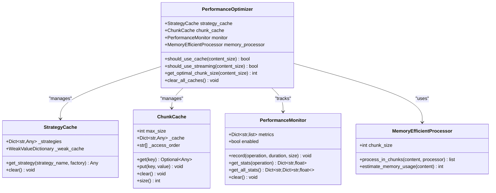
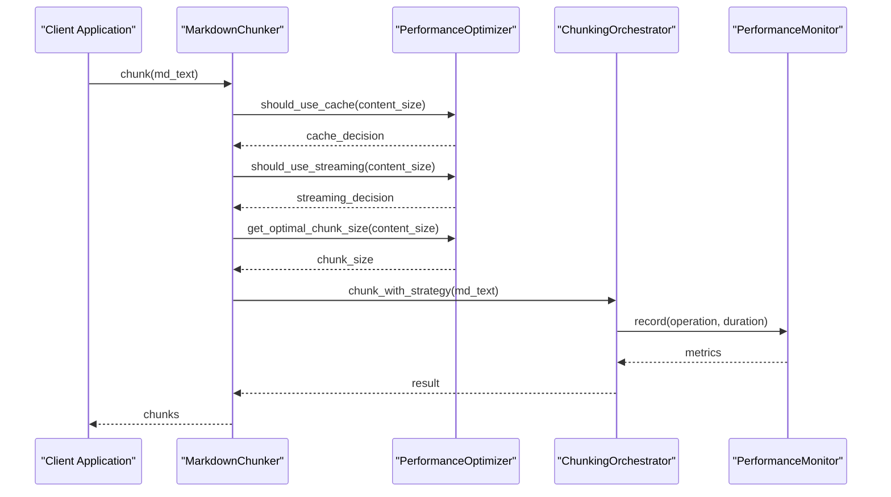

# Optimization Coordinator

<cite>
**Referenced Files in This Document**
- [performance.py](file://markdown_chunker/chunker/performance.py)
- [core.py](file://markdown_chunker/chunker/core.py)
- [orchestrator.py](file://markdown_chunker/chunker/orchestrator.py)
- [test_performance.py](file://tests/chunker/test_performance.py)
- [basic_usage.py](file://examples/basic_usage.py)
- [api_usage.py](file://examples/api_usage.py)
</cite>

## Table of Contents
1. [Introduction](#introduction)
2. [Architecture Overview](#architecture-overview)
3. [Core Components](#core-components)
4. [Decision-Making Methods](#decision-making-methods)
5. [Integration Points](#integration-points)
6. [Performance Monitoring](#performance-monitoring)
7. [Usage Examples](#usage-examples)
8. [Customization and Overrides](#customization-and-overrides)
9. [Best Practices](#best-practices)
10. [Troubleshooting Guide](#troubleshooting-guide)

## Introduction

The PerformanceOptimizer class serves as the central orchestration hub for all optimization techniques in the markdown chunking pipeline. It coordinates caching strategies, memory management, streaming operations, and performance monitoring to ensure optimal processing performance across different document sizes and content types.

Built around four core components—StrategyCache, ChunkCache, PerformanceMonitor, and MemoryEfficientProcessor—the optimizer automatically selects appropriate processing strategies based on input characteristics, balancing memory usage, processing speed, and resource efficiency.

## Architecture Overview

The PerformanceOptimizer follows a modular architecture where each component handles specific optimization concerns:



**Diagram sources**
- [performance.py](file://markdown_chunker/chunker/performance.py#L210-L242)

**Section sources**
- [performance.py](file://markdown_chunker/chunker/performance.py#L210-L242)

## Core Components

### StrategyCache

The StrategyCache implements lazy loading and caching for strategy instances, reducing initialization overhead for frequently used chunking strategies.

**Key Features:**
- Lazy instantiation of strategy objects
- Weak reference caching to prevent memory leaks
- Thread-safe access patterns
- Automatic cleanup of unused strategies

**Implementation Details:**
- Uses `weakref.WeakValueDictionary()` for automatic memory management
- Strategies are created only when first accessed
- Supports factory pattern for dynamic strategy creation

### ChunkCache

The ChunkCache provides intelligent caching of chunking results to avoid redundant processing of identical content with the same configuration.

**Key Features:**
- Least Recently Used (LRU) eviction policy
- Configurable cache size limits
- MD5-based content hashing for cache key generation
- Thread-safe operations

**Cache Key Generation:**
The system generates cache keys using a combination of content hash and configuration parameters to ensure cache hits only occur when content and processing parameters match exactly.

### PerformanceMonitor

The PerformanceMonitor tracks and analyzes performance metrics across all chunking operations, enabling performance optimization and bottleneck identification.

**Key Features:**
- Automatic timing and measurement
- Throughput calculations (bytes per second)
- Statistical analysis (average, min, max, count)
- Configurable monitoring enable/disable

### MemoryEfficientProcessor

The MemoryEfficientProcessor handles large document processing by breaking content into manageable chunks, preventing memory exhaustion during processing.

**Key Features:**
- Configurable chunk size for memory management
- Estimation of memory requirements
- Streaming-like processing for large content
- Overhead calculation for processing efficiency

**Section sources**
- [performance.py](file://markdown_chunker/chunker/performance.py#L13-L242)

## Decision-Making Methods

The PerformanceOptimizer provides three primary decision-making methods that automatically select optimal processing strategies:

### should_use_cache()

Determines whether caching should be employed based on content size thresholds.

**Logic:**
- Returns `True` for content under 50KB
- Returns `False` for larger documents to prevent excessive memory usage
- Balances caching benefits against memory consumption

**Use Cases:**
- Small to medium documents benefit from caching
- Large documents skip caching to save memory
- Configuration override available for specialized scenarios

### should_use_streaming()

Decides when streaming processing should be activated for very large documents.

**Logic:**
- Returns `True` for documents exceeding 1MB (1,000,000 bytes)
- Returns `False` for smaller content
- Prevents memory exhaustion during processing

**Benefits:**
- Reduces peak memory usage
- Enables processing of arbitrarily large documents
- Maintains consistent performance regardless of document size

### get_optimal_chunk_size()

Selects the most appropriate chunk size based on content characteristics.

**Threshold-Based Selection:**
- **Small content (< 10KB)**: 1KB chunks for fine-grained processing
- **Medium content (10KB - 100KB)**: 5KB chunks for balanced processing
- **Large content (> 100KB)**: 10KB chunks for efficient processing

**Rationale:**
- Smaller chunks improve granularity for short documents
- Medium chunks balance detail and processing efficiency
- Larger chunks optimize throughput for extensive content

**Section sources**
- [performance.py](file://markdown_chunker/chunker/performance.py#L219-L236)

## Integration Points

The PerformanceOptimizer integrates seamlessly with the main chunking pipeline through several key injection points:

### Main Chunker Integration

The optimizer is instantiated during MarkdownChunker initialization and becomes part of the core processing pipeline:



**Diagram sources**
- [core.py](file://markdown_chunker/chunker/core.py#L108-L135)
- [orchestrator.py](file://markdown_chunker/chunker/orchestrator.py#L56-L118)

### Automatic Strategy Selection

The optimizer influences strategy selection by providing performance insights and resource availability information to the strategy selector, enabling informed decision-making about which chunking approaches to employ.

### Performance Feedback Loop

The PerformanceMonitor continuously collects metrics that inform future optimization decisions, creating a feedback loop that adapts to changing workload characteristics.

**Section sources**
- [core.py](file://markdown_chunker/chunker/core.py#L108-L135)
- [orchestrator.py](file://markdown_chunker/chunker/orchestrator.py#L56-L118)

## Performance Monitoring

The PerformanceOptimizer includes comprehensive performance monitoring capabilities that track and analyze processing metrics across all operations:

### Metrics Collection

The PerformanceMonitor records detailed information about each operation:
- **Duration**: Processing time in seconds
- **Size**: Content size in bytes (when applicable)
- **Timestamp**: Operation timing for trend analysis
- **Operation Name**: Descriptive identifier for categorization

### Statistical Analysis

The system provides sophisticated statistical analysis:
- **Throughput Calculation**: Bytes processed per second
- **Latency Statistics**: Average, minimum, and maximum processing times
- **Resource Utilization**: Memory usage estimates and optimization suggestions

### Monitoring Control

Performance monitoring can be enabled or disabled globally:
- Disabled by default to minimize overhead
- Can be enabled for debugging and optimization
- All monitoring data can be cleared when needed

**Section sources**
- [performance.py](file://markdown_chunker/chunker/performance.py#L32-L82)

## Usage Examples

### Basic Usage with Automatic Optimization

```python
# Default configuration with automatic optimization
chunker = MarkdownChunker()
result = chunker.chunk(large_document)

# The optimizer automatically decides:
# - Whether to use caching (based on document size)
# - Whether to stream processing (for large documents)
# - Optimal chunk size (based on content characteristics)
```

### Performance Monitoring Enabled

```python
# Enable performance monitoring for analysis
chunker = MarkdownChunker(enable_performance_monitoring=True)
result = chunker.chunk(document)

# Access performance statistics
stats = chunker.get_performance_stats()
print(f"Average processing time: {stats['chunk']['avg_time']:.3f}s")
print(f"Throughput: {stats['chunk']['throughput']:.0f} bytes/sec")
```

### Custom Threshold Configuration

```python
# Override default thresholds for specialized environments
class CustomOptimizer(PerformanceOptimizer):
    def should_use_cache(self, content_size: int) -> bool:
        # More aggressive caching for memory-constrained environments
        return content_size < 25000  # 25KB threshold
    
    def should_use_streaming(self, content_size: int) -> bool:
        # Earlier streaming activation
        return content_size > 500000  # 500KB threshold

# Inject custom optimizer
optimizer = CustomOptimizer()
# (Integration would require modifying the chunker initialization)
```

### Stream Processing for Large Documents

```python
# Automatic streaming for large documents
large_document = "..." * 1000000  # ~1MB content
result = chunker.chunk(large_document)

# The optimizer automatically:
# 1. Detects document size > 1MB
# 2. Activates streaming processing
# 3. Processes in manageable chunks
# 4. Maintains memory efficiency
```

**Section sources**
- [basic_usage.py](file://examples/basic_usage.py#L14-L364)
- [api_usage.py](file://examples/api_usage.py#L16-L356)

## Customization and Overrides

### Threshold Customization

The PerformanceOptimizer allows customization of decision thresholds for specialized deployment environments:

| Parameter | Default Value | Customization Purpose |
|-----------|---------------|----------------------|
| Cache Threshold | 50KB | Balance memory usage vs. caching benefits |
| Streaming Threshold | 1MB | Prevent memory exhaustion for large documents |
| Small Chunk Size | 1KB | Fine-grained processing for short documents |
| Medium Chunk Size | 5KB | Balanced processing for moderate documents |
| Large Chunk Size | 10KB | Efficient processing for extensive content |

### Environment-Specific Tuning

**High-Memory Environments:**
```python
class HighMemoryOptimizer(PerformanceOptimizer):
    def should_use_cache(self, content_size: int) -> bool:
        return content_size < 100000  # 100KB threshold
    
    def should_use_streaming(self, content_size: int) -> bool:
        return content_size > 2000000  # 2MB threshold
```

**Low-Memory Environments:**
```python
class LowMemoryOptimizer(PerformanceOptimizer):
    def should_use_cache(self, content_size: int) -> bool:
        return content_size < 25000  # 25KB threshold
    
    def get_optimal_chunk_size(self, content_size: int) -> int:
        if content_size < 5000:
            return 500  # 500B chunks for very small documents
        return 2000  # 2KB chunks for others
```

### Integration Patterns

Custom optimizers can be integrated through several patterns:
- **Composition**: Wrap existing optimizer with custom logic
- **Inheritance**: Extend PerformanceOptimizer with new behavior
- **Delegation**: Replace optimizer entirely while maintaining interface

**Section sources**
- [test_performance.py](file://tests/chunker/test_performance.py#L258-L293)

## Best Practices

### Memory Management

1. **Enable Performance Monitoring**: Use `enable_performance_monitoring=True` during development to identify bottlenecks
2. **Monitor Memory Usage**: Track memory consumption patterns for large document processing
3. **Adjust Thresholds**: Customize thresholds based on available system resources
4. **Clear Caches Regularly**: Use `clear_all_caches()` periodically to prevent memory leaks

### Performance Optimization

1. **Batch Processing**: Group similar-sized documents for consistent performance
2. **Streaming for Large Documents**: Let the optimizer handle streaming automatically
3. **Caching Strategy**: Understand when caching benefits outweigh memory costs
4. **Chunk Size Tuning**: Adjust chunk sizes based on content characteristics

### Production Deployment

1. **Environment Testing**: Test optimizer behavior across different document sizes
2. **Monitoring Setup**: Implement alerts for performance degradation
3. **Resource Planning**: Allocate adequate memory based on expected document sizes
4. **Fallback Mechanisms**: Ensure graceful degradation when optimizations fail

## Troubleshooting Guide

### Common Issues and Solutions

**Issue: Memory Exhaustion with Large Documents**
- **Symptom**: OutOfMemoryError during processing
- **Solution**: The optimizer automatically activates streaming for documents >1MB
- **Prevention**: Monitor memory usage and adjust thresholds if needed

**Issue: Slow Processing for Medium Documents**
- **Symptom**: Processing times exceed expectations
- **Solution**: Check if caching is being used effectively (documents <50KB)
- **Debug**: Enable performance monitoring to identify bottlenecks

**Issue: Inconsistent Performance Across Document Sizes**
- **Symptom**: Wide variance in processing times
- **Solution**: Review chunk size selection logic
- **Analysis**: Use performance statistics to identify patterns

### Debugging Performance Issues

1. **Enable Monitoring**: Set `enable_performance_monitoring=True`
2. **Collect Statistics**: Use `get_performance_stats()` for analysis
3. **Profile Operations**: Examine individual operation metrics
4. **Compare Thresholds**: Verify optimization decisions align with expectations

### Cache-Related Problems

1. **Cache Miss Rate**: High cache misses indicate poor hit rates
2. **Memory Leaks**: Monitor cache size growth over time
3. **LRU Behavior**: Understand eviction patterns for optimal sizing
4. **Key Collisions**: Verify cache key generation uniqueness

**Section sources**
- [test_performance.py](file://tests/chunker/test_performance.py#L99-L314)