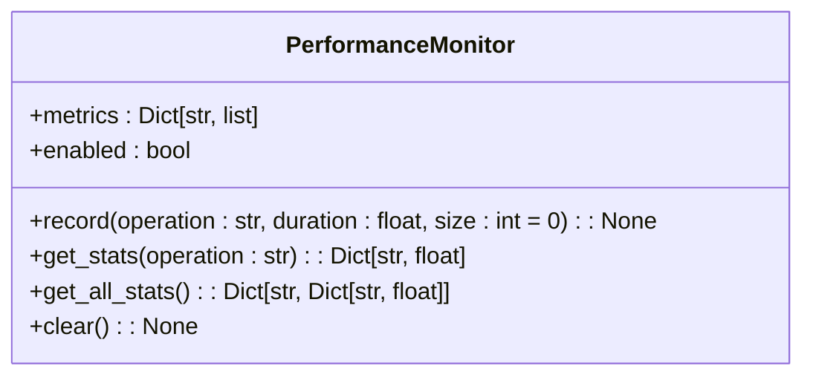
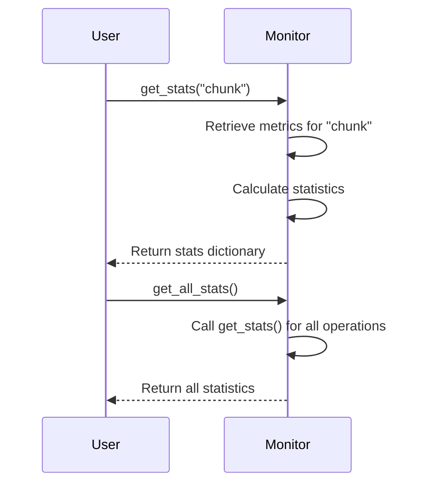

# Performance Monitoring

<cite>
**Referenced Files in This Document**   
- [performance.py](file://markdown_chunker/chunker/performance.py)
- [core.py](file://markdown_chunker/chunker/core.py)
</cite>

## Table of Contents
1. [Introduction](#introduction)
2. [PerformanceMonitor Class Overview](#performancemonitor-class-overview)
3. [Recording Performance Metrics](#recording-performance-metrics)
4. [Retrieving Performance Statistics](#retrieving-performance-statistics)
5. [Enabling and Disabling Monitoring](#enabling-and-disabling-monitoring)
6. [Use Cases and Analysis](#use-cases-and-analysis)
7. [Troubleshooting and Best Practices](#troubleshooting-and-best-practices)

## Introduction

The PerformanceMonitor class provides comprehensive performance tracking capabilities for the Markdown chunking operations. It enables detailed analysis of execution time, operation counts, and throughput metrics across various chunking strategies. This documentation explains how to use the performance monitoring features to identify bottlenecks, optimize chunking operations, and analyze system performance.

**Section sources**
- [performance.py](file://markdown_chunker/chunker/performance.py#L32-L82)
- [core.py](file://markdown_chunker/chunker/core.py#L661-L705)

## PerformanceMonitor Class Overview

The PerformanceMonitor class serves as the central component for tracking performance metrics in the Markdown chunking system. It collects and aggregates data on execution duration, operation frequency, and throughput across different chunking operations.

The monitor tracks three primary types of metrics:
- **Execution time**: Duration of individual operations in seconds
- **Operation counts**: Number of times each operation is executed
- **Throughput**: Processing rate measured in bytes per second

These metrics are stored in a dictionary structure where each operation name serves as a key to a list of recorded metrics, including duration, input size, and timestamp.



**Diagram sources**
- [performance.py](file://markdown_chunker/chunker/performance.py#L32-L82)

**Section sources**
- [performance.py](file://markdown_chunker/chunker/performance.py#L32-L82)

## Recording Performance Metrics

The `record()` method captures performance data for specific operations, storing duration and input size information for later analysis.

### Method Signature
```python
def record(self, operation: str, duration: float, size: int = 0) -> None
```

### Parameters
- **operation**: String identifier for the operation being monitored
- **duration**: Execution time in seconds
- **size**: Input size in bytes (optional, defaults to 0)

### Recording Process
When a metric is recorded:
1. The monitor checks if monitoring is enabled
2. Creates a new list for the operation if it doesn't exist
3. Appends a dictionary containing duration, size, and timestamp to the operation's metric list

The recording process is conditional on the `enabled` flag, allowing monitoring to be turned on or off without code changes.

```mermaid
flowchart TD
Start([Start record()]) --> CheckEnabled{"Monitoring enabled?"}
CheckEnabled --> |No| End([Exit])
CheckEnabled --> |Yes| CheckOperation{"Operation exists?"}
CheckOperation --> |No| CreateList["Create new metric list"]
CheckOperation --> |Yes| UseExisting["Use existing list"]
CreateList --> AddMetric
UseExisting --> AddMetric
AddMetric["Append {duration, size, timestamp}"] --> End
```

**Diagram sources**
- [performance.py](file://markdown_chunker/chunker/performance.py#L39-L49)

**Section sources**
- [performance.py](file://markdown_chunker/chunker/performance.py#L39-L49)

## Retrieving Performance Statistics

The PerformanceMonitor provides methods to retrieve aggregated statistics from the collected metrics.

### get_stats() Method
The `get_stats()` method calculates aggregated statistics for a specific operation:

```python
def get_stats(self, operation: str) -> Dict[str, float]
```

**Returned statistics include:**
- **count**: Number of times the operation was executed
- **total_time**: Sum of all execution durations
- **avg_time**: Average execution time
- **min_time**: Minimum execution time
- **max_time**: Maximum execution time
- **avg_size**: Average input size (when size > 0)
- **throughput**: Processing rate in bytes per second (when size > 0)

### get_all_stats() Method
The `get_all_stats()` method returns statistics for all recorded operations:

```python
def get_all_stats(self) -> Dict[str, Dict[str, float]]
```

This method returns a dictionary where each key is an operation name and each value is the corresponding statistics dictionary from `get_stats()`.



**Diagram sources**
- [performance.py](file://markdown_chunker/chunker/performance.py#L51-L77)

**Section sources**
- [performance.py](file://markdown_chunker/chunker/performance.py#L51-L77)

## Enabling and Disabling Monitoring

Performance monitoring can be controlled through the MarkdownChunker configuration and API methods.

### Configuration-Based Enablement
Monitoring is enabled during MarkdownChunker initialization:

```python
chunker = MarkdownChunker(enable_performance_monitoring=True)
```

By default, performance monitoring is disabled to minimize overhead.

### Runtime Control Methods
The MarkdownChunker provides methods to control monitoring at runtime:

```python
def enable_performance_monitoring(self):
    """Enable performance monitoring."""
    self._performance_optimizer.monitor.enabled = True

def disable_performance_monitoring(self):
    """Disable performance monitoring."""
    self._performance_optimizer.monitor.enabled = False
```

### Getting Performance Statistics
Retrieve collected statistics using:

```python
def get_performance_stats(self) -> dict:
    """Get performance statistics for all operations."""
    return self._performance_optimizer.monitor.get_all_stats()
```

```mermaid
flowchart TD
A[Initialize Chunker] --> B{"Enable monitoring?"}
B --> |Yes| C[Set monitor.enabled = True]
B --> |No| D[Set monitor.enabled = False]
C --> E[Metrics recorded]
D --> F[No metrics recorded]
E --> G[Retrieve stats with get_performance_stats()]
F --> H[Empty stats returned]
```

**Diagram sources**
- [core.py](file://markdown_chunker/chunker/core.py#L661-L717)
- [performance.py](file://markdown_chunker/chunker/performance.py#L37)

**Section sources**
- [core.py](file://markdown_chunker/chunker/core.py#L661-L717)

## Use Cases and Analysis

### Example: Enabling Monitoring and Retrieving Statistics
```python
# Enable performance monitoring
chunker = MarkdownChunker(enable_performance_monitoring=True)

# Process documents
content = "# Test Document\n\nContent here."
for _ in range(10):
    chunker.chunk(content)

# Retrieve and analyze performance statistics
stats = chunker.get_performance_stats()

# Analyze results
if 'chunk' in stats:
    print(f"Average chunk time: {stats['chunk']['avg_time']:.3f}s")
    print(f"Total operations: {stats['chunk']['count']}")
    if 'throughput' in stats['chunk']:
        print(f"Throughput: {stats['chunk']['throughput']:.2f} bytes/sec")
```

### Identifying Bottlenecks
Performance statistics can help identify bottlenecks in the chunking process:

```python
# Check for performance issues
if stats['chunk']['max_time'] > 1.0:
    print("Warning: Slow chunking detected")
    
# Compare strategy performance
if 'strategy_selection' in stats:
    selection_time = stats['strategy_selection']['avg_time']
    chunk_time = stats['chunk']['avg_time']
    ratio = selection_time / chunk_time
    if ratio > 0.1:
        print(f"Strategy selection takes {ratio:.1%} of total time")
```

### Throughput Calculation Example
The throughput metric is calculated as total bytes processed divided by total time:

```python
# Example calculation
# Operation 1: 1000 bytes in 1.0 seconds
# Operation 2: 4000 bytes in 2.0 seconds
# Total: 5000 bytes in 3.0 seconds
# Throughput: 5000 / 3.0 = 1666.67 bytes/second
```

**Section sources**
- [performance.py](file://markdown_chunker/chunker/performance.py#L69-L71)
- [core.py](file://markdown_chunker/chunker/core.py#L677-L693)

## Troubleshooting and Best Practices

### Monitoring Overhead Considerations
While performance monitoring has minimal overhead (<5%), consider these best practices:

- **Disable in production**: Keep monitoring disabled in production environments unless actively profiling
- **Clear statistics periodically**: Use `clear_caches()` to reset statistics when needed
- **Monitor memory usage**: Large numbers of operations can accumulate significant metric data

### Common Issues and Solutions

#### Issue: No Statistics Returned
**Cause**: Monitoring is disabled
**Solution**: Enable monitoring during initialization or at runtime

```python
# Fix: Enable monitoring
chunker = MarkdownChunker(enable_performance_monitoring=True)
# or
chunker.enable_performance_monitoring()
```

#### Issue: High Memory Usage
**Cause**: Accumulated metrics from many operations
**Solution**: Clear metrics or disable monitoring

```python
# Reset statistics
chunker.clear_caches()
```

#### Issue: Inaccurate Throughput Measurements
**Cause**: Size parameter not provided in record() calls
**Solution**: Ensure size is provided when recording operations involving data processing

### Best Practices
1. **Enable selectively**: Only enable monitoring when performance analysis is needed
2. **Clear regularly**: Reset statistics between test runs using `clear_caches()`
3. **Analyze trends**: Look at metrics over multiple operations rather than single executions
4. **Compare configurations**: Use statistics to compare performance across different configuration settings

**Section sources**
- [core.py](file://markdown_chunker/chunker/core.py#L707-L717)
- [performance.py](file://markdown_chunker/chunker/performance.py#L79-L81)