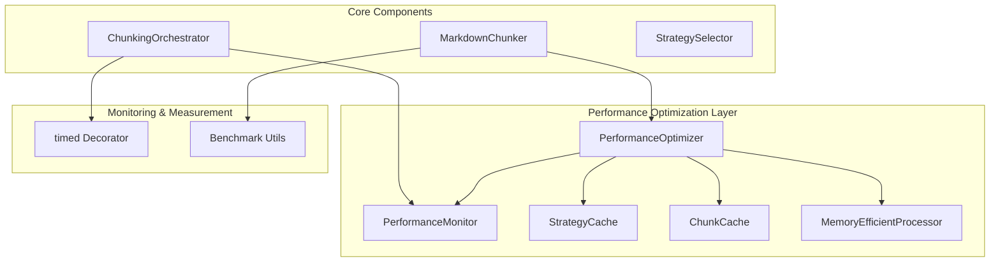
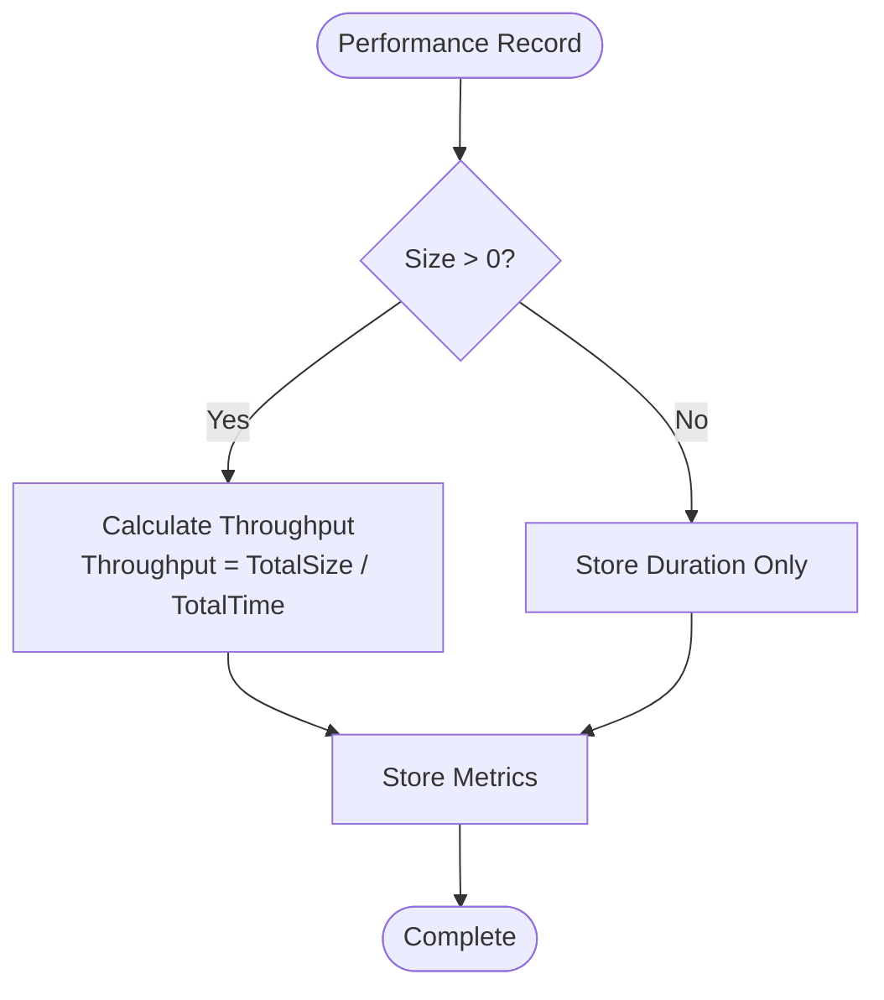
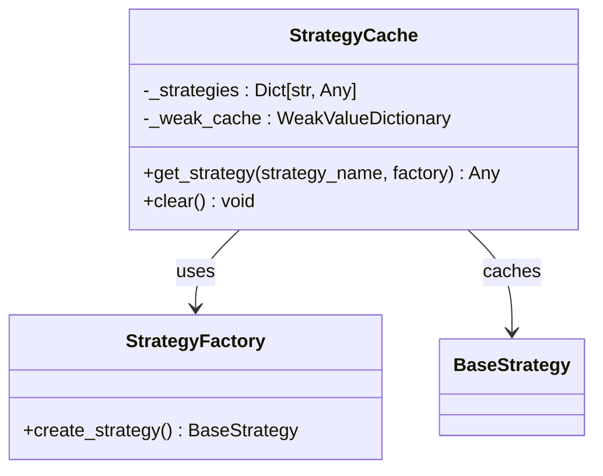
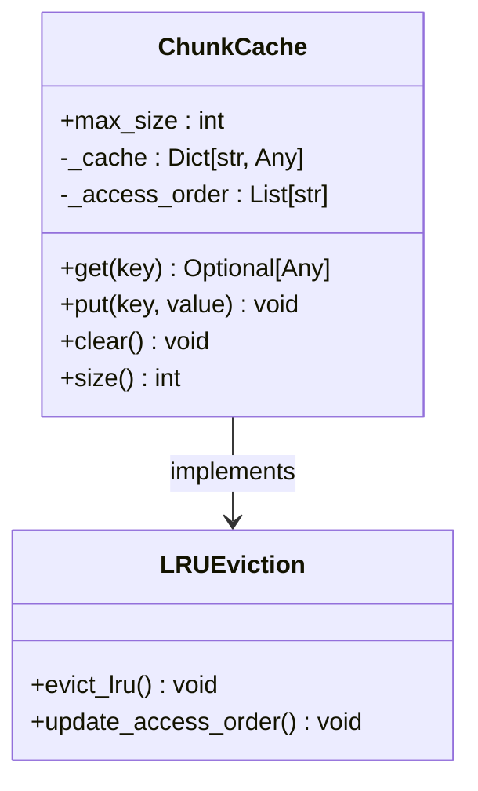
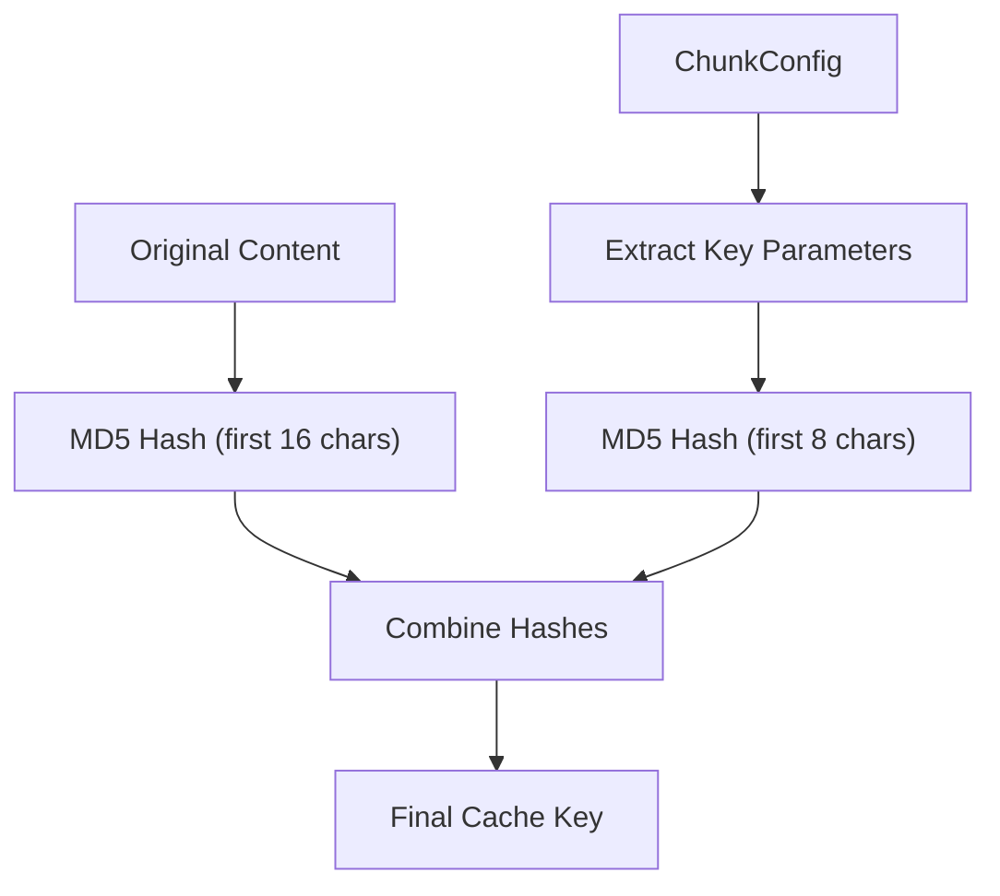
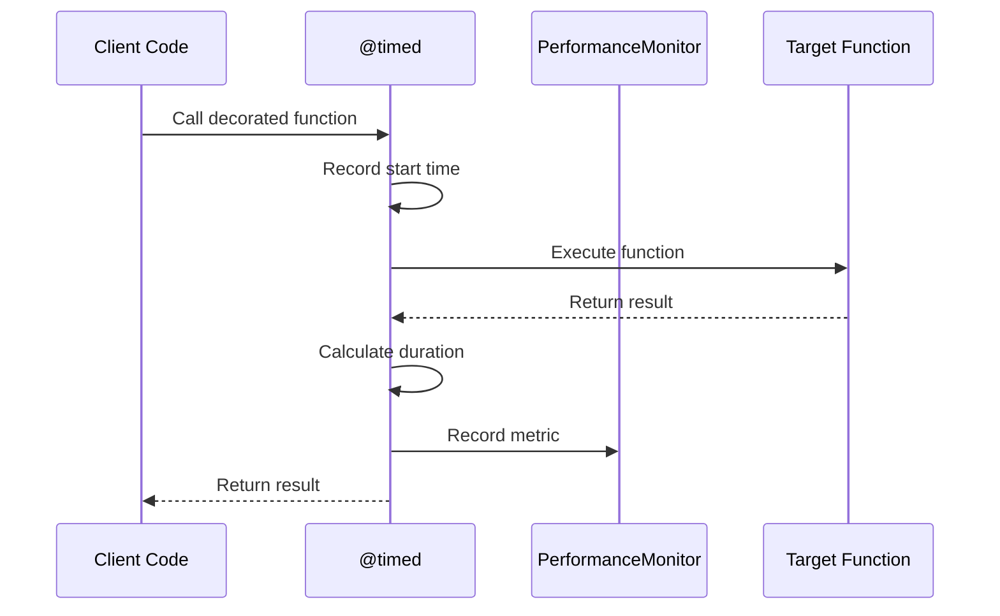
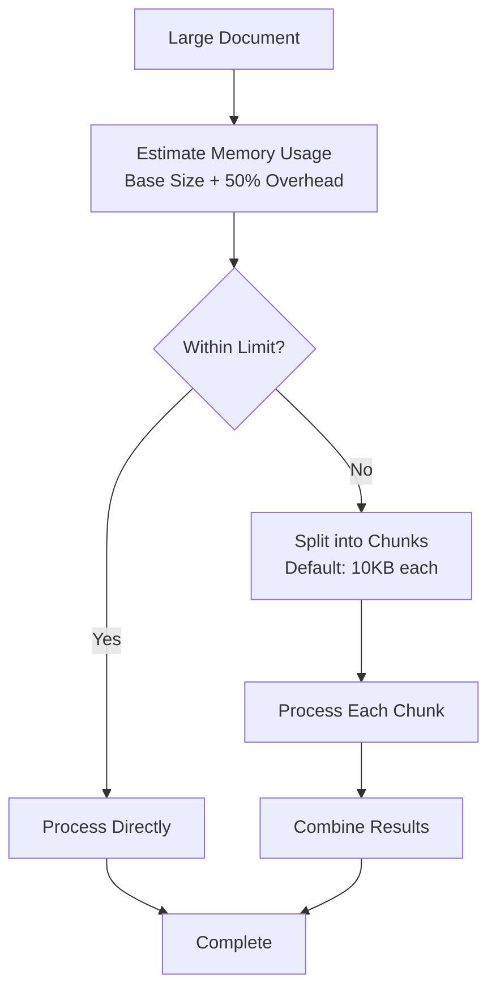
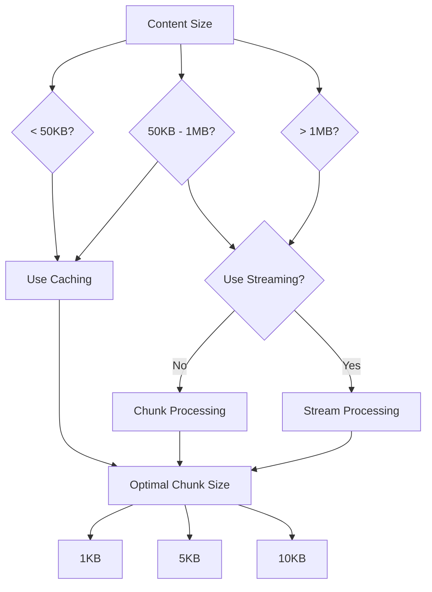
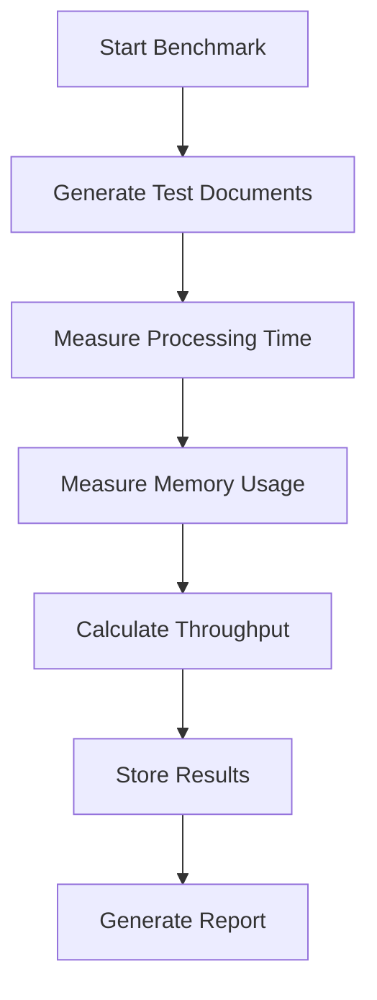

# Performance Optimization

<cite>
**Referenced Files in This Document**
- [performance.py](file://markdown_chunker/chunker/performance.py)
- [test_performance.py](file://tests/chunker/test_performance.py)
- [core.py](file://markdown_chunker/chunker/core.py)
- [orchestrator.py](file://markdown_chunker/chunker/orchestrator.py)
- [benchmarks/benchmark_chunker.py](file://benchmarks/benchmark_chunker.py)
- [examples/dify_integration.py](file://examples/dify_integration.py)
- [utils.py](file://benchmarks/utils.py)
</cite>

## Table of Contents
1. [Introduction](#introduction)
2. [System Architecture](#system-architecture)
3. [PerformanceMonitor Class](#performancemonitor-class)
4. [Caching Mechanisms](#caching-mechanisms)
5. [Timed Decorator](#timed-decorator)
6. [MemoryEfficientProcessor](#memoryefficientprocessor)
7. [PerformanceOptimizer](#performanceoptimizer)
8. [Integration Examples](#integration-examples)
9. [Performance Monitoring](#performance-monitoring)
10. [Best Practices](#best-practices)
11. [Troubleshooting](#troubleshooting)

## Introduction

The performance optimization system in the Markdown Chunker provides comprehensive tools for monitoring, caching, and optimizing chunking operations. This system is designed to handle high-throughput production environments while maintaining optimal resource utilization and providing detailed performance insights.

The optimization framework consists of several interconnected components that work together to minimize processing time, reduce memory consumption, and provide intelligent caching strategies for frequently processed content.

## System Architecture

The performance optimization system follows a modular architecture with clear separation of concerns:



**Diagram sources**
- [performance.py](file://markdown_chunker/chunker/performance.py#L210-L243)
- [core.py](file://markdown_chunker/chunker/core.py#L118-L150)

**Section sources**
- [performance.py](file://markdown_chunker/chunker/performance.py#L1-L243)
- [core.py](file://markdown_chunker/chunker/core.py#L41-L150)

## PerformanceMonitor Class

The `PerformanceMonitor` class serves as the central component for tracking and measuring performance metrics across all chunking operations.

### Core Functionality

The monitor records detailed timing information for each operation, including:
- Execution duration
- Data size processed
- Timestamp information
- Throughput calculations

### Key Methods

| Method | Purpose | Parameters |
|--------|---------|------------|
| `record(operation, duration, size)` | Record performance metric | Operation name, execution time, optional size |
| `get_stats(operation)` | Retrieve statistics for specific operation | Operation name |
| `get_all_stats()` | Get statistics for all recorded operations | None |
| `clear()` | Reset all performance metrics | None |

### Throughput Calculation

The monitor automatically calculates throughput metrics when size information is provided:



**Diagram sources**
- [performance.py](file://markdown_chunker/chunker/performance.py#L51-L72)

### Usage Examples

```python
# Enable performance monitoring
chunker = MarkdownChunker(enable_performance_monitoring=True)

# Process documents
for doc in documents:
    chunker.chunk(doc)

# Get performance statistics
stats = chunker.get_performance_stats()
print(f"Average chunk time: {stats['chunk']['avg_time']:.3f}s")
print(f"Total operations: {stats['chunk']['count']}")
```

**Section sources**
- [performance.py](file://markdown_chunker/chunker/performance.py#L32-L82)
- [core.py](file://markdown_chunker/chunker/core.py#L661-L709)

## Caching Mechanisms

The system implements multiple caching strategies to optimize performance for different scenarios.

### StrategyCache

The `StrategyCache` provides lazy loading and caching for strategy instances:



**Diagram sources**
- [performance.py](file://markdown_chunker/chunker/performance.py#L13-L30)

#### Key Features:
- Lazy initialization of strategy instances
- Weak reference caching to prevent memory leaks
- Factory pattern for strategy creation
- Automatic cache clearing capabilities

### ChunkCache

The `ChunkCache` implements LRU (Least Recently Used) caching for chunk results:



**Diagram sources**
- [performance.py](file://markdown_chunker/chunker/performance.py#L121-L170)

#### LRU Implementation Details:
- Maintains access order for efficient eviction
- Supports configurable cache size limits
- Automatic cleanup of least recently used entries
- Thread-safe access patterns

### Cache Key Generation

The system uses sophisticated cache key generation to ensure accurate cache hits:



**Diagram sources**
- [performance.py](file://markdown_chunker/chunker/performance.py#L168-L181)

**Section sources**
- [performance.py](file://markdown_chunker/chunker/performance.py#L13-L181)
- [test_performance.py](file://tests/chunker/test_performance.py#L134-L234)

## Timed Decorator

The `timed` decorator provides automatic performance measurement for functions:

### Decorator Implementation



**Diagram sources**
- [performance.py](file://markdown_chunker/chunker/performance.py#L84-L104)

### Usage Patterns

The decorator supports flexible usage patterns:

```python
@timed("custom_operation")
def my_function():
    # Function implementation
    pass

@timed()  # Uses function name as operation name
def another_function():
    # Function implementation
    pass
```

### Integration with PerformanceMonitor

The decorator automatically integrates with the chunker's performance monitoring system when used within class methods that have access to a `_performance_monitor` attribute.

**Section sources**
- [performance.py](file://markdown_chunker/chunker/performance.py#L84-L104)

## MemoryEfficientProcessor

The `MemoryEfficientProcessor` handles large document processing by breaking content into manageable chunks:

### Memory Management Strategy



**Diagram sources**
- [performance.py](file://markdown_chunker/chunker/performance.py#L184-L207)

### Key Features:
- Configurable chunk size (default: 10,000 characters)
- Memory usage estimation with overhead calculation
- Streaming processing for very large documents
- Automatic chunk boundary detection

### Usage in Production

For high-throughput environments, the processor automatically determines when to use chunked processing based on document size thresholds.

**Section sources**
- [performance.py](file://markdown_chunker/chunker/performance.py#L184-L207)

## PerformanceOptimizer

The `PerformanceOptimizer` serves as the central coordinator for all performance optimization techniques:

### Optimization Decision Matrix



**Diagram sources**
- [performance.py](file://markdown_chunker/chunker/performance.py#L219-L237)

### Optimization Strategies

| Content Size Range | Strategy | Chunk Size | Caching | Streaming |
|-------------------|----------|------------|---------|-----------|
| < 10KB | Direct processing | 1KB | Yes | No |
| 10KB - 50KB | Standard processing | 1KB | Yes | No |
| 50KB - 1MB | Optimized processing | 5KB | Yes | No |
| 1MB - 10MB | Chunked processing | 10KB | Yes | No |
| > 10MB | Streaming processing | N/A | No | Yes |

### Coordination Responsibilities

The PerformanceOptimizer manages:
- Strategy selection and caching
- Cache size and eviction policies
- Memory management decisions
- Performance monitoring coordination
- Resource cleanup and optimization

**Section sources**
- [performance.py](file://markdown_chunker/chunker/performance.py#L210-L243)

## Integration Examples

### Basic Performance Monitoring Setup

```python
# Enable monitoring during initialization
chunker = MarkdownChunker(enable_performance_monitoring=True)

# Process documents
documents = ["# Document 1", "# Document 2", "# Document 3"]
for doc in documents:
    chunker.chunk(doc)

# Analyze performance
stats = chunker.get_performance_stats()
print(f"Average processing time: {stats['chunk']['avg_time']:.3f}s")
print(f"Total chunks processed: {stats['chunk']['count']}")
```

### Production Environment Configuration

```python
# High-throughput production setup
config = ChunkConfig(
    max_chunk_size=1536,  # Optimal for embeddings
    min_chunk_size=200,
    enable_overlap=True,
    overlap_size=200
)

chunker = MarkdownChunker(config)
chunker.enable_performance_monitoring()

# Process large batches
batch_results = []
for document in large_document_batch:
    result = chunker.chunk(document, include_analysis=True)
    batch_results.append(result)
    
    # Check performance periodically
    if len(batch_results) % 100 == 0:
        stats = chunker.get_performance_stats()
        if stats['chunk']['avg_time'] > 1.0:
            print("Warning: Performance degradation detected")
```

### Dify Integration Example

```python
# Dify-compatible chunking with metadata enrichment
chunker = MarkdownChunker()

def prepare_for_dify(document, metadata):
    result = chunker.chunk_with_analysis(document)
    
    # Enrich with Dify-specific metadata
    enriched_chunks = []
    for i, chunk in enumerate(result.chunks):
        enriched = {
            "content": chunk.content,
            "metadata": {
                **chunk.metadata,
                "chunk_id": f"chunk_{i}",
                "document_id": metadata.get("doc_id"),
                "section": determine_section(chunk.content),
                "language": detect_language(chunk.content),
                "chunking_strategy": result.strategy_used,
                "chunk_index": i,
                "total_chunks": len(result.chunks)
            }
        }
        enriched_chunks.append(enriched)
    
    return enriched_chunks
```

**Section sources**
- [examples/dify_integration.py](file://examples/dify_integration.py#L1-L487)
- [core.py](file://markdown_chunker/chunker/core.py#L63-L106)

## Performance Monitoring

### Monitoring Capabilities

The performance monitoring system provides comprehensive insights into chunking operations:

#### Available Metrics

| Metric Category | Available Metrics |
|----------------|------------------|
| Timing | Count, Total Time, Average Time, Min Time, Max Time |
| Throughput | Bytes per second, Chunks per second |
| Memory | Peak memory usage (when measured) |
| Operations | Strategy selection, overlap processing, metadata enrichment |

#### Real-time Monitoring

```python
# Continuous performance monitoring
while processing_documents:
    chunker.chunk(next_document)
    
    # Periodic performance check
    if document_count % 100 == 0:
        stats = chunker.get_performance_stats()
        avg_time = stats['chunk']['avg_time']
        throughput = calculate_throughput(stats)
        
        log_performance_metrics(avg_time, throughput)
        
        # Alert on performance degradation
        if avg_time > threshold:
            trigger_alert("Performance degradation detected")
```

### Benchmarking Integration

The system includes comprehensive benchmarking utilities:



**Diagram sources**
- [benchmarks/benchmark_chunker.py](file://benchmarks/benchmark_chunker.py#L27-L195)

**Section sources**
- [benchmarks/benchmark_chunker.py](file://benchmarks/benchmark_chunker.py#L1-L195)
- [utils.py](file://benchmarks/utils.py#L1-L58)

## Best Practices

### When to Use Different Optimization Techniques

#### Small Documents (< 50KB)
- **Use caching**: Enable caching for repeated processing
- **Minimal overhead**: Performance monitoring adds <5% overhead
- **Direct processing**: No need for chunking or streaming

#### Medium Documents (50KB - 1MB)
- **Hybrid approach**: Use both caching and optimized chunking
- **Monitor throughput**: Track bytes per second metrics
- **Configure chunk size**: Use 5KB chunks for optimal balance

#### Large Documents (> 1MB)
- **Streaming preferred**: Use streaming for documents > 10MB
- **Memory management**: Monitor memory usage closely
- **Chunk size tuning**: Adjust based on available memory

### Configuration Recommendations

#### Production Environment
```python
# Recommended production configuration
config = ChunkConfig(
    max_chunk_size=1536,  # Optimal for embeddings
    min_chunk_size=200,
    enable_overlap=True,
    overlap_size=200
)

# Enable performance monitoring
chunker = MarkdownChunker(
    config=config,
    enable_performance_monitoring=True
)
```

#### Development Environment
```python
# Development-friendly configuration
config = ChunkConfig(
    max_chunk_size=1000,  # Smaller chunks for testing
    min_chunk_size=100,
    enable_overlap=False,  # Simpler for debugging
    overlap_size=100
)

chunker = MarkdownChunker(config)
```

### Performance Tuning Guidelines

1. **Monitor key metrics**: Track average processing time and throughput
2. **Set performance baselines**: Establish acceptable performance thresholds
3. **Implement alerts**: Trigger notifications for performance degradation
4. **Regular optimization**: Periodically review and adjust configurations
5. **Load testing**: Test under realistic load conditions

## Troubleshooting

### Common Performance Issues

#### High Processing Times
- **Symptom**: Average processing time consistently > 1.0 seconds
- **Solution**: 
  - Enable performance monitoring to identify bottlenecks
  - Check cache hit rates
  - Consider document size optimization
  - Review strategy selection patterns

#### Memory Usage Problems
- **Symptom**: Memory usage grows continuously
- **Solution**:
  - Enable memory-efficient processing for large documents
  - Clear caches periodically with `chunker.clear_caches()`
  - Monitor memory usage with benchmark utilities

#### Cache Inefficiency
- **Symptom**: Low cache hit rates despite caching enabled
- **Solution**:
  - Verify cache key generation logic
  - Check cache size limits
  - Review document similarity patterns

### Debugging Tools

#### Performance Analysis
```python
# Comprehensive performance analysis
def analyze_performance(chunker, documents):
    # Enable monitoring
    chunker.enable_performance_monitoring()
    
    # Process documents
    for doc in documents:
        chunker.chunk(doc)
    
    # Get detailed statistics
    stats = chunker.get_performance_stats()
    
    # Analyze by operation type
    for op, metrics in stats.items():
        print(f"{op}:")
        print(f"  Avg time: {metrics['avg_time']:.3f}s")
        print(f"  Throughput: {metrics.get('throughput', 0):.2f} bytes/sec")
        print(f"  Count: {metrics['count']}")
    
    return stats
```

#### Memory Profiling
```python
# Memory usage profiling
def profile_memory_usage(chunker, document):
    # Measure memory usage
    result, memory_mb = measure_memory(chunker.chunk, document)
    
    print(f"Memory usage: {memory_mb:.2f} MB")
    return memory_mb
```

### Performance Optimization Checklist

- [ ] Enable performance monitoring in production
- [ ] Set up periodic performance checks
- [ ] Monitor cache hit rates
- [ ] Profile memory usage for large documents
- [ ] Test with representative document loads
- [ ] Implement performance alerts
- [ ] Regular cache cleanup
- [ ] Document performance baselines

**Section sources**
- [test_performance.py](file://tests/chunker/test_performance.py#L99-L314)
- [utils.py](file://benchmarks/utils.py#L1-L58)