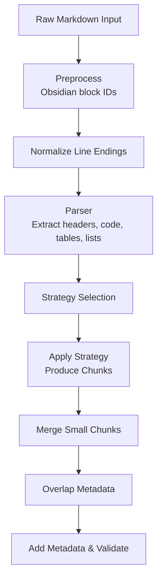
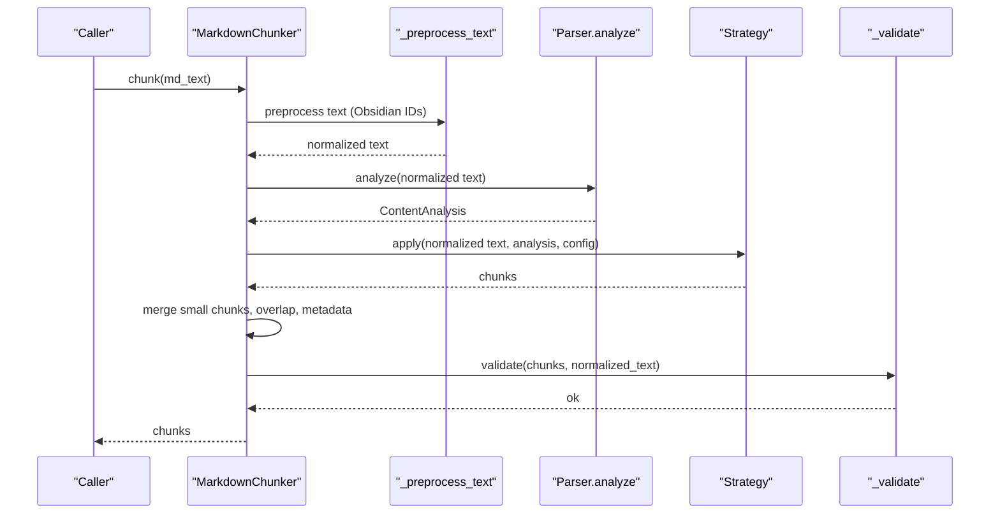
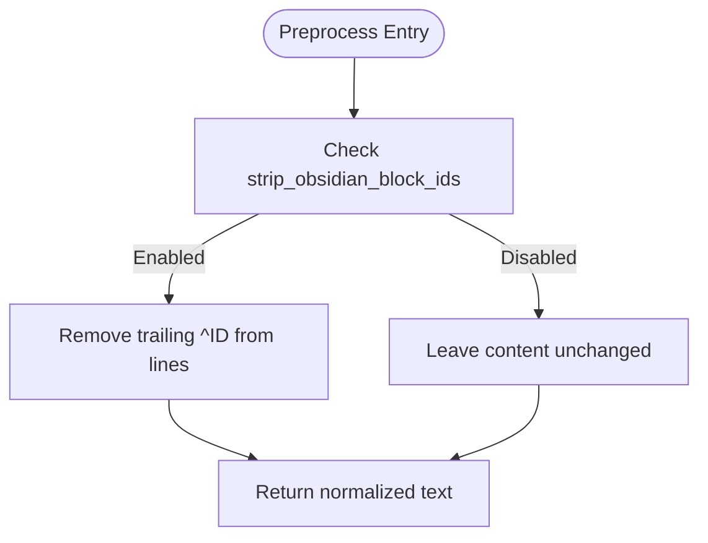
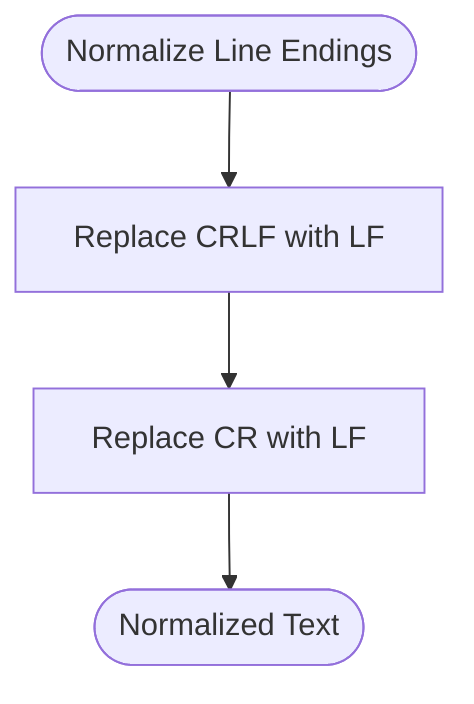
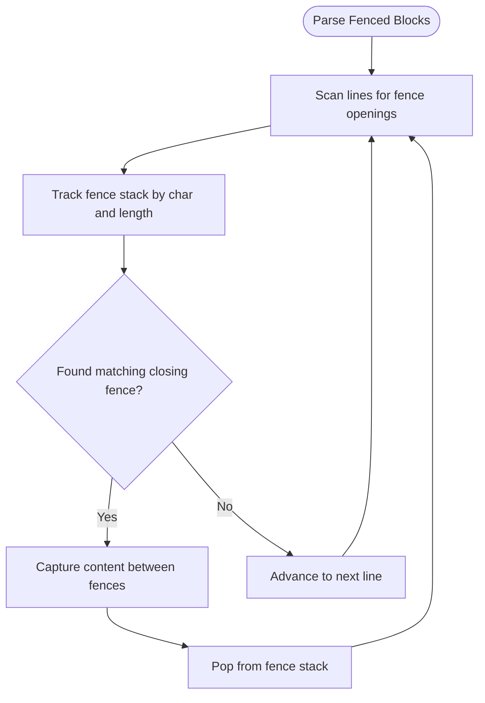
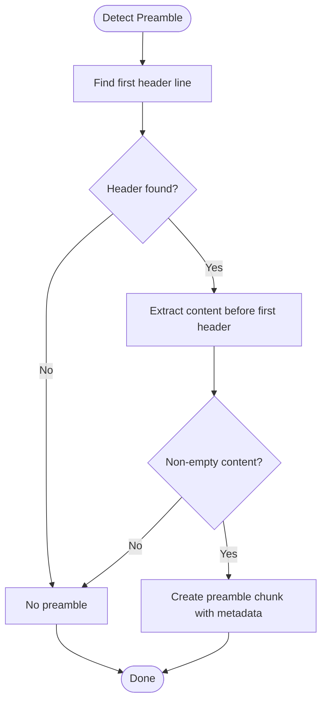
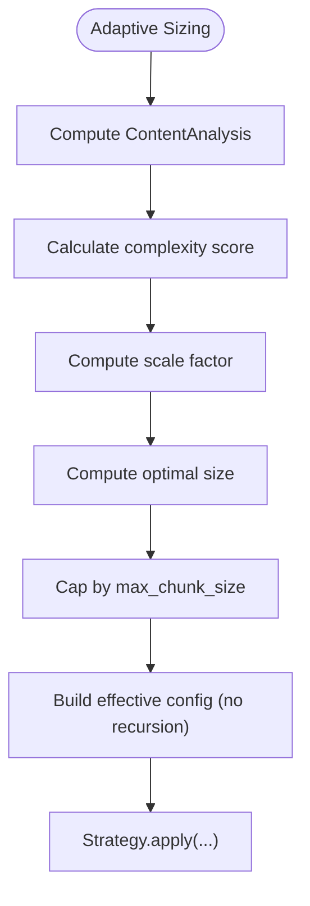
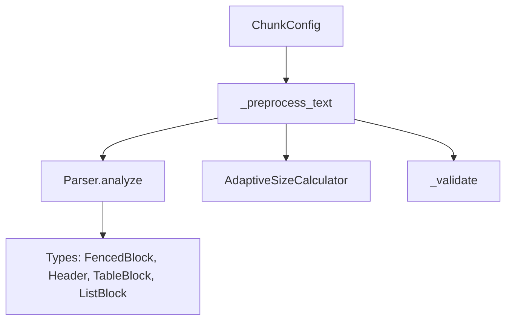

# Preprocessing Features

<cite>
**Referenced Files in This Document**
- [markdown_chunker_v2/chunker.py](file://markdown_chunker_v2/chunker.py)
- [markdown_chunker_v2/parser.py](file://markdown_chunker_v2/parser.py)
- [markdown_chunker_v2/config.py](file://markdown_chunker_v2/config.py)
- [markdown_chunker_v2/types.py](file://markdown_chunker_v2/types.py)
- [markdown_chunker_v2/adaptive_sizing.py](file://markdown_chunker_v2/adaptive_sizing.py)
- [tests/chunker/test_obsidian_block_ids.py](file://tests/chunker/test_obsidian_block_ids.py)
- [tests/test_v2_properties.py](file://tests/test_v2_properties.py)
- [tests/test_v2_additional.py](file://tests/test_v2_additional.py)
- [tests/corpus/nested_fencing/nested_fencing_011.md](file://tests/corpus/nested_fencing/nested_fencing_011.md)
- [tests/corpus/nested_fencing/deep_nesting.md](file://tests/corpus/nested_fencing/deep_nesting.md)
- [tests/fixtures/edge_cases/mixed_line_endings.md](file://tests/fixtures/edge_cases/mixed_line_endings.md)
- [docs/research/features/02-nested-fencing-support.md](file://docs/research/features/02-nested-fencing-support.md)
</cite>

## Table of Contents
1. [Introduction](#introduction)
2. [Project Structure](#project-structure)
3. [Core Components](#core-components)
4. [Architecture Overview](#architecture-overview)
5. [Detailed Component Analysis](#detailed-component-analysis)
6. [Dependency Analysis](#dependency-analysis)
7. [Performance Considerations](#performance-considerations)
8. [Troubleshooting Guide](#troubleshooting-guide)
9. [Conclusion](#conclusion)

## Introduction
This document explains the preprocessing features implemented in the markdown chunker. It focuses on how raw input is prepared for chunking, including line ending normalization, Obsidian block ID stripping, nested fenced code block parsing, and preamble detection. These steps occur early in the pipeline to ensure downstream strategies and validators operate on consistent, predictable content.

## Project Structure
Preprocessing sits at the front of the chunking pipeline:
- Input text is normalized and optionally preprocessed (e.g., removing Obsidian block IDs).
- The parser runs once to extract structural elements and compute content metrics.
- Strategies and validators operate on the normalized content.

**Diagram sources**
- [markdown_chunker_v2/chunker.py](file://markdown_chunker_v2/chunker.py#L74-L161)
- [markdown_chunker_v2/parser.py](file://markdown_chunker_v2/parser.py#L103-L114)

**Section sources**
- [markdown_chunker_v2/chunker.py](file://markdown_chunker_v2/chunker.py#L74-L161)
- [markdown_chunker_v2/parser.py](file://markdown_chunker_v2/parser.py#L103-L114)

## Core Components
- Preprocessing: Obsidian block ID removal controlled by configuration.
- Line ending normalization: Ensures consistent line-end handling across platforms.
- Parser: Extracts fenced code blocks with nested support, headers, tables, and lists.
- Preamble detection: Separates content before the first header into a dedicated chunk.
- Adaptive sizing: Computes optimal chunk size based on content complexity.

**Section sources**
- [markdown_chunker_v2/chunker.py](file://markdown_chunker_v2/chunker.py#L55-L73)
- [markdown_chunker_v2/parser.py](file://markdown_chunker_v2/parser.py#L103-L114)
- [markdown_chunker_v2/parser.py](file://markdown_chunker_v2/parser.py#L177-L238)
- [markdown_chunker_v2/adaptive_sizing.py](file://markdown_chunker_v2/adaptive_sizing.py#L14-L183)
- [markdown_chunker_v2/config.py](file://markdown_chunker_v2/config.py#L14-L100)

## Architecture Overview
The preprocessing pipeline integrates with the main chunker and parser:

**Diagram sources**
- [markdown_chunker_v2/chunker.py](file://markdown_chunker_v2/chunker.py#L74-L161)
- [markdown_chunker_v2/parser.py](file://markdown_chunker_v2/parser.py#L35-L101)

## Detailed Component Analysis

### Obsidian Block ID Stripping
Obsidian block IDs appear as a caret followed by an identifier at the end of a line. The chunker can remove them during preprocessing when enabled by configuration.

Key behaviors:
- Removal occurs only when the configuration flag is set.
- The removal targets trailing caret identifiers on lines, not mid-line carets.
- Both chunk and hierarchical chunking apply preprocessing consistently.

**Diagram sources**
- [markdown_chunker_v2/chunker.py](file://markdown_chunker_v2/chunker.py#L55-L73)

**Section sources**
- [markdown_chunker_v2/chunker.py](file://markdown_chunker_v2/chunker.py#L55-L73)
- [markdown_chunker_v2/config.py](file://markdown_chunker_v2/config.py#L96-L100)
- [tests/chunker/test_obsidian_block_ids.py](file://tests/chunker/test_obsidian_block_ids.py#L1-L177)

### Line Ending Normalization
The parser normalizes all line endings to Unix-style LF before any other processing. This ensures consistent behavior across Windows (CRLF), old Mac (CR), and Unix (LF) inputs.

Validation:
- Tests confirm CRLF and CR are normalized to LF.
- Chunking results remain consistent regardless of input line ending style.

**Diagram sources**
- [markdown_chunker_v2/parser.py](file://markdown_chunker_v2/parser.py#L103-L114)

**Section sources**
- [markdown_chunker_v2/parser.py](file://markdown_chunker_v2/parser.py#L103-L114)
- [tests/test_v2_properties.py](file://tests/test_v2_properties.py#L106-L163)
- [tests/test_v2_additional.py](file://tests/test_v2_additional.py#L253-L293)
- [tests/fixtures/edge_cases/mixed_line_endings.md](file://tests/fixtures/edge_cases/mixed_line_endings.md#L18-L19)

### Nested Fenced Code Blocks Parsing
The parser extracts fenced code blocks with robust nested support, including:
- Triple to quintuple backticks.
- Tilde fencing (quadruple and quintuple tildes).
- Mixed fence types and arbitrary nesting levels.
- Unclosed fences are handled gracefully.

**Diagram sources**
- [markdown_chunker_v2/parser.py](file://markdown_chunker_v2/parser.py#L177-L238)

**Section sources**
- [markdown_chunker_v2/parser.py](file://markdown_chunker_v2/parser.py#L177-L238)
- [docs/research/features/02-nested-fencing-support.md](file://docs/research/features/02-nested-fencing-support.md#L1-L312)
- [tests/corpus/nested_fencing/nested_fencing_011.md](file://tests/corpus/nested_fencing/nested_fencing_011.md#L1-L50)
- [tests/corpus/nested_fencing/deep_nesting.md](file://tests/corpus/nested_fencing/deep_nesting.md#L1-L102)

### Preamble Extraction
If content appears before the first header, it is separated into a dedicated preamble chunk. This improves downstream chunking by isolating introductory material.

Behavior highlights:
- Preamble chunk receives special metadata indicating it is introductory content.
- If the first header appears immediately, no preamble chunk is created.
- Whitespace-only content before the first header does not create a preamble.

**Diagram sources**
- [markdown_chunker_v2/parser.py](file://markdown_chunker_v2/parser.py#L374-L394)
- [markdown_chunker_v2/strategies/structural.py](file://markdown_chunker_v2/strategies/structural.py#L82-L113)

**Section sources**
- [markdown_chunker_v2/parser.py](file://markdown_chunker_v2/parser.py#L374-L394)
- [markdown_chunker_v2/strategies/structural.py](file://markdown_chunker_v2/strategies/structural.py#L82-L113)
- [tests/test_preamble_scenarios.py](file://tests/test_preamble_scenarios.py#L87-L231)

### Adaptive Sizing Integration
Adaptive sizing computes an optimal chunk size based on content complexity (code ratio, table presence, list ratio, and sentence length). The chunker can incorporate this into the effective configuration before strategy application.

**Diagram sources**
- [markdown_chunker_v2/adaptive_sizing.py](file://markdown_chunker_v2/adaptive_sizing.py#L106-L154)
- [markdown_chunker_v2/chunker.py](file://markdown_chunker_v2/chunker.py#L106-L136)

**Section sources**
- [markdown_chunker_v2/adaptive_sizing.py](file://markdown_chunker_v2/adaptive_sizing.py#L14-L183)
- [markdown_chunker_v2/chunker.py](file://markdown_chunker_v2/chunker.py#L106-L136)
- [markdown_chunker_v2/config.py](file://markdown_chunker_v2/config.py#L90-L100)

## Dependency Analysis
Preprocessing interacts with the chunker, parser, and configuration:

**Diagram sources**
- [markdown_chunker_v2/config.py](file://markdown_chunker_v2/config.py#L14-L100)
- [markdown_chunker_v2/chunker.py](file://markdown_chunker_v2/chunker.py#L55-L73)
- [markdown_chunker_v2/parser.py](file://markdown_chunker_v2/parser.py#L35-L101)
- [markdown_chunker_v2/types.py](file://markdown_chunker_v2/types.py#L72-L128)
- [markdown_chunker_v2/adaptive_sizing.py](file://markdown_chunker_v2/adaptive_sizing.py#L106-L154)

**Section sources**
- [markdown_chunker_v2/config.py](file://markdown_chunker_v2/config.py#L14-L100)
- [markdown_chunker_v2/chunker.py](file://markdown_chunker_v2/chunker.py#L55-L73)
- [markdown_chunker_v2/parser.py](file://markdown_chunker_v2/parser.py#L35-L101)
- [markdown_chunker_v2/types.py](file://markdown_chunker_v2/types.py#L72-L128)
- [markdown_chunker_v2/adaptive_sizing.py](file://markdown_chunker_v2/adaptive_sizing.py#L106-L154)

## Performance Considerations
- Obsidian block ID removal uses a single regex pass per line and is O(n) in input length.
- Line ending normalization is a simple replacement pass and is O(n).
- Nested fenced block parsing uses a stack-based scan and is O(n) with bounded overhead proportional to nesting depth.
- Preamble detection is O(n) and only adds a short prefix extraction.
- Adaptive sizing adds a constant-time computation based on ContentAnalysis.

[No sources needed since this section provides general guidance]

## Troubleshooting Guide
Common issues and checks:
- Obsidian block IDs not stripped:
  - Verify the configuration flag is enabled.
  - Confirm IDs appear at end-of-line and not mid-line.
  - See tests covering single/multiple IDs, alphanumeric IDs, and Russian examples.

- Unexpected line ending artifacts:
  - Ensure the input is processed through the parser’s normalization step.
  - Validate that CRLF and CR are converted to LF.

- Nested fenced blocks mis-parsed:
  - Confirm the parser is used to extract fenced blocks.
  - Review test corpus files for supported patterns.

- Preamble not created:
  - Ensure there is non-whitespace content before the first header.
  - Check that whitespace-only content does not trigger preamble creation.

**Section sources**
- [tests/chunker/test_obsidian_block_ids.py](file://tests/chunker/test_obsidian_block_ids.py#L1-L177)
- [tests/test_v2_properties.py](file://tests/test_v2_properties.py#L106-L163)
- [tests/test_v2_additional.py](file://tests/test_v2_additional.py#L253-L293)
- [tests/test_preamble_scenarios.py](file://tests/test_preamble_scenarios.py#L87-L231)

## Conclusion
The preprocessing layer provides essential guarantees for reliable chunking:
- Consistent line endings across platforms.
- Optional cleanup of Obsidian block IDs.
- Robust parsing of nested fenced code blocks.
- Clear separation of preamble content.
These features collectively improve downstream strategy selection and chunk quality while maintaining performance and backward compatibility.