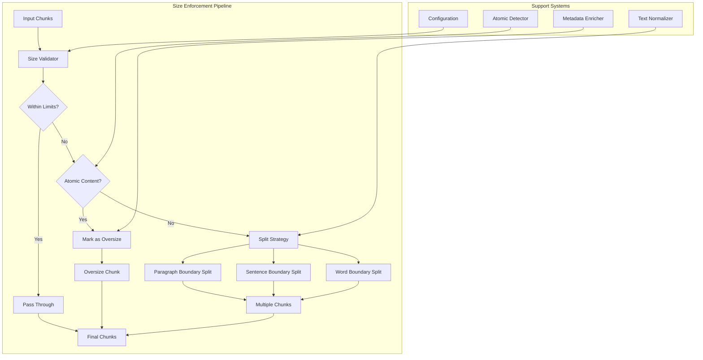
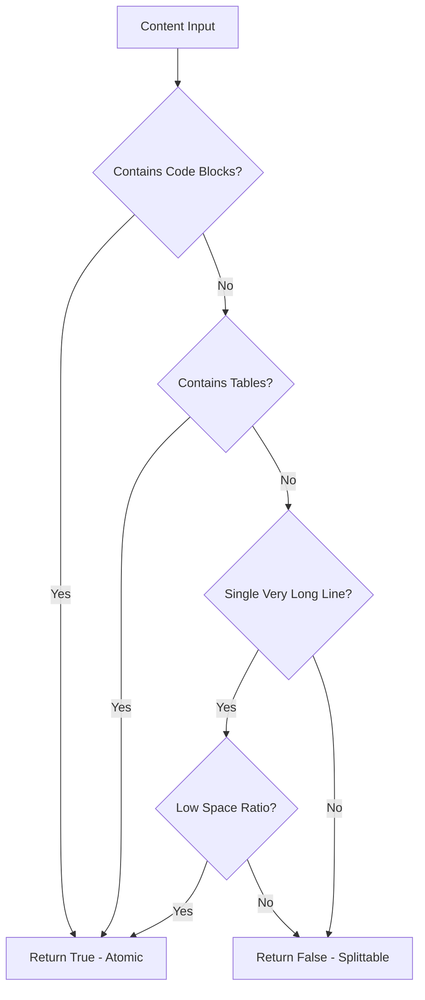
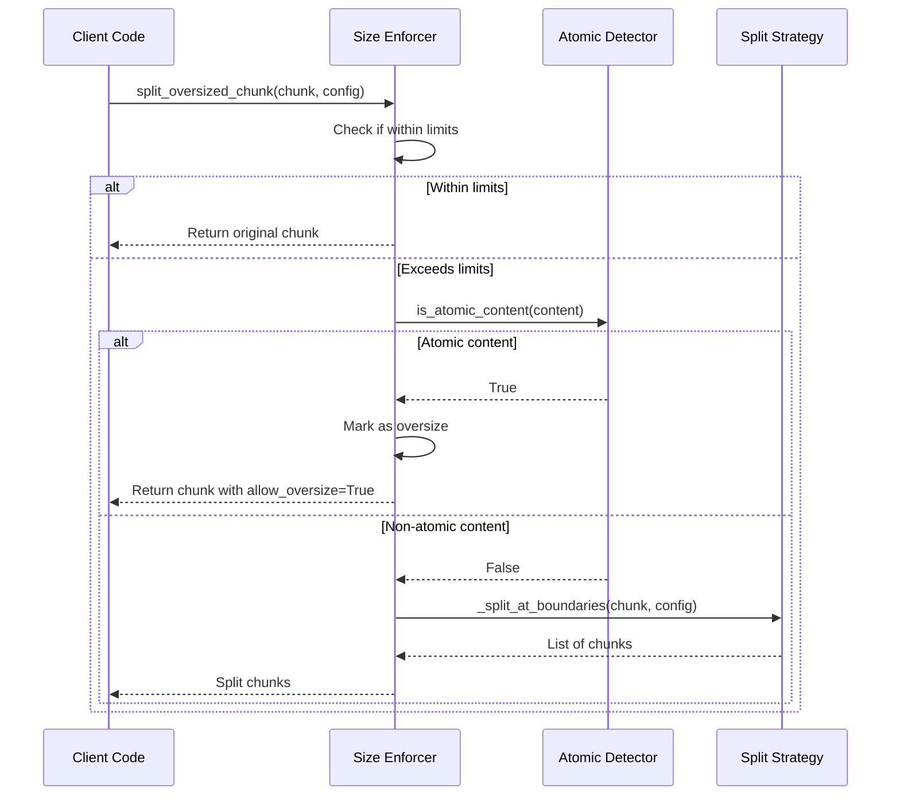
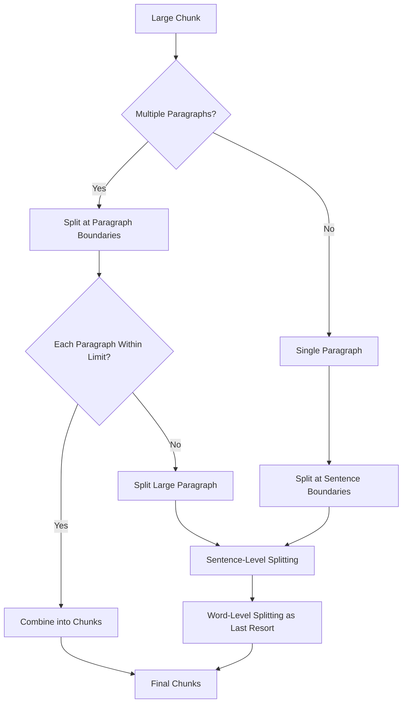
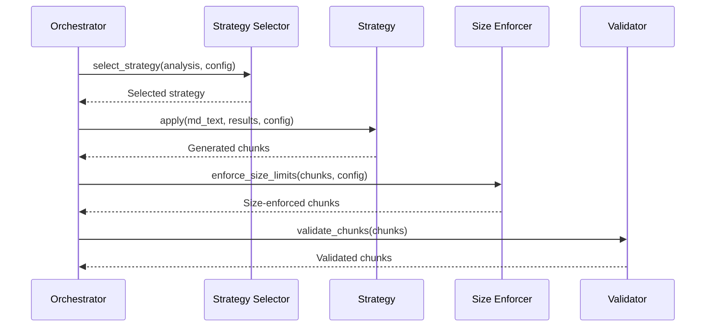

# Size Enforcer

<cite>
**Referenced Files in This Document**
- [size_enforcer.py](file://markdown_chunker/chunker/size_enforcer.py)
- [types.py](file://markdown_chunker/chunker/types.py)
- [text_normalizer.py](file://markdown_chunker/chunker/text_normalizer.py)
- [core.py](file://markdown_chunker/chunker/core.py)
- [orchestrator.py](file://markdown_chunker/chunker/orchestrator.py)
- [base.py](file://markdown_chunker/chunker/strategies/base.py)
- [structural_strategy.py](file://markdown_chunker/chunker/strategies/structural_strategy.py)
- [regression_validator.py](file://markdown_chunker/chunker/regression_validator.py)
- [bug_fixes.py](file://tests/chunker/test_bug_fixes.py)
- [basic_usage.py](file://examples/basic_usage.py)
- [api_usage.py](file://examples/api_usage.py)
</cite>

## Table of Contents
1. [Introduction](#introduction)
2. [Architecture Overview](#architecture-overview)
3. [Core Components](#core-components)
4. [Atomic Content Detection](#atomic-content-detection)
5. [Size Enforcement Logic](#size-enforcement-logic)
6. [Splitting Strategies](#splitting-strategies)
7. [Configuration Management](#configuration-management)
8. [Integration Points](#integration-points)
9. [Performance Considerations](#performance-considerations)
10. [Testing and Validation](#testing-and-validation)
11. [Troubleshooting Guide](#troubleshooting-guide)
12. [Conclusion](#conclusion)

## Introduction

The Size Enforcer is a critical component of the Dify Markdown Chunker that ensures all generated chunks respect size constraints while maintaining content integrity. It addresses CRIT-1: "chunks violating max_chunk_size" for non-atomic blocks, allowing atomic elements (code blocks, tables) to exceed size limits while intelligently splitting regular text content.

The module implements sophisticated content analysis to distinguish between atomic and non-atomic content, providing graceful fallback mechanisms when content exceeds size limits. It balances performance with accuracy, ensuring that chunking operations remain efficient while maintaining data integrity.

## Architecture Overview

The Size Enforcer operates as part of the broader chunking pipeline, working alongside strategy selection, content validation, and overlap management systems.



**Diagram sources**
- [size_enforcer.py](file://markdown_chunker/chunker/size_enforcer.py#L52-L78)
- [base.py](file://markdown_chunker/chunker/strategies/base.py#L195-L222)

## Core Components

### Size Enforcement Module

The main size enforcement logic is implemented in [`size_enforcer.py`](file://markdown_chunker/chunker/size_enforcer.py), providing three primary functions:

#### Atomic Content Detection
The [`is_atomic_content()`](file://markdown_chunker/chunker/size_enforcer.py#L16-L49) function identifies content that should not be split:



**Diagram sources**
- [size_enforcer.py](file://markdown_chunker/chunker/size_enforcer.py#L16-L49)

#### Oversized Chunk Splitting
The [`split_oversized_chunk()`](file://markdown_chunker/chunker/size_enforcer.py#L52-L78) function handles content exceeding size limits:



**Diagram sources**
- [size_enforcer.py](file://markdown_chunker/chunker/size_enforcer.py#L52-L78)

#### Size Limit Enforcement
The [`enforce_size_limits()`](file://markdown_chunker/chunker/size_enforcer.py#L325-L352) function applies size constraints across all chunks:

**Section sources**
- [size_enforcer.py](file://markdown_chunker/chunker/size_enforcer.py#L1-L352)

### Configuration System

The size enforcement system integrates with the comprehensive [`ChunkConfig`](file://markdown_chunker/chunker/types.py#L500-L700) system:

| Parameter | Default | Purpose |
|-----------|---------|---------|
| `max_chunk_size` | 4096 | Maximum size in characters per chunk |
| `min_chunk_size` | 512 | Minimum size for chunks |
| `target_chunk_size` | 2048 | Target size for optimal chunking |
| `allow_oversize` | True | Allow oversized chunks for atomic content |
| `enable_overlap` | True | Enable overlap between chunks |

**Section sources**
- [types.py](file://markdown_chunker/chunker/types.py#L500-L700)

## Atomic Content Detection

Atomic content refers to elements that should not be split across chunk boundaries to maintain their semantic integrity:

### Code Blocks
Code blocks are identified by triple backticks (```) and preserved as single units:

```python
# Example of atomic code detection
code_content = "```python\nfunction example() {\n  return true;\n}\n```"
# is_atomic_content(code_content) → True
```

### Tables
Tables are detected by the presence of pipe (`|`) separators and multiple lines:

```python
# Example of atomic table detection
table_content = "| Column 1 | Column 2 |\n|----------|----------|\n| Value 1  | Value 2  |"
# is_atomic_content(table_content) → True
```

### Formatted Data
Very long single-line content with low space ratios is treated as atomic data:

```python
# Example of atomic data detection
data_content = "1234567890abcdef1234567890abcdef1234567890abcdef"
# is_atomic_content(data_content) → True (if space_ratio < 0.1)
```

**Section sources**
- [size_enforcer.py](file://markdown_chunker/chunker/size_enforcer.py#L16-L49)

## Size Enforcement Logic

### Boundary-Based Splitting

The size enforcement system employs a multi-tiered splitting strategy:

#### Paragraph-Level Splitting
The [`_split_at_boundaries()`](file://markdown_chunker/chunker/size_enforcer.py#L81-L159) function prioritizes paragraph breaks:



**Diagram sources**
- [size_enforcer.py](file://markdown_chunker/chunker/size_enforcer.py#L81-L159)

#### Sentence-Level Splitting
When paragraph boundaries aren't sufficient, the system splits at sentence boundaries:

```python
# Sentence splitting pattern
sentence_pattern = r"([.!?]+\s+)"
parts = re.split(sentence_pattern, para)
```

#### Word-Level Splitting
As a last resort, the system performs word-boundary splitting using [`truncate_at_word_boundary()`](file://markdown_chunker/chunker/text_normalizer.py#L277-L316):

**Section sources**
- [size_enforcer.py](file://markdown_chunker/chunker/size_enforcer.py#L81-L295)
- [text_normalizer.py](file://markdown_chunker/chunker/text_normalizer.py#L277-L316)

## Splitting Strategies

### Multi-Level Splitting Approach

The size enforcement system implements a hierarchical splitting strategy:

1. **Paragraph Boundaries**: First priority for maintaining readability
2. **Sentence Boundaries**: Maintains sentence-level coherence
3. **Word Boundaries**: Last resort for content that must be split

### Metadata Preservation

Each split chunk inherits metadata from the original chunk:

```python
# Metadata inheritance pattern
metadata = original_chunk.metadata.copy()
metadata["is_split"] = True
metadata["split_from"] = original_chunk.get_metadata("id", "unknown")
metadata["split_index"] = sub_index
```

### Overlap Management

When overlap is enabled, the system creates overlapping chunks:

```python
# Overlap creation logic
if config.enable_overlap and chunks:
    overlap_blocks = self._get_overlap_blocks(current_blocks, config.overlap_size)
    current_blocks = overlap_blocks + [block]
```

**Section sources**
- [size_enforcer.py](file://markdown_chunker/chunker/size_enforcer.py#L298-L322)
- [structural_strategy.py](file://markdown_chunker/chunker/strategies/structural_strategy.py#L1126-L1135)

## Configuration Management

### Size Constraint Configuration

The [`ChunkConfig`](file://markdown_chunker/chunker/types.py#L500-L700) class provides comprehensive size management:

```python
# Configuration examples
config = ChunkConfig(
    max_chunk_size=2048,      # Target maximum size
    min_chunk_size=256,       # Minimum size
    target_chunk_size=1024,   # Optimal size
    allow_oversize=True,      # Allow oversized atomic content
    enable_overlap=True,      # Enable chunk overlap
    overlap_size=100          # Overlap size in characters
)
```

### Automatic Adjustment

The configuration system automatically adjusts invalid values:

```python
# Automatic validation and adjustment
if self.max_chunk_size <= 0:
    raise ValueError("max_chunk_size must be positive")
if self.min_chunk_size >= self.max_chunk_size:
    self.min_chunk_size = max(1, self.max_chunk_size // 2)
```

**Section sources**
- [types.py](file://markdown_chunker/chunker/types.py#L500-L700)

## Integration Points

### Strategy Selection Integration

Size enforcement works closely with strategy selection:



**Diagram sources**
- [orchestrator.py](file://markdown_chunker/chunker/orchestrator.py#L104-L107)
- [base.py](file://markdown_chunker/chunker/strategies/base.py#L195-L222)

### Fallback System Integration

When size enforcement fails, the system triggers fallback mechanisms:

```python
# Fallback integration
if chunk.size > config.max_chunk_size:
    if config.allow_oversize:
        # Mark as oversize but allow
        chunk.add_metadata("allow_oversize", True)
    else:
        # Try to split if not atomic
        if self._contains_atomic_element(chunk.content):
            chunk.add_metadata("allow_oversize", True)
        else:
            # Non-atomic oversized chunk - enforce split
            split_chunks = split_oversized_chunk(chunk, config)
```

**Section sources**
- [base.py](file://markdown_chunker/chunker/strategies/base.py#L195-L222)

## Performance Considerations

### Optimization Strategies

The size enforcement system implements several performance optimizations:

1. **Early Termination**: Stop processing when chunks are within limits
2. **Lazy Evaluation**: Only split content when necessary
3. **Efficient Pattern Matching**: Optimized regex patterns for content detection
4. **Memory Efficiency**: Minimal memory allocation during splitting

### Complexity Analysis

| Operation | Time Complexity | Space Complexity |
|-----------|----------------|------------------|
| Atomic Detection | O(n) | O(1) |
| Paragraph Splitting | O(n) | O(n) |
| Sentence Splitting | O(n) | O(n) |
| Word Splitting | O(n) | O(n) |

Where n is the content length.

### Memory Management

The system minimizes memory usage by:

- Processing content in chunks rather than loading entire documents
- Reusing string objects where possible
- Efficient boundary detection algorithms

## Testing and Validation

### Regression Testing

The size enforcement system includes comprehensive regression tests:

```python
# Test case for CRIT-1 violations
def test_non_atomic_oversized_chunk_is_split():
    config = ChunkConfig(max_chunk_size=200, allow_oversize=False)
    long_text = "This is a regular paragraph. " * 20  # ~580 chars
    chunk = Chunk(long_text, 1, 1, {})
    
    result = split_oversized_chunk(chunk, config)
    assert len(result) > 1  # Should be split
    for c in result:
        assert len(c.content) <= config.max_chunk_size
```

### Property-Based Testing

The system uses property-based testing to ensure correctness:

```python
# Property: All non-oversize chunks respect size limits
@given(st.text(), st.integers(min_value=100, max_value=2000))
def test_all_chunks_respect_size_limit(content, max_size):
    config = ChunkConfig(max_chunk_size=max_size, allow_oversize=False)
    chunker = MarkdownChunker(config)
    
    chunks = chunker.chunk(content)
    for chunk in chunks:
        if not chunk.is_oversize:
            assert len(chunk.content) <= config.max_chunk_size
```

**Section sources**
- [bug_fixes.py](file://tests/chunker/test_bug_fixes.py#L169-L220)

### Validation Framework

The [`CRIT1_SizeViolationCheck`](file://markdown_chunker/chunker/regression_validator.py#L154-L188) class ensures ongoing compliance:

```python
# Size violation validation
class CRIT1_SizeViolationCheck(RegressionCheck):
    def check(self, chunks: List[Chunk], original_text: str) -> Tuple[bool, str]:
        for i, chunk in enumerate(chunks):
            if len(chunk.content) > max_size and not chunk.is_oversize:
                if not is_atomic_content(chunk.content):
                    return False, f"Chunk {i} violates size constraint"
        return True, "All chunks respect size limits"
```

**Section sources**
- [regression_validator.py](file://markdown_chunker/chunker/regression_validator.py#L154-L188)

## Troubleshooting Guide

### Common Issues

#### Issue: Chunks Still Exceeding Size Limits

**Symptoms**: Generated chunks larger than configured `max_chunk_size`

**Causes**:
1. Content contains atomic elements that shouldn't be split
2. `allow_oversize` is set to `False` but content isn't atomic
3. Configuration validation failed

**Solutions**:
```python
# Solution 1: Enable oversize for atomic content
config = ChunkConfig(max_chunk_size=2048, allow_oversize=True)

# Solution 2: Use appropriate strategy for content type
chunker = MarkdownChunker(config)
chunks = chunker.chunk(markdown_text, strategy="code")  # For code-heavy content
```

#### Issue: Content Loss During Splitting

**Symptoms**: Important content missing from chunks

**Causes**:
1. Aggressive size limits
2. Poor boundary detection
3. Incorrect atomic content detection

**Solutions**:
```python
# Solution: Increase size limits or adjust detection
config = ChunkConfig(
    max_chunk_size=4096,      # Increase from default
    min_chunk_size=256,       # Adjust minimum
    allow_oversize=True       # Allow atomic content to be oversized
)
```

#### Issue: Performance Degradation

**Symptoms**: Slow chunking with large documents

**Causes**:
1. Excessive splitting operations
2. Complex content requiring multiple passes
3. Inefficient configuration

**Solutions**:
```python
# Solution: Optimize configuration for performance
config = ChunkConfig(
    max_chunk_size=2048,      # Reasonable balance
    enable_overlap=False,     # Disable overlap if not needed
    allow_oversize=True       # Reduce splitting attempts
)
```

### Debugging Tools

#### Size Enforcement Logging

Enable detailed logging to understand size enforcement decisions:

```python
import logging
logging.getLogger('markdown_chunker.chunker.size_enforcer').setLevel(logging.DEBUG)
```

#### Content Analysis

Use the chunker's analysis features to understand content characteristics:

```python
result = chunker.chunk_with_analysis(markdown_text)
print(f"Strategy used: {result.strategy_used}")
print(f"Content type: {result.content_type}")
print(f"Complexity score: {result.complexity_score}")
```

**Section sources**
- [bug_fixes.py](file://tests/chunker/test_bug_fixes.py#L169-L220)

## Conclusion

The Size Enforcer represents a sophisticated solution to the challenge of maintaining content integrity while respecting size constraints. Its multi-layered approach to content analysis, combined with intelligent splitting strategies, ensures that chunked content remains readable and semantically coherent.

Key strengths of the system include:

- **Intelligent Atomic Detection**: Accurate identification of content that should not be split
- **Hierarchical Splitting**: Multi-tiered approach prioritizing readability
- **Graceful Fallbacks**: Robust handling of edge cases and oversized content
- **Performance Optimization**: Efficient algorithms for large-scale processing
- **Comprehensive Testing**: Extensive validation ensuring correctness

The modular design allows for easy extension and customization, making it suitable for a wide range of use cases from simple text processing to complex RAG system integration. Future enhancements could include machine learning-based content analysis and adaptive splitting strategies based on content type detection.