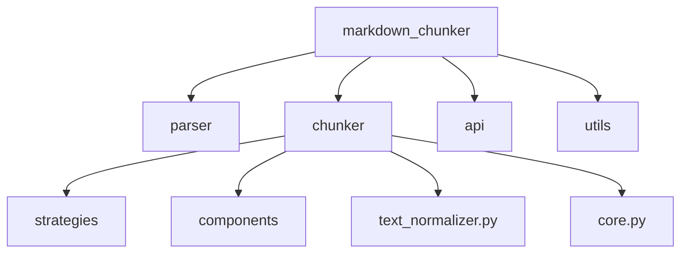
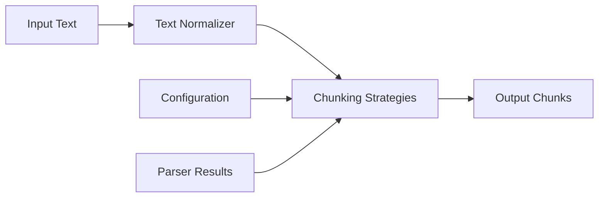
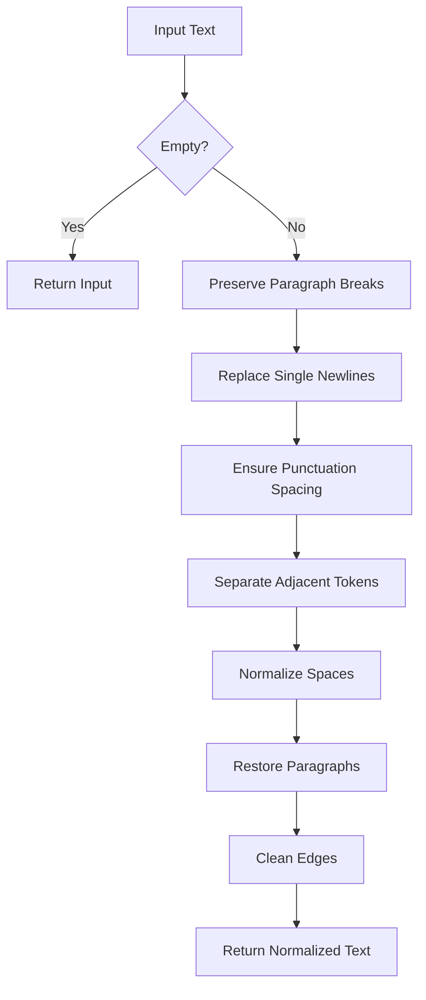
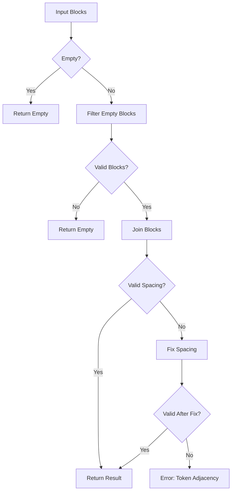
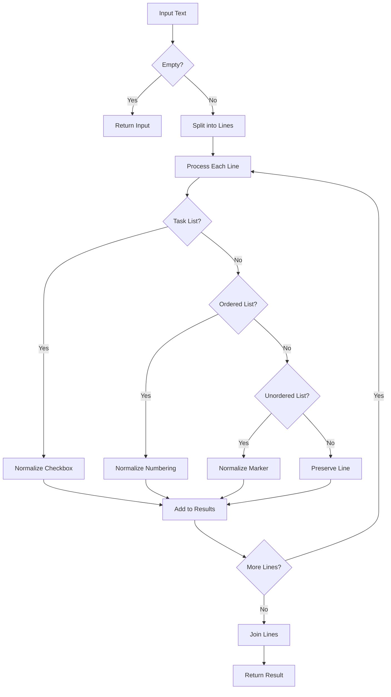
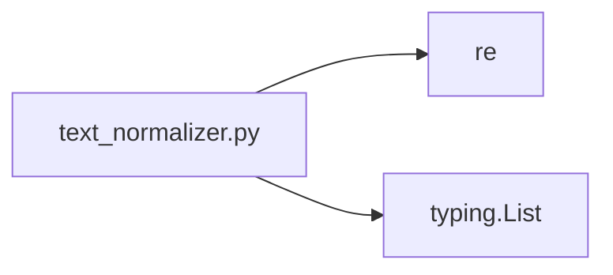

# Text Normalizer

<cite>
**Referenced Files in This Document**   
- [text_normalizer.py](file://markdown_chunker/chunker/text_normalizer.py)
- [core.py](file://markdown_chunker/chunker/core.py)
- [types.py](file://markdown_chunker/chunker/types.py)
- [base.py](file://markdown_chunker/chunker/strategies/base.py)
</cite>

## Table of Contents
1. [Introduction](#introduction)
2. [Project Structure](#project-structure)
3. [Core Components](#core-components)
4. [Architecture Overview](#architecture-overview)
5. [Detailed Component Analysis](#detailed-component-analysis)
6. [Dependency Analysis](#dependency-analysis)
7. [Performance Considerations](#performance-considerations)
8. [Troubleshooting Guide](#troubleshooting-guide)
9. [Conclusion](#conclusion)

## Introduction
The Text Normalizer is a utility module within the Markdown Chunker system designed to ensure proper whitespace preservation during text processing. It plays a critical role in maintaining token boundaries and preventing word concatenation issues that could arise during chunking operations. The module provides functions for normalizing whitespace, joining content blocks, and preserving list formatting while ensuring semantic integrity of the original content.

## Project Structure
The project follows a modular architecture with distinct components for parsing, chunking, API integration, and utilities. The core functionality is organized under the `markdown_chunker` directory, which contains specialized modules for different aspects of markdown processing. The Text Normalizer resides within the chunker component, working in conjunction with various chunking strategies and the orchestration system.

**Diagram sources**
- [text_normalizer.py](file://markdown_chunker/chunker/text_normalizer.py)
- [core.py](file://markdown_chunker/chunker/core.py)

## Core Components
The Text Normalizer module provides essential text processing utilities that ensure proper formatting and whitespace preservation during chunking operations. These functions are critical for maintaining the readability and semantic integrity of text content as it is processed through various chunking strategies.

**Section sources**
- [text_normalizer.py](file://markdown_chunker/chunker/text_normalizer.py#L1-L407)

## Architecture Overview
The Text Normalizer operates as a supporting component within the larger Markdown Chunker architecture. It is utilized by various chunking strategies and the core chunking process to ensure consistent text formatting. The normalization functions are called during content processing stages to prepare text for chunking and to validate proper spacing between tokens.

**Diagram sources**
- [text_normalizer.py](file://markdown_chunker/chunker/text_normalizer.py#L1-L407)
- [core.py](file://markdown_chunker/chunker/core.py#L1-L783)

## Detailed Component Analysis
The Text Normalizer module contains several key functions that work together to ensure proper text formatting and whitespace preservation. These functions are designed to handle various text processing scenarios while maintaining the structural integrity of the content.

### Text Normalization Functions
The module provides a comprehensive set of functions for text normalization, each addressing specific formatting concerns that arise during markdown processing.

#### Whitespace Normalization

**Diagram sources**
- [text_normalizer.py](file://markdown_chunker/chunker/text_normalizer.py#L19-L73)

#### Content Block Joining

**Diagram sources**
- [text_normalizer.py](file://markdown_chunker/chunker/text_normalizer.py#L76-L123)

#### List Content Normalization

**Diagram sources**
- [text_normalizer.py](file://markdown_chunker/chunker/text_normalizer.py#L126-L189)

## Dependency Analysis
The Text Normalizer module has minimal dependencies, primarily relying on Python's standard library components. It imports the `re` module for regular expression operations and typing utilities for type annotations. The module is designed to be self-contained and does not depend on other components within the markdown chunker system, making it reusable across different parts of the application.

**Diagram sources**
- [text_normalizer.py](file://markdown_chunker/chunker/text_normalizer.py#L15-L16)

## Performance Considerations
The Text Normalizer is optimized for efficiency with linear time complexity relative to the input text size. The normalization process involves multiple regular expression operations, but these are designed to be efficient and avoid backtracking issues. The functions are stateless and can be safely called in parallel, making them suitable for high-throughput processing scenarios.

## Troubleshooting Guide
When encountering issues with text normalization, consider the following common problems and solutions:

- **Token concatenation**: Ensure that `normalize_whitespace` is called on all text content before chunking
- **List formatting issues**: Verify that `normalize_list_content` is applied to list-heavy documents
- **Excessive whitespace**: Check that the normalization pipeline is not being applied multiple times
- **Paragraph break preservation**: Confirm that double newlines are being properly preserved in the output

**Section sources**
- [text_normalizer.py](file://markdown_chunker/chunker/text_normalizer.py#L1-L407)

## Conclusion
The Text Normalizer is a critical component of the Markdown Chunker system, ensuring that text content maintains proper formatting and whitespace throughout the chunking process. Its functions provide essential text processing capabilities that preserve the readability and semantic integrity of content while enabling effective chunking for various document types. The module's design emphasizes reliability, efficiency, and ease of integration with the broader system architecture.