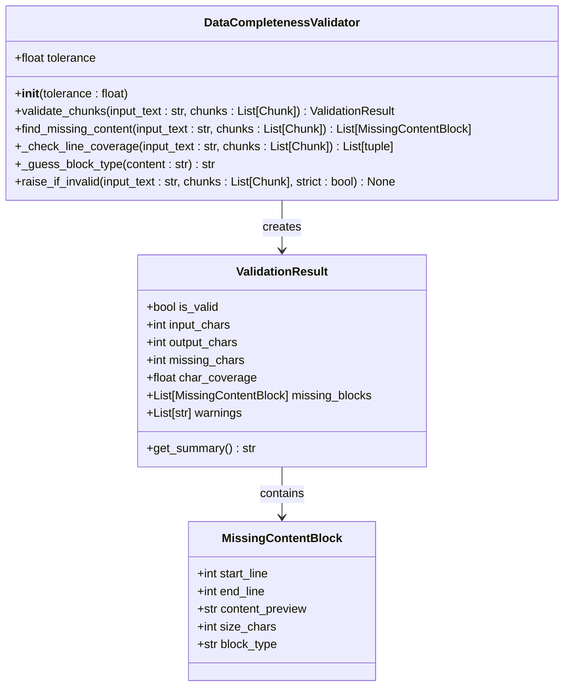
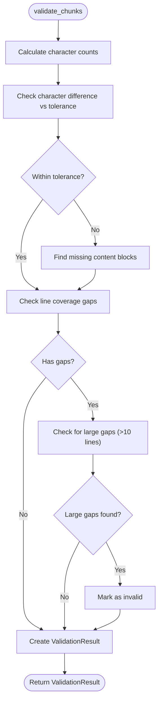
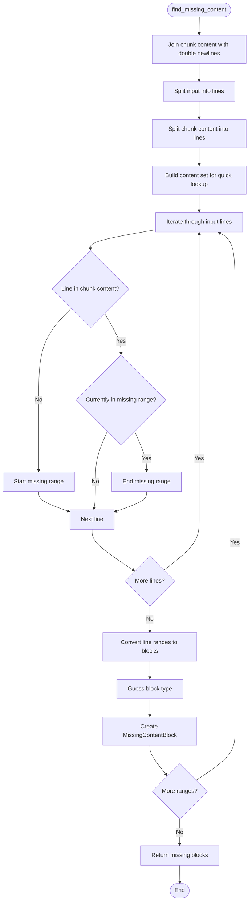
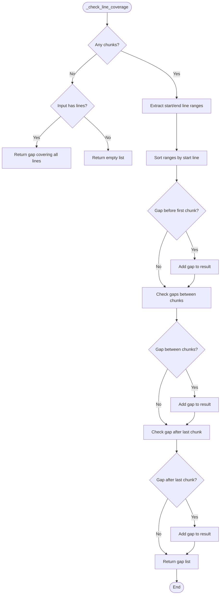
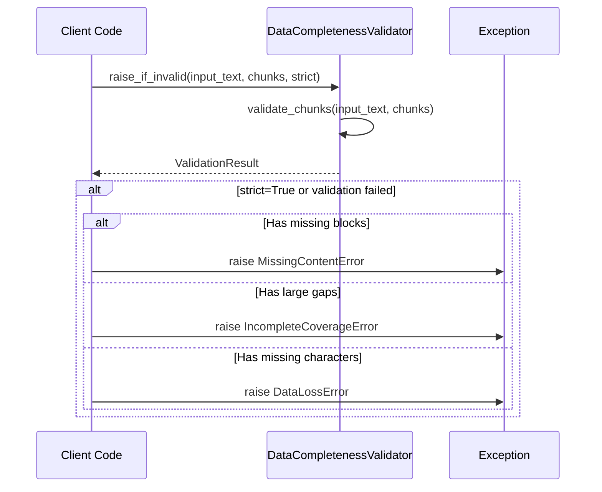

# Validation Framework

<cite>
**Referenced Files in This Document**
- [markdown_chunker/chunker/validator.py](file://markdown_chunker/chunker/validator.py)
- [markdown_chunker/chunker/errors.py](file://markdown_chunker/chunker/errors.py)
- [markdown_chunker/chunker/types.py](file://markdown_chunker/chunker/types.py)
- [tests/chunker/test_data_completeness_validator.py](file://tests/chunker/test_data_completeness_validator.py)
- [examples/basic_usage.py](file://examples/basic_usage.py)
- [examples/api_usage.py](file://examples/api_usage.py)
- [markdown_chunker/api/validator.py](file://markdown_chunker/api/validator.py)
</cite>

## Table of Contents
1. [Introduction](#introduction)
2. [DataCompletenessValidator Class](#datacompletenessvalidator-class)
3. [ValidationResult Dataclass](#validationresult-dataclass)
4. [Core Validation Methods](#core-validation-methods)
5. [Finding Missing Content](#finding-missing-content)
6. [Line Coverage Validation](#line-coverage-validation)
7. [Strict Validation with raise_if_invalid](#strict-validation-with-raise_if_invalid)
8. [Common Validation Issues](#common-validation-issues)
9. [Tolerance Configuration](#tolerance-configuration)
10. [Usage Examples](#usage-examples)
11. [Best Practices](#best-practices)

## Introduction

The validation framework in the markdown chunker ensures data integrity throughout the chunking process. It prevents data loss by validating that all input content appears in the output chunks, detecting missing content blocks, and identifying gaps in line coverage. The framework provides comprehensive validation feedback through the `DataCompletenessValidator` class and associated data structures.

## DataCompletenessValidator Class

The `DataCompletenessValidator` is the core component responsible for ensuring no data is lost during the chunking process. It validates that all input content appears in the output chunks, allowing for minor whitespace normalization differences.



**Diagram sources**
- [markdown_chunker/chunker/validator.py](file://markdown_chunker/chunker/validator.py#L53-L354)

### Initialization and Tolerance

The validator accepts a tolerance parameter that controls how much difference in character count is acceptable due to whitespace normalization:

```python
# Default tolerance (5%)
validator = DataCompletenessValidator()

# Custom tolerance (10%)
validator = DataCompletenessValidator(tolerance=0.10)
```

**Section sources**
- [markdown_chunker/chunker/validator.py](file://markdown_chunker/chunker/validator.py#L61-L69)

## ValidationResult Dataclass

The `ValidationResult` dataclass provides comprehensive validation feedback including character coverage, missing blocks, and warnings.

### ValidationResult Fields

| Field | Type | Description |
|-------|------|-------------|
| `is_valid` | `bool` | Whether validation passed |
| `input_chars` | `int` | Total characters in input |
| `output_chars` | `int` | Total characters in output chunks |
| `missing_chars` | `int` | Number of missing characters |
| `char_coverage` | `float` | Character coverage ratio (0.0-1.0) |
| `missing_blocks` | `List[MissingContentBlock]` | List of missing content blocks |
| `warnings` | `List[str]` | Validation warnings |

### Validation Summary

The `get_summary()` method provides a human-readable validation summary:

```python
# Valid result summary
"Validation passed: 98.0% coverage (98/100 chars)"

# Invalid result summary  
"Validation failed: 85.0% coverage (85/100 chars), missing 15 chars in 1 blocks"
```

**Section sources**
- [markdown_chunker/chunker/validator.py](file://markdown_chunker/chunker/validator.py#L25-L51)

## Core Validation Methods

### validate_chunks Method

The `validate_chunks` method performs comprehensive validation of the chunking process:



**Diagram sources**
- [markdown_chunker/chunker/validator.py](file://markdown_chunker/chunker/validator.py#L71-L151)

The method performs several key validations:
- **Character Count Comparison**: Ensures output characters are within tolerance of input characters
- **Line Coverage Gaps**: Detects gaps in line coverage between chunks
- **Missing Content Blocks**: Identifies specific content blocks that are missing

**Section sources**
- [markdown_chunker/chunker/validator.py](file://markdown_chunker/chunker/validator.py#L71-L151)

## Finding Missing Content

### find_missing_content Method

The `find_missing_content` method identifies specific content blocks that are missing from chunks by comparing input and output character counts per line.



**Diagram sources**
- [markdown_chunker/chunker/validator.py](file://markdown_chunker/chunker/validator.py#L153-L225)

### MissingContentBlock Structure

Each missing content block contains:
- **Line Range**: Start and end line numbers
- **Content Preview**: First 100 characters of missing content
- **Size**: Number of characters in the missing block
- **Block Type**: Type of content (paragraph, code, list, table, header)

**Section sources**
- [markdown_chunker/chunker/validator.py](file://markdown_chunker/chunker/validator.py#L153-L225)

## Line Coverage Validation

### _check_line_coverage Method

The `_check_line_coverage` method detects gaps in line coverage between chunks:



**Diagram sources**
- [markdown_chunker/chunker/validator.py](file://markdown_chunker/chunker/validator.py#L227-L275)

### Gap Detection Logic

The method identifies gaps by:
1. **Pre-chunk Gap**: Gap between line 1 and first chunk
2. **Between-chunk Gaps**: Gaps between consecutive chunks
3. **Post-chunk Gap**: Gap between last chunk and last line

**Section sources**
- [markdown_chunker/chunker/validator.py](file://markdown_chunker/chunker/validator.py#L227-L275)

## Strict Validation with raise_if_invalid

### raise_if_invalid Method

The `raise_if_invalid` method enforces strict validation by raising appropriate exceptions when validation fails:



**Diagram sources**
- [markdown_chunker/chunker/validator.py](file://markdown_chunker/chunker/validator.py#L314-L354)

### Exception Types

The method raises specific exceptions based on the type of validation failure:

| Exception Type | Condition | Description |
|----------------|-----------|-------------|
| `DataLossError` | Significant character loss (>10% or missing characters) | General data loss detection |
| `MissingContentError` | Specific content blocks missing | Missing content blocks identified |
| `IncompleteCoverageError` | Large gaps in line coverage (>10 lines) | Line coverage gaps detected |

**Section sources**
- [markdown_chunker/chunker/validator.py](file://markdown_chunker/chunker/validator.py#L314-L354)

## Common Validation Issues

### Significant Data Loss (>10%)

The validator automatically adds warnings when character loss exceeds 10%:

```python
# Warning added when loss > 10%
if char_diff_ratio > 0.1:
    warnings.append(
        f"Significant data loss: {char_diff_ratio:.1%} of content missing"
    )
```

### Large Line Coverage Gaps

The validator marks validation as invalid when gaps exceed 10 lines:

```python
# Large gaps detected
large_gaps = [gap for gap in line_gaps if gap[1] - gap[0] > 10]
if large_gaps:
    is_valid = False
    warnings.append(
        f"Found {len(large_gaps)} large gaps (>10 lines) in coverage"
    )
```

### Missing Content Blocks

The validator identifies specific content blocks that are missing:

- **Code Blocks**: Detected by ````` fences or indentation
- **Lists**: Detected by `- `, `* `, `+ `, or numbered prefixes
- **Tables**: Detected by pipe (`|`) separators
- **Headers**: Detected by `#` prefixes
- **Paragraphs**: Default type for unclassified content

**Section sources**
- [markdown_chunker/chunker/validator.py](file://markdown_chunker/chunker/validator.py#L126-L141)
- [markdown_chunker/chunker/validator.py](file://markdown_chunker/chunker/validator.py#L136-L141)

## Tolerance Configuration

### Default Tolerance Settings

The validator uses a default tolerance of 5% for whitespace normalization:

```python
# Default configuration
validator = DataCompletenessValidator(tolerance=0.05)

# Custom configuration
validator = DataCompletenessValidator(tolerance=0.10)  # 10% tolerance
```

### Tolerance Impact

- **Lower Tolerance (0.01-0.05)**: Strict validation, catches minor formatting differences
- **Higher Tolerance (0.10-0.20)**: More lenient, allows for significant whitespace changes
- **Zero Tolerance**: No difference allowed (not recommended for practical use)

### Choosing Appropriate Tolerance

| Use Case | Recommended Tolerance | Reason |
|----------|----------------------|---------|
| Production systems | 0.03-0.05 | Minimal data loss risk |
| Development/testing | 0.05-0.10 | Allow for formatting changes |
| Strict compliance | 0.01-0.03 | Maximum data integrity |

**Section sources**
- [markdown_chunker/chunker/validator.py](file://markdown_chunker/chunker/validator.py#L61-L69)

## Usage Examples

### Basic Validation

```python
from markdown_chunker.chunker.validator import DataCompletenessValidator, Chunk

# Create validator with default tolerance
validator = DataCompletenessValidator()

# Define chunks
chunks = [
    Chunk(content="# Header\n\nContent", start_line=1, end_line=3, metadata={})
]

# Validate
result = validator.validate_chunks("Input text", chunks)

print(f"Coverage: {result.char_coverage:.1%}")
print(f"Missing: {result.missing_chars} chars")
print(f"Valid: {result.is_valid}")

if not result.is_valid:
    print("Warnings:", result.warnings)
    print("Missing blocks:")
    for block in result.missing_blocks:
        print(f"  Lines {block.start_line}-{block.end_line}: {block.block_type}")
```

### Strict Validation with Error Handling

```python
try:
    validator.raise_if_invalid(input_text, chunks, strict=True)
except MissingContentError as e:
    print(f"Missing content: {len(e.missing_blocks)} blocks")
    for block in e.missing_blocks:
        print(f"  {block.start_line}-{block.end_line}: {block.content_preview}")
except IncompleteCoverageError as e:
    print(f"Line coverage gaps: {len(e.gaps)} gaps")
except DataLossError as e:
    print(f"Data loss: {e.missing_chars} chars missing")
```

### Custom Tolerance Configuration

```python
# Lenient validation for development
validator = DataCompletenessValidator(tolerance=0.10)

# Strict validation for production
validator = DataCompletenessValidator(tolerance=0.03)
```

**Section sources**
- [examples/basic_usage.py](file://examples/basic_usage.py#L1-L364)
- [examples/api_usage.py](file://examples/api_usage.py#L1-L356)

## Best Practices

### Validation Timing

1. **Post-processing Validation**: Always validate after chunking completes
2. **Continuous Monitoring**: Track validation results over time
3. **Threshold Alerts**: Set up alerts for validation failures

### Error Handling Strategies

1. **Graceful Degradation**: Continue processing with warnings when possible
2. **Fallback Mechanisms**: Use alternative strategies when validation fails
3. **Logging**: Log validation results for debugging and monitoring

### Configuration Recommendations

1. **Environment-specific Tolerance**: Different tolerances for dev/prod
2. **Content-type Specific Validation**: Adjust validation for different content types
3. **Regular Validation Reviews**: Periodically review validation results

### Integration Patterns

1. **Middleware Validation**: Integrate validation in API middlewares
2. **Batch Processing**: Validate batches of documents together
3. **Real-time Validation**: Validate as documents are processed

The validation framework provides robust data integrity checking for markdown chunking operations, ensuring that no content is lost during the chunking process while providing detailed feedback when issues occur.