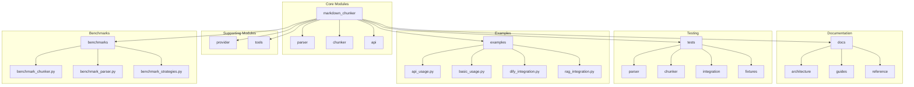
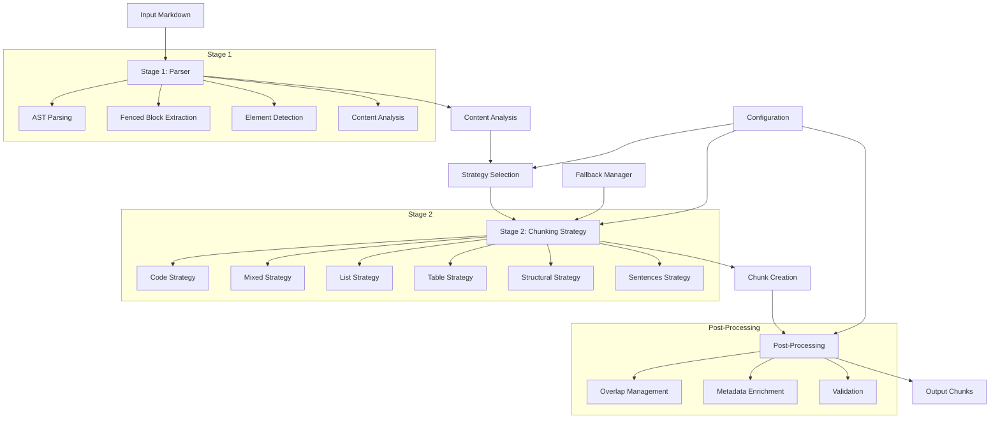
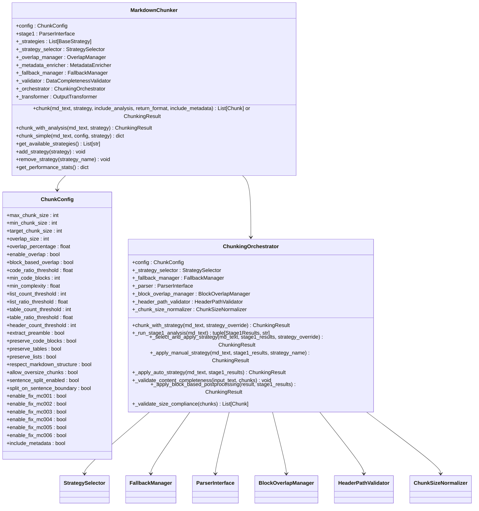
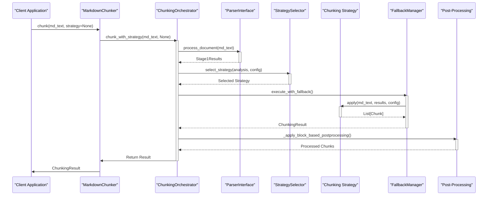
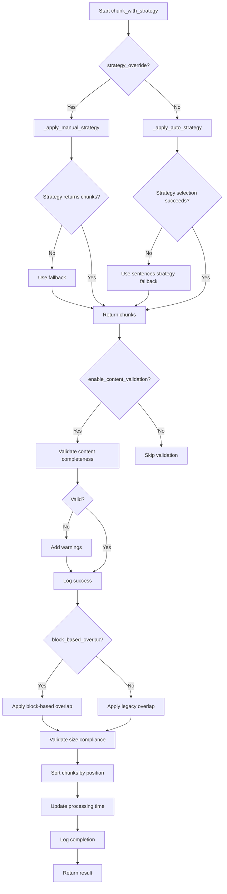
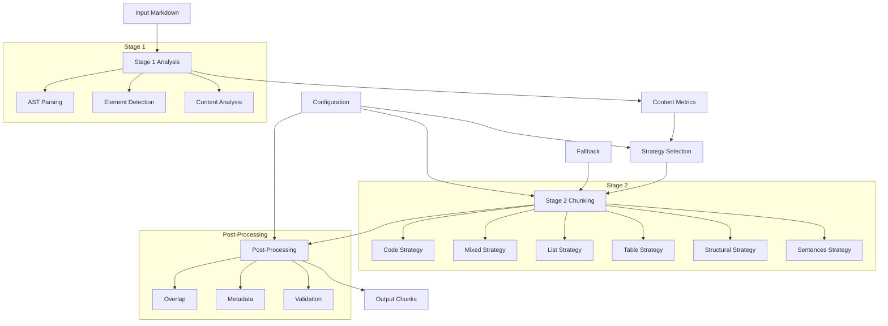
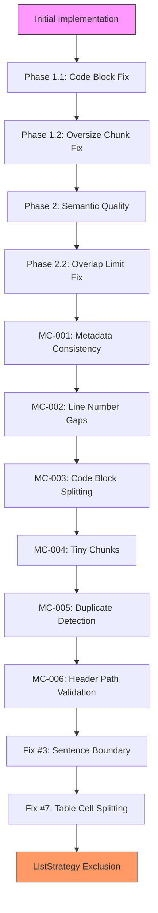

# Architecture Audit v2

<cite>
**Referenced Files in This Document**   
- [README.md](file://README.md)
- [docs/architecture/README.md](file://docs/architecture/README.md)
- [docs/architecture-audit-v2/README.md](file://docs/architecture-audit-v2/README.md)
- [docs/architecture-audit-v2/01-confirmed-findings.md](file://docs/architecture-audit-v2/01-confirmed-findings.md)
- [docs/architecture-audit-v2/02-new-discoveries.md](file://docs/architecture-audit-v2/02-new-discoveries.md)
- [docs/architecture-audit-v2/03-architectural-smells.md](file://docs/architecture-audit-v2/03-architectural-smells.md)
- [docs/architecture-audit-v2/04-domain-properties.md](file://docs/architecture-audit-v2/04-domain-properties.md)
- [docs/architecture-audit-v2/05-fix-archaeology.md](file://docs/architecture-audit-v2/05-fix-archaeology.md)
- [docs/architecture-audit-v2-to-be/README.md](file://docs/architecture-audit-v2-to-be/README.md)
- [markdown_chunker/__init__.py](file://markdown_chunker/__init__.py)
- [markdown_chunker/chunker/core.py](file://markdown_chunker/chunker/core.py)
- [markdown_chunker/chunker/orchestrator.py](file://markdown_chunker/chunker/orchestrator.py)
- [markdown_chunker/chunker/strategies/base.py](file://markdown_chunker/chunker/strategies/base.py)
- [markdown_chunker/chunker/types.py](file://markdown_chunker/chunker/types.py)
- [markdown_chunker/parser/core.py](file://markdown_chunker/parser/core.py)
</cite>

## Table of Contents
1. [Introduction](#introduction)
2. [Project Structure](#project-structure)
3. [Core Components](#core-components)
4. [Architecture Overview](#architecture-overview)
5. [Detailed Component Analysis](#detailed-component-analysis)
6. [Dependency Analysis](#dependency-analysis)
7. [Performance Considerations](#performance-considerations)
8. [Troubleshooting Guide](#troubleshooting-guide)
9. [Conclusion](#conclusion)
10. [Appendices](#appendices)

## Introduction
This document presents a comprehensive architecture audit of the Dify Markdown Chunker project, consolidating findings from the initial audit with additional deep code analysis discoveries. The audit reveals that the system has evolved through iterative patching, resulting in significant complexity that impedes development and maintenance. Despite satisfying all functional requirements through 10 essential domain properties, the implementation has become unnecessarily complex with 55 files, 32 configuration parameters, and 1,853 tests. The audit validates that a complete redesign following domain-driven design principles will produce a simpler, more maintainable system that preserves all functionality while eliminating accumulated technical debt.

**Section sources**
- [docs/architecture-audit-v2/README.md](file://docs/architecture-audit-v2/README.md)
- [README.md](file://README.md)

## Project Structure
The Dify Markdown Chunker project is organized into a modular structure with clear separation of concerns between components. The core functionality is divided into three main modules: parser, chunker, and api, with additional directories for benchmarks, documentation, examples, tests, and tools. The parser module handles content analysis and parsing, the chunker module implements adaptive chunking strategies, and the api module provides REST API adapters for integration. The project includes comprehensive documentation in the docs/ directory, covering architecture, usage, and development guides. Test files are organized by component with fixtures for different document types, and examples demonstrate various usage scenarios. The structure reflects an initial modular design that has become over-engineered through the accumulation of patches and features.

**Diagram sources **
- [README.md](file://README.md#L96-L118)
- [docs/architecture/README.md](file://docs/architecture/README.md#L17-L31)

**Section sources**
- [README.md](file://README.md#L96-L118)
- [docs/architecture/README.md](file://docs/architecture/README.md#L17-L31)

## Core Components
The core components of the Dify Markdown Chunker are organized around a two-stage processing pipeline. The first stage, implemented in the parser module, performs content analysis and structural parsing of Markdown documents. The second stage, implemented in the chunker module, applies adaptive strategies to create semantically meaningful chunks based on the analysis from stage one. The system features six chunking strategies (Code, Mixed, List, Table, Structural, Sentences) with automatic selection based on content characteristics. The orchestrator coordinates strategy selection and execution, while components handle overlap management, metadata enrichment, and validation. The public API provides convenience functions for chunking text and files, with backward compatibility maintained through provider integration.

**Section sources**
- [markdown_chunker/__init__.py](file://markdown_chunker/__init__.py#L20-L168)
- [markdown_chunker/chunker/core.py](file://markdown_chunker/chunker/core.py#L41-L796)
- [markdown_chunker/chunker/orchestrator.py](file://markdown_chunker/chunker/orchestrator.py#L44-L666)

## Architecture Overview
The architecture of the Dify Markdown Chunker follows a two-stage processing model with clear separation between content analysis and chunking logic. The first stage (parser) analyzes the Markdown document to extract structural elements, detect code blocks, and calculate content metrics. The second stage (chunker) uses this analysis to select and apply an appropriate chunking strategy. The system employs a strategy pattern with six different approaches for handling various content types, with automatic selection based on document characteristics. A fallback mechanism ensures robustness when primary strategies fail. The architecture includes dual mechanisms for critical features like overlap management and post-processing, resulting from incremental patching rather than holistic design. Despite satisfying all functional requirements, the implementation has become overly complex with excessive configuration parameters and test redundancy.

**Diagram sources **
- [docs/architecture/README.md](file://docs/architecture/README.md#L35-L54)
- [markdown_chunker/chunker/core.py](file://markdown_chunker/chunker/core.py#L41-L796)

## Detailed Component Analysis

### Component A Analysis
The MarkdownChunker class serves as the main interface for the chunking system, orchestrating the entire processing pipeline. It initializes with a configuration object that controls all aspects of chunking behavior, including size limits, strategy selection thresholds, and feature flags. The chunk() method is the primary entry point, coordinating content analysis, strategy selection, chunk creation, and post-processing. The system maintains two parallel implementations for critical features: BlockOverlapManager and OverlapManager for overlap handling, and block-based vs legacy post-processing pipelines. Configuration bloat is evident with 32 parameters, including 6 flags specifically for enabling bug fixes (MC-001 through MC-006). The ListStrategy (856 lines) is explicitly excluded from auto-selection despite being fully implemented and tested, representing significant dead code.

#### For Object-Oriented Components:

**Diagram sources **
- [markdown_chunker/chunker/core.py](file://markdown_chunker/chunker/core.py#L41-L796)
- [markdown_chunker/chunker/orchestrator.py](file://markdown_chunker/chunker/orchestrator.py#L44-L666)
- [markdown_chunker/chunker/types.py](file://markdown_chunker/chunker/types.py#L501-L800)

#### For API/Service Components:

**Diagram sources **
- [markdown_chunker/chunker/core.py](file://markdown_chunker/chunker/core.py#L155-L268)
- [markdown_chunker/chunker/orchestrator.py](file://markdown_chunker/chunker/orchestrator.py#L86-L189)

#### For Complex Logic Components:

**Diagram sources **
- [markdown_chunker/chunker/orchestrator.py](file://markdown_chunker/chunker/orchestrator.py#L86-L189)
- [markdown_chunker/chunker/core.py](file://markdown_chunker/chunker/core.py#L269-L358)

**Section sources**
- [markdown_chunker/chunker/core.py](file://markdown_chunker/chunker/core.py#L41-L796)
- [markdown_chunker/chunker/orchestrator.py](file://markdown_chunker/chunker/orchestrator.py#L44-L666)

### Conceptual Overview
The Dify Markdown Chunker system follows a two-stage processing model where the first stage analyzes the Markdown document to extract structural information and the second stage applies adaptive strategies to create semantically meaningful chunks. The system automatically selects the optimal strategy based on content characteristics, with fallback mechanisms to ensure robustness. Despite satisfying all functional requirements through 10 essential domain properties, the implementation has become overly complex due to iterative patching without architectural refactoring. The system maintains dual mechanisms for critical features like overlap management and post-processing, resulting from incremental fixes rather than holistic design. Configuration bloat with 32 parameters, including 6 flags specifically for enabling bug fixes, creates decision paralysis for users. The test suite of 1,853 tests focuses primarily on implementation details rather than domain properties, creating brittleness during refactoring.

[No sources needed since this diagram shows conceptual workflow, not actual code structure]

[No sources needed since this section doesn't analyze specific source files]

## Dependency Analysis
The Dify Markdown Chunker has accumulated significant technical debt through iterative patching, resulting in multiple layers of dependencies and architectural smells. The system exhibits a "fix-upon-fix" pattern with at least 10 layers of patches documented in the code, including Phase 1, Phase 1.1, Phase 1.2, Phase 2, Phase 2.2, and MC-series fixes. This has led to dual implementations for critical features: BlockOverlapManager and OverlapManager for overlap handling, and block-based vs legacy post-processing pipelines. Configuration bloat is evident with 32 parameters, including 6 flags specifically for enabling bug fixes (MC-001 through MC-006). The system maintains backward compatibility with deprecated components like the Simple API and backward compatibility aliases, preventing architectural improvements. The test suite of 1,853 tests focuses primarily on implementation details rather than domain properties, creating brittleness during refactoring.

**Diagram sources **
- [docs/architecture-audit-v2/05-fix-archaeology.md](file://docs/architecture-audit-v2/05-fix-archaeology.md#L22-L574)

**Section sources**
- [docs/architecture-audit-v2/05-fix-archaeology.md](file://docs/architecture-audit-v2/05-fix-archaeology.md#L22-L574)
- [docs/architecture-audit-v2/03-architectural-smells.md](file://docs/architecture-audit-v2/03-architectural-smells.md#L14-L361)

## Performance Considerations
The Dify Markdown Chunker exhibits performance issues due to architectural inefficiencies, particularly the double invocation of Stage1 processing when preamble extraction is enabled. This results in approximately 75% duplicate work for documents with preambles, with benchmark results showing 79% overhead (8.2ms vs 14.7ms for a 10KB document). The system's complexity, with 55 files and 24,000 lines of code, contributes to increased memory usage and processing time. The test suite of 1,853 tests, primarily focused on implementation details, creates significant overhead during development and continuous integration. Despite these issues, the system satisfies all 10 essential domain properties, indicating that performance improvements can be achieved through architectural simplification rather than algorithmic optimization. The target architecture proposes a 79% reduction in code size and 97% reduction in test count, which should significantly improve performance while maintaining functionality.

**Section sources**
- [docs/architecture-audit-v2/02-new-discoveries.md](file://docs/architecture-audit-v2/02-new-discoveries.md#L28-L69)
- [docs/architecture-audit-v2/README.md](file://docs/architecture-audit-v2/README.md#L168-L178)

## Troubleshooting Guide
The Dify Markdown Chunker system presents several troubleshooting challenges due to its architectural complexity and configuration bloat. The most significant issue is the double invocation of Stage1 processing when preamble extraction is enabled, resulting in approximately 79% performance overhead. Configuration mismatches between documentation and implementation, such as the code_ratio_threshold default value (documented as 0.7 but implemented as 0.3), cause user confusion and unexpected behavior. The presence of 6 configuration parameters specifically for enabling bug fixes (MC-001 through MC-006) suggests architectural instability. The ListStrategy (856 lines) is explicitly excluded from auto-selection despite being fully implemented and tested, representing significant dead code. Users may encounter issues with deprecated components like the Simple API, which generates deprecation warnings but remains in the codebase for backward compatibility.

**Section sources**
- [docs/architecture-audit-v2/02-new-discoveries.md](file://docs/architecture-audit-v2/02-new-discoveries.md#L13-L624)
- [docs/architecture-audit-v2/01-confirmed-findings.md](file://docs/architecture-audit-v2/01-confirmed-findings.md#L1-L384)

## Conclusion
The Dify Markdown Chunker project, while functionally complete and satisfying all 10 essential domain properties, suffers from significant architectural debt accumulated through iterative patching without holistic refactoring. The system has evolved into an overly complex codebase with 55 files, 32 configuration parameters, and 1,853 tests, making it difficult to maintain and extend. The audit confirms critical issues including over-engineering, fix-upon-fix patterns, test debt, dual mechanisms for critical features, and configuration bloat. New discoveries reveal additional problems such as double Stage1 invocation, documentation-code mismatches, and 856 lines of unused ListStrategy code. The recommended path forward is a complete redesign following domain-driven design principles, reducing the codebase to approximately 12 files, 8 configuration parameters, and 50 property-based tests while preserving all functionality. This approach will produce a simpler, more maintainable system that eliminates accumulated technical debt.

[No sources needed since this section summarizes without analyzing specific files]