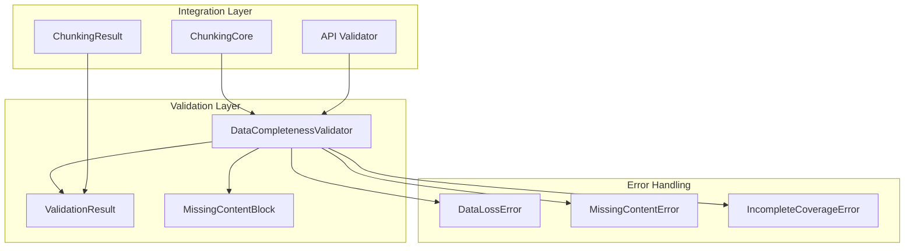
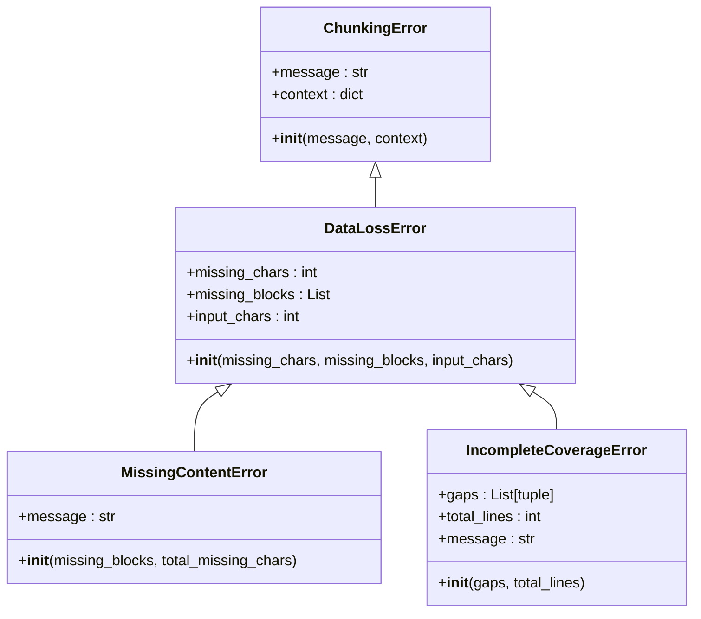
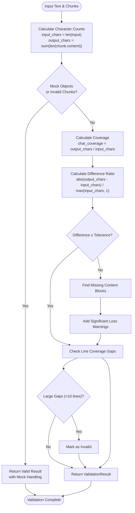
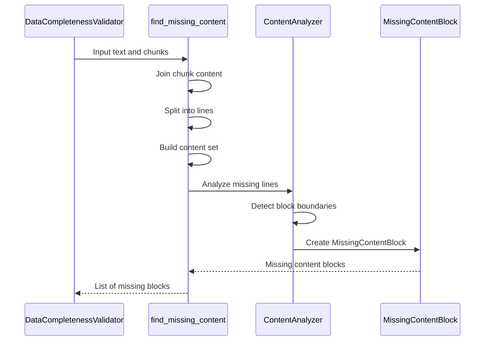
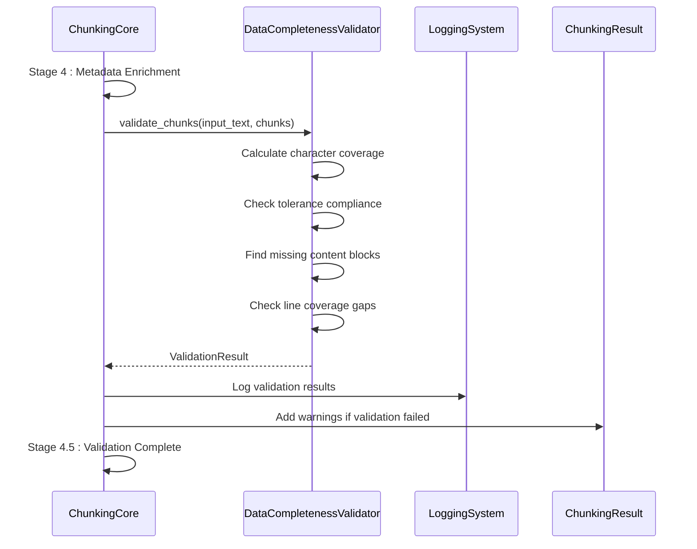

# Data Validation

<cite>
**Referenced Files in This Document**
- [markdown_chunker/chunker/validator.py](file://markdown_chunker/chunker/validator.py)
- [tests/chunker/test_data_completeness_validator.py](file://tests/chunker/test_data_completeness_validator.py)
- [markdown_chunker/chunker/types.py](file://markdown_chunker/chunker/types.py)
- [markdown_chunker/chunker/errors.py](file://markdown_chunker/chunker/errors.py)
- [markdown_chunker/chunker/core.py](file://markdown_chunker/chunker/core.py)
- [markdown_chunker/api/validator.py](file://markdown_chunker/api/validator.py)
- [examples/basic_usage.py](file://examples/basic_usage.py)
</cite>

## Table of Contents
1. [Introduction](#introduction)
2. [System Architecture](#system-architecture)
3. [Core Data Structures](#core-data-structures)
4. [DataCompletenessValidator Implementation](#datacompletenessvalidator-implementation)
5. [Validation Process Flow](#validation-process-flow)
6. [Error Handling and Recovery](#error-handling-and-recovery)
7. [Configuration Options](#configuration-options)
8. [Integration with Chunking Pipeline](#integration-with-chunking-pipeline)
9. [Quality Assurance in RAG Pipelines](#quality-assurance-in-rag-pipelines)
10. [Testing and Validation Scenarios](#testing-and-validation-scenarios)
11. [Best Practices and Recommendations](#best-practices-and-recommendations)

## Introduction

The data validation system in the Markdown Chunker ensures content completeness and integrity after the chunking process. It provides robust validation mechanisms to detect missing content, measure character coverage, and maintain quality standards essential for Retrieval-Augmented Generation (RAG) pipelines and document processing workflows.

The validation system operates as a critical quality assurance component that prevents data loss during the chunking transformation process. It compares input text length against the sum of chunk content lengths to calculate character coverage and identifies missing content blocks with detailed reporting capabilities.

## System Architecture

The data validation system follows a layered architecture with clear separation of concerns:



**Diagram sources**
- [markdown_chunker/chunker/validator.py](file://markdown_chunker/chunker/validator.py#L53-L354)
- [markdown_chunker/chunker/errors.py](file://markdown_chunker/chunker/errors.py#L111-L210)
- [markdown_chunker/chunker/core.py](file://markdown_chunker/chunker/core.py#L287-L326)

## Core Data Structures

### ValidationResult

The `ValidationResult` dataclass serves as the primary output container for validation outcomes, providing comprehensive information about the validation process:

| Field | Type | Description | Purpose |
|-------|------|-------------|---------|
| `is_valid` | `bool` | Overall validation success flag | Indicates whether content completeness is maintained |
| `input_chars` | `int` | Total characters in input text | Reference for calculating coverage ratios |
| `output_chars` | `int` | Total characters in all chunks | Sum of chunk content lengths |
| `missing_chars` | `int` | Number of missing characters | Direct measure of data loss |
| `char_coverage` | `float` | Character coverage ratio (0.0-1.0) | Percentage of content preserved |
| `missing_blocks` | `List[MissingContentBlock]` | Detailed missing content information | Specific locations of missing content |
| `warnings` | `List[str]` | Validation warnings and recommendations | Non-fatal issues requiring attention |

### MissingContentBlock

The `MissingContentBlock` dataclass provides detailed information about specific content areas that are missing from the chunked output:

| Field | Type | Description | Use Case |
|-------|------|-------------|----------|
| `start_line` | `int` | Starting line number (1-based) | Precise location identification |
| `end_line` | `int` | Ending line number (1-based) | Range specification |
| `content_preview` | `str` | First 100 characters of missing content | Content analysis and debugging |
| `size_chars` | `int` | Total character count of missing block | Quantitative analysis |
| `block_type` | `str` | Content type classification | Content-aware processing |

### Error Hierarchy

The validation system implements a comprehensive error hierarchy for different types of data loss scenarios:



**Diagram sources**
- [markdown_chunker/chunker/errors.py](file://markdown_chunker/chunker/errors.py#L11-L210)

**Section sources**
- [markdown_chunker/chunker/validator.py](file://markdown_chunker/chunker/validator.py#L14-L51)
- [markdown_chunker/chunker/errors.py](file://markdown_chunker/chunker/errors.py#L111-L210)

## DataCompletenessValidator Implementation

### Core Validation Algorithm

The `DataCompletenessValidator` implements a sophisticated validation algorithm that compares input and output character counts while accounting for whitespace normalization differences:



**Diagram sources**
- [markdown_chunker/chunker/validator.py](file://markdown_chunker/chunker/validator.py#L71-L151)

### Tolerance-Based Validation

The validator implements a configurable tolerance system that accounts for legitimate whitespace normalization differences:

- **Default Tolerance**: 5% (0.05) allows for minor formatting variations
- **Character Difference Calculation**: `abs(output_chars - input_chars) / max(input_chars, 1)`
- **Validation Decision**: `char_diff_ratio <= tolerance`

### Missing Content Detection

When validation fails, the system employs a sophisticated algorithm to identify specific missing content blocks:



**Diagram sources**
- [markdown_chunker/chunker/validator.py](file://markdown_chunker/chunker/validator.py#L153-L225)

### Line Coverage Analysis

The validator performs comprehensive line coverage analysis to detect gaps in processed content:

- **Gap Detection**: Identifies consecutive line ranges that are not covered
- **Threshold**: Large gaps (>10 lines) trigger validation failure
- **Integration**: Works alongside character coverage validation

**Section sources**
- [markdown_chunker/chunker/validator.py](file://markdown_chunker/chunker/validator.py#L53-L354)

## Validation Process Flow

### Stage 4 Integration

The validation process integrates seamlessly into the chunking pipeline during Stage 4 (metadata enrichment):



**Diagram sources**
- [markdown_chunker/chunker/core.py](file://markdown_chunker/chunker/core.py#L287-L326)

### Error Handling Strategy

The validation system implements a graceful degradation strategy:

1. **Validation Failure**: Does not halt chunking process
2. **Warning Generation**: Adds validation information to warnings
3. **Logging**: Comprehensive logging for debugging
4. **Fallback Preservation**: Maintains fallback functionality

**Section sources**
- [markdown_chunker/chunker/core.py](file://markdown_chunker/chunker/core.py#L287-L326)

## Error Handling and Recovery

### Validation Error Types

The system provides specialized error types for different validation scenarios:

#### DataLossError
- **Trigger**: General data loss detection
- **Context**: Missing characters and blocks
- **Recovery**: Retry with different strategy or manual intervention

#### MissingContentError  
- **Trigger**: Specific content blocks are missing
- **Context**: Detailed missing block information
- **Recovery**: Analyze missing content patterns

#### IncompleteCoverageError
- **Trigger**: Large gaps in line coverage
- **Context**: Gap locations and sizes
- **Recovery**: Adjust chunking strategy

### Strict Mode Validation

The validator supports a strict mode that raises exceptions for validation failures:

```python
# Strict validation with exception throwing
validator.raise_if_invalid(input_text, chunks, strict=True)
```

This mode is useful for quality assurance workflows where validation failures must be addressed immediately.

**Section sources**
- [markdown_chunker/chunker/validator.py](file://markdown_chunker/chunker/validator.py#L314-L354)
- [markdown_chunker/chunker/errors.py](file://markdown_chunker/chunker/errors.py#L111-L210)

## Configuration Options

### Tolerance Settings

The `DataCompletenessValidator` accepts a tolerance parameter for whitespace normalization:

```python
# Default tolerance (5%)
validator = DataCompletenessValidator()

# Custom tolerance (10%)
validator = DataCompletenessValidator(tolerance=0.10)
```

### API Configuration Limits

The API validator enforces reasonable limits for configuration parameters:

| Parameter | Default | Minimum | Maximum | Purpose |
|-----------|---------|---------|---------|---------|
| `max_chunk_size` | 4096 | 10 | 100,000 | Prevents excessively large chunks |
| `min_chunk_size` | 512 | 10 | 4096 | Ensures minimum chunk size |
| `overlap_size` | 200 | 0 | 4096 | Controls overlap between chunks |
| `code_ratio_threshold` | 0.3 | 0.0 | 1.0 | Strategy selection threshold |
| `list_ratio_threshold` | 0.6 | 0.0 | 1.0 | List content detection |
| `table_ratio_threshold` | 0.4 | 0.0 | 1.0 | Table content detection |

### Content Size Validation

The API validator enforces content size limits:

- **Minimum Content Size**: 1 byte (ensures non-empty content)
- **Maximum Content Size**: 10 MB (prevents memory issues)
- **Size Validation**: UTF-8 encoded byte counting

**Section sources**
- [markdown_chunker/chunker/validator.py](file://markdown_chunker/chunker/validator.py#L61-L70)
- [markdown_chunker/api/validator.py](file://markdown_chunker/api/validator.py#L19-L24)

## Integration with Chunking Pipeline

### Automatic Validation

Validation runs automatically after chunk generation:

```python
# Automatic validation in chunking pipeline
result = chunker.chunk_with_analysis(input_text)
# Validation occurs internally
# Results available in result.warnings
```

### Manual Validation

Developers can perform validation manually for specific use cases:

```python
# Manual validation
validator = DataCompletenessValidator(tolerance=0.05)
validation_result = validator.validate_chunks(input_text, chunks)
```

### Warning Integration

Validation warnings integrate seamlessly with the chunking result system:

```python
# Validation warnings become part of ChunkingResult
if not validation_result.is_valid:
    result.warnings.extend(validation_result.warnings)
    result.warnings.append(f"Data completeness check: {coverage:.1%} coverage")
```

**Section sources**
- [markdown_chunker/chunker/core.py](file://markdown_chunker/chunker/core.py#L287-L326)

## Quality Assurance in RAG Pipelines

### Importance in RAG Systems

Data validation is crucial for Retrieval-Augmented Generation pipelines:

1. **Content Integrity**: Ensures no critical information is lost
2. **Retrieval Quality**: Maintains high-quality source material
3. **Generation Accuracy**: Prevents hallucination from incomplete contexts
4. **Pipeline Reliability**: Provides early detection of processing issues

### Validation Metrics for RAG

Key metrics tracked by the validation system:

- **Character Coverage**: Percentage of original content preserved
- **Missing Content Blocks**: Specific areas requiring attention
- **Line Coverage Gaps**: Structural completeness indicators
- **Validation Warnings**: Non-fatal issues affecting quality

### Quality Thresholds

Recommended thresholds for RAG pipeline quality:

| Metric | Recommended Threshold | Warning Level | Critical Level |
|--------|----------------------|---------------|----------------|
| Character Coverage | ≥ 95% | ≥ 90% | < 90% |
| Missing Characters | ≤ 5% | ≤ 10% | > 10% |
| Large Coverage Gaps | 0 | ≤ 2 | > 2 |

### Integration Patterns

Common integration patterns for RAG quality assurance:

```python
# Pattern 1: Strict validation for production
try:
    validator.raise_if_invalid(input_text, chunks, strict=True)
except DataLossError as e:
    # Fail fast in production
    raise ProcessingError(f"Critical data loss: {e}")

# Pattern 2: Warning-based validation for development
validation_result = validator.validate_chunks(input_text, chunks)
if not validation_result.is_valid:
    logger.warning(f"Quality issue detected: {validation_result.get_summary()}")
    # Continue with warnings
```

## Testing and Validation Scenarios

### Test Coverage Areas

The validation system includes comprehensive test coverage:

#### Perfect Match Scenario
- **Input**: Exact copy of original text
- **Expected**: `is_valid = True`, `missing_chars = 0`
- **Purpose**: Validates basic functionality

#### Tolerance Boundary Testing
- **Scenario**: Small whitespace differences within tolerance
- **Expected**: `is_valid = True` despite minor differences
- **Purpose**: Tests tolerance mechanism

#### Significant Data Loss
- **Scenario**: Large portions of content missing
- **Expected**: `is_valid = False`, detailed missing blocks
- **Purpose**: Validates detection of serious issues

#### Line Coverage Gaps
- **Scenario**: Content with large gaps between chunks
- **Expected**: Large gap detection and validation failure
- **Purpose**: Tests structural completeness checking

#### Edge Cases
- **Empty input**: Handles zero-length content gracefully
- **Mock objects**: Graceful degradation with test mocks
- **Unicode content**: Proper UTF-8 handling
- **Large documents**: Memory-efficient processing

### Validation Result Examples

#### Successful Validation
```python
# Input: "Hello\nWorld"
# Chunks: ["Hello\nWorld"]
result = ValidationResult(
    is_valid=True,
    input_chars=11,
    output_chars=11,
    missing_chars=0,
    char_coverage=1.0,
    missing_blocks=[],
    warnings=[]
)
```

#### Failed Validation with Missing Content
```python
# Input: "Hello\nWorld\nGoodbye"
# Chunks: ["Hello\nWorld"]
result = ValidationResult(
    is_valid=False,
    input_chars=18,
    output_chars=11,
    missing_chars=7,
    char_coverage=0.61,
    missing_blocks=[
        MissingContentBlock(
            start_line=3,
            end_line=3,
            content_preview="Goodbye",
            size_chars=7,
            block_type="paragraph"
        )
    ],
    warnings=["Significant data loss: 38.9% of content missing"]
)
```

**Section sources**
- [tests/chunker/test_data_completeness_validator.py](file://tests/chunker/test_data_completeness_validator.py#L22-L419)

## Best Practices and Recommendations

### Configuration Guidelines

#### Tolerance Selection
- **Development**: Use lower tolerance (0.01-0.03) for strict validation
- **Production**: Use moderate tolerance (0.05-0.10) for practical flexibility
- **High-stakes content**: Consider zero tolerance for critical documents

#### Validation Strategy
- **Automated Pipelines**: Use automatic validation with warnings
- **Manual Review**: Enable strict validation for quality-critical workflows
- **Batch Processing**: Implement validation monitoring and alerting

### Performance Considerations

#### Memory Efficiency
- **Large Documents**: The validator processes content efficiently without loading entire documents into memory
- **Streaming Support**: Integrates with streaming chunking for large files
- **Memory Monitoring**: Validates don't consume excessive memory

#### Processing Time
- **Linear Complexity**: Validation runs in O(n) time where n is the number of lines
- **Minimal Overhead**: Adds negligible processing overhead to chunking pipeline
- **Parallel Processing**: Can be executed in parallel with other chunking stages

### Monitoring and Alerting

#### Key Metrics to Monitor
- **Validation Success Rate**: Percentage of successful validations
- **Missing Character Rate**: Average missing characters per document
- **Large Gap Frequency**: Rate of structural completeness issues
- **Validation Error Distribution**: Types of validation failures

#### Alerting Thresholds
- **Success Rate**: < 95% triggers investigation
- **Missing Characters**: > 5% average missing triggers review
- **Large Gaps**: > 10% documents with gaps require attention

### Integration with CI/CD

#### Pre-commit Validation
```python
# Pre-commit hook example
def validate_before_commit():
    validator = DataCompletenessValidator(tolerance=0.05)
    validation_result = validator.validate_chunks(input_text, chunks)
    if not validation_result.is_valid:
        raise CommitError(f"Validation failed: {validation_result.get_summary()}")
```

#### Continuous Integration
```python
# CI pipeline validation
def ci_validation_workflow():
    validator = DataCompletenessValidator(tolerance=0.03)
    for document in test_documents:
        result = validator.validate_chunks(document, chunks)
        assert result.is_valid, f"Validation failed for {document}"
```

### Debugging and Troubleshooting

#### Common Issues and Solutions

| Issue | Symptoms | Solution |
|-------|----------|----------|
| High Missing Character Rate | `char_coverage < 0.90` | Check chunking strategy selection |
| Large Coverage Gaps | `large_gaps > 0` | Adjust chunk size or overlap settings |
| False Positives | Valid content marked as missing | Increase tolerance or adjust strategy thresholds |
| Performance Issues | Slow validation on large documents | Use streaming configuration or reduce validation scope |

#### Diagnostic Tools
- **Validation Summary**: Use `get_summary()` for human-readable reports
- **Missing Blocks Analysis**: Examine `missing_blocks` for specific issues
- **Coverage Visualization**: Compare `char_coverage` with expected values
- **Line Gap Analysis**: Investigate `line_gaps` for structural problems

### Future Enhancements

#### Planned Improvements
- **Advanced Content Matching**: Semantic similarity detection for content loss
- **Machine Learning Integration**: AI-powered validation scoring
- **Real-time Monitoring**: Live validation metrics and dashboards
- **Custom Validation Rules**: User-defined validation criteria

#### Extensibility
The validation system is designed for extensibility:
- **Custom Validators**: Plugin architecture for domain-specific validation
- **Cross-document Validation**: Compare related documents for consistency
- **Historical Analysis**: Track validation trends over time

**Section sources**
- [examples/basic_usage.py](file://examples/basic_usage.py#L1-L364)
- [markdown_chunker/api/validator.py](file://markdown_chunker/api/validator.py#L12-L321)