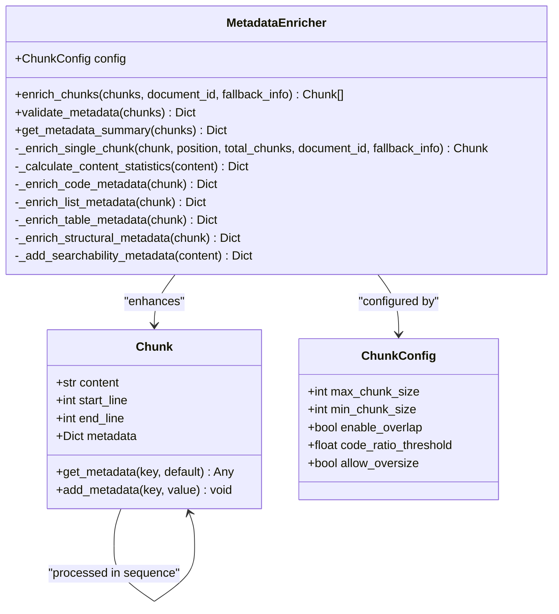
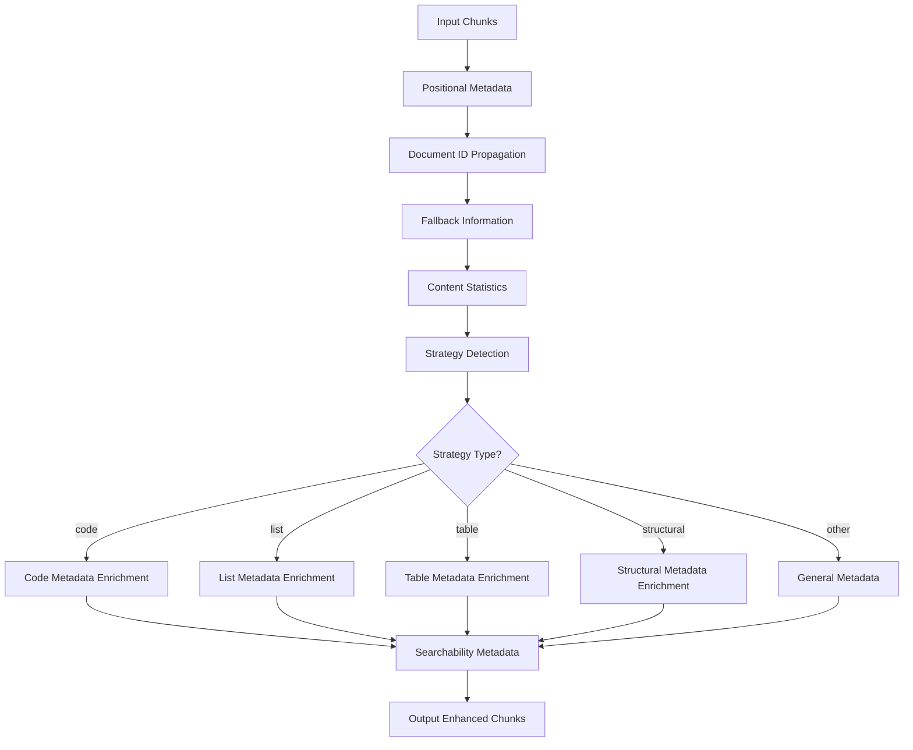
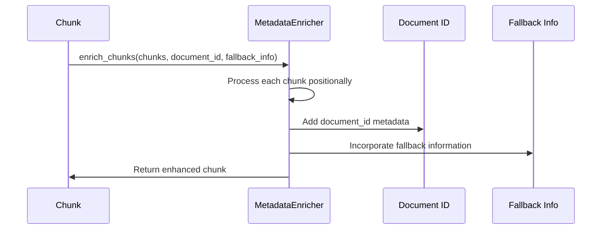
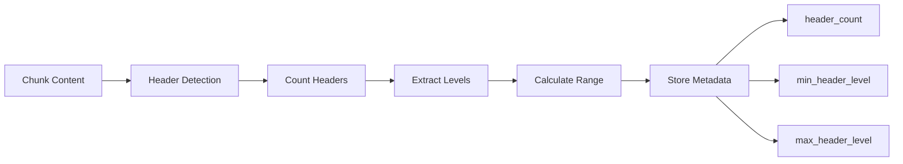
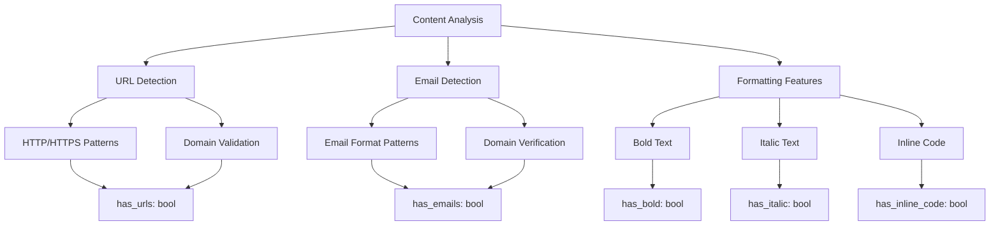
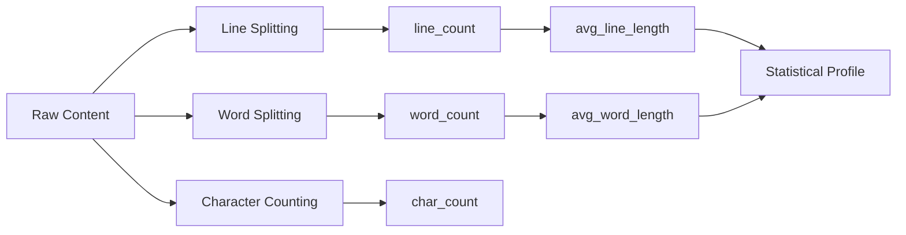
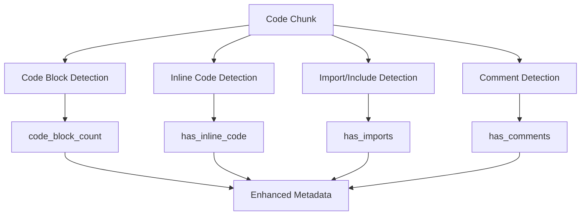
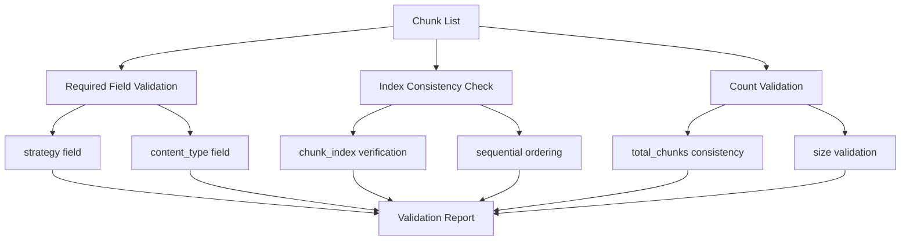
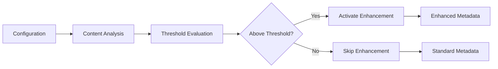
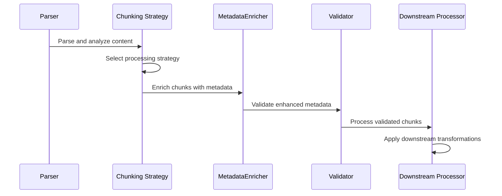

# Metadata Enrichment

<cite>
**Referenced Files in This Document**
- [metadata_enricher.py](file://markdown_chunker/chunker/components/metadata_enricher.py)
- [test_metadata_enricher.py](file://tests/chunker/test_components/test_metadata_enricher.py)
- [types.py](file://markdown_chunker/chunker/types.py)
- [core.py](file://markdown_chunker/chunker/core.py)
- [basic_usage.py](file://examples/basic_usage.py)
- [metadata.json](file://tests/fixtures/real_documents/metadata.json)
</cite>

## Table of Contents
1. [Introduction](#introduction)
2. [Architecture Overview](#architecture-overview)
3. [Core Components](#core-components)
4. [Positional Metadata Enhancement](#positional-metadata-enhancement)
5. [Structural Metadata Analysis](#structural-metadata-analysis)
6. [Semantic Metadata Extraction](#semantic-metadata-extraction)
7. [Content Analysis Metrics](#content-analysis-metrics)
8. [Strategy-Specific Enrichment](#strategy-specific-enrichment)
9. [Validation and Integrity](#validation-and-integrity)
10. [Configuration Influence](#configuration-influence)
11. [Performance Considerations](#performance-considerations)
12. [Integration Patterns](#integration-patterns)
13. [Practical Examples](#practical-examples)
14. [Best Practices](#best-practices)

## Introduction

The MetadataEnricher component serves as the cornerstone of the markdown chunking system's analytical capabilities, transforming raw chunks into rich, searchable, and contextually aware data structures. This sophisticated component enhances each chunk with comprehensive metadata that captures positional relationships, structural characteristics, semantic content features, and analytical metrics essential for downstream processing stages.

The enricher operates as a multi-faceted processor that systematically analyzes and augments chunk metadata across several dimensions: positional context (chunk ordering and document placement), structural information (content type and hierarchy), semantic features (URLs, emails, formatting), and quantitative metrics (word counts, complexity scores). This enriched metadata enables intelligent downstream processing, improved searchability, and enhanced retrieval capabilities in RAG (Retrieval-Augmented Generation) systems.

## Architecture Overview

The MetadataEnricher follows a modular design pattern that separates concerns across distinct enhancement phases while maintaining data integrity and performance efficiency.



**Diagram sources**
- [metadata_enricher.py](file://markdown_chunker/chunker/components/metadata_enricher.py#L13-L414)
- [types.py](file://markdown_chunker/chunker/types.py#L36-L210)

The architecture implements a pipeline pattern where each chunk undergoes systematic enhancement through multiple specialized processors. The main entry point [`enrich_chunks`](file://markdown_chunker/chunker/components/metadata_enricher.py#L34-L66) coordinates the enhancement process, while specialized methods handle strategy-specific enrichment and content analysis.

**Section sources**
- [metadata_enricher.py](file://markdown_chunker/chunker/components/metadata_enricher.py#L13-L414)

## Core Components

### Initialization and Configuration

The MetadataEnricher initializes with a [`ChunkConfig`](file://markdown_chunker/chunker/types.py#L498-L800) object that defines the behavioral parameters for metadata enhancement. This configuration influences various aspects of the enrichment process, from content analysis thresholds to performance optimization settings.

Key configuration parameters affecting metadata enrichment include:
- **Content analysis thresholds**: Control when specific enrichment strategies activate
- **Size constraints**: Influence metadata calculations and validation rules
- **Feature detection settings**: Determine which semantic features are extracted
- **Performance parameters**: Affect the computational overhead of enrichment operations

### Enrichment Pipeline

The enrichment process follows a systematic pipeline that ensures comprehensive coverage of metadata enhancement opportunities:



**Diagram sources**
- [metadata_enricher.py](file://markdown_chunker/chunker/components/metadata_enricher.py#L54-L129)

Each stage of the pipeline contributes specific metadata categories while maintaining data integrity and performance efficiency.

**Section sources**
- [metadata_enricher.py](file://markdown_chunker/chunker/components/metadata_enricher.py#L25-L414)

## Positional Metadata Enhancement

Positional metadata provides critical context about a chunk's relationship within the document structure and processing sequence. This metadata enables intelligent downstream processing, maintains document coherence, and facilitates efficient retrieval operations.

### Chunk Indexing System

The positioning system implements a comprehensive indexing framework that tracks each chunk's place within the overall document and processing sequence:

| Metadata Field | Purpose | Calculation Method | Use Cases |
|----------------|---------|-------------------|-----------|
| `chunk_index` | Zero-based position | Loop iteration index | Sequential processing, ordering verification |
| `total_chunks` | Document-wide count | Length of chunk list | Progress tracking, boundary detection |
| `is_first_chunk` | Document start indicator | `position == 0` | Header preservation, context establishment |
| `is_last_chunk` | Document end indicator | `position == total_chunks - 1` | Footer preservation, completion detection |

### Document-Level Context Propagation

Document-level context is propagated through multiple metadata fields that establish relationships between chunks and their containing document:



**Diagram sources**
- [metadata_enricher.py](file://markdown_chunker/chunker/components/metadata_enricher.py#L56-L63)

The document ID propagation ensures that all chunks maintain awareness of their originating document, enabling cross-document analysis and facilitating unified processing workflows.

**Section sources**
- [metadata_enricher.py](file://markdown_chunker/chunker/components/metadata_enricher.py#L92-L113)

## Structural Metadata Analysis

Structural metadata captures the inherent organization and hierarchy of markdown content, enabling intelligent processing based on content type and structural relationships. This analysis forms the foundation for strategy-specific enrichment and content classification.

### Header Count Analysis

Header analysis identifies and quantifies the hierarchical structure within chunks, providing insights into document organization and content segmentation:



**Diagram sources**
- [metadata_enricher.py](file://markdown_chunker/chunker/components/metadata_enricher.py#L266-L286)

The header analysis produces comprehensive structural information that enables intelligent content processing and maintains document hierarchy integrity.

### Paragraph and Content Segmentation

Paragraph detection distinguishes between different content types within chunks, enabling appropriate processing strategies:

- **Header paragraphs**: Identified by absence of header markers
- **Body content**: Separated from structural elements
- **Content density**: Measured through paragraph-to-line ratios

### List Structure Recognition

List structure analysis identifies and categorizes different list types within chunks, enabling appropriate handling of hierarchical content:

| List Type | Detection Pattern | Metadata Fields | Processing Impact |
|-----------|------------------|-----------------|-------------------|
| Ordered | `^\s*\d+\.` | `ordered_item_count` | Number preservation, sequence maintenance |
| Unordered | `^\s*[-*+]` | `unordered_item_count` | Bullet preservation, hierarchy recognition |
| Task Lists | `^\s*[-*+]\s+\[[ xX]\]` | `task_item_count` | Checkbox state preservation |
| Nested | Indentation patterns | `has_nested_lists`, `nested_item_count` | Hierarchy reconstruction |

**Section sources**
- [metadata_enricher.py](file://markdown_chunker/chunker/components/metadata_enricher.py#L200-L226)

## Semantic Metadata Extraction

Semantic metadata extraction focuses on identifying and capturing meaningful content features that enhance searchability and enable intelligent content processing. This extraction process identifies patterns that indicate content intent and structure.

### URL and Email Detection

The semantic extraction system implements comprehensive pattern matching for identifying web resources and contact information:



**Diagram sources**
- [metadata_enricher.py](file://markdown_chunker/chunker/components/metadata_enricher.py#L289-L327)

### Content Preview Generation

Content preview generation creates concise summaries that capture the essence of chunk content for search and display purposes:

- **First sentence extraction**: Identifies natural sentence boundaries
- **Length limitation**: Prevents excessive metadata bloat
- **Truncation handling**: Appends ellipsis for truncated content
- **Character encoding**: Maintains proper text representation

### Formatting Feature Detection

Formatting feature detection identifies markdown formatting patterns that indicate content emphasis and structure:

- **Strong emphasis**: Double asterisks or underscores
- **Emphasis**: Single asterisks or underscores  
- **Inline code**: Backtick delimiters
- **Link patterns**: Bracket-parenthesis combinations

**Section sources**
- [metadata_enricher.py](file://markdown_chunker/chunker/components/metadata_enricher.py#L289-L327)

## Content Analysis Metrics

Content analysis metrics provide quantitative measures of chunk characteristics that enable intelligent processing decisions and performance optimization. These metrics form the basis for content classification and processing strategy selection.

### Statistical Calculations

The content analysis system computes comprehensive statistical measures that describe chunk characteristics:



**Diagram sources**
- [metadata_enricher.py](file://markdown_chunker/chunker/components/metadata_enricher.py#L144-L163)

### Complexity Metrics

Complexity metrics assess content sophistication and inform processing strategy selection:

- **Line density**: Characters per line ratio
- **Word density**: Words per line ratio  
- **Content richness**: Feature-to-content ratio
- **Structure complexity**: Hierarchical depth measurement

### Performance Optimization

Content analysis metrics support performance optimization through intelligent caching and processing decisions:

- **Processing cost estimation**: Based on content size and complexity
- **Strategy selection guidance**: Informing optimal processing approaches
- **Resource allocation**: Optimizing computational resource usage

**Section sources**
- [metadata_enricher.py](file://markdown_chunker/chunker/components/metadata_enricher.py#L144-L163)

## Strategy-Specific Enrichment

Strategy-specific enrichment tailors metadata enhancement to the particular characteristics and requirements of different content types. This targeted approach ensures that each chunk receives appropriate and relevant metadata enhancements.

### Code Metadata Enrichment

Code metadata enrichment focuses on programming language constructs and development-related features:



**Diagram sources**
- [metadata_enricher.py](file://markdown_chunker/chunker/components/metadata_enricher.py#L165-L198)

Code enrichment includes sophisticated pattern matching for language-specific constructs and development practices.

### List Metadata Enhancement

List metadata enhancement captures hierarchical structure and organizational patterns:

- **Item type classification**: Ordered, unordered, task-based
- **Hierarchy detection**: Nested list identification
- **Progress tracking**: Task completion state recognition
- **Structure preservation**: Maintaining list integrity across chunks

### Table Metadata Analysis

Table metadata analysis preserves tabular structure and enables intelligent data processing:

- **Row counting**: Total and structural row identification
- **Column detection**: Width and alignment analysis
- **Structure validation**: Header-separator-row relationships
- **Alignment preservation**: Column alignment indicators

### Structural Metadata Processing

Structural metadata processing handles general markdown content with emphasis on hierarchy and organization:

- **Header analysis**: Level detection and range calculation
- **Paragraph segmentation**: Content separation and density measurement
- **Content type identification**: Text vs. structured content differentiation

**Section sources**
- [metadata_enricher.py](file://markdown_chunker/chunker/components/metadata_enricher.py#L122-L130)

## Validation and Integrity

The validation system ensures metadata integrity and consistency across all processed chunks, providing quality assurance for downstream processing stages. This comprehensive validation framework prevents data corruption and maintains system reliability.

### Metadata Validation Framework

The validation framework implements multi-level checks that ensure metadata correctness and completeness:



**Diagram sources**
- [metadata_enricher.py](file://markdown_chunker/chunker/components/metadata_enricher.py#L330-L374)

### Integrity Checks

Integrity checks ensure that metadata remains consistent and reliable throughout the processing pipeline:

| Validation Type | Purpose | Implementation | Error Handling |
|----------------|---------|----------------|----------------|
| Required fields | Essential metadata presence | Field existence checking | Issue reporting |
| Index consistency | Sequential ordering | Position vs. index comparison | Correction suggestions |
| Count validation | Aggregate consistency | Cross-reference validation | Warning generation |
| Type safety | Data type correctness | Type checking and conversion | Type normalization |

### Quality Assurance

Quality assurance mechanisms ensure that metadata enhancement maintains data integrity:

- **Immutable processing**: Original chunks remain unchanged
- **Incremental validation**: Progressive quality assessment
- **Error isolation**: Failed validations don't affect successful processing
- **Comprehensive reporting**: Detailed issue identification and resolution guidance

**Section sources**
- [metadata_enricher.py](file://markdown_chunker/chunker/components/metadata_enricher.py#L330-L374)

## Configuration Influence

Configuration parameters significantly influence metadata enrichment behavior, determining when and how specific enhancement strategies activate. Understanding these influences enables optimal system configuration for specific use cases.

### Threshold-Based Activation

Many enrichment features activate based on configurable thresholds that balance processing overhead with enhancement benefits:



**Diagram sources**
- [metadata_enricher.py](file://markdown_chunker/chunker/components/metadata_enricher.py#L118-L130)

### Performance Configuration

Performance configuration parameters optimize enrichment processing for different operational contexts:

- **Processing limits**: Memory and CPU usage constraints
- **Batch processing**: Efficiency optimization for large datasets
- **Caching strategies**: Reducing redundant computation
- **Parallel processing**: Multi-threaded enhancement operations

### Use Case Adaptation

Configuration adaptation enables the system to optimize for specific use cases:

- **RAG optimization**: Enhanced searchability metadata
- **Development documentation**: Code-focused enrichment
- **Technical specifications**: Structural analysis prioritization
- **Educational content**: Learning-oriented metadata enhancement

**Section sources**
- [types.py](file://markdown_chunker/chunker/types.py#L498-L800)

## Performance Considerations

Performance optimization ensures that metadata enrichment scales effectively across different document sizes and processing volumes. The system implements several optimization strategies to maintain efficiency while providing comprehensive enhancement.

### Computational Efficiency

Computational efficiency strategies minimize processing overhead while maximizing enhancement quality:

- **Pattern optimization**: Efficient regular expression compilation and reuse
- **Lazy evaluation**: Deferred processing until required
- **Memory management**: Efficient data structure utilization
- **Streaming processing**: Reduced memory footprint for large documents

### Scalability Patterns

Scalability patterns enable the system to handle varying document sizes and processing loads:

- **Adaptive processing**: Dynamic algorithm selection based on content characteristics
- **Resource pooling**: Shared computational resources across operations
- **Load balancing**: Distribution of processing tasks across available resources
- **Caching strategies**: Reuse of previously computed metadata

### Optimization Strategies

Optimization strategies address specific performance bottlenecks in metadata processing:

| Strategy | Application | Benefit | Trade-off |
|----------|-------------|---------|-----------|
| Pre-compilation | Regular expressions | Faster pattern matching | Increased startup time |
| Incremental processing | Large documents | Reduced memory usage | Potential accuracy loss |
| Parallel enhancement | Multiple chunks | Improved throughput | Increased complexity |
| Metadata caching | Repeated processing | Reduced computation | Storage overhead |

**Section sources**
- [metadata_enricher.py](file://markdown_chunker/chunker/components/metadata_enricher.py#L1-L50)

## Integration Patterns

Integration patterns demonstrate how the MetadataEnricher connects with other system components and downstream processing stages. These patterns ensure seamless data flow and maintain system coherence across the processing pipeline.

### Pipeline Integration

Pipeline integration ensures that metadata enhancement fits seamlessly into the broader chunking workflow:



**Diagram sources**
- [core.py](file://markdown_chunker/chunker/core.py#L287-L309)

### Downstream Processing

Downstream processing leverages enriched metadata for intelligent content handling:

- **Search optimization**: Leveraging semantic metadata for improved search relevance
- **Content routing**: Using metadata to direct chunks to appropriate processing pipelines
- **Quality filtering**: Applying metadata-based quality assessments
- **Analytics generation**: Creating usage analytics from enriched metadata

### Error Handling Integration

Error handling integration ensures robust processing even when individual enhancements fail:

- **Graceful degradation**: Continuing processing despite individual failures
- **Error propagation**: Communicating issues to upstream components
- **Recovery strategies**: Automatic retry and alternative processing paths
- **Logging integration**: Comprehensive error tracking and monitoring

**Section sources**
- [core.py](file://markdown_chunker/chunker/core.py#L287-L309)

## Practical Examples

Practical examples demonstrate real-world usage patterns and showcase the metadata enrichment capabilities across different content types and processing scenarios.

### Code Documentation Enhancement

Code documentation enhancement demonstrates sophisticated metadata extraction for technical content:

```python
# Example structure from test fixtures
chunk = Chunk(
    "```python\ndef example():\n    pass\n```",
    1, 5, 
    {"strategy": "code", "content_type": "code"}
)
```

Expected metadata enhancement includes:
- **Code block identification**: `code_block_count: 1`
- **Language detection**: `language: "python"`
- **Import detection**: `has_imports: false`
- **Comment recognition**: `has_comments: false`

### List-Based Content Processing

List-based content processing showcases hierarchical structure preservation:

```python
# Example from test fixtures
chunk = Chunk(
    "1. First item\n2. Second item\n- Unordered\n  - Nested",
    1, 4,
    {"strategy": "list", "content_type": "list"}
)
```

Enhancement results:
- **Ordered item counting**: `ordered_item_count: 2`
- **Unordered item counting**: `unordered_item_count: 2`
- **Nested list detection**: `has_nested_lists: true`

### Table Structure Analysis

Table structure analysis demonstrates complex content preservation:

```python
# Example from test fixtures
chunk = Chunk(
    "| Col1 | Col2 |\n|------|------|\n| A | B |\n| C | D |",
    1, 4,
    {"strategy": "table", "content_type": "table"}
)
```

Table metadata:
- **Row counting**: `table_row_count: 4`
- **Structure detection**: `table_count: 1`
- **Alignment recognition**: `has_column_alignment: true`

### Real-World Document Processing

Real-world document processing demonstrates comprehensive enhancement across mixed content:

```python
# Example from integration tests
chunks = [
    Chunk("# Introduction\n\nParagraph", 1, 3, {"strategy": "structural"}),
    Chunk("```python\ndef example():\n    return True\n```", 4, 7, {"strategy": "code"}),
    Chunk("| Name | Value |\n|------|-------|\n| A | 1 |", 8, 11, {"strategy": "table"})
]
```

Complete enhancement includes:
- **Positional metadata**: Chunk indexing and document context
- **Content statistics**: Word and line counts for each chunk
- **Searchability metadata**: Preview generation and feature detection
- **Strategy-specific metadata**: Type-appropriate enhancements

**Section sources**
- [test_metadata_enricher.py](file://tests/chunker/test_components/test_metadata_enricher.py#L285-L372)

## Best Practices

Best practices ensure optimal metadata enrichment performance and maintain system reliability across diverse use cases and processing scenarios.

### Configuration Optimization

Configuration optimization balances enhancement quality with processing performance:

- **Threshold tuning**: Adjust thresholds based on content characteristics
- **Feature selection**: Enable only necessary enhancement features
- **Resource allocation**: Optimize memory and CPU usage for specific workloads
- **Monitoring setup**: Implement comprehensive performance monitoring

### Error Prevention

Error prevention strategies minimize processing failures and maintain system reliability:

- **Input validation**: Verify content quality before processing
- **Graceful handling**: Implement robust error recovery mechanisms
- **Resource management**: Prevent resource exhaustion during processing
- **Testing protocols**: Comprehensive testing across different content types

### Performance Monitoring

Performance monitoring ensures sustained system effectiveness:

- **Processing metrics**: Track enhancement performance and resource usage
- **Quality assessment**: Monitor enhancement accuracy and completeness
- **System health**: Track system stability and error rates
- **Capacity planning**: Monitor resource utilization trends

### Integration Guidelines

Integration guidelines ensure seamless system operation:

- **Interface consistency**: Maintain consistent metadata formats
- **Error handling**: Implement comprehensive error propagation
- **Version compatibility**: Ensure backward compatibility across updates
- **Documentation**: Maintain comprehensive integration documentation

These best practices form the foundation for reliable and efficient metadata enrichment in production environments, ensuring that the system delivers consistent value across diverse processing scenarios.