# Overlap Management

<cite>
**Referenced Files in This Document**
- [overlap_manager.py](file://markdown_chunker/chunker/components/overlap_manager.py) - *Updated with metadata-based overlap handling*
- [test_overlap_metadata_mode.py](file://tests/chunker/test_components/test_overlap_metadata_mode.py) - *Added for new metadata mode testing*
- [types.py](file://markdown_chunker/chunker/types.py) - *Updated with new metadata fields*
- [core.py](file://markdown_chunker/chunker/core.py)
- [rag_integration.py](file://examples/rag_integration.py)
- [mixed.md](file://tests/fixtures/mixed.md)
- [code_heavy.md](file://tests/fixtures/code_heavy.md)
- [list_heavy.md](file://tests/fixtures/list_heavy.md)
</cite>

## Update Summary
**Changes Made**
- Updated documentation to reflect new metadata-based overlap handling mode
- Added documentation for new metadata fields: previous_content, next_content, previous_chunk_index, next_chunk_index
- Maintained legacy mode support documentation through include_metadata parameter
- Updated internal logic explanation for apply_overlap method to reflect dual-mode operation
- Revised examples to show both metadata and legacy modes
- Updated edge case handling documentation
- Added performance implications of metadata mode

## Table of Contents
1. [Introduction](#introduction)
2. [Architecture Overview](#architecture-overview)
3. [Core Components](#core-components)
4. [Configuration System](#configuration-system)
5. [Internal Logic and Implementation](#internal-logic-and-implementation)
6. [Overlap Application Process](#overlap-application-process)
7. [Content Boundary Preservation](#content-boundary-preservation)
8. [Edge Cases and Error Handling](#edge-cases-and-error-handling)
9. [Performance Considerations](#performance-considerations)
10. [Integration Examples](#integration-examples)
11. [Testing and Validation](#testing-and-validation)
12. [Best Practices](#best-practices)

## Introduction

The OverlapManager component is a critical part of the markdown chunking system that creates overlapping content between adjacent chunks to maintain context continuity, particularly important for Retrieval-Augmented Generation (RAG) systems. This component ensures that when documents are divided into smaller chunks for processing, the contextual information from one chunk to the next is preserved, preventing information loss and improving the effectiveness of downstream AI applications.

The overlap mechanism now operates in two distinct modes: a new metadata-based mode that stores context in metadata fields, and a legacy mode that merges context into the chunk content. This dual-mode approach provides flexibility for different use cases while maintaining backward compatibility.

## Architecture Overview

The OverlapManager operates as part of a multi-stage chunking pipeline, positioned after strategy selection and before metadata enrichment. It integrates seamlessly with the broader chunking system through the main MarkdownChunker orchestration.


**Diagram sources**
- [core.py](file://markdown_chunker/chunker/core.py#L280-L286)
- [overlap_manager.py](file://markdown_chunker/chunker/components/overlap_manager.py#L37-L79)

**Section sources**
- [core.py](file://markdown_chunker/chunker/core.py#L138-L140)
- [overlap_manager.py](file://markdown_chunker/chunker/components/overlap_manager.py#L12-L32)

## Core Components

### OverlapManager Class Structure

The OverlapManager is implemented as a focused, stateless component that handles all aspects of overlap creation and management. It operates on lists of Chunk objects and applies overlap according to configuration settings, supporting both metadata-based and legacy overlap modes.

```mermaid
classDiagram
class OverlapManager {
+ChunkConfig config
+str SENTENCE_END_PATTERN
+__init__(config : ChunkConfig)
+apply_overlap(chunks : List[Chunk], include_metadata : bool = False) List[Chunk]
+calculate_overlap_statistics(chunks : List[Chunk]) dict
-_extract_overlap(chunk : Chunk, is_suffix : bool) str
-_extract_suffix_context(content : str, target_size : int) str
-_extract_prefix_context(content : str, target_size : int) str
-_add_context_to_metadata(chunk : Chunk, previous_content : str, next_content : str, previous_chunk_index : int, next_chunk_index : int) Chunk
-_merge_context_into_content(chunk : Chunk, previous_content : str, next_content : str) Chunk
-_split_into_sentences(content : str) List[str]
-_truncate_preserving_sentences(text : str, max_size : int) str
-_is_code_chunk(chunk : Chunk) bool
-_has_unbalanced_fences(text : str) bool
}
class Chunk {
+str content
+int start_line
+int end_line
+Dict metadata
+size() int
+get_metadata(key : str, default : Any) Any
}
class ChunkConfig {
+bool enable_overlap
+int overlap_size
+float overlap_percentage
+int max_chunk_size
}
OverlapManager --> ChunkConfig : uses
OverlapManager --> Chunk : processes
```



**Diagram sources**
- [overlap_manager.py](file://markdown_chunker/chunker/components/overlap_manager.py#L13-L447)
- [types.py](file://markdown_chunker/chunker/types.py#L36-L49)

### Key Internal Components

The OverlapManager utilizes several specialized methods for different aspects of overlap management:

- **Sentence Boundary Detection**: Uses regex patterns to identify natural sentence breaks
- **Content Extraction**: Implements both suffix and prefix context extraction
- **Code Block Integrity**: Prevents overlap from breaking code fence structures
- **Size Compliance**: Ensures overlap respects configured size limits
- **Metadata Management**: Adds context-related metadata to chunks in metadata mode
- **Content Merging**: Merges context into chunk content in legacy mode

**Section sources**
- [overlap_manager.py](file://markdown_chunker/chunker/components/overlap_manager.py#L25-L447)

## Configuration System

The OverlapManager relies on the ChunkConfig system to determine overlap behavior. Configuration options provide fine-grained control over overlap characteristics and behavior.

### Configuration Parameters

| Parameter | Type | Default | Description |
|-----------|------|---------|-------------|
| `enable_overlap` | bool | True | Enables or disables overlap creation |
| `overlap_size` | int | 200 | Fixed overlap size in characters |
| `overlap_percentage` | float | 0.1 | Percentage of chunk size for overlap |
| `max_chunk_size` | int | 4096 | Maximum chunk size constraint |

### Priority System

The overlap calculation follows a specific priority order:

1. **Fixed Size Override**: If `overlap_size > 0`, it takes precedence
2. **Percentage Calculation**: Uses `overlap_percentage` as fallback
3. **Size Limiting**: Maximum overlap is capped at 40% of source chunk size
4. **Ratio Constraint**: Final overlap must not exceed 50% of resulting chunk size

**Section sources**
- [types.py](file://markdown_chunker/chunker/types.py#L574-L583)
- [overlap_manager.py](file://markdown_chunker/chunker/components/overlap_manager.py#L125-L140)

## Internal Logic and Implementation

### apply_overlap Method

The main entry point for overlap application implements a sophisticated algorithm that processes chunks sequentially while maintaining context preservation. The method now supports two distinct modes of operation through the include_metadata parameter.


**Section sources**
- [overlap_manager.py](file://markdown_chunker/chunker/components/overlap_manager.py#L62-L79)

### Overlap Extraction Process

The `_extract_suffix_context` and `_extract_prefix_context` methods implement the core context calculation logic:

1. **Size Determination**: Calculates target context size using priority system
2. **Boundary Detection**: Identifies block boundaries for natural breaks
3. **Content Collection**: Gathers content from appropriate direction (suffix/prefix)
4. **Size Validation**: Ensures context doesn't exceed configured limits
5. **Integrity Check**: Verifies code block balance if applicable
6. **Block Alignment**: Extracts complete blocks only, no partial blocks

**Section sources**
- [overlap_manager.py](file://markdown_chunker/chunker/components/overlap_manager.py#L159-L273)

## Overlap Application Process

### Metadata Mode vs Legacy Mode

The system supports two distinct modes of operation:

- **Metadata Mode** (`include_metadata=True`): Stores context in metadata fields (previous_content, next_content) while keeping the original content unchanged
- **Legacy Mode** (`include_metadata=False`): Merges context into the chunk content by prepending previous_content and appending next_content

### Context Boundary Preservation

The overlap system prioritizes natural block boundaries to maintain readability:


**Section sources**
- [overlap_manager.py](file://markdown_chunker/chunker/components/overlap_manager.py#L155-L204)

### Code Block Integrity Protection

The system includes sophisticated protection against breaking code block structures:

- **Fence Detection**: Identifies code fence markers (` ``` `)
- **Balance Checking**: Ensures overlap doesn't create unbalanced fences
- **Fallback Strategy**: Skips overlap when integrity would be compromised
- **Block-Aware Extraction**: Extracts complete blocks only, never partial blocks

**Section sources**
- [overlap_manager.py](file://markdown_chunker/chunker/components/overlap_manager.py#L81-L107)

## Content Boundary Preservation

### Block Boundary Detection

The overlap system uses block-based detection to maintain natural text flow:

- **Pattern Matching**: Identifies code blocks, paragraphs, headers, lists, and tables
- **Reconstruction**: Preserves structure and spacing in extracted content
- **Fallback Handling**: Gracefully handles content without clear block boundaries

### Content Type Awareness

The system recognizes different content types and applies appropriate overlap strategies:

- **Text Content**: Full block-aware context extraction
- **Code Blocks**: Fence-aware context with integrity checks
- **Lists**: Structure-preserving context extraction
- **Tables**: Atomic-block context extraction

**Section sources**
- [overlap_manager.py](file://markdown_chunker/chunker/components/overlap_manager.py#L286-L318)

## Edge Cases and Error Handling

### Single Chunk Scenarios

The overlap system handles various edge cases gracefully:

- **Empty Lists**: Returns empty result without processing
- **Single Chunks**: No context applied, chunks returned unchanged
- **Very Short Chunks**: Context size adjusted to chunk size limitations
- **Zero or Negative Sizes**: Handled through configuration validation

### Configuration Validation

The system includes comprehensive validation for overlap settings:

- **Size Constraints**: Ensures context size doesn't exceed chunk size
- **Percentage Bounds**: Validates overlap percentage is between 0.0 and 1.0
- **Ratio Limits**: Prevents context from dominating resulting chunks
- **Integrity Checks**: Validates code block balance before applying context

### Error Recovery

When context processing encounters issues, the system implements graceful degradation:

- **Exception Handling**: Catches and logs errors without failing chunking
- **Fallback Behavior**: Returns original chunks when context would cause problems
- **Integrity Preservation**: Maintains document structure even when context is skipped

**Section sources**
- [overlap_manager.py](file://markdown_chunker/chunker/components/overlap_manager.py#L47-L78)
- [test_overlap_manager.py](file://tests/chunker/test_components/test_overlap_manager.py#L16-L58)

## Performance Considerations

### Computational Complexity

The overlap system is designed for efficiency while maintaining quality:

- **Linear Processing**: Each chunk is processed individually with O(n) complexity
- **Regex Optimization**: Sentence boundary detection uses compiled patterns
- **Early Termination**: Content collection stops when size limits are reached
- **Memory Efficiency**: Processes chunks without storing intermediate results

### Scalability Factors

Several factors affect overlap performance at scale:

- **Chunk Count**: Linear scaling with number of chunks
- **Content Length**: Proportional to average chunk size
- **Block Density**: Higher density requires more processing
- **Code Block Frequency**: Additional parsing overhead for code content

### Optimization Strategies

The system includes several optimization measures:

- **Lazy Evaluation**: Only processes context when needed
- **Size Caching**: Avoids repeated calculations of chunk sizes
- **Pattern Compilation**: Regex patterns are compiled once during initialization
- **Early Validation**: Checks for context conflicts early in processing

**Section sources**
- [overlap_manager.py](file://markdown_chunker/chunker/components/overlap_manager.py#L125-L140)

## Integration Examples

### RAG System Integration

The overlap manager is specifically designed for RAG applications, where context preservation is crucial:


**Diagram sources**
- [rag_integration.py](file://examples/rag_integration.py#L13-L53)
- [core.py](file://markdown_chunker/chunker/core.py#L280-L286)

### Configuration for Different Use Cases

The system supports various configuration profiles for different scenarios:

- **RAG Optimization**: Small chunks with generous context (50-100 characters) in metadata mode
- **Documentation**: Balanced approach for technical content
- **Code Documentation**: Larger context to maintain context across code examples
- **Research Papers**: Conservative context to avoid redundancy

**Section sources**
- [rag_integration.py](file://examples/rag_integration.py#L13-L70)

## Testing and Validation

### Comprehensive Test Coverage

The overlap manager includes extensive test coverage for various scenarios:

- **Basic Functionality**: Core context application and metadata addition
- **Edge Cases**: Empty inputs, single chunks, very short content
- **Configuration Variants**: Fixed size vs percentage-based context
- **Content Types**: Text, code, lists, and mixed content
- **Error Conditions**: Invalid configurations, unbalanced fences
- **Mode Comparison**: Verification of equivalence between metadata and legacy modes

### Statistical Analysis

The system provides context statistics for monitoring and optimization:

- **Context Percentage**: Ratio of chunks with context
- **Average Size**: Mean context size across all chunks
- **Total Context**: Cumulative context across all chunks
- **Distribution Analysis**: Size distribution of context content

**Section sources**
- [test_overlap_manager.py](file://tests/chunker/test_components/test_overlap_manager.py#L406-L447)

## Best Practices

### Configuration Guidelines

For optimal results, follow these configuration recommendations:

- **RAG Systems**: Use small context sizes (50-100 characters) with percentage-based fallback in metadata mode
- **Documentation**: Balance context with chunk size (10-20% of target size)
- **Code Documentation**: Increase context for better context preservation
- **Large Documents**: Consider streaming configuration with moderate context

### Content Preparation

Prepare content for optimal context effectiveness:

- **Structured Content**: Use clear headings and logical organization
- **Block Structure**: Maintain natural block boundaries in content
- **Code Organization**: Group related code examples together
- **List Formatting**: Use consistent list styles for better chunking

### Monitoring and Optimization

Monitor context effectiveness and adjust configuration as needed:

- **Coverage Analysis**: Track how much content is covered by context
- **Quality Metrics**: Monitor chunk quality and context preservation
- **Performance Tracking**: Measure context processing time impact
- **Feedback Loops**: Adjust configuration based on downstream application performance

**Section sources**
- [overlap_manager.py](file://markdown_chunker/chunker/components/overlap_manager.py#L405-L447)