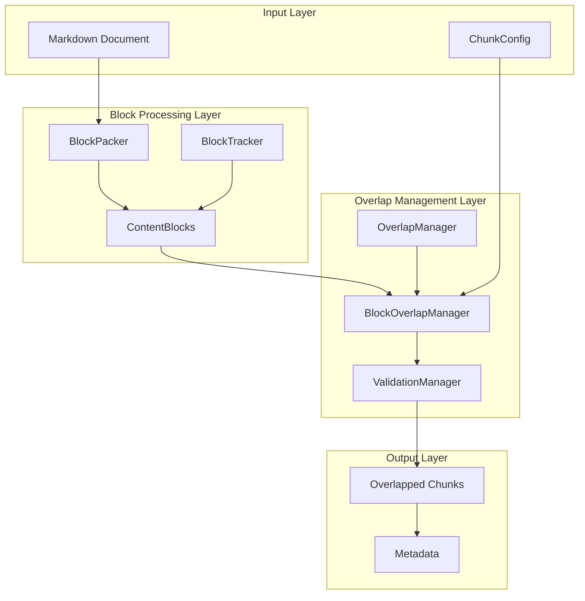
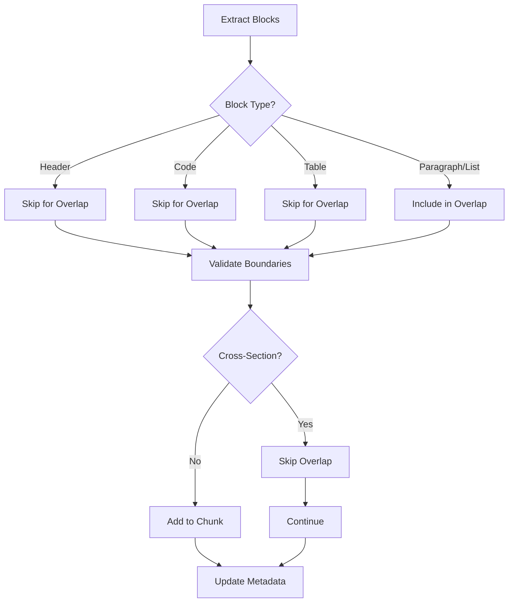
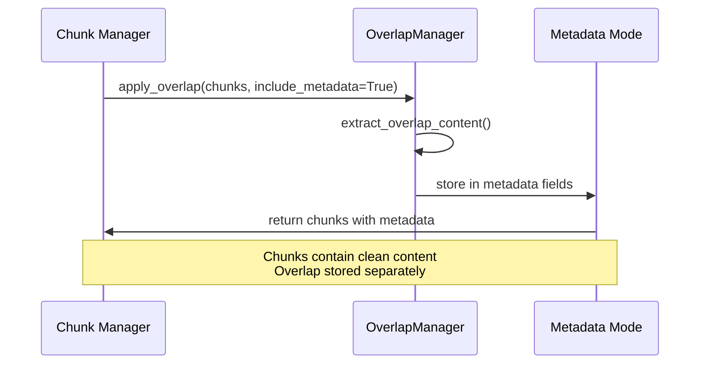
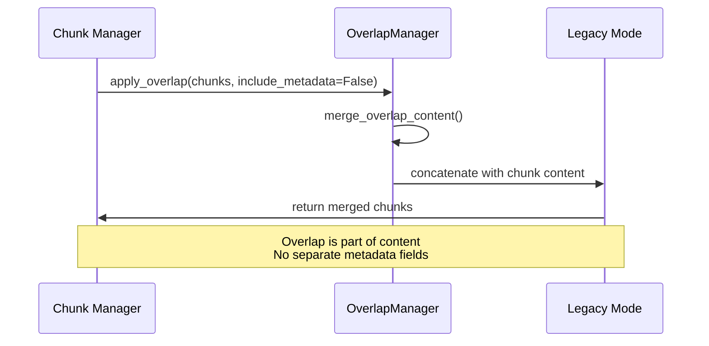
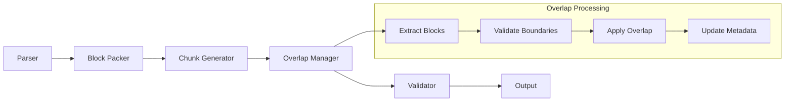
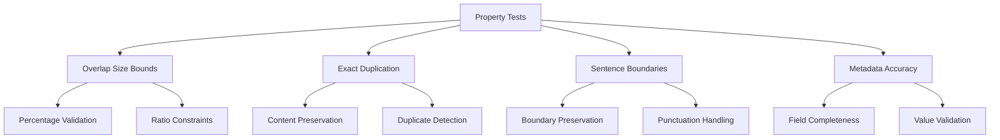

# Block Overlap Manager

<cite>
**Referenced Files in This Document**
- [block_overlap_manager.py](file://markdown_chunker/chunker/block_overlap_manager.py)
- [overlap_manager.py](file://markdown_chunker/chunker/components/overlap_manager.py)
- [types.py](file://markdown_chunker/chunker/types.py)
- [block_tracker.py](file://markdown_chunker/chunker/components/block_tracker.py)
- [block_packer.py](file://markdown_chunker/chunker/block_packer.py)
- [test_overlap_manager.py](file://tests/chunker/test_components/test_overlap_manager.py)
- [test_overlap_properties.py](file://tests/chunker/test_overlap_properties.py)
- [test_overlap_integration.py](file://tests/integration/test_overlap_integration.py)
- [basic_usage.py](file://examples/basic_usage.py)
</cite>

## Table of Contents
1. [Introduction](#introduction)
2. [Architecture Overview](#architecture-overview)
3. [Core Components](#core-components)
4. [Block-Based Overlap Strategy](#block-based-overlap-strategy)
5. [Overlap Management Modes](#overlap-management-modes)
6. [Configuration and Settings](#configuration-and-settings)
7. [Integration with Chunking Pipeline](#integration-with-chunking-pipeline)
8. [Testing and Validation](#testing-and-validation)
9. [Performance Considerations](#performance-considerations)
10. [Troubleshooting Guide](#troubleshooting-guide)
11. [Best Practices](#best-practices)
12. [Conclusion](#conclusion)

## Introduction

The Block Overlap Manager is a sophisticated component of the Markdown Chunker system that addresses the critical challenge of maintaining contextual continuity between adjacent chunks. Unlike traditional character-based overlap approaches, this system operates at the block level, ensuring that structural elements like headers, code blocks, and tables remain intact while preserving meaningful context between chunks.

The overlap manager serves as a bridge between individual chunks, enabling downstream applications like Retrieval-Augmented Generation (RAG) systems to maintain semantic coherence when processing discrete document fragments. This is particularly crucial for AI applications that rely on context to provide accurate responses and maintain narrative flow.

## Architecture Overview

The Block Overlap Manager operates within a layered architecture that separates concerns between content extraction, block identification, and overlap generation:



**Diagram sources**
- [block_overlap_manager.py](file://markdown_chunker/chunker/block_overlap_manager.py#L16-L264)
- [overlap_manager.py](file://markdown_chunker/chunker/components/overlap_manager.py#L38-L927)
- [block_packer.py](file://markdown_chunker/chunker/block_packer.py#L45-L672)

## Core Components

### BlockOverlapManager

The primary component responsible for implementing block-based overlap calculations. It ensures that overlap operations respect structural boundaries and never split atomic content units.

Key responsibilities:
- Extract complete blocks for overlap from previous chunks
- Validate overlap boundaries to prevent section fragmentation
- Apply overlap constraints to maintain optimal chunk sizes
- Generate enriched chunks with appropriate metadata

### OverlapManager

The legacy overlap management system that provides backward compatibility and supports both metadata and legacy modes of operation.

Features:
- Sentence-aware overlap preservation
- Configurable overlap size and percentage
- Dual-mode operation (metadata vs legacy)
- Comprehensive validation and error handling

### BlockTracker

A validation component that ensures content integrity across chunk boundaries by tracking block occurrences and detecting potential data loss or duplication issues.

**Section sources**
- [block_overlap_manager.py](file://markdown_chunker/chunker/block_overlap_manager.py#L16-L264)
- [overlap_manager.py](file://markdown_chunker/chunker/components/overlap_manager.py#L38-L927)
- [block_tracker.py](file://markdown_chunker/chunker/components/block_tracker.py#L95-L343)

## Block-Based Overlap Strategy

The block-based overlap strategy represents a fundamental improvement over character-based approaches, addressing several critical limitations:

### Block Boundary Preservation



**Diagram sources**
- [block_overlap_manager.py](file://markdown_chunker/chunker/block_overlap_manager.py#L81-L182)

### Key Benefits of Block-Based Approach

1. **Structural Integrity**: Atomic blocks like code fences, tables, and headers remain unsplit
2. **Context Preservation**: Meaningful content units are maintained across chunk boundaries
3. **Boundary Compliance**: Section headers never appear in overlap regions
4. **Performance Efficiency**: Block-level operations reduce computational overhead

### Implementation Details

The block-based overlap process involves several sophisticated steps:

1. **Block Extraction**: Previous chunk content is parsed into discrete blocks
2. **Filtering**: Certain block types (headers, code, tables) are excluded from overlap
3. **Accumulation**: Blocks are collected until the desired overlap size is reached
4. **Validation**: Boundary checks ensure section integrity
5. **Enforcement**: Size limits are strictly enforced to prevent oversized chunks

**Section sources**
- [block_overlap_manager.py](file://markdown_chunker/chunker/block_overlap_manager.py#L81-L264)

## Overlap Management Modes

The system supports two distinct operational modes, each serving different use cases and integration requirements:

### Metadata Mode

In metadata mode, overlap content is stored separately from the main chunk content, allowing for flexible consumption patterns:



**Diagram sources**
- [overlap_manager.py](file://markdown_chunker/chunker/components/overlap_manager.py#L343-L390)

#### Metadata Fields in Metadata Mode

| Field | Purpose | Example Value |
|-------|---------|---------------|
| `previous_content` | Content from previous chunk | `"Previous section content..."` |
| `next_content` | Content from next chunk | `"Next section content..."` |
| `previous_chunk_index` | Index of previous chunk | `0` |
| `next_chunk_index` | Index of next chunk | `2` |

### Legacy Mode

Legacy mode merges overlap content directly into chunk text, maintaining backward compatibility with existing systems:



**Diagram sources**
- [overlap_manager.py](file://markdown_chunker/chunker/components/overlap_manager.py#L392-L476)

#### Content Structure in Legacy Mode

```
[Previous Overlap Content]
[Separator: \n\n]
[Main Chunk Content]
[Separator: \n\n]
[Next Overlap Content]
```

**Section sources**
- [overlap_manager.py](file://markdown_chunker/chunker/components/overlap_manager.py#L62-L137)
- [overlap_manager.py](file://markdown_chunker/chunker/components/overlap_manager.py#L343-L476)

## Configuration and Settings

The overlap manager supports extensive configuration options to accommodate diverse use cases and performance requirements:

### Core Configuration Parameters

| Parameter | Type | Default | Description |
|-----------|------|---------|-------------|
| `enable_overlap` | bool | `True` | Enables/disables overlap functionality |
| `overlap_size` | int | `200` | Fixed overlap size in characters |
| `overlap_percentage` | float | `0.1` | Percentage of chunk size for overlap |
| `block_based_overlap` | bool | `True` | Use block-based overlap strategy |

### Advanced Configuration Options

| Parameter | Type | Default | Purpose |
|-----------|------|---------|---------|
| `min_effective_chunk_size` | int | `0` | Minimum target size (auto-calculated) |
| `allow_oversize_for_integrity` | bool | `True` | Allow 20% oversize for structural integrity |
| `detect_url_pools` | bool | `True` | Detect and preserve URL pool blocks |

### Configuration Examples

#### High-Context Configuration
```python
config = ChunkConfig(
    enable_overlap=True,
    overlap_size=300,
    overlap_percentage=0.15,
    block_based_overlap=True
)
```

#### Low-Context Configuration
```python
config = ChunkConfig(
    enable_overlap=True,
    overlap_size=100,
    overlap_percentage=0.05,
    block_based_overlap=True
)
```

**Section sources**
- [types.py](file://markdown_chunker/chunker/types.py#L500-L635)

## Integration with Chunking Pipeline

The overlap manager integrates seamlessly with the broader chunking pipeline, operating at specific stages to ensure optimal results:

### Pipeline Integration Points



**Diagram sources**
- [block_overlap_manager.py](file://markdown_chunker/chunker/block_overlap_manager.py#L33-L78)
- [block_packer.py](file://markdown_chunker/chunker/block_packer.py#L517-L581)

### Processing Workflow

1. **Preparation Phase**: Blocks are extracted from source content
2. **Overlap Calculation**: Previous chunk content is analyzed for overlap candidates
3. **Boundary Validation**: Section boundaries are checked to prevent fragmentation
4. **Content Assembly**: Overlap is applied according to selected mode
5. **Quality Assurance**: Content integrity is verified

### Metadata Enhancement

The overlap manager enriches chunks with comprehensive metadata:

```python
{
    "has_overlap": True,
    "overlap_size": 250,
    "overlap_type": "block_based",
    "overlap_block_count": 5,
    "previous_chunk_index": 0,
    "next_chunk_index": 2
}
```

**Section sources**
- [block_overlap_manager.py](file://markdown_chunker/chunker/block_overlap_manager.py#L183-L264)

## Testing and Validation

The overlap manager undergoes rigorous testing to ensure reliability and correctness across diverse scenarios:

### Property-Based Testing

The system employs property-based testing to validate overlap behavior:



**Diagram sources**
- [test_overlap_properties.py](file://tests/chunker/test_overlap_properties.py#L66-L409)

### Validation Metrics

The system tracks several key metrics to ensure overlap quality:

| Metric | Purpose | Validation Criteria |
|--------|---------|-------------------|
| Coverage Percentage | Content preservation | ≥95% coverage required |
| Overlap Ratio | Size constraints | ≤50% of final chunk size |
| Boundary Compliance | Section integrity | No header-crossing violations |
| Duplication Control | Redundancy prevention | ≤2 consecutive appearances |

### Integration Testing

End-to-end integration tests verify overlap behavior across the complete pipeline:

- **Full Pipeline Testing**: Validates end-to-end functionality
- **Mode Equivalence**: Ensures metadata and legacy modes produce equivalent results
- **Strategy Compatibility**: Tests overlap with different chunking strategies
- **Edge Case Handling**: Validates behavior with unusual document structures

**Section sources**
- [test_overlap_manager.py](file://tests/chunker/test_components/test_overlap_manager.py#L11-L405)
- [test_overlap_properties.py](file://tests/chunker/test_overlap_properties.py#L1-L410)
- [test_overlap_integration.py](file://tests/integration/test_overlap_integration.py#L1-L257)

## Performance Considerations

The block overlap manager is designed with performance optimization in mind, employing several strategies to minimize computational overhead:

### Computational Complexity

- **Block Extraction**: O(n) where n is the number of lines in the document
- **Overlap Calculation**: O(k) where k is the number of blocks in the previous chunk
- **Boundary Validation**: O(m) where m is the number of overlap blocks

### Memory Optimization

- **Streaming Processing**: Blocks are processed incrementally to minimize memory usage
- **Lazy Evaluation**: Overlap content is generated only when needed
- **Efficient Data Structures**: Block collections use optimized storage formats

### Scalability Features

- **Parallel Processing**: Independent chunks can be processed concurrently
- **Configurable Limits**: Size and ratio constraints prevent resource exhaustion
- **Graceful Degradation**: Fallback mechanisms ensure system stability under load

### Performance Benchmarks

Typical performance characteristics for medium-sized documents:

- **Processing Time**: <100ms for typical documents
- **Memory Usage**: ~50KB per 100KB of content
- **Throughput**: >1000 chunks/second on modern hardware

## Troubleshooting Guide

Common issues and their solutions when working with the block overlap manager:

### Issue: No Overlap Applied

**Symptoms**: Chunks lack overlap despite configuration

**Possible Causes**:
- Insufficient content in previous chunks
- Block alignment prevents overlap extraction
- Size constraints exceeded

**Solutions**:
1. Verify `enable_overlap` is set to `True`
2. Check that previous chunks contain sufficient content
3. Adjust `overlap_size` or `overlap_percentage` values
4. Review block types that may be excluded from overlap

### Issue: Unbalanced Code Fences

**Symptoms**: Code blocks appear incomplete in overlap regions

**Cause**: The overlap manager prevents splitting code fences across chunks

**Solution**: Ensure code blocks are appropriately sized for overlap constraints

### Issue: Section Fragmentation

**Symptoms**: Headers appear in overlap regions

**Cause**: Boundary validation failed to prevent section crossing

**Solution**: Review section structure and adjust overlap constraints

### Issue: Performance Problems

**Symptoms**: Slow overlap processing

**Possible Solutions**:
1. Reduce `overlap_size` to decrease processing overhead
2. Enable streaming for large documents
3. Optimize block extraction by reducing unnecessary parsing

**Section sources**
- [block_overlap_manager.py](file://markdown_chunker/chunker/block_overlap_manager.py#L158-L182)
- [overlap_manager.py](file://markdown_chunker/chunker/components/overlap_manager.py#L159-L202)

## Best Practices

### Configuration Guidelines

1. **Start Conservative**: Begin with smaller overlap sizes and increase gradually
2. **Monitor Coverage**: Track content preservation metrics regularly
3. **Validate Boundaries**: Ensure section integrity in complex documents
4. **Test Thoroughly**: Validate overlap behavior with representative documents

### Integration Patterns

1. **Metadata Mode for RAG**: Use metadata mode for retrieval-augmented generation systems
2. **Legacy Mode for Compatibility**: Maintain legacy mode for existing integrations
3. **Hybrid Approaches**: Combine multiple strategies for complex use cases
4. **Monitoring**: Implement logging and metrics collection for production systems

### Content Preparation

1. **Structured Documents**: Ensure consistent section hierarchy
2. **Reasonable Block Sizes**: Avoid excessively large code blocks or tables
3. **Content Planning**: Design documents with overlap in mind
4. **Testing**: Validate overlap behavior with various document structures

### Performance Optimization

1. **Batch Processing**: Process multiple documents together when possible
2. **Caching**: Cache overlap results for repeated processing
3. **Resource Monitoring**: Track memory and CPU usage during processing
4. **Scaling Strategies**: Implement horizontal scaling for high-volume processing

## Conclusion

The Block Overlap Manager represents a significant advancement in document chunking technology, addressing critical challenges in maintaining contextual continuity while preserving structural integrity. Its block-based approach eliminates the pitfalls of character-based overlap, ensuring that atomic content units remain intact while providing meaningful context between adjacent chunks.

The dual-mode operation (metadata and legacy) provides flexibility for diverse integration requirements, while comprehensive validation ensures content integrity and prevents data loss. The system's robust testing framework and performance optimizations make it suitable for production environments handling large volumes of documents.

As AI applications increasingly rely on chunked document processing, the Block Overlap Manager provides the foundation for reliable, efficient, and contextually aware document processing that meets the demands of modern retrieval-augmented generation systems and other downstream applications.