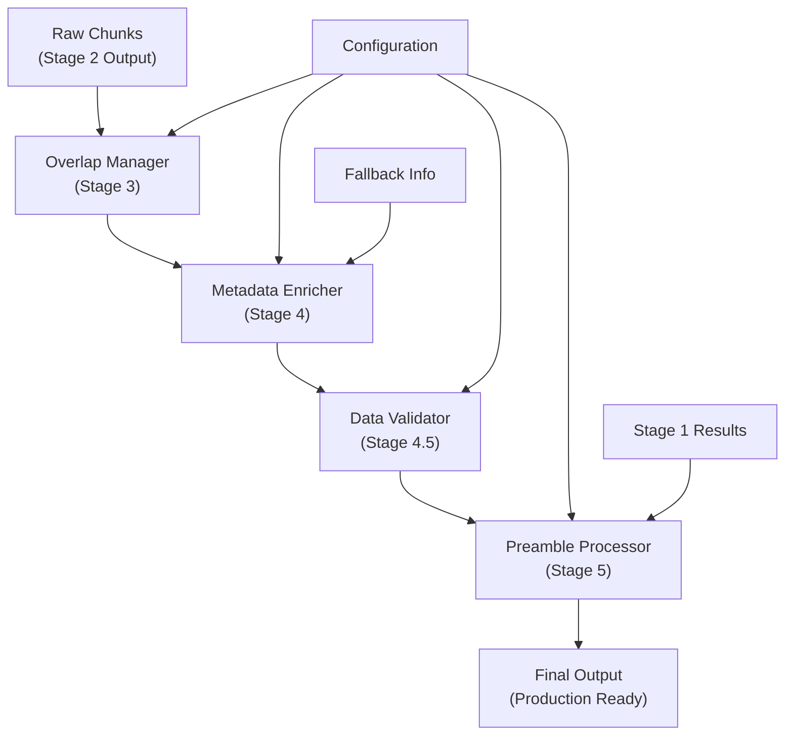
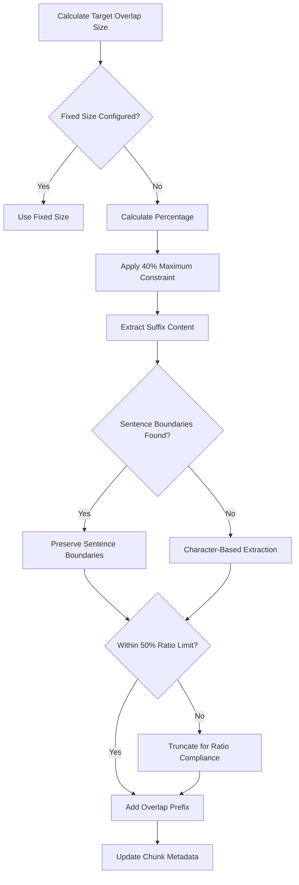
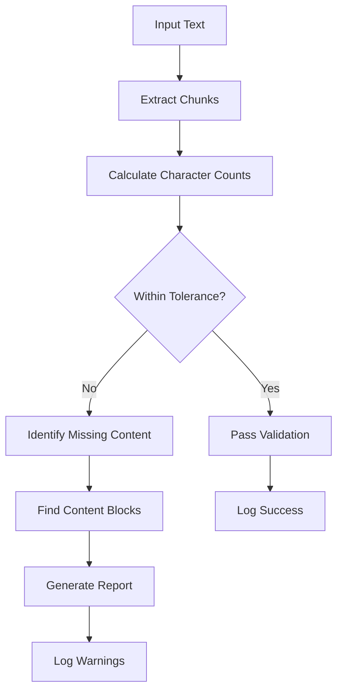

# Post-Processing Pipeline

<cite>
**Referenced Files in This Document**
- [markdown_chunker/chunker/core.py](file://markdown_chunker/chunker/core.py)
- [markdown_chunker/chunker/orchestrator.py](file://markdown_chunker/chunker/orchestrator.py)
- [markdown_chunker/chunker/transformer.py](file://markdown_chunker/chunker/transformer.py)
- [markdown_chunker/chunker/types.py](file://markdown_chunker/chunker/types.py)
- [markdown_chunker/chunker/components/overlap_manager.py](file://markdown_chunker/chunker/components/overlap_manager.py)
- [markdown_chunker/chunker/components/metadata_enricher.py](file://markdown_chunker/chunker/components/metadata_enricher.py)
- [markdown_chunker/chunker/validator.py](file://markdown_chunker/chunker/validator.py)
- [tests/chunker/test_overlap_properties.py](file://tests/chunker/test_overlap_properties.py)
- [tests/chunker/test_metadata_properties.py](file://tests/chunker/test_metadata_properties.py)
- [tests/chunker/test_preamble_chunking.py](file://tests/chunker/test_preamble_chunking.py)
- [examples/rag_integration.py](file://examples/rag_integration.py)
</cite>

## Table of Contents
1. [Introduction](#introduction)
2. [Pipeline Architecture](#pipeline-architecture)
3. [Sequential Processing Stages](#sequential-processing-stages)
4. [Overlap Management](#overlap-management)
5. [Metadata Enrichment](#metadata-enrichment)
6. [Data Validation](#data-validation)
7. [Preamble Processing](#preamble-processing)
8. [Configuration Impact](#configuration-impact)
9. [Performance Considerations](#performance-considerations)
10. [Integration Examples](#integration-examples)
11. [Troubleshooting Guide](#troubleshooting-guide)
12. [Conclusion](#conclusion)

## Introduction

The Post-Processing Pipeline represents the final stage of the Markdown chunking process, transforming raw chunks into production-ready output with sophisticated enhancements. This pipeline applies four critical transformations after initial chunking: overlap application for context preservation, metadata enrichment for searchability, data validation for completeness, and preamble processing for document structure awareness.

The pipeline operates as a sequential workflow where each stage builds upon the previous one, ensuring that chunks are not only properly sized but also optimized for downstream applications like Retrieval-Augmented Generation (RAG) systems, search engines, and content management platforms.

## Pipeline Architecture

The Post-Processing Pipeline is orchestrated through the [`MarkdownChunker`](file://markdown_chunker/chunker/core.py#L41-L780) class, which coordinates all post-processing activities through the `_post_process_chunks` method. The pipeline follows a modular architecture where specialized components handle specific transformations.



**Diagram sources**
- [markdown_chunker/chunker/core.py](file://markdown_chunker/chunker/core.py#L265-L345)

**Section sources**
- [markdown_chunker/chunker/core.py](file://markdown_chunker/chunker/core.py#L265-L345)

## Sequential Processing Stages

### Stage 3: Overlap Application

The overlap stage enhances chunks with contextual continuity, crucial for RAG systems and semantic search applications. The [`OverlapManager`](file://markdown_chunker/chunker/components/overlap_manager.py#L13-L447) creates overlapping content between adjacent chunks while preserving sentence boundaries and maintaining content integrity.

#### Key Features:
- **Sentence-Based Overlap**: Maintains natural language flow by respecting sentence boundaries
- **Configurable Sizes**: Supports both fixed-size and percentage-based overlap
- **Integrity Preservation**: Prevents breaking of code blocks and other atomic elements
- **Ratio Control**: Ensures overlap doesn't dominate chunk content (max 50%)

#### Implementation Details:
The overlap manager calculates optimal overlap sizes while considering:
- Maximum overlap as 40% of source chunk size
- Ratio constraint of 45% to prevent excessive overlap
- Unbalanced code fence detection to maintain integrity

**Section sources**
- [markdown_chunker/chunker/components/overlap_manager.py](file://markdown_chunker/chunker/components/overlap_manager.py#L37-L80)

### Stage 4: Metadata Enrichment

The metadata enrichment stage adds comprehensive contextual information to each chunk, enhancing searchability and enabling intelligent downstream processing. The [`MetadataEnricher`](file://markdown_chunker/chunker/components/metadata_enricher.py#L13-L414) provides rich metadata for different content types.

#### Enrichment Categories:
1. **Positional Metadata**: Chunk indices, total counts, first/last indicators
2. **Content Statistics**: Line counts, word counts, character statistics
3. **Content Type Detection**: Automatic classification of code, lists, tables, etc.
4. **Searchability Enhancements**: Preview text, URL/email detection, formatting indicators
5. **Strategy-Specific Metadata**: Specialized information based on chunking strategy

#### Content-Type Specific Enrichment:
- **Code Blocks**: Language detection, import/import statements, comment identification
- **Lists**: Item counting, nesting detection, list type classification
- **Tables**: Row/column counting, alignment detection
- **Structural Elements**: Header counting, section boundaries

**Section sources**
- [markdown_chunker/chunker/components/metadata_enricher.py](file://markdown_chunker/chunker/components/metadata_enricher.py#L34-L142)

### Stage 4.5: Data Validation

The data validation stage ensures complete content preservation through the chunking pipeline. The [`DataCompletenessValidator`](file://markdown_chunker/chunker/validator.py#L53-L354) performs comprehensive checks to guarantee no data loss.

#### Validation Criteria:
- **Character Coverage**: Ensures 95%+ character preservation (configurable tolerance)
- **Line Coverage**: Identifies gaps in line coverage, particularly large gaps (>10 lines)
- **Content Integrity**: Detects missing significant content blocks
- **Whitespace Normalization**: Accounts for minor formatting differences

#### Validation Outcomes:
- **Pass/Fail**: Clear indication of data completeness
- **Missing Blocks**: Detailed identification of missing content regions
- **Warnings**: Non-fatal issues like large gaps or significant data loss

**Section sources**
- [markdown_chunker/chunker/validator.py](file://markdown_chunker/chunker/validator.py#L71-L151)

### Stage 5: Preamble Processing

The preamble processing stage handles document metadata and introductory content, providing flexible options for document structure management. This stage can either embed preamble information in the first chunk or create a dedicated preamble chunk.

#### Processing Options:
1. **Embedded Preamble**: Adds preamble metadata to the first chunk's metadata
2. **Dedicated Chunk**: Creates a separate chunk for preamble content
3. **Disabled Processing**: Skips preamble extraction entirely

#### Preamble Types:
- **Metadata**: Structured information like author, date, version
- **Introduction**: General introductory text providing context
- **Summary**: Brief overview or executive summary

**Section sources**
- [markdown_chunker/chunker/core.py](file://markdown_chunker/chunker/core.py#L463-L499)

## Overlap Management

The OverlapManager implements sophisticated overlap strategies designed specifically for RAG systems and semantic search applications. The overlap mechanism ensures that adjacent chunks maintain contextual continuity while preventing information fragmentation.

### Overlap Calculation Algorithm



**Diagram sources**
- [markdown_chunker/chunker/components/overlap_manager.py](file://markdown_chunker/chunker/components/overlap_manager.py#L109-L240)

### Overlap Configuration Options

| Parameter | Description | Default | Impact |
|-----------|-------------|---------|---------|
| `enable_overlap` | Enable/disable overlap processing | `True` | Controls whether overlap is applied |
| `overlap_size` | Fixed overlap size in characters | `200` | Direct control over overlap amount |
| `overlap_percentage` | Percentage of chunk size for overlap | `0.1` (10%) | Dynamic sizing based on chunk size |
| `max_chunk_size` | Maximum chunk size constraint | `4096` | Limits overlap to maintain ratio |

### Overlap Quality Metrics

The overlap manager provides comprehensive statistics about overlap effectiveness:

```python
{
    "total_chunks": 10,
    "chunks_with_overlap": 9,
    "avg_overlap_size": 185,
    "total_overlap_size": 1665,
    "overlap_percentage": 90.0
}
```

**Section sources**
- [markdown_chunker/chunker/components/overlap_manager.py](file://markdown_chunker/chunker/components/overlap_manager.py#L405-L447)

## Metadata Enrichment

The MetadataEnricher provides comprehensive metadata enhancement across multiple content types, enabling intelligent downstream processing and search capabilities.

### Metadata Categories

#### Positional Information
- `chunk_index`: Zero-based position in chunk sequence
- `total_chunks`: Total number of chunks in document
- `is_first_chunk`: Boolean indicating first chunk in sequence
- `is_last_chunk`: Boolean indicating last chunk in sequence

#### Content Statistics
- `line_count`: Number of lines in chunk
- `word_count`: Word count for text analysis
- `char_count`: Character count for size calculations
- `avg_line_length`: Average line length for formatting assessment
- `avg_word_length`: Average word length for readability metrics

#### Content Type Detection
- **Code Detection**: Language identification, import detection, comment recognition
- **List Detection**: Item counting, nesting levels, list type classification
- **Table Detection**: Row/column counting, alignment detection
- **Text Detection**: Basic text statistics and formatting indicators

### Strategy-Specific Enrichment

Different chunking strategies receive specialized metadata:

#### Code Strategy Metadata
```python
{
    "code_block_count": 2,
    "has_imports": true,
    "has_comments": true,
    "has_inline_code": false,
    "language": "python"
}
```

#### List Strategy Metadata
```python
{
    "ordered_item_count": 3,
    "unordered_item_count": 5,
    "task_item_count": 2,
    "has_nested_lists": true,
    "nested_item_count": 4
}
```

#### Table Strategy Metadata
```python
{
    "table_row_count": 4,
    "table_count": 1,
    "has_column_alignment": true
}
```

**Section sources**
- [markdown_chunker/chunker/components/metadata_enricher.py](file://markdown_chunker/chunker/components/metadata_enricher.py#L165-L287)

## Data Validation

The DataCompletenessValidator ensures that no content is lost during the chunking process, providing confidence in data integrity for downstream applications.

### Validation Process



**Diagram sources**
- [markdown_chunker/chunker/validator.py](file://markdown_chunker/chunker/validator.py#L71-L151)

### Validation Metrics

#### Character-Level Validation
- **Total Characters**: Input vs. output character comparison
- **Coverage Ratio**: Output characters divided by input characters
- **Missing Characters**: Absolute difference between input and output
- **Tolerance Level**: Configurable 5% allowance for whitespace normalization

#### Content-Level Validation
- **Gap Detection**: Identifies missing line ranges
- **Block Classification**: Categorizes missing content (code, text, lists, tables)
- **Preview Generation**: Provides content previews for missing regions

### Validation Report Structure

```python
ValidationResult(
    is_valid=True,
    input_chars=1000,
    output_chars=950,
    missing_chars=50,
    char_coverage=0.95,
    missing_blocks=[
        MissingContentBlock(
            start_line=15,
            end_line=20,
            content_preview="...missing content...",
            size_chars=150,
            block_type="code"
        )
    ],
    warnings=["Found 2 gaps in line coverage"]
)
```

**Section sources**
- [markdown_chunker/chunker/validator.py](file://markdown_chunker/chunker/validator.py#L25-L51)

## Preamble Processing

Preamble processing handles document metadata and introductory content, providing flexibility in how document structure information is managed.

### Processing Modes

#### Embedded Mode (`separate_preamble_chunk=False`)
Preamble information is embedded as metadata in the first chunk:

```python
# First chunk metadata
{
    "has_preamble": True,
    "preamble_type": "metadata",
    "preamble": {
        "type": "metadata",
        "content": "Author: John Doe\nDate: 2025-11-16",
        "line_count": 2,
        "has_metadata": True,
        "metadata_fields": {
            "author": "John Doe",
            "date": "2025-11-16"
        }
    }
}
```

#### Separate Chunk Mode (`separate_preamble_chunk=True`)
Creates a dedicated chunk for preamble content:

```python
# Preamble chunk
Chunk(
    content="Author: John Doe\nDate: 2025-11-16",
    start_line=1,
    end_line=2,
    metadata={
        "strategy": "preamble",
        "content_type": "preamble",
        "preamble_type": "metadata",
        "has_metadata": True,
        "is_preamble_chunk": True
    }
)
```

### Preamble Detection Algorithm

The preamble processor identifies document metadata through several mechanisms:

1. **Header Patterns**: Recognizes common metadata patterns (Author:, Date:, Version:)
2. **Structure Analysis**: Analyzes document structure to identify introductory content
3. **Length Thresholds**: Ignores very short preamble sections (< 10 characters)
4. **Content Type Analysis**: Classifies preamble as metadata or introduction

### Preamble Configuration

| Setting | Description | Default | Impact |
|---------|-------------|---------|---------|
| `extract_preamble` | Enable preamble extraction | `True` | Controls whether preamble is processed |
| `separate_preamble_chunk` | Create dedicated preamble chunk | `False` | Determines processing mode |
| `preamble_min_size` | Minimum size for preamble | `10` | Filters out short preamble sections |

**Section sources**
- [markdown_chunker/chunker/core.py](file://markdown_chunker/chunker/core.py#L463-L499)

## Configuration Impact

Configuration options profoundly influence each stage of the post-processing pipeline, affecting performance, quality, and output characteristics.

### Overlap Configuration Impact

#### Small Overlap Settings (50-100 chars)
- **Advantages**: Minimal processing overhead, clean chunk boundaries
- **Disadvantages**: Reduced context preservation for RAG systems
- **Use Case**: Fast processing, minimal memory usage

#### Medium Overlap Settings (150-300 chars)
- **Advantages**: Good balance between context and performance
- **Disadvantages**: Moderate processing overhead
- **Use Case**: General-purpose RAG applications

#### Large Overlap Settings (400+ chars)
- **Advantages**: Excellent context preservation
- **Disadvantages**: Higher processing overhead, potential redundancy
- **Use Case**: High-context retrieval systems

### Metadata Enrichment Impact

#### Minimal Metadata
- **Configuration**: Disable specific enrichment categories
- **Impact**: Faster processing, smaller output size
- **Trade-off**: Reduced searchability and analytics capability

#### Comprehensive Metadata
- **Configuration**: Enable all enrichment categories
- **Impact**: Rich metadata, enhanced searchability
- **Trade-off**: Slower processing, larger output size

### Validation Configuration

#### Strict Validation
- **Tolerance**: 1-2% character preservation
- **Impact**: High confidence in data integrity
- **Trade-off**: May reject valid but slightly formatted documents

#### Lenient Validation
- **Tolerance**: 10-15% character preservation
- **Impact**: More tolerant of formatting variations
- **Trade-off**: May accept documents with significant formatting loss

**Section sources**
- [markdown_chunker/chunker/types.py](file://markdown_chunker/chunker/types.py#L574-L660)

## Performance Considerations

The post-processing pipeline introduces additional computational overhead, but careful configuration can optimize performance while maintaining quality.

### Processing Time Breakdown

| Stage | Typical Duration | Impact Factor |
|-------|------------------|---------------|
| Overlap Application | 5-15% of total time | Sentence boundary detection |
| Metadata Enrichment | 10-20% of total time | Content type analysis |
| Data Validation | 5-10% of total time | Content comparison |
| Preamble Processing | 2-5% of total time | Structure analysis |

### Memory Usage Patterns

#### Peak Memory Usage
- **Overlap Stage**: Temporary storage for overlap calculations
- **Metadata Stage**: Additional metadata storage per chunk
- **Validation Stage**: Dual storage for input and output comparison

#### Memory Optimization Strategies
- **Streaming Processing**: Process chunks individually rather than loading all at once
- **Lazy Evaluation**: Defer expensive operations until needed
- **Memory Pooling**: Reuse temporary objects across operations

### Performance Tuning Guidelines

#### For High-Throughput Applications
1. **Reduce Overlap Size**: Use smaller overlap values (50-100 chars)
2. **Selective Validation**: Enable validation only for critical documents
3. **Minimal Metadata**: Disable unnecessary enrichment categories

#### For Quality-Critical Applications
1. **Optimal Overlap**: Use 10-15% overlap for best context preservation
2. **Full Validation**: Enable comprehensive data validation
3. **Rich Metadata**: Enable all enrichment categories

## Integration Examples

### RAG System Integration

The post-processing pipeline is specifically designed for RAG system integration, with overlap and metadata features optimized for semantic search and retrieval.

```python
# RAG-optimized configuration
config = ChunkConfig(
    max_chunk_size=500,      # Smaller chunks for embeddings
    min_chunk_size=100,
    enable_overlap=True,     # Context preservation
    overlap_size=50,         # 10% overlap for context
    extract_preamble=True,   # Preserve document metadata
    separate_preamble_chunk=False
)

chunker = MarkdownChunker(config)
result = chunker.chunk_with_analysis(document)

# Prepare for vector database
embeddings_data = []
for chunk in result.chunks:
    embeddings_data.append({
        'id': f"chunk_{chunk.index}",
        'text': chunk.content,
        'metadata': {
            'chunk_index': chunk.index,
            'lines': f"{chunk.start_line}-{chunk.end_line}",
            'size': chunk.size,
            'content_type': chunk.metadata.get('content_type', 'text'),
            'has_code': 'language' in chunk.metadata,
            'has_table': 'column_count' in chunk.metadata,
            'has_list': 'list_type' in chunk.metadata,
        }
    })
```

### Search Engine Integration

For search engine applications, the pipeline provides rich metadata for indexing and ranking:

```python
# Search-optimized configuration
config = ChunkConfig(
    max_chunk_size=1000,     # Larger chunks for context
    enable_overlap=True,
    overlap_size=100,
    extract_preamble=True,
    separate_preamble_chunk=True  # Separate metadata for indexing
)

# Enhanced search metadata
{
    "preview": "This is the first sentence...",
    "has_urls": True,
    "has_emails": False,
    "has_numbers": True,
    "has_bold": True,
    "has_italic": False,
    "has_inline_code": True
}
```

### Content Management Integration

For content management systems, the pipeline provides structured metadata for content organization:

```python
# Content management configuration
config = ChunkConfig(
    max_chunk_size=2000,
    enable_overlap=False,    # Clean chunk boundaries
    extract_preamble=True,
    separate_preamble_chunk=False
)

# Structured content metadata
{
    "has_preamble": True,
    "preamble_type": "metadata",
    "preamble": {
        "type": "metadata",
        "metadata_fields": {
            "author": "Jane Smith",
            "category": "Technical Documentation",
            "tags": ["API", "Tutorial", "Python"]
        }
    }
}
```

**Section sources**
- [examples/rag_integration.py](file://examples/rag_integration.py#L13-L53)

## Troubleshooting Guide

### Common Issues and Solutions

#### Issue: Overlap Not Applied
**Symptoms**: Chunks don't have overlap metadata despite configuration
**Causes**: 
- Single chunk documents (no previous chunk)
- Disabled overlap configuration
- Empty or whitespace-only chunks

**Solutions**:
```python
# Verify configuration
print(f"Overlap enabled: {config.enable_overlap}")
print(f"Overlap size: {config.overlap_size}")

# Check chunk count
if len(chunks) <= 1:
    print("Single chunk - overlap not applicable")
```

#### Issue: Metadata Missing
**Symptoms**: Chunks lack expected metadata fields
**Causes**:
- Metadata enrichment disabled
- Content type detection failed
- Strategy-specific metadata not available

**Solutions**:
```python
# Enable comprehensive metadata
config = ChunkConfig(
    max_chunk_size=4096,
    enable_overlap=True,
    extract_preamble=True,
    # All enrichment categories enabled by default
)

# Check content type detection
for chunk in chunks:
    print(f"Content type: {chunk.content_type}")
    print(f"Strategy: {chunk.strategy}")
```

#### Issue: Validation Failures
**Symptoms**: Data completeness validation reports missing content
**Causes**:
- Significant formatting changes during processing
- Large content blocks causing size constraints
- Edge cases in content structure

**Solutions**:
```python
# Adjust validation tolerance
validator = DataCompletenessValidator(tolerance=0.1)  # 10% tolerance

# Analyze missing content
result = validator.validate_chunks(input_text, chunks)
if not result.is_valid:
    for block in result.missing_blocks:
        print(f"Missing block: {block.start_line}-{block.end_line}")
        print(f"Preview: {block.content_preview}")
```

#### Issue: Preamble Not Detected
**Symptoms**: Expected preamble information not included
**Causes**:
- Preamble extraction disabled
- Insufficient preamble content
- Complex preamble structure

**Solutions**:
```python
# Enable preamble processing
config = ChunkConfig(
    extract_preamble=True,
    preamble_min_size=5  # Reduce minimum size
)

# Check preamble detection
if chunks[0].get_metadata("has_preamble"):
    preamble = chunks[0].get_metadata("preamble")
    print(f"Preamble type: {preamble.get('type')}")
    print(f"Metadata fields: {preamble.get('metadata_fields', {})}")
```

### Debugging Tools

#### Pipeline State Inspection
```python
def inspect_pipeline_state(result):
    """Inspect intermediate pipeline state."""
    print(f"Strategy used: {result.strategy_used}")
    print(f"Total chunks: {len(result.chunks)}")
    
    # Check overlap
    overlap_chunks = [c for c in result.chunks if c.get_metadata("has_overlap")]
    print(f"Chunks with overlap: {len(overlap_chunks)}")
    
    # Check metadata
    for i, chunk in enumerate(result.chunks):
        print(f"Chunk {i}: {chunk.size} chars, {len(chunk.metadata)} metadata fields")
```

#### Validation Analysis
```python
def analyze_validation_issues(result):
    """Analyze validation failures."""
    if result.warnings:
        for warning in result.warnings:
            if "data completeness" in warning.lower():
                print(f"Validation issue: {warning}")
    
    # Check for validation errors
    if result.errors:
        for error in result.errors:
            if "validation" in error.lower():
                print(f"Validation error: {error}")
```

## Conclusion

The Post-Processing Pipeline represents a sophisticated system for transforming raw chunks into production-ready output with enhanced context preservation, rich metadata, and data integrity guarantees. Through its sequential stages of overlap application, metadata enrichment, data validation, and preamble processing, the pipeline ensures that chunks are optimized for downstream applications while maintaining complete content fidelity.

Key strengths of the pipeline include:

- **Context Preservation**: Sophisticated overlap management for RAG and semantic search applications
- **Rich Metadata**: Comprehensive metadata enrichment enabling intelligent downstream processing
- **Data Integrity**: Robust validation ensuring complete content preservation
- **Flexibility**: Configurable processing options for diverse use cases
- **Performance**: Optimized algorithms minimizing computational overhead

The pipeline's design reflects careful consideration of real-world use cases, particularly in RAG systems where context preservation is crucial, and content management systems where rich metadata enables powerful search and organization capabilities. The modular architecture allows for easy extension and customization while maintaining reliability and performance.

Future enhancements could include machine learning-based content type detection, advanced overlap strategies for specific domains, and integration with external metadata sources for enhanced enrichment capabilities.