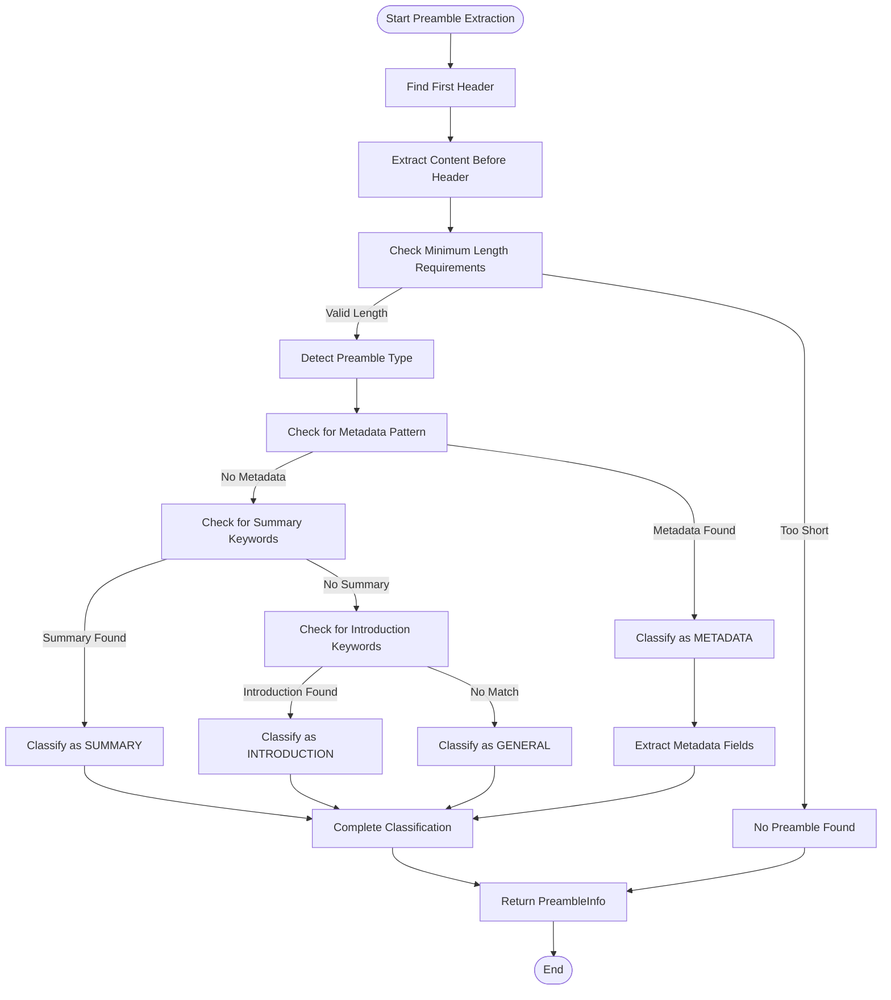
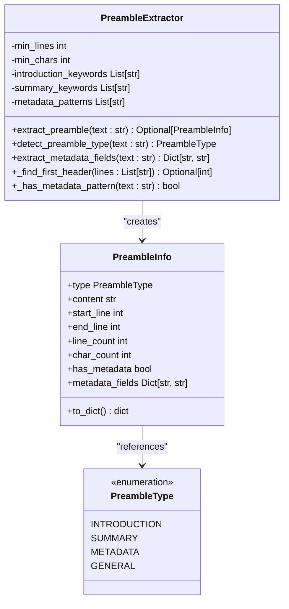
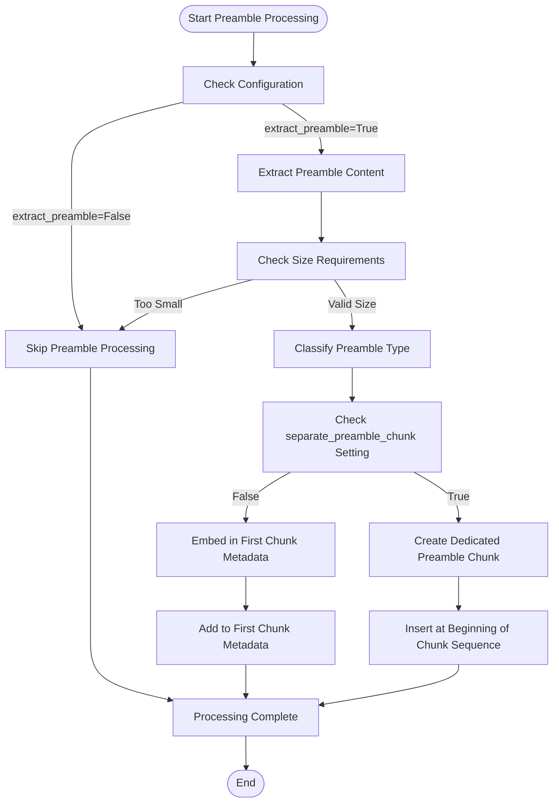
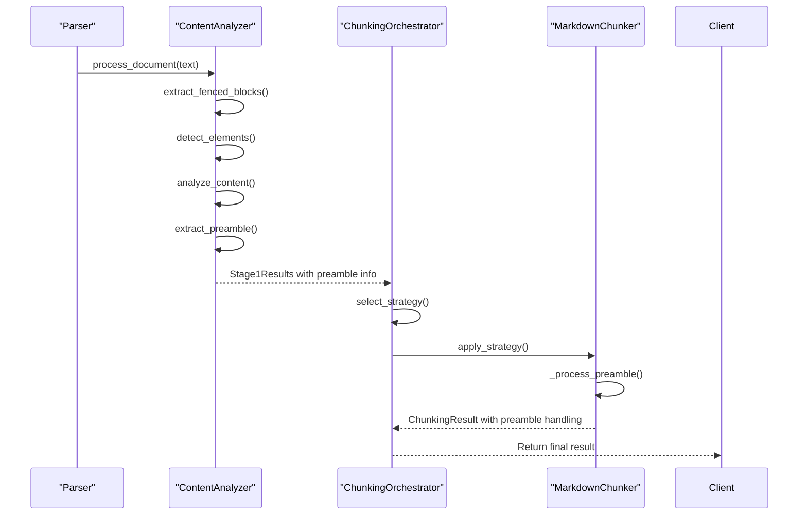

# Preamble Processing

<cite>
**Referenced Files in This Document**   
- [preamble.py](file://markdown_chunker/parser/preamble.py)
- [types.py](file://markdown_chunker/parser/types.py)
- [core.py](file://markdown_chunker/chunker/core.py)
- [analyzer.py](file://markdown_chunker/parser/analyzer.py)
- [chunk_config.py](file://markdown_chunker/chunker/types.py)
</cite>

## Table of Contents
1. [Introduction](#introduction)
2. [Preamble Identification and Classification](#preamble-identification-and-classification)
3. [Data Structures](#data-structures)
4. [Conditional Processing Logic](#conditional-processing-logic)
5. [Integration with Parser and Chunking Pipeline](#integration-with-parser-and-chunking-pipeline)
6. [Examples and Use Cases](#examples-and-use-cases)
7. [Configuration and Metadata Preservation](#configuration-and-metadata-preservation)
8. [Conclusion](#conclusion)

## Introduction
The preamble processing functionality in the markdown-chunker system is responsible for identifying, classifying, and handling introductory content that appears before the first header in a Markdown document. This content often contains valuable metadata, summaries, or introductions that should be preserved and appropriately processed during the chunking pipeline. The system uses a sophisticated extraction mechanism that analyzes the position, structure, and content type of preamble sections to determine their classification and subsequent treatment.

**Section sources**
- [preamble.py](file://markdown_chunker/parser/preamble.py#L1-L343)

## Preamble Identification and Classification
The PreambleExtractor class is responsible for identifying and classifying preamble content in Markdown documents. The extraction process begins by locating the first header in the document, which serves as the boundary between the preamble and the main content. The system supports both ATX-style headers (using # symbols) and Setext-style headers (using underline characters like === or ---).

Preamble classification is performed through a multi-step analysis that examines the content for specific patterns and keywords. The system identifies four primary types of preamble content:
- **Introduction**: Contains introductory text with keywords like "introduction", "overview", "about", or "welcome"
- **Summary**: Contains document summaries or abstracts with keywords like "TL;DR", "summary", "abstract", or "synopsis"
- **Metadata**: Contains structured metadata in key-value format (e.g., "Author: John", "Date: 2025")
- **General**: Content that doesn't fit into the other categories

The classification process first checks for metadata patterns using regular expressions, then looks for summary keywords, followed by introduction keywords. If none of these patterns are detected, the content is classified as general preamble.



**Diagram sources**
- [preamble.py](file://markdown_chunker/parser/preamble.py#L79-L343)

**Section sources**
- [preamble.py](file://markdown_chunker/parser/preamble.py#L79-L343)

## Data Structures
The preamble processing system utilizes two primary data structures: PreambleType and PreambleInfo.

### PreambleType
The PreambleType is an enumeration that defines the four possible classifications for preamble content:
- **INTRODUCTION**: For introductory text sections
- **SUMMARY**: For document summaries or abstracts
- **METADATA**: For structured metadata blocks
- **GENERAL**: For general content that doesn't fit other categories

### PreambleInfo
The PreambleInfo dataclass captures comprehensive information about the extracted preamble, including:
- **type**: The classification of the preamble (from PreambleType)
- **content**: The actual text content of the preamble
- **start_line** and **end_line**: The line numbers in the source document
- **line_count**: Number of lines in the preamble
- **char_count**: Number of characters in the preamble
- **has_metadata**: Boolean indicating whether metadata was detected
- **metadata_fields**: Dictionary containing extracted metadata key-value pairs

The PreambleInfo class includes a to_dict() method that serializes the object to a dictionary format for easy integration with other system components and JSON serialization.



**Diagram sources**
- [preamble.py](file://markdown_chunker/parser/preamble.py#L23-L44)
- [preamble.py](file://markdown_chunker/parser/preamble.py#L32-L44)
- [preamble.py](file://markdown_chunker/parser/preamble.py#L79-L343)

**Section sources**
- [preamble.py](file://markdown_chunker/parser/preamble.py#L23-L44)
- [preamble.py](file://markdown_chunker/parser/preamble.py#L32-L44)

## Conditional Processing Logic
The system implements conditional processing logic that determines how preamble content is handled based on configuration settings. This logic is controlled by two key configuration parameters in the ChunkConfig class: extract_preamble and separate_preamble_chunk.

When extract_preamble is enabled (default behavior), the system processes the preamble according to the separate_preamble_chunk setting:
- If separate_preamble_chunk is False (default), the preamble content is embedded into the metadata of the first content chunk. This approach preserves the preamble information while maintaining a continuous flow of content chunks.
- If separate_preamble_chunk is True, a dedicated chunk is created for the preamble content and inserted at the beginning of the chunk sequence. This approach treats the preamble as a distinct content unit.

The processing also considers minimum size requirements defined by min_lines (default: 2) and min_chars (default: 50) parameters. Preambles that don't meet these thresholds are ignored to avoid processing insignificant content.



**Diagram sources**
- [core.py](file://markdown_chunker/chunker/core.py#L463-L500)
- [chunk_config.py](file://markdown_chunker/chunker/types.py#L609-L612)

**Section sources**
- [core.py](file://markdown_chunker/chunker/core.py#L463-L500)

## Integration with Parser and Chunking Pipeline
The preamble processing functionality is tightly integrated with the parser and chunking pipeline through the ContentAnalyzer and ChunkingOrchestrator components. During the Stage 1 analysis phase, the ContentAnalyzer extracts and analyzes the preamble as part of the comprehensive document analysis.

The integration follows this sequence:
1. The parser processes the document and identifies structural elements
2. The ContentAnalyzer extracts the preamble using the PreambleExtractor
3. The preamble information is included in the ContentAnalysis object
4. The ChunkingOrchestrator passes the analysis results to the chunking strategies
5. The core chunking logic processes the preamble according to configuration

This integration ensures that preamble metadata is available throughout the chunking process and can influence downstream chunking strategies. For example, documents with metadata-rich preambles might be processed differently than those with summary preambles.



**Diagram sources**
- [analyzer.py](file://markdown_chunker/parser/analyzer.py#L175-L178)
- [orchestrator.py](file://markdown_chunker/chunker/orchestrator.py#L82-L95)
- [core.py](file://markdown_chunker/chunker/core.py#L463-L500)

**Section sources**
- [analyzer.py](file://markdown_chunker/parser/analyzer.py#L175-L178)
- [orchestrator.py](file://markdown_chunker/chunker/orchestrator.py#L82-L95)

## Examples and Use Cases
The preamble processing system handles various types of preamble content, each with specific treatment in the chunking pipeline.

### Metadata Preamble
A metadata preamble contains structured information in key-value format:
```
Author: John Doe
Date: 2025-11-16
Version: 1.0
Status: Draft
```
This would be classified as METADATA type, with the individual fields extracted into the metadata_fields dictionary. The system recognizes common metadata keys like "author", "date", "version", "title", "tags", "status", "created", and "updated".

### Summary Preamble
A summary preamble contains a brief overview or abstract:
```
TL;DR: This document explains the markdown chunking algorithm in detail with examples and best practices.
```
This would be classified as SUMMARY type based on the "TL;DR" keyword. Similar classifications occur for "summary", "abstract", or "synopsis" keywords.

### Introduction Preamble
An introduction preamble provides an overview of the document:
```
This is an introduction to the document. It provides an overview of what you'll find here.
```
This would be classified as INTRODUCTION type based on keywords like "introduction", "overview", "about", or "welcome".

### General Preamble
Content that doesn't match specific patterns is classified as GENERAL:
```
This is some content before the first header. It doesn't match any specific pattern.
```

**Section sources**
- [test_preamble_extractor.py](file://tests/parser/test_preamble_extractor.py#L88-L150)

## Configuration and Metadata Preservation
The preamble processing behavior is controlled through the ChunkConfig class, which provides several configuration options:

- **extract_preamble** (default: True): Enables or disables preamble extraction
- **separate_preamble_chunk** (default: False): Determines whether to create a dedicated chunk for the preamble
- **preamble_min_size** (default: 10): Minimum character count for valid preamble
- **min_lines** (default: 2): Minimum number of lines for valid preamble
- **min_chars** (default: 50): Minimum character count for valid preamble

When the preamble is embedded in the first chunk's metadata, the following fields are preserved:
- **preamble**: Complete PreambleInfo object serialized to dictionary
- **has_preamble**: Boolean flag indicating preamble presence
- **preamble_type**: Classification of the preamble content
- **metadata_fields**: Extracted metadata key-value pairs

When a separate preamble chunk is created, it includes metadata indicating its special status:
- **content_type**: Set to "preamble"
- **is_preamble_chunk**: Boolean flag
- **strategy**: Set to "preamble"
- **preamble_type**: Original classification

This comprehensive metadata preservation ensures that preamble information remains accessible in the final output regardless of the processing approach used.

**Section sources**
- [chunk_config.py](file://markdown_chunker/chunker/types.py#L609-L613)
- [core.py](file://markdown_chunker/chunker/core.py#L477-L499)

## Conclusion
The preamble processing functionality provides a robust mechanism for handling introductory content in Markdown documents. By identifying and classifying preamble sections based on position, structure, and content type, the system ensures that valuable metadata, summaries, and introductions are properly preserved and integrated into the chunking pipeline. The flexible configuration options allow users to choose between embedding preamble content in the first chunk or creating a dedicated preamble chunk, accommodating different use cases and requirements. The tight integration with the parser and chunking pipeline ensures that preamble metadata influences downstream processing and remains accessible in the final output.

**Section sources**
- [preamble.py](file://markdown_chunker/parser/preamble.py#L1-L343)
- [core.py](file://markdown_chunker/chunker/core.py#L463-L500)