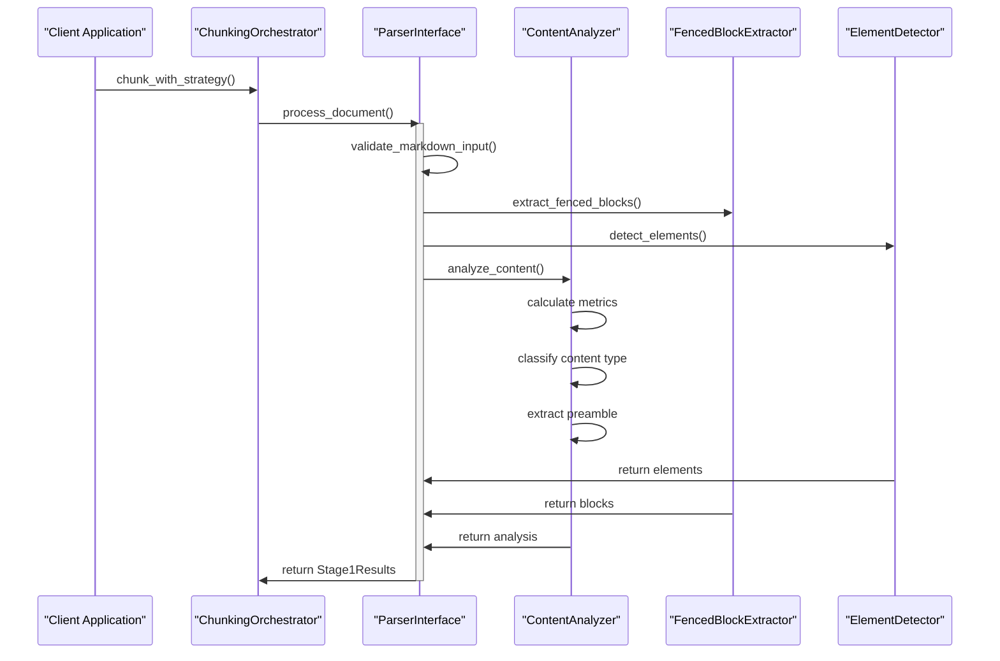
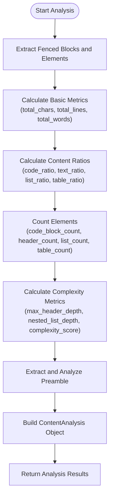
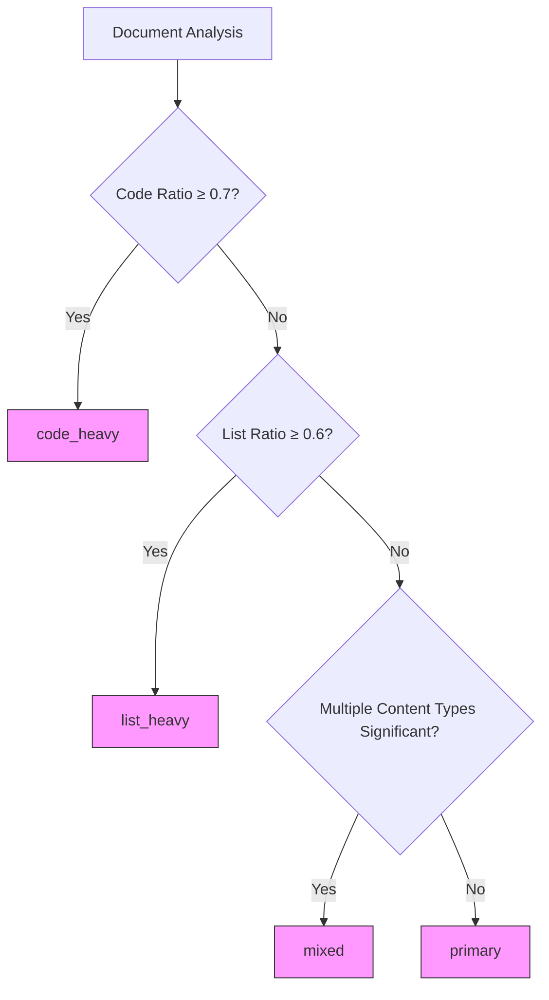
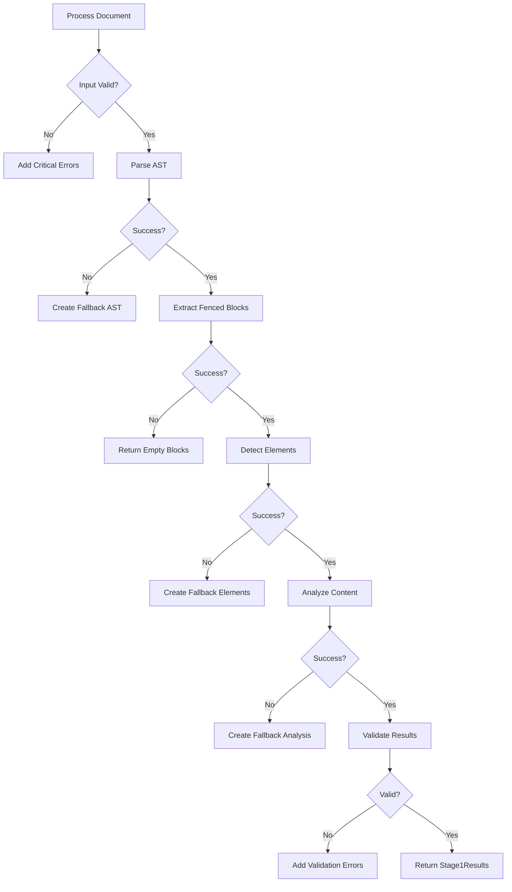

# Stage 1 Analysis

<cite>
**Referenced Files in This Document**   
- [analyzer.py](file://markdown_chunker/parser/analyzer.py)
- [core.py](file://markdown_chunker/parser/core.py)
- [types.py](file://markdown_chunker/parser/types.py)
- [orchestrator.py](file://markdown_chunker/chunker/orchestrator.py)
- [errors.py](file://markdown_chunker/parser/errors.py)
</cite>

## Table of Contents
1. [Introduction](#introduction)
2. [Stage 1 Processing Pipeline](#stage-1-processing-pipeline)
3. [Content Analysis and Metrics](#content-analysis-and-metrics)
4. [Document Type Classification](#document-type-classification)
5. [Analysis Output Examples](#analysis-output-examples)
6. [Error Handling and Fallbacks](#error-handling-and-fallbacks)
7. [Impact on Strategy Selection](#impact-on-strategy-selection)

## Introduction

Stage 1 Analysis is the initial phase of the orchestration pipeline responsible for extracting structural elements, content characteristics, and metadata from raw Markdown documents. This analysis phase uses the ParserInterface to perform comprehensive content analysis and AST creation, which informs downstream processing decisions. The output of Stage 1, packaged as Stage1Results, contains detailed metrics about the document's composition, including element counts, content ratios, complexity scores, and structural characteristics. This information is critical for determining the optimal chunking strategy in subsequent stages.

**Section sources**
- [core.py](file://markdown_chunker/parser/core.py#L418-L510)
- [analyzer.py](file://markdown_chunker/parser/analyzer.py#L27-L206)

## Stage 1 Processing Pipeline

The Stage 1 processing pipeline executes a comprehensive analysis of Markdown documents through multiple coordinated components. The ParserInterface (implemented as Stage1Interface) serves as the main entry point, orchestrating the extraction and analysis process. When process_document() is called with raw Markdown text, the pipeline validates the input, then concurrently processes the document through four key components: AST parsing, fenced block extraction, element detection, and content analysis.

The pipeline begins with input validation through validate_markdown_input(), which checks for proper string type, size limits (100MB maximum), and valid UTF-8 encoding. After validation, the system extracts fenced code blocks using FencedBlockExtractor, which identifies code blocks with proper handling of nested fences and indentation. Simultaneously, the system detects structural elements like headers, lists, and tables through detect_elements(). The content analyzer calculates comprehensive metrics about the document's composition, while an AST builder creates a hierarchical representation of the document structure.

**Diagram sources **
- [core.py](file://markdown_chunker/parser/core.py#L418-L510)
- [analyzer.py](file://markdown_chunker/parser/analyzer.py#L27-L206)

**Section sources**
- [core.py](file://markdown_chunker/parser/core.py#L418-L510)
- [analyzer.py](file://markdown_chunker/parser/analyzer.py#L27-L206)

## Content Analysis and Metrics

The content analysis process extracts detailed information about the document's composition by detecting code blocks, lists, tables, headers, and other structural elements. The ContentAnalyzer class performs this analysis, calculating a comprehensive set of metrics that characterize the document's content. These metrics are packaged into the ContentAnalysis data structure, which serves as a key component of the Stage1Results.

The analysis begins by extracting fenced code blocks and detecting structural elements from the Markdown text. It then calculates basic metrics including total characters, lines, and words. The system determines content ratios by measuring the proportion of characters dedicated to code, text, lists, and tables. Element counts are recorded for code blocks, headers by level, lists, and tables. The analyzer also calculates complexity metrics such as maximum header depth, nested list depth, and a composite complexity score.

Additional metrics include inline code count (backtick-enclosed code), average and maximum line length, empty lines, indented lines, punctuation ratio, and special character frequencies. The system identifies programming languages used in code blocks and their occurrence counts. It also extracts and analyzes the preamble (content before the first header), classifying it as introduction, summary, metadata, or general content.

**Diagram sources **
- [analyzer.py](file://markdown_chunker/parser/analyzer.py#L27-L206)
- [types.py](file://markdown_chunker/parser/types.py#L437-L650)

**Section sources**
- [analyzer.py](file://markdown_chunker/parser/analyzer.py#L27-L206)
- [types.py](file://markdown_chunker/parser/types.py#L437-L650)

## Document Type Classification

The Stage 1 analysis classifies documents into different types based on their content characteristics, which directly informs strategy selection in downstream processing. The classification is determined by analyzing content ratios, element counts, and structural complexity. The primary classification categories are code_heavy, list_heavy, mixed, and primary (text-heavy) documents.

A document is classified as "code_heavy" when the code ratio reaches or exceeds the threshold of 0.7. Documents with a list ratio of 0.6 or higher and minimal code content are classified as "list_heavy". The "mixed" classification is applied when multiple content types are significant (code ratio > 0.1, list ratio > 0.1, table ratio > 0.1, or text ratio > 0.2) and at least two types meet these significance thresholds. All other documents are classified as "primary".

The classification process also considers structural complexity, including maximum header depth and nested list depth. Documents with deep hierarchies (multiple header levels) or complex nested lists receive higher complexity scores, which can influence classification. The system also detects the presence of tables and calculates table ratios, which contribute to the mixed content determination. Programming languages used in code blocks are identified and counted, providing additional context for code-heavy document classification.

**Diagram sources **
- [analyzer.py](file://markdown_chunker/parser/analyzer.py#L277-L293)
- [types.py](file://markdown_chunker/parser/types.py#L596-L603)

**Section sources**
- [analyzer.py](file://markdown_chunker/parser/analyzer.py#L277-L293)
- [types.py](file://markdown_chunker/parser/types.py#L596-L603)

## Analysis Output Examples

The Stage 1 analysis produces different output characteristics depending on the document type. For code-heavy documents, the analysis shows high code ratios (≥0.7), multiple code blocks with various programming languages, moderate header counts, and low list and table ratios. List-heavy documents exhibit high list ratios (≥0.6), numerous list items with potential nesting, minimal code content, and moderate text ratios. Mixed content documents display balanced ratios across multiple content types, with significant presence of code, lists, tables, and text.

For a code-heavy document, the analysis might show: total_chars=5000, code_ratio=0.75, text_ratio=0.20, code_block_count=8, list_count=2, table_count=1, max_header_depth=2, complexity_score=0.65, and languages={"python": 4, "javascript": 3, "sql": 1}. A list-heavy document analysis might include: total_chars=3000, code_ratio=0.05, text_ratio=0.35, list_ratio=0.60, list_count=7, nested_list_depth=3, and has_nested_lists=True. A mixed content document would show more balanced metrics: total_chars=4000, code_ratio=0.30, text_ratio=0.40, list_ratio=0.20, table_ratio=0.10, code_block_count=3, list_count=4, table_count=2, and has_mixed_content=True.

The block_elements field in the analysis output maintains a unified list of all structural elements in document order, with each element containing its type, start line, and relevant attributes (level for headers, language for code blocks, list_type for lists, columns for tables). This ordered list enables downstream components to understand the document structure and relationships between different elements.

**Section sources**
- [analyzer.py](file://markdown_chunker/parser/analyzer.py#L115-L151)
- [types.py](file://markdown_chunker/parser/types.py#L494-L495)

## Error Handling and Fallbacks

The Stage 1 analysis implements comprehensive error handling to ensure robust processing even when encountering malformed input or processing failures. The system uses a layered approach with safe wrapper functions (safe_parse_to_ast, safe_extract_fenced_blocks, safe_detect_elements, safe_analyze_content) that catch exceptions and return appropriate fallback values rather than propagating errors. These functions log errors using the standard logging system and return None or empty collections as appropriate for the failed operation.

When critical validation errors occur (such as non-string input), the process fails early with a MarkdownParsingError. For non-critical issues, the ErrorCollector accumulates ProcessingError objects with severity levels (WARNING, ERROR, CRITICAL) that provide context about the component, message, and line number where the issue occurred. If the API validation fails after processing, the system raises an APIValidationError with details about the specific issues.

In cases where individual components fail, the system provides fallback implementations. If AST parsing fails, a fallback AST is created. If element detection fails, an empty ElementCollection is returned. If content analysis fails, a basic ContentAnalysis object is created with minimal metrics (total_chars, total_lines, total_words) and default values for other fields. This fallback approach ensures that the pipeline can continue processing even when partial analysis fails, preventing complete pipeline failure due to transient issues.

**Diagram sources **
- [errors.py](file://markdown_chunker/parser/errors.py#L97-L140)
- [core.py](file://markdown_chunker/parser/core.py#L447-L472)

**Section sources**
- [errors.py](file://markdown_chunker/parser/errors.py#L97-L140)
- [core.py](file://markdown_chunker/parser/core.py#L447-L472)

## Impact on Strategy Selection

The analysis metrics from Stage 1 directly inform strategy selection in the orchestration pipeline, with specific thresholds and conditions triggering different chunking strategies. The content_type classification serves as the primary decision factor, with code_heavy documents routed to the code strategy, list_heavy documents to the list strategy, and mixed documents to the mixed strategy. The complexity_score influences strategy selection, with higher complexity scores favoring more sophisticated strategies that can handle intricate document structures.

Specific metrics trigger strategy selection: code_ratio and code_block_count determine code strategy eligibility (typically code_ratio ≥ 0.7 and code_block_count ≥ 3); list_count and list_ratio determine list strategy eligibility (list_count ≥ 5 or list_ratio > 0.6); table_count and table_ratio determine table strategy eligibility (table_count ≥ 3 or table_ratio > 0.4); and header_count and max_header_depth determine structural strategy eligibility (header_count ≥ 3 and max_header_depth > 1). When no specialized strategy applies, the sentences strategy serves as the default fallback.

The analysis also provides metadata that guides strategy execution, such as programming languages for code blocks (used for syntax-aware chunking), nested list depth (informs list hierarchy preservation), and preamble information (may be handled as a separate chunk). The block_elements list with start_line information enables strategies to understand the document's structural flow and make informed decisions about chunk boundaries. This comprehensive analysis ensures that the selected strategy is well-matched to the document's characteristics, optimizing chunk quality and coherence.

**Section sources**
- [analyzer.py](file://markdown_chunker/parser/analyzer.py#L636-L649)
- [orchestrator.py](file://markdown_chunker/chunker/orchestrator.py#L254-L274)