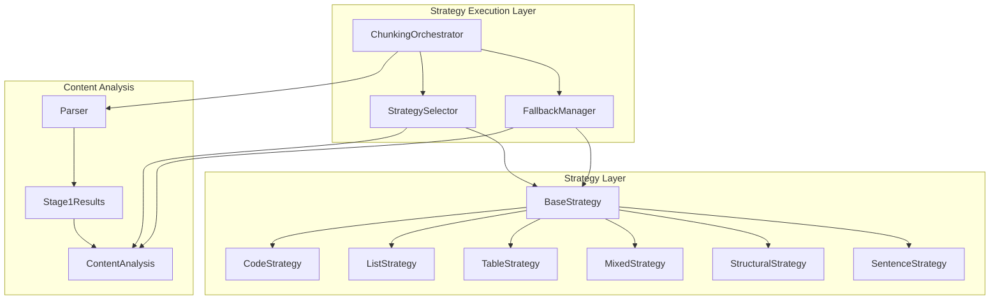
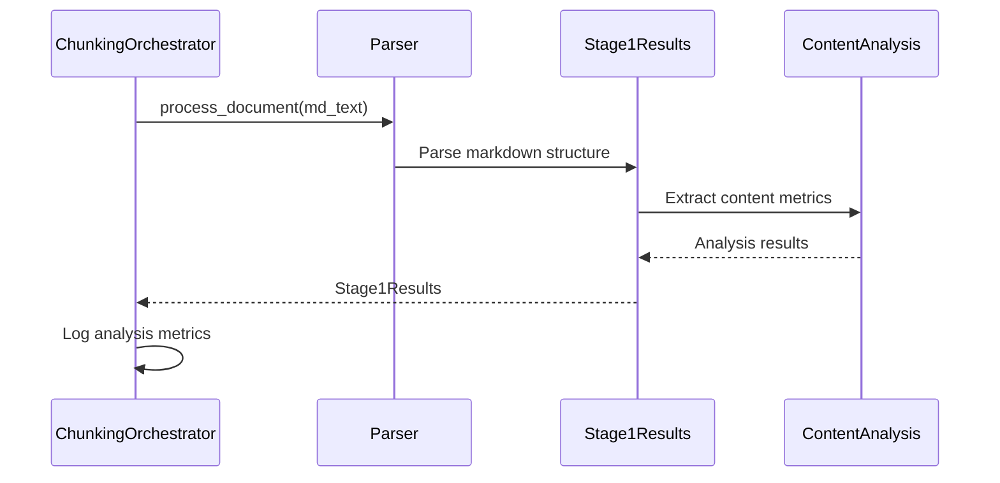
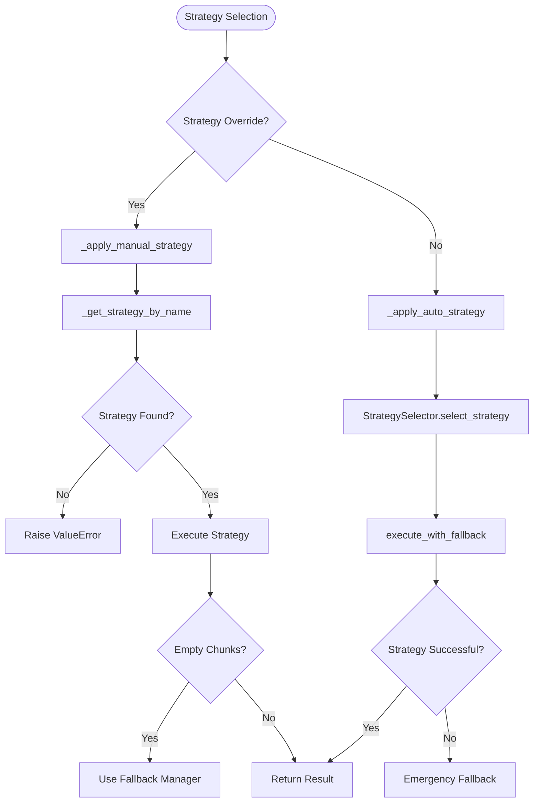
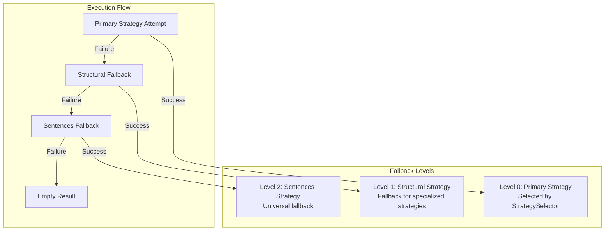
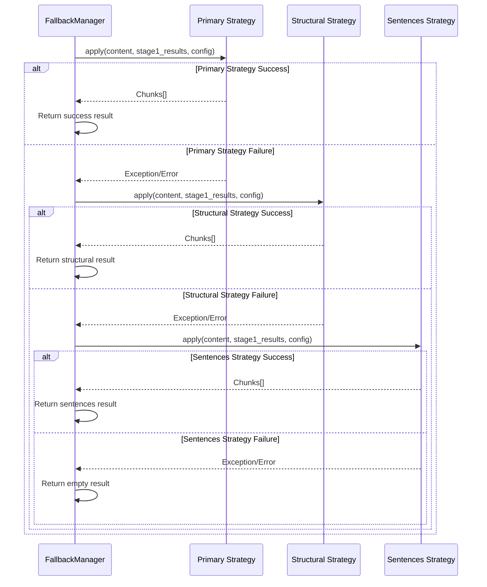
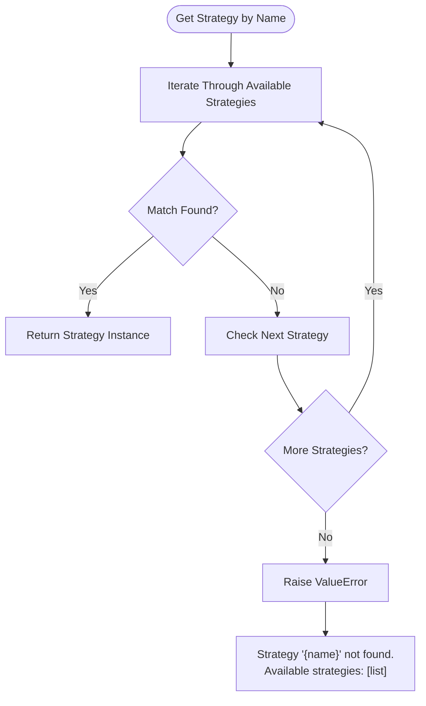
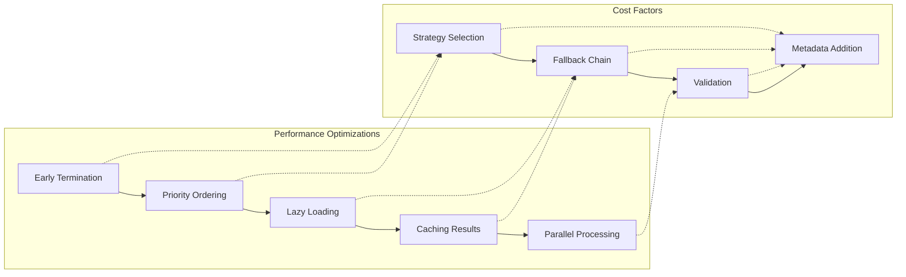

# Strategy Execution and Fallback Mechanism

<cite>
**Referenced Files in This Document**
- [orchestrator.py](file://markdown_chunker/chunker/orchestrator.py)
- [fallback_manager.py](file://markdown_chunker/chunker/components/fallback_manager.py)
- [base.py](file://markdown_chunker/chunker/strategies/base.py)
- [selector.py](file://markdown_chunker/chunker/selector.py)
- [sentences_strategy.py](file://markdown_chunker/chunker/strategies/sentences_strategy.py)
- [structural_strategy.py](file://markdown_chunker/chunker/strategies/structural_strategy.py)
- [types.py](file://markdown_chunker/chunker/types.py)
- [test_fallback_manager.py](file://tests/chunker/test_components/test_fallback_manager.py)
- [test_fallback_manager_integration.py](file://tests/chunker/test_fallback_manager_integration.py)
- [basic_usage.py](file://examples/basic_usage.py)
- [dify_integration.py](file://examples/dify_integration.py)
</cite>

## Table of Contents
1. [Introduction](#introduction)
2. [Architecture Overview](#architecture-overview)
3. [Strategy Execution Pipeline](#strategy-execution-pipeline)
4. [Fallback Mechanism](#fallback-mechanism)
5. [Dynamic Strategy Retrieval](#dynamic-strategy-retrieval)
6. [Error Conditions and Triggers](#error-conditions-and-triggers)
7. [Performance Implications](#performance-implications)
8. [Debugging and Monitoring](#debugging-and-monitoring)
9. [Best Practices](#best-practices)
10. [Troubleshooting Guide](#troubleshooting-guide)

## Introduction

The Strategy Execution and Fallback Mechanism is the core intelligence system of the Markdown Chunker that ensures reliable document processing under all circumstances. This sophisticated system combines automated strategy selection with a robust fallback chain to guarantee that every document can be successfully chunked, regardless of its complexity or structure.

The mechanism operates through three primary components:
- **ChunkingOrchestrator**: Coordinates strategy selection and execution
- **FallbackManager**: Implements the 3-level fallback chain
- **StrategySelector**: Determines the optimal strategy based on content analysis

## Architecture Overview

The strategy execution system follows a layered architecture that separates concerns and ensures reliability:



**Diagram sources**
- [orchestrator.py](file://markdown_chunker/chunker/orchestrator.py#L23-L54)
- [selector.py](file://markdown_chunker/chunker/selector.py#L24-L47)
- [fallback_manager.py](file://markdown_chunker/chunker/components/fallback_manager.py#L31-L58)

**Section sources**
- [orchestrator.py](file://markdown_chunker/chunker/orchestrator.py#L23-L54)
- [selector.py](file://markdown_chunker/chunker/selector.py#L24-L47)
- [fallback_manager.py](file://markdown_chunker/chunker/components/fallback_manager.py#L31-L58)

## Strategy Execution Pipeline

### Stage 1: Content Analysis

The execution begins with comprehensive content analysis performed by the Stage 1 parser:



**Diagram sources**
- [orchestrator.py](file://markdown_chunker/chunker/orchestrator.py#L120-L168)

### Stage 2: Strategy Selection and Application

The orchestrator coordinates strategy selection and execution through the `_select_and_apply_strategy` method:



**Diagram sources**
- [orchestrator.py](file://markdown_chunker/chunker/orchestrator.py#L169-L339)

**Section sources**
- [orchestrator.py](file://markdown_chunker/chunker/orchestrator.py#L169-L339)

## Fallback Mechanism

### Three-Level Fallback Chain

The FallbackManager implements a sophisticated 3-level fallback system designed to ensure chunking success under all circumstances:



**Diagram sources**
- [fallback_manager.py](file://markdown_chunker/chunker/components/fallback_manager.py#L22-L29)

### Fallback Execution Logic

The `execute_with_fallback` method implements the core fallback logic:



**Diagram sources**
- [fallback_manager.py](file://markdown_chunker/chunker/components/fallback_manager.py#L60-L175)

### Fallback Metadata Preservation

When fallback occurs, the system preserves comprehensive metadata for debugging and analysis:

| Metadata Field | Purpose | Example Value |
|----------------|---------|---------------|
| `fallback_level` | Numeric fallback level (0-2) | `1` |
| `fallback_reason` | Human-readable reason | `"Primary strategy failed, used structural"` |
| `strategy_used` | Final strategy that succeeded | `"structural"` |
| `fallback_used` | Boolean flag indicating fallback | `true` |
| `fallback_errors` | Accumulated errors from failed strategies | `["Primary strategy failed"]` |

**Section sources**
- [fallback_manager.py](file://markdown_chunker/chunker/components/fallback_manager.py#L177-L214)

## Dynamic Strategy Retrieval

### Strategy Discovery and Validation

The `_get_strategy_by_name` method provides dynamic strategy retrieval with comprehensive error handling:



**Diagram sources**
- [orchestrator.py](file://markdown_chunker/chunker/orchestrator.py#L319-L339)

### Error Handling for Missing Strategies

When a strategy cannot be found, the system provides detailed error messages with available alternatives:

```python
# Example error message format
raise ValueError(
    f"Strategy '{name}' not found. Available strategies: "
    f"[structural, code, list, table, mixed, sentences]"
)
```

**Section sources**
- [orchestrator.py](file://markdown_chunker/chunker/orchestrator.py#L319-L339)

## Error Conditions and Triggers

### Primary Strategy Failures

The fallback mechanism is triggered by several categories of failures:

#### 1. Empty Chunk Results
When a strategy returns an empty chunks list, fallback is automatically triggered:

```python
# Trigger condition in fallback_manager.py
if not chunks:  # Empty chunks from primary strategy
    warning_msg = f"Primary strategy {strategy_name} returned no chunks"
    logger.warning(warning_msg)
    warnings.append(warning_msg)
```

#### 2. Exception Handling
Any unhandled exception during strategy execution triggers fallback:

```python
try:
    chunks = primary_strategy.apply(content, stage1_results, self.config)
except Exception as e:
    error_msg = f"Primary strategy {primary_strategy.name} failed: {str(e)}"
    logger.warning(error_msg)
    errors.append(error_msg)
```

#### 3. Validation Failures
Strategy-specific validation errors that prevent chunk creation:

```python
# From base.py - strategy validation
def _validate_chunks(self, chunks: List[Chunk], config: ChunkConfig) -> List[Chunk]:
    validated_chunks = []
    for chunk in chunks:
        if not chunk.content.strip():  # Skip empty chunks
            continue
        validated_chunks.append(chunk)
    return validated_chunks
```

### Fallback Chain Triggers

The fallback chain responds to specific conditions at each level:

| Level | Condition | Action |
|-------|-----------|--------|
| 0 | Primary strategy exception or empty result | Proceed to structural fallback |
| 1 | Structural strategy exception or empty result | Proceed to sentences fallback |
| 2 | Sentences strategy exception or empty result | Return empty result with errors |

**Section sources**
- [fallback_manager.py](file://markdown_chunker/chunker/components/fallback_manager.py#L85-L175)
- [base.py](file://markdown_chunker/chunker/strategies/base.py#L180-L230)

## Performance Implications

### Execution Performance Considerations

The fallback mechanism introduces several performance factors that impact overall chunking performance:

#### 1. Strategy Selection Overhead
- **Priority-based selection**: Strategies are ordered by priority, reducing search time
- **Early termination**: First applicable strategy is selected immediately
- **Quality scoring**: Weighted selection considers both priority and quality

#### 2. Fallback Execution Cost
- **Level 1 (Structural)**: Moderate overhead for header parsing and section building
- **Level 2 (Sentences)**: Baseline performance for text processing
- **Memory usage**: Each fallback level may cache intermediate results

#### 3. Performance Optimization Strategies



**Diagram sources**
- [selector.py](file://markdown_chunker/chunker/selector.py#L80-L133)
- [fallback_manager.py](file://markdown_chunker/chunker/components/fallback_manager.py#L60-L175)

### Memory and Resource Usage

The fallback system manages resources efficiently through:

- **Incremental processing**: Each fallback level processes content incrementally
- **Metadata aggregation**: Errors and warnings are accumulated progressively
- **Result validation**: Final validation ensures resource cleanup

**Section sources**
- [selector.py](file://markdown_chunker/chunker/selector.py#L80-L133)
- [fallback_manager.py](file://markdown_chunker/chunker/components/fallback_manager.py#L60-L175)

## Debugging and Monitoring

### Logging and Tracing

The system provides comprehensive logging for debugging fallback triggers and execution paths:

#### 1. Strategy Selection Logging
```python
# From orchestrator.py
logger.info(
    f"Strategy selected: {strategy_name}, "
    f"can_handle={metrics.can_handle}, "
    f"quality_score={metrics.quality_score:.2f}"
)
```

#### 2. Fallback Trigger Logging
```python
# From fallback_manager.py
logger.warning(
    f"Fallback triggered: level={result.fallback_level}, "
    f"final_strategy={result.strategy_used}"
)
```

#### 3. Error Accumulation Logging
```python
# From fallback_manager.py
logger.error(f"All strategies failed, returning empty result")
```

### Monitoring Tools and Metrics

#### 1. Fallback Rate Monitoring
Track fallback usage patterns to optimize strategy selection:

```python
# Example monitoring metrics
fallback_statistics = {
    "fallback_enabled": True,
    "max_fallback_level": 2,
    "structural_strategy": "structural",
    "sentences_strategy": "sentences"
}
```

#### 2. Performance Metrics
Monitor execution time and resource usage:

```python
# Timing information
processing_time = time.time() - start_time
logger.info(f"Chunking complete: processing_time={processing_time:.3f}s")
```

#### 3. Error Analysis
Track common failure patterns:

```python
# Error accumulation patterns
errors = [
    f"Primary strategy {strategy_name} failed: {error_message}",
    f"Structural fallback failed: {error_message}",
    f"Sentences fallback failed: {error_message}"
]
```

**Section sources**
- [orchestrator.py](file://markdown_chunker/chunker/orchestrator.py#L73-L118)
- [fallback_manager.py](file://markdown_chunker/chunker/components/fallback_manager.py#L232-L244)

## Best Practices

### Configuration Guidelines

#### 1. Fallback Threshold Configuration
Configure fallback behavior based on your use case:

```python
# Conservative fallback (fewer fallbacks)
config = ChunkConfig(
    enable_fallback=True,
    max_fallback_level=1  # Limit to structural fallback
)

# Aggressive fallback (ensure success)
config = ChunkConfig(
    enable_fallback=True,
    max_fallback_level=2  # Full fallback chain
)
```

#### 2. Strategy Selection Tuning
Adjust strategy thresholds for optimal performance:

```python
# Code-heavy document optimization
config = ChunkConfig.for_code_heavy()

# Structured documentation optimization  
config = ChunkConfig.for_structured_docs()
```

### Monitoring and Alerting

#### 1. Fallback Rate Alerts
Set up alerts for excessive fallback usage:

```python
def monitor_fallback_rate(result):
    if result.fallback_used:
        fallback_rate = calculate_fallback_rate()
        if fallback_rate > 0.1:  # 10% fallback rate threshold
            send_alert("High fallback rate detected")
```

#### 2. Performance Monitoring
Monitor chunking performance metrics:

```python
def monitor_chunking_performance(result):
    if result.processing_time > 1.0:  # 1 second threshold
        log_slow_chunking(result.processing_time)
```

### Testing and Validation

#### 1. Fallback Chain Testing
Validate fallback behavior with comprehensive tests:

```python
# Test fallback chain with various strategies
results = validate_fallback_chain(test_content, config, strategies)
```

#### 2. Edge Case Testing
Test fallback behavior with edge cases:

```python
# Test empty content
empty_result = chunker.chunk("")

# Test malformed content
malformed_result = chunker.chunk("invalid markdown ***")
```

**Section sources**
- [fallback_manager.py](file://markdown_chunker/chunker/components/fallback_manager.py#L269-L309)
- [types.py](file://markdown_chunker/chunker/types.py#L573-L800)

## Troubleshooting Guide

### Common Issues and Solutions

#### 1. Fallback Not Triggering
**Symptoms**: Strategy failures result in empty chunks without fallback
**Causes**: 
- Fallback disabled in configuration
- Primary strategy exceptions caught silently
- Empty chunks not recognized as failure condition

**Solutions**:
```python
# Enable fallback explicitly
config = ChunkConfig(enable_fallback=True)

# Check strategy validation
if not chunks:
    logger.warning("Strategy returned empty chunks - triggering fallback")

# Verify exception handling
try:
    chunks = strategy.apply(content, stage1_results, config)
except Exception as e:
    logger.error(f"Strategy failed: {e}")
    # Fallback should be triggered automatically
```

#### 2. Excessive Fallback Usage
**Symptoms**: High fallback rates impacting performance
**Causes**:
- Poor strategy selection for document type
- Inappropriate configuration thresholds
- Content structure not matching strategy expectations

**Solutions**:
```python
# Adjust strategy thresholds
config = ChunkConfig(
    code_ratio_threshold=0.5,  # Increase for more aggressive code detection
    header_count_threshold=2,  # Reduce for earlier structural detection
)

# Use strategy override for problematic documents
chunks = chunker.chunk(content, strategy="structural")
```

#### 3. Fallback Metadata Missing
**Symptoms**: Fallback information not available in chunk metadata
**Causes**:
- Fallback manager not properly configured
- Metadata addition skipped during fallback
- Result reconstruction errors

**Solutions**:
```python
# Verify fallback manager configuration
manager = FallbackManager(config)
assert manager.config.enable_fallback

# Check metadata in fallback results
for chunk in result.chunks:
    assert "fallback_level" in chunk.metadata
    assert "fallback_reason" in chunk.metadata
```

### Debugging Techniques

#### 1. Enable Verbose Logging
```python
import logging
logging.getLogger("markdown_chunker").setLevel(logging.DEBUG)
```

#### 2. Trace Execution Path
```python
# Add logging at key points
logger.debug(f"Executing strategy: {strategy.name}")
logger.debug(f"Fallback level: {fallback_level}")
logger.debug(f"Chunk count: {len(chunks)}")
```

#### 3. Analyze Strategy Selection
```python
# Get detailed strategy evaluation
explanation = strategy_selector.explain_selection(analysis, config)
print(explanation)
```

**Section sources**
- [test_fallback_manager.py](file://tests/chunker/test_components/test_fallback_manager.py#L1-L371)
- [test_fallback_manager_integration.py](file://tests/chunker/test_fallback_manager_integration.py#L1-L184)