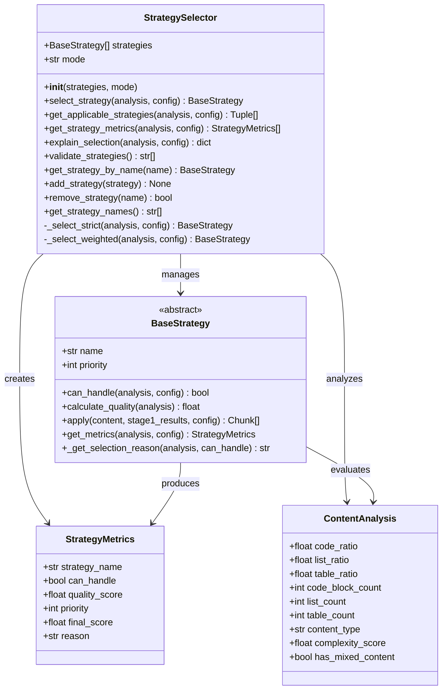
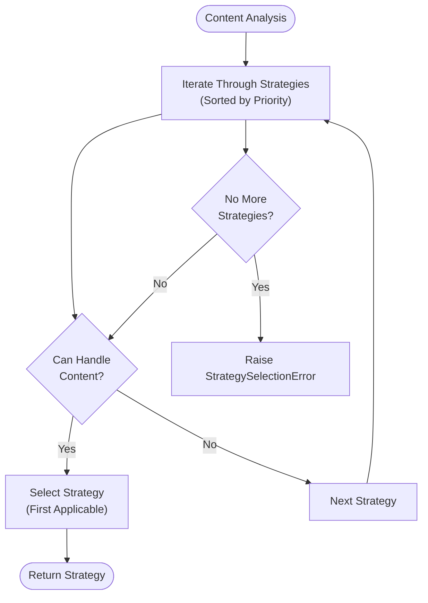
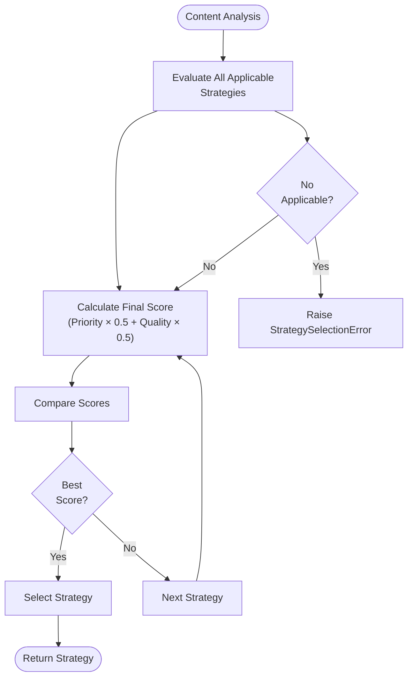
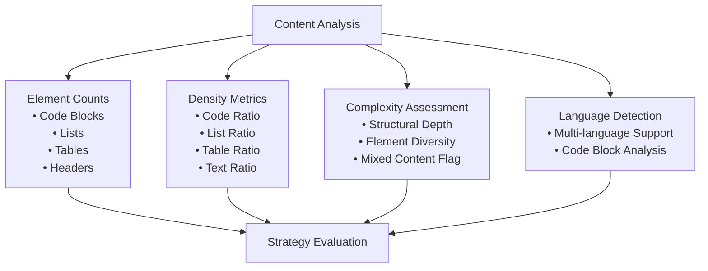
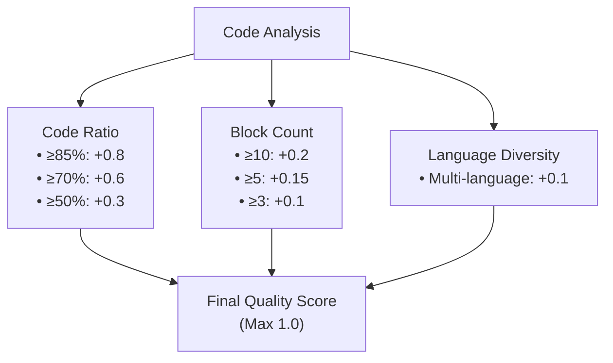
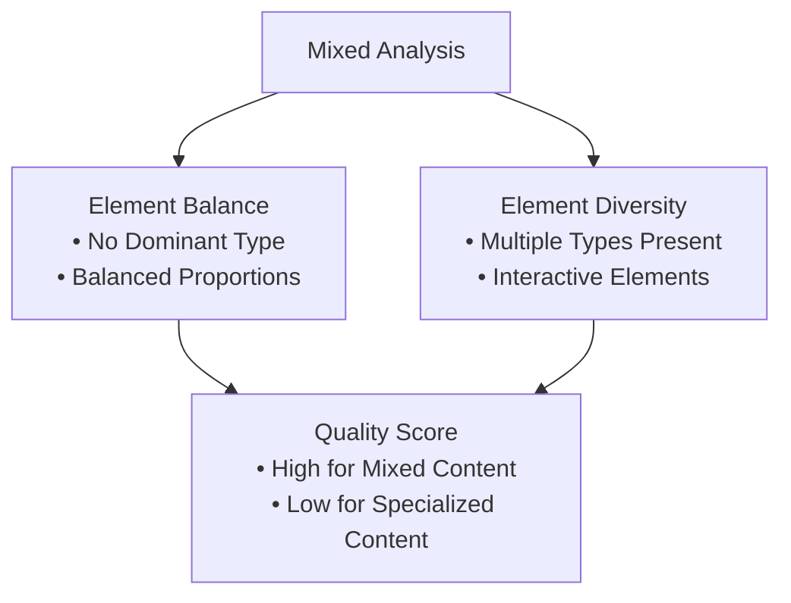
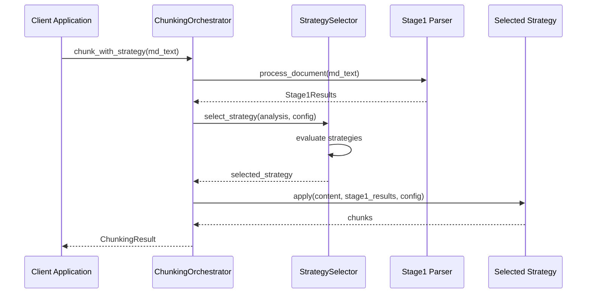

# Strategy Selection Logic

<cite>
**Referenced Files in This Document**
- [selector.py](file://markdown_chunker/chunker/selector.py)
- [base.py](file://markdown_chunker/chunker/strategies/base.py)
- [types.py](file://markdown_chunker/chunker/types.py)
- [code_strategy.py](file://markdown_chunker/chunker/strategies/code_strategy.py)
- [mixed_strategy.py](file://markdown_chunker/chunker/strategies/mixed_strategy.py)
- [list_strategy.py](file://markdown_chunker/chunker/strategies/list_strategy.py)
- [structural_strategy.py](file://markdown_chunker/chunker/strategies/structural_strategy.py)
- [test_strategy_selector.py](file://tests/chunker/test_strategy_selector.py)
- [analyzer.py](file://markdown_chunker/parser/analyzer.py)
- [orchestrator.py](file://markdown_chunker/chunker/orchestrator.py)
</cite>

## Table of Contents
1. [Introduction](#introduction)
2. [Architecture Overview](#architecture-overview)
3. [Strategy Selection Modes](#strategy-selection-modes)
4. [Content Analysis and Metrics](#content-analysis-and-metrics)
5. [Strategy Evaluation System](#strategy-evaluation-system)
6. [Public Interface Methods](#public-interface-methods)
7. [Integration Points](#integration-points)
8. [Common Issues and Troubleshooting](#common-issues-and-troubleshooting)
9. [Performance Considerations](#performance-considerations)
10. [Conclusion](#conclusion)

## Introduction

The Strategy Selection Logic component serves as the intelligent decision-making engine for the Markdown chunking system. It analyzes Stage1Results from the parser to evaluate content characteristics such as code ratio, list density, and structural complexity, then selects the optimal chunking strategy based on sophisticated evaluation criteria.

This component implements a dual-mode selection system that balances strategy priority with content-specific quality scores, ensuring that documents receive the most appropriate treatment based on their inherent characteristics. The system supports both strict priority-based selection and weighted scoring approaches, providing flexibility for different use cases.

## Architecture Overview

The Strategy Selection Logic is built around the `StrategySelector` class, which coordinates strategy evaluation and selection based on content analysis. The architecture follows a modular design where each strategy implements a standardized interface while contributing to the overall selection process.



**Diagram sources**
- [selector.py](file://markdown_chunker/chunker/selector.py#L23-L322)
- [base.py](file://markdown_chunker/chunker/strategies/base.py#L16-L380)
- [types.py](file://markdown_chunker/chunker/types.py#L1030-L1060)

**Section sources**
- [selector.py](file://markdown_chunker/chunker/selector.py#L23-L322)
- [base.py](file://markdown_chunker/chunker/strategies/base.py#L16-L380)

## Strategy Selection Modes

The StrategySelector operates in two distinct modes, each serving different use cases and providing different selection behaviors:

### Strict Mode Selection

Strict mode prioritizes strategy selection based on predefined priority values, selecting the first strategy that can handle the content. This mode ensures predictable behavior and guarantees that strategies with higher priority (lower numerical values) are favored when multiple strategies are applicable.



**Diagram sources**
- [selector.py](file://markdown_chunker/chunker/selector.py#L79-L98)

### Weighted Mode Selection

Weighted mode employs a sophisticated scoring system that combines strategy priority with content-specific quality scores. This approach allows for more nuanced selection decisions, particularly beneficial when multiple strategies could handle the content effectively.

The final score calculation follows this formula:
- **Priority Weight**: `1.0 / strategy_priority` (higher priority = higher weight)
- **Quality Score**: Content-specific assessment (0.0 to 1.0)
- **Final Score**: `(priority_weight * 0.5) + (quality_score * 0.5)`



**Diagram sources**
- [selector.py](file://markdown_chunker/chunker/selector.py#L100-L133)

**Section sources**
- [selector.py](file://markdown_chunker/chunker/selector.py#L74-L133)

## Content Analysis and Metrics

The StrategySelector relies on comprehensive content analysis provided by the parser to make informed selection decisions. The analysis encompasses multiple dimensions of content characteristics:

### Core Content Metrics

| Metric | Description | Usage in Strategy Selection |
|--------|-------------|---------------------------|
| **Code Ratio** | Percentage of content that is code blocks | Determines code-heavy vs. text-heavy documents |
| **List Ratio** | Percentage of content that is list items | Influences list strategy applicability |
| **Table Ratio** | Percentage of content that is tables | Affects table strategy selection |
| **Header Count** | Total number of headers across all levels | Guides structural strategy evaluation |
| **Complexity Score** | Overall complexity assessment (0.0-1.0) | Balances strategy selection decisions |
| **Content Type** | Classification: code_heavy, mixed, text_heavy | Primary content classification |

### Advanced Analysis Features

The content analysis system provides sophisticated metrics for strategy evaluation:



**Diagram sources**
- [analyzer.py](file://markdown_chunker/parser/analyzer.py#L175-L206)
- [types.py](file://markdown_chunker/parser/types.py#L545-L704)

**Section sources**
- [analyzer.py](file://markdown_chunker/parser/analyzer.py#L175-L206)
- [types.py](file://markdown_chunker/parser/types.py#L545-L704)

## Strategy Evaluation System

Each strategy implements a comprehensive evaluation system that assesses both its ability to handle content and its suitability for the specific document characteristics.

### Quality Scoring Mechanisms

Different strategies employ specialized quality scoring algorithms tailored to their domain expertise:

#### Code Strategy Quality Calculation
The code strategy evaluates content based on code ratio, block count, and language diversity:



**Diagram sources**
- [code_strategy.py](file://markdown_chunker/chunker/strategies/code_strategy.py#L136-L185)

#### Mixed Strategy Quality Assessment
The mixed strategy evaluates content balance across multiple element types:



**Diagram sources**
- [mixed_strategy.py](file://markdown_chunker/chunker/strategies/mixed_strategy.py#L120-L170)

### Priority-Based Selection Logic

Strategies are assigned priority values that determine their precedence in selection decisions:

| Priority | Strategy | Typical Use Case |
|----------|----------|------------------|
| **1** | Code | Code-heavy documents (>70% code) |
| **2** | Mixed | Documents with balanced content types |
| **3** | List | List-heavy documents (>60% lists) |
| **4** | Structural | Structurally complex documents |
| **5** | Table | Table-heavy documents |
| **6** | Sentences | Fallback strategy for all content |

**Section sources**
- [base.py](file://markdown_chunker/chunker/strategies/base.py#L96-L127)
- [code_strategy.py](file://markdown_chunker/chunker/strategies/code_strategy.py#L136-L185)
- [mixed_strategy.py](file://markdown_chunker/chunker/strategies/mixed_strategy.py#L120-L170)

## Public Interface Methods

The StrategySelector provides a comprehensive public interface for strategy management and selection:

### Core Selection Methods

#### `select_strategy(analysis: ContentAnalysis, config: ChunkConfig) -> BaseStrategy`
Primary method for automatic strategy selection. Chooses between strict and weighted modes based on the configured selection mode.

#### `get_applicable_strategies(analysis: ContentAnalysis, config: ChunkConfig) -> List[Tuple[BaseStrategy, float]]`
Returns all strategies that can handle the content, sorted by their final scores in descending order.

#### `get_strategy_metrics(analysis: ContentAnalysis, config: ChunkConfig) -> List[StrategyMetrics]`
Provides detailed metrics for all strategies, enabling comprehensive evaluation and debugging.

### Management Methods

#### `add_strategy(strategy: BaseStrategy) -> None`
Adds a new strategy to the selector, automatically sorting by priority and validating configuration.

#### `remove_strategy(name: str) -> bool`
Removes a strategy by name, returning True if successful or False if the strategy doesn't exist.

#### `get_strategy_by_name(name: str) -> Optional[BaseStrategy]`
Retrieves a strategy by its unique name, returning None if not found.

### Diagnostic Methods

#### `explain_selection(analysis: ContentAnalysis, config: ChunkConfig) -> dict`
Provides a comprehensive explanation of the selection decision, including content analysis, strategy evaluations, and selection rationale.

#### `validate_strategies() -> List[str]`
Performs comprehensive validation of the strategy configuration, checking for duplicates, proper priorities, and fallback strategy requirements.

**Section sources**
- [selector.py](file://markdown_chunker/chunker/selector.py#L58-L322)

## Integration Points

The Strategy Selection Logic integrates seamlessly with the broader chunking system through several key interfaces:

### Orchestrator Integration

The `ChunkingOrchestrator` coordinates strategy selection as part of the chunking pipeline:



**Diagram sources**
- [orchestrator.py](file://markdown_chunker/chunker/orchestrator.py#L169-L289)

### Configuration System Integration

The strategy selection system integrates with the configuration management system to provide dynamic threshold adjustments:

| Configuration Parameter | Impact on Strategy Selection |
|------------------------|----------------------------|
| `code_ratio_threshold` | Minimum code ratio for code strategy |
| `list_count_threshold` | Minimum list count for list strategy |
| `list_ratio_threshold` | Minimum list ratio for list strategy |
| `table_count_threshold` | Minimum table count for table strategy |
| `min_complexity` | Minimum complexity for mixed strategy |

**Section sources**
- [orchestrator.py](file://markdown_chunker/chunker/orchestrator.py#L169-L289)
- [types.py](file://markdown_chunker/chunker/types.py#L584-L620)

## Common Issues and Troubleshooting

### Duplicate Strategy Names

**Problem**: Attempting to add a strategy with a name that already exists in the selector.

**Solution**: Use `get_strategy_by_name()` to check for existing strategies before adding new ones.

**Example**:
```python
try:
    selector.add_strategy(new_strategy)
except ValueError as e:
    if "already exists" in str(e):
        # Handle duplicate name conflict
        logger.warning(f"Strategy name conflict: {e}")
```

### Invalid Selection Modes

**Problem**: Specifying an unsupported selection mode during initialization.

**Solution**: Only "strict" and "weighted" modes are supported.

**Example**:
```python
# Correct usage
selector = StrategySelector(strategies, mode="strict")

# Incorrect usage - will raise ValueError
selector = StrategySelector(strategies, mode="invalid")
```

### Missing Fallback Strategy

**Problem**: No strategy can handle the content, leading to `StrategySelectionError`.

**Solution**: Ensure the "sentences" strategy is included in the strategy collection.

**Validation**:
```python
issues = selector.validate_strategies()
if "No fallback strategy" in issues:
    logger.error("Missing fallback strategy (sentences)")
```

### Strategy Configuration Validation

**Problem**: Strategies with duplicate priorities or improper configurations.

**Solution**: Use the validation system to identify and resolve configuration issues.

**Example**:
```python
validation_issues = selector.validate_strategies()
for issue in validation_issues:
    logger.warning(f"Configuration issue: {issue}")
```

### Performance Issues

**Problem**: Slow strategy selection for documents with many strategies.

**Solution**: Optimize strategy registration order and consider reducing the number of registered strategies.

**Optimization Tips**:
- Register strategies in priority order
- Remove unused strategies
- Use weighted mode judiciously for large strategy collections

**Section sources**
- [selector.py](file://markdown_chunker/chunker/selector.py#L225-L257)
- [test_strategy_selector.py](file://tests/chunker/test_strategy_selector.py#L224-L275)

## Performance Considerations

The Strategy Selection Logic is designed for efficiency while maintaining accuracy. Several factors influence performance:

### Selection Mode Performance

- **Strict Mode**: O(n) complexity where n is the number of strategies
- **Weighted Mode**: O(n) complexity plus additional computation for scoring

### Memory Usage

The system maintains minimal memory overhead by:
- Lazy evaluation of strategy metrics
- Efficient storage of strategy references
- Minimal caching of intermediate results

### Scalability Factors

- Strategy registration order affects selection speed
- Content analysis complexity impacts overall performance
- Strategy evaluation complexity varies by strategy type

**Section sources**
- [selector.py](file://markdown_chunker/chunker/selector.py#L74-L133)

## Conclusion

The Strategy Selection Logic component provides a robust, flexible foundation for intelligent content-based strategy selection in the Markdown chunking system. Its dual-mode approach accommodates both predictable priority-based selection and sophisticated weighted scoring, while its comprehensive evaluation system ensures optimal strategy selection for diverse content types.

The component's integration with the broader system enables seamless coordination between content analysis, strategy selection, and execution, while its comprehensive public interface provides developers with powerful tools for customization and debugging. Through careful attention to performance, validation, and extensibility, the Strategy Selection Logic delivers reliable and efficient strategy selection capabilities for modern document processing applications.