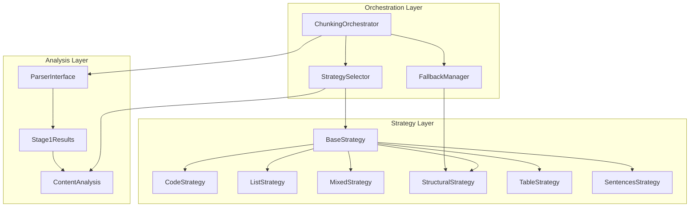
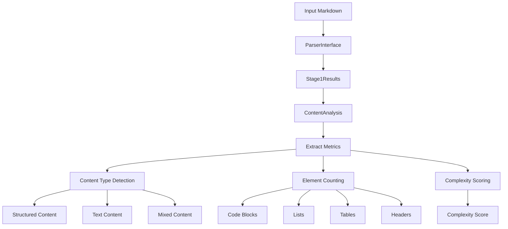
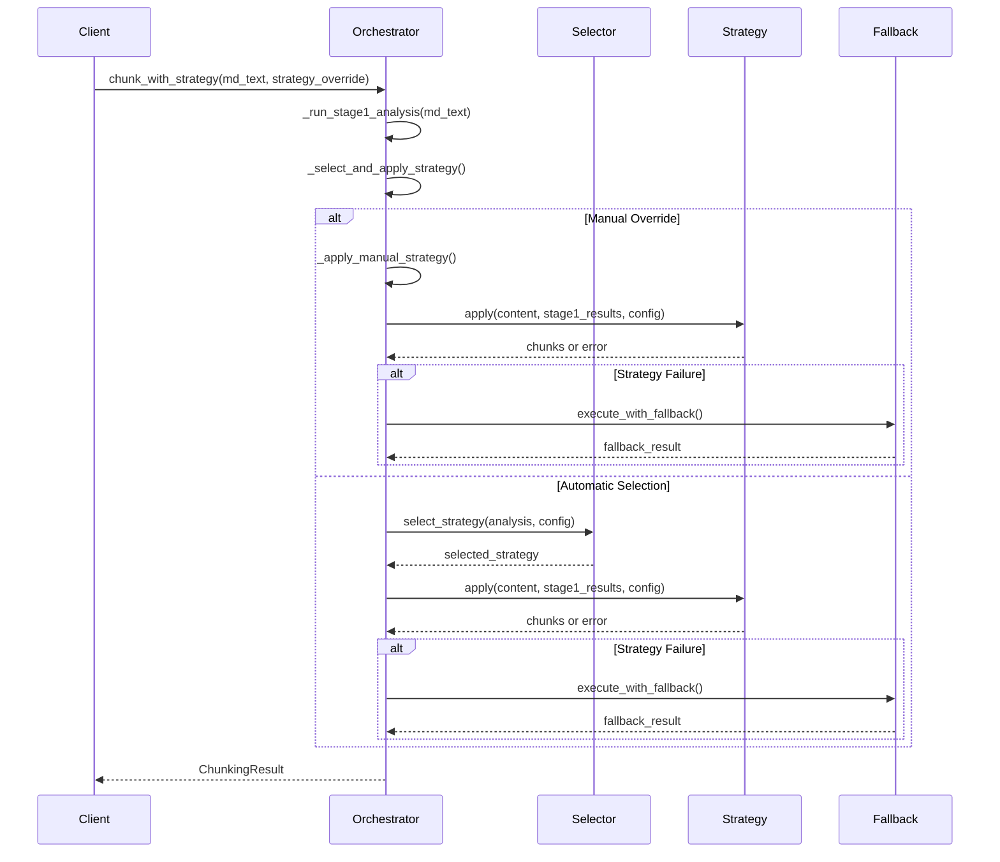
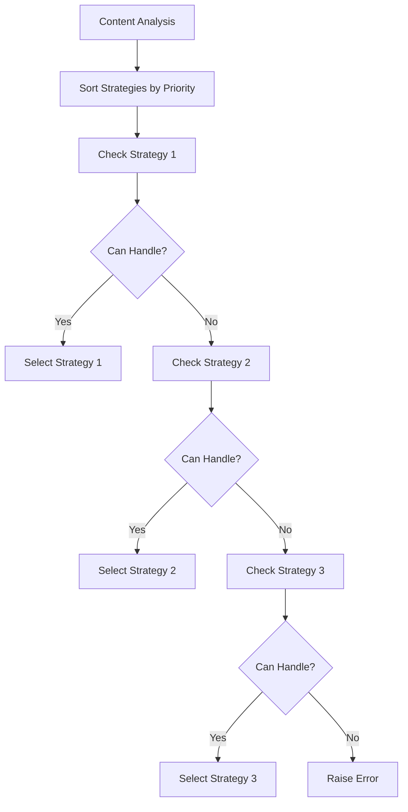
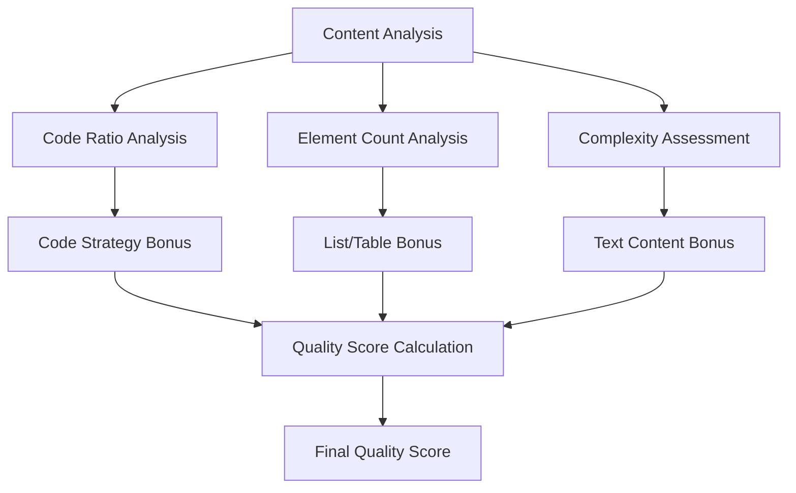
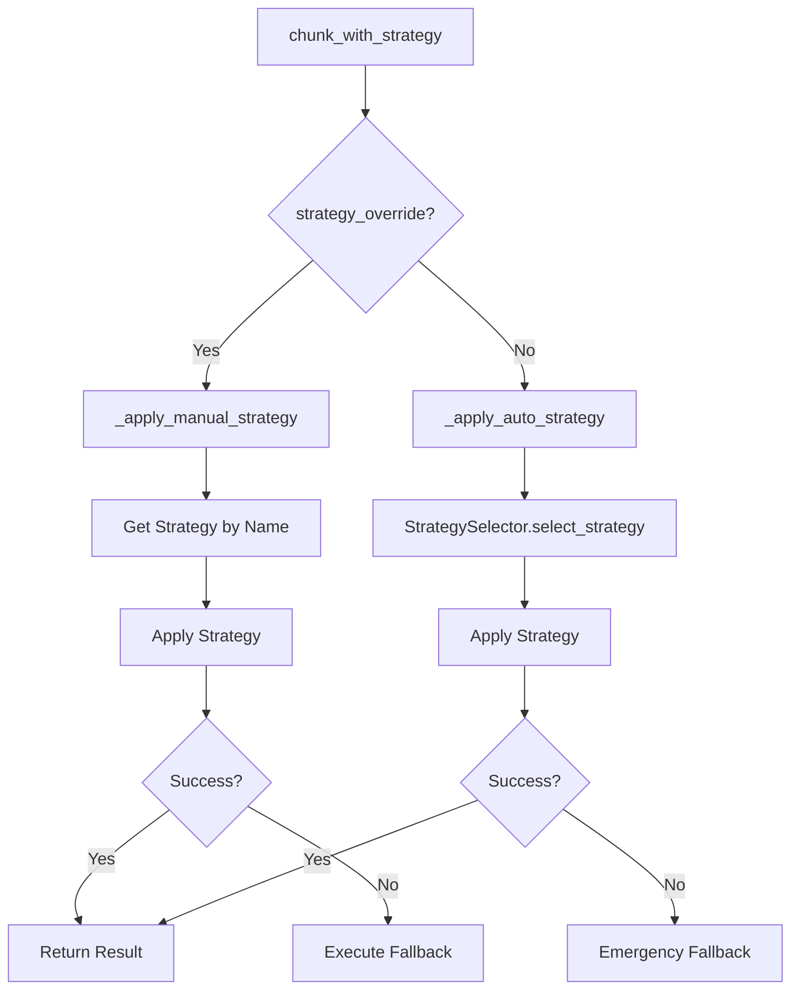
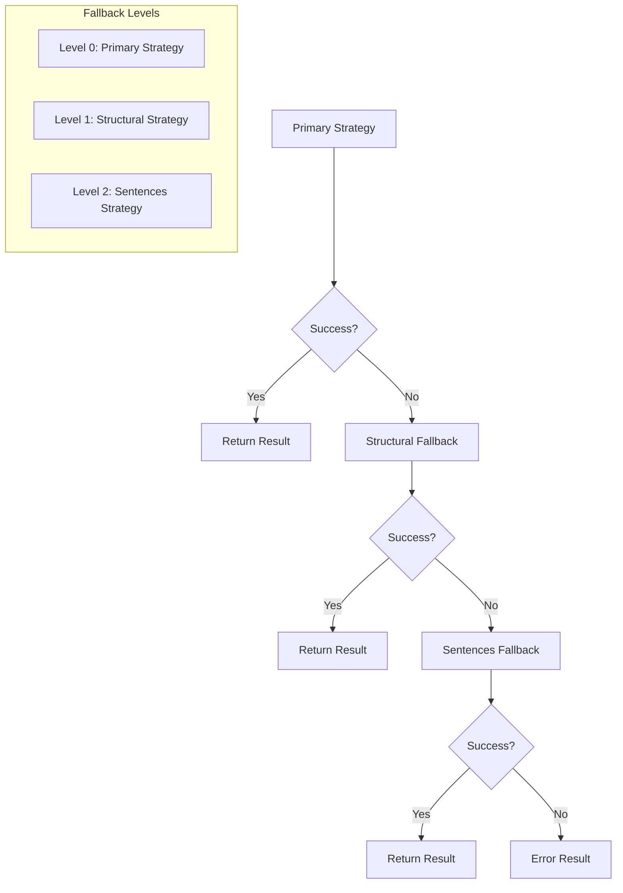

# Strategy Selection and Execution

<cite>
**Referenced Files in This Document**
- [orchestrator.py](file://markdown_chunker/chunker/orchestrator.py)
- [selector.py](file://markdown_chunker/chunker/selector.py)
- [types.py](file://markdown_chunker/chunker/types.py)
- [base.py](file://markdown_chunker/chunker/strategies/base.py)
- [fallback_manager.py](file://markdown_chunker/chunker/components/fallback_manager.py)
- [sentences_strategy.py](file://markdown_chunker/chunker/strategies/sentences_strategy.py)
- [code_strategy.py](file://markdown_chunker/chunker/strategies/code_strategy.py)
- [test_strategy_selector.py](file://tests/chunker/test_strategy_selector.py)
- [mixed.md](file://tests/fixtures/mixed.md)
- [code_heavy.md](file://tests/fixtures/code_heavy.md)
- [list_heavy.md](file://tests/fixtures/list_heavy.md)
</cite>

## Table of Contents
1. [Introduction](#introduction)
2. [Architecture Overview](#architecture-overview)
3. [Strategy Selection Process](#strategy-selection-process)
4. [Execution Flow](#execution-flow)
5. [Strategy Selection Modes](#strategy-selection-modes)
6. [Automatic Strategy Selection](#automatic-strategy-selection)
7. [Manual Strategy Override](#manual-strategy-override)
8. [Fallback Mechanisms](#fallback-mechanisms)
9. [Content Type Examples](#content-type-examples)
10. [Performance Considerations](#performance-considerations)
11. [Troubleshooting Guide](#troubleshooting-guide)
12. [Conclusion](#conclusion)

## Introduction

The Strategy Selection and Execution phase represents the core intelligence of the markdown chunking pipeline, responsible for determining the optimal chunking approach based on content characteristics and configuration thresholds. This phase coordinates between the StrategySelector, orchestrator, and various chunking strategies to ensure that each markdown document is processed using the most appropriate method for its content type.

The system employs a sophisticated scoring mechanism that evaluates content against multiple criteria, including code density, structural elements, and complexity metrics. It supports both automatic selection and manual overrides, with comprehensive fallback mechanisms to guarantee successful chunking under all circumstances.

## Architecture Overview

The Strategy Selection and Execution system follows a layered architecture with clear separation of concerns:



**Diagram sources**
- [orchestrator.py](file://markdown_chunker/chunker/orchestrator.py#L23-L40)
- [selector.py](file://markdown_chunker/chunker/selector.py#L24-L47)
- [fallback_manager.py](file://markdown_chunker/chunker/components/fallback_manager.py#L31-L59)

**Section sources**
- [orchestrator.py](file://markdown_chunker/chunker/orchestrator.py#L23-L40)
- [selector.py](file://markdown_chunker/chunker/selector.py#L24-L47)
- [fallback_manager.py](file://markdown_chunker/chunker/components/fallback_manager.py#L31-L59)

## Strategy Selection Process

The strategy selection process operates through a multi-stage evaluation system that combines content analysis with scoring metrics to determine the optimal chunking approach.

### Stage 1: Content Analysis

The process begins with Stage 1 analysis, where the parser extracts structural information from the markdown content:



**Diagram sources**
- [orchestrator.py](file://markdown_chunker/chunker/orchestrator.py#L120-L168)

### Strategy Evaluation Criteria

Each strategy evaluates the content against specific criteria defined in the configuration:

| Strategy | Code Ratio Threshold | Min Code Blocks | List Threshold | Table Threshold | Header Threshold |
|----------|---------------------|-----------------|----------------|-----------------|------------------|
| Code | ≥70% | ≥3 | N/A | N/A | N/A |
| List | N/A | N/A | ≥60% | N/A | N/A |
| Table | N/A | N/A | N/A | ≥40% | N/A |
| Mixed | N/A | N/A | N/A | N/A | ≥30% |
| Structural | N/A | N/A | N/A | N/A | ≥3 |

**Section sources**
- [types.py](file://markdown_chunker/chunker/types.py#L584-L592)

## Execution Flow

The execution flow demonstrates how the orchestrator coordinates strategy selection and application:



**Diagram sources**
- [orchestrator.py](file://markdown_chunker/chunker/orchestrator.py#L55-L118)
- [orchestrator.py](file://markdown_chunker/chunker/orchestrator.py#L169-L339)

**Section sources**
- [orchestrator.py](file://markdown_chunker/chunker/orchestrator.py#L55-L118)
- [orchestrator.py](file://markdown_chunker/chunker/orchestrator.py#L169-L339)

## Strategy Selection Modes

The system supports two distinct selection modes that influence how strategies are evaluated and chosen:

### Strict Mode Selection

Strict mode prioritizes strategy priority over quality scores, selecting the first applicable strategy in order of priority:



**Diagram sources**
- [selector.py](file://markdown_chunker/chunker/selector.py#L79-L98)

### Weighted Mode Selection

Weighted mode combines priority and quality scores to determine the optimal strategy:

```mermaid
flowchart TD
A[Content Analysis] --> B[Evaluate All Strategies]
B --> C[Calculate Quality Scores]
C --> D[Calculate Priority Weights]
D --> E[Compute Final Scores]
E --> F[Sort by Final Score]
F --> G[Select Highest Score]
subgraph "Score Calculation"
H[Priority Weight = 1/priority]
I[Quality Score = strategy.calculate_quality]
J[Final Score = (priority_weight × 0.5) + (quality_score × 0.5)]
end
```

**Diagram sources**
- [selector.py](file://markdown_chunker/chunker/selector.py#L100-L133)

**Section sources**
- [selector.py](file://markdown_chunker/chunker/selector.py#L74-L133)

## Automatic Strategy Selection

Automatic strategy selection involves a comprehensive evaluation process that considers multiple factors:

### Quality Scoring Algorithm

Each strategy calculates a quality score based on content characteristics:



**Diagram sources**
- [base.py](file://markdown_chunker/chunker/strategies/base.py#L96-L127)

### Strategy Priority System

Strategies are assigned priorities that reflect their specialization and reliability:

| Priority | Strategy | Specialization |
|----------|----------|----------------|
| 1 | Code | Code-heavy documents |
| 2 | Mixed | Balanced content |
| 3 | List | List-heavy documents |
| 4 | Table | Table-heavy documents |
| 5 | Structural | Structurally complex |
| 6 | Sentences | Universal fallback |

**Section sources**
- [base.py](file://markdown_chunker/chunker/strategies/base.py#L96-L127)
- [code_strategy.py](file://markdown_chunker/chunker/strategies/code_strategy.py#L109-L135)

## Manual Strategy Override

The system supports manual strategy selection through the `strategy_override` parameter, allowing users to specify a particular strategy regardless of content analysis:

### Override Process



**Diagram sources**
- [orchestrator.py](file://markdown_chunker/chunker/orchestrator.py#L169-L239)

**Section sources**
- [orchestrator.py](file://markdown_chunker/chunker/orchestrator.py#L169-L239)

## Fallback Mechanisms

The fallback system implements a three-level hierarchy to ensure chunking success:

### Fallback Chain Architecture



**Diagram sources**
- [fallback_manager.py](file://markdown_chunker/chunker/components/fallback_manager.py#L60-L175)

### Fallback Decision Matrix

| Primary Strategy | Structural Fallback | Sentences Fallback | Outcome |
|------------------|-------------------|-------------------|---------|
| Code | Structural | Sentences | Guaranteed success |
| Mixed | Structural | Sentences | Guaranteed success |
| List | Structural | Sentences | Guaranteed success |
| Table | Structural | Sentences | Guaranteed success |
| Structural | Sentences | Sentences | Guaranteed success |
| Sentences | N/A | N/A | Guaranteed success |

**Section sources**
- [fallback_manager.py](file://markdown_chunker/chunker/components/fallback_manager.py#L60-L175)

## Content Type Examples

Different content types demonstrate how the strategy selection adapts to various document characteristics:

### Code-Heavy Documents

Code-heavy documents trigger the CodeStrategy based on high code ratios and substantial code block counts:

**Example Configuration:**
- Code ratio: 85%
- Code blocks: 12
- Language diversity: Python, JavaScript, SQL

**Selection Reason:** "High code ratio (85%) with 12 code blocks - ideal for code strategy"

### Mixed Content Documents

Mixed content documents balance multiple structural elements:

**Example Configuration:**
- Code ratio: 30%
- Code blocks: 4
- Lists: 8
- Tables: 3
- Headers: 12

**Selection Reason:** "Mixed content with moderate complexity requiring balanced approach"

### List-Heavy Documents

List-heavy documents prioritize list preservation and hierarchy maintenance:

**Example Configuration:**
- List ratio: 75%
- List count: 15
- Nested depth: 3 levels

**Selection Reason:** "High list density with multiple nested levels - optimal for list strategy"

**Section sources**
- [mixed.md](file://tests/fixtures/mixed.md#L1-L51)
- [code_heavy.md](file://tests/fixtures/code_heavy.md#L1-L74)
- [list_heavy.md](file://tests/fixtures/list_heavy.md#L1-L53)

## Performance Considerations

The strategy selection and execution system incorporates several performance optimizations:

### Optimization Strategies

1. **Early Termination**: Strict mode stops evaluation after finding the first applicable strategy
2. **Lazy Evaluation**: Quality scores are calculated only for applicable strategies
3. **Priority Sorting**: Strategies are pre-sorted by priority for efficient iteration
4. **Caching**: Strategy metrics are cached to avoid redundant calculations

### Performance Metrics

| Operation | Time Complexity | Space Complexity |
|-----------|----------------|------------------|
| Strategy Selection | O(n) | O(1) |
| Quality Calculation | O(1) | O(1) |
| Fallback Execution | O(1) | O(1) |
| Content Analysis | O(m) | O(m) |

Where n is the number of strategies and m is the content length.

## Troubleshooting Guide

Common issues and their resolutions during strategy selection and execution:

### Strategy Selection Issues

**Problem**: No strategy can handle the content
**Solution**: Verify that SentencesStrategy is included in the strategy collection

**Problem**: Unexpected strategy selection
**Solution**: Review content analysis metrics and adjust thresholds in ChunkConfig

**Problem**: Poor quality strategy selection
**Solution**: Examine strategy quality scores and consider weighted vs. strict mode

### Fallback Issues

**Problem**: Fallback not triggering
**Solution**: Check `enable_fallback` configuration and fallback strategy availability

**Problem**: Fallback producing poor results
**Solution**: Review fallback strategy implementation and consider strategy improvements

**Section sources**
- [selector.py](file://markdown_chunker/chunker/selector.py#L225-L257)
- [fallback_manager.py](file://markdown_chunker/chunker/components/fallback_manager.py#L215-L230)

## Conclusion

The Strategy Selection and Execution phase represents a sophisticated approach to adaptive chunking that balances automation with reliability. Through its dual-mode selection system, comprehensive fallback mechanisms, and intelligent scoring algorithms, the system ensures optimal chunking results across diverse content types while maintaining robust error handling and recovery capabilities.

The modular architecture allows for easy extension with new strategies while preserving backward compatibility and system stability. The combination of automatic selection based on content analysis and manual override capabilities provides flexibility for both automated processing and expert-driven customization.

Future enhancements could include machine learning-based strategy selection, dynamic threshold adjustment, and enhanced content type detection to further improve the system's adaptability and performance across varied markdown content.