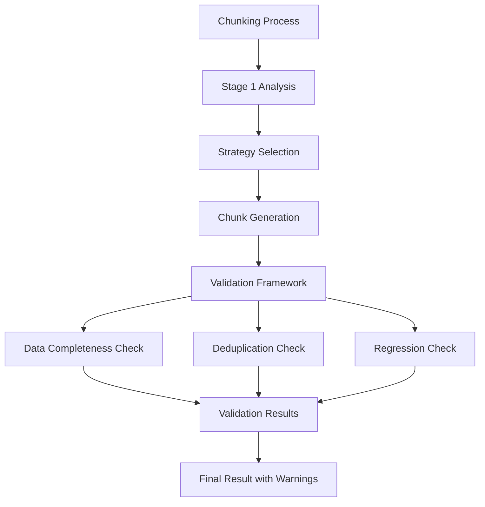
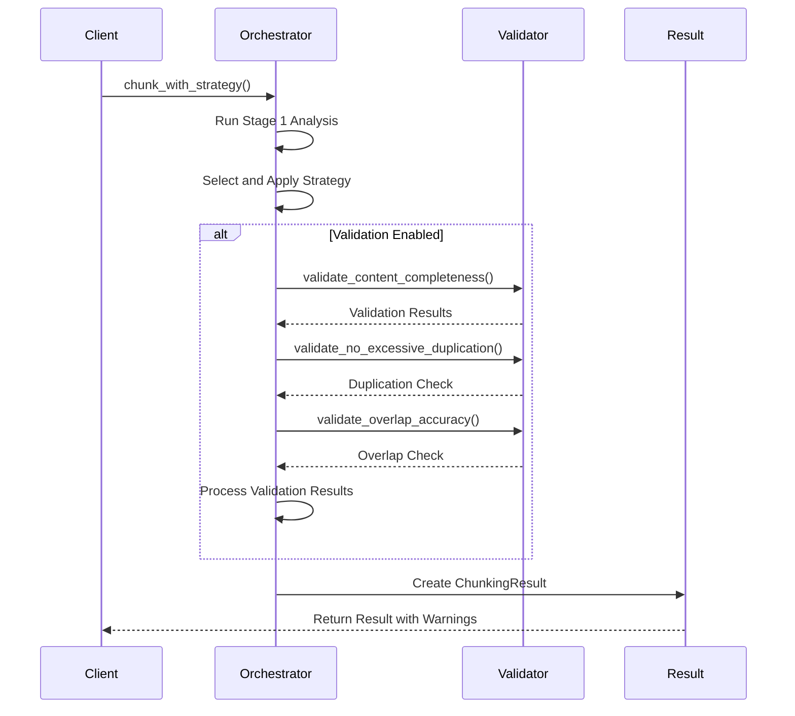
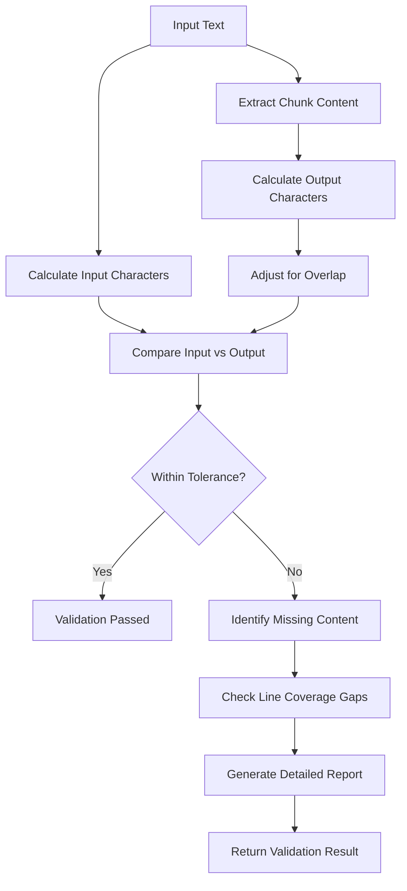
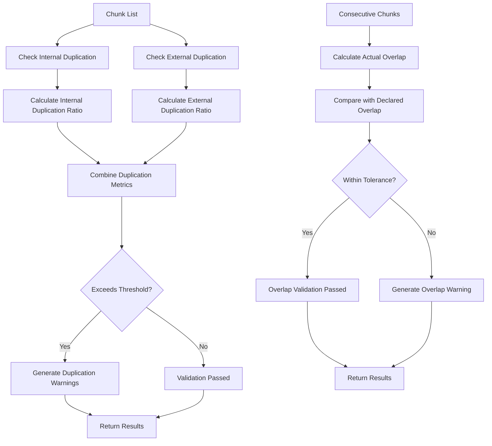
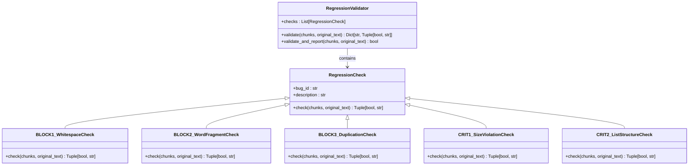
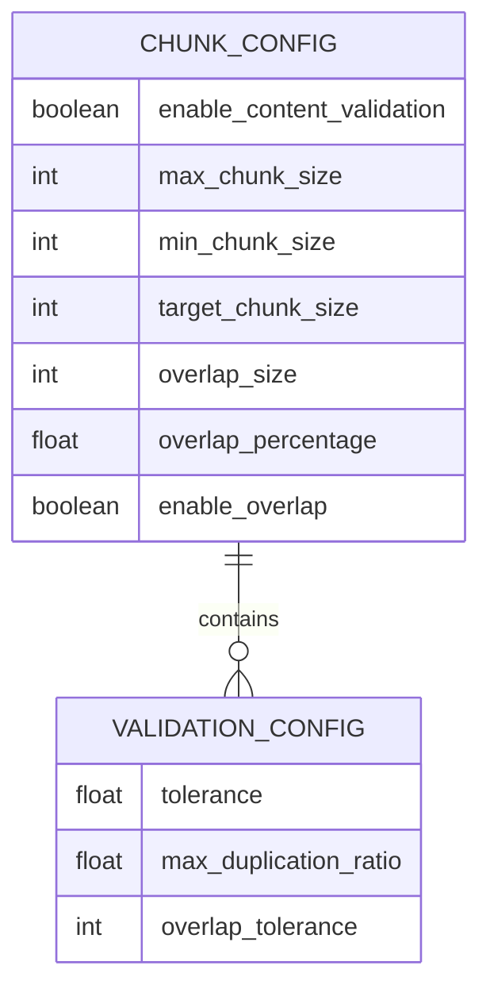
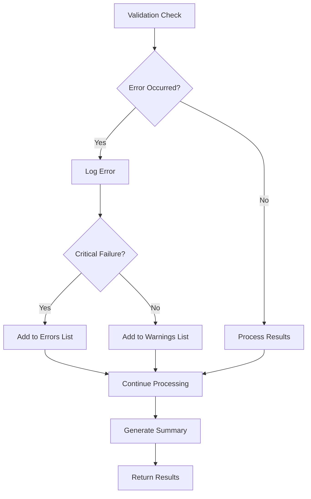

# Orchestrator Content Validation

<cite>
**Referenced Files in This Document**   
- [orchestrator.py](file://markdown_chunker/chunker/orchestrator.py)
- [validator.py](file://markdown_chunker/chunker/validator.py)
- [dedup_validator.py](file://markdown_chunker/chunker/dedup_validator.py)
- [regression_validator.py](file://markdown_chunker/chunker/regression_validator.py)
- [types.py](file://markdown_chunker/chunker/types.py)
- [errors.py](file://markdown_chunker/chunker/errors.py)
- [core.py](file://markdown_chunker/chunker/core.py)
</cite>

## Table of Contents
1. [Introduction](#introduction)
2. [Content Validation Framework](#content-validation-framework)
3. [Orchestrator Validation Integration](#orchestrator-validation-integration)
4. [Data Completeness Validation](#data-completeness-validation)
5. [Deduplication Validation](#deduplication-validation)
6. [Regression Validation](#regression-validation)
7. [Validation Configuration](#validation-configuration)
8. [Error Handling and Reporting](#error-handling-and-reporting)
9. [Conclusion](#conclusion)

## Introduction

The Orchestrator Content Validation system ensures data integrity and quality throughout the markdown chunking process. This document details the validation framework that prevents data loss, excessive duplication, and regression of critical fixes. The system operates as part of the chunking orchestrator, providing comprehensive validation at multiple stages of processing.

The validation framework consists of three main components: data completeness validation, deduplication validation, and regression validation. These components work together to ensure that the chunking process maintains content fidelity, preserves document structure, and adheres to quality standards. The orchestrator integrates these validations seamlessly, providing detailed feedback while allowing the chunking process to continue even when validation issues are detected.

**Section sources**
- [orchestrator.py](file://markdown_chunker/chunker/orchestrator.py#L1-L457)
- [core.py](file://markdown_chunker/chunker/core.py#L300-L327)

## Content Validation Framework

The content validation framework provides a comprehensive system for ensuring data integrity during markdown chunking. It consists of specialized validators that address different aspects of content quality and integrity. The framework is designed to be non-blocking, meaning validation failures do not halt the chunking process but instead generate warnings that are included in the result.

The validation system operates on the principle of defensive programming, where potential issues are detected and reported without disrupting the primary functionality. This approach ensures that users receive their chunked content even when validation issues are present, while also being informed about potential quality concerns. The framework includes validators for data completeness, deduplication, and regression prevention, each addressing specific quality metrics.

The validation process is configurable through the ChunkConfig object, which allows users to enable or disable specific validation checks based on their requirements. This flexibility enables the system to balance thorough validation with performance considerations, particularly for large documents where certain validations might be resource-intensive.

**Diagram sources**
- [orchestrator.py](file://markdown_chunker/chunker/orchestrator.py#L109-L137)
- [core.py](file://markdown_chunker/chunker/core.py#L302-L326)

## Orchestrator Validation Integration

The ChunkingOrchestrator integrates validation checks directly into the chunking workflow, ensuring that content quality is assessed immediately after chunk generation. The orchestrator's `chunk_with_strategy` method implements a comprehensive validation sequence that checks for content completeness, duplication, and overlap accuracy.

Validation is conditionally executed based on the configuration setting `enable_content_validation`. When enabled, the orchestrator performs three key validation steps: content completeness verification, duplication detection, and overlap accuracy checking. Each validation step is designed to be resilient, catching exceptions and converting them to warnings rather than allowing them to disrupt the chunking process.

The orchestrator handles validation results by incorporating them into the final ChunkingResult object. Validation warnings are added to the result's warnings list, while critical validation failures are logged but do not prevent the return of generated chunks. This approach ensures that users receive their content even when validation issues are detected, while also being informed about potential quality concerns.

**Diagram sources**
- [orchestrator.py](file://markdown_chunker/chunker/orchestrator.py#L109-L137)
- [core.py](file://markdown_chunker/chunker/core.py#L302-L326)

**Section sources**
- [orchestrator.py](file://markdown_chunker/chunker/orchestrator.py#L109-L137)
- [core.py](file://markdown_chunker/chunker/core.py#L302-L326)

## Data Completeness Validation

The DataCompletenessValidator ensures that no significant content is lost during the chunking process. It performs a character-level analysis comparing the input text length with the total output length across all chunks, accounting for overlap regions and whitespace normalization differences.

The validator uses a tolerance-based approach, allowing for minor discrepancies due to formatting changes. By default, it permits up to 5% variance for whitespace normalization and accounts for preamble duplication which can increase output size by up to 10%. This flexible approach recognizes that legitimate formatting changes may affect character counts while still detecting significant content loss.

When content loss is detected, the validator provides detailed information about the missing content, including line ranges and content previews. It also checks for gaps in line coverage, identifying large sections (>10 lines) that may have been omitted from the chunks. This multi-faceted approach ensures comprehensive detection of content completeness issues.

**Diagram sources**
- [validator.py](file://markdown_chunker/chunker/validator.py#L386-L456)
- [core.py](file://markdown_chunker/chunker/core.py#L304-L326)

**Section sources**
- [validator.py](file://markdown_chunker/chunker/validator.py#L386-L456)
- [core.py](file://markdown_chunker/chunker/core.py#L304-L326)

## Deduplication Validation

The deduplication validation system prevents excessive content duplication within and between chunks. It addresses the BLOCK-3 issue of "massive content duplication" by implementing two complementary validation functions: `validate_no_excessive_duplication` and `validate_overlap_accuracy`.

The duplication validator checks for both internal duplication (within a single chunk) and external duplication (between consecutive chunks). For internal duplication, it identifies repeated paragraphs within chunks. For external duplication, it compares chunks while excluding the known overlap region, ensuring that duplication beyond intentional overlap is detected.

The overlap validator verifies that the declared overlap size matches the actual character-level overlap between consecutive chunks. It uses a longest common suffix/prefix approach to calculate the true overlap, allowing for a 10% tolerance to accommodate minor whitespace differences. This ensures that the overlap metadata accurately reflects the actual content duplication.

**Diagram sources**
- [dedup_validator.py](file://markdown_chunker/chunker/dedup_validator.py#L125-L158)
- [dedup_validator.py](file://markdown_chunker/chunker/dedup_validator.py#L193-L233)

**Section sources**
- [dedup_validator.py](file://markdown_chunker/chunker/dedup_validator.py#L125-L158)
- [dedup_validator.py](file://markdown_chunker/chunker/dedup_validator.py#L193-L233)

## Regression Validation

The regression validation system prevents the recurrence of previously fixed bugs by implementing targeted checks for specific issue patterns. The RegressionValidator runs a suite of checks designed to detect regressions of critical fixes, ensuring that resolved issues do not reappear in future versions.

The system includes checks for several specific bug patterns:
- BLOCK-1: Text concatenation without whitespace preservation
- BLOCK-2: Word splitting at chunk boundaries
- BLOCK-3: Massive content duplication
- CRIT-1: Max chunk size constraint violations
- CRIT-2: Complete loss of list structure formatting

Each check is implemented as a separate RegressionCheck subclass that analyzes the generated chunks and original text for specific patterns indicative of the regression. The validator can be run as part of CI/CD pipelines to prevent regressions before deployment.

**Diagram sources**
- [regression_validator.py](file://markdown_chunker/chunker/regression_validator.py#L15-L239)
- [regression_validator.py](file://markdown_chunker/chunker/regression_validator.py#L229-L261)

**Section sources**
- [regression_validator.py](file://markdown_chunker/chunker/regression_validator.py#L15-L239)

## Validation Configuration

Validation behavior is controlled through the ChunkConfig object, which provides configuration options for enabling or disabling specific validation checks. The primary configuration parameter is `enable_content_validation`, which controls whether content completeness validation is performed.

The configuration system allows for fine-grained control over validation behavior, enabling users to balance thorough validation with performance requirements. For example, duplication validation is automatically skipped for documents larger than 50KB to avoid performance issues, while overlap validation uses a lighter-weight check suitable for all document sizes.

Additional configuration options include tolerance settings for the DataCompletenessValidator and duplication thresholds for the deduplication validator. These parameters can be adjusted based on specific use cases, allowing the validation system to be tailored to different content types and quality requirements.

**Diagram sources**
- [types.py](file://markdown_chunker/chunker/types.py#L608-L610)
- [dedup_validator.py](file://markdown_chunker/chunker/dedup_validator.py#L126-L136)

**Section sources**
- [types.py](file://markdown_chunker/chunker/types.py#L608-L610)
- [dedup_validator.py](file://markdown_chunker/chunker/dedup_validator.py#L126-L136)

## Error Handling and Reporting

The validation system implements comprehensive error handling to ensure that validation issues do not disrupt the chunking process. Validation exceptions are caught and converted to warnings that are included in the ChunkingResult object, allowing the primary functionality to continue while still reporting quality concerns.

The error handling strategy follows a tiered approach:
1. Validation errors are logged at the appropriate severity level (error, warning, debug)
2. Critical validation failures are added to the result's errors list
3. Non-critical issues are added to the result's warnings list
4. Detailed information about validation issues is preserved for debugging

The reporting system provides human-readable summaries of validation results, making it easy to understand the nature and severity of any issues detected. The DataCompletenessValidator's get_summary method, for example, provides a concise overview of validation status including coverage percentage and missing character counts.

**Diagram sources**
- [orchestrator.py](file://markdown_chunker/chunker/orchestrator.py#L111-L119)
- [validator.py](file://markdown_chunker/chunker/validator.py#L37-L50)
- [core.py](file://markdown_chunker/chunker/core.py#L323-L326)

**Section sources**
- [orchestrator.py](file://markdown_chunker/chunker/orchestrator.py#L111-L119)
- [validator.py](file://markdown_chunker/chunker/validator.py#L37-L50)
- [core.py](file://markdown_chunker/chunker/core.py#L323-L326)

## Conclusion

The Orchestrator Content Validation system provides a robust framework for ensuring data integrity and quality in the markdown chunking process. By integrating multiple validation layers—including data completeness, deduplication, and regression prevention—the system maintains high content fidelity while providing detailed feedback about potential issues.

The validation framework is designed to be non-disruptive, allowing the chunking process to complete even when validation issues are detected. This approach ensures that users receive their content while also being informed about quality concerns that may require attention. The configurable nature of the validation system allows users to balance thoroughness with performance based on their specific requirements.

Future enhancements could include additional validation checks, improved reporting capabilities, and more sophisticated analysis algorithms. However, the current implementation already provides comprehensive protection against data loss, excessive duplication, and regression of critical fixes, making it a reliable component of the overall chunking system.