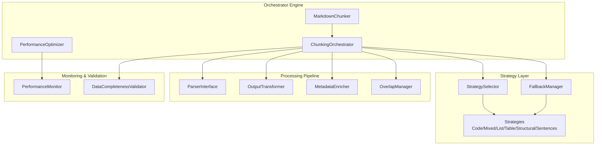
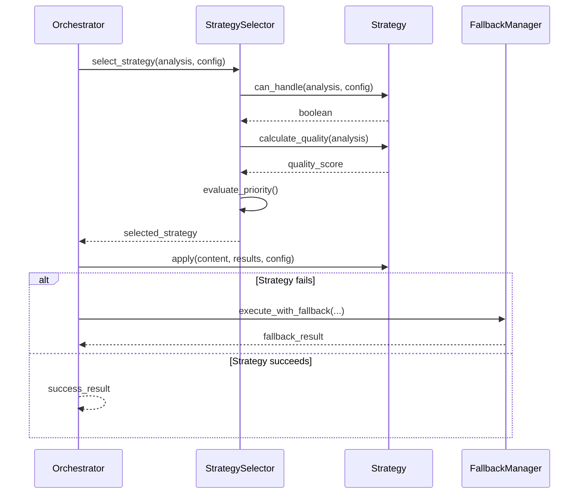
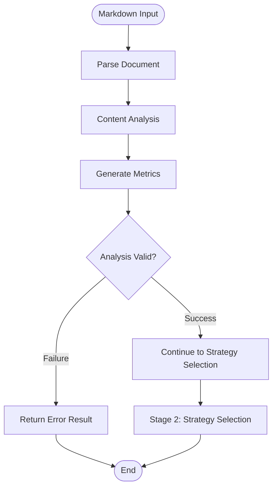
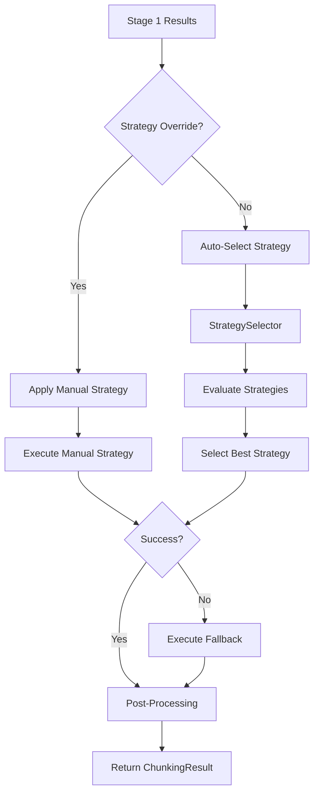
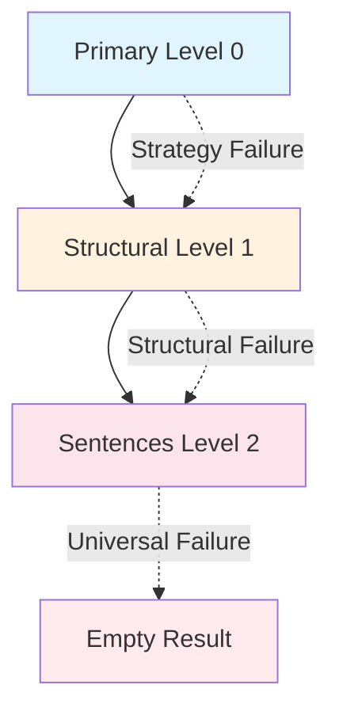
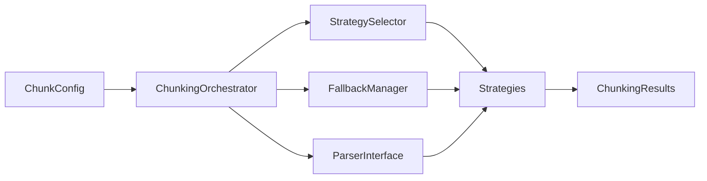
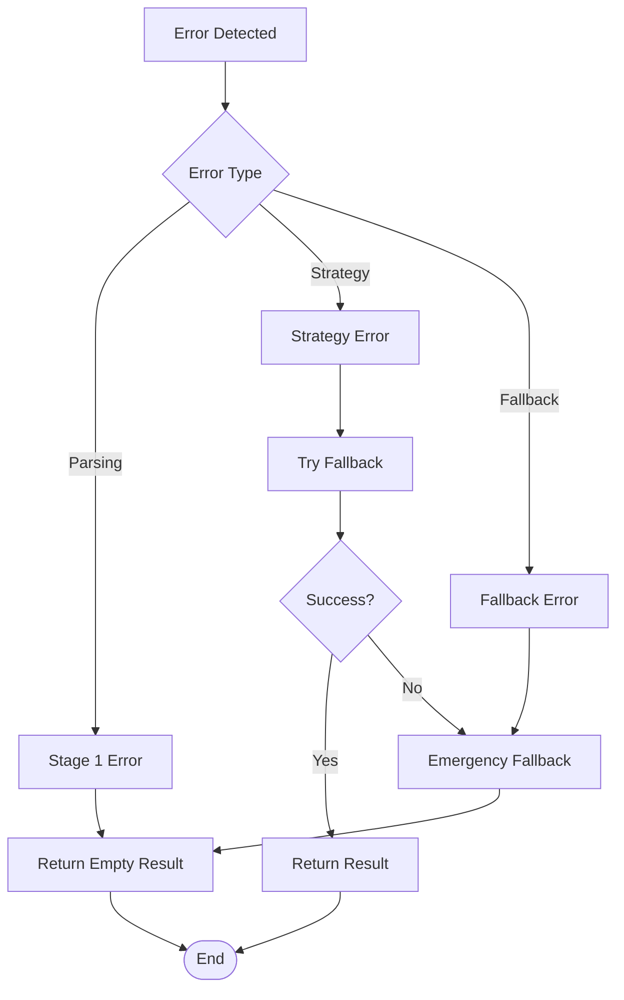
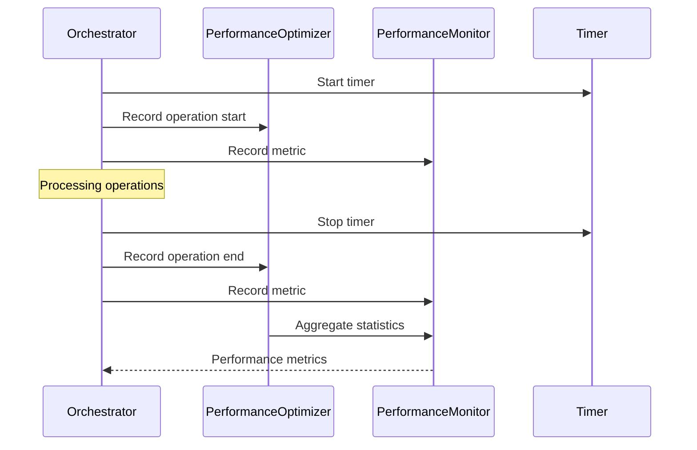

# Orchestrator Engine

<cite>
**Referenced Files in This Document**
- [orchestrator.py](file://markdown_chunker/chunker/orchestrator.py)
- [core.py](file://markdown_chunker/chunker/core.py)
- [selector.py](file://markdown_chunker/chunker/selector.py)
- [types.py](file://markdown_chunker/chunker/types.py)
- [fallback_manager.py](file://markdown_chunker/chunker/components/fallback_manager.py)
- [base.py](file://markdown_chunker/chunker/strategies/base.py)
- [performance.py](file://markdown_chunker/chunker/performance.py)
- [transformer.py](file://markdown_chunker/chunker/transformer.py)
- [sentences_strategy.py](file://markdown_chunker/chunker/strategies/sentences_strategy.py)
- [structural_strategy.py](file://markdown_chunker/chunker/strategies/structural_strategy.py)
</cite>

## Table of Contents
1. [Introduction](#introduction)
2. [System Architecture](#system-architecture)
3. [Core Components](#core-components)
4. [Execution Flow](#execution-flow)
5. [Strategy Selection Process](#strategy-selection-process)
6. [Fallback Mechanisms](#fallback-mechanisms)
7. [Processing State Management](#processing-state-management)
8. [Configuration Injection](#configuration-injection)
9. [Error Handling](#error-handling)
10. [Performance Monitoring](#performance-monitoring)
11. [Integration Points](#integration-points)
12. [Best Practices](#best-practices)

## Introduction

The Orchestrator Engine serves as the central coordination hub in the Dify Markdown Chunker system, managing the complex pipeline of operations that transforms raw Markdown content into semantically coherent chunks. This engine coordinates the entire chunking process, from initial content analysis through strategy selection, execution, and post-processing, ensuring optimal results while maintaining robust error handling and performance monitoring.

The orchestrator operates as the primary interface between the parser module and the strategy execution layer, implementing a sophisticated three-stage pipeline that includes content analysis, strategy selection, and chunk creation. It maintains processing state, handles configuration injection, and ensures idempotent results through careful state management and fallback mechanisms.

## System Architecture

The Orchestrator Engine follows a modular architecture that separates concerns across multiple specialized components:

**Diagram sources**
- [orchestrator.py](file://markdown_chunker/chunker/orchestrator.py#L23-L49)
- [core.py](file://markdown_chunker/chunker/core.py#L41-L150)
- [selector.py](file://markdown_chunker/chunker/selector.py#L23-L47)

**Section sources**
- [orchestrator.py](file://markdown_chunker/chunker/orchestrator.py#L1-L50)
- [core.py](file://markdown_chunker/chunker/core.py#L1-L150)

## Core Components

### ChunkingOrchestrator

The `ChunkingOrchestrator` class serves as the primary coordination mechanism, responsible for:

- **Stage 1 Analysis**: Running content analysis through the parser interface
- **Strategy Selection**: Coordinating with the StrategySelector for optimal strategy choice
- **Execution Management**: Orchestrating strategy application with fallback support
- **Result Processing**: Managing post-processing operations and error handling

Key responsibilities include:
- Maintaining configuration state and passing it to downstream components
- Coordinating error recovery through the fallback manager
- Ensuring proper logging and monitoring throughout the process
- Managing the execution timeline and performance metrics

### StrategySelector Integration

The orchestrator integrates deeply with the `StrategySelector` to implement intelligent strategy selection:

**Diagram sources**
- [orchestrator.py](file://markdown_chunker/chunker/orchestrator.py#L241-L290)
- [selector.py](file://markdown_chunker/chunker/selector.py#L58-L77)

**Section sources**
- [orchestrator.py](file://markdown_chunker/chunker/orchestrator.py#L23-L120)
- [selector.py](file://markdown_chunker/chunker/selector.py#L23-L77)

## Execution Flow

The orchestrator implements a sophisticated three-stage execution pipeline:

### Stage 1: Content Analysis

The first stage involves comprehensive content analysis through the parser interface:

**Diagram sources**
- [orchestrator.py](file://markdown_chunker/chunker/orchestrator.py#L120-L168)

### Stage 2: Strategy Selection and Application

The orchestrator coordinates strategy selection and application:

**Diagram sources**
- [orchestrator.py](file://markdown_chunker/chunker/orchestrator.py#L169-L340)

**Section sources**
- [orchestrator.py](file://markdown_chunker/chunker/orchestrator.py#L55-L119)

## Strategy Selection Process

The orchestrator implements a dual-mode strategy selection process:

### Automatic Strategy Selection

When no strategy override is specified, the orchestrator uses the StrategySelector to automatically choose the optimal strategy:

1. **Content Analysis**: The orchestrator receives detailed content analysis from Stage 1
2. **Strategy Evaluation**: Each strategy is evaluated for applicability and quality
3. **Priority-Based Selection**: Strategies are ranked by priority and quality score
4. **Final Selection**: The highest-ranked applicable strategy is selected

### Manual Strategy Override

When a specific strategy is requested, the orchestrator validates and executes it:

1. **Strategy Lookup**: The orchestrator locates the requested strategy by name
2. **Validation**: The strategy is verified for availability and compatibility
3. **Execution**: The strategy is executed with the provided configuration
4. **Fallback**: If execution fails, fallback mechanisms are triggered

**Section sources**
- [orchestrator.py](file://markdown_chunker/chunker/orchestrator.py#L169-L340)
- [selector.py](file://markdown_chunker/chunker/selector.py#L58-L133)

## Fallback Mechanisms

The orchestrator implements a sophisticated three-level fallback system to ensure chunking success:

### Fallback Levels

**Diagram sources**
- [fallback_manager.py](file://markdown_chunker/chunker/components/fallback_manager.py#L22-L29)

### Fallback Execution Flow

The fallback manager implements a cascading failure recovery system:

1. **Primary Strategy**: Attempt execution with the initially selected strategy
2. **Structural Fallback**: If primary fails, attempt structural strategy (skipped if primary was structural)
3. **Sentences Fallback**: If structural fails, attempt universal sentences strategy (skipped if primary was sentences)
4. **Emergency Recovery**: If all strategies fail, return empty result with error information

### Fallback Metadata

Each fallback level adds specific metadata to chunks:
- **Fallback Level**: Numeric level indicating which fallback was used
- **Fallback Reason**: Descriptive reason for fallback activation
- **Strategy Used**: Name of the strategy that succeeded

**Section sources**
- [fallback_manager.py](file://markdown_chunker/chunker/components/fallback_manager.py#L31-L175)

## Processing State Management

The orchestrator maintains comprehensive processing state throughout the chunking pipeline:

### State Components

- **Configuration State**: Chunking configuration passed through all stages
- **Analysis Results**: Content analysis data from Stage 1
- **Strategy Information**: Selected strategy and fallback decisions
- **Processing Metrics**: Timing and performance data
- **Error State**: Accumulated errors and warnings

### State Persistence

The orchestrator ensures state persistence through:
- **Immutable Results**: All results are immutable dataclasses
- **Metadata Enrichment**: State information is preserved in chunk metadata
- **Logging Integration**: Comprehensive logging captures state transitions
- **Error Propagation**: Errors are propagated with full context

### Idempotent Operations

The orchestrator ensures idempotent results through:
- **Deterministic Processing**: Same input produces identical output
- **Stateless Design**: No reliance on external mutable state
- **Validation Checks**: Input validation prevents inconsistent processing
- **Recovery Mechanisms**: Failed operations can be retried with same results

**Section sources**
- [orchestrator.py](file://markdown_chunker/chunker/orchestrator.py#L71-L118)
- [types.py](file://markdown_chunker/chunker/types.py#L322-L495)

## Configuration Injection

The orchestrator implements flexible configuration injection through multiple channels:

### Configuration Sources

1. **Constructor Configuration**: Initial configuration passed during orchestrator initialization
2. **Runtime Configuration**: Dynamic configuration updates during processing
3. **Strategy-Specific Configuration**: Strategy-specific parameter overrides
4. **Environment Configuration**: Environment-based configuration settings

### Configuration Propagation

**Diagram sources**
- [orchestrator.py](file://markdown_chunker/chunker/orchestrator.py#L34-L54)

### Configuration Validation

The orchestrator validates configuration at multiple points:
- **Initialization**: Configuration is validated during orchestrator setup
- **Strategy Selection**: Configuration is validated against strategy requirements
- **Execution**: Runtime configuration changes are validated before application

**Section sources**
- [types.py](file://markdown_chunker/chunker/types.py#L497-L800)
- [core.py](file://markdown_chunker/chunker/core.py#L643-L660)

## Error Handling

The orchestrator implements comprehensive error handling across all processing stages:

### Error Categories

1. **Parsing Errors**: Issues during Stage 1 content analysis
2. **Strategy Errors**: Failures during strategy execution
3. **Fallback Errors**: Failures during fallback execution
4. **Validation Errors**: Issues during result validation

### Error Recovery Strategies

**Diagram sources**
- [orchestrator.py](file://markdown_chunker/chunker/orchestrator.py#L81-L91)

### Error Reporting

The orchestrator provides comprehensive error reporting:
- **Structured Errors**: Errors are captured in structured error lists
- **Context Information**: Errors include context about where they occurred
- **Fallback Information**: Errors include fallback level and strategy information
- **Warning Collection**: Non-fatal issues are collected as warnings

**Section sources**
- [orchestrator.py](file://markdown_chunker/chunker/orchestrator.py#L81-L91)
- [fallback_manager.py](file://markdown_chunker/chunker/components/fallback_manager.py#L165-L175)

## Performance Monitoring

The orchestrator integrates with the PerformanceOptimizer to provide comprehensive performance monitoring:

### Monitoring Features

1. **Timing Metrics**: Detailed timing for each processing stage
2. **Throughput Tracking**: Processing throughput measurements
3. **Resource Utilization**: Memory and CPU usage tracking
4. **Bottleneck Identification**: Performance bottleneck detection

### Performance Data Collection

**Diagram sources**
- [performance.py](file://markdown_chunker/chunker/performance.py#L32-L82)

### Performance Optimization

The orchestrator implements several performance optimization strategies:
- **Lazy Loading**: Strategies are loaded on-demand
- **Caching**: Frequently accessed data is cached
- **Streaming**: Large documents are processed in chunks
- **Memory Management**: Efficient memory usage patterns

**Section sources**
- [performance.py](file://markdown_chunker/chunker/performance.py#L107-L243)
- [core.py](file://markdown_chunker/chunker/core.py#L661-L704)

## Integration Points

The orchestrator serves as the central integration point for multiple system components:

### Parser Integration

The orchestrator integrates with the parser through the ParserInterface:
- **Stage 1 Results**: Receives structured content analysis data
- **Element Detection**: Accesses parsed document elements
- **AST Information**: Utilizes abstract syntax tree data

### Strategy Integration

The orchestrator coordinates with multiple strategies:
- **Strategy Selection**: Uses StrategySelector for strategy evaluation
- **Execution Coordination**: Manages strategy execution with fallback support
- **Quality Assessment**: Integrates strategy quality metrics

### Post-Processing Integration

The orchestrator integrates with post-processing components:
- **Overlap Management**: Coordinates overlap application
- **Metadata Enrichment**: Integrates metadata enhancement
- **Validation**: Works with data completeness validators

**Section sources**
- [orchestrator.py](file://markdown_chunker/chunker/orchestrator.py#L120-L168)
- [core.py](file://markdown_chunker/chunker/core.py#L265-L346)

## Best Practices

### Configuration Management

- **Use Configuration Profiles**: Leverage predefined configuration profiles for common use cases
- **Validate Configuration**: Always validate configuration before use
- **Environment-Specific Settings**: Use environment variables for configuration overrides

### Error Handling

- **Graceful Degradation**: Always provide fallback mechanisms
- **Comprehensive Logging**: Log all errors with sufficient context
- **User-Friendly Messages**: Provide clear error messages to users

### Performance Optimization

- **Enable Monitoring**: Use performance monitoring in production
- **Profile Regularly**: Profile performance regularly to identify bottlenecks
- **Optimize Configurations**: Tune configurations based on performance data

### Testing and Validation

- **Test Fallbacks**: Thoroughly test fallback mechanisms
- **Validate Results**: Validate chunking results for correctness
- **Monitor Quality**: Monitor chunk quality metrics

**Section sources**
- [core.py](file://markdown_chunker/chunker/core.py#L661-L704)
- [types.py](file://markdown_chunker/chunker/types.py#L497-L800)