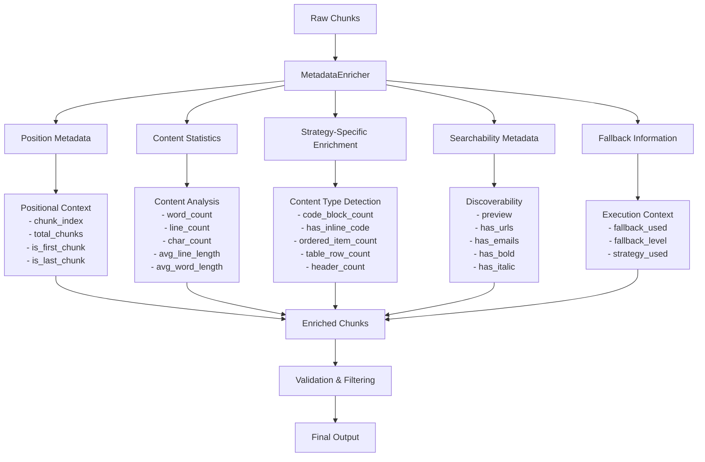
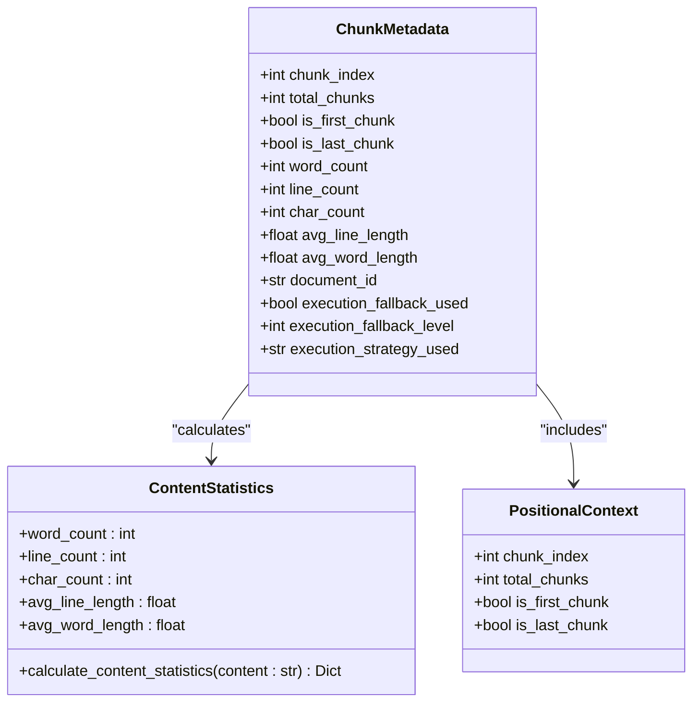
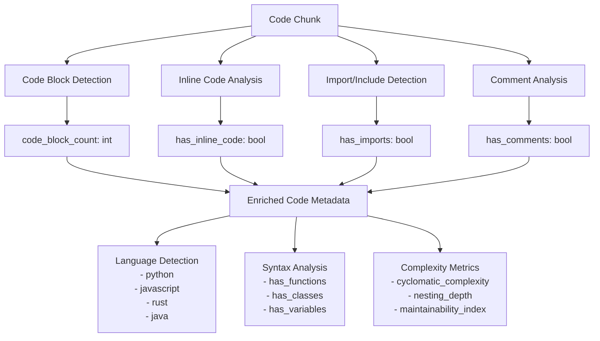
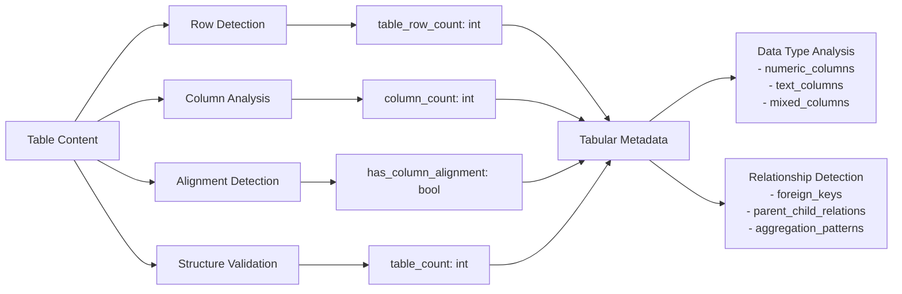
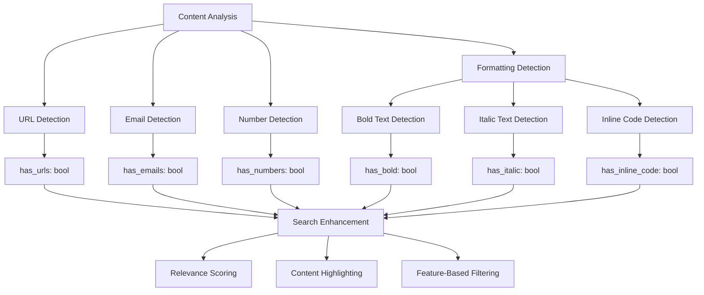
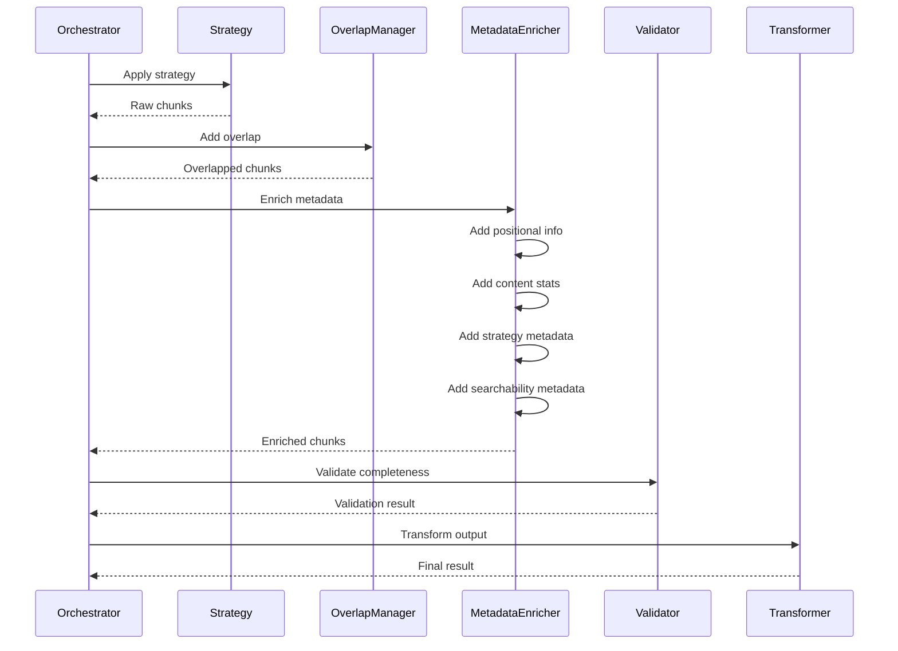
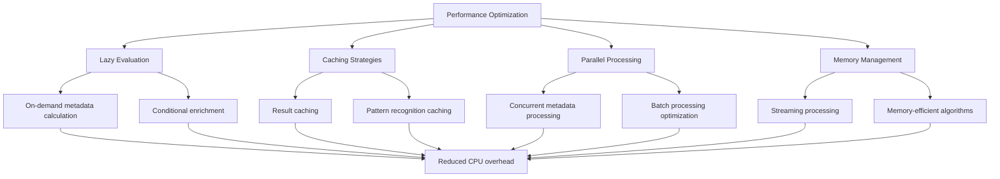
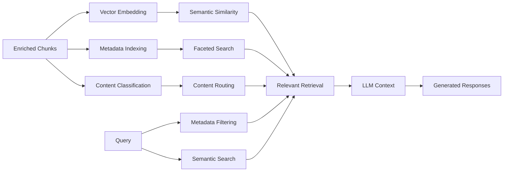
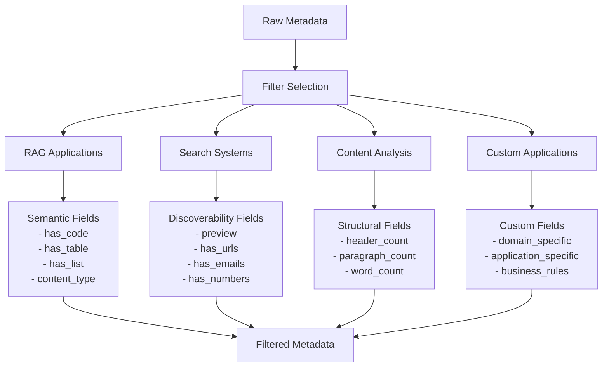

# Metadata Enrichment

<cite>
**Referenced Files in This Document**
- [metadata_enricher.py](file://markdown_chunker/chunker/components/metadata_enricher.py)
- [orchestrator.py](file://markdown_chunker/chunker/orchestrator.py)
- [types.py](file://markdown_chunker/chunker/types.py)
- [core.py](file://markdown_chunker/chunker/core.py)
- [enhanced_ast_builder.py](file://markdown_chunker/parser/enhanced_ast_builder.py)
- [structural_strategy.py](file://markdown_chunker/chunker/strategies/structural_strategy.py)
- [rag_integration.py](file://examples/rag_integration.py)
- [dify_integration.py](file://examples/dify_integration.py)
- [test_metadata_enricher.py](file://tests/chunker/test_components/test_metadata_enricher.py)
- [markdown_chunk_tool.py](file://tools/markdown_chunk_tool.py)
</cite>

## Table of Contents
1. [Introduction](#introduction)
2. [Architecture Overview](#architecture-overview)
3. [Core Metadata Types](#core-metadata-types)
4. [Positional and Structural Metadata](#positional-and-structural-metadata)
5. [Content-Specific Enrichment](#content-specific-enrichment)
6. [Searchability and Discovery Metadata](#searchability-and-discovery-metadata)
7. [Integration with Orchestrator](#integration-with-orchestrator)
8. [Configuration and Customization](#configuration-and-customization)
9. [Performance Considerations](#performance-considerations)
10. [Downstream Applications](#downstream-applications)
11. [Best Practices](#best-practices)
12. [Troubleshooting](#troubleshooting)

## Introduction

The MetadataEnricher component serves as a critical post-processing stage in the markdown chunking pipeline, adding comprehensive contextual metadata to chunks that enhances their usability for downstream applications. This component operates after strategy selection and chunk creation, providing rich contextual information that enables sophisticated downstream processing for RAG systems, search engines, and content management platforms.

The MetadataEnricher transforms raw chunks into semantically enriched containers by injecting strategic metadata about content type, structure, position, and searchability characteristics. This enrichment process creates a bridge between raw content extraction and intelligent content processing, enabling applications to make informed decisions about content routing, ranking, and presentation.

## Architecture Overview

The MetadataEnricher integrates seamlessly into the chunking pipeline as part of the post-processing chain, positioned strategically after overlap management and before validation. Its architecture follows a modular design that supports extensible metadata enrichment while maintaining performance and reliability.

**Diagram sources**
- [metadata_enricher.py](file://markdown_chunker/chunker/components/metadata_enricher.py#L35-L142)
- [core.py](file://markdown_chunker/chunker/core.py#L287-L309)

**Section sources**
- [metadata_enricher.py](file://markdown_chunker/chunker/components/metadata_enricher.py#L13-L414)
- [core.py](file://markdown_chunker/chunker/core.py#L119-L150)

## Core Metadata Types

The MetadataEnricher injects several categories of metadata that serve different purposes in downstream processing. These metadata types form a comprehensive foundation for content understanding and manipulation.

### General Metadata Categories

| Category | Purpose | Key Fields | Use Cases |
|----------|---------|------------|-----------|
| **Positional** | Document positioning context | `chunk_index`, `total_chunks`, `is_first_chunk`, `is_last_chunk` | Sequential processing, overlap calculations, document reconstruction |
| **Content Statistics** | Quantitative analysis | `word_count`, `line_count`, `char_count`, `avg_line_length`, `avg_word_length` | Size-based filtering, performance optimization, content analysis |
| **Content Type** | Semantic classification | `content_type`, `strategy`, `language` | Strategy selection, content routing, processing optimization |
| **Execution Context** | Runtime information | `execution_fallback_used`, `execution_fallback_level`, `execution_strategy_used` | Debugging, fallback tracking, performance monitoring |
| **Searchability** | Discovery enhancement | `preview`, `has_urls`, `has_emails`, `has_bold`, `has_italic` | Search indexing, relevance scoring, content highlighting |

### Positional and Structural Metadata

The positional metadata system provides essential context about a chunk's place within the document structure and overall processing sequence. This information enables sophisticated content orchestration and maintains document integrity across processing stages.

**Diagram sources**
- [metadata_enricher.py](file://markdown_chunker/chunker/components/metadata_enricher.py#L68-L142)
- [types.py](file://markdown_chunker/chunker/types.py#L36-L190)

**Section sources**
- [metadata_enricher.py](file://markdown_chunker/chunker/components/metadata_enricher.py#L68-L142)
- [types.py](file://markdown_chunker/chunker/types.py#L174-L217)

## Content-Specific Enrichment

The MetadataEnricher applies specialized enrichment strategies based on the detected content type of each chunk. This approach ensures that chunks receive metadata appropriate to their structural characteristics and processing requirements.

### Code Content Enrichment

Code chunks receive comprehensive metadata that captures their structural and functional characteristics, enabling specialized processing for development tools, documentation systems, and code analysis applications.

**Diagram sources**
- [metadata_enricher.py](file://markdown_chunker/chunker/components/metadata_enricher.py#L165-L198)

### List Content Enrichment

List chunks receive metadata that captures their hierarchical structure, item types, and organizational patterns, enabling sophisticated list processing and navigation systems.

| Metadata Field | Description | Use Case |
|----------------|-------------|----------|
| `ordered_item_count` | Number of numbered items | Ordered list processing, sequential content analysis |
| `unordered_item_count` | Number of bullet items | Unordered list handling, categorization |
| `task_item_count` | Number of checkbox items | Task management integration, progress tracking |
| `has_nested_lists` | Presence of indentation | Hierarchical navigation, outline generation |
| `nested_item_count` | Depth of nested structures | Tree visualization, breadcrumb generation |

### Table Content Enrichment

Table chunks receive detailed structural metadata that enables sophisticated table processing, analysis, and presentation systems.

**Diagram sources**
- [metadata_enricher.py](file://markdown_chunker/chunker/components/metadata_enricher.py#L229-L254)

### Structural Content Enrichment

Structural chunks receive metadata that captures the document hierarchy and organizational structure, enabling sophisticated navigation and content organization systems.

**Section sources**
- [metadata_enricher.py](file://markdown_chunker/chunker/components/metadata_enricher.py#L165-L287)

## Searchability and Discovery Metadata

The searchability metadata system enhances chunks with information that improves discoverability, relevance scoring, and content presentation across various applications.

### Content Feature Detection

The searchability metadata includes sophisticated content feature detection that identifies important structural and stylistic elements within chunks.

**Diagram sources**
- [metadata_enricher.py](file://markdown_chunker/chunker/components/metadata_enricher.py#L289-L327)

### Preview Generation

The preview system generates concise summaries of chunk content that serve as effective search result snippets and content previews.

| Feature | Implementation | Purpose |
|---------|----------------|---------|
| **First Sentence Extraction** | Regex-based sentence boundary detection | Provides immediate content understanding |
| **Length Limiting** | Truncation with ellipsis for long previews | Maintains consistent preview sizes |
| **HTML Tag Removal** | Clean text extraction for display | Ensures compatibility across platforms |
| **Character Encoding** | Unicode normalization | Supports international content |

**Section sources**
- [metadata_enricher.py](file://markdown_chunker/chunker/components/metadata_enricher.py#L289-L327)

## Integration with Orchestrator

The MetadataEnricher integrates seamlessly with the orchestrator system, participating in the coordinated execution of the chunking pipeline while maintaining clear separation of concerns.

### Pipeline Positioning

The MetadataEnricher occupies a strategic position in the post-processing pipeline, following overlap management and preceding validation. This positioning ensures that all chunks receive comprehensive metadata before undergoing final quality checks.

**Diagram sources**
- [orchestrator.py](file://markdown_chunker/chunker/orchestrator.py#L56-L118)
- [core.py](file://markdown_chunker/chunker/core.py#L287-L309)

### Fallback Information Integration

The MetadataEnricher receives comprehensive fallback information from the orchestrator, enabling it to capture execution context and provide debugging information for failed processing attempts.

**Section sources**
- [orchestrator.py](file://markdown_chunker/chunker/orchestrator.py#L56-L118)
- [core.py](file://markdown_chunker/chunker/core.py#L287-L309)
- [metadata_enricher.py](file://markdown_chunker/chunker/components/metadata_enricher.py#L35-L142)

## Configuration and Customization

The MetadataEnricher supports extensive configuration options that enable customization for specific use cases and performance requirements.

### Configuration Options

| Parameter | Type | Default | Description |
|-----------|------|---------|-------------|
| `max_chunk_size` | int | 4096 | Maximum size for chunks (characters) |
| `min_chunk_size` | int | 512 | Minimum size for chunks (characters) |
| `enable_overlap` | bool | True | Enable chunk overlap for context preservation |
| `overlap_size` | int | 200 | Size of overlap in characters |
| `preserve_code_blocks` | bool | True | Preserve code blocks as atomic units |
| `preserve_tables` | bool | True | Preserve tables as atomic units |
| `preserve_list_hierarchy` | bool | True | Maintain list structure integrity |

### Custom Metadata Fields

Applications can extend the MetadataEnricher with custom metadata fields through the chunk metadata interface, enabling domain-specific enrichment while maintaining compatibility with the core enrichment system.

**Section sources**
- [types.py](file://markdown_chunker/chunker/types.py#L497-L800)
- [metadata_enricher.py](file://markdown_chunker/chunker/components/metadata_enricher.py#L174-L198)

## Performance Considerations

Metadata enrichment introduces computational overhead that must be carefully managed, especially when processing large documents or high-volume content streams.

### Performance Optimization Strategies

### Scalability Guidelines

For large-scale deployments, consider these performance optimization approaches:

- **Batch Processing**: Process multiple chunks together to amortize metadata calculation costs
- **Selective Enrichment**: Disable expensive enrichment operations for high-throughput scenarios
- **Memory Streaming**: Use streaming approaches for very large documents to minimize memory footprint
- **Caching Layers**: Implement caching for frequently accessed metadata patterns

**Section sources**
- [metadata_enricher.py](file://markdown_chunker/chunker/components/metadata_enricher.py#L144-L164)

## Downstream Applications

The enriched metadata enables sophisticated downstream applications that leverage the comprehensive context provided by the MetadataEnricher.

### RAG Systems Integration

RAG (Retrieval-Augmented Generation) systems benefit significantly from the enriched metadata, which enables sophisticated retrieval and ranking mechanisms.

**Diagram sources**
- [rag_integration.py](file://examples/rag_integration.py#L13-L52)

### Search Engine Integration

Search engines utilize metadata enrichment for advanced indexing, ranking, and result presentation capabilities.

| Metadata Field | Search Application | Benefit |
|----------------|-------------------|---------|
| `has_urls` | Link detection | Boosts search relevance for documentation |
| `has_emails` | Contact information | Enables contact-focused search results |
| `has_bold` | Emphasized content | Highlights important information |
| `has_italic` | Technical terms | Improves technical search accuracy |
| `preview` | Snippet generation | Provides rich search result previews |
| `content_type` | Content filtering | Enables facet-based search |

### Content Management Systems

CMS platforms leverage metadata enrichment for advanced content organization, workflow automation, and user experience optimization.

**Section sources**
- [rag_integration.py](file://examples/rag_integration.py#L173-L432)
- [dify_integration.py](file://examples/dify_integration.py#L398-L449)

## Best Practices

Effective use of the MetadataEnricher requires adherence to established best practices that ensure optimal performance and reliable results.

### Metadata Filtering Strategies

Different applications require different subsets of metadata. Implement filtering strategies to optimize for specific use cases:

### Validation and Quality Assurance

Implement comprehensive validation to ensure metadata quality and consistency across the processing pipeline.

**Section sources**
- [test_metadata_enricher.py](file://tests/chunker/test_components/test_metadata_enricher.py#L330-L372)
- [markdown_chunk_tool.py](file://tools/markdown_chunk_tool.py#L39-L71)

## Troubleshooting

Common issues and solutions when working with the MetadataEnricher component.

### Metadata Missing or Incorrect

**Symptoms**: Chunks lack expected metadata fields or contain incorrect values.

**Causes**:
- Strategy-specific enrichment not applying correctly
- Content type detection failing
- Metadata calculation errors

**Solutions**:
- Verify strategy assignment matches content type
- Check content preprocessing for special characters
- Review metadata validation results

### Performance Issues

**Symptoms**: Slow processing times with large documents.

**Causes**:
- Excessive metadata calculation
- Memory allocation bottlenecks
- Inefficient batch processing

**Solutions**:
- Implement selective enrichment
- Use streaming processing for large documents
- Optimize batch sizes for memory usage

### Integration Problems

**Symptoms**: Metadata not compatible with downstream systems.

**Causes**:
- Schema mismatches
- Data type inconsistencies
- Missing required fields

**Solutions**:
- Standardize metadata schemas
- Implement data type conversion
- Add required field validation

**Section sources**
- [test_metadata_enricher.py](file://tests/chunker/test_components/test_metadata_enricher.py#L330-L372)
- [metadata_enricher.py](file://markdown_chunker/chunker/components/metadata_enricher.py#L330-L414)