# Overlap Management

<cite>
**Referenced Files in This Document**
- [overlap_manager.py](file://markdown_chunker/chunker/components/overlap_manager.py)
- [orchestrator.py](file://markdown_chunker/chunker/orchestrator.py)
- [types.py](file://markdown_chunker/chunker/types.py)
- [metadata_enricher.py](file://markdown_chunker/chunker/components/metadata_enricher.py)
- [sentences_strategy.py](file://markdown_chunker/chunker/strategies/sentences_strategy.py)
- [structural_strategy.py](file://markdown_chunker/chunker/strategies/structural_strategy.py)
- [basic_usage.py](file://examples/basic_usage.py)
- [dify_integration.py](file://examples/dify_integration.py)
- [test_overlap_manager.py](file://tests/chunker/test_components/test_overlap_manager.py)
</cite>

## Table of Contents
1. [Introduction](#introduction)
2. [Architecture Overview](#architecture-overview)
3. [Core Components](#core-components)
4. [Configuration Parameters](#configuration-parameters)
5. [Overlap Calculation and Application](#overlap-calculation-and-application)
6. [Integration with Pipeline](#integration-with-pipeline)
7. [Edge Cases and Boundary Conditions](#edge-cases-and-boundary-conditions)
8. [Performance Considerations](#performance-considerations)
9. [Best Practices and Tuning Guidelines](#best-practices-and-tuning-guidelines)
10. [Troubleshooting Guide](#troubleshooting-guide)
11. [Conclusion](#conclusion)

## Introduction

The OverlapManager component is a critical part of the markdown chunking pipeline that manages content overlap between adjacent chunks. Its primary purpose is to maintain contextual continuity when documents are processed independently, which is essential for applications like Retrieval-Augmented Generation (RAG) systems, semantic search, and document analysis workflows.

Overlap management addresses several key challenges:
- **Context Preservation**: Ensures that information spanning chunk boundaries remains accessible
- **Boundary Alignment**: Maintains natural language boundaries during overlap creation
- **Integrity Protection**: Prevents corruption of structured content like code blocks
- **Performance Optimization**: Balances overlap benefits with computational overhead

The component operates as a post-processing step in the chunking pipeline, applying overlap after initial chunking strategies have been determined and executed.

## Architecture Overview

The OverlapManager follows a modular architecture that integrates seamlessly with the broader chunking system:


**Diagram sources**
- [orchestrator.py](file://markdown_chunker/chunker/orchestrator.py#L1-L340)
- [overlap_manager.py](file://markdown_chunker/chunker/components/overlap_manager.py#L1-L447)

**Section sources**
- [orchestrator.py](file://markdown_chunker/chunker/orchestrator.py#L1-L340)
- [overlap_manager.py](file://markdown_chunker/chunker/components/overlap_manager.py#L1-L447)

## Core Components

### OverlapManager Class

The OverlapManager serves as the central coordinator for overlap operations, providing a clean interface for applying overlap to chunk collections.


**Diagram sources**
- [overlap_manager.py](file://markdown_chunker/chunker/components/overlap_manager.py#L13-L447)
- [types.py](file://markdown_chunker/chunker/types.py#L36-L447)

### Key Methods and Responsibilities

| Method | Purpose | Input | Output |
|--------|---------|-------|--------|
| `apply_overlap()` | Main orchestration method | List of chunks | List of chunks with overlap |
| `_extract_overlap()` | Core overlap extraction logic | Chunk, direction flag | Overlap text string |
| `_add_overlap_prefix()` | Apply overlap to chunk | Original chunk, overlap text | Modified chunk |
| `_extract_suffix_overlap()` | Extract from end of content | Content, target size | Overlap text |
| `_extract_prefix_overlap()` | Extract from beginning | Content, target size | Overlap text |
| `calculate_overlap_statistics()` | Generate overlap metrics | List of chunks | Statistics dictionary |

**Section sources**
- [overlap_manager.py](file://markdown_chunker/chunker/components/overlap_manager.py#L37-L447)

## Configuration Parameters

The OverlapManager's behavior is controlled through several key configuration parameters defined in the ChunkConfig class:

### Core Overlap Settings

| Parameter | Type | Default | Description | Impact |
|-----------|------|---------|-------------|---------|
| `enable_overlap` | bool | True | Enables/disables overlap functionality | Determines if overlap is applied |
| `overlap_size` | int | 200 | Fixed overlap size in characters | Takes precedence over percentage |
| `overlap_percentage` | float | 0.1 (10%) | Percentage of chunk size for overlap | Used when overlap_size is 0 |

### Size Constraints and Limits

| Parameter | Type | Default | Description | Safety Mechanism |
|-----------|------|---------|-------------|------------------|
| `max_chunk_size` | int | 4096 | Maximum chunk size constraint | Prevents oversized chunks |
| `min_chunk_size` | int | 512 | Minimum chunk size requirement | Ensures meaningful chunks |
| `overlap_size` cap | - | 40% of source chunk | Maximum overlap ratio | Prevents dominance by overlap |
| `overlap_size` cap | - | 50% of resulting chunk | Post-merge overlap limit | Maintains content balance |

### Advanced Configuration Options

The configuration system provides flexible overlap control through multiple approaches:

```mermaid
flowchart TD
A[Overlap Request] --> B{overlap_size > 0?}
B --> |Yes| C[Use Fixed Size]
B --> |No| D{overlap_percentage > 0?}
D --> |Yes| E[Calculate Percentage]
D --> |No| F[No Overlap]
C --> G[Apply Maximum Ratio Check]
E --> G
G --> H{Size ≤ 40% of source?}
H --> |Yes| I[Proceed with Overlap]
H --> |No| J[Truncate to 40%]
I --> K[Apply to Chunks]
J --> K
F --> L[Skip Overlap]
```



**Diagram sources**
- [overlap_manager.py](file://markdown_chunker/chunker/components/overlap_manager.py#L125-L140)
- [types.py](file://markdown_chunker/chunker/types.py#L579-L582)

**Section sources**
- [types.py](file://markdown_chunker/chunker/types.py#L579-L582)
- [overlap_manager.py](file://markdown_chunker/chunker/components/overlap_manager.py#L125-L140)

## Overlap Calculation and Application

### Sentence-Based Overlap Strategy

The OverlapManager employs sophisticated sentence boundary detection to maintain natural language continuity:


**Diagram sources**
- [overlap_manager.py](file://markdown_chunker/chunker/components/overlap_manager.py#L109-L240)

### Overlap Extraction Process

The overlap extraction process varies depending on content characteristics and chunk boundaries:

#### Suffix Overlap (End of Previous Chunk)
- **Purpose**: Capture concluding information from previous chunk
- **Implementation**: Extracts sentences from the end of content
- **Boundary Handling**: Respects sentence boundaries when possible
- **Fallback**: Character-based extraction if no sentences found

#### Prefix Overlap (Beginning of Current Chunk)
- **Purpose**: Provide context for current chunk interpretation
- **Implementation**: Extracts sentences from the beginning
- **Boundary Handling**: Maintains sentence integrity
- **Safety Checks**: Prevents overlap from exceeding chunk size

### Code Block Integrity Protection

The system includes sophisticated protection mechanisms to prevent corruption of structured content:


**Diagram sources**
- [overlap_manager.py](file://markdown_chunker/chunker/components/overlap_manager.py#L81-L95)
- [overlap_manager.py](file://markdown_chunker/chunker/components/overlap_manager.py#L383-L388)

**Section sources**
- [overlap_manager.py](file://markdown_chunker/chunker/components/overlap_manager.py#L109-L240)
- [overlap_manager.py](file://markdown_chunker/chunker/components/overlap_manager.py#L81-L95)

## Integration with Pipeline

### Orchestrator Integration Point

The OverlapManager integrates into the chunking pipeline as a post-processing step, occurring after strategy selection and chunk generation:


**Diagram sources**
- [orchestrator.py](file://markdown_chunker/chunker/orchestrator.py#L55-L118)
- [overlap_manager.py](file://markdown_chunker/chunker/components/overlap_manager.py#L37-L79)

### Metadata Enrichment Integration

After overlap application, the MetadataEnricher processes the overlapped chunks to add comprehensive metadata:

| Enhancement Category | Details | Purpose |
|---------------------|---------|---------|
| **Overlap Metadata** | `has_overlap`, `overlap_size`, `overlap_type` | Tracks overlap characteristics |
| **Positional Info** | `chunk_index`, `total_chunks`, `is_first_chunk`, `is_last_chunk` | Navigation support |
| **Content Statistics** | `line_count`, `word_count`, `char_count` | Analysis capabilities |
| **Searchability** | `preview`, `has_urls`, `has_emails`, `has_numbers` | Search optimization |

**Section sources**
- [orchestrator.py](file://markdown_chunker/chunker/orchestrator.py#L55-L118)
- [metadata_enricher.py](file://markdown_chunker/chunker/components/metadata_enricher.py#L35-L66)

## Edge Cases and Boundary Conditions

### Very Small Chunks

The system handles edge cases gracefully through multiple safeguards:

#### Minimum Size Protection
- **Minimum Chunk Size**: Ensures chunks remain meaningful (default: 512 characters)
- **Overlap Size Scaling**: Adjusts overlap based on available content
- **Graceful Degradation**: Falls back to character-based extraction when sentences unavailable

#### Empty Content Handling
- **Empty Chunks**: Skipped entirely in overlap calculations
- **Whitespace-only Chunks**: Treated as empty content
- **Null Content**: Safely handled with null checks

### Document Boundaries

The overlap system respects document boundaries and provides special handling:

#### First Chunk Treatment
- **No Prefix Overlap**: First chunk receives no overlap to avoid artificial context
- **Natural Beginning**: Maintains authentic document start
- **Metadata Marking**: Clearly identifies first chunk status

#### Last Chunk Handling
- **No Suffix Overlap**: Last chunk naturally concludes without artificial continuation
- **Complete Information**: Ensures final chunk contains all necessary content
- **Boundary Awareness**: Respects document termination

### Content Type Specialization

Different content types receive specialized treatment:

| Content Type | Special Handling | Reason |
|-------------|------------------|---------|
| **Code Blocks** | Skip overlap entirely | Prevents fence imbalance |
| **Tables** | Preserve structure | Maintains tabular integrity |
| **Lists** | Maintain hierarchy | Preserves list semantics |
| **Headers** | Respect hierarchy | Maintains document structure |

**Section sources**
- [overlap_manager.py](file://markdown_chunker/chunker/components/overlap_manager.py#L47-L78)
- [overlap_manager.py](file://markdown_chunker/chunker/components/overlap_manager.py#L81-L95)

## Performance Considerations

### Computational Efficiency

The OverlapManager implements several optimization strategies to minimize performance impact:

#### Lazy Sentence Detection
- **Pattern Matching**: Uses efficient regex patterns for sentence boundary detection
- **Conditional Processing**: Only performs sentence splitting when necessary
- **Cached Patterns**: Compiles regex patterns once for reuse

#### Memory Optimization
- **Streaming Processing**: Processes chunks individually without accumulating large buffers
- **Minimal Copying**: Uses efficient string operations and minimal data copying
- **Garbage Collection Friendly**: Minimizes temporary object creation

### Scalability Factors

| Factor | Impact | Mitigation Strategy |
|--------|--------|-------------------|
| **Chunk Count** | Linear scaling | Efficient iteration and processing |
| **Content Length** | Quadratic in worst case | Sentence boundary optimization |
| **Overlap Size** | Direct proportion | Ratio-based limiting |
| **Content Complexity** | Variable | Content-type specialization |

### Performance Benchmarks

Typical performance characteristics for different scenarios:

- **Small Documents (< 1KB)**: < 1ms processing time
- **Medium Documents (1-10KB)**: 1-5ms processing time  
- **Large Documents (> 10KB)**: 5-20ms processing time
- **Overlap Application**: Additional 1-3ms per overlapped chunk

**Section sources**
- [overlap_manager.py](file://markdown_chunker/chunker/components/overlap_manager.py#L286-L317)

## Best Practices and Tuning Guidelines

### RAG System Optimization

For Retrieval-Augmented Generation applications, overlap configuration should prioritize context preservation:

#### Recommended Settings
```python
config = ChunkConfig(
    max_chunk_size=1536,      # Optimal for embedding models
    overlap_size=200,         # 13% overlap for context
    enable_overlap=True
)
```

#### Use Case Considerations
- **High Context Needs**: Increase overlap to 250-300 characters
- **Low Latency**: Reduce overlap to 100-150 characters
- **Large Documents**: Consider percentage-based overlap (15-20%)

### Search Indexing Optimization

For semantic search applications, overlap should enhance search granularity:

#### Recommended Settings
```python
config = ChunkConfig.for_search_indexing()
# Equivalent to:
config = ChunkConfig(
    max_chunk_size=1024,      # Smaller chunks for granularity
    overlap_size=100,         # Minimal overlap for search
    enable_overlap=True
)
```

### Chat/LLM Context Optimization

For conversational AI and LLM applications:

#### Recommended Settings
```python
config = ChunkConfig.for_chat_context()
# Equivalent to:
config = ChunkConfig(
    max_chunk_size=1536,      # Context window friendly
    overlap_size=200,         # Balanced context
    enable_overlap=True,
    code_ratio_threshold=0.5  # Aggressive code detection
)
```

### General Tuning Guidelines

#### Overlap Size Selection
1. **Start Conservative**: Begin with 10-15% overlap of chunk size
2. **Measure Impact**: Evaluate retrieval quality improvements
3. **Balance Trade-offs**: Consider latency vs. accuracy trade-offs
4. **Monitor Performance**: Track processing time increases

#### Percentage vs. Fixed Size
- **Fixed Size**: Better for uniform document types
- **Percentage**: Better for mixed document types
- **Hybrid Approach**: Use fixed size with percentage fallback

**Section sources**
- [types.py](file://markdown_chunker/chunker/types.py#L961-L1001)
- [basic_usage.py](file://examples/basic_usage.py#L115-L121)

## Troubleshooting Guide

### Common Issues and Solutions

#### Content Duplication
**Problem**: Identical content appearing in multiple chunks
**Causes**: 
- Overlap size too large relative to chunk size
- Unbalanced sentence boundaries
- Code block overlap conflicts

**Solutions**:
- Reduce overlap_size parameter
- Adjust overlap_percentage to 5-10%
- Verify sentence boundary patterns

#### Boundary Misalignment
**Problem**: Sentences being split incorrectly across chunks
**Causes**:
- Complex sentence structures
- Abbreviations causing false boundaries
- Multilingual content

**Solutions**:
- Enhance sentence boundary detection
- Use simpler overlap extraction methods
- Implement content-type-specific handling

#### Performance Degradation
**Problem**: Slow processing with large documents
**Causes**:
- Excessive overlap calculations
- Complex content requiring intensive processing
- Memory allocation issues

**Solutions**:
- Reduce overlap size or disable for large documents
- Implement batch processing
- Optimize memory usage patterns

### Debugging Techniques

#### Overlap Statistics Analysis
```python
# Enable detailed overlap analysis
stats = overlap_manager.calculate_overlap_statistics(chunks)
print(f"Overlap coverage: {stats['overlap_percentage']:.1f}%")
print(f"Average overlap size: {stats['avg_overlap_size']:.1f} chars")
```

#### Content Integrity Verification
```python
# Check for code block integrity
for chunk in chunks:
    if chunk.get_metadata("content_type") == "code":
        content = chunk.content
        if content.count("```") % 2 != 0:
            print(f"Unbalanced code block in chunk {chunk.start_line}")
```

#### Performance Monitoring
```python
import time

start_time = time.time()
processed_chunks = overlap_manager.apply_overlap(original_chunks)
processing_time = time.time() - start_time
print(f"Overlap processing took {processing_time:.3f} seconds")
```

**Section sources**
- [test_overlap_manager.py](file://tests/chunker/test_components/test_overlap_manager.py#L235-L270)
- [overlap_manager.py](file://markdown_chunker/chunker/components/overlap_manager.py#L405-L447)

## Conclusion

The OverlapManager component represents a sophisticated solution to the challenge of maintaining contextual continuity in document chunking workflows. Through its intelligent sentence boundary detection, robust integrity protection mechanisms, and flexible configuration options, it enables seamless integration with various downstream applications.

Key strengths of the system include:

- **Intelligent Content Adaptation**: Automatic adjustment based on content type and structure
- **Robust Integrity Protection**: Comprehensive safeguards against content corruption
- **Flexible Configuration**: Multiple configuration approaches for diverse use cases
- **Performance Optimization**: Efficient processing with minimal computational overhead
- **Comprehensive Integration**: Seamless integration with the broader chunking pipeline

The component's design prioritizes both functionality and reliability, making it suitable for production environments where content integrity and performance are paramount. As document processing requirements continue to evolve, the OverlapManager provides a solid foundation for maintaining high-quality chunking outcomes across diverse applications and use cases.

Future enhancements may include machine learning-based overlap optimization, dynamic configuration based on content analysis, and enhanced multilingual support for international document processing scenarios.