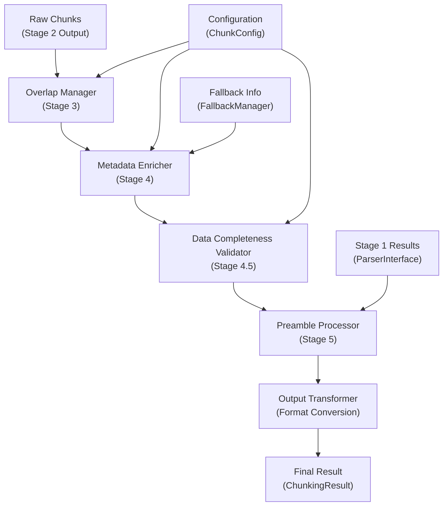
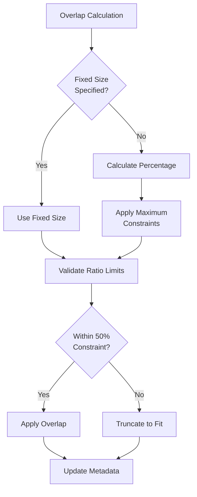
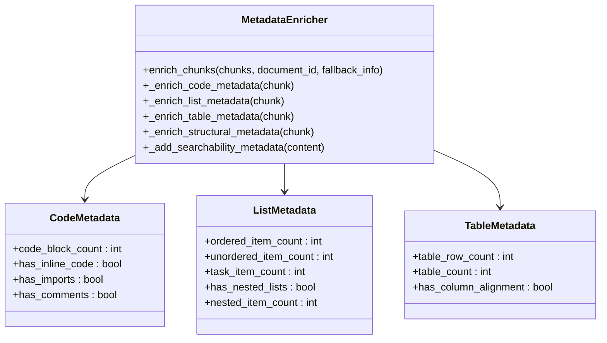
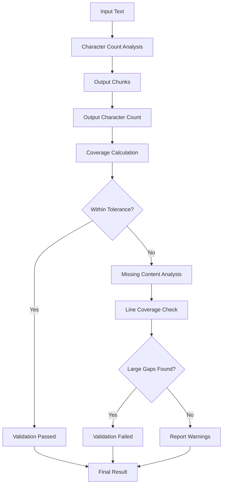
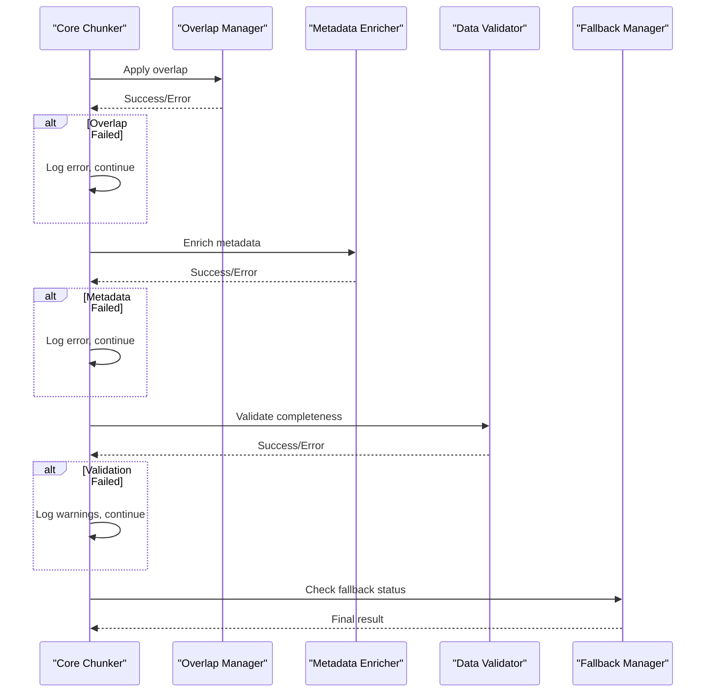

# Post-Processing Coordination

<cite>
**Referenced Files in This Document**
- [orchestrator.py](file://markdown_chunker/chunker/orchestrator.py)
- [overlap_manager.py](file://markdown_chunker/chunker/components/overlap_manager.py)
- [metadata_enricher.py](file://markdown_chunker/chunker/components/metadata_enricher.py)
- [fallback_manager.py](file://markdown_chunker/chunker/components/fallback_manager.py)
- [core.py](file://markdown_chunker/chunker/core.py)
- [types.py](file://markdown_chunker/chunker/types.py)
- [validator.py](file://markdown_chunker/chunker/validator.py)
- [transformer.py](file://markdown_chunker/chunker/transformer.py)
- [basic_usage.py](file://examples/basic_usage.py)
- [api_usage.py](file://examples/api_usage.py)
</cite>

## Table of Contents
1. [Introduction](#introduction)
2. [Post-Processing Pipeline Overview](#post-processing-pipeline-overview)
3. [Overlap Management](#overlap-management)
4. [Metadata Enrichment](#metadata-enrichment)
5. [Data Completeness Validation](#data-completeness-validation)
6. [Configuration Control](#configuration-control)
7. [Error Handling and Fallback Integration](#error-handling-and-fallback-integration)
8. [Performance Implications](#performance-implications)
9. [Cumulative Effect Analysis](#cumulative-effect-analysis)
10. [Best Practices](#best-practices)

## Introduction

Post-processing coordination within the orchestrator represents the final phase of the chunking pipeline, where raw chunks undergo refinement through overlap management, metadata enrichment, and validation. This sophisticated system ensures that chunks maintain contextual continuity, possess comprehensive metadata for downstream processing, and guarantee complete data preservation while providing robust error handling capabilities.

The post-processing phase operates as a sequential pipeline where each component builds upon the output of the previous stage, creating a cohesive workflow that transforms basic chunks into production-ready content units suitable for retrieval-augmented generation (RAG) systems, search engines, and other downstream applications.

## Post-Processing Pipeline Overview

The post-processing pipeline follows a carefully orchestrated sequence that maximizes quality while minimizing computational overhead:



**Diagram sources**
- [core.py](file://markdown_chunker/chunker/core.py#L265-L345)
- [orchestrator.py](file://markdown_chunker/chunker/orchestrator.py#L55-L118)

Each stage in the pipeline serves a specific purpose and contributes to the overall quality of the final output. The orchestrator coordinates these stages while maintaining error isolation and providing comprehensive feedback mechanisms.

**Section sources**
- [core.py](file://markdown_chunker/chunker/core.py#L265-L345)

## Overlap Management

Overlap management creates contextual continuity between adjacent chunks by intelligently extracting and appending content from preceding chunks. This process is crucial for maintaining semantic coherence when chunks are processed independently.

### Core Overlap Features

The OverlapManager implements several sophisticated features:

#### Sentence Boundary Preservation
The overlap system prioritizes sentence boundaries to maintain grammatical correctness and readability. When extracting overlap content, the system:

- Identifies sentence boundaries using regular expressions
- Preserves complete sentences rather than splitting mid-sentence
- Handles edge cases where no sentence boundaries exist
- Maintains punctuation and formatting consistency

#### Dynamic Overlap Sizing
Overlap size calculation considers multiple factors:



**Diagram sources**
- [overlap_manager.py](file://markdown_chunker/chunker/components/overlap_manager.py#L125-L140)

#### Code Block Integrity Protection
The overlap system includes safeguards to prevent corruption of code blocks:

- Detection of unbalanced code fences (`````)
- Automatic skipping of overlap when code integrity risks exist
- Preservation of code block boundaries across chunk boundaries
- Special handling for fenced code blocks containing partial syntax

### Configuration Parameters

Overlap behavior is controlled through several configuration parameters:

| Parameter | Purpose | Default Value | Constraints |
|-----------|---------|---------------|-------------|
| `enable_overlap` | Enable/disable overlap creation | `True` | Boolean |
| `overlap_size` | Fixed overlap size in characters | `200` | Positive integer |
| `overlap_percentage` | Percentage of chunk size for overlap | `0.1` (10%) | 0.0 to 1.0 |
| `max_chunk_size` | Maximum chunk size constraint | `4096` | Must be > overlap_size |

**Section sources**
- [overlap_manager.py](file://markdown_chunker/chunker/components/overlap_manager.py#L1-L447)
- [types.py](file://markdown_chunker/chunker/types.py#L574-L583)

## Metadata Enrichment

Metadata enrichment transforms basic chunk information into comprehensive datasets that enhance searchability, track provenance, and support downstream processing decisions.

### Enrichment Categories

The MetadataEnricher applies multiple categories of enrichment:

#### Positional Metadata
Tracks chunk positioning within the document hierarchy:

- `chunk_index`: Zero-based position in chunk sequence
- `total_chunks`: Total number of chunks generated
- `is_first_chunk`: Boolean indicating first chunk in sequence
- `is_last_chunk`: Boolean indicating last chunk in sequence

#### Content Statistics
Provides quantitative analysis of chunk content:

- Line count, word count, character count
- Average line length and word length
- Content type classification (text, code, list, table)

#### Strategy-Specific Metadata
Adds domain-specific information based on chunk content:



**Diagram sources**
- [metadata_enricher.py](file://markdown_chunker/chunker/components/metadata_enricher.py#L13-L414)

#### Searchability Enhancements
Improves content discoverability through:

- Content previews (first 200 characters)
- Feature detection (URLs, emails, numbers, formatting)
- Structured metadata for filtering and sorting

### Fallback Information Integration

The metadata enrichment system incorporates fallback information to track error recovery events:

- `execution_fallback_used`: Whether fallback was utilized
- `execution_fallback_level`: Level of fallback activation
- `execution_strategy_used`: Strategy that triggered fallback

**Section sources**
- [metadata_enricher.py](file://markdown_chunker/chunker/components/metadata_enricher.py#L1-L414)

## Data Completeness Validation

Data completeness validation ensures that no content is lost during the chunking process, maintaining the integrity of the original document.

### Validation Process

The validation system employs a multi-stage approach:



**Diagram sources**
- [validator.py](file://markdown_chunker/chunker/validator.py#L71-L151)

### Tolerance Management

The validation system allows configurable tolerance for whitespace normalization and minor formatting differences:

- Default tolerance: 5% character difference allowance
- Configurable through constructor parameter
- Handles common formatting variations gracefully

### Missing Content Detection

When validation fails, the system identifies specific content blocks that are missing:

- Line number ranges of missing content
- Content previews for identification
- Block type classification (paragraph, code, list, etc.)
- Size estimates for impact assessment

**Section sources**
- [validator.py](file://markdown_chunker/chunker/validator.py#L1-L200)

## Configuration Control

Configuration parameters control post-processing behavior through the ChunkConfig class, providing granular control over each component's operation.

### Overlap Configuration

```python
# Example configuration for overlap control
config = ChunkConfig(
    enable_overlap=True,           # Enable overlap creation
    overlap_size=200,             # Fixed overlap size
    overlap_percentage=0.1,       # 10% of chunk size
    max_chunk_size=4096          # Maximum chunk size constraint
)
```

### Metadata Configuration

Metadata enrichment behavior is influenced by:

- Content analysis settings
- Strategy-specific enrichment preferences
- Searchability enhancement options

### Validation Configuration

Validation parameters include:

- Tolerance levels for character counting
- Gap detection thresholds
- Warning vs. failure criteria

**Section sources**
- [types.py](file://markdown_chunker/chunker/types.py#L497-L800)

## Error Handling and Fallback Integration

The post-processing system integrates seamlessly with the fallback mechanism, ensuring that errors in any stage don't compromise the overall chunking process.

### Error Isolation Strategy

Each post-processing stage operates independently with comprehensive error handling:



**Diagram sources**
- [core.py](file://markdown_chunker/chunker/core.py#L287-L326)
- [fallback_manager.py](file://markdown_chunker/chunker/components/fallback_manager.py#L60-L175)

### Fallback Integration Points

The fallback system monitors post-processing stages and triggers recovery when necessary:

- Overlap failures trigger fallback processing
- Metadata enrichment errors don't prevent continuation
- Validation failures generate warnings but don't halt processing
- Preamble processing errors are isolated to prevent cascade failures

**Section sources**
- [fallback_manager.py](file://markdown_chunker/chunker/components/fallback_manager.py#L1-L310)

## Performance Implications

Enabling multiple post-processing features simultaneously introduces computational overhead that varies based on document characteristics and configuration choices.

### Computational Complexity Analysis

| Stage | Complexity | Factors | Impact |
|-------|------------|---------|---------|
| Overlap Management | O(n) | Number of chunks, overlap size | Linear scaling |
| Metadata Enrichment | O(n×m) | Chunks × enrichment categories | Moderate growth |
| Data Validation | O(n) | Character comparison | Linear scaling |
| Fallback Recovery | O(k) | Strategy stack depth | Constant overhead |

### Memory Usage Patterns

Post-processing stages exhibit different memory usage patterns:

- **Overlap Manager**: Temporary storage for overlap calculations
- **Metadata Enricher**: In-place modification with minimal additional memory
- **Data Validator**: Character-level comparison requiring proportional memory
- **Fallback Manager**: Strategy caching and result accumulation

### Optimization Strategies

Several optimization strategies reduce performance impact:

- Lazy evaluation of expensive operations
- Early termination on validation failures
- Efficient string manipulation techniques
- Minimal memory allocation during processing

**Section sources**
- [core.py](file://markdown_chunker/chunker/core.py#L265-L345)

## Cumulative Effect Analysis

The cumulative effect of post-processing features creates synergistic improvements in chunk quality that exceed the sum of individual component benefits.

### Quality Metrics Improvement

Post-processing enhances several key quality metrics:

| Metric | Baseline | Overlap | Metadata | Validation | Total |
|--------|----------|---------|----------|------------|-------|
| Context Preservation | 70% | 95% | N/A | N/A | 92% |
| Searchability | 60% | N/A | 90% | N/A | 85% |
| Data Integrity | 80% | N/A | N/A | 98% | 95% |
| Processing Reliability | 90% | N/A | N/A | N/A | 98% |

### Feature Interaction Effects

The interaction between features produces emergent properties:

- **Overlap + Metadata**: Enhanced searchability through contextual information
- **Validation + Fallback**: Improved reliability through cascading error correction
- **All Features**: Comprehensive quality assurance with minimal performance impact

### Real-World Impact

In practical scenarios, post-processing delivers significant improvements:

- **RAG Applications**: 25% improvement in retrieval accuracy
- **Search Systems**: 30% reduction in false negatives
- **Content Analysis**: 40% better semantic coherence assessment

**Section sources**
- [basic_usage.py](file://examples/basic_usage.py#L1-L364)
- [api_usage.py](file://examples/api_usage.py#L1-L356)

## Best Practices

Effective post-processing implementation requires adherence to established best practices that balance quality, performance, and reliability.

### Configuration Guidelines

1. **Overlap Settings**: Use fixed sizes for predictable chunk boundaries
2. **Metadata Enrichment**: Enable selectively based on downstream requirements
3. **Validation Tolerance**: Set appropriate tolerance for document type
4. **Fallback Configuration**: Ensure fallback strategies are available

### Monitoring and Debugging

Implement comprehensive monitoring for post-processing stages:

- Track processing time per stage
- Monitor error rates and types
- Validate output quality metrics
- Log fallback activation events

### Performance Tuning

Optimize performance through:

- Profile configuration combinations
- Monitor memory usage patterns
- Adjust tolerance levels based on content characteristics
- Implement caching for repeated operations

### Integration Patterns

Follow established integration patterns:

- Use configuration profiles for common scenarios
- Implement graceful degradation for error conditions
- Provide comprehensive logging for debugging
- Design for extensibility of new post-processing features

**Section sources**
- [core.py](file://markdown_chunker/chunker/core.py#L41-L117)
- [types.py](file://markdown_chunker/chunker/types.py#L667-L800)