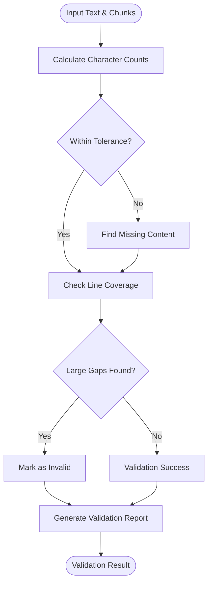

# Validation Framework

<cite>
**Referenced Files in This Document**
- [markdown_chunker/chunker/validator.py](file://markdown_chunker/chunker/validator.py)
- [markdown_chunker/api/validator.py](file://markdown_chunker/api/validator.py)
- [markdown_chunker/chunker/errors.py](file://markdown_chunker/chunker/errors.py)
- [markdown_chunker/chunker/components/fallback_manager.py](file://markdown_chunker/chunker/components/fallback_manager.py)
- [tests/api/test_validator.py](file://tests/api/test_validator.py)
- [tests/chunker/test_data_completeness_validator.py](file://tests/chunker/test_data_completeness_validator.py)
- [tests/chunker/test_idempotence_property.py](file://tests/chunker/test_idempotence_property.py)
- [tests/chunker/test_no_empty_chunks_property.py](file://tests/chunker/test_no_empty_chunks_property.py)
- [tests/chunker/test_header_path_property.py](file://tests/chunker/test_header_path_property.py)
- [tests/chunker/test_fallback_manager_integration.py](file://tests/chunker/test_fallback_manager_integration.py)
</cite>

## Table of Contents
1. [Introduction](#introduction)
2. [Framework Architecture](#framework-architecture)
3. [Core Validation Components](#core-validation-components)
4. [Data Completeness Validation](#data-completeness-validation)
5. [API Request Validation](#api-request-validation)
6. [Validation Strictness Configuration](#validation-strictness-configuration)
7. [Error Handling and Reporting](#error-handling-and-reporting)
8. [Property-Based Testing](#property-based-testing)
9. [Fallback Management](#fallback-management)
10. [Best Practices](#best-practices)
11. [Performance Considerations](#performance-considerations)
12. [Troubleshooting Guide](#troubleshooting-guide)

## Introduction

The validation framework in the Dify Markdown Chunker provides comprehensive quality assurance for chunking operations, ensuring data integrity, content preservation, and system reliability. This framework operates at multiple levels, from API request validation to post-processing quality checks, with sophisticated error handling and recovery mechanisms.

The validation system is built around three core principles:
- **Data Integrity**: Ensuring no content is lost during chunking
- **Quality Assurance**: Maintaining consistent chunk characteristics
- **Reliability**: Providing graceful degradation through fallback mechanisms

## Framework Architecture

The validation framework consists of several interconnected components that work together to ensure chunk quality and integrity:


**Diagram sources**
- [markdown_chunker/api/validator.py](file://markdown_chunker/api/validator.py#L12-L321)
- [markdown_chunker/chunker/validator.py](file://markdown_chunker/chunker/validator.py#L53-L354)
- [markdown_chunker/chunker/components/fallback_manager.py](file://markdown_chunker/chunker/components/fallback_manager.py#L31-L310)

## Core Validation Components

### Validator Class Hierarchy

The validation framework implements a hierarchical error system with specific exceptions for different validation scenarios:


**Diagram sources**
- [markdown_chunker/chunker/errors.py](file://markdown_chunker/chunker/errors.py#L11-L210)

**Section sources**
- [markdown_chunker/chunker/errors.py](file://markdown_chunker/chunker/errors.py#L1-L210)

## Data Completeness Validation

The Data Completeness Validator ensures that no content is lost during the chunking process, providing comprehensive checks for content preservation and integrity.

### Validation Suite

The validator performs multiple checks to ensure data integrity:

| Validation Type | Purpose | Implementation |
|----------------|---------|----------------|
| Character Count | Verifies total character preservation | Compares input vs output character counts with tolerance |
| Content Blocks | Identifies missing content regions | Analyzes line-by-line content presence |
| Line Coverage | Detects gaps in processed content | Tracks line ranges across all chunks |
| Block Type Detection | Classifies missing content | Heuristic analysis of content structure |

### Core Validation Process



**Diagram sources**
- [markdown_chunker/chunker/validator.py](file://markdown_chunker/chunker/validator.py#L71-L151)

### Validation Result Structure

The validation system produces detailed reports through the `ValidationResult` dataclass:


**Diagram sources**
- [markdown_chunker/chunker/validator.py](file://markdown_chunker/chunker/validator.py#L25-L51)

**Section sources**
- [markdown_chunker/chunker/validator.py](file://markdown_chunker/chunker/validator.py#L53-L354)
- [tests/chunker/test_data_completeness_validator.py](file://tests/chunker/test_data_completeness_validator.py#L1-L419)

## API Request Validation

The API Validator ensures that incoming requests meet system requirements and constraints before processing begins.

### Validation Rules

The API validator enforces comprehensive constraints:

| Field | Validation Rule | Error Message |
|-------|----------------|---------------|
| Content Size | 1 byte ≤ size ≤ 10MB | Content size limits |
| Content Type | Must be string | Type validation |
| Content Whitespace | Cannot be empty/whitespace-only | Content validation |
| Chunk Sizes | min_chunk_size ≤ max_chunk_size ≤ 100KB | Size relationship |
| Overlap Size | ≥ 0 | Non-negative constraint |
| Threshold Values | 0.0 ≤ value ≤ 1.0 | Range validation |
| Strategy | Must be valid strategy name | Strategy validation |

### Configuration Validation

The validator comprehensively validates configuration parameters:


**Diagram sources**
- [markdown_chunker/api/validator.py](file://markdown_chunker/api/validator.py#L50-L73)

**Section sources**
- [markdown_chunker/api/validator.py](file://markdown_chunker/api/validator.py#L12-L321)
- [tests/api/test_validator.py](file://tests/api/test_validator.py#L1-L251)

## Validation Strictness Configuration

The validation framework supports configurable strictness levels to balance quality assurance with system resilience.

### Tolerance Configuration

The Data Completeness Validator allows customization of acceptable character loss:

```python
# Default tolerance (5%)
validator = DataCompletenessValidator(tolerance=0.05)

# More strict validation
validator = DataCompletenessValidator(tolerance=0.01)

# More lenient validation  
validator = DataCompletenessValidator(tolerance=0.10)
```

### Strict Mode Operation

The `raise_if_invalid` method provides strict validation enforcement:


**Diagram sources**
- [markdown_chunker/chunker/validator.py](file://markdown_chunker/chunker/validator.py#L314-L354)

**Section sources**
- [markdown_chunker/chunker/validator.py](file://markdown_chunker/chunker/validator.py#L61-L354)

## Error Handling and Reporting

The validation framework provides comprehensive error reporting with structured information for debugging and troubleshooting.

### Error Classification

Validation errors are categorized by severity and type:

| Error Type | Severity | Trigger Condition | Recovery Action |
|------------|----------|-------------------|-----------------|
| DataLossError | Critical | Significant content loss | Fallback activation |
| MissingContentError | Critical | Specific content blocks missing | Content restoration |
| IncompleteCoverageError | Warning | Large gaps in line coverage | Coverage improvement |
| ValidationError | General | Invalid chunk structure | Structure correction |
| StrategyError | Strategy-specific | Strategy execution failure | Strategy switching |

### Debug Information Structure

The framework provides detailed debugging information:


**Diagram sources**
- [markdown_chunker/parser/validation.py](file://markdown_chunker/parser/validation.py#L604-L724)

**Section sources**
- [markdown_chunker/chunker/errors.py](file://markdown_chunker/chunker/errors.py#L11-L210)

## Property-Based Testing

The validation framework employs Hypothesis-based property testing to ensure correctness guarantees across diverse input scenarios.

### Property Testing Strategy

Property-based testing validates fundamental guarantees that must hold true for all valid inputs:


**Diagram sources**
- [tests/chunker/test_idempotence_property.py](file://tests/chunker/test_idempotence_property.py#L1-L368)
- [tests/chunker/test_no_empty_chunks_property.py](file://tests/chunker/test_no_empty_chunks_property.py#L1-L343)
- [tests/chunker/test_header_path_property.py](file://tests/chunker/test_header_path_property.py#L1-L412)

### Property Examples

#### Idempotence Property
Ensures that chunking the same input twice produces identical results:

```python
@given(random_markdown())
def test_property_idempotence(markdown_text):
    chunker = MarkdownChunker()
    chunks1 = chunker.chunk(markdown_text)
    chunks2 = chunker.chunk(markdown_text)
    assert chunks_are_identical(chunks1, chunks2)
```

#### No Empty Chunks Property
Guarantees that non-empty input never produces empty chunks:

```python
@given(non_empty_markdown())
def test_property_no_empty_chunks(markdown_text):
    chunker = MarkdownChunker()
    chunks = chunker.chunk(markdown_text)
    for chunk in chunks:
        assert chunk.content.strip(), "Empty chunks are not allowed"
```

**Section sources**
- [tests/chunker/test_idempotence_property.py](file://tests/chunker/test_idempotence_property.py#L1-L368)
- [tests/chunker/test_no_empty_chunks_property.py](file://tests/chunker/test_no_empty_chunks_property.py#L1-L343)
- [tests/chunker/test_header_path_property.py](file://tests/chunker/test_header_path_property.py#L1-L412)

## Fallback Management

The Fallback Manager provides a robust error recovery system that ensures chunking always succeeds, even when primary strategies fail.

### Fallback Chain Architecture


**Diagram sources**
- [markdown_chunker/chunker/components/fallback_manager.py](file://markdown_chunker/chunker/components/fallback_manager.py#L60-L165)

### Fallback Levels

The system implements three distinct fallback levels:

| Level | Strategy | Purpose | Reliability |
|-------|----------|---------|-------------|
| Primary | Selected Strategy | Optimal chunking for content type | Variable |
| Structural | Structural Strategy | Handles structural content | High |
| Sentences | Sentences Strategy | Universal fallback | Highest |

### Fallback Integration

The fallback system integrates seamlessly with validation:


**Diagram sources**
- [markdown_chunker/chunker/components/fallback_manager.py](file://markdown_chunker/chunker/components/fallback_manager.py#L60-L165)

**Section sources**
- [markdown_chunker/chunker/components/fallback_manager.py](file://markdown_chunker/chunker/components/fallback_manager.py#L31-L310)
- [tests/chunker/test_fallback_manager_integration.py](file://tests/chunker/test_fallback_manager_integration.py#L1-L184)

## Best Practices

### Extending Validation Framework

To add custom validation rules:

1. **Define Custom Error Types**: Extend the error hierarchy for specific validation needs
2. **Implement Validation Logic**: Create validation functions that return structured results
3. **Integrate with Existing Framework**: Ensure compatibility with error reporting and fallback systems

### Balancing Thoroughness with Performance

Key considerations for validation performance:

- **Tolerance Settings**: Adjust tolerance levels based on performance requirements
- **Selective Validation**: Apply stricter validation only for critical operations
- **Caching Results**: Cache validation results for repeated operations
- **Lazy Evaluation**: Defer expensive validations until necessary

### Custom Rule Implementation

Example pattern for extending validation:

```python
class CustomValidator:
    def __init__(self, strict_mode=False):
        self.strict_mode = strict_mode
    
    def validate_custom_rule(self, content, chunks):
        # Custom validation logic
        if self.strict_mode and not meets_custom_criteria(content, chunks):
            raise CustomValidationError("Custom rule violated")
        
        return ValidationResult(is_valid=True, ...)
```

## Performance Considerations

### Validation Performance Metrics

The validation framework is optimized for production use:

| Operation | Complexity | Typical Time | Memory Usage |
|-----------|------------|--------------|--------------|
| Character Count | O(n) | < 1ms | O(1) |
| Line Coverage | O(n log n) | < 5ms | O(n) |
| Missing Content | O(n²) worst case | < 100ms | O(n) |
| API Validation | O(k) | < 2ms | O(k) where k = config keys |

### Optimization Strategies

- **Early Termination**: Stop validation when critical failures are detected
- **Incremental Validation**: Validate chunks as they're generated
- **Parallel Processing**: Leverage multi-core systems for independent validations
- **Memory Management**: Use generators for large content processing

## Troubleshooting Guide

### Common Validation Issues

#### Data Loss Detected
**Symptoms**: `DataLossError` or `MissingContentError` exceptions
**Causes**: 
- Strategy selection mismatch
- Content preprocessing issues
- Encoding problems

**Resolution**:
1. Enable fallback mode
2. Check content encoding
3. Verify strategy compatibility

#### Validation Failures
**Symptoms**: Validation results show `is_valid = False`
**Causes**:
- Content size limits exceeded
- Invalid configuration parameters
- Structural content issues

**Resolution**:
1. Review validation warnings
2. Adjust configuration parameters
3. Check content structure

#### Performance Issues
**Symptoms**: Slow validation response times
**Causes**:
- Large content volumes
- Complex content structures
- Inefficient validation logic

**Resolution**:
1. Increase tolerance levels
2. Use selective validation
3. Optimize content preprocessing

### Debugging Validation Errors

Enable detailed logging for validation debugging:

```python
import logging
logging.getLogger('markdown_chunker.chunker.validator').setLevel(logging.DEBUG)
```

Monitor validation metrics through the `ValidationResult` structure to identify patterns and optimize configurations.

**Section sources**
- [markdown_chunker/chunker/validator.py](file://markdown_chunker/chunker/validator.py#L314-L354)
- [markdown_chunker/chunker/errors.py](file://markdown_chunker/chunker/errors.py#L11-L210)