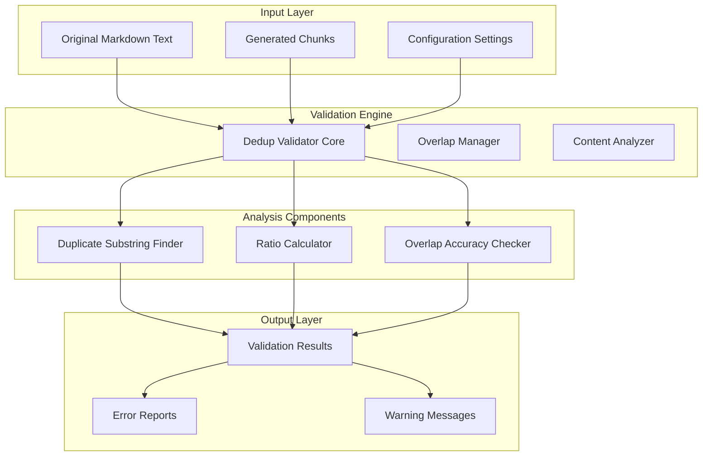
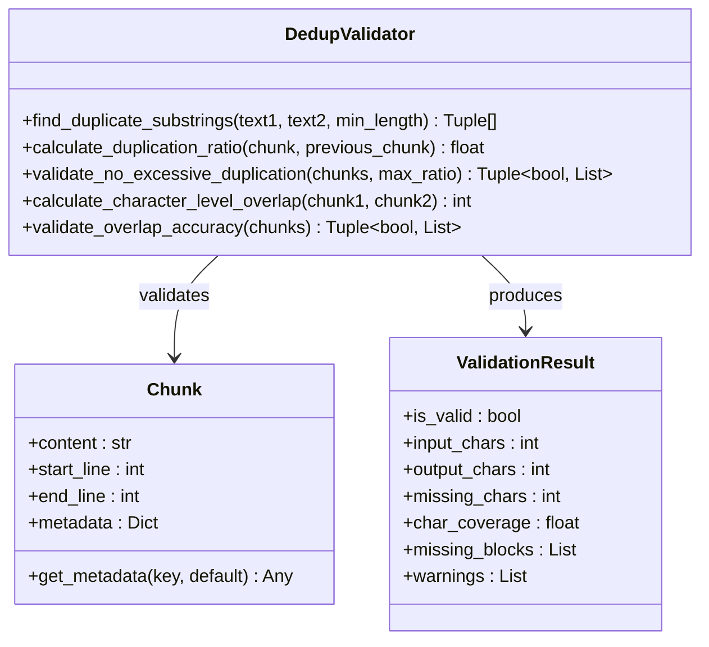
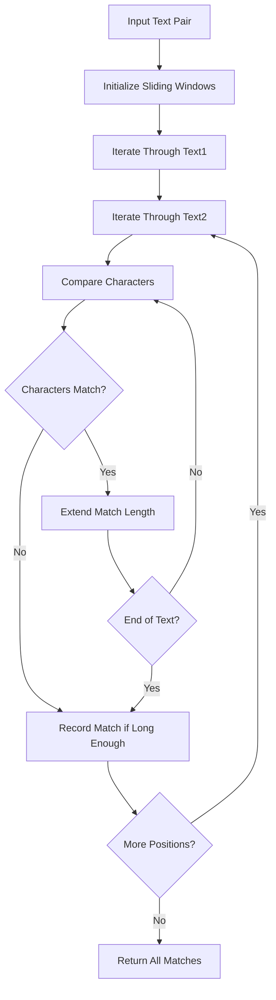
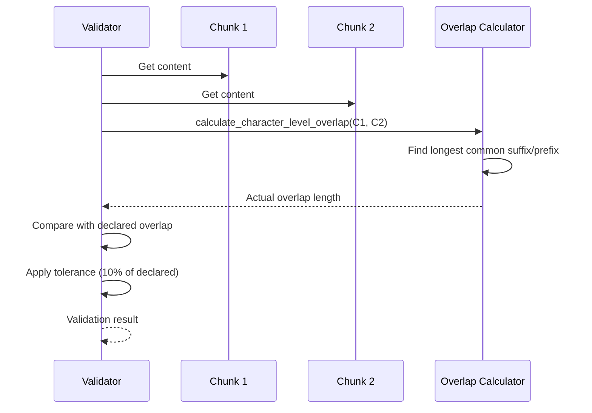
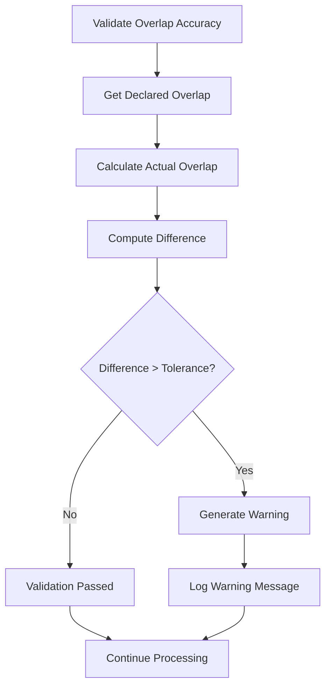
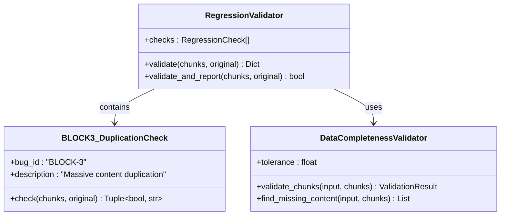
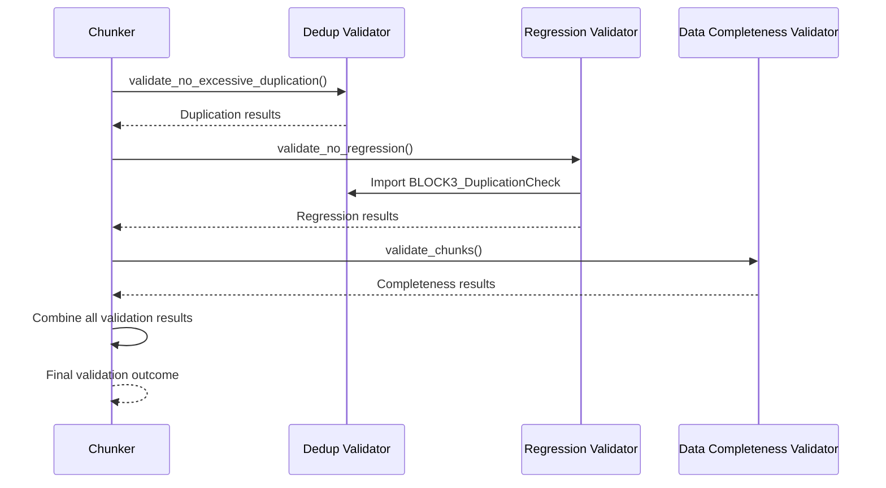
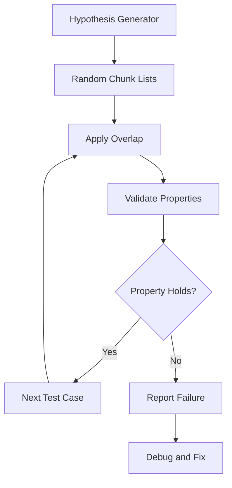

# Dedup Validator

<cite>
**Referenced Files in This Document**
- [dedup_validator.py](file://markdown_chunker/chunker/dedup_validator.py)
- [regression_validator.py](file://markdown_chunker/chunker/regression_validator.py)
- [validator.py](file://markdown_chunker/chunker/validator.py)
- [types.py](file://markdown_chunker/chunker/types.py)
- [errors.py](file://markdown_chunker/chunker/errors.py)
- [test_data_completeness_validator.py](file://tests/chunker/test_data_completeness_validator.py)
- [test_bug_fixes.py](file://tests/chunker/test_bug_fixes.py)
- [test_overlap_properties.py](file://tests/chunker/test_overlap_properties.py)
- [basic_usage.py](file://examples/basic_usage.py)
</cite>

## Table of Contents
1. [Introduction](#introduction)
2. [System Architecture](#system-architecture)
3. [Core Components](#core-components)
4. [Validation Strategies](#validation-strategies)
5. [Overlap Management](#overlap-management)
6. [Integration with Validation Pipeline](#integration-with-validation-pipeline)
7. [Testing and Quality Assurance](#testing-and-quality-assurance)
8. [Performance Considerations](#performance-considerations)
9. [Troubleshooting Guide](#troubleshooting-guide)
10. [Best Practices](#best-practices)

## Introduction

The Dedup Validator is a sophisticated component of the Markdown Chunker system designed to detect and prevent unintentional content duplication within and between chunks. This validator addresses BLOCK-3 from the bug report, which identified massive content duplication as a critical issue affecting chunk quality and downstream applications like Retrieval-Augmented Generation (RAG) systems.

The validator operates on multiple levels:
- **Internal Duplication Detection**: Identifies repeated content within individual chunks
- **External Duplication Detection**: Finds duplicate content between consecutive chunks beyond intentional overlap
- **Character-Level Overlap Validation**: Ensures declared overlap matches actual content overlap
- **Regulatory Compliance**: Prevents regression of previously fixed duplication issues

## System Architecture

The Dedup Validator system follows a layered architecture that integrates seamlessly with the broader chunking pipeline:

**Diagram sources**
- [dedup_validator.py](file://markdown_chunker/chunker/dedup_validator.py#L1-L234)
- [regression_validator.py](file://markdown_chunker/chunker/regression_validator.py#L230-L314)

**Section sources**
- [dedup_validator.py](file://markdown_chunker/chunker/dedup_validator.py#L1-L234)
- [regression_validator.py](file://markdown_chunker/chunker/regression_validator.py#L1-L314)

## Core Components

### Deduplication Validator Core

The main validation engine provides comprehensive duplication detection capabilities:

**Diagram sources**
- [dedup_validator.py](file://markdown_chunker/chunker/dedup_validator.py#L13-L234)
- [types.py](file://markdown_chunker/chunker/types.py#L36-L210)

### Sliding Window Algorithm

The core duplication detection uses an efficient sliding window approach:

**Diagram sources**
- [dedup_validator.py](file://markdown_chunker/chunker/dedup_validator.py#L13-L50)

**Section sources**
- [dedup_validator.py](file://markdown_chunker/chunker/dedup_validator.py#L13-L123)

## Validation Strategies

### Internal Duplication Detection

The validator identifies repeated content within individual chunks by analyzing paragraph-level repetition:

| Strategy | Threshold | Optimization | Purpose |
|----------|-----------|--------------|---------|
| Paragraph Analysis | 20+ characters | Skip short paragraphs | Detect repeated content blocks |
| Character Counting | Cumulative | Early termination | Measure duplication intensity |
| Ratio Calculation | 0.0-1.0 | Clamped to 100% | Standardize measurement |

### External Duplication Detection

Cross-chunk duplication detection focuses on content beyond intentional overlap regions:

| Parameter | Value | Description |
|-----------|-------|-------------|
| Minimum Length | 50 characters | Threshold for substring detection |
| Tolerance | +10 characters | Allowance for overlap boundary |
| Known Overlap | From metadata | Previously declared overlap size |

### Character-Level Overlap Validation

Ensures declared overlap accurately reflects actual content overlap:

**Diagram sources**
- [dedup_validator.py](file://markdown_chunker/chunker/dedup_validator.py#L161-L190)

**Section sources**
- [dedup_validator.py](file://markdown_chunker/chunker/dedup_validator.py#L161-L234)

## Overlap Management

### Overlap Configuration

The system supports flexible overlap configuration with multiple validation mechanisms:

| Setting | Default | Range | Purpose |
|---------|---------|-------|---------|
| `overlap_size` | 200 chars | 0-4096 | Fixed overlap size |
| `overlap_percentage` | 0.1 (10%) | 0.0-1.0 | Percentage-based overlap |
| `enable_overlap` | True | Boolean | Enable/disable overlap |
| `max_duplication_ratio` | 0.3 (30%) | 0.0-1.0 | Duplication tolerance |

### Overlap Accuracy Validation

The overlap accuracy checker ensures metadata consistency:

**Diagram sources**
- [dedup_validator.py](file://markdown_chunker/chunker/dedup_validator.py#L193-L234)

**Section sources**
- [dedup_validator.py](file://markdown_chunker/chunker/dedup_validator.py#L193-L234)
- [test_overlap_properties.py](file://tests/chunker/test_overlap_properties.py#L67-L200)

## Integration with Validation Pipeline

### Regression Prevention System

The Dedup Validator integrates with the broader regression prevention system:

**Diagram sources**
- [regression_validator.py](file://markdown_chunker/chunker/regression_validator.py#L131-L152)
- [validator.py](file://markdown_chunker/chunker/validator.py#L53-L354)

### Validation Workflow

The integrated validation follows a comprehensive workflow:

**Diagram sources**
- [regression_validator.py](file://markdown_chunker/chunker/regression_validator.py#L230-L296)
- [validator.py](file://markdown_chunker/chunker/validator.py#L71-L152)

**Section sources**
- [regression_validator.py](file://markdown_chunker/chunker/regression_validator.py#L131-L152)
- [validator.py](file://markdown_chunker/chunker/validator.py#L53-L152)

## Testing and Quality Assurance

### Unit Testing Framework

The validator includes comprehensive unit tests covering various scenarios:

| Test Category | Coverage | Purpose |
|---------------|----------|---------|
| Internal Duplication | Paragraph-level detection | Verify repetition detection |
| External Duplication | Cross-chunk comparison | Test overlap boundary handling |
| Overlap Accuracy | Character-level validation | Ensure metadata consistency |
| Edge Cases | Boundary conditions | Handle extreme scenarios |

### Property-Based Testing

The system employs property-based testing for robust validation:

**Diagram sources**
- [test_overlap_properties.py](file://tests/chunker/test_overlap_properties.py#L67-L200)

### Regression Test Suite

The regression test suite ensures continued correctness:

| Test Class | Focus Area | Validation Criteria |
|------------|------------|-------------------|
| `TestBLOCK3_ContentDuplication` | Duplication detection | Excessive duplication identification |
| `TestBugFixes` | Historical bugs | Regression prevention |
| `TestOverlapProperties` | Overlap behavior | Consistency validation |

**Section sources**
- [test_data_completeness_validator.py](file://tests/chunker/test_data_completeness_validator.py#L1-L419)
- [test_bug_fixes.py](file://tests/chunker/test_bug_fixes.py#L123-L164)
- [test_overlap_properties.py](file://tests/chunker/test_overlap_properties.py#L1-L200)

## Performance Considerations

### Algorithmic Complexity

The deduplication algorithms are optimized for practical performance:

| Operation | Time Complexity | Space Complexity | Optimization |
|-----------|----------------|------------------|--------------|
| Substring Finding | O(n×m×k) | O(k) | Sliding window with early termination |
| Ratio Calculation | O(n) | O(1) | Single-pass character counting |
| Overlap Detection | O(min(n,m)) | O(1) | Linear scan with character comparison |

### Memory Management

The validator implements several memory optimization strategies:

- **Lazy Evaluation**: Processes content incrementally
- **Early Termination**: Stops when duplication threshold exceeded
- **Streaming Support**: Handles large documents efficiently
- **Mock Object Handling**: Graceful degradation in test environments

### Scalability Features

The system scales effectively with document size:

- **Configurable Thresholds**: Adjust sensitivity based on document characteristics
- **Parallel Processing**: Supports concurrent validation of independent chunks
- **Resource Monitoring**: Tracks memory and CPU usage during validation

## Troubleshooting Guide

### Common Issues and Solutions

| Issue | Symptoms | Solution |
|-------|----------|----------|
| High Duplication Ratios | Validation failures, warnings | Adjust `max_duplication_ratio` or review chunking strategy |
| Overlap Mismatches | Accuracy validation errors | Verify overlap metadata and adjust tolerance |
| Performance Degradation | Slow validation on large documents | Increase minimum substring length or reduce overlap size |

### Debugging Techniques

For diagnosing validation issues:

1. **Enable Verbose Logging**: Set appropriate log levels for detailed output
2. **Isolate Problematic Chunks**: Test individual chunks separately
3. **Review Metadata**: Check overlap_size and other relevant metadata
4. **Compare Content**: Manually inspect suspected duplicate content

### Error Interpretation

Understanding validation error messages:

- **"Chunk X has Y% duplication"**: Indicates excessive internal or cross-chunk duplication
- **"Declared overlap=Z, actual overlap=W"**: Overlap metadata inconsistency
- **"Excessive duplication: N blocks appear in >M consecutive chunks"**: Structural duplication issues

**Section sources**
- [dedup_validator.py](file://markdown_chunker/chunker/dedup_validator.py#L125-L158)
- [regression_validator.py](file://markdown_chunker/chunker/regression_validator.py#L140-L151)

## Best Practices

### Configuration Guidelines

Optimal configuration depends on document characteristics:

- **Code-heavy Documents**: Use lower duplication ratios (20-30%)
- **Text-heavy Documents**: Allow higher ratios (30-40%)
- **RAG Applications**: Strict validation (≤25%) for downstream quality
- **General Use**: Moderate validation (30-35%)

### Integration Recommendations

For effective integration:

1. **Combine Validators**: Use Dedup Validator alongside Data Completeness Validator
2. **Monitor Performance**: Track validation overhead in production
3. **Adjust Tolerances**: Fine-tune based on domain requirements
4. **Regular Testing**: Maintain regression test coverage

### Maintenance Procedures

Regular maintenance tasks:

- **Update Thresholds**: Adjust based on evolving document patterns
- **Review Logs**: Monitor validation results for trends
- **Performance Tuning**: Optimize for changing workload characteristics
- **Documentation Updates**: Keep validation criteria documentation current

**Section sources**
- [dedup_validator.py](file://markdown_chunker/chunker/dedup_validator.py#L125-L158)
- [basic_usage.py](file://examples/basic_usage.py#L1-L364)