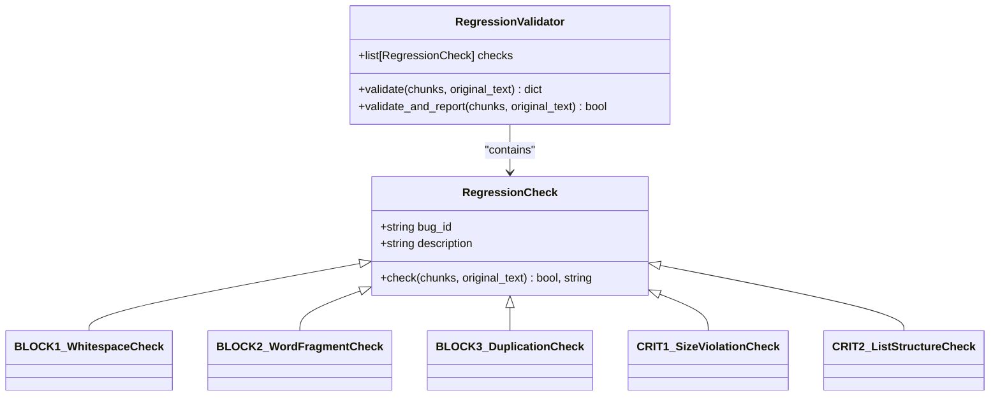
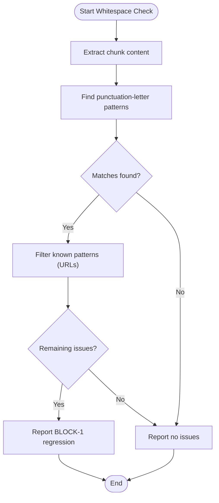
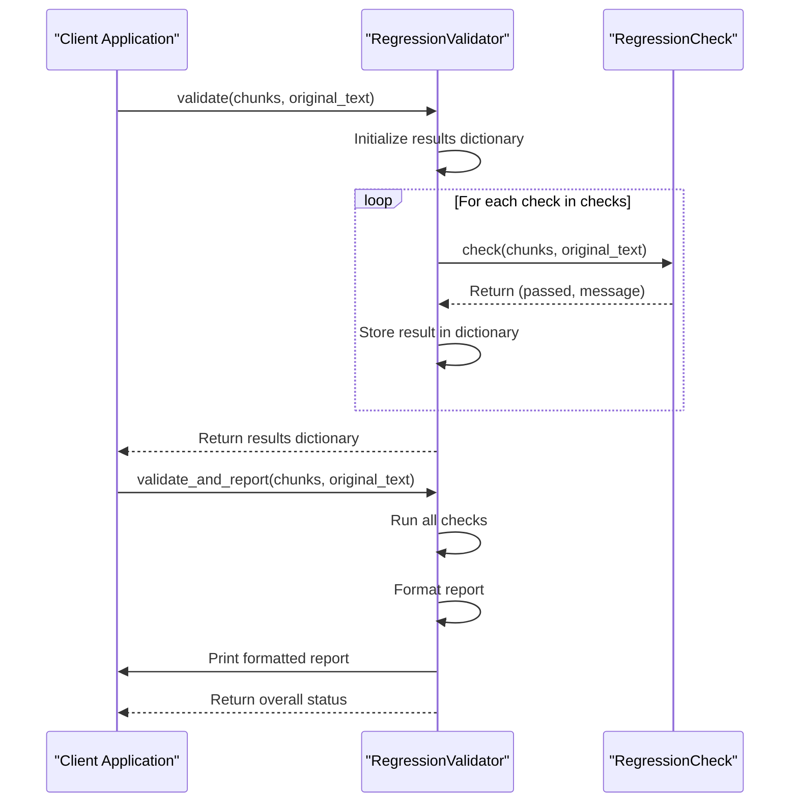
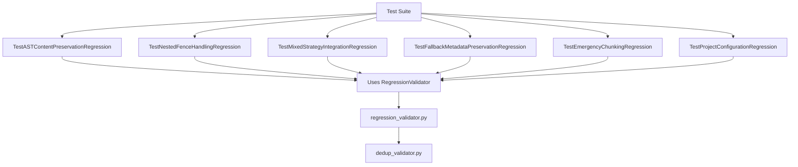

# Regression Validator

<cite>
**Referenced Files in This Document**   
- [regression_validator.py](file://markdown_chunker/chunker/regression_validator.py)
- [dedup_validator.py](file://markdown_chunker/chunker/dedup_validator.py)
- [test_regression_prevention.py](file://tests/chunker/test_regression_prevention.py)
- [test_critical_fixes.py](file://tests/regression/test_critical_fixes.py)
- [test_all_regression_prevention.py](file://tests/parser/root_tests/test_all_regression_prevention.py)
- [test_regression_prevention.py](file://tests/parser/test_regression_prevention.py)
</cite>

## Table of Contents
1. [Introduction](#introduction)
2. [Core Components](#core-components)
3. [Regression Check Types](#regression-check-types)
4. [Validation Workflow](#validation-workflow)
5. [Integration with Testing Framework](#integration-with-testing-framework)
6. [Error Handling and Reporting](#error-handling-and-reporting)
7. [Performance Considerations](#performance-considerations)
8. [Conclusion](#conclusion)

## Introduction

The Regression Validator is a critical component of the Markdown Chunker system designed to prevent the recurrence of previously fixed bugs. It operates as a quality assurance mechanism that validates chunking output against known problematic patterns, ensuring that critical fixes remain effective across code changes. The validator is integrated into the CI/CD pipeline and runs automatically to catch regressions before they reach production.

This documentation provides a comprehensive overview of the Regression Validator's architecture, functionality, and integration within the broader testing ecosystem. The system is designed to be extensible, allowing new regression checks to be added as the codebase evolves and new bug patterns are identified.

**Section sources**
- [regression_validator.py](file://markdown_chunker/chunker/regression_validator.py#L1-L314)
- [test_regression_prevention.py](file://tests/chunker/test_regression_prevention.py#L1-L562)

## Core Components

The Regression Validator consists of several key components that work together to detect and prevent regressions. At its core is the `RegressionValidator` class, which orchestrates the execution of individual regression checks. Each check is implemented as a subclass of the `RegressionCheck` base class, following the template method pattern to ensure consistency in implementation.

The validator operates on chunked output and the original markdown text, comparing them against predefined patterns that indicate potential regressions. It leverages regular expressions for pattern matching and integrates with other validation components like the deduplication validator to provide comprehensive coverage.

**Diagram sources**
- [regression_validator.py](file://markdown_chunker/chunker/regression_validator.py#L15-L296)

**Section sources**
- [regression_validator.py](file://markdown_chunker/chunker/regression_validator.py#L1-L314)

## Regression Check Types

The Regression Validator implements five distinct check types, each targeting a specific category of regression. These checks are designed to catch the most critical issues that have been previously identified and fixed in the codebase.

### Whitespace Preservation Check

The `BLOCK1_WhitespaceCheck` validates that text concatenation does not occur without proper whitespace preservation. This check specifically targets the issue where punctuation is directly followed by letters without intervening spaces, which can occur in languages like Russian or English. The validator uses regular expressions to detect patterns like "продукта.Нет" or "Достижения:мы" that indicate missing spaces after punctuation.

**Diagram sources**
- [regression_validator.py](file://markdown_chunker/chunker/regression_validator.py#L36-L65)

### Word Fragment Check

The `BLOCK2_WordFragmentCheck` ensures that chunks do not start or end with word fragments. This prevents issues where words are split across chunk boundaries, creating incomplete or nonsensical text segments. The check analyzes the first word of each chunk and compares it against a list of common short words, flagging potential fragments that are not part of this whitelist.

### Duplication Check

The `BLOCK3_DuplicationCheck` verifies that there is no excessive content duplication within or between chunks. This check imports functionality from the `dedup_validator` module to analyze duplication ratios, allowing for a higher threshold (60%) to accommodate intentional overlap scenarios while still catching problematic duplication patterns.

### Size Constraint Check

The `CRIT1_SizeViolationCheck` validates that non-atomic chunks respect the maximum size limits. It examines each chunk's content length against the default 4096 character limit, checking whether oversized chunks are properly marked as such. This prevents violations of the max chunk size constraint that could impact downstream processing systems.

### List Structure Check

The `CRIT2_ListStructureCheck` ensures that list structures are preserved in the chunked output. It analyzes the original markdown for unordered, ordered, and task lists, then verifies that these structures appear in the combined chunk content. This prevents the complete loss of list formatting that could degrade the readability and semantic meaning of the content.

**Section sources**
- [regression_validator.py](file://markdown_chunker/chunker/regression_validator.py#L36-L227)

## Validation Workflow

The validation process follows a systematic workflow that ensures comprehensive coverage of potential regression issues. When invoked, the `RegressionValidator` executes all registered checks in sequence, collecting results for each one.

**Diagram sources**
- [regression_validator.py](file://markdown_chunker/chunker/regression_validator.py#L230-L296)

The workflow begins with the `validate` method, which returns a dictionary mapping bug IDs to their respective pass/fail status and message. For interactive use, the `validate_and_report` method provides a human-readable console output with a summary of all check results. This dual interface supports both automated testing and manual verification scenarios.

The `validate_no_regression` convenience function provides a simple boolean result, returning `True` only if all checks pass. This is particularly useful in test assertions and CI/CD pipelines where a simple pass/fail outcome is required.

**Section sources**
- [regression_validator.py](file://markdown_chunker/chunker/regression_validator.py#L230-L313)

## Integration with Testing Framework

The Regression Validator is deeply integrated with the project's comprehensive testing framework, which includes both unit tests and property-based testing. The validator is used in multiple test suites to ensure that critical fixes remain effective across different scenarios.

**Diagram sources**
- [test_regression_prevention.py](file://tests/chunker/test_regression_prevention.py#L15-L562)
- [regression_validator.py](file://markdown_chunker/chunker/regression_validator.py#L1-L314)

The integration includes specialized test classes such as `TestASTContentPreservationRegression` and `TestNestedFenceHandlingRegression`, each designed to prevent specific types of regressions. These tests use the Regression Validator to verify that previously fixed issues do not reoccur, providing a safety net for ongoing development.

Additionally, the validator is used in critical fixes testing, where it ensures that P0 critical fixes work correctly across different markdown patterns. This includes testing mixed strategy lists, tables, and integration scenarios to verify that attribute errors do not occur.

**Section sources**
- [test_regression_prevention.py](file://tests/chunker/test_regression_prevention.py#L15-L562)
- [test_critical_fixes.py](file://tests/regression/test_critical_fixes.py#L1-L106)

## Error Handling and Reporting

The Regression Validator implements robust error handling and reporting mechanisms to provide clear feedback on validation results. When checks fail, the validator generates detailed messages that identify the specific issues detected, allowing developers to quickly diagnose and address problems.

The reporting system uses a standardized format with clear pass/fail indicators (✓ PASS and ✗ FAIL) and provides specific information about each failed check. For whitespace issues, it identifies the exact problematic patterns found in the chunks. For duplication issues, it reports the duplication ratio and compares it against the allowed threshold.

The validator also integrates with the broader error handling system of the Markdown Chunker, ensuring that validation failures are properly logged and can be traced back to their source. This comprehensive reporting approach supports both automated systems that need machine-readable results and human developers who require detailed diagnostic information.

**Section sources**
- [regression_validator.py](file://markdown_chunker/chunker/regression_validator.py#L277-L294)

## Performance Considerations

The Regression Validator is designed with performance in mind, as it needs to operate efficiently within CI/CD pipelines and development workflows. The validation checks are optimized to minimize computational overhead while still providing comprehensive coverage.

The validator processes chunks sequentially, with each check designed to be as efficient as possible. For example, the whitespace check uses regular expressions with specific patterns to quickly identify potential issues without unnecessary processing. The duplication check leverages the existing deduplication validator, which implements optimized algorithms for finding duplicate substrings.

In performance-critical scenarios, the validator can be configured to run only specific checks or to use different thresholds. This flexibility allows teams to balance thoroughness with speed based on their specific requirements and constraints.

**Section sources**
- [regression_validator.py](file://markdown_chunker/chunker/regression_validator.py#L1-L314)
- [dedup_validator.py](file://markdown_chunker/chunker/dedup_validator.py#L1-L234)

## Conclusion

The Regression Validator is a critical component of the Markdown Chunker's quality assurance system, providing a robust mechanism for preventing the recurrence of previously fixed bugs. By implementing targeted checks for specific regression patterns, it ensures that critical fixes remain effective as the codebase evolves.

The validator's modular design allows for easy extension with new check types as new bug patterns are identified, making it a sustainable solution for long-term code quality maintenance. Its integration with the comprehensive testing framework provides multiple layers of protection against regressions, from unit tests to property-based testing.

By combining automated validation with clear reporting, the Regression Validator supports both development workflows and CI/CD pipelines, helping maintain the reliability and quality of the Markdown Chunker system.