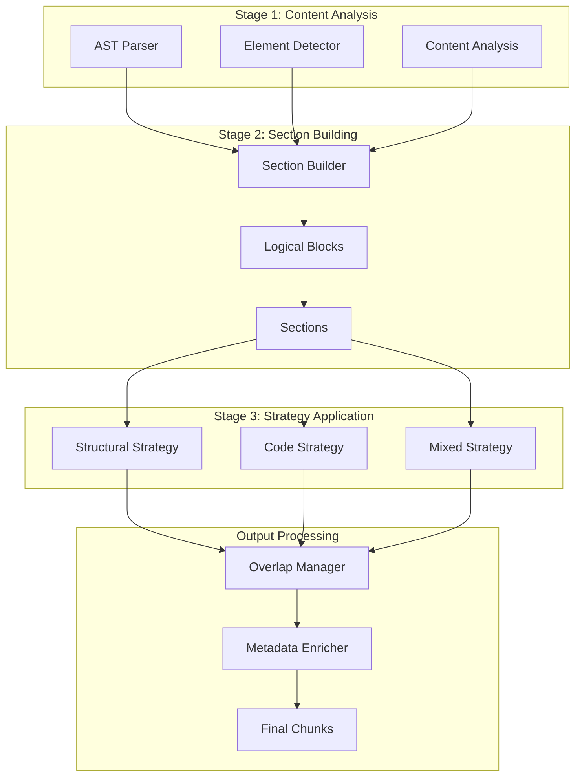
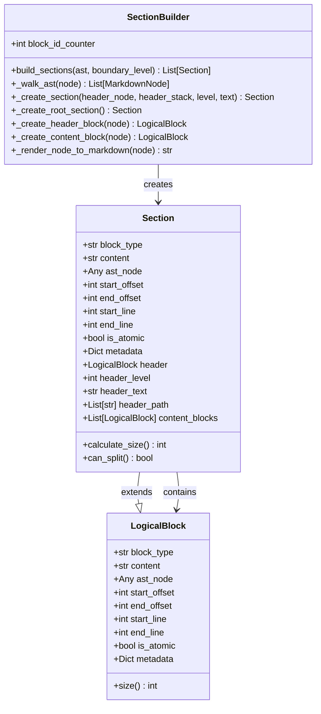
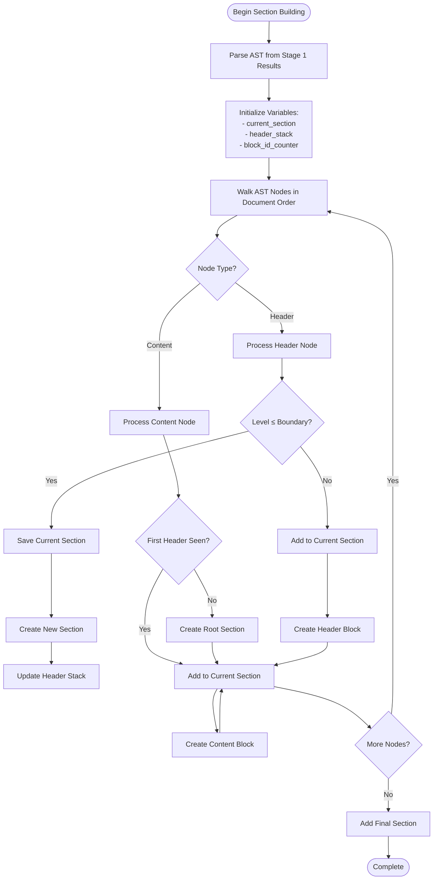
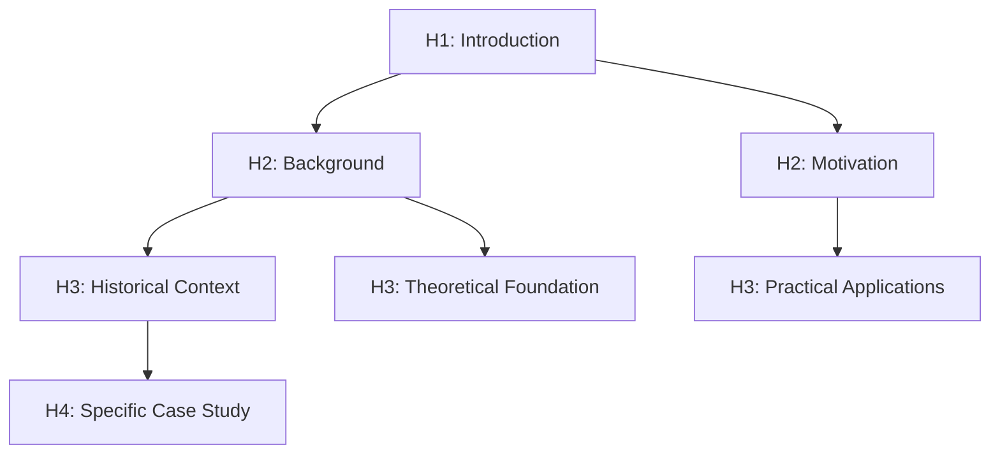

# Section Building

<cite>
**Referenced Files in This Document**
- [section_builder.py](file://markdown_chunker/chunker/section_builder.py)
- [logical_blocks.py](file://markdown_chunker/chunker/logical_blocks.py)
- [types.py](file://markdown_chunker/chunker/types.py)
- [ast.py](file://markdown_chunker/parser/ast.py)
- [core.py](file://markdown_chunker/chunker/core.py)
- [orchestrator.py](file://markdown_chunker/chunker/orchestrator.py)
- [structural_strategy.py](file://markdown_chunker/chunker/strategies/structural_strategy.py)
- [basic_usage.py](file://examples/basic_usage.py)
- [edge_cases.md](file://tests/fixtures/edge_cases.md)
- [mixed.md](file://tests/fixtures/mixed.md)
- [structural.md](file://tests/fixtures/structural.md)
</cite>

## Table of Contents
1. [Introduction](#introduction)
2. [Architecture Overview](#architecture-overview)
3. [Core Components](#core-components)
4. [Section Building Algorithm](#section-building-algorithm)
5. [Header Hierarchy Analysis](#header-hierarchy-analysis)
6. [Section Metadata Generation](#section-metadata-generation)
7. [Practical Examples](#practical-examples)
8. [Edge Cases and Robustness](#edge-cases-and-robustness)
9. [Configuration and Tuning](#configuration-and-tuning)
10. [Performance Considerations](#performance-considerations)
11. [Troubleshooting Guide](#troubleshooting-guide)
12. [Conclusion](#conclusion)

## Introduction

The Section Builder component is a sophisticated Phase 2 semantic quality improvement module that reconstructs logical document sections from atomic Markdown chunks. It analyzes header hierarchies, indentation levels, and semantic boundaries to group related content into coherent sections while maintaining contextual coherence across document fragments.

Section building serves as the foundation for section-aware chunking, enabling intelligent document segmentation that preserves natural document structure and semantic relationships. This capability is essential for applications requiring contextual understanding, such as Retrieval-Augmented Generation (RAG) systems, documentation indexing, and semantic search.

## Architecture Overview

The Section Builder operates within a multi-stage chunking pipeline, working alongside other Phase 2 components to enhance semantic quality:



**Diagram sources**
- [orchestrator.py](file://markdown_chunker/chunker/orchestrator.py#L23-L118)
- [section_builder.py](file://markdown_chunker/chunker/section_builder.py#L43-L130)

**Section sources**
- [orchestrator.py](file://markdown_chunker/chunker/orchestrator.py#L23-L118)
- [core.py](file://markdown_chunker/chunker/core.py#L41-L150)

## Core Components

### SectionBuilder Class

The `SectionBuilder` class serves as the primary interface for section reconstruction, implementing a hierarchical parsing algorithm that walks through the AST to identify and group content blocks under appropriate headers.



**Diagram sources**
- [section_builder.py](file://markdown_chunker/chunker/section_builder.py#L43-L341)
- [logical_blocks.py](file://markdown_chunker/chunker/logical_blocks.py#L13-L158)

### LogicalBlock and Section Data Structures

The system uses two primary data structures to represent semantic units:

**LogicalBlock**: Represents atomic content units (paragraphs, lists, code blocks, tables, headers) that maintain semantic coherence and cannot be meaningfully split further.

**Section**: Extends LogicalBlock to represent hierarchical document sections containing an optional header and multiple content blocks organized under that header.

**Section sources**
- [logical_blocks.py](file://markdown_chunker/chunker/logical_blocks.py#L13-L158)
- [section_builder.py](file://markdown_chunker/chunker/section_builder.py#L132-L341)

## Section Building Algorithm

The section building process follows a systematic approach to reconstruct document hierarchy from atomic chunks:



**Diagram sources**
- [section_builder.py](file://markdown_chunker/chunker/section_builder.py#L62-L130)

### Key Algorithmic Features

1. **Boundary Level Control**: The `boundary_level` parameter determines which headers trigger new sections. Headers at or below this level become section boundaries.

2. **Hierarchical Tracking**: The header stack maintains the current hierarchy, enabling proper parent-child relationships and path construction.

3. **Content Grouping**: Content blocks are grouped under the most recent header, with special handling for content before the first header.

4. **Atomic Preservation**: Each LogicalBlock maintains its atomic nature, preventing further splitting while allowing section-level aggregation.

**Section sources**
- [section_builder.py](file://markdown_chunker/chunker/section_builder.py#L62-L130)

## Header Hierarchy Analysis

The Section Builder performs sophisticated header hierarchy analysis to understand document structure and maintain semantic relationships:

### Header Level Detection

Headers are identified by their level (1-6), with H1 being the highest level and H6 the lowest. The system recognizes both ATX-style (`# Header`) and Setext-style (`Header\n===`) headers.

### Parent-Child Relationships

The algorithm maintains a stack-based approach to track header relationships:



**Diagram sources**
- [section_builder.py](file://markdown_chunker/chunker/section_builder.py#L98-L115)

### Header Path Construction

Each section maintains a complete header path that enables hierarchical navigation and metadata enrichment:

- **Root Section**: Empty path `[]`
- **H1 Section**: `["Introduction"]`
- **H2 Section**: `["Chapter 1", "Section 1.1"]`
- **H3 Section**: `["Chapter 1", "Section 1.1", "Subsection 1.1.1"]`

**Section sources**
- [section_builder.py](file://markdown_chunker/chunker/section_builder.py#L184-L202)

## Section Metadata Generation

The Section Builder generates comprehensive metadata for each section, enabling rich contextual information and enhanced chunking capabilities:

### Core Metadata Fields

| Field | Type | Description | Example |
|-------|------|-------------|---------|
| `id` | string | Unique section identifier | `"section_1"` |
| `header_level` | integer | Header level (1-6) | `2` |
| `header_text` | string | Clean header text | `"Installation Guide"` |
| `header_path` | array | Hierarchical path | `["Getting Started", "Installation"]` |
| `start_line` | integer | Starting line number | `15` |
| `end_line` | integer | Ending line number | `42` |
| `start_offset` | integer | Character offset | `345` |
| `end_offset` | integer | Character offset | `890` |

### Content Analysis Metadata

Sections automatically calculate size metrics and structural properties:

- **Total Size**: Sum of header and all content block sizes
- **Content Blocks**: List of associated LogicalBlocks
- **Split Capability**: Boolean indicating if section can be divided

### Enrichment Capabilities

The system supports automatic metadata enrichment through various mechanisms:

1. **Content Type Detection**: Identifies dominant content types within sections
2. **Complexity Scoring**: Calculates semantic complexity based on content diversity
3. **Language Detection**: For code sections, identifies programming languages
4. **Structure Validation**: Ensures semantic coherence and completeness

**Section sources**
- [section_builder.py](file://markdown_chunker/chunker/section_builder.py#L188-L202)
- [logical_blocks.py](file://markdown_chunker/chunker/logical_blocks.py#L117-L158)

## Practical Examples

### Basic Section Building

Consider a simple technical documentation structure:

```markdown
# Getting Started

Welcome to our documentation. This section covers basic concepts.

## Installation

Step-by-step installation instructions.

### Prerequisites

System requirements and prerequisites.

### Step-by-Step Guide

Detailed installation steps.

## Configuration

Configuration options and settings.

### Environment Variables

Available environment variables.

### Advanced Settings

Advanced configuration options.
```

The Section Builder would create the following sections:

1. **Root Section**: Content before first header
2. **Section 1**: `header_text="Getting Started"`, `header_level=1`, `header_path=[]`
3. **Section 2**: `header_text="Installation"`, `header_level=2`, `header_path=["Getting Started"]`
4. **Section 3**: `header_text="Prerequisites"`, `header_level=3`, `header_path=["Getting Started", "Installation"]`
5. **Section 4**: `header_text="Step-by-Step Guide"`, `header_level=3`, `header_path=["Getting Started", "Installation"]`
6. **Section 5**: `header_text="Configuration"`, `header_level=2`, `header_path=["Getting Started"]`
7. **Section 6**: `header_text="Environment Variables"`, `header_level=3`, `header_path=["Getting Started", "Configuration"]`
8. **Section 7**: `header_text="Advanced Settings"`, `header_level=3`, `header_path=["Getting Started", "Configuration"]`

### Mixed Content Sections

For documents containing multiple content types, the Section Builder handles complex scenarios:

```markdown
# API Reference

## Authentication

Authentication methods and examples.

```python
def authenticate(token):
    # Implementation
    pass
```

## Endpoints

### GET /users

Retrieve user information.

| Parameter | Type | Description |
|-----------|------|-------------|
| id | string | User ID |

### POST /users

Create new user.

- Requires admin privileges
- Returns user object
```

**Section sources**
- [basic_usage.py](file://examples/basic_usage.py#L14-L50)
- [structural.md](file://tests/fixtures/structural.md#L1-L50)

### Deeply Nested Structures

The system handles deeply nested documents with multiple header levels:

```markdown
# Chapter 1: Fundamentals

## Section 1.1: Basic Concepts

### Subsection 1.1.1: Theory

#### Detail 1.1.1.1: Mathematical Foundation

##### Sub-detail 1.1.1.1.1: Proof Techniques

###### Micro-detail 1.1.1.1.1.1: Induction Method
```

**Section sources**
- [edge_cases.md](file://tests/fixtures/edge_cases.md#L49-L56)

## Edge Cases and Robustness

The Section Builder includes comprehensive handling for edge cases commonly encountered in real-world documents:

### Empty Sections

Empty sections are handled gracefully by creating minimal sections with appropriate metadata:

```markdown
# Documentation

## Empty Section

## Another Empty Section
```

### Orphaned Content

Content appearing before the first header is captured in a root section:

```markdown
This content appears before any headers.

# Actual Documentation Starts Here
```

### Mixed Content Sections

The system intelligently handles sections containing multiple content types:

```markdown
# Complex Section

Text content with embedded:

- Unordered list
- Ordered list
- Code blocks
- Tables
- Blockquotes
```

### Malformed Elements

Robust parsing handles malformed Markdown elements:

```markdown
# Problematic Section

Text before code block

```python
def broken_code():
    return "unclosed"
    
Text after code block
```

### Deep Nesting

Extreme nesting scenarios are managed through stack-based hierarchy tracking:

```markdown
# Level 1
## Level 2
### Level 3
#### Level 4
##### Level 5
###### Level 6
####### Level 7 (ignored)
```

**Section sources**
- [edge_cases.md](file://tests/fixtures/edge_cases.md#L1-L62)
- [mixed.md](file://tests/fixtures/mixed.md#L1-L51)

## Configuration and Tuning

### Section Boundary Level

The `boundary_level` parameter controls which headers trigger new sections:

```python
# H1 and H2 as section boundaries (default)
builder = SectionBuilder(boundary_level=2)

# Only H1 as section boundary  
builder = SectionBuilder(boundary_level=1)

# All headers as section boundaries
builder = SectionBuilder(boundary_level=6)
```

### Section Granularity Tuning

Fine-tune section granularity through configuration parameters:

| Parameter | Default | Description | Impact |
|-----------|---------|-------------|---------|
| `section_boundary_level` | 2 | Headers at or below this level start new sections | Higher values create fewer, larger sections |
| `min_content_per_chunk` | 50 | Minimum content size for valid sections | Prevents creation of tiny sections |
| `preserve_markdown_structure` | true | Maintain original Markdown formatting | Affects rendering quality |

### Performance Tuning

Optimize section building performance for different document characteristics:

```python
# For large documents
config = ChunkConfig(
    section_boundary_level=2,
    max_chunk_size=8192,  # Larger chunks
    enable_overlap=True
)

# For small documents
config = ChunkConfig(
    section_boundary_level=3,
    max_chunk_size=1024,  # Smaller chunks
    enable_overlap=False
)
```

**Section sources**
- [types.py](file://markdown_chunker/chunker/types.py#L614-L619)
- [section_builder.py](file://markdown_chunker/chunker/section_builder.py#L62-L78)

## Performance Considerations

### Algorithmic Complexity

The Section Builder operates with O(n) complexity where n is the number of AST nodes:

- **Time Complexity**: O(n) for walking the AST and processing nodes
- **Space Complexity**: O(h) for header stack where h is maximum nesting depth
- **Memory Usage**: Minimal overhead for metadata storage

### Optimization Strategies

1. **Lazy Evaluation**: Metadata is computed only when accessed
2. **Efficient Walking**: Single-pass AST traversal minimizes processing
3. **Minimal Allocations**: Reuse of existing AST nodes reduces memory pressure
4. **Streaming Support**: Compatible with streaming document processing

### Performance Monitoring

Enable performance monitoring to track section building metrics:

```python
chunker = MarkdownChunker(enable_performance_monitoring=True)
result = chunker.chunk(document)
stats = chunker.get_performance_stats()
```

**Section sources**
- [section_builder.py](file://markdown_chunker/chunker/section_builder.py#L132-L161)

## Troubleshooting Guide

### Common Issues and Solutions

#### Issue: Sections Not Forming Correctly

**Symptoms**: Content appears in unexpected sections or sections are too small/large.

**Causes**:
- Incorrect `boundary_level` setting
- Malformed header syntax
- Content before first header

**Solutions**:
```python
# Adjust boundary level
builder = SectionBuilder(boundary_level=3)  # Try different values

# Check header syntax
# ✓ Correct: # Header
# ✓ Correct: Header\n===
# ✗ Incorrect: ## Header without space
```

#### Issue: Empty Sections Created

**Symptoms**: Sections with no content or minimal content.

**Causes**:
- Consecutive headers without content
- Empty subsections
- Content filtered out during processing

**Solutions**:
```python
# Increase min_content_per_chunk
config = ChunkConfig(min_content_per_chunk=100)

# Review content preprocessing
```

#### Issue: Deep Nesting Problems

**Symptoms**: Incorrect header relationships or missing sections.

**Causes**:
- Extremely deep nesting
- Malformed nested headers
- Stack overflow in processing

**Solutions**:
```python
# Limit nesting depth
config = ChunkConfig(section_boundary_level=4)  # Reduce maximum depth

# Validate input document structure
```

### Debugging Tools

Enable detailed logging for troubleshooting:

```python
import logging
logging.basicConfig(level=logging.DEBUG)

# Enable debug logging for section builder
logger = logging.getLogger('markdown_chunker.chunker.section_builder')
logger.setLevel(logging.DEBUG)
```

### Validation and Testing

Use built-in validation to ensure section integrity:

```python
# Test section building with sample data
sections = builder.build_sections(sample_ast)
for section in sections:
    print(f"Section: {section.header_text}")
    print(f"  Path: {section.header_path}")
    print(f"  Content blocks: {len(section.content_blocks)}")
    print(f"  Size: {section.calculate_size()} chars")
```

**Section sources**
- [section_builder.py](file://markdown_chunker/chunker/section_builder.py#L132-L161)

## Conclusion

The Section Builder component represents a sophisticated approach to semantic document reconstruction, transforming atomic Markdown chunks into coherent, hierarchically organized sections. Its algorithmic elegance, combined with robust error handling and comprehensive metadata generation, makes it an essential component for advanced chunking systems.

Key strengths include:

- **Semantic Intelligence**: Deep understanding of header hierarchies and content relationships
- **Robustness**: Comprehensive handling of edge cases and malformed input
- **Flexibility**: Configurable boundary levels and granularity controls
- **Performance**: Efficient O(n) algorithm with minimal memory overhead
- **Integration**: Seamless integration with the broader chunking pipeline

The Section Builder's ability to maintain contextual coherence while respecting document structure makes it invaluable for applications requiring semantic understanding, such as RAG systems, documentation indexing, and intelligent content processing. Its design principles of atomic preservation, hierarchical tracking, and metadata enrichment provide a solid foundation for advanced document processing workflows.

Future enhancements may include machine learning-based section boundary detection, enhanced content type classification, and improved handling of complex mixed-content scenarios. The modular architecture ensures that such improvements can be integrated seamlessly while maintaining backward compatibility.