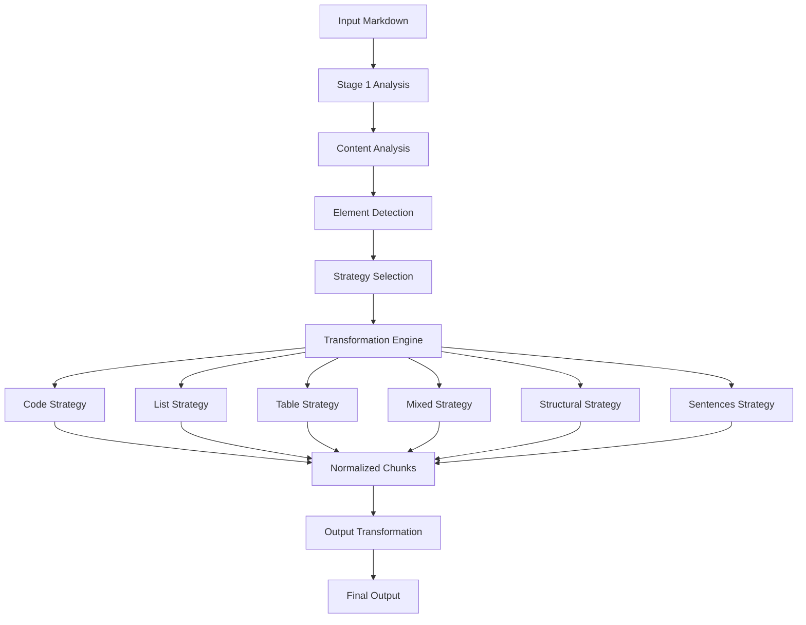
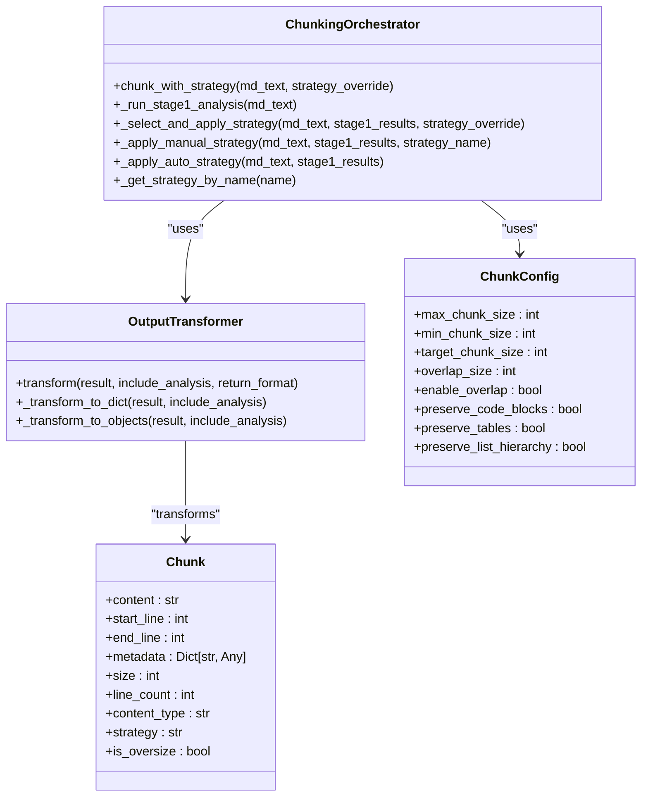
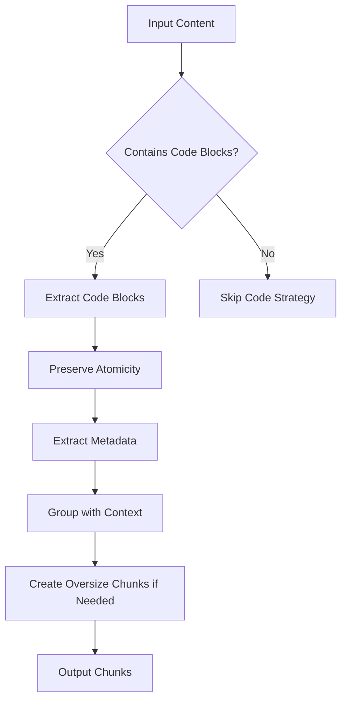
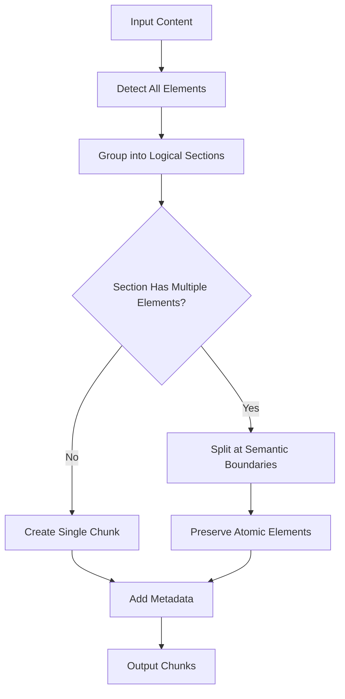
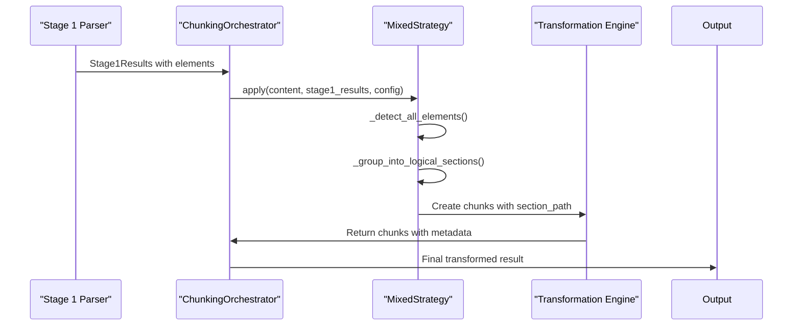
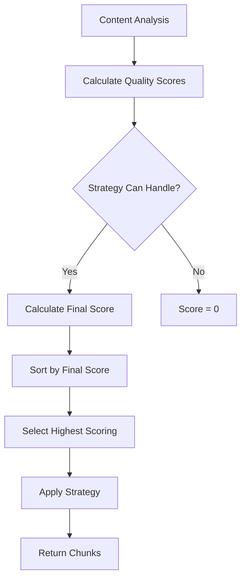

# Transformation Engine

<cite>
**Referenced Files in This Document**   
- [transformer.py](file://markdown_chunker/chunker/transformer.py)
- [orchestrator.py](file://markdown_chunker/chunker/orchestrator.py)
- [types.py](file://markdown_chunker/chunker/types.py)
- [logical_blocks.py](file://markdown_chunker/chunker/logical_blocks.py)
- [core.py](file://markdown_chunker/chunker/core.py)
- [code_strategy.py](file://markdown_chunker/chunker/strategies/code_strategy.py)
- [mixed_strategy.py](file://markdown_chunker/chunker/strategies/mixed_strategy.py)
- [base.py](file://markdown_chunker/chunker/strategies/base.py)
- [config.py](file://markdown_chunker/parser/config.py)
</cite>

## Table of Contents
1. [Introduction](#introduction)
2. [Architecture Overview](#architecture-overview)
3. [Core Components](#core-components)
4. [Transformation Rules](#transformation-rules)
5. [Context-Aware Adjustments](#context-aware-adjustments)
6. [Integration with Orchestrator](#integration-with-orchestrator)
7. [Common Issues and Solutions](#common-issues-and-solutions)
8. [Performance Considerations](#performance-considerations)

## Introduction

The Transformation Engine is responsible for applying semantic-preserving transformations during the chunking process. It processes raw chunks generated by various strategies and transforms them into normalized forms while preserving critical structural elements such as code blocks, lists, and tables. The engine operates as part of a two-stage pipeline where Stage 1 performs content analysis and element detection, and Stage 2 applies strategy-specific transformations to create semantically meaningful chunks.

The engine's primary objectives include maintaining document structure integrity, preserving atomic elements that should not be split, and ensuring context continuity across chunk boundaries. It achieves this through a combination of content-aware strategies, metadata enrichment, and fallback mechanisms that handle edge cases gracefully.

**Section sources**
- [core.py](file://markdown_chunker/chunker/core.py#L1-L100)
- [orchestrator.py](file://markdown_chunker/chunker/orchestrator.py#L1-L50)

## Architecture Overview

The Transformation Engine follows a modular architecture with clear separation of concerns between analysis, strategy selection, transformation, and output formatting. The system processes Markdown documents through a pipeline that begins with content analysis and ends with transformed, normalized chunks.

**Diagram sources **
- [core.py](file://markdown_chunker/chunker/core.py#L41-L154)
- [orchestrator.py](file://markdown_chunker/chunker/orchestrator.py#L23-L340)

## Core Components

The Transformation Engine consists of several core components that work together to process and transform content. The orchestrator coordinates the overall process, selecting the appropriate strategy based on content analysis. Each strategy implements specific transformation rules for different content types, while the transformer component handles output formatting.

The engine preserves atomic elements such as code blocks and tables by treating them as indivisible units during transformation. This ensures that semantic integrity is maintained even when these elements exceed normal chunk size limits. The system also maintains metadata about each chunk, including its source location, content type, and the strategy used to create it.

**Diagram sources **
- [orchestrator.py](file://markdown_chunker/chunker/orchestrator.py#L23-L340)
- [transformer.py](file://markdown_chunker/chunker/transformer.py#L13-L101)
- [types.py](file://markdown_chunker/chunker/types.py#L36-L800)

**Section sources**
- [transformer.py](file://markdown_chunker/chunker/transformer.py#L1-L101)
- [types.py](file://markdown_chunker/chunker/types.py#L36-L800)
- [logical_blocks.py](file://markdown_chunker/chunker/logical_blocks.py#L13-L158)

## Transformation Rules

The Transformation Engine applies different rules based on the content type and selected strategy. Each strategy implements specific transformation logic to handle its target content type while preserving semantic meaning and structural integrity.

### Code Strategy Transformation

The code strategy preserves code blocks as atomic units and maintains context between code and surrounding explanatory text. It extracts metadata such as programming language, function names, and class names from code blocks. The strategy ensures that code blocks are never split across chunks, even if they exceed the maximum chunk size.

**Diagram sources **
- [code_strategy.py](file://markdown_chunker/chunker/strategies/code_strategy.py#L42-L200)

### Mixed Strategy Transformation

The mixed strategy handles documents with multiple content types by grouping related elements into logical sections. It preserves semantic relationships between different element types while balancing chunk sizes. The strategy identifies indivisible elements like code blocks and tables, using them as natural boundaries for chunking.

**Diagram sources **
- [mixed_strategy.py](file://markdown_chunker/chunker/strategies/mixed_strategy.py#L75-L200)

### List and Table Preservation

Lists and tables are preserved as complete units when possible, maintaining their hierarchical structure and alignment. For nested lists, the engine preserves the indentation and nesting level information. Tables are kept intact with their header rows and alignment specifications preserved.

**Section sources**
- [base.py](file://markdown_chunker/chunker/strategies/base.py#L233-L253)
- [mixed_strategy.py](file://markdown_chunker/chunker/strategies/mixed_strategy.py#L31-L200)

## Context-Aware Adjustments

The Transformation Engine makes context-aware adjustments based on chunk boundaries and document structure. It analyzes the hierarchical relationships between elements and preserves these relationships across chunk boundaries.

### Section Boundary Preservation

The engine identifies section boundaries based on header levels and preserves the hierarchical path to each chunk's section. This allows downstream applications to understand the context of each chunk within the overall document structure.

**Diagram sources **
- [logical_blocks.py](file://markdown_chunker/chunker/logical_blocks.py#L82-L158)
- [mixed_strategy.py](file://markdown_chunker/chunker/strategies/mixed_strategy.py#L47-L200)

### Overlap Management

When overlap is enabled, the engine creates overlapping chunks to maintain context continuity. The overlap size is determined by configuration and can be specified as an absolute character count or as a percentage of the chunk size. The engine ensures that overlap occurs at natural semantic boundaries rather than arbitrary positions.

**Section sources**
- [core.py](file://markdown_chunker/chunker/core.py#L139-L141)
- [types.py](file://markdown_chunker/chunker/types.py#L579-L582)

## Integration with Orchestrator

The Transformation Engine integrates with the orchestrator to apply transformations conditionally based on configuration and content analysis. The orchestrator selects the appropriate strategy based on document characteristics and configuration parameters.

### Strategy Selection Process

The orchestrator evaluates multiple strategies and selects the best one based on quality scores and priority levels. Each strategy calculates a quality score based on the content analysis, and the orchestrator combines this with the strategy's priority to make the final selection.

**Diagram sources **
- [orchestrator.py](file://markdown_chunker/chunker/orchestrator.py#L169-L317)
- [base.py](file://markdown_chunker/chunker/strategies/base.py#L96-L128)

### Configuration-Driven Transformations

The engine applies transformations based on configuration parameters that control behavior such as chunk size limits, overlap settings, and preservation rules. Configuration profiles provide optimized settings for different use cases like code-heavy documents, structured documentation, and large documents.

**Section sources**
- [types.py](file://markdown_chunker/chunker/types.py#L497-L800)
- [orchestrator.py](file://markdown_chunker/chunker/orchestrator.py#L34-L54)

## Common Issues and Solutions

The Transformation Engine addresses several common issues that arise during Markdown chunking, particularly around structural integrity and boundary handling.

### Fence Splitting

Code fence splitting is prevented by treating code blocks as atomic elements that cannot be divided. The engine detects code fences and ensures that entire code blocks are contained within single chunks, even if this results in oversized chunks.

### List Continuity

List continuity is maintained by preserving the hierarchical structure of nested lists. The engine tracks indentation levels and ensures that list items remain grouped with their parent items. For long lists that exceed chunk size limits, the engine splits at natural list boundaries rather than arbitrary positions.

### Header Hierarchy Preservation

Header hierarchy is preserved by maintaining the path of headers leading to each chunk. The engine tracks section boundaries based on header levels and includes this contextual information in chunk metadata, allowing downstream applications to reconstruct the document structure.

**Section sources**
- [base.py](file://markdown_chunker/chunker/strategies/base.py#L233-L253)
- [logical_blocks.py](file://markdown_chunker/chunker/logical_blocks.py#L82-L158)

## Performance Considerations

The Transformation Engine is designed with performance in mind, particularly for large-scale transformations. Several optimizations ensure efficient processing of large documents.

### Streaming Support

For very large documents, the engine supports streaming mode to reduce memory usage. This allows processing of documents that exceed available memory by processing them in chunks rather than loading the entire document at once.

### Caching and Reuse

The engine caches strategy instances and reuses them across multiple chunking operations. This reduces initialization overhead and improves performance when processing multiple documents with similar characteristics.

### Complexity Management

The engine manages complexity by using efficient algorithms for element detection and boundary finding. Regular expressions are optimized for performance, and parsing is done in a single pass whenever possible.

**Section sources**
- [core.py](file://markdown_chunker/chunker/core.py#L122-L126)
- [types.py](file://markdown_chunker/chunker/types.py#L606-L607)