# AST Builder

<cite>
**Referenced Files in This Document**
- [ast.py](file://markdown_chunker/parser/ast.py)
- [enhanced_ast_builder.py](file://markdown_chunker/parser/enhanced_ast_builder.py)
- [markdown_ast.py](file://markdown_chunker/parser/markdown_ast.py)
- [core.py](file://markdown_chunker/parser/core.py)
- [types.py](file://markdown_chunker/parser/types.py)
- [nesting_resolver.py](file://markdown_chunker/parser/nesting_resolver.py)
- [analyzer.py](file://markdown_chunker/parser/analyzer.py)
- [test_ast.py](file://tests/parser/test_ast.py)
- [test_ast_new.py](file://tests/parser/test_ast_new.py)
</cite>

## Table of Contents
1. [Introduction](#introduction)
2. [Architecture Overview](#architecture-overview)
3. [Core Components](#core-components)
4. [AST Building Process](#ast-building-process)
5. [Enhanced AST Features](#enhanced-ast-features)
6. [Position Tracking and Metadata](#position-tracking-and-metadata)
7. [Integration Points](#integration-points)
8. [Performance Optimization](#performance-optimization)
9. [Error Handling and Validation](#error-handling-and-validation)
10. [Usage Examples](#usage-examples)
11. [Best Practices](#best-practices)

## Introduction

The AST Builder component serves as the cornerstone of the Parser Module, responsible for transforming raw Markdown input into a robust Abstract Syntax Tree (AST) with enhanced positional metadata and hierarchical relationships. This component extends the base AST functionality by incorporating inline token support, comprehensive position tracking, and sophisticated nesting resolution capabilities.

The AST Builder implements a dual-layer architecture that combines the power of markdown-it-py for structural parsing with custom inline token processing for fine-grained element identification. This approach ensures both performance and accuracy in capturing the complete semantic structure of Markdown documents.

## Architecture Overview

The AST Builder architecture follows a modular design pattern with clear separation of concerns:

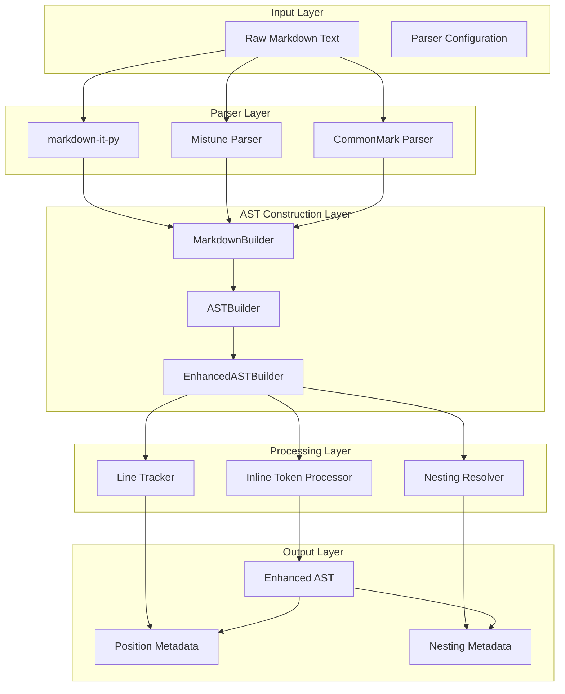

**Diagram sources**
- [ast.py](file://markdown_chunker/parser/ast.py#L111-L297)
- [enhanced_ast_builder.py](file://markdown_chunker/parser/enhanced_ast_builder.py#L319-L651)
- [markdown_ast.py](file://markdown_chunker/parser/markdown_ast.py#L31-L597)

## Core Components

### MarkdownNode Class

The `MarkdownNode` class serves as the fundamental building block of the AST, providing a comprehensive representation of Markdown elements with enhanced metadata capabilities.

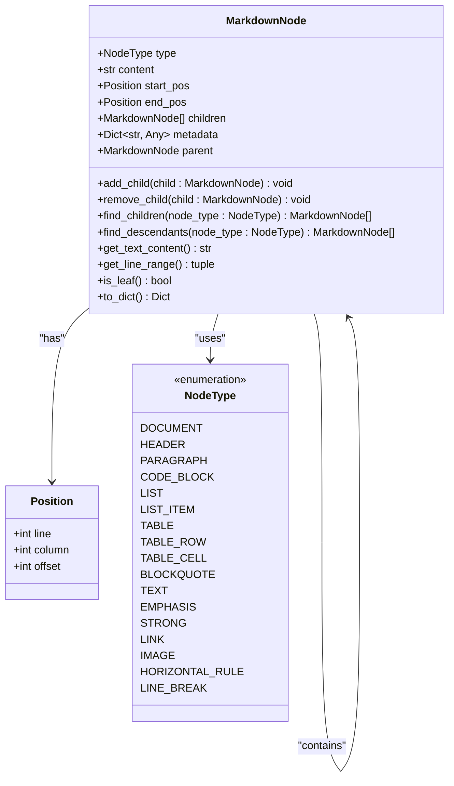

**Diagram sources**
- [types.py](file://markdown_chunker/parser/types.py#L58-L215)

### ASTBuilder Class

The `ASTBuilder` class provides the primary interface for AST construction, supporting multiple underlying parsers with automatic fallback mechanisms.

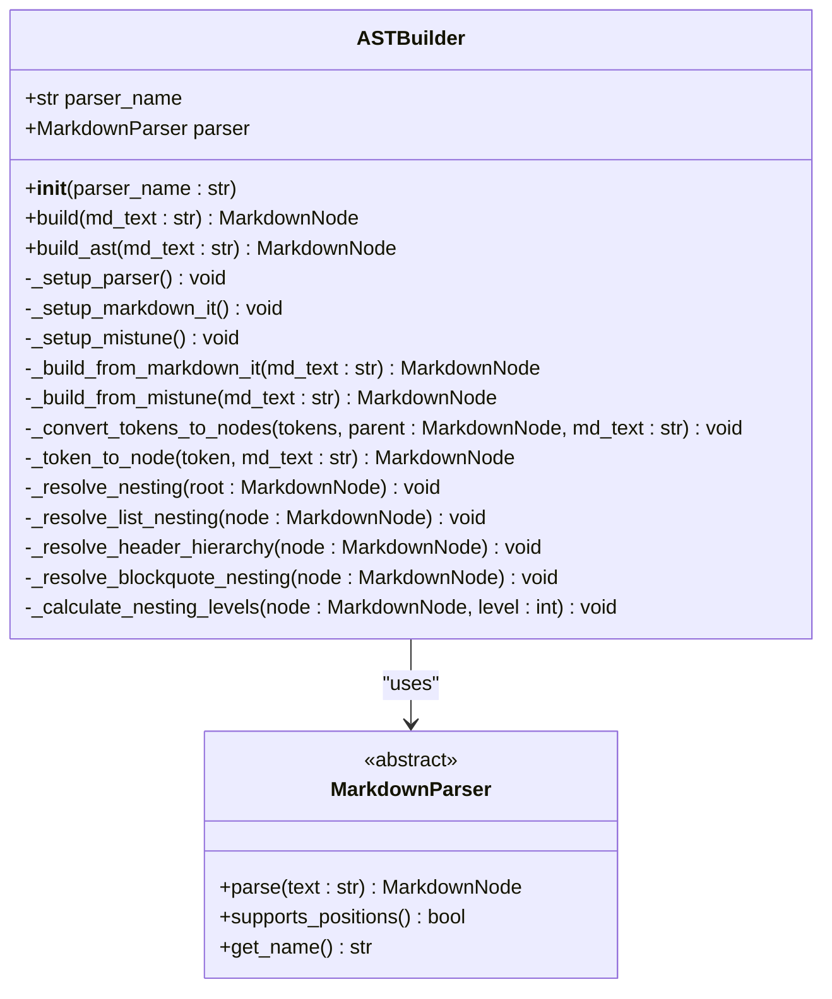

**Diagram sources**
- [ast.py](file://markdown_chunker/parser/ast.py#L111-L297)

**Section sources**
- [ast.py](file://markdown_chunker/parser/ast.py#L30-L297)

### EnhancedASTBuilder Class

The `EnhancedASTBuilder` class extends the basic AST functionality with sophisticated inline token processing and comprehensive validation.

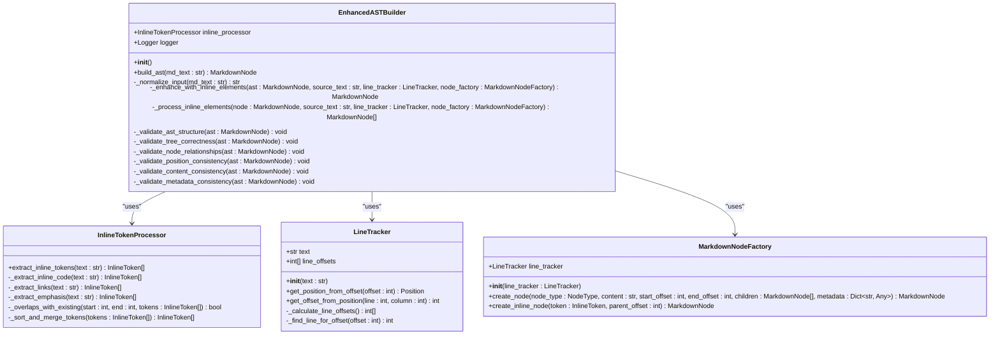

**Diagram sources**
- [enhanced_ast_builder.py](file://markdown_chunker/parser/enhanced_ast_builder.py#L319-L651)

**Section sources**
- [enhanced_ast_builder.py](file://markdown_chunker/parser/enhanced_ast_builder.py#L17-L651)

## AST Building Process

The AST building process follows a multi-stage pipeline that transforms raw Markdown into a structured, position-aware tree representation.

### Stage 1: Parser Selection and Initialization

The system automatically selects the most appropriate parser based on availability and performance characteristics:

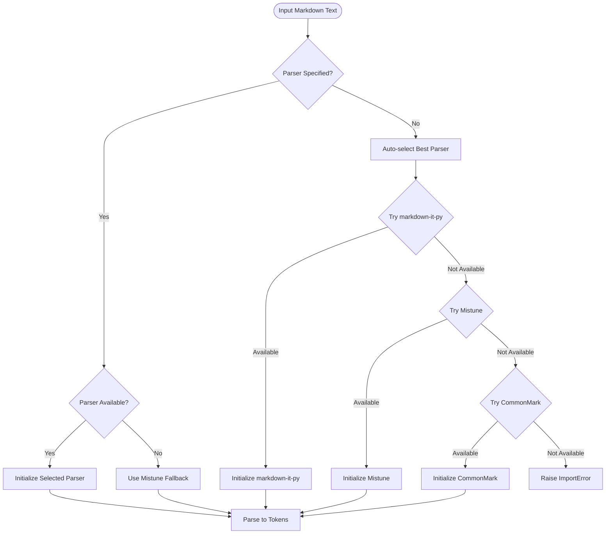

**Diagram sources**
- [ast.py](file://markdown_chunker/parser/ast.py#L114-L140)
- [markdown_ast.py](file://markdown_chunker/parser/markdown_ast.py#L484-L541)

### Stage 2: Token Conversion to Nodes

The conversion process transforms markdown-it tokens into structured `MarkdownNode` instances with proper metadata:

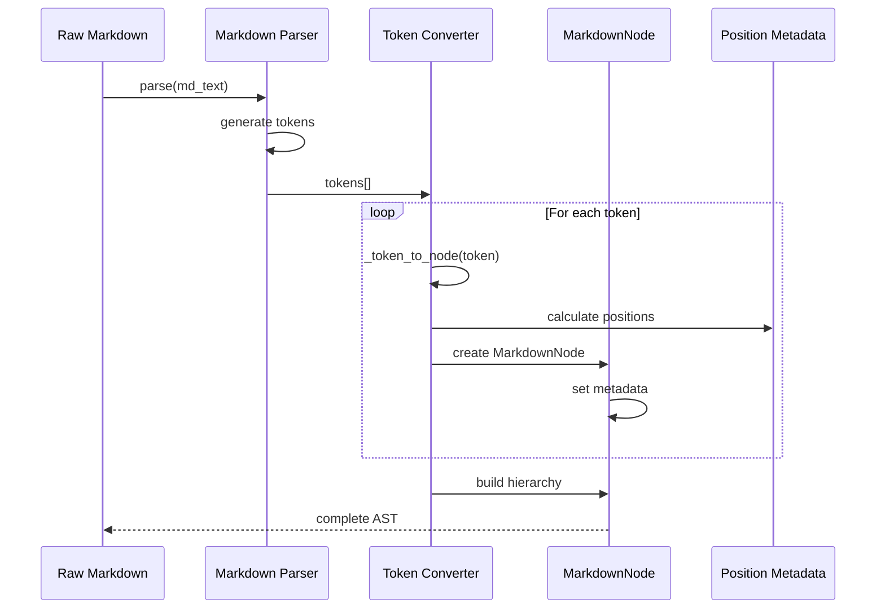

**Diagram sources**
- [ast.py](file://markdown_chunker/parser/ast.py#L168-L202)
- [markdown_ast.py](file://markdown_chunker/parser/markdown_ast.py#L58-L230)

### Stage 3: Nesting Resolution

The nesting resolution process establishes parent-child relationships and calculates nesting depths:

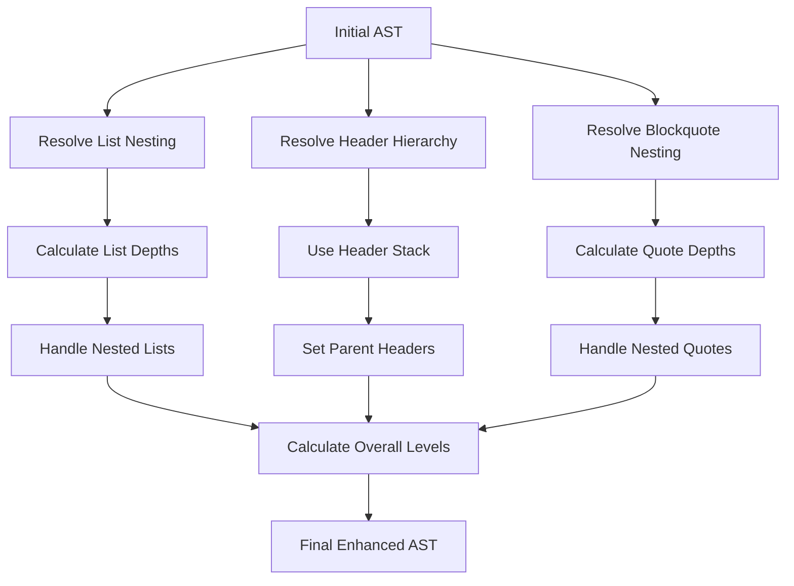

**Diagram sources**
- [ast.py](file://markdown_chunker/parser/ast.py#L203-L289)

**Section sources**
- [ast.py](file://markdown_chunker/parser/ast.py#L141-L202)

## Enhanced AST Features

### Inline Token Processing

The EnhancedASTBuilder introduces sophisticated inline token processing capabilities that identify and structure inline elements within text content.

#### Supported Inline Elements

The system recognizes and processes the following inline elements:

| Element Type | Pattern | Description | Example |
|--------------|---------|-------------|---------|
| Inline Code | `` `code` `` | Single-line code snippets | `` `print("hello")` `` |
| Links | `[text](url)` | Standard links | `[GitHub](https://github.com)` |
| Emphasis | `*text*` or `_text_` | Italic text | `*italic*` |
| Strong | `**text**` or `__text__` | Bold text | `**bold**` |
| Images | `` | Image references | `` |

#### Inline Token Processing Workflow

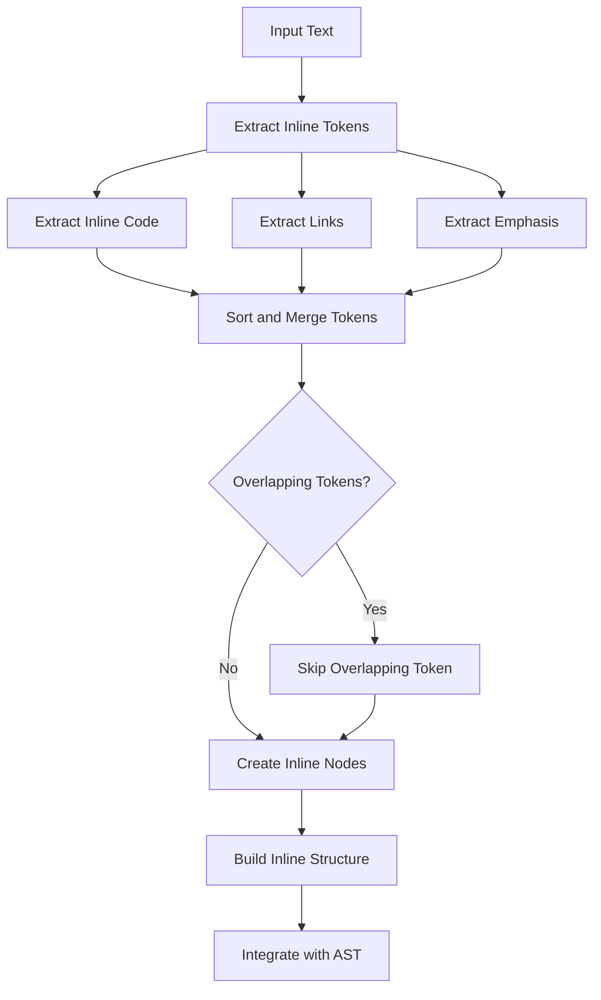

**Diagram sources**
- [enhanced_ast_builder.py](file://markdown_chunker/parser/enhanced_ast_builder.py#L125-L255)

### Position Tracking System

The position tracking system maintains precise coordinate information for every AST node:

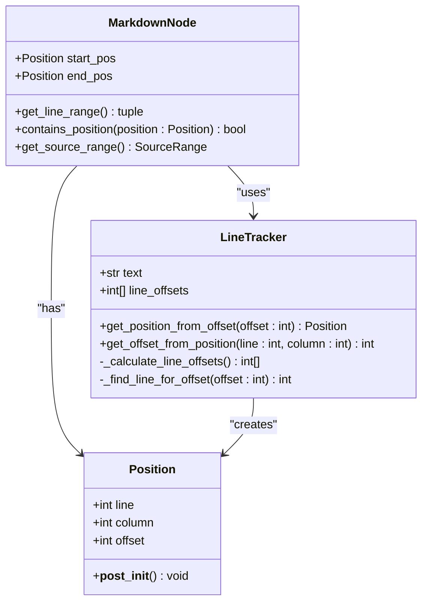

**Diagram sources**
- [types.py](file://markdown_chunker/parser/types.py#L18-L35)
- [enhanced_ast_builder.py](file://markdown_chunker/parser/enhanced_ast_builder.py#L58-L124)

**Section sources**
- [enhanced_ast_builder.py](file://markdown_chunker/parser/enhanced_ast_builder.py#L125-L255)

## Position Tracking and Metadata

### Line Numbering System

The AST Builder implements a comprehensive line numbering system that maintains accurate positional information throughout the document:

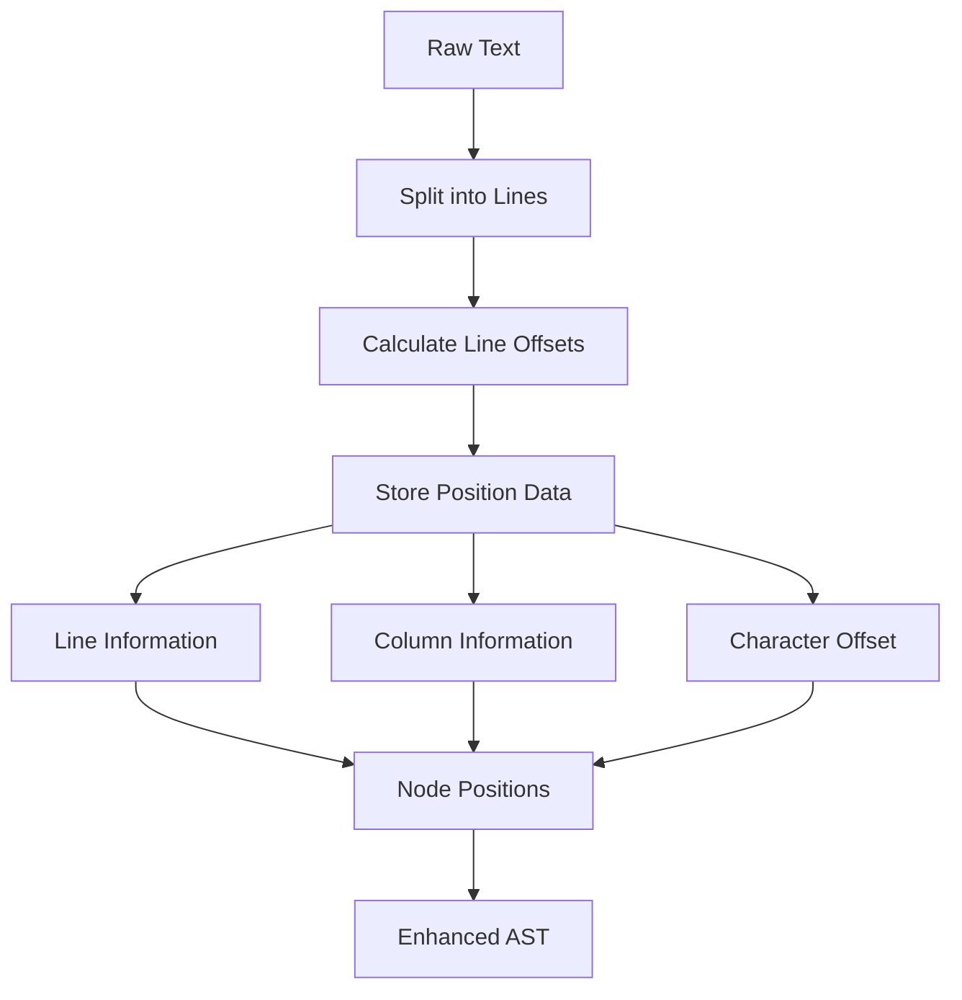

**Diagram sources**
- [enhanced_ast_builder.py](file://markdown_chunker/parser/enhanced_ast_builder.py#L67-L124)

### Metadata Enrichment

Each AST node accumulates comprehensive metadata that supports downstream processing:

| Metadata Field | Type | Purpose | Example |
|----------------|------|---------|---------|
| `level` | int | Header depth or list nesting | `1`, `2`, `3` |
| `language` | str | Programming language identifier | `"python"`, `"javascript"` |
| `info` | str | Additional block information | `"python3"` |
| `markup` | str | Markdown markup used | `"###"` |
| `nesting_depth` | int | Nesting level in hierarchy | `0`, `1`, `2` |
| `hierarchy_level` | int | Header hierarchy level | `1`, `2`, `3` |
| `parent_header` | MarkdownNode | Parent header reference | Header node |
| `child_headers` | List | Child header references | List of header nodes |

**Section sources**
- [enhanced_ast_builder.py](file://markdown_chunker/parser/enhanced_ast_builder.py#L17-L60)

## Integration Points

### ParserInterface Integration

The AST Builder integrates seamlessly with the ParserInterface to provide a unified parsing experience:

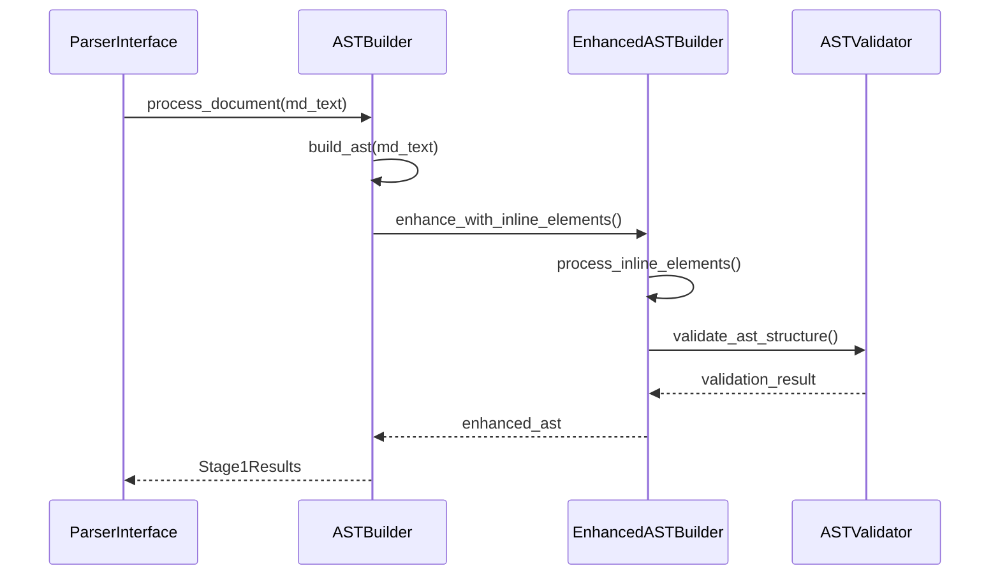

**Diagram sources**
- [core.py](file://markdown_chunker/parser/core.py#L418-L510)

### Nesting Resolver Integration

The AST Builder coordinates with the NestingResolver to establish proper hierarchical relationships:

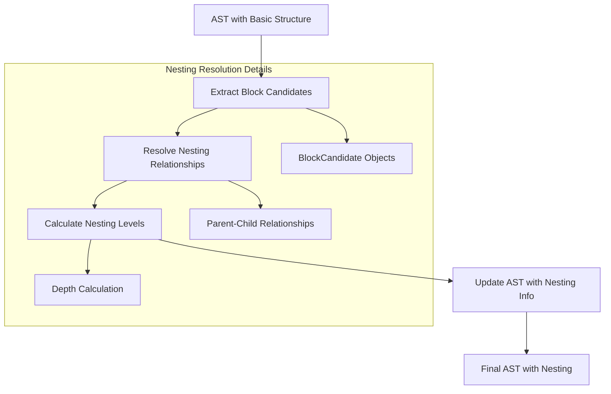

**Diagram sources**
- [nesting_resolver.py](file://markdown_chunker/parser/nesting_resolver.py#L74-L273)

### Analyzer Integration

The AST serves as input for the ContentAnalyzer, enabling comprehensive document analysis:

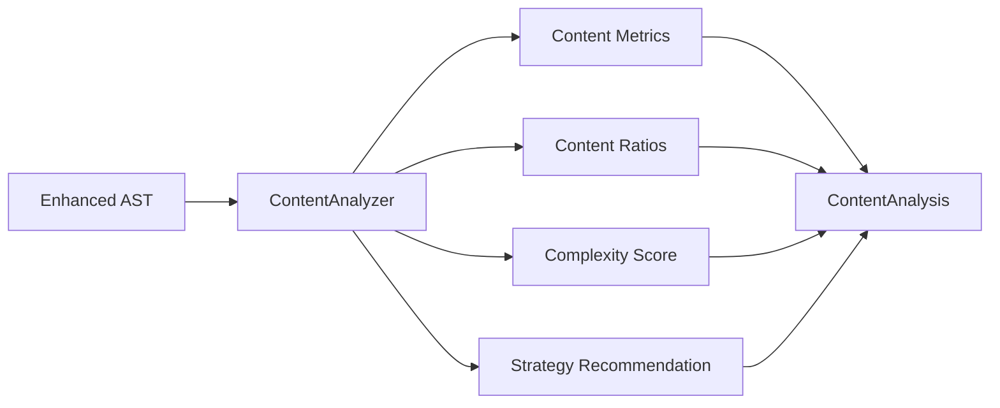

**Diagram sources**
- [analyzer.py](file://markdown_chunker/parser/analyzer.py#L18-L499)

**Section sources**
- [core.py](file://markdown_chunker/parser/core.py#L418-L510)
- [nesting_resolver.py](file://markdown_chunker/parser/nesting_resolver.py#L182-L202)

## Performance Optimization

### Immutable Design Pattern

The AST Builder implements an immutable design pattern that ensures thread safety and prevents accidental modifications:

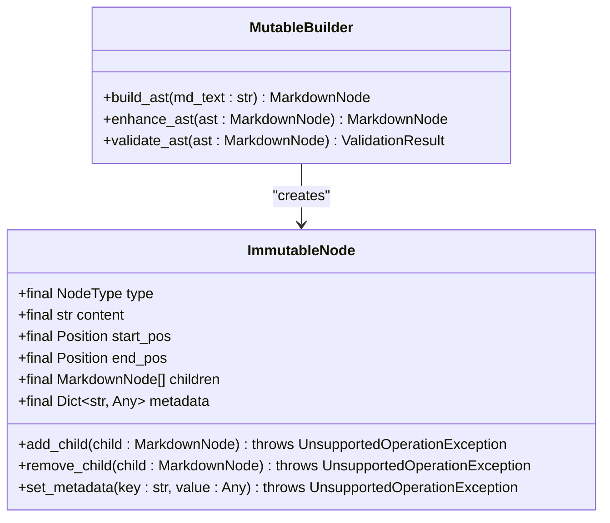

### Memory Optimization Strategies

The AST Builder employs several memory optimization techniques:

1. **Lazy Loading**: Child nodes are created only when accessed
2. **Position Caching**: Line offsets are pre-calculated and cached
3. **Metadata Sharing**: Common metadata is shared among similar nodes
4. **Garbage Collection**: Unnecessary intermediate objects are promptly released

### Parsing Performance

The dual-parser architecture optimizes performance based on content characteristics:

| Parser | Strengths | Optimal Use Cases |
|--------|-----------|-------------------|
| markdown-it-py | Fastest, comprehensive | General-purpose parsing |
| Mistune | Lightweight, simple | Small documents, fallback |
| CommonMark | Standards-compliant | Strict compliance scenarios |

**Section sources**
- [ast.py](file://markdown_chunker/parser/ast.py#L114-L140)

## Error Handling and Validation

### Comprehensive Validation System

The AST Builder implements a multi-layered validation system that ensures AST integrity:

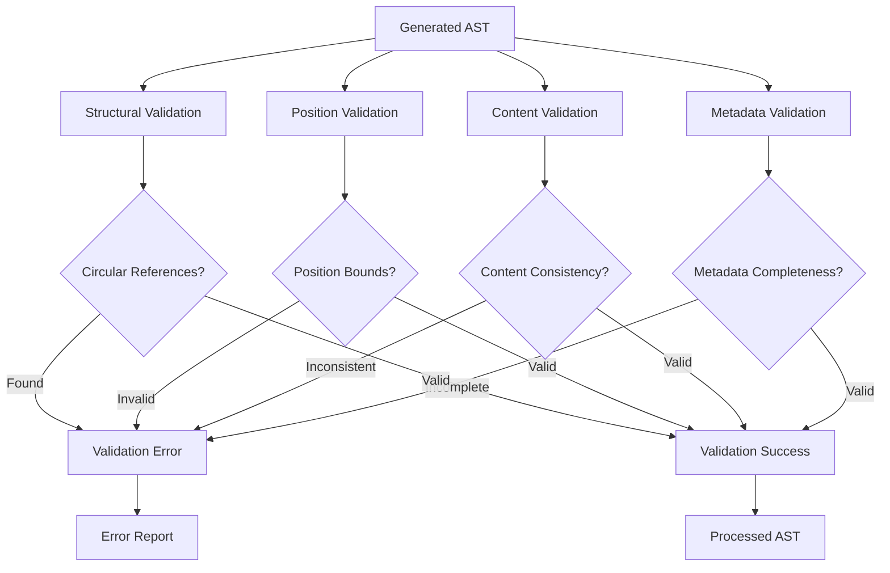

**Diagram sources**
- [enhanced_ast_builder.py](file://markdown_chunker/parser/enhanced_ast_builder.py#L447-L651)

### Error Recovery Mechanisms

The system implements graceful error recovery for malformed syntax:

1. **Token-Level Recovery**: Individual tokens are skipped when malformed
2. **Node-Level Recovery**: Entire nodes are reconstructed when corrupted
3. **AST-Level Recovery**: Complete AST reconstruction using fallback parsers
4. **Graceful Degradation**: Reduced functionality with preserved core structure

### Validation Rules

The validation system enforces the following rules:

| Rule Category | Validation Criteria | Consequences |
|---------------|-------------------|--------------|
| Structural | No circular references, proper parent-child relationships | AST reconstruction |
| Positional | Positions within document bounds, no overlaps | Position correction |
| Content | Content matches node type, consistent with children | Content normalization |
| Metadata | Required fields present, valid values | Metadata enhancement |

**Section sources**
- [enhanced_ast_builder.py](file://markdown_chunker/parser/enhanced_ast_builder.py#L447-L651)

## Usage Examples

### Basic AST Construction

```python
from markdown_chunker.parser.ast import ASTBuilder

# Initialize ASTBuilder
builder = ASTBuilder(parser_name="markdown-it-py")

# Build AST from Markdown
md_text = """
# Introduction

This is a **simple** example.

## Details

- Item 1
- Item 2

```python
def hello():
    print("Hello, world!")
```
"""

ast = builder.build(md_text)
```

### Enhanced AST with Inline Processing

```python
from markdown_chunker.parser.enhanced_ast_builder import EnhancedASTBuilder

# Initialize EnhancedASTBuilder
enhanced_builder = EnhancedASTBuilder()

# Build enhanced AST
enhanced_ast = enhanced_builder.build_ast(md_text)

# Access enhanced features
for node in enhanced_ast.find_descendants("TEXT"):
    if node.has_inline_elements():
        inline_elements = node.get_inline_elements()
        # Process inline elements
```

### Position-Aware Processing

```python
# Access position information
for node in enhanced_ast.find_descendants("CODE_BLOCK"):
    start_line, end_line = node.get_line_range()
    content = node.content
    
    print(f"Code block from line {start_line} to {end_line}")
    print(f"Content: {content}")
```

### Nesting Analysis

```python
# Analyze nesting structure
def analyze_nesting(node, level=0):
    print(f"{'  ' * level}{node.type} (depth: {level})")
    
    for child in node.children:
        analyze_nesting(child, level + 1)

analyze_nesting(enhanced_ast)
```

**Section sources**
- [test_ast_new.py](file://tests/parser/test_ast_new.py#L141-L337)

## Best Practices

### Parser Selection Guidelines

Choose the appropriate parser based on your requirements:

1. **markdown-it-py**: Use for general-purpose parsing with comprehensive feature support
2. **Mistune**: Use for lightweight parsing or when minimal dependencies are required
3. **CommonMark**: Use for strict CommonMark compliance

### Performance Considerations

1. **Reuse ASTBuilders**: Create one builder instance for multiple documents
2. **Batch Processing**: Process multiple documents together when possible
3. **Memory Management**: Clear references to large ASTs when no longer needed
4. **Validation Timing**: Perform validation only when necessary

### Error Handling Strategies

1. **Graceful Degradation**: Always provide fallback parsing options
2. **Incremental Validation**: Validate AST structure progressively
3. **Error Reporting**: Collect detailed error information for debugging
4. **Recovery Logging**: Log recovery actions for monitoring

### Integration Patterns

1. **Pipeline Architecture**: Use AST Builder as part of a larger parsing pipeline
2. **Plugin Design**: Design AST extensions as plugins for modularity
3. **Configuration Management**: Centralize parser configuration for consistency
4. **Testing Strategy**: Implement comprehensive AST validation tests

### Metadata Utilization

1. **Structured Metadata**: Use consistent metadata schemas across nodes
2. **Indexing Support**: Leverage metadata for efficient document indexing
3. **Search Optimization**: Utilize position metadata for fast search operations
4. **Analysis Enhancement**: Combine multiple metadata sources for richer analysis

**Section sources**
- [ast.py](file://markdown_chunker/parser/ast.py#L114-L140)
- [enhanced_ast_builder.py](file://markdown_chunker/parser/enhanced_ast_builder.py#L319-L651)