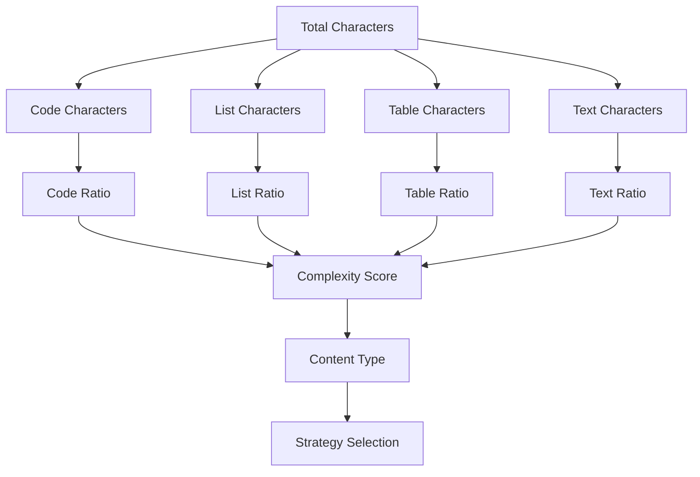

# Content Analyzer

<cite>
**Referenced Files in This Document**
- [analyzer.py](file://markdown_chunker/parser/analyzer.py)
- [preamble.py](file://markdown_chunker/parser/preamble.py)
- [types.py](file://markdown_chunker/parser/types.py)
- [selector.py](file://markdown_chunker/chunker/selector.py)
- [core.py](file://markdown_chunker/parser/core.py)
- [code_heavy.md](file://tests/fixtures/code_heavy.md)
- [list_heavy.md](file://tests/fixtures/list_heavy.md)
- [test_content_analysis_properties.py](file://tests/parser/test_content_analysis_properties.py)
- [test_preamble.py](file://tests/parser/test_preamble.py)
</cite>

## Table of Contents
1. [Introduction](#introduction)
2. [Architecture Overview](#architecture-overview)
3. [Core Components](#core-components)
4. [Content Analysis Metrics](#content-analysis-metrics)
5. [Preamble Detection Logic](#preamble-detection-logic)
6. [Strategy Selection Integration](#strategy-selection-integration)
7. [Stage 1 Results Packaging](#stage-1-results-packaging)
8. [Example Scenarios](#example-scenarios)
9. [Performance Considerations](#performance-considerations)
10. [Testing and Validation](#testing-and-validation)

## Introduction

The Content Analyzer is a critical component of the Parser Module that performs comprehensive content analysis on Markdown documents to extract structural metrics and classify content types. It serves as the foundation for intelligent chunking strategy selection by providing quantitative measurements of document characteristics such as code ratio, list density, table count, and structural complexity.

The analyzer operates as part of Stage 1 processing, working alongside AST construction and fenced block extraction to provide the Strategy Selector with essential data for optimal chunking decisions. Its sophisticated metric calculation system enables the system to adaptively choose between specialized strategies like code-heavy, list-heavy, mixed-content, or sentence-based chunking.

## Architecture Overview

The Content Analyzer follows a modular architecture with clear separation of concerns:

**Diagram sources**
- [analyzer.py](file://markdown_chunker/parser/analyzer.py#L18-L499)
- [types.py](file://markdown_chunker/parser/types.py#L437-L800)

**Section sources**
- [analyzer.py](file://markdown_chunker/parser/analyzer.py#L18-L499)
- [types.py](file://markdown_chunker/parser/types.py#L437-L800)

## Core Components

### ContentAnalyzer Class

The main analyzer class provides comprehensive content analysis capabilities with configurable thresholds and sophisticated metric calculations.

**Diagram sources**
- [analyzer.py](file://markdown_chunker/parser/analyzer.py#L18-L499)
- [preamble.py](file://markdown_chunker/parser/preamble.py#L79-L343)
- [types.py](file://markdown_chunker/parser/types.py#L437-L800)

### Threshold Configuration

The analyzer uses carefully calibrated thresholds based on technical specifications:

| Metric | Threshold | Purpose |
|--------|-----------|---------|
| Code Ratio | 0.7 | Identifies code-heavy documents |
| List Ratio | 0.6 | Identifies list-heavy documents |
| Mixed Content | 0.3 | Detects content diversity |

These thresholds enable the system to make informed decisions about content categorization and strategy selection.

**Section sources**
- [analyzer.py](file://markdown_chunker/parser/analyzer.py#L22-L26)
- [analyzer.py](file://markdown_chunker/parser/analyzer.py#L278-L294)

## Content Analysis Metrics

### Core Metrics Calculation

The analyzer calculates comprehensive metrics that inform chunking strategy selection:

#### Content Type Ratios

**Diagram sources**
- [analyzer.py](file://markdown_chunker/parser/analyzer.py#L50-L66)

#### Structural Complexity Metrics

The complexity score calculation considers multiple factors:

1. **Structural Complexity** (0-0.3): Based on header depth and nested list depth
2. **Content Complexity** (0-0.4): Based on code presence and mixed content
3. **Size Complexity** (0-0.3): Based on document length thresholds

#### Advanced Metrics

The analyzer tracks numerous specialized metrics:

- **Inline Code Count**: Backtick-enclosed code within text
- **Punctuation Ratio**: Frequency of punctuation marks
- **Special Character Distribution**: Usage patterns of Markdown syntax
- **Header Distribution**: Count by level (1-6)
- **Language Diversity**: Unique programming languages detected

**Section sources**
- [analyzer.py](file://markdown_chunker/parser/analyzer.py#L245-L276)
- [analyzer.py](file://markdown_chunker/parser/analyzer.py#L50-L156)

## Preamble Detection Logic

### Preamble Extraction Architecture

The preamble extraction system identifies and classifies content before the first header, which often contains valuable metadata and introductory information.

**Diagram sources**
- [preamble.py](file://markdown_chunker/parser/preamble.py#L122-L178)
- [analyzer.py](file://markdown_chunker/parser/analyzer.py#L175-L178)

### Preamble Classification System

The system classifies preambles into four categories:

| Type | Description | Detection Criteria |
|------|-------------|-------------------|
| Introduction | Introductory text | Contains introduction keywords |
| Summary | Document summary | Contains TL;DR, abstract keywords |
| Metadata | Structured information | Author, date, version patterns |
| General | Other content | Default classification |

### Metadata Pattern Recognition

The preamble extractor recognizes structured metadata using regular expressions:

- **Author**: `author: John Doe`
- **Date**: `date: 2025-11-10`
- **Version**: `version: 1.0`
- **Title**: `title: Document Title`
- **Description**: `description: Brief description`

**Section sources**
- [preamble.py](file://markdown_chunker/parser/preamble.py#L79-L343)
- [analyzer.py](file://markdown_chunker/parser/analyzer.py#L296-L499)

## Strategy Selection Integration

### Strategy Selection Workflow

The Content Analyzer integrates seamlessly with the Strategy Selector to provide optimal chunking recommendations:

**Diagram sources**
- [selector.py](file://markdown_chunker/chunker/selector.py#L58-L133)
- [types.py](file://markdown_chunker/parser/types.py#L636-L649)

### Strategy Recommendation Logic

The Content Analyzer provides key metrics that influence strategy selection:

| Content Type | Strategy | Threshold Conditions |
|--------------|----------|---------------------|
| Code Heavy | Code Strategy | `code_ratio >= 0.7 && code_blocks >= 3` |
| Mixed | Mixed Strategy | `has_mixed_content && complexity_score >= 0.3` |
| List Heavy | List Strategy | `list_count >= 5 || list_ratio > 0.6` |
| Table Heavy | Table Strategy | `table_count >= 3 || table_ratio > 0.4` |
| Structured | Structural Strategy | `headers >= 3 && max_depth > 1` |
| Plain Text | Sentence Strategy | Default fallback |

**Section sources**
- [types.py](file://markdown_chunker/parser/types.py#L636-L649)
- [selector.py](file://markdown_chunker/chunker/selector.py#L58-L133)

## Stage 1 Results Packaging

### Stage1Results Integration

The Content Analyzer's analysis results are seamlessly integrated into the Stage1Results structure, providing a comprehensive package for downstream processing:

**Diagram sources**
- [types.py](file://markdown_chunker/parser/types.py#L888-L930)
- [types.py](file://markdown_chunker/parser/types.py#L437-L800)

### Validation and Quality Assurance

The Stage1Results undergo comprehensive validation to ensure data integrity:

- **Consistency Checks**: Ratio sums, count validations
- **Structure Integrity**: AST completeness, element matching
- **Cross-Component Validation**: Analysis vs. AST vs. fenced blocks
- **Error Collection**: Comprehensive error reporting

**Section sources**
- [types.py](file://markdown_chunker/parser/types.py#L888-L930)
- [core.py](file://markdown_chunker/parser/core.py#L466-L510)

## Example Scenarios

### Code-Heavy Document Analysis

For a document like [`code_heavy.md`](file://tests/fixtures/code_heavy.md):

**Analysis Characteristics:**
- High code ratio (>0.7 threshold)
- Multiple programming languages detected
- Minimal text content relative to code
- Structured headers with code examples

**Strategy Impact:**
- Recommended strategy: Code Strategy
- Preserves code blocks as atomic units
- Maintains language context and syntax highlighting
- Optimizes for developer-friendly chunking

### List-Heavy Document Analysis

For a document like [`list_heavy.md`](file://tests/fixtures/list_heavy.md):

**Analysis Characteristics:**
- High list ratio (>0.6 threshold)
- Multiple nested lists with varying depths
- Task lists and bullet points dominate content
- Minimal code and table content

**Strategy Impact:**
- Recommended strategy: List Strategy
- Groups related list items together
- Maintains list hierarchy and structure
- Preserves task completion context

### Mixed Content Document Behavior

Mixed content documents trigger sophisticated analysis:

**Detection Factors:**
- Multiple content types present (code, lists, tables)
- Balanced ratios requiring adaptive strategies
- Complex structural requirements

**Strategy Adaptation:**
- Falls back to Mixed Strategy for balanced approaches
- Considers complexity score for optimal chunking
- Balances preservation of different content types

**Section sources**
- [code_heavy.md](file://tests/fixtures/code_heavy.md#L1-L74)
- [list_heavy.md](file://tests/fixtures/list_heavy.md#L1-L53)
- [analyzer.py](file://markdown_chunker/parser/analyzer.py#L278-L294)

## Performance Considerations

### Computational Efficiency

The Content Analyzer is designed for optimal performance:

- **Linear Time Complexity**: Single-pass analysis of document content
- **Memory Efficient**: Streaming processing without full document duplication
- **Lazy Evaluation**: Deferred processing of optional components
- **Threshold-Based Short-Circuiting**: Early termination for extreme cases

### Scalability Features

- **Incremental Processing**: Can analyze partial content efficiently
- **Configurable Thresholds**: Adaptive sensitivity for different document types
- **Parallel Processing Ready**: Modular design supports concurrent analysis
- **Resource Management**: Controlled memory usage for large documents

### Optimization Strategies

The analyzer employs several optimization techniques:

1. **Pattern Compilation**: Pre-compiled regular expressions for preamble detection
2. **Cached Calculations**: Memoized metric computations where beneficial
3. **Early Termination**: Quick rejection for clearly dominated content types
4. **Streaming Analysis**: Process content without loading entire document into memory

## Testing and Validation

### Property-Based Testing

The Content Analyzer undergoes rigorous property-based testing to ensure reliability:

**Diagram sources**
- [test_content_analysis_properties.py](file://tests/parser/test_content_analysis_properties.py#L100-L200)

### Validation Framework

Comprehensive validation ensures data quality:

- **Metric Consistency**: All ratios sum to 1.0 within tolerance
- **Count Verification**: Element counts match detected structures
- **Type Safety**: Proper data type enforcement
- **Boundary Checking**: Edge case handling for empty documents

### Integration Testing

The analyzer participates in end-to-end pipeline testing:

- **Full Pipeline Validation**: Complete document processing chain
- **Strategy Selection Accuracy**: Correct strategy recommendation
- **Error Recovery**: Graceful handling of malformed content
- **Performance Benchmarks**: Consistent processing times

**Section sources**
- [test_content_analysis_properties.py](file://tests/parser/test_content_analysis_properties.py#L100-L200)
- [test_preamble.py](file://tests/parser/test_preamble.py#L131-L200)