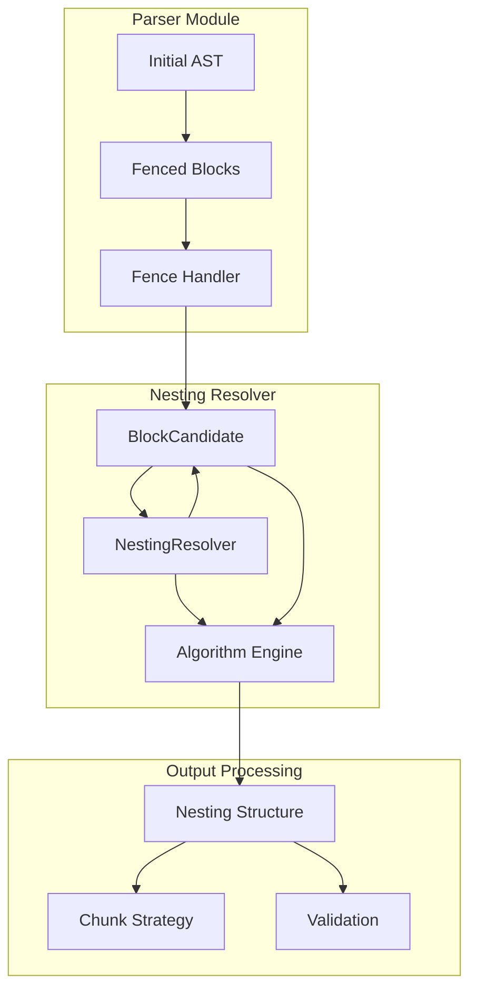
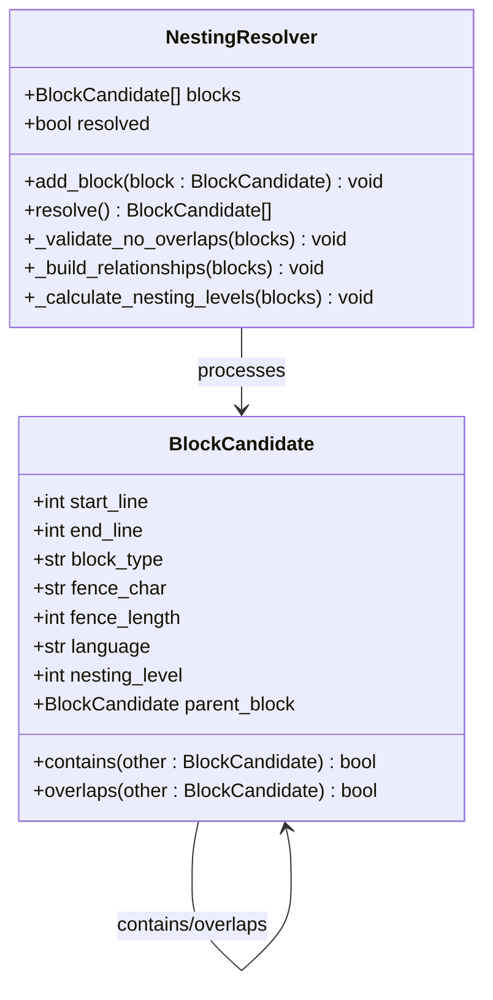
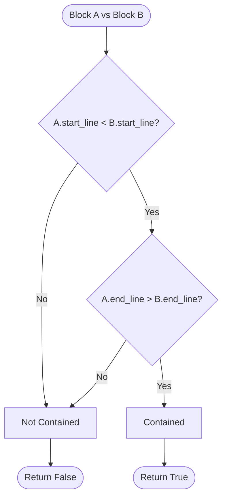
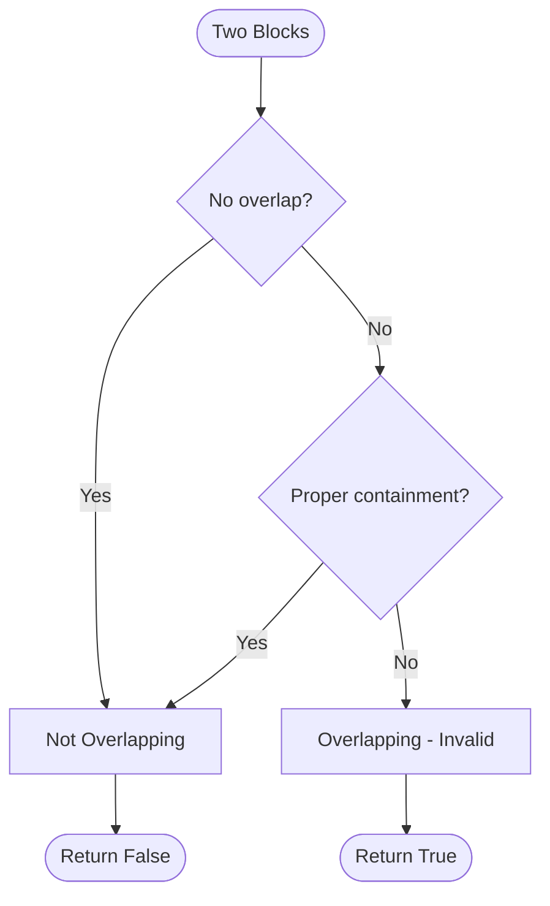
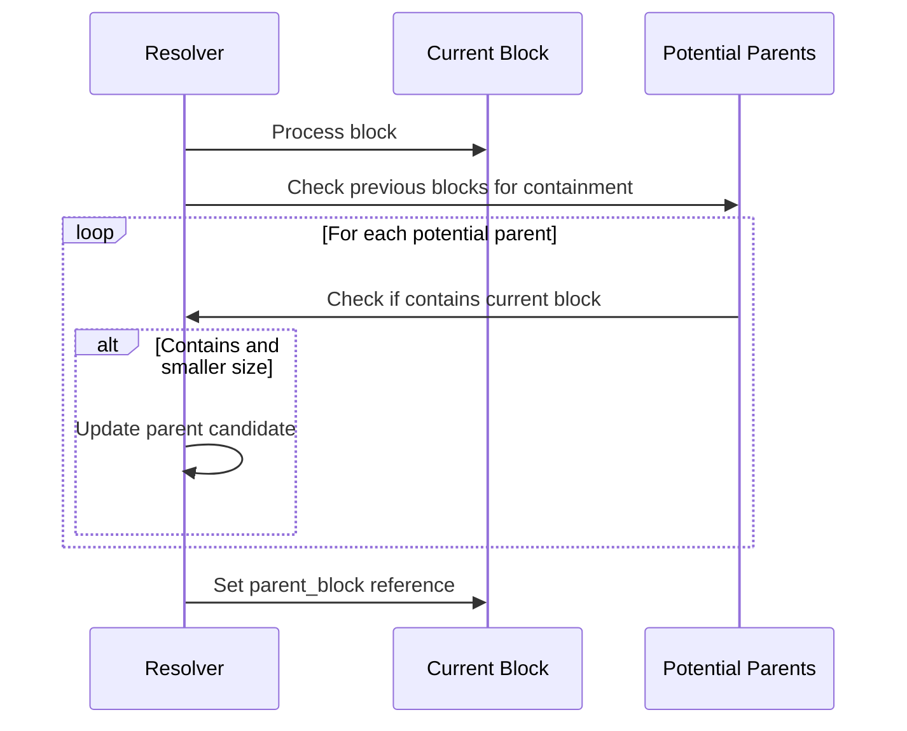
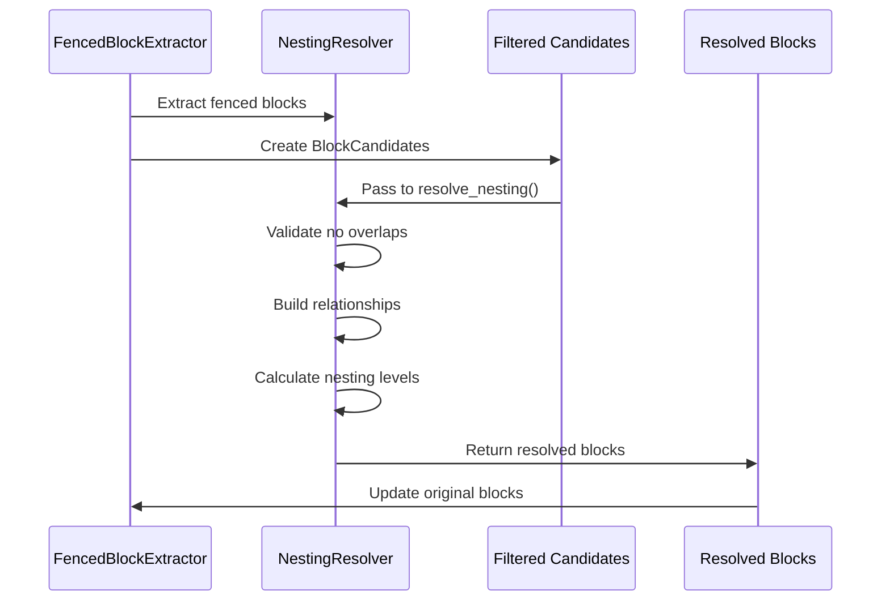
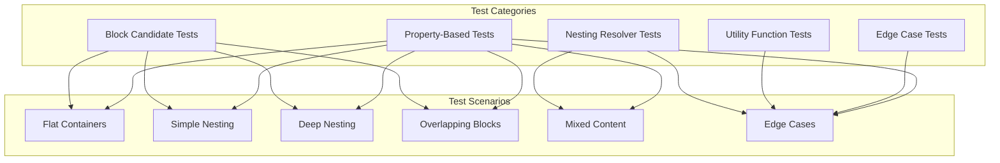

# Nesting Resolver

<cite>
**Referenced Files in This Document**
- [nesting_resolver.py](file://markdown_chunker/parser/nesting_resolver.py)
- [test_nesting_resolver.py](file://tests/parser/test_nesting_resolver.py)
- [core.py](file://markdown_chunker/parser/core.py)
- [fence_handler.py](file://markdown_chunker/parser/fence_handler.py)
- [enhanced_ast_builder.py](file://markdown_chunker/parser/enhanced_ast_builder.py)
- [code_in_list.md](file://tests/parser/fixtures/nested/code_in_list.md)
- [table_in_list.md](file://tests/parser/fixtures/nested/table_in_list.md)
- [mixed_fence_lengths.md](file://tests/parser/fixtures/edge_cases/mixed_fence_lengths.md)
- [tabs_vs_spaces.md](file://tests/parser/fixtures/edge_cases/tabs_vs_spaces.md)
- [unclosed_fence.md](file://tests/parser/fixtures/edge_cases/unclosed_fence.md)
- [test_enhanced_nesting.py](file://tests/parser/test_enhanced_nesting.py)
</cite>

## Table of Contents
1. [Introduction](#introduction)
2. [Architecture Overview](#architecture-overview)
3. [Core Components](#core-components)
4. [Nesting Detection Algorithms](#nesting-detection-algorithms)
5. [Integration with Parser Pipeline](#integration-with-parser-pipeline)
6. [Edge Case Handling](#edge-case-handling)
7. [Performance Considerations](#performance-considerations)
8. [Testing and Validation](#testing-and-validation)
9. [Troubleshooting Guide](#troubleshooting-guide)
10. [Conclusion](#conclusion)

## Introduction

The Nesting Resolver is a critical component of the Parser Module responsible for detecting, analyzing, and correcting complex nested structures in Markdown documents. It specifically addresses challenging scenarios involving code blocks within lists, tables inside list items, deeply nested fences, and mixed block types that violate Markdown specification rules.

The resolver operates on the initial Abstract Syntax Tree (AST) produced by the parser, identifying parent-child relationships across different block types and repairing incorrect hierarchies to ensure structural integrity for downstream chunking operations. It transforms raw fenced block candidates into properly structured nesting relationships with accurate nesting levels and parent-child associations.

## Architecture Overview

The Nesting Resolver follows a modular architecture that integrates seamlessly with the broader parsing pipeline while maintaining independence for complex nesting scenarios.



**Diagram sources**
- [core.py](file://markdown_chunker/parser/core.py#L136-L170)
- [nesting_resolver.py](file://markdown_chunker/parser/nesting_resolver.py#L74-L273)

**Section sources**
- [core.py](file://markdown_chunker/parser/core.py#L136-L170)
- [nesting_resolver.py](file://markdown_chunker/parser/nesting_resolver.py#L74-L273)

## Core Components

### BlockCandidate Class

The `BlockCandidate` class serves as the fundamental data structure representing fenced blocks during the nesting resolution process. It encapsulates all necessary information for determining containment relationships and nesting hierarchies.



**Diagram sources**
- [nesting_resolver.py](file://markdown_chunker/parser/nesting_resolver.py#L15-L72)
- [nesting_resolver.py](file://markdown_chunker/parser/nesting_resolver.py#L74-L273)

### NestingResolver Class

The `NestingResolver` class implements the core nesting resolution algorithm, providing methods for validating, building relationships, and calculating nesting levels for block candidates.

**Key Features:**
- **Containment Detection**: Determines which blocks contain others using line number ranges
- **Overlap Validation**: Ensures no invalid overlapping between blocks
- **Parent-Child Relationship Building**: Establishes proper hierarchical relationships
- **Nesting Level Calculation**: Computes accurate nesting depths for all blocks

**Section sources**
- [nesting_resolver.py](file://markdown_chunker/parser/nesting_resolver.py#L74-L273)

## Nesting Detection Algorithms

### Containment Relationship Detection

The resolver uses a sophisticated containment algorithm to determine parent-child relationships between blocks. The `contains()` method implements strict containment checking:



**Diagram sources**
- [nesting_resolver.py](file://markdown_chunker/parser/nesting_resolver.py#L40-L50)

### Overlap Detection Algorithm

The `overlaps()` method identifies invalid nesting scenarios where blocks intersect improperly:



**Diagram sources**
- [nesting_resolver.py](file://markdown_chunker/parser/nesting_resolver.py#L52-L71)

### Parent-Child Relationship Building

The resolver employs a greedy algorithm to establish parent-child relationships, selecting the smallest containing block as the immediate parent:



**Diagram sources**
- [nesting_resolver.py](file://markdown_chunker/parser/nesting_resolver.py#L145-L166)

**Section sources**
- [nesting_resolver.py](file://markdown_chunker/parser/nesting_resolver.py#L40-L71)
- [nesting_resolver.py](file://markdown_chunker/parser/nesting_resolver.py#L145-L166)

## Integration with Parser Pipeline

### Fenced Block Extraction Integration

The Nesting Resolver integrates with the Fenced Block Extractor in the core parsing pipeline, receiving `BlockCandidate` objects and returning resolved nesting structures.



**Diagram sources**
- [core.py](file://markdown_chunker/parser/core.py#L136-L170)
- [nesting_resolver.py](file://markdown_chunker/parser/nesting_resolver.py#L182-L202)

### Fence Handler Coordination

The Nesting Resolver coordinates with the Fence Handler to ensure proper fence structure validation and indentation handling:

| Component | Responsibility | Integration Point |
|-----------|---------------|-------------------|
| Fence Handler | Validates fence syntax, indentation, and length | Pre-processing of block candidates |
| Nesting Resolver | Detects containment relationships and repairs hierarchies | Post-fence validation |
| AST Builder | Constructs final AST with nesting information | Final integration point |

**Section sources**
- [core.py](file://markdown_chunker/parser/core.py#L136-L170)
- [fence_handler.py](file://markdown_chunker/parser/fence_handler.py#L1-L306)

## Edge Case Handling

### Mixed Fence Lengths

The resolver handles documents with varying fence lengths by preserving nested content within outer blocks rather than creating separate blocks for each fence type.

**Example Scenario:**
- Four backticks (` ```` `) enclosing three backticks (` ``` `)
- Five backticks (` ````` `) enclosing four backticks (` ```` `)

**Resolution Strategy:**
- Creates single outer block with nested fence markers preserved as content
- Maintains proper nesting semantics without fragmenting the document structure

### Unclosed Fences

The resolver gracefully handles unclosed fences by treating them as part of the containing block's content:

**Example:**
```markdown
```python
def function():
    return "unclosed code"
# Note: This fence is not closed!
```

**Resolution Approach:**
- Outer fence block is created normally
- Unclosed content remains within the outer block's content
- Error collection provides warnings for unclosed structures

### Tabs vs Spaces Indentation

The resolver accounts for indentation differences between tabs and spaces in fence detection:

**Indentation Calculation:**
- Spaces count as 1 character each
- Tabs count as 4 spaces each
- Comparison uses effective indentation width

**Section sources**
- [mixed_fence_lengths.md](file://tests/parser/fixtures/edge_cases/mixed_fence_lengths.md#L1-L19)
- [unclosed_fence.md](file://tests/parser/fixtures/edge_cases/unclosed_fence.md#L1-L8)
- [tabs_vs_spaces.md](file://tests/parser/fixtures/edge_cases/tabs_vs_spaces.md#L1-L11)

## Performance Considerations

### Algorithmic Complexity

The nesting resolution algorithm has O(n²) complexity in the worst case, where n is the number of blocks:

| Operation | Time Complexity | Space Complexity |
|-----------|----------------|------------------|
| Containment Check | O(1) per pair | O(1) |
| Overlap Validation | O(n²) | O(1) |
| Parent Relationship Building | O(n²) | O(1) |
| Nesting Level Calculation | O(n × h) | O(1) |

Where h is the maximum nesting depth.

### Optimization Strategies

1. **Early Termination**: Validation stops immediately upon detecting invalid nesting
2. **Sorted Processing**: Blocks processed in line number order to optimize containment checks
3. **Lazy Evaluation**: Nesting levels calculated only when needed

### Memory Management

The resolver maintains minimal memory overhead by:
- Processing blocks in-place
- Using efficient containment checking
- Avoiding recursive algorithms for nesting level calculation

**Section sources**
- [nesting_resolver.py](file://markdown_chunker/parser/nesting_resolver.py#L110-L125)
- [nesting_resolver.py](file://markdown_chunker/parser/nesting_resolver.py#L166-L179)

## Testing and Validation

### Comprehensive Test Suite

The Nesting Resolver includes extensive test coverage for various scenarios:



**Diagram sources**
- [test_nesting_resolver.py](file://tests/parser/test_nesting_resolver.py#L1-L346)
- [test_enhanced_nesting.py](file://tests/parser/test_enhanced_nesting.py#L1-L299)

### Property-Based Testing

The resolver includes property-based tests that validate fundamental nesting properties:

| Property | Description | Validation Method |
|----------|-------------|-------------------|
| Deterministic Resolution | Same input produces same output | Repeat resolution tests |
| Nesting Level Consistency | Child levels are parent + 1 | Arithmetic validation |
| Complete Information | All blocks have nesting info | Attribute presence checks |
| No Overlaps | Invalid overlaps are rejected | Exception validation |

**Section sources**
- [test_nesting_resolver.py](file://tests/parser/test_nesting_resolver.py#L1-L346)
- [test_enhanced_nesting.py](file://tests/parser/test_enhanced_nesting.py#L1-L299)

## Troubleshooting Guide

### Common Issues and Solutions

#### Invalid Nesting Errors

**Problem**: `ValueError: Invalid nesting: blocks overlap at lines X-Y and Z-W`

**Causes:**
- Overlapping fenced blocks
- Improper fence indentation
- Mixed fence types with incompatible structures

**Solutions:**
1. Review fence indentation consistency
2. Ensure proper fence closure
3. Check for overlapping block boundaries

#### Unexpected Nesting Levels

**Problem**: Blocks have unexpected nesting levels (e.g., level 2 when expecting level 1)

**Diagnosis Steps:**
1. Verify block boundaries (start/end lines)
2. Check for hidden overlapping blocks
3. Examine parent-child relationships

**Section sources**
- [test_nesting_resolver.py](file://tests/parser/test_nesting_resolver.py#L141-L148)

### Debugging Techniques

#### Block Inspection

Use utility functions to inspect nesting structures:

```python
# Get blocks organized by nesting level
tree = get_nesting_tree(resolved_blocks)

# Get children of a specific block
children = get_children(parent_block, all_blocks)

# Find maximum nesting depth
depth = get_max_nesting_depth(resolved_blocks)
```

#### Validation Tools

```python
# Validate nesting consistency
is_valid = validate_block_nesting(resolved_blocks)

# Manual nesting resolution
resolved = resolve_nesting(block_candidates)
```

**Section sources**
- [nesting_resolver.py](file://markdown_chunker/parser/nesting_resolver.py#L223-L273)

## Conclusion

The Nesting Resolver represents a sophisticated solution for handling complex nested structures in Markdown documents. By providing robust containment detection, overlap validation, and hierarchical relationship building, it ensures that downstream chunking operations receive properly structured content.

Key strengths of the implementation include:

- **Robust Error Handling**: Graceful degradation for invalid nesting scenarios
- **Performance Optimization**: Efficient algorithms for large document processing
- **Comprehensive Edge Case Coverage**: Support for mixed fence types, indentation variations, and unclosed structures
- **Integration Flexibility**: Seamless coordination with the broader parsing pipeline

The resolver's design prioritizes correctness over completeness, ensuring that even malformed Markdown documents produce predictable and usable nesting structures for content chunking operations.

Future enhancements could include:
- Parallel processing for large documents
- Advanced heuristic detection for ambiguous nesting scenarios
- Enhanced visualization tools for nesting structure debugging