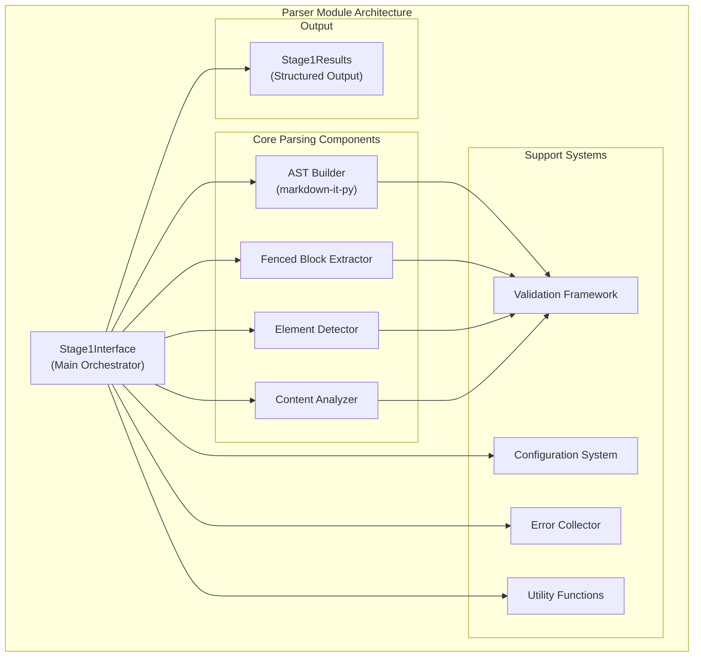
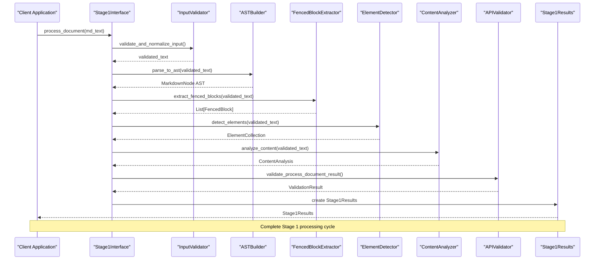
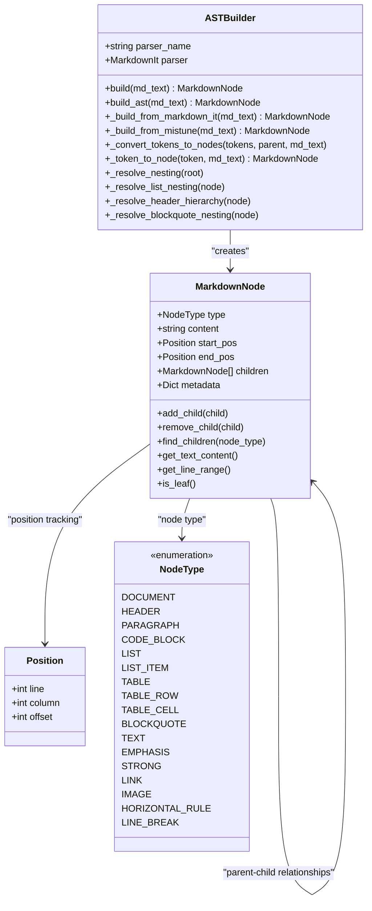
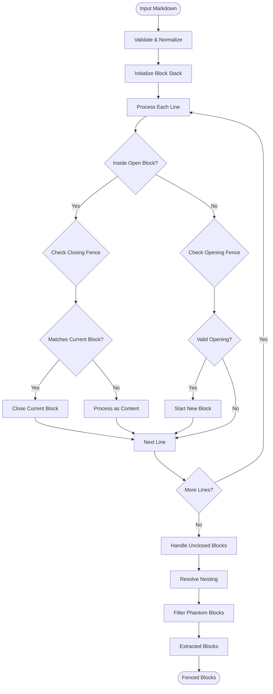
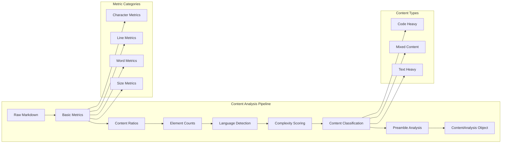
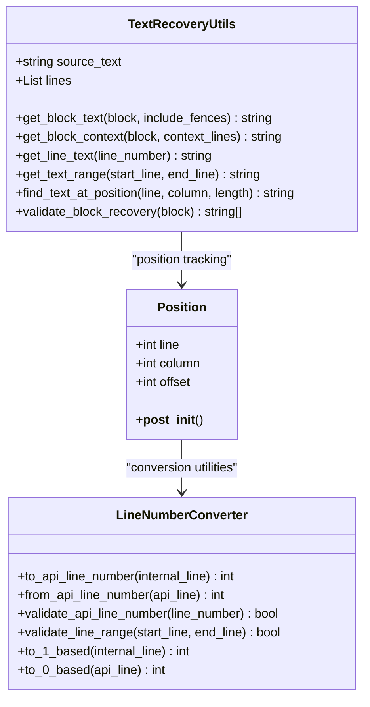
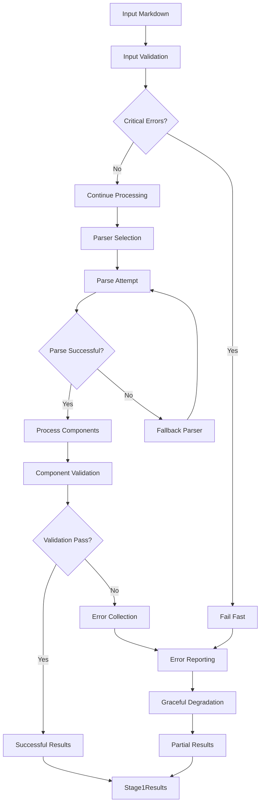
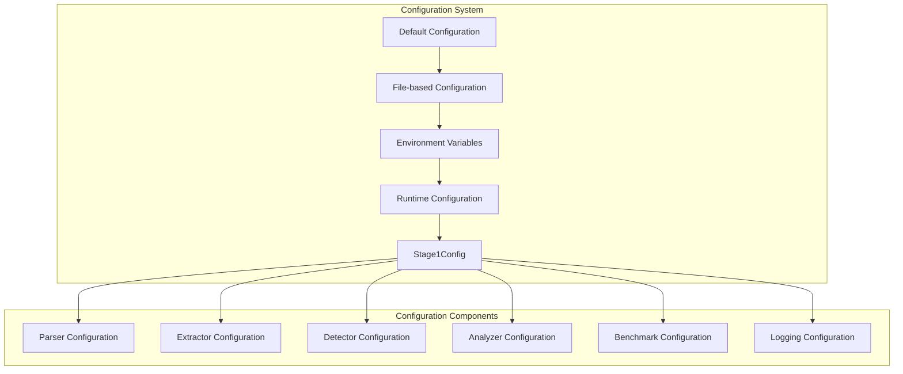
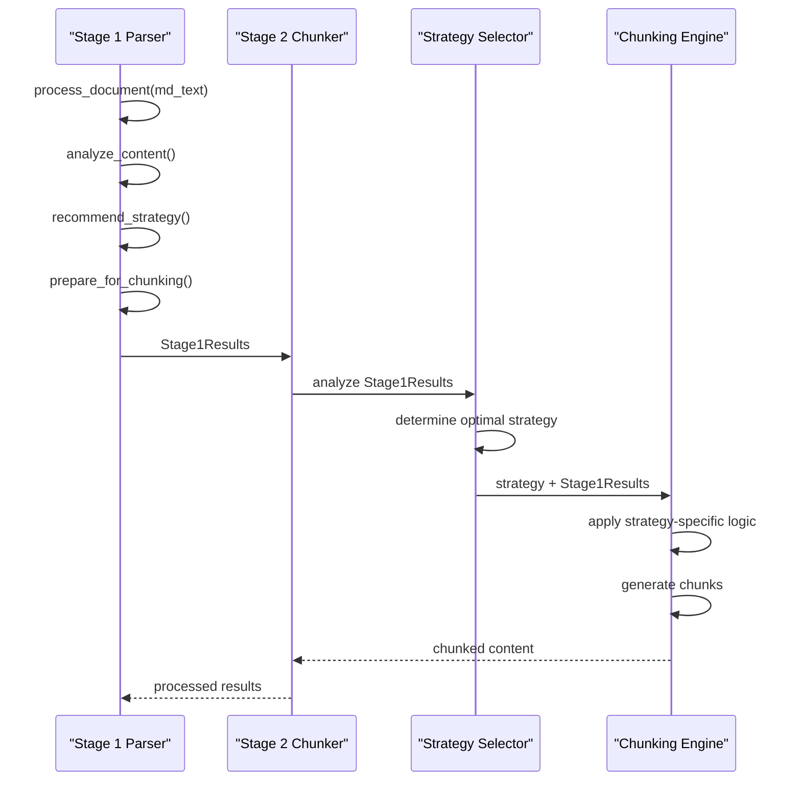

# Parser Module

<cite>
**Referenced Files in This Document**
- [markdown_chunker/parser/__init__.py](file://markdown_chunker/parser/__init__.py)
- [markdown_chunker/parser/core.py](file://markdown_chunker/parser/core.py)
- [markdown_chunker/parser/types.py](file://markdown_chunker/parser/types.py)
- [markdown_chunker/parser/ast.py](file://markdown_chunker/parser/ast.py)
- [markdown_chunker/parser/markdown_ast.py](file://markdown_chunker/parser/markdown_ast.py)
- [markdown_chunker/parser/analyzer.py](file://markdown_chunker/parser/analyzer.py)
- [markdown_chunker/parser/nesting_resolver.py](file://markdown_chunker/parser/nesting_resolver.py)
- [markdown_chunker/parser/fence_handler.py](file://markdown_chunker/parser/fence_handler.py)
- [markdown_chunker/parser/utils.py](file://markdown_chunker/parser/utils.py)
- [markdown_chunker/parser/preamble.py](file://markdown_chunker/parser/preamble.py)
- [markdown_chunker/parser/config.py](file://markdown_chunker/parser/config.py)
- [markdown_chunker/parser/validation.py](file://markdown_chunker/parser/validation.py)
</cite>

## Table of Contents
1. [Introduction](#introduction)
2. [Architecture Overview](#architecture-overview)
3. [Core Components](#core-components)
4. [Stage 1 Processing Pipeline](#stage-1-processing-pipeline)
5. [AST Generation and Management](#ast-generation-and-management)
6. [Fenced Block Extraction](#fenced-block-extraction)
7. [Content Analysis Engine](#content-analysis-engine)
8. [Position Tracking and Line Numbering](#position-tracking-and-line-numbering)
9. [Error Handling and Resilience](#error-handling-and-resilience)
10. [Configuration and Customization](#configuration-and-customization)
11. [Integration with Multi-Stage Pipeline](#integration-with-multi-stage-pipeline)
12. [Performance Considerations](#performance-considerations)
13. [Conclusion](#conclusion)

## Introduction

The Parser Module serves as the foundational stage (Stage 1) in the multi-stage processing pipeline of the Python Markdown Chunker. Its primary responsibility is to transform raw Markdown text into a structured Abstract Syntax Tree (AST) and perform comprehensive content analysis, setting the stage for intelligent chunking strategies in subsequent stages.

The module implements robust parsing capabilities using markdown-it-py as the primary parser, with fallback mechanisms to ensure reliability across diverse Markdown content. It excels at handling complex edge cases including nested fences, mixed list types, and intricate structural elements while maintaining precise position tracking and comprehensive error resilience.

## Architecture Overview

The Parser Module follows a modular architecture centered around the Stage1Interface, which orchestrates four primary subsystems:



**Diagram sources**
- [markdown_chunker/parser/core.py](file://markdown_chunker/parser/core.py#L401-L510)
- [markdown_chunker/parser/types.py](file://markdown_chunker/parser/types.py#L1-L50)

**Section sources**
- [markdown_chunker/parser/__init__.py](file://markdown_chunker/parser/__init__.py#L1-L241)
- [markdown_chunker/parser/core.py](file://markdown_chunker/parser/core.py#L1-L654)

## Core Components

### Stage1Interface - Central Orchestrator

The Stage1Interface acts as the primary entry point and coordinator for all parsing activities. It manages the complete Stage 1 processing workflow, ensuring seamless integration between components while maintaining error resilience and performance optimization.

Key responsibilities include:
- **Input Validation**: Comprehensive validation of incoming Markdown text
- **Component Orchestration**: Coordinating AST building, fenced block extraction, element detection, and content analysis
- **Error Management**: Centralized error collection and fallback mechanisms
- **Result Compilation**: Structuring parsed data into standardized Stage1Results
- **Strategy Recommendation**: Providing chunking strategy recommendations based on content analysis

### AST Builder - Robust Tree Construction

The AST Builder leverages markdown-it-py for reliable tree construction, with integrated nesting resolution capabilities. It transforms Markdown tokens into hierarchical node structures while preserving semantic relationships and position information.

Features:
- **Multi-Parser Support**: Automatic fallback between markdown-it-py, mistune, and commonmark
- **Position Preservation**: Accurate line and column tracking for precise element identification
- **Nesting Resolution**: Intelligent handling of nested structures including lists and code blocks
- **Token Conversion**: Efficient transformation of markdown-it tokens to internal node format

### Fenced Block Extractor - Precision Extraction

Specialized in identifying and extracting fenced code blocks with sophisticated nesting detection. Handles complex scenarios including mixed fence types, varying indentation levels, and edge cases that traditional parsers might miss.

Advanced capabilities:
- **Nested Fence Detection**: Identifies and resolves complex nesting relationships
- **Mixed Fence Types**: Handles both ``` and ~~~ fence styles simultaneously
- **Indentation Sensitivity**: Accounts for varying indentation levels in nested contexts
- **Phantom Block Prevention**: Filters out false positives and malformed block sequences

### Content Analyzer - Comprehensive Metrics

Performs detailed content analysis to classify document characteristics and inform chunking strategy selection. Calculates sophisticated metrics including content ratios, complexity scores, and structural depth indicators.

Analysis dimensions:
- **Content Type Classification**: Distinguishes between code-heavy, mixed, and text-heavy documents
- **Complexity Scoring**: Quantifies structural and content complexity for optimal strategy selection
- **Language Detection**: Identifies programming languages for specialized handling
- **Preamble Extraction**: Recognizes and categorizes pre-header content

**Section sources**
- [markdown_chunker/parser/core.py](file://markdown_chunker/parser/core.py#L401-L654)
- [markdown_chunker/parser/ast.py](file://markdown_chunker/parser/ast.py#L1-L297)
- [markdown_chunker/parser/analyzer.py](file://markdown_chunker/parser/analyzer.py#L1-L499)

## Stage 1 Processing Pipeline

The Stage 1 processing pipeline implements a sophisticated multi-phase approach that ensures comprehensive coverage of Markdown parsing requirements:



**Diagram sources**
- [markdown_chunker/parser/core.py](file://markdown_chunker/parser/core.py#L418-L510)
- [markdown_chunker/parser/validation.py](file://markdown_chunker/parser/validation.py#L175-L250)

### Phase 1: Input Processing
The pipeline begins with comprehensive input validation and normalization, ensuring consistent text formatting and encoding compliance. This phase establishes the foundation for reliable parsing by handling edge cases in text preprocessing.

### Phase 2: AST Construction
Robust AST generation using markdown-it-py with position preservation and nesting resolution. This phase creates the structural backbone for all subsequent analysis and extraction operations.

### Phase 3: Content Extraction
Parallel extraction of fenced blocks, structural elements, and content metrics. Each extraction component operates independently while contributing to the comprehensive understanding of document structure.

### Phase 4: Analysis and Validation
Comprehensive validation of extracted data with cross-component consistency checks. This phase ensures data integrity and provides confidence in downstream processing.

**Section sources**
- [markdown_chunker/parser/core.py](file://markdown_chunker/parser/core.py#L418-L510)
- [markdown_chunker/parser/validation.py](file://markdown_chunker/parser/validation.py#L175-L250)

## AST Generation and Management

The AST generation system implements a sophisticated tree construction mechanism that balances parsing accuracy with performance optimization:



**Diagram sources**
- [markdown_chunker/parser/types.py](file://markdown_chunker/parser/types.py#L18-L170)
- [markdown_chunker/parser/ast.py](file://markdown_chunker/parser/ast.py#L30-L297)

### Parser Selection Strategy
The system implements intelligent parser selection based on availability and capability:

| Parser | Priority | Strengths | Use Cases |
|--------|----------|-----------|-----------|
| markdown-it-py | 1 | Full feature support, position tracking | Production environments |
| mistune | 2 | Lightweight, good performance | Resource-constrained systems |
| commonmark | 3 | Standard compliance | Strict CommonMark adherence |

### Nesting Resolution Algorithm
The nesting resolution system handles complex structural relationships:

1. **List Nesting**: Recursive depth calculation with proper parent-child relationships
2. **Header Hierarchy**: Hierarchical structure with automatic parent-child linking
3. **Blockquote Nesting**: Depth-based classification with proper containment rules
4. **Overall Nesting**: Unified nesting level calculation across all node types

**Section sources**
- [markdown_chunker/parser/ast.py](file://markdown_chunker/parser/ast.py#L1-L297)
- [markdown_chunker/parser/markdown_ast.py](file://markdown_chunker/parser/markdown_ast.py#L1-L597)

## Fenced Block Extraction

The fenced block extraction system handles the most challenging aspects of Markdown parsing with precision and reliability:



**Diagram sources**
- [markdown_chunker/parser/core.py](file://markdown_chunker/parser/core.py#L72-L169)
- [markdown_chunker/parser/fence_handler.py](file://markdown_chunker/parser/fence_handler.py#L1-L306)

### Advanced Fence Detection
The system implements sophisticated fence detection that handles numerous edge cases:

- **Mixed Fence Types**: Seamless handling of both ``` and ~~~ fences
- **Variable Length**: Support for fences of varying lengths (3+ characters)
- **Language Detection**: Accurate extraction of programming language identifiers
- **Attribute Parsing**: Recognition of fence attributes and extra parameters
- **Indentation Sensitivity**: Proper handling of varying indentation levels

### Nesting Resolution
Complex nesting scenarios are resolved through a multi-stage process:

1. **Block Candidate Creation**: Initial block identification and metadata extraction
2. **Containment Analysis**: Determination of parent-child relationships
3. **Depth Calculation**: Recursive depth assignment for nested structures
4. **Conflict Resolution**: Handling of overlapping or ambiguous nesting scenarios

### Phantom Block Prevention
Intelligent filtering prevents false positives and malformed block detection:

- **Adjacent Block Detection**: Identification of suspiciously adjacent blocks
- **Content Length Analysis**: Filtering based on block content characteristics
- **Fence Type Consistency**: Validation of fence type uniformity within block sequences

**Section sources**
- [markdown_chunker/parser/core.py](file://markdown_chunker/parser/core.py#L47-L399)
- [markdown_chunker/parser/fence_handler.py](file://markdown_chunker/parser/fence_handler.py#L1-L306)
- [markdown_chunker/parser/nesting_resolver.py](file://markdown_chunker/parser/nesting_resolver.py#L1-L273)

## Content Analysis Engine

The content analysis engine provides comprehensive document characterization through sophisticated metric calculation and classification algorithms:



**Diagram sources**
- [markdown_chunker/parser/analyzer.py](file://markdown_chunker/parser/analyzer.py#L18-L499)

### Content Ratio Calculation
The system calculates precise content ratios across multiple dimensions:

| Content Type | Weight | Threshold | Impact |
|--------------|--------|-----------|---------|
| Code Blocks | 0.7 | ≥0.7 | Primary strategy indicator |
| Text Content | 0.3 | Remaining | Secondary strategy indicator |
| Lists | 0.2 | ≥0.6 | List strategy trigger |
| Tables | 0.2 | ≥0.4 | Table strategy trigger |

### Complexity Scoring Algorithm
Sophisticated complexity assessment considers multiple factors:

1. **Structural Complexity**: Header depth, list nesting, table presence
2. **Content Complexity**: Code ratio, mixed content indicators
3. **Size Complexity**: Document length and character distribution
4. **Language Diversity**: Number of programming languages detected

### Content Type Classification
Intelligent classification system with clear strategy implications:

- **Code Heavy**: Dominated by code blocks (>70% code ratio)
- **Mixed**: Balanced content with multiple element types
- **Text Heavy**: Primarily textual content with minimal code

### Preamble Analysis
Advanced preamble extraction recognizes document introductions:

- **Metadata Detection**: Author, date, version, and other structured fields
- **Type Classification**: Introduction, summary, metadata, or general content
- **Keyword Recognition**: Automated detection of preamble characteristics

**Section sources**
- [markdown_chunker/parser/analyzer.py](file://markdown_chunker/parser/analyzer.py#L18-L499)
- [markdown_chunker/parser/preamble.py](file://markdown_chunker/parser/preamble.py#L1-L343)

## Position Tracking and Line Numbering

The position tracking system ensures precise element identification and maintains consistency across all parsing operations:



**Diagram sources**
- [markdown_chunker/parser/types.py](file://markdown_chunker/parser/types.py#L18-L35)
- [markdown_chunker/parser/utils.py](file://markdown_chunker/parser/utils.py#L29-L140)

### Line Numbering Conventions
The system maintains strict 1-based API line numbering while using 0-based internal indexing:

- **API Layer**: 1-based line numbers for external interfaces
- **Internal Processing**: 0-based indexing for efficient array operations
- **Conversion Utilities**: Bidirectional conversion with validation

### Position Accuracy
Precision tracking ensures accurate element identification:

- **Character Offsets**: Exact character positions within documents
- **Column Tracking**: Character-level column positioning
- **Line Boundaries**: Reliable line start/end detection

### Text Recovery Capabilities
Advanced text recovery system enables precise content reconstruction:

- **Block Reconstruction**: Complete fenced block recovery with fences
- **Context Extraction**: Surrounding context with marked boundaries
- **Range Extraction**: Precise text range retrieval
- **Position Lookup**: Character-level position identification

**Section sources**
- [markdown_chunker/parser/types.py](file://markdown_chunker/parser/types.py#L18-L35)
- [markdown_chunker/parser/utils.py](file://markdown_chunker/parser/utils.py#L29-L524)

## Error Handling and Resilience

The Parser Module implements comprehensive error handling and resilience mechanisms to ensure reliable operation across diverse Markdown content:



**Diagram sources**
- [markdown_chunker/parser/core.py](file://markdown_chunker/parser/core.py#L438-L508)
- [markdown_chunker/parser/validation.py](file://markdown_chunker/parser/validation.py#L175-L250)

### Error Classification System
The system implements a sophisticated error classification scheme:

| Severity | Category | Handling Strategy | Impact |
|----------|----------|-------------------|---------|
| Critical | Input Validation | Fail fast | Immediate termination |
| Error | Parser Failure | Fallback mechanism | Graceful degradation |
| Warning | Component inconsistencies | Error collection | Partial results |
| Info | Performance metrics | Logging only | Monitoring |

### Fallback Mechanisms
Multiple fallback strategies ensure continuous operation:

1. **Parser Fallback**: Automatic switching from markdown-it-py to mistune
2. **Component Fallback**: Individual component failure handling
3. **Partial Result Generation**: Incomplete but usable results when possible
4. **Default Values**: Safe defaults for missing or corrupted data

### Error Collection and Reporting
Comprehensive error tracking with detailed contextual information:

- **Source Location**: Precise line and column information
- **Error Categories**: Structured classification system
- **Severity Levels**: Granular severity classification
- **Context Information**: Rich contextual details for debugging

**Section sources**
- [markdown_chunker/parser/core.py](file://markdown_chunker/parser/core.py#L438-L508)
- [markdown_chunker/parser/validation.py](file://markdown_chunker/parser/validation.py#L175-L250)

## Configuration and Customization

The Parser Module provides extensive configuration options for customization and optimization:

### Configuration Hierarchy
The configuration system implements a layered approach:



**Diagram sources**
- [markdown_chunker/parser/config.py](file://markdown_chunker/parser/config.py#L38-L379)

### Parser Configuration Options
Fine-tuned parser behavior control:

| Parameter | Default | Description | Impact |
|-----------|---------|-------------|---------|
| preferred_parser | "auto" | Parser selection strategy | Performance and compatibility |
| preserve_positions | true | Position tracking enablement | Accuracy vs. performance |
| strict_mode | false | Strict parsing enforcement | Error tolerance |
| max_file_size | 100MB | Maximum input size | Memory management |

### Component-Specific Configuration
Individual component customization:

- **Extractor**: Nesting handling, validation, and performance tuning
- **Detector**: Element detection preferences and parsing options
- **Analyzer**: Metric thresholds and analysis parameters
- **Benchmark**: Performance testing and monitoring settings

### Environment-Based Configuration
Dynamic configuration through environment variables:

- **STAGE1_PARSER_TYPE**: Parser preference override
- **STAGE1_PRESERVE_POSITIONS**: Position tracking control
- **STAGE1_CODE_RATIO_THRESHOLD**: Content analysis thresholds
- **STAGE1_LOG_LEVEL**: Logging verbosity control

**Section sources**
- [markdown_chunker/parser/config.py](file://markdown_chunker/parser/config.py#L1-L379)

## Integration with Multi-Stage Pipeline

The Parser Module seamlessly integrates with the broader multi-stage processing pipeline, providing standardized interfaces and comprehensive data structures:



**Diagram sources**
- [markdown_chunker/parser/core.py](file://markdown_chunker/parser/core.py#L512-L545)

### Stage1Results Structure
Standardized output format enabling seamless integration:

```python
@dataclass
class Stage1Results:
    ast: MarkdownNode          # Complete AST structure
    fenced_blocks: List[FencedBlock]  # Extracted code blocks
    elements: ElementCollection       # Structural elements
    analysis: ContentAnalysis         # Content metrics
    parser_name: str           # Used parser identifier
    processing_time: float     # Processing duration
    metadata: Dict[str, Any]   # Additional metadata
```

### Strategy Recommendation
Intelligent strategy recommendation based on content analysis:

- **Code Strategy**: For documents with extensive code content
- **Mixed Strategy**: For documents with balanced content types
- **List Strategy**: For documents dominated by lists
- **Table Strategy**: For documents with complex tabular data
- **Structural Strategy**: For documents with complex hierarchies
- **Sentences Strategy**: For primarily textual content

### Data Flow Optimization
Efficient data transfer between stages with minimal overhead:

- **Selective Data Transfer**: Only necessary data passed to Stage 2
- **Metadata Enrichment**: Additional context for strategy selection
- **Performance Metrics**: Processing time and resource utilization tracking

**Section sources**
- [markdown_chunker/parser/core.py](file://markdown_chunker/parser/core.py#L512-L545)

## Performance Considerations

The Parser Module implements several performance optimization strategies to ensure efficient processing of large Markdown documents:

### Parser Selection Optimization
Intelligent parser selection based on content characteristics and performance requirements:

- **Auto-selection Algorithm**: Dynamic choice based on availability and capability
- **Fallback Strategy**: Graceful degradation when preferred parser unavailable
- **Performance Profiling**: Parser-specific performance characteristics

### Memory Management
Efficient memory usage through careful resource management:

- **Streaming Processing**: Minimal memory footprint for large documents
- **Lazy Evaluation**: On-demand processing of expensive operations
- **Resource Cleanup**: Proper disposal of temporary resources

### Parallel Processing Opportunities
Scenarios where parallel processing could be beneficial:

- **Independent Component Processing**: AST building, element detection, and analysis can run concurrently
- **Large Document Splitting**: Potential for document splitting and parallel processing
- **Batch Processing**: Efficient handling of multiple documents

### Performance Monitoring
Built-in performance tracking and optimization:

- **Processing Time Measurement**: Detailed timing information for optimization
- **Memory Usage Tracking**: Resource consumption monitoring
- **Bottleneck Identification**: Performance bottleneck detection and analysis

**Section sources**
- [markdown_chunker/parser/config.py](file://markdown_chunker/parser/config.py#L1-L379)

## Conclusion

The Parser Module represents a sophisticated and robust foundation for Markdown processing within the Python Markdown Chunker ecosystem. Its comprehensive approach to parsing, combined with intelligent error handling and performance optimization, makes it an essential component for reliable document processing.

Key strengths include:

- **Robust Parsing**: Reliable handling of complex Markdown structures with markdown-it-py as the primary parser
- **Comprehensive Analysis**: Detailed content analysis enabling intelligent strategy selection
- **Error Resilience**: Sophisticated error handling with graceful degradation capabilities
- **Extensible Design**: Modular architecture supporting customization and extension
- **Performance Optimization**: Efficient processing with configurable performance characteristics

The module successfully fulfills its role as Stage 1 in the multi-stage pipeline, providing the foundational data structures and analysis results that enable intelligent chunking strategies in subsequent stages. Its design emphasizes reliability, accuracy, and performance while maintaining flexibility for diverse use cases and content types.

Future enhancements could focus on parallel processing capabilities, additional parser support, and expanded content analysis features, building upon the solid foundation established by the current implementation.