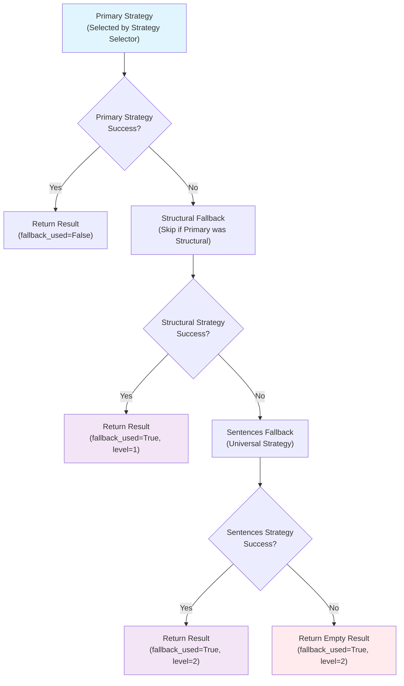
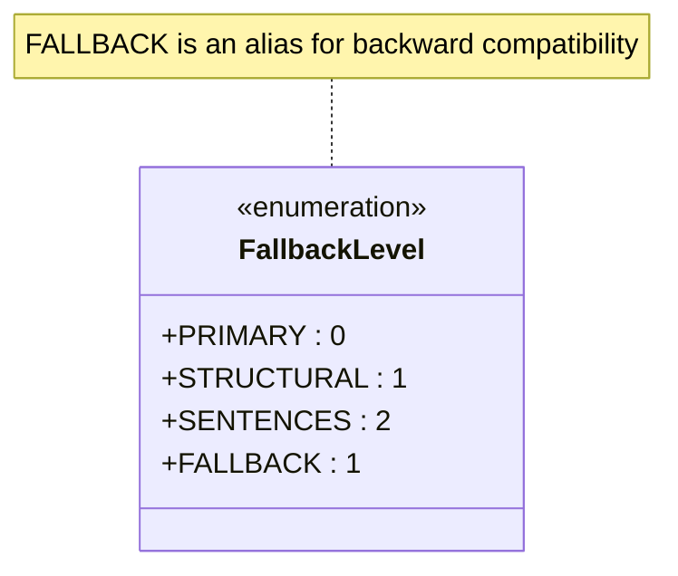
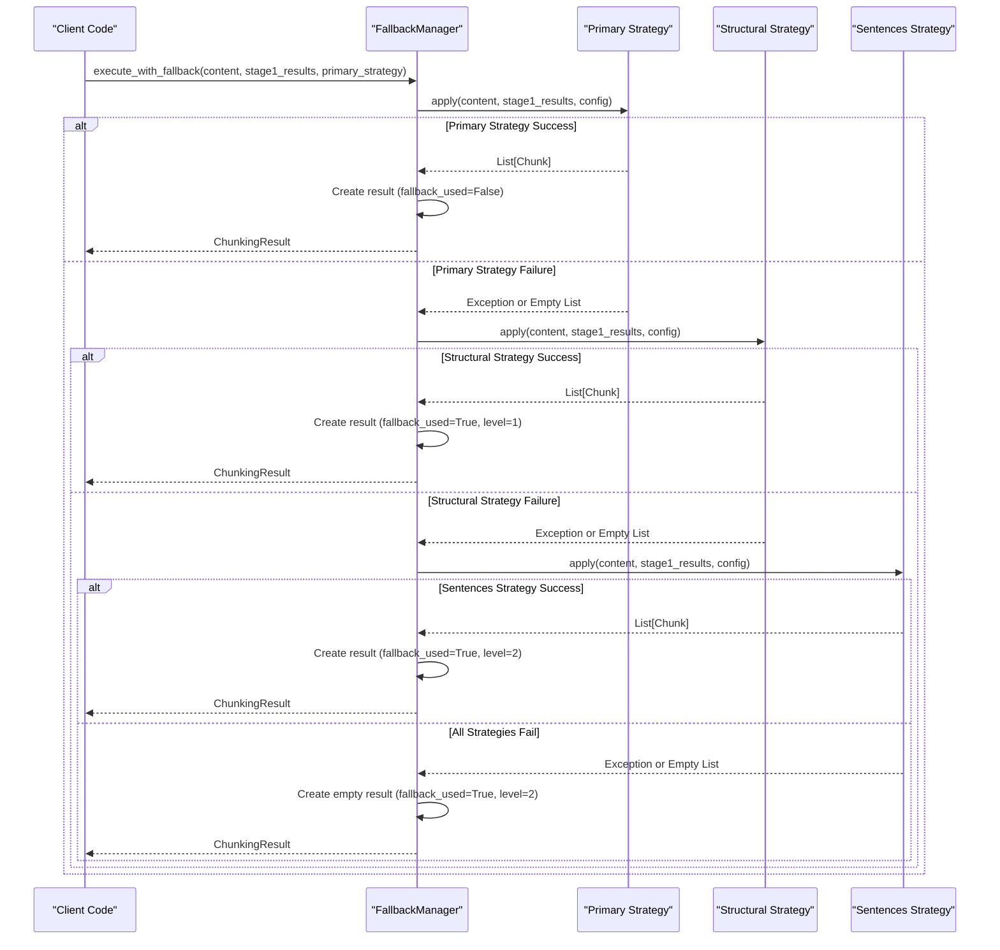

# Fallback Mechanism

<cite>
**Referenced Files in This Document**
- [fallback_manager.py](file://markdown_chunker/chunker/components/fallback_manager.py)
- [test_fallback_manager.py](file://tests/chunker/test_components/test_fallback_manager.py)
- [test_fallback_manager_integration.py](file://tests/chunker/test_fallback_manager_integration.py)
- [test_fallback_metadata_preservation.py](file://tests/chunker/test_fallback_metadata_preservation.py)
- [test_fallback_properties.py](file://tests/chunker/test_fallback_properties.py)
- [core.py](file://markdown_chunker/chunker/core.py)
- [types.py](file://markdown_chunker/chunker/types.py)
- [base.py](file://markdown_chunker/chunker/strategies/base.py)
- [sentences_strategy.py](file://markdown_chunker/chunker/strategies/sentences_strategy.py)
- [structural_strategy.py](file://markdown_chunker/chunker/strategies/structural_strategy.py)
</cite>

## Table of Contents
1. [Introduction](#introduction)
2. [Fallback Chain Architecture](#fallback-chain-architecture)
3. [FallbackLevel Enum](#fallbacklevel-enum)
4. [Execute with Fallback Method](#execute-with-fallback-method)
5. [Implementation Details](#implementation-details)
6. [Error Handling and Logging](#error-handling-and-logging)
7. [Fallback Metadata](#fallback-metadata)
8. [Common Issues and Solutions](#common-issues-and-solutions)
9. [Testing and Validation](#testing-and-validation)
10. [Integration Examples](#integration-examples)
11. [Best Practices](#best-practices)

## Introduction

The FallbackManager component implements a sophisticated 3-level fallback chain designed to ensure that Markdown chunking always succeeds, even when the primary strategy fails. This robust error recovery system guarantees content preservation and provides graceful degradation when specialized strategies encounter unexpected conditions.

The fallback mechanism operates on the principle that chunking should never fail completely - it should either succeed with the optimal strategy or fall back to increasingly universal approaches until success is achieved or all options are exhausted.

## Fallback Chain Architecture

The FallbackManager implements a hierarchical three-level fallback system:



**Diagram sources**
- [fallback_manager.py](file://markdown_chunker/chunker/components/fallback_manager.py#L60-L175)

### Level 0: Primary Strategy
The primary strategy is selected by the strategy selector based on content analysis and quality scoring. This represents the optimal approach for the given content type.

### Level 1: Structural Fallback
When the primary strategy fails, the structural fallback attempts to chunk the content using header-based segmentation. This strategy is particularly effective for well-structured documents with clear hierarchy.

### Level 2: Sentences Fallback
The universal fallback that splits any content into sentences and groups them into appropriately sized chunks. This strategy always succeeds but may produce less semantically meaningful chunks.

**Section sources**
- [fallback_manager.py](file://markdown_chunker/chunker/components/fallback_manager.py#L31-L45)

## FallbackLevel Enum

The FallbackLevel enum defines the three levels of the fallback chain with clear semantic meanings:



**Diagram sources**
- [fallback_manager.py](file://markdown_chunker/chunker/components/fallback_manager.py#L22-L28)

### Enum Values

| Level | Value | Description | Use Case |
|-------|-------|-------------|----------|
| PRIMARY | 0 | Selected strategy (no fallback) | Normal operation, optimal strategy |
| STRUCTURAL | 1 | Structural fallback strategy | Specialized strategies that fail |
| SENTENCES | 2 | Universal sentences strategy | Last resort when all else fails |
| FALLBACK | 1 | Backward compatibility alias | Maintains compatibility with older code |

**Section sources**
- [fallback_manager.py](file://markdown_chunker/chunker/components/fallback_manager.py#L22-L28)

## Execute with Fallback Method

The `execute_with_fallback` method is the core implementation that orchestrates the fallback chain:



**Diagram sources**
- [fallback_manager.py](file://markdown_chunker/chunker/components/fallback_manager.py#L60-L175)

### Method Signature and Parameters

The method accepts three main parameters:

- **content**: Original markdown content as string
- **stage1_results**: Results from Stage 1 processing (ContentAnalysis and AST)
- **primary_strategy**: The strategy selected by the strategy selector

### Execution Flow

1. **Level 0 - Primary Strategy Attempt**
   - Execute the primary strategy normally
   - Return immediately if successful
   - Log warnings for empty results, capture exceptions

2. **Level 1 - Structural Fallback**
   - Skip if primary strategy was structural (avoid redundant processing)
   - Attempt structural strategy for header-based chunking
   - Return if successful, log warnings/capture exceptions

3. **Level 2 - Sentences Fallback**
   - Skip if primary strategy was sentences (prevent infinite loops)
   - Universal strategy that always succeeds
   - Return final result with fallback metadata

**Section sources**
- [fallback_manager.py](file://markdown_chunker/chunker/components/fallback_manager.py#L60-L175)

## Implementation Details

### Strategy Initialization

The FallbackManager maintains references to specialized strategies:

```python
# Strategy instances are created during initialization
self._structural_strategy = StructuralStrategy()
self._sentences_strategy = SentencesStrategy()
# Backward compatibility alias
self._fallback_strategy = self._sentences_strategy
```

### Conditional Fallback Logic

The implementation includes intelligent skipping logic to prevent redundant processing:

```python
# Skip structural fallback if primary was structural
if primary_strategy.name != self._structural_strategy.name:
    # Attempt structural fallback

# Skip sentences fallback if primary was sentences  
if primary_strategy.name != self._sentences_strategy.name:
    # Attempt sentences fallback
```

### Error Collection and Preservation

The method accumulates errors and warnings from each fallback attempt:

```python
errors = []  # Accumulated errors from all strategies
warnings = []  # Accumulated warnings from all strategies
```

**Section sources**
- [fallback_manager.py](file://markdown_chunker/chunker/components/fallback_manager.py#L47-L58)

## Error Handling and Logging

The fallback mechanism implements comprehensive error handling and logging:

### Logging Levels and Messages

| Scenario | Logger Level | Message Pattern |
|----------|-------------|-----------------|
| Primary Strategy Success | INFO | `"Primary strategy {name} succeeded"` |
| Primary Strategy Failure | WARNING | `"Primary strategy {name} failed: {error}"` |
| Primary Strategy Empty Result | WARNING | `"Primary strategy {name} returned no chunks"` |
| Structural Fallback Success | INFO | `"Structural fallback succeeded"` |
| Structural Fallback Failure | WARNING | `"Structural fallback failed: {error}"` |
| Sentences Fallback Success | INFO | `"Sentences fallback succeeded"` |
| Sentences Fallback Failure | ERROR | `"Sentences fallback failed: {error}"` |
| All Strategies Failed | ERROR | `"All strategies failed, returning empty result"` |

### Exception Handling Strategy

Each fallback level implements robust exception handling:

```python
try:
    # Strategy execution
    chunks = strategy.apply(content, stage1_results, config)
    if chunks:
        return self._create_fallback_result(chunks, strategy.name, level, errors, warnings)
except Exception as e:
    error_msg = f"{strategy.name} failed: {str(e)}"
    logger.warning(error_msg)
    errors.append(error_msg)
```

**Section sources**
- [fallback_manager.py](file://markdown_chunker/chunker/components/fallback_manager.py#L85-L175)

## Fallback Metadata

The `_create_fallback_result` method adds comprehensive metadata to chunks when fallback occurs:

### Metadata Structure

Each chunk receives the following fallback-related metadata:

| Field | Type | Description |
|-------|------|-------------|
| `fallback_level` | int | Numeric fallback level (0=primary, 1=structural, 2=sentences) |
| `fallback_reason` | str | Human-readable explanation of fallback occurrence |

### Example Metadata

```python
# When structural fallback is used
chunk.add_metadata("fallback_level", 1)
chunk.add_metadata("fallback_reason", "Primary strategy failed, used structural")

# When sentences fallback is used  
chunk.add_metadata("fallback_level", 2)
chunk.add_metadata("fallback_reason", "Primary strategy failed, used sentences")
```

### Integration with ChunkingResult

The fallback metadata is preserved in the final ChunkingResult:

```python
return ChunkingResult(
    chunks=chunks,
    strategy_used=strategy_name,
    processing_time=0.0,
    fallback_used=True,
    fallback_level=fallback_level.value,
    errors=errors,
    warnings=warnings,
)
```

**Section sources**
- [fallback_manager.py](file://markdown_chunker/chunker/components/fallback_manager.py#L177-L213)

## Common Issues and Solutions

### Fallback Loop Prevention

The implementation prevents infinite fallback loops through strategic skipping:

```python
# Prevent structural fallback when primary was structural
if primary_strategy.name != self._structural_strategy.name:
    # Attempt structural fallback

# Prevent sentences fallback when primary was sentences  
if primary_strategy.name != self._sentences_strategy.name:
    # Attempt sentences fallback
```

### Validation of Fallback Chain

The `validate_fallback_chain` method ensures proper configuration:

```python
def validate_fallback_chain(self) -> List[str]:
    issues = []
    if not self.config.enable_fallback:
        issues.append("Fallback is disabled in configuration")
    if not self._fallback_strategy:
        issues.append("Fallback strategy not available")
    return issues
```

### Error Propagation

Errors from each fallback level are accumulated and preserved:

```python
# Primary strategy failure
errors.append(f"Primary strategy {primary_strategy.name} failed: {str(e)}")

# Structural fallback failure  
errors.append(f"Structural fallback failed: {str(e)}")

# Sentences fallback failure
errors.append(f"Sentences fallback failed: {str(e)}")
```

**Section sources**
- [fallback_manager.py](file://markdown_chunker/chunker/components/fallback_manager.py#L215-L230)

## Testing and Validation

### Unit Tests

The fallback manager includes comprehensive unit tests covering:

- Primary strategy success scenarios
- Fallback to structural strategy
- Fallback to sentences strategy  
- Error handling and exception propagation
- Metadata preservation
- Validation methods

### Integration Tests

Integration tests verify the fallback manager's role in the complete chunking pipeline:

```python
def test_execute_with_fallback_called_correctly(self):
    """Verify execute_with_fallback is called with correct parameters."""
    chunker = MarkdownChunker()
    
    # Mock fallback manager response
    mock_result = ChunkingResult(
        chunks=[Chunk("test content", 1, 1)],
        strategy_used="sentences",
        processing_time=0.1,
        fallback_used=False,
    )
    
    with patch.object(
        chunker._fallback_manager, "execute_with_fallback", return_value=mock_result
    ) as mock_execute:
        # Trigger chunking
        chunks = chunker.chunk("# Test\n\nSome content")
        
        # Verify fallback manager was called
        assert mock_execute.called
        call_args = mock_execute.call_args[0]
        assert len(call_args) == 3
        assert call_args[0] == "# Test\n\nSome content"  # content
        assert hasattr(call_args[1], "analysis")  # stage1_results
        assert hasattr(call_args[2], "name")  # strategy
```

### Property-Based Testing

Advanced property-based tests validate fallback behavior across various scenarios:

```python
@given(content=markdown_content(), stage1=mock_stage1_results())
def test_property_fallback_metadata_correct(content, stage1):
    """Property: Fallback chunks have correct metadata."""
    config = ChunkConfig(max_chunk_size=2000)
    manager = FallbackManager(config)
    
    failing_strategy = FailingStrategy()
    result = manager.execute_with_fallback(content, stage1, failing_strategy)
    
    # Verify fallback metadata in chunks
    for chunk in result.chunks:
        assert "fallback_level" in chunk.metadata
        assert chunk.metadata["fallback_level"] in [1, 2]
        assert "fallback_reason" in chunk.metadata
```

**Section sources**
- [test_fallback_manager.py](file://tests/chunker/test_components/test_fallback_manager.py#L36-L67)
- [test_fallback_manager_integration.py](file://tests/chunker/test_fallback_manager_integration.py#L36-L67)

## Integration Examples

### Basic Usage

```python
from markdown_chunker import MarkdownChunker

# Create chunker with default configuration
chunker = MarkdownChunker()

# Process markdown content
markdown = "# Header\n\nContent with *formatting*.\n\nMore content."

# Automatic fallback handling
chunks = chunker.chunk(markdown)

# Each chunk contains fallback metadata if fallback was used
for chunk in chunks:
    if "fallback_level" in chunk.metadata:
        print(f"Fallback used at level {chunk.metadata['fallback_level']}")
        print(f"Reason: {chunk.metadata['fallback_reason']}")
```

### Manual Strategy Selection

```python
# When manually selecting a strategy, fallback manager is bypassed
chunks = chunker.chunk(markdown, strategy="code")

# In this case, no fallback mechanism is triggered
# The strategy is applied directly, and any exceptions bubble up
```

### Configuration with Fallback Disabled

```python
from markdown_chunker.chunker.types import ChunkConfig

# Disable fallback for strict behavior
config = ChunkConfig(enable_fallback=False)
chunker = MarkdownChunker(config)

# If primary strategy fails, an exception will be raised
try:
    chunks = chunker.chunk(malformed_markdown)
except Exception as e:
    print(f"Chunking failed: {e}")
```

**Section sources**
- [core.py](file://markdown_chunker/chunker/core.py#L155-L200)

## Best Practices

### Strategy Selection

1. **Let the system choose**: Allow the strategy selector to choose the optimal strategy
2. **Manual override sparingly**: Use manual strategy selection only when you're certain about the content type
3. **Monitor fallback usage**: Track fallback occurrences to identify content patterns

### Error Handling

1. **Catch fallback exceptions**: When using the fallback manager programmatically, catch FallbackError
2. **Log fallback events**: Monitor fallback usage for quality assessment
3. **Validate configuration**: Ensure fallback is enabled when needed

### Performance Considerations

1. **Fallback impact**: Understand that fallback strategies may increase processing time
2. **Metadata overhead**: Fallback metadata adds small overhead to each chunk
3. **Memory usage**: Fallback accumulation may increase memory consumption

### Quality Monitoring

1. **Track fallback rates**: Monitor how often fallback strategies are used
2. **Analyze fallback reasons**: Understand why primary strategies fail
3. **Content analysis**: Use Stage 1 analysis to predict fallback likelihood

### Configuration Guidelines

```python
# Recommended configuration for production
config = ChunkConfig(
    max_chunk_size=4096,
    min_chunk_size=512,
    enable_fallback=True,  # Essential for reliability
    enable_overlap=True,   # Enhances semantic coherence
)

# For development/testing
config = ChunkConfig(
    max_chunk_size=1000,
    enable_fallback=True,
    debug_mode=True,       # Enhanced logging
)
```

The fallback mechanism ensures that Markdown chunking is resilient, reliable, and always produces results - whether optimal or fallback-based. This design philosophy prioritizes system stability and content preservation over occasional suboptimal chunking results.