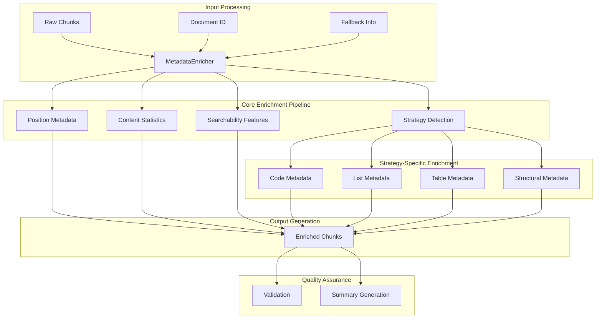
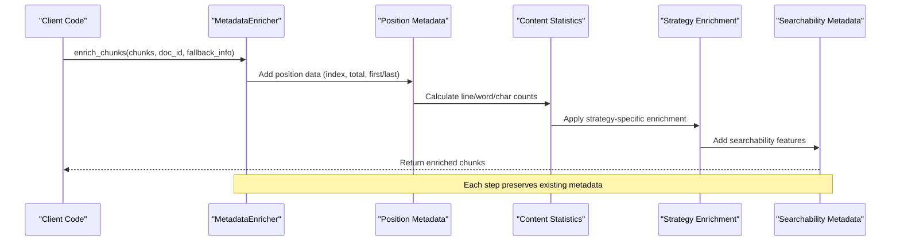
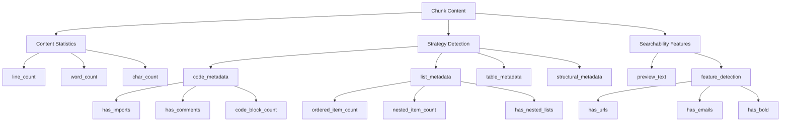
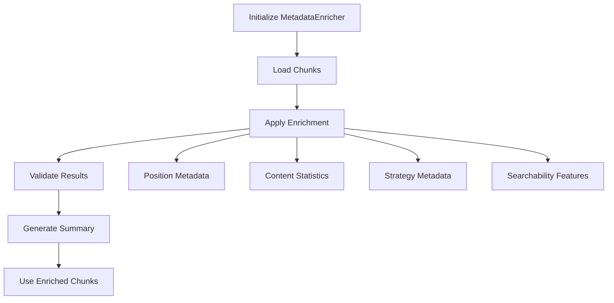

# Metadata Enrichment

<cite>
**Referenced Files in This Document**
- [metadata_enricher.py](file://markdown_chunker/chunker/components/metadata_enricher.py)
- [test_metadata_enricher.py](file://tests/chunker/test_components/test_metadata_enricher.py)
- [types.py](file://markdown_chunker/chunker/types.py)
- [code_heavy.md](file://tests/fixtures/code_heavy.md)
- [list_heavy.md](file://tests/fixtures/list_heavy.md)
- [table_heavy.md](file://tests/fixtures/table_heavy.md)
- [code_strategy.py](file://markdown_chunker/chunker/strategies/code_strategy.py)
- [list_strategy.py](file://markdown_chunker/chunker/strategies/list_strategy.py)
</cite>

## Table of Contents
1. [Introduction](#introduction)
2. [Architecture Overview](#architecture-overview)
3. [Core Components](#core-components)
4. [Implementation Details](#implementation-details)
5. [Domain Model](#domain-model)
6. [Strategy-Specific Metadata](#strategy-specific-metadata)
7. [Searchability Features](#searchability-features)
8. [Validation and Quality Assurance](#validation-and-quality-assurance)
9. [Usage Patterns](#usage-patterns)
10. [Common Issues and Solutions](#common-issues-and-solutions)
11. [Performance Considerations](#performance-considerations)
12. [Best Practices](#best-practices)

## Introduction

The MetadataEnricher component is a sophisticated system that enhances chunk metadata with comprehensive information to improve chunk usability, searchability, and discoverability. It serves as the final stage in the chunking pipeline, adding strategic metadata that enables intelligent downstream processing and retrieval.

The component operates on the principle that enriched metadata transforms raw text chunks into semantically meaningful units that can be effectively utilized in various applications, particularly in Retrieval-Augmented Generation (RAG) systems and content management platforms.

## Architecture Overview

The MetadataEnricher follows a modular architecture with clear separation of concerns:

**Diagram sources**
- [metadata_enricher.py](file://markdown_chunker/chunker/components/metadata_enricher.py#L34-L142)

**Section sources**
- [metadata_enricher.py](file://markdown_chunker/chunker/components/metadata_enricher.py#L13-L33)

## Core Components

### MetadataEnricher Class

The MetadataEnricher class serves as the central orchestrator for metadata enhancement. It maintains configuration state and coordinates the enrichment process across multiple specialized enrichment methods.

Key responsibilities include:
- Managing chunk positioning and sequencing
- Calculating content statistics
- Applying strategy-specific enrichment
- Adding searchability features
- Validating metadata consistency

### Enrichment Pipeline

The enrichment process follows a systematic pipeline approach:

**Diagram sources**
- [metadata_enricher.py](file://markdown_chunker/chunker/components/metadata_enricher.py#L34-L66)

**Section sources**
- [metadata_enricher.py](file://markdown_chunker/chunker/components/metadata_enricher.py#L34-L66)

## Implementation Details

### enrich_chunks Method

The `enrich_chunks` method serves as the primary entry point for bulk enrichment operations. It iterates through all chunks and applies comprehensive metadata enhancement while maintaining the original chunk structure.

Key implementation characteristics:
- **Empty List Handling**: Returns immediately for empty chunk lists
- **Sequential Processing**: Processes chunks in order to maintain positional consistency
- **Metadata Preservation**: Creates new chunks rather than modifying originals
- **Batch Optimization**: Efficiently processes multiple chunks in a single operation

### _enrich_single_chunk Method

The `_enrich_single_chunk` method implements the core enrichment logic for individual chunks. It combines multiple enrichment strategies into a cohesive metadata profile.

Implementation highlights:
- **Positional Awareness**: Tracks chunk position within the document sequence
- **Conditional Enrichment**: Applies strategy-specific enhancements based on content type
- **Fallback Integration**: Incorporates fallback information when available
- **Document Context**: Adds document identification when provided

**Section sources**
- [metadata_enricher.py](file://markdown_chunker/chunker/components/metadata_enricher.py#L34-L142)

## Domain Model

### Metadata Field Categories

The MetadataEnricher organizes metadata into several distinct categories, each serving specific purposes in downstream applications:

| Category | Fields | Purpose | Usage Patterns |
|----------|--------|---------|----------------|
| **Position Data** | `chunk_index`, `total_chunks`, `is_first_chunk`, `is_last_chunk` | Document sequencing and navigation | Navigation UIs, sequential processing |
| **Content Statistics** | `line_count`, `word_count`, `char_count`, `avg_line_length`, `avg_word_length` | Content analysis and filtering | Content discovery, size-based processing |
| **Document Context** | `document_id`, `execution_fallback_used`, `execution_fallback_level`, `execution_strategy_used` | Document identification and fallback tracking | Document management, error recovery |
| **Strategy Metadata** | Strategy-specific fields (code_block_count, ordered_item_count, etc.) | Content-type awareness | Intelligent routing, content classification |
| **Searchability** | `preview`, `has_urls`, `has_emails`, `has_bold`, `has_italic`, `has_numbers` | Enhanced discoverability | Search engines, content recommendation |

### Field Relationships

The metadata fields exhibit hierarchical relationships that support complex querying and analysis:

**Diagram sources**
- [metadata_enricher.py](file://markdown_chunker/chunker/components/metadata_enricher.py#L144-L327)

**Section sources**
- [metadata_enricher.py](file://markdown_chunker/chunker/components/metadata_enricher.py#L144-L327)

## Strategy-Specific Metadata

### Code Metadata Enhancement

The `_enrich_code_metadata` method implements sophisticated code analysis to extract valuable programming-related metadata:

#### Import and Dependency Detection
- **Pattern Matching**: Uses regex patterns to detect import statements across multiple programming languages
- **Language-Aware Detection**: Recognizes language-specific import syntax (import, from, require, using)
- **Scope Awareness**: Identifies imports at the beginning of code blocks

#### Comment Analysis
- **Multi-Style Support**: Detects various comment styles (//, #, /* */, */)
- **Context Preservation**: Maintains awareness of comment placement within code
- **Code Quality Indicators**: Provides insights into documentation presence

#### Code Block Intelligence
- **Fenced Code Detection**: Counts fenced code blocks (triple backticks)
- **Inline Code Recognition**: Identifies single-backtick inline code elements
- **Structure Awareness**: Understands code block boundaries and nesting

**Section sources**
- [metadata_enricher.py](file://markdown_chunker/chunker/components/metadata_enricher.py#L165-L198)

### List Metadata Enhancement

The `_enrich_list_metadata` method provides comprehensive list analysis capabilities:

#### List Type Classification
- **Ordered Lists**: Detects numbered sequences with proper counting
- **Unordered Lists**: Identifies bullet-point structures (-, *, +)
- **Task Lists**: Recognizes checkbox-style task indicators ([ ], [x])

#### Nesting Detection
- **Indentation Analysis**: Measures indentation levels to detect nested structures
- **Hierarchy Awareness**: Understands parent-child relationships in nested lists
- **Depth Calculation**: Quantifies nesting depth for complex structures

#### Item Counting and Analysis
- **Item Type Distribution**: Tracks counts of different list item types
- **Continuation Awareness**: Identifies list continuations across chunks
- **Structure Validation**: Ensures list integrity across chunk boundaries

**Section sources**
- [metadata_enricher.py](file://markdown_chunker/chunker/components/metadata_enricher.py#L200-L227)

### Table Metadata Enhancement

The `_enrich_table_metadata` method provides detailed table analysis:

#### Structural Analysis
- **Row Detection**: Counts table rows using pipe-delimited patterns
- **Separator Recognition**: Identifies table header separators
- **Boundary Detection**: Locates table boundaries within content

#### Alignment Detection
- **Column Alignment**: Recognizes left, right, and center alignment indicators
- **Format Consistency**: Validates table formatting standards
- **Visual Structure**: Understands table layout and structure

#### Content Analysis
- **Cell Counting**: Determines column and row dimensions
- **Content Density**: Analyzes cell content distribution
- **Formatting Patterns**: Identifies consistent formatting approaches

**Section sources**
- [metadata_enricher.py](file://markdown_chunker/chunker/components/metadata_enricher.py#L229-L254)

### Structural Metadata Enhancement

The `_enrich_structural_metadata` method analyzes document structure and hierarchy:

#### Header Analysis
- **Header Level Detection**: Identifies H1-H6 header levels
- **Hierarchy Tracking**: Maintains header level progression
- **Content Separation**: Distinguishes headers from paragraph content

#### Paragraph Detection
- **Content Segmentation**: Separates headers from paragraph content
- **Content Density**: Analyzes paragraph content vs. markup
- **Structure Validation**: Ensures proper document structure

#### Depth Analysis
- **Level Range**: Tracks minimum and maximum header levels
- **Hierarchy Depth**: Understands document complexity
- **Content Organization**: Analyzes structural organization patterns

**Section sources**
- [metadata_enricher.py](file://markdown_chunker/chunker/components/metadata_enricher.py#L256-L287)

## Searchability Features

### Preview Generation

The `_add_searchability_metadata` method creates enhanced searchability features through intelligent content analysis:

#### First Sentence Extraction
- **Content Preview**: Extracts the first meaningful sentence or line
- **Length Limiting**: Truncates previews to prevent excessive metadata
- **Context Preservation**: Maintains readability while limiting length

#### Feature Detection
- **URL Recognition**: Identifies web addresses and links
- **Email Detection**: Finds email addresses within content
- **Numeric Content**: Detects numerical content patterns
- **Formatting Marks**: Recognizes bold (**), italic (*), and inline code (`) formatting

#### Content Classification
- **Rich Text Indicators**: Detects formatting and emphasis markers
- **Structured Content**: Identifies content with clear structure
- **Interactive Elements**: Recognizes URLs and email addresses as interactive elements

**Section sources**
- [metadata_enricher.py](file://markdown_chunker/chunker/components/metadata_enricher.py#L289-L327)

## Validation and Quality Assurance

### Metadata Validation

The MetadataEnricher includes comprehensive validation capabilities to ensure metadata consistency and completeness:

#### Required Field Validation
- **Strategy Verification**: Ensures all chunks have strategy metadata
- **Content Type Validation**: Verifies content type specification
- **Consistency Checks**: Validates metadata field relationships

#### Positional Integrity
- **Index Validation**: Confirms chunk indices match actual position
- **Total Count Verification**: Ensures total chunk count consistency
- **Boundary Checking**: Validates first/last chunk identification

#### Cross-Chunk Consistency
- **Metadata Uniformity**: Checks for consistent metadata across chunks
- **Field Completeness**: Identifies missing or inconsistent fields
- **Relationship Validation**: Ensures logical field relationships

### Quality Metrics

The validation system provides comprehensive quality assessment:

| Validation Type | Checks Performed | Error Detection | Recovery Options |
|----------------|------------------|-----------------|------------------|
| **Required Fields** | strategy, content_type | Missing field identification | Automatic field addition |
| **Positional Data** | chunk_index, total_chunks | Index mismatch detection | Automatic correction |
| **Content Statistics** | line_count, word_count | Statistical anomalies | Recalculation |
| **Cross-References** | document_id, fallback_info | Reference inconsistencies | Manual resolution |

**Section sources**
- [metadata_enricher.py](file://markdown_chunker/chunker/components/metadata_enricher.py#L330-L374)

## Usage Patterns

### Basic Enrichment Workflow

The typical usage pattern involves initializing the enricher with configuration and applying enrichment to chunks:

### Integration Patterns

#### Document Processing Pipeline
- **Sequential Processing**: Process documents in order to maintain context
- **Batch Operations**: Handle multiple documents efficiently
- **Streaming Support**: Process large documents incrementally

#### Application Integration
- **RAG Systems**: Leverage enhanced metadata for intelligent retrieval
- **Content Management**: Use metadata for content organization and discovery
- **Analytics Platforms**: Utilize metadata for content analysis and reporting

### Configuration Options

The MetadataEnricher supports flexible configuration through the ChunkConfig system:

- **Document ID Integration**: Link chunks to specific documents
- **Fallback Information**: Track fallback strategy usage
- **Custom Metadata**: Extend with application-specific metadata fields

**Section sources**
- [test_metadata_enricher.py](file://tests/chunker/test_components/test_metadata_enricher.py#L285-L371)

## Common Issues and Solutions

### Metadata Consistency Issues

#### Problem: Inconsistent Chunk Indices
**Symptoms**: Chunk indices don't match actual position or total count mismatches
**Solution**: Use the validation system to identify and correct index inconsistencies
**Prevention**: Ensure sequential processing and proper chunk ordering

#### Problem: Missing Required Fields
**Symptoms**: Validation failures indicating missing strategy or content_type
**Solution**: Verify strategy assignment during chunk creation
**Prevention**: Implement strategy validation before enrichment

### Performance Optimization

#### Problem: Slow Enrichment on Large Documents
**Symptoms**: Long processing times for documents with many chunks
**Solution**: Implement batch processing and parallel enrichment where possible
**Optimization**: Use efficient regex patterns and minimize string operations

#### Problem: Memory Usage with Large Metadata
**Symptoms**: High memory consumption from extensive metadata
**Solution**: Implement metadata pruning for less critical fields
**Optimization**: Use lazy loading for metadata fields when possible

### Content-Specific Challenges

#### Problem: Code Metadata Accuracy
**Symptoms**: Incorrect import detection or comment recognition
**Solution**: Update regex patterns to handle edge cases
**Enhancement**: Add language-specific pattern customization

#### Problem: List Structure Preservation
**Symptoms**: Nested list detection failures or incorrect hierarchy
**Solution**: Improve indentation analysis and nesting detection
**Enhancement**: Add support for complex nested structures

**Section sources**
- [test_metadata_enricher.py](file://tests/chunker/test_components/test_metadata_enricher.py#L223-L234)

## Performance Considerations

### Computational Efficiency

The MetadataEnricher is designed for optimal performance across various document sizes:

#### Regex Optimization
- **Compiled Patterns**: Pre-compile frequently used regex patterns
- **Efficient Matching**: Use targeted patterns for specific content types
- **Early Termination**: Stop processing when sufficient information is gathered

#### String Processing
- **Minimal Allocations**: Reduce string copying and allocation overhead
- **Incremental Processing**: Process content incrementally when possible
- **Memory Reuse**: Reuse data structures across multiple enrichments

### Scalability Factors

#### Batch Processing Benefits
- **Reduced Overhead**: Minimize initialization costs per chunk
- **Memory Efficiency**: Better cache utilization for batch operations
- **Parallel Opportunities**: Enable parallel processing for independent chunks

#### Resource Management
- **Memory Footprint**: Monitor metadata size growth
- **Processing Time**: Track enrichment duration for performance monitoring
- **Resource Cleanup**: Properly manage resources in long-running applications

### Optimization Strategies

#### Selective Enrichment
- **Content-Based Filtering**: Apply specific enrichment only when needed
- **Threshold-Based Processing**: Skip enrichment for trivial content
- **Progressive Enhancement**: Add metadata progressively based on requirements

#### Caching Mechanisms
- **Pattern Caching**: Cache compiled regex patterns
- **Result Caching**: Store enrichment results for repeated queries
- **Metadata Indexing**: Create searchable indexes for metadata fields

## Best Practices

### Implementation Guidelines

#### Metadata Design Principles
- **Consistency**: Maintain uniform field naming and structure
- **Completeness**: Ensure all required metadata fields are present
- **Accuracy**: Validate metadata against source content
- **Extensibility**: Design for future metadata additions

#### Error Handling
- **Graceful Degradation**: Continue processing even with individual failures
- **Error Reporting**: Provide detailed error information for debugging
- **Recovery Strategies**: Implement fallback mechanisms for failed enrichments

#### Performance Optimization
- **Batch Processing**: Process multiple chunks together when possible
- **Resource Management**: Monitor and optimize memory usage
- **Caching Strategies**: Implement appropriate caching for repeated operations

### Usage Recommendations

#### Integration Patterns
- **Pipeline Architecture**: Integrate with existing chunking pipelines
- **Modular Design**: Keep enrichment logic modular for flexibility
- **Configuration Management**: Use configuration objects for customization

#### Monitoring and Maintenance
- **Validation Monitoring**: Regularly validate metadata quality
- **Performance Tracking**: Monitor enrichment performance metrics
- **Documentation Updates**: Keep documentation synchronized with implementation changes

### Quality Assurance

#### Testing Strategies
- **Unit Testing**: Test individual enrichment methods thoroughly
- **Integration Testing**: Verify end-to-end enrichment workflows
- **Performance Testing**: Validate performance under various load conditions

#### Continuous Improvement
- **Feedback Loops**: Gather feedback from downstream applications
- **Metric Collection**: Track enrichment effectiveness and quality
- **Iterative Enhancement**: Continuously improve enrichment algorithms

**Section sources**
- [test_metadata_enricher.py](file://tests/chunker/test_components/test_metadata_enricher.py#L1-L371)