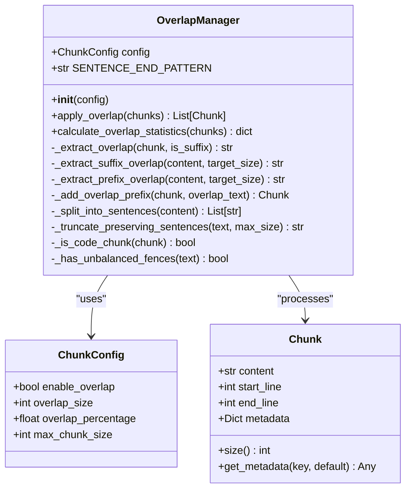
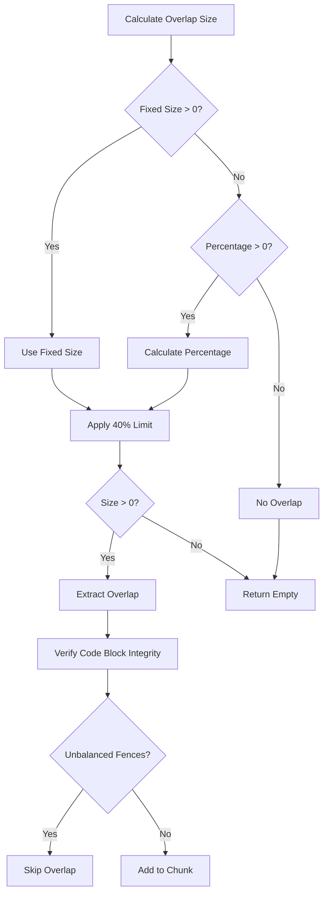
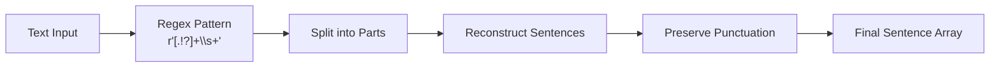
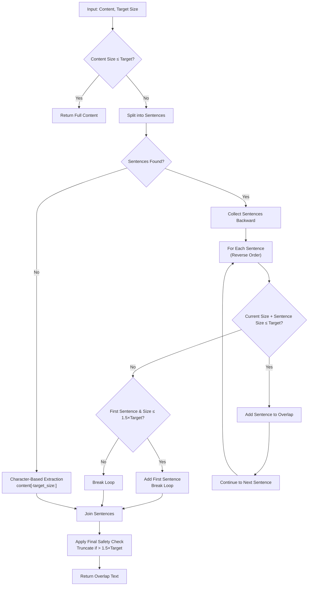
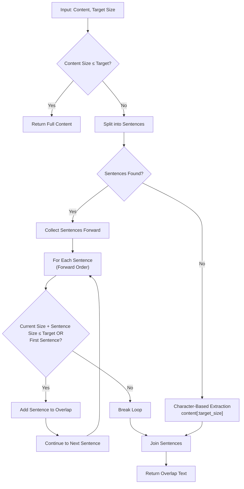
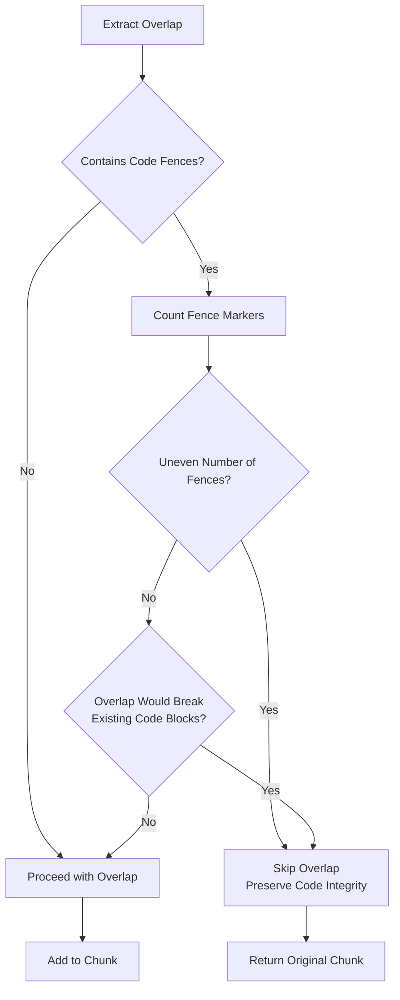
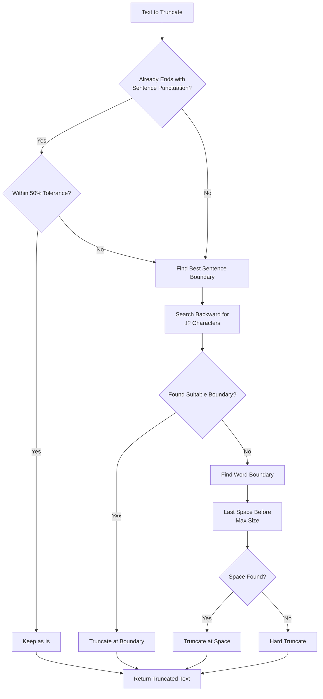
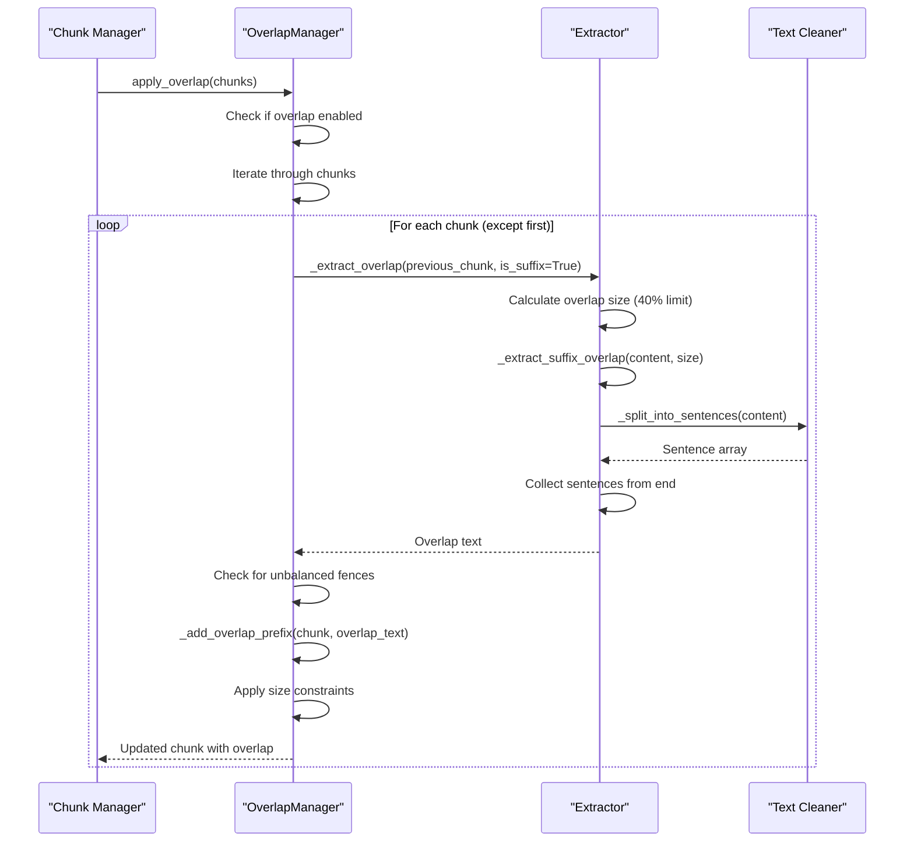

# Overlap Management

<cite>
**Referenced Files in This Document**
- [overlap_manager.py](file://markdown_chunker/chunker/components/overlap_manager.py)
- [test_overlap_manager.py](file://tests/chunker/test_components/test_overlap_manager.py)
- [test_overlap_properties.py](file://tests/chunker/test_overlap_properties.py)
- [types.py](file://markdown_chunker/chunker/types.py)
- [basic_usage.py](file://examples/basic_usage.py)
</cite>

## Table of Contents
1. [Introduction](#introduction)
2. [Core Architecture](#core-architecture)
3. [Overlap Configuration](#overlap-configuration)
4. [Sentence Boundary Detection](#sentence-boundary-detection)
5. [Overlap Extraction Methods](#overlap-extraction-methods)
6. [Critical Safeguards](#critical-safeguards)
7. [Edge Case Handling](#edge-case-handling)
8. [Practical Examples](#practical-examples)
9. [Common Issues and Solutions](#common-issues-and-solutions)
10. [Performance Considerations](#performance-considerations)
11. [Testing and Validation](#testing-and-validation)
12. [Conclusion](#conclusion)

## Introduction

The OverlapManager component is a sophisticated system designed to create sentence-based overlap between adjacent chunks while preserving context and readability. This critical component ensures that when Markdown documents are divided into smaller pieces for processing (such as in Retrieval-Augmented Generation (RAG) systems), each chunk maintains sufficient context from the preceding content to maintain semantic coherence.

The overlap mechanism operates on the principle that adjacent chunks should share some common content to prevent context loss during independent processing. However, this overlap must be carefully managed to avoid dominating the chunk content or breaking important structural elements like code blocks.

## Core Architecture

The OverlapManager follows a modular design with clear separation of concerns:

**Diagram sources**
- [overlap_manager.py](file://markdown_chunker/chunker/components/overlap_manager.py#L13-L447)
- [types.py](file://markdown_chunker/chunker/types.py#L36-L210)

**Section sources**
- [overlap_manager.py](file://markdown_chunker/chunker/components/overlap_manager.py#L13-L447)

## Overlap Configuration

The OverlapManager supports two primary configuration approaches for determining overlap size:

### Fixed-Size Overlap
Fixed-size overlap takes precedence when both `overlap_size` and `overlap_percentage` are configured. This approach provides predictable overlap amounts regardless of chunk size.

### Percentage-Based Overlap
Percentage-based overlap serves as a fallback mechanism, calculating overlap as a proportion of the source chunk size. This approach adapts to varying chunk sizes while maintaining proportional relationships.

### Configuration Priority and Limits

The system implements strict safeguards to prevent overlap from becoming excessive:

**Diagram sources**
- [overlap_manager.py](file://markdown_chunker/chunker/components/overlap_manager.py#L125-L153)

**Section sources**
- [overlap_manager.py](file://markdown_chunker/chunker/components/overlap_manager.py#L125-L153)

## Sentence Boundary Detection

The overlap extraction relies heavily on accurate sentence boundary detection using regex patterns. The system employs sophisticated algorithms to preserve natural language flow while respecting structural boundaries.

### Sentence Pattern Implementation

The core sentence detection uses a pattern that identifies sentence-ending punctuation followed by whitespace:

**Diagram sources**
- [overlap_manager.py](file://markdown_chunker/chunker/components/overlap_manager.py#L286-L317)

### Sentence Extraction Strategies

The system employs different strategies for extracting overlap based on whether it's a suffix or prefix:

#### Suffix Overlap Extraction
Suffix extraction works backward from the end of content, collecting sentences until the target size is reached. This approach ensures that the overlap contains recent context from the previous chunk.

#### Prefix Overlap Extraction  
Prefix extraction works forward from the beginning of content, collecting sentences until the target size is achieved. This maintains the chronological flow of information.

**Section sources**
- [overlap_manager.py](file://markdown_chunker/chunker/components/overlap_manager.py#L286-L317)
- [overlap_manager.py](file://markdown_chunker/chunker/components/overlap_manager.py#L155-L239)

## Overlap Extraction Methods

### _extract_suffix_overlap Method

The suffix overlap extraction implements a sophisticated algorithm that respects sentence boundaries while optimizing for size constraints:

**Diagram sources**
- [overlap_manager.py](file://markdown_chunker/chunker/components/overlap_manager.py#L155-L203)

### _extract_prefix_overlap Method

The prefix overlap extraction follows a forward-pass strategy with similar size constraints:

**Diagram sources**
- [overlap_manager.py](file://markdown_chunker/chunker/components/overlap_manager.py#L205-L239)

**Section sources**
- [overlap_manager.py](file://markdown_chunker/chunker/components/overlap_manager.py#L155-L239)

## Critical Safeguards

The OverlapManager implements multiple layers of protection to ensure content integrity and prevent overlap-related issues:

### Size Constraint Enforcement

The system enforces strict size limits to prevent overlap from dominating chunk content:

| Constraint | Purpose | Implementation |
|------------|---------|----------------|
| 40% of Source Chunk | Prevents overlap from overwhelming content | Applied during overlap calculation |
| 45% of Resulting Chunk | Maintains balance between overlap and content | Applied during chunk creation |
| 50% Ratio Limit | Ensures overlap remains a minority portion | Final validation in _add_overlap_prefix |

### Code Block Integrity Protection

The system includes specialized safeguards to protect code blocks from being broken by overlap:

**Diagram sources**
- [overlap_manager.py](file://markdown_chunker/chunker/components/overlap_manager.py#L97-L107)
- [overlap_manager.py](file://markdown_chunker/chunker/components/overlap_manager.py#L383-L388)

### Sentence Boundary Preservation

The system implements intelligent truncation algorithms that attempt to preserve sentence boundaries:

**Diagram sources**
- [overlap_manager.py](file://markdown_chunker/chunker/components/overlap_manager.py#L241-L284)

**Section sources**
- [overlap_manager.py](file://markdown_chunker/chunker/components/overlap_manager.py#L136-L140)
- [overlap_manager.py](file://markdown_chunker/chunker/components/overlap_manager.py#L332-L373)
- [overlap_manager.py](file://markdown_chunker/chunker/components/overlap_manager.py#L241-L284)

## Edge Case Handling

The OverlapManager gracefully handles various edge cases that commonly occur in real-world Markdown documents:

### Short Chunks
For chunks smaller than the target overlap size, the system returns the entire content, ensuring that no artificial fragmentation occurs.

### Chunks Without Sentence Boundaries
When no sentence boundaries are detected, the system falls back to character-based extraction while still respecting size constraints.

### Unbalanced Code Blocks
The system detects and handles unbalanced code fences, preventing overlap from breaking code block integrity.

### Empty or Minimal Content
Empty chunks or chunks with minimal content are handled appropriately, either returning empty overlap or the full content as appropriate.

### Maximum Chunk Size Constraints
When overlap would cause a chunk to exceed the maximum chunk size, the system applies intelligent truncation to maintain size limits.

**Section sources**
- [overlap_manager.py](file://markdown_chunker/chunker/components/overlap_manager.py#L122-L124)
- [overlap_manager.py](file://markdown_chunker/chunker/components/overlap_manager.py#L172-L175)
- [overlap_manager.py](file://markdown_chunker/chunker/components/overlap_manager.py#L352-L373)

## Practical Examples

### Basic Overlap Application

The following example demonstrates how overlap is applied between consecutive chunks:

**Diagram sources**
- [overlap_manager.py](file://markdown_chunker/chunker/components/overlap_manager.py#L37-L78)
- [overlap_manager.py](file://markdown_chunker/chunker/components/overlap_manager.py#L109-L153)

### Configuration Examples

The OverlapManager supports flexible configuration through the ChunkConfig class:

| Configuration Option | Purpose | Example Value |
|---------------------|---------|---------------|
| `enable_overlap` | Toggle overlap functionality | `True` |
| `overlap_size` | Fixed overlap size in characters | `200` |
| `overlap_percentage` | Proportional overlap (0.0-1.0) | `0.1` (10%) |
| `max_chunk_size` | Maximum chunk size constraint | `4096` |

**Section sources**
- [basic_usage.py](file://examples/basic_usage.py#L115-L121)

## Common Issues and Solutions

### Issue: Overlap Conflicts with Code Blocks

**Problem**: Overlap extraction includes part of a code block, creating unbalanced fences.

**Solution**: The system automatically detects unbalanced fences and skips overlap for affected chunks. This preserves code block integrity at the cost of slightly reduced overlap coverage.

### Issue: Sentence Boundaries Broken During Truncation

**Problem**: When overlap size is constrained, sentence boundaries may be accidentally broken.

**Solution**: The `_truncate_preserving_sentences` method implements intelligent truncation that prioritizes sentence boundaries while falling back to word boundaries when necessary.

### Issue: Excessive Overlap Size

**Problem**: Overlap becomes too large, dominating the chunk content.

**Solution**: Multiple safeguards ensure overlap never exceeds 40% of source chunk size or 45% of resulting chunk size, maintaining optimal balance.

### Issue: Poor Performance with Large Documents

**Problem**: Processing large documents with extensive overlap causes performance degradation.

**Solution**: The system implements efficient regex-based sentence detection and early termination algorithms to minimize computational overhead.

**Section sources**
- [overlap_manager.py](file://markdown_chunker/chunker/components/overlap_manager.py#L97-L107)
- [overlap_manager.py](file://markdown_chunker/chunker/components/overlap_manager.py#L241-L284)

## Performance Considerations

The OverlapManager is designed with performance in mind, implementing several optimization strategies:

### Efficient Sentence Detection
The regex-based sentence detection uses compiled patterns and avoids unnecessary string operations, making it suitable for processing large volumes of text.

### Early Termination
Both suffix and prefix extraction methods implement early termination when the target size is reached, avoiding unnecessary processing of remaining content.

### Memory Efficiency
The system processes content incrementally, minimizing memory usage even for large documents.

### Configurable Limits
Performance can be tuned through configuration parameters, allowing trade-offs between overlap quality and processing speed.

## Testing and Validation

The OverlapManager includes comprehensive testing to ensure reliability and correctness:

### Property-Based Testing
The system uses property-based testing to verify overlap behavior across a wide range of inputs, ensuring robustness against edge cases.

### Integration Testing
Integration tests verify overlap behavior within the broader chunking pipeline, ensuring compatibility with other components.

### Edge Case Coverage
Tests specifically address edge cases like empty chunks, short content, and code block boundaries.

**Section sources**
- [test_overlap_properties.py](file://tests/chunker/test_overlap_properties.py#L1-L416)
- [test_overlap_manager.py](file://tests/chunker/test_components/test_overlap_manager.py#L1-L397)

## Conclusion

The OverlapManager component represents a sophisticated solution for maintaining context continuity in chunked Markdown documents. Through careful implementation of sentence boundary detection, size constraints, and integrity safeguards, it provides reliable overlap functionality that enhances the effectiveness of downstream processing systems.

Key strengths of the implementation include:

- **Intelligent Sentence Preservation**: Advanced algorithms maintain natural language flow while respecting structural boundaries
- **Robust Integrity Protection**: Multiple layers of safeguard prevent damage to code blocks and other critical content
- **Flexible Configuration**: Support for both fixed-size and percentage-based overlap configurations
- **Performance Optimization**: Efficient algorithms ensure acceptable performance even with large documents
- **Comprehensive Edge Case Handling**: Graceful handling of unusual scenarios maintains system reliability

The component successfully balances the competing demands of context preservation, content integrity, and processing efficiency, making it an essential component for any serious Markdown chunking system.