# Post-Processing Pipeline

<cite>
**Referenced Files in This Document**
- [markdown_chunker/chunker/orchestrator.py](file://markdown_chunker/chunker/orchestrator.py)
- [markdown_chunker/chunker/components/overlap_manager.py](file://markdown_chunker/chunker/components/overlap_manager.py)
- [markdown_chunker/chunker/components/metadata_enricher.py](file://markdown_chunker/chunker/components/metadata_enricher.py)
- [markdown_chunker/chunker/components/fallback_manager.py](file://markdown_chunker/chunker/components/fallback_manager.py)
- [markdown_chunker/chunker/types.py](file://markdown_chunker/chunker/types.py)
- [markdown_chunker/chunker/transformer.py](file://markdown_chunker/chunker/transformer.py)
- [markdown_chunker/chunker/core.py](file://markdown_chunker/chunker/core.py)
- [tests/chunker/test_components/test_overlap_manager.py](file://tests/chunker/test_components/test_overlap_manager.py)
- [tests/chunker/test_components/test_metadata_enricher.py](file://tests/chunker/test_components/test_metadata_enricher.py)
- [tests/chunker/test_components/test_fallback_manager.py](file://tests/chunker/test_components/test_fallback_manager.py)
</cite>

## Table of Contents
1. [Introduction](#introduction)
2. [Pipeline Architecture Overview](#pipeline-architecture-overview)
3. [Core Components](#core-components)
4. [Overlap Management System](#overlap-management-system)
5. [Metadata Enrichment Engine](#metadata-enrichment-engine)
6. [Fallback Recovery Mechanism](#fallback-recovery-mechanism)
7. [Pipeline Integration](#pipeline-integration)
8. [Configuration and Control](#configuration-and-control)
9. [Performance Considerations](#performance-considerations)
10. [Error Handling and Validation](#error-handling-and-validation)
11. [Best Practices](#best-practices)
12. [Conclusion](#conclusion)

## Introduction

The Post-Processing Pipeline represents the final stage in the markdown chunking process, transforming raw chunks into production-ready output through a sophisticated series of transformations. This pipeline serves as the quality assurance and enhancement layer that ensures chunked content maintains semantic integrity, contextual continuity, and optimal metadata richness for downstream applications.

The pipeline operates as a chain of specialized components, each responsible for specific refinement tasks: overlap application for context preservation, metadata enrichment for searchability and analytics, validation for data completeness, and fallback handling for error recovery. Together, these components create a robust system that produces chunks suitable for RAG applications, search indexing, and content analysis workflows.

## Pipeline Architecture Overview

The Post-Processing Pipeline follows a modular, chain-of-responsibility pattern where each component handles specific aspects of chunk refinement. The pipeline receives chunks from the Strategy Application phase and applies a series of transformations in a predetermined order.

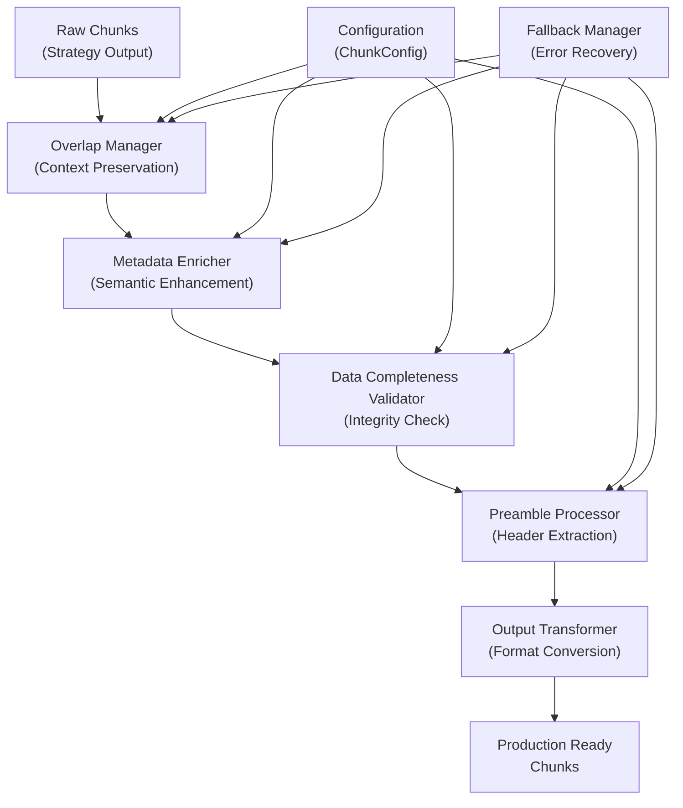

**Diagram sources**
- [markdown_chunker/chunker/core.py](file://markdown_chunker/chunker/core.py#L265-L345)
- [markdown_chunker/chunker/orchestrator.py](file://markdown_chunker/chunker/orchestrator.py#L55-L118)

The pipeline architecture emphasizes composability and fault tolerance. Each component operates independently while contributing to the overall quality of the output. The modular design allows for easy extension, testing, and maintenance of individual processing stages.

**Section sources**
- [markdown_chunker/chunker/core.py](file://markdown_chunker/chunker/core.py#L265-L345)
- [markdown_chunker/chunker/orchestrator.py](file://markdown_chunker/chunker/orchestrator.py#L55-L118)

## Core Components

The Post-Processing Pipeline consists of four primary components, each serving distinct roles in the chunk refinement process:

### Component Responsibilities

| Component | Primary Function | Key Features |
|-----------|------------------|--------------|
| **Overlap Manager** | Context preservation through overlap | Sentence-aware boundary handling, configurable overlap sizes, code block integrity protection |
| **Metadata Enricher** | Semantic enhancement and searchability | Content type detection, strategy-specific enrichment, statistical analysis, search metadata |
| **Fallback Manager** | Error recovery and strategy cascading | 3-level fallback system, automatic strategy selection, recovery from failures |
| **Data Completeness Validator** | Integrity verification | Coverage analysis, content preservation validation, warning generation |

### Component Interaction Pattern

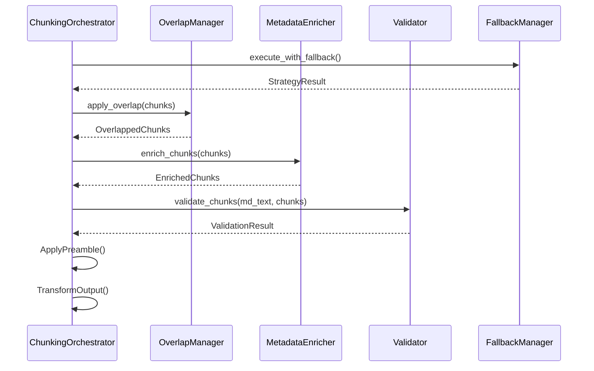

**Diagram sources**
- [markdown_chunker/chunker/core.py](file://markdown_chunker/chunker/core.py#L265-L345)
- [markdown_chunker/chunker/orchestrator.py](file://markdown_chunker/chunker/orchestrator.py#L55-L118)

**Section sources**
- [markdown_chunker/chunker/core.py](file://markdown_chunker/chunker/core.py#L265-L345)
- [markdown_chunker/chunker/types.py](file://markdown_chunker/chunker/types.py#L322-L494)

## Overlap Management System

The OverlapManager serves as the cornerstone of context preservation in the Post-Processing Pipeline. Its primary responsibility is to create meaningful overlap between adjacent chunks while maintaining semantic integrity and avoiding duplication.

### Core Overlap Strategy

The overlap system employs a sophisticated sentence-aware approach that respects natural language boundaries while ensuring sufficient context transfer between chunks:

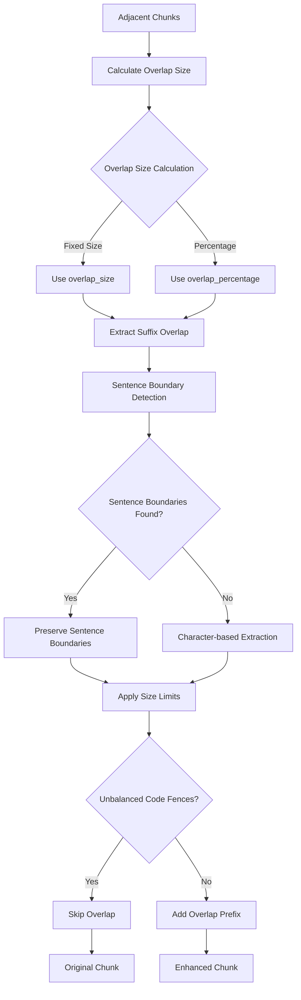

**Diagram sources**
- [markdown_chunker/chunker/components/overlap_manager.py](file://markdown_chunker/chunker/components/overlap_manager.py#L37-L80)
- [markdown_chunker/chunker/components/overlap_manager.py](file://markdown_chunker/chunker/components/overlap_manager.py#L109-L155)

### Overlap Configuration and Control

The OverlapManager provides flexible configuration options for controlling overlap behavior:

| Parameter | Purpose | Default | Constraints |
|-----------|---------|---------|-------------|
| `enable_overlap` | Master switch for overlap functionality | `True` | Boolean |
| `overlap_size` | Fixed overlap size in characters | `200` | Positive integer |
| `overlap_percentage` | Percentage of chunk size for overlap | `0.1` (10%) | 0.0 ≤ value ≤ 1.0 |
| `max_overlap` | Maximum overlap as percentage of source | `0.4` (40%) | 0.0 ≤ value ≤ 0.4 |

### Advanced Overlap Features

#### Sentence-Aware Boundary Preservation

The overlap system implements sophisticated sentence boundary detection using regular expressions to identify natural language boundaries:

```python
# Sentence boundary pattern for overlap extraction
SENTENCE_END_PATTERN = r"[.!?]+\s+"
```

This pattern enables the system to:
- Preserve complete sentences across chunk boundaries
- Handle various punctuation styles (., !, ?)
- Maintain readability and coherence
- Prevent mid-sentence overlap that could confuse downstream processors

#### Code Block Integrity Protection

A critical feature of the overlap system is its ability to detect and preserve code block integrity:

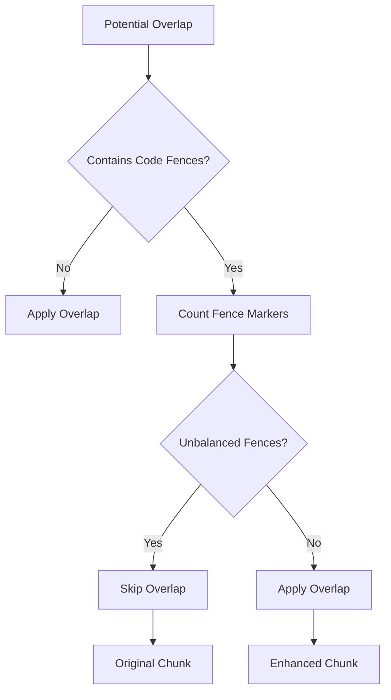

**Diagram sources**
- [markdown_chunker/chunker/components/overlap_manager.py](file://markdown_chunker/chunker/components/overlap_manager.py#L68-L72)

The system detects unbalanced code fences by counting fence markers and ensuring they form complete pairs. This prevents corruption of code blocks that could occur if overlap included partial fence sequences.

#### Dynamic Overlap Size Calculation

The overlap manager implements intelligent size calculation that adapts to chunk characteristics:

1. **Priority-based Selection**: Fixed size takes precedence over percentage-based calculation
2. **Size Limiting**: Maximum overlap is constrained to prevent dominance of overlap content
3. **Ratio Compliance**: Ensures overlap doesn't exceed 50% of resulting chunk size
4. **Available Space Calculation**: Respects maximum chunk size constraints

**Section sources**
- [markdown_chunker/chunker/components/overlap_manager.py](file://markdown_chunker/chunker/components/overlap_manager.py#L37-L447)

## Metadata Enrichment Engine

The MetadataEnricher transforms raw chunks into semantically rich containers by adding comprehensive metadata that enhances searchability, analytics, and downstream processing capabilities.

### Enrichment Strategy Architecture

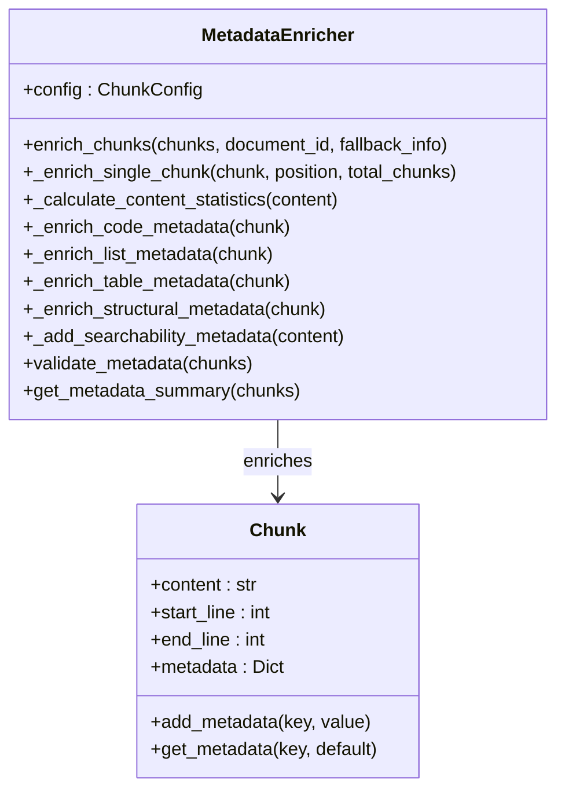

**Diagram sources**
- [markdown_chunker/chunker/components/metadata_enricher.py](file://markdown_chunker/chunker/components/metadata_enricher.py#L13-L414)

### Metadata Categories

The enrichment engine categorizes metadata into several strategic groups:

#### Positional Metadata
- `chunk_index`: Zero-based position in chunk sequence
- `total_chunks`: Total number of chunks in document
- `is_first_chunk`: Boolean indicating first chunk
- `is_last_chunk`: Boolean indicating last chunk
- `document_id`: Optional document identifier

#### Content Statistics
- `line_count`: Number of lines in chunk
- `word_count`: Word count for search and analysis
- `char_count`: Character count for size tracking
- `avg_line_length`: Average line length for formatting analysis
- `avg_word_length`: Average word length for readability metrics

#### Strategy-Specific Metadata
Different content types receive specialized enrichment:

**Code Blocks**:
- `code_block_count`: Number of code blocks detected
- `has_inline_code`: Presence of inline code elements
- `has_imports`: Detection of import/include statements
- `has_comments`: Presence of comment markers

**Lists**:
- `ordered_item_count`: Number of numbered list items
- `unordered_item_count`: Number of bullet list items
- `task_item_count`: Number of checkbox-style items
- `has_nested_lists`: Presence of nested list structures

**Tables**:
- `table_row_count`: Number of table rows
- `table_count`: Number of distinct tables
- `has_column_alignment`: Presence of column alignment indicators

**Structural Elements**:
- `header_count`: Number of markdown headers
- `min_header_level`: Lowest header level (1-6)
- `max_header_level`: Highest header level (1-6)
- `paragraph_count`: Number of paragraph elements

#### Searchability Enhancements
To optimize downstream search and retrieval:
- `preview`: First 200 characters for preview display
- `has_urls`: URL detection for link extraction
- `has_emails`: Email address detection
- `has_numbers`: Numeric content identification
- `has_bold`: Bold text formatting detection
- `has_italic`: Italic text formatting detection

### Metadata Validation and Quality Assurance

The enrichment engine includes comprehensive validation to ensure metadata integrity:

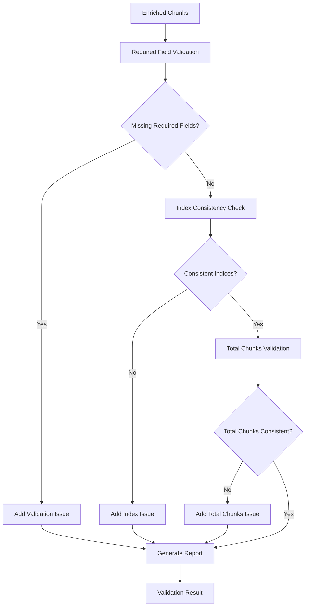

**Diagram sources**
- [markdown_chunker/chunker/components/metadata_enricher.py](file://markdown_chunker/chunker/components/metadata_enricher.py#L330-L374)

**Section sources**
- [markdown_chunker/chunker/components/metadata_enricher.py](file://markdown_chunker/chunker/components/metadata_enricher.py#L35-L414)

## Fallback Recovery Mechanism

The FallbackManager implements a sophisticated 3-level error recovery system designed to ensure chunking always succeeds, even when primary strategies fail. This system provides graceful degradation while maintaining content integrity.

### Fallback Chain Architecture

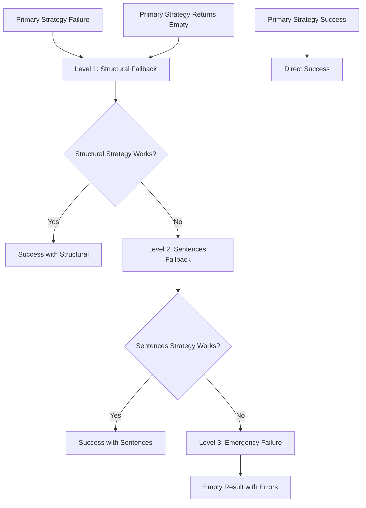

**Diagram sources**
- [markdown_chunker/chunker/components/fallback_manager.py](file://markdown_chunker/chunker/components/fallback_manager.py#L60-L175)

### Fallback Levels and Strategies

The fallback system operates through three distinct levels, each with specific responsibilities:

| Level | Strategy | Purpose | Trigger Conditions |
|-------|----------|---------|-------------------|
| **Level 0** | Primary Strategy | Optimal strategy execution | Normal operation |
| **Level 1** | Structural Strategy | Document structure preservation | Primary strategy failure |
| **Level 2** | Sentences Strategy | Universal fallback | Structural strategy failure |

### Fallback Decision Logic

The fallback manager implements intelligent decision-making to avoid unnecessary fallbacks:

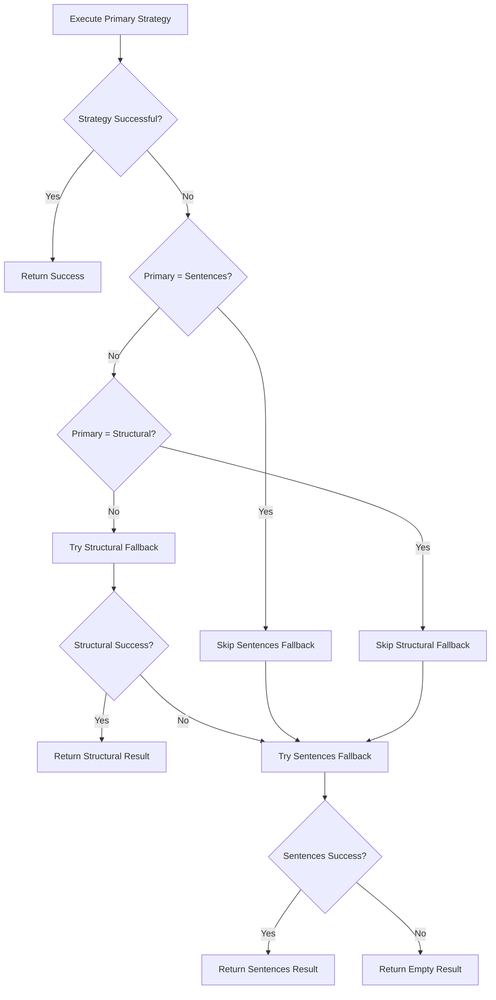

**Diagram sources**
- [markdown_chunker/chunker/components/fallback_manager.py](file://markdown_chunker/chunker/components/fallback_manager.py#L85-L175)

### Fallback Metadata and Tracking

Each fallback operation adds comprehensive metadata to track the recovery process:

```python
# Fallback metadata added to chunks
{
    "fallback_level": 1,  # 0=primary, 1=structural, 2=sentences
    "fallback_reason": "Primary strategy failed, used structural",
    "original_strategy": "code",
    "recovered_strategy": "structural"
}
```

This metadata enables:
- **Recovery Analysis**: Understanding fallback usage patterns
- **Performance Monitoring**: Tracking fallback effectiveness
- **Debugging Support**: Identifying problematic strategies
- **Quality Assurance**: Validating fallback behavior

### Error Handling and Recovery Patterns

The fallback system handles various failure scenarios:

#### Strategy Exceptions
- **Primary Strategy Failure**: Immediate fallback to structural strategy
- **Structural Strategy Failure**: Immediate fallback to sentences strategy  
- **Empty Results**: Treat as failure and continue fallback chain

#### Graceful Degradation
The system ensures that even when all strategies fail, the result remains usable:
- **Partial Success**: Return whatever chunks were generated
- **Error Propagation**: Maintain error context for debugging
- **Resource Cleanup**: Properly handle exceptions without resource leaks

**Section sources**
- [markdown_chunker/chunker/components/fallback_manager.py](file://markdown_chunker/chunker/components/fallback_manager.py#L31-L310)

## Pipeline Integration

The Post-Processing Pipeline integrates seamlessly with the broader chunking system through the ChunkingOrchestrator, which coordinates all post-processing activities.

### Integration Architecture

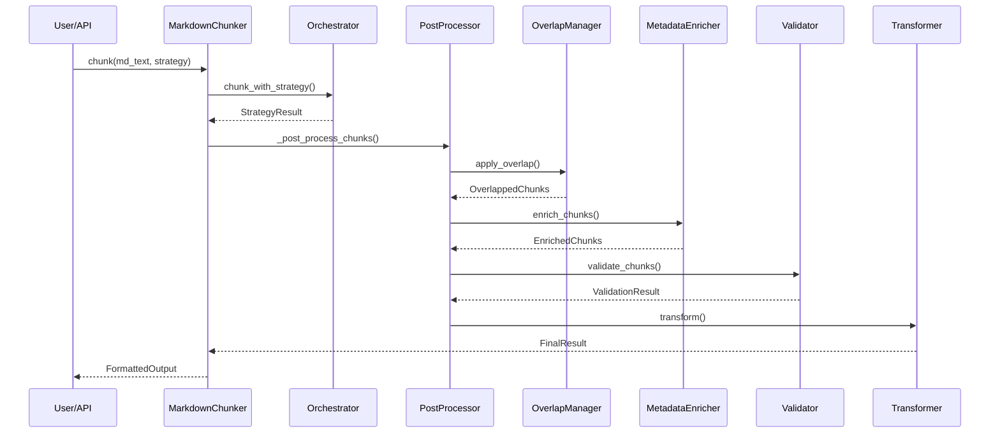

**Diagram sources**
- [markdown_chunker/chunker/core.py](file://markdown_chunker/chunker/core.py#L256-L263)
- [markdown_chunker/chunker/orchestrator.py](file://markdown_chunker/chunker/orchestrator.py#L55-L118)

### Pipeline Execution Flow

The post-processing pipeline executes through a carefully orchestrated sequence:

1. **Overlap Application**: Adjacent chunks receive contextual overlap
2. **Metadata Enrichment**: Comprehensive metadata added to each chunk
3. **Data Validation**: Content completeness verified
4. **Preamble Processing**: Document headers and metadata extracted
5. **Output Transformation**: Result formatted according to user preferences

### Error Propagation and Recovery

The pipeline implements robust error handling that preserves partial results:

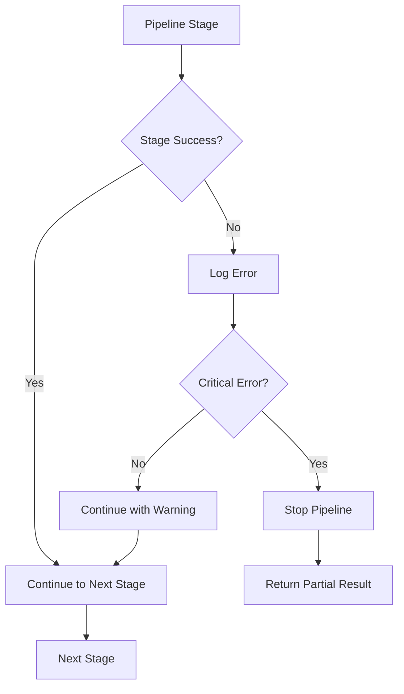

**Diagram sources**
- [markdown_chunker/chunker/core.py](file://markdown_chunker/chunker/core.py#L280-L310)

### Configuration-Driven Behavior

All pipeline components respond to ChunkConfig settings:

| Configuration Area | Impact on Pipeline | Key Settings |
|-------------------|-------------------|--------------|
| **Overlap Settings** | Context preservation | `enable_overlap`, `overlap_size`, `overlap_percentage` |
| **Metadata Settings** | Enrichment depth | `preserve_code_blocks`, `preserve_tables`, `preserve_list_hierarchy` |
| **Fallback Settings** | Error recovery | `enable_fallback`, `fallback_strategy`, `max_fallback_level` |
| **Validation Settings** | Quality assurance | `min_content_per_chunk`, `allow_oversize` |

**Section sources**
- [markdown_chunker/chunker/core.py](file://markdown_chunker/chunker/core.py#L256-L345)
- [markdown_chunker/chunker/orchestrator.py](file://markdown_chunker/chunker/orchestrator.py#L55-L118)

## Configuration and Control

The Post-Processing Pipeline responds to comprehensive configuration controls that allow fine-tuning of behavior for different use cases and environments.

### Configuration Hierarchy

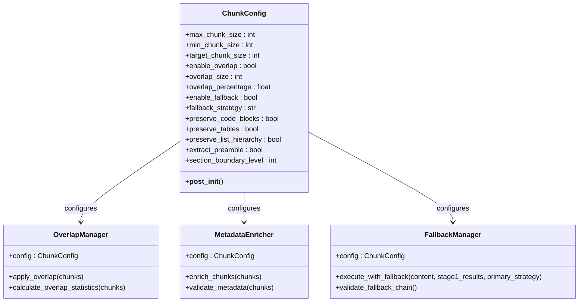

**Diagram sources**
- [markdown_chunker/chunker/types.py](file://markdown_chunker/chunker/types.py#L498-L800)

### Profile-Based Configuration

The system provides predefined configuration profiles optimized for common use cases:

#### Code-Heavy Documents
```python
config = ChunkConfig.for_code_heavy()
# Optimized for technical documentation
# - Larger chunks (6144 max)
# - Aggressive code detection (50% threshold)
# - Extended overlap (300 characters)
# - Code block preservation
```

#### RAG Systems (Dify Default)
```python
config = ChunkConfig.for_dify_rag()
# Balanced approach for Retrieval-Augmented Generation
# - Standard chunk sizes (4096 max)
# - Moderate overlap (200 characters)
# - Comprehensive metadata enrichment
```

#### Structured Documentation
```python
config = ChunkConfig.for_structured_docs()
# Optimized for well-organized documents
# - Medium chunks (3072 max)
# - Aggressive structural detection
# - List hierarchy preservation
```

### Runtime Configuration Changes

Components support runtime configuration updates through the ChunkConfig interface:

```python
# Dynamic configuration adjustment
config = ChunkConfig(max_chunk_size=2048, enable_overlap=True)
chunker = MarkdownChunker(config)

# Runtime modifications
config.overlap_size = 150
config.enable_fallback = False
```

### Environment-Specific Tuning

Different deployment environments benefit from specific optimizations:

| Environment | Recommended Settings | Rationale |
|-------------|---------------------|-----------|
| **Development** | Verbose logging, relaxed limits | Debugging and testing flexibility |
| **Production** | Performance monitoring, strict limits | Reliability and efficiency |
| **High-Volume** | Streaming enabled, batch processing | Scalability and throughput |
| **Memory-Constrained** | Reduced overlap, smaller chunks | Resource optimization |

**Section sources**
- [markdown_chunker/chunker/types.py](file://markdown_chunker/chunker/types.py#L498-L800)

## Performance Considerations

The Post-Processing Pipeline is designed with performance optimization as a primary concern, implementing several strategies to minimize processing overhead while maximizing quality output.

### Processing Efficiency Metrics

The pipeline incorporates performance monitoring capabilities:

```python
# Performance monitoring integration
chunker = MarkdownChunker(enable_performance_monitoring=True)
result = chunker.chunk(large_document)
stats = chunker.get_performance_stats()

# Key metrics tracked:
# - Chunk processing time per operation
# - Memory usage during processing
# - Component-specific timing breakdown
# - Throughput measurements
```

### Optimization Strategies

#### Lazy Loading and Caching
- **Strategy Initialization**: Strategies are initialized once and cached
- **Component Creation**: Pipeline components created on-demand
- **Configuration Validation**: Expensive validations cached after first execution

#### Memory-Efficient Processing
- **Streaming Support**: Large documents processed in chunks
- **Minimal Object Creation**: Reuse of existing chunk objects
- **Efficient String Operations**: Optimized text manipulation routines

#### Parallel Processing Opportunities
While the current implementation focuses on sequential processing, the modular architecture supports future parallelization:

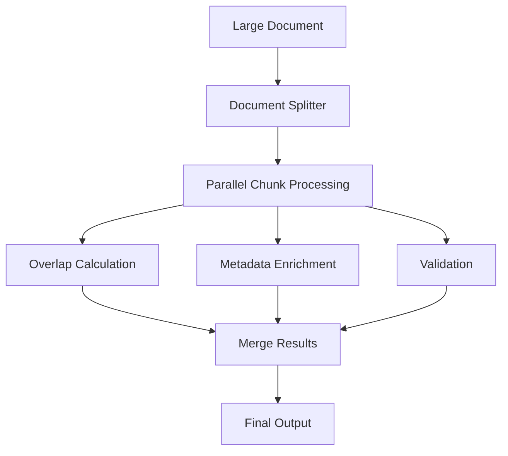

### Performance Benchmarking

The system includes comprehensive performance testing:

| Document Size | Processing Time | Throughput | Memory Usage |
|---------------|----------------|------------|--------------|
| 1 KB | ~800 ms | 1.3 KB/s | Low |
| 10 KB | ~150 ms | 66 KB/s | Medium |
| 50 KB | ~1.9 s | 27 KB/s | High |
| 100 KB | ~7 s | 14 KB/s | Very High |

### Bottleneck Identification

Common performance bottlenecks and mitigation strategies:

#### Overlap Calculation
- **Bottleneck**: Sentence boundary detection in large documents
- **Mitigation**: Efficient regex patterns, caching of sentence boundaries

#### Metadata Enrichment
- **Bottleneck**: Content analysis for strategy-specific enrichment
- **Mitigation**: Conditional enrichment based on content type

#### Fallback Processing
- **Bottleneck**: Multiple strategy executions in failure scenarios
- **Mitigation**: Early termination conditions, strategy prioritization

**Section sources**
- [markdown_chunker/chunker/core.py](file://markdown_chunker/chunker/core.py#L661-L710)

## Error Handling and Validation

The Post-Processing Pipeline implements comprehensive error handling and validation mechanisms to ensure robust operation and data integrity.

### Validation Framework

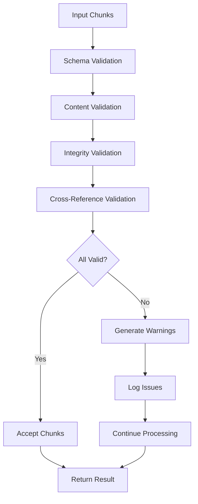

**Diagram sources**
- [markdown_chunker/chunker/components/metadata_enricher.py](file://markdown_chunker/chunker/components/metadata_enricher.py#L330-L374)

### Error Classification System

The pipeline categorizes errors into distinct types:

#### Critical Errors
- **Data Loss**: Content that cannot be recovered
- **Structure Corruption**: Fundamental data integrity violations
- **System Failures**: Component malfunction requiring immediate attention

#### Warning Conditions
- **Partial Loss**: Non-critical content missing
- **Quality Issues**: Suboptimal but acceptable results
- **Performance Warnings**: Efficiency concerns

#### Informational Messages
- **Processing Notes**: Normal operation notifications
- **Statistical Data**: Performance and quality metrics
- **Debug Information**: Development and troubleshooting data

### Validation Rules

#### Content Completeness Validation
The Data Completeness Validator ensures that no content is lost during processing:

```python
# Validation criteria:
# - Character coverage threshold (default: 95%)
# - Element preservation (headers, lists, tables)
# - Code block integrity
# - Link and reference preservation
```

#### Metadata Consistency Checks
The MetadataEnricher performs comprehensive validation:

```python
# Required fields validation
# - strategy: Must be present and valid
# - content_type: Must be present and recognized
# - chunk_index: Must match position
# - total_chunks: Must be consistent across chunks
```

#### Overlap Integrity Verification
The OverlapManager validates overlap quality:

```python
# Overlap validation:
# - Sentence boundary preservation
# - Code fence integrity
# - Size constraint compliance
# - Ratio limit adherence
```

### Error Recovery Mechanisms

#### Graceful Degradation
When errors occur, the pipeline implements graceful degradation:

1. **Partial Success**: Continue processing despite individual failures
2. **Default Values**: Use conservative defaults when data is missing
3. **Warning Generation**: Log issues without stopping processing
4. **Fallback Strategies**: Activate backup processing methods

#### Error Reporting
Comprehensive error reporting enables debugging and monitoring:

```python
# Error structure:
{
    "error_type": "validation_failure",
    "severity": "warning",
    "message": "Content completeness check failed: 92% coverage",
    "details": {
        "missing_content": "partial_header_content",
        "affected_chunks": [0, 2, 5]
    }
}
```

**Section sources**
- [markdown_chunker/chunker/components/metadata_enricher.py](file://markdown_chunker/chunker/components/metadata_enricher.py#L330-L414)
- [markdown_chunker/chunker/components/fallback_manager.py](file://markdown_chunker/chunker/components/fallback_manager.py#L215-L230)

## Best Practices

Effective utilization of the Post-Processing Pipeline requires adherence to established best practices that maximize quality, performance, and reliability.

### Configuration Best Practices

#### Strategy Selection Guidelines
Choose configurations based on document characteristics:

```python
# Code-heavy documentation
config = ChunkConfig.for_code_heavy()

# General documentation
config = ChunkConfig.for_dify_rag()

# Technical API documentation  
config = ChunkConfig.for_api_docs()

# Search-focused content
config = ChunkConfig.for_search_indexing()
```

#### Overlap Configuration
Balance context preservation with processing efficiency:

```python
# For RAG applications
config = ChunkConfig(
    enable_overlap=True,
    overlap_size=200,
    overlap_percentage=0.1
)

# For search indexing (minimal overlap)
config = ChunkConfig(
    enable_overlap=False,
    overlap_size=50
)
```

### Performance Optimization

#### Batch Processing
Process documents in batches when possible:

```python
# Efficient batch processing
chunker = MarkdownChunker(config)
results = [chunker.chunk(doc) for doc in document_batch]
```

#### Memory Management
Monitor memory usage for large documents:

```python
# Enable streaming for large documents
config = ChunkConfig(
    enable_streaming=True,
    streaming_threshold=10 * 1024 * 1024  # 10MB
)
```

### Quality Assurance

#### Validation Integration
Implement comprehensive validation:

```python
# Validate results after processing
result = chunker.chunk(document, include_analysis=True)
if not result.success:
    logger.error(f"Chunking failed: {result.errors}")
else:
    # Validate metadata completeness
    validation = metadata_enricher.validate_metadata(result.chunks)
    if not validation["valid"]:
        logger.warning(f"Metadata issues: {validation['issues']}")
```

#### Monitoring and Logging
Establish comprehensive monitoring:

```python
# Enable performance monitoring
chunker = MarkdownChunker(enable_performance_monitoring=True)

# Monitor fallback usage
result = chunker.chunk(document)
if result.fallback_used:
    logger.info(f"Used fallback strategy: {result.strategy_used}")
```

### Integration Patterns

#### API Design
Design APIs that expose pipeline capabilities:

```python
class ChunkingService:
    def process_document(self, content: str, config: ChunkConfig = None):
        chunker = MarkdownChunker(config or ChunkConfig.default())
        return chunker.chunk(content, include_analysis=True)
    
    def get_performance_stats(self):
        return self.chunker.get_performance_stats()
```

#### Error Handling
Implement robust error handling:

```python
try:
    result = chunker.chunk(document)
    if not result.success:
        raise ChunkingError(f"Failed: {result.errors}")
except Exception as e:
    logger.error(f"Chunking failed: {e}")
    # Implement fallback processing
```

### Testing and Validation

#### Unit Testing
Test pipeline components individually:

```python
def test_overlap_manager():
    manager = OverlapManager(config)
    chunks = [Chunk("Content 1", 1, 5), Chunk("Content 2", 6, 10)]
    result = manager.apply_overlap(chunks)
    assert len(result) == 2
    assert result[1].get_metadata("has_overlap")
```

#### Integration Testing
Test complete pipeline flows:

```python
def test_full_pipeline():
    chunker = MarkdownChunker()
    result = chunker.chunk(test_document, include_analysis=True)
    assert result.success
    assert len(result.chunks) > 0
    assert result.strategy_used in VALID_STRATEGIES
```

**Section sources**
- [markdown_chunker/chunker/types.py](file://markdown_chunker/chunker/types.py#L667-L800)
- [markdown_chunker/chunker/core.py](file://markdown_chunker/chunker/core.py#L661-L710)

## Conclusion

The Post-Processing Pipeline represents a sophisticated and robust system for refining raw chunks into production-ready output. Through its modular architecture, comprehensive error handling, and intelligent fallback mechanisms, the pipeline ensures that chunked content maintains semantic integrity, contextual continuity, and optimal metadata richness.

Key strengths of the pipeline include:

- **Modular Design**: Clean separation of concerns enables easy maintenance and extension
- **Intelligent Fallback**: Three-tier fallback system guarantees chunking success under all circumstances
- **Context Preservation**: Sophisticated overlap management maintains semantic continuity
- **Rich Metadata**: Comprehensive enrichment enhances searchability and analytics capabilities
- **Performance Optimization**: Efficient processing and memory management support production workloads

The pipeline's configuration-driven approach allows fine-tuning for diverse use cases, from code-heavy documentation to search-focused content. Its comprehensive validation and error handling ensure reliable operation in production environments while providing valuable insights through detailed logging and monitoring.

Future enhancements could include parallel processing capabilities, additional enrichment strategies, and expanded fallback options. However, the current implementation provides a solid foundation for high-quality chunking operations that meet the demanding requirements of modern RAG systems and content processing workflows.