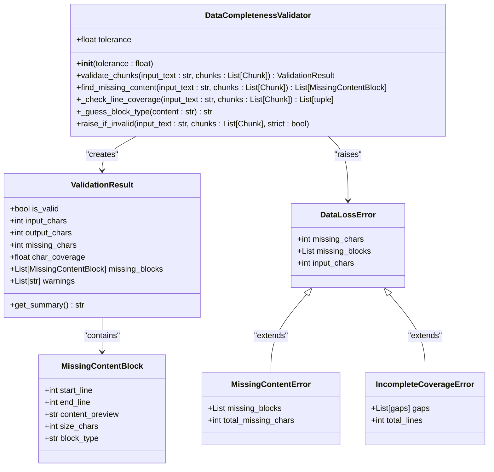
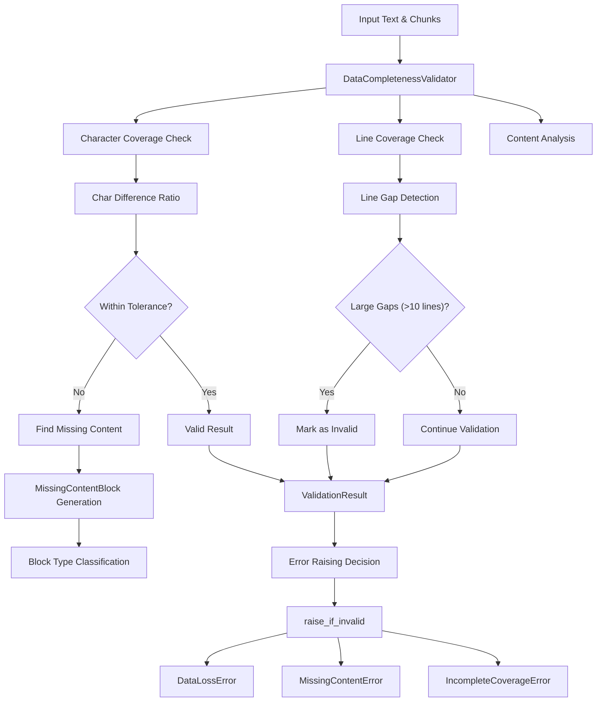
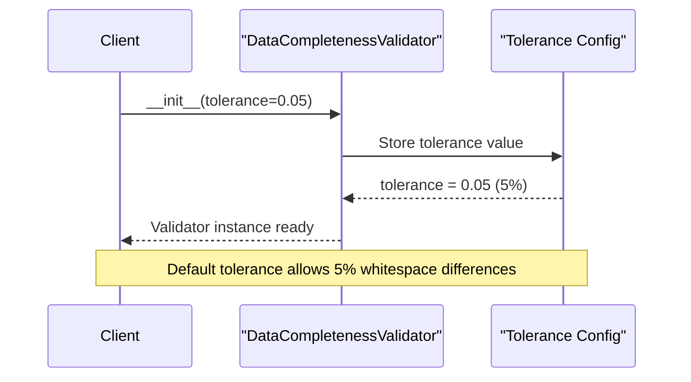
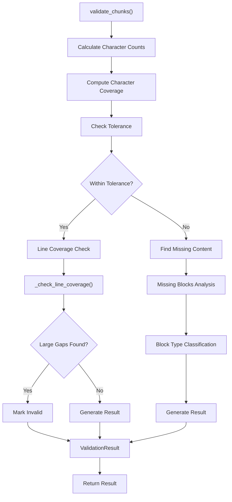
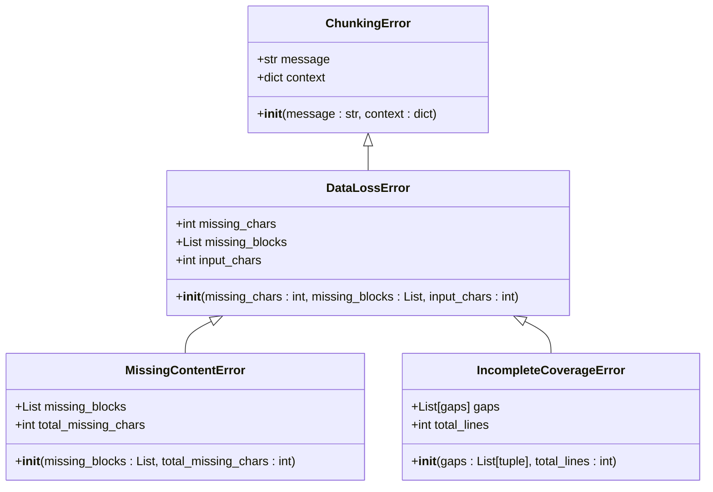
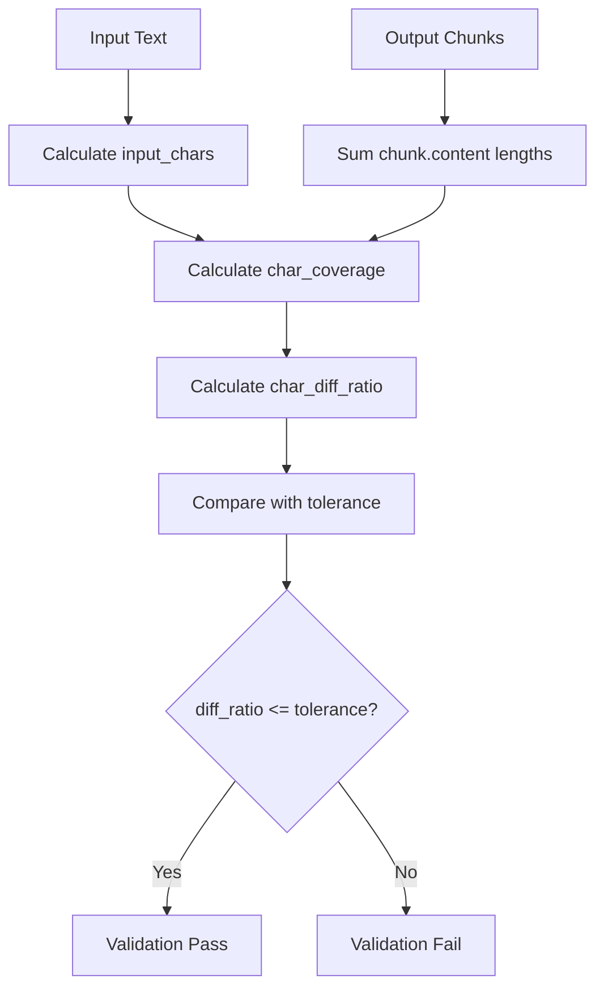
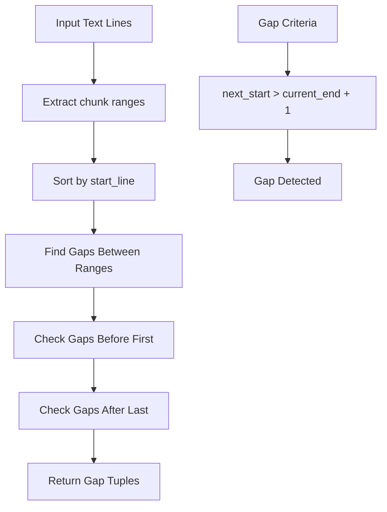
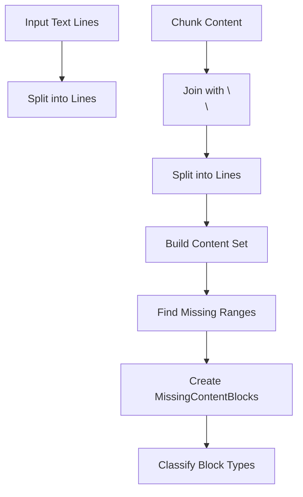
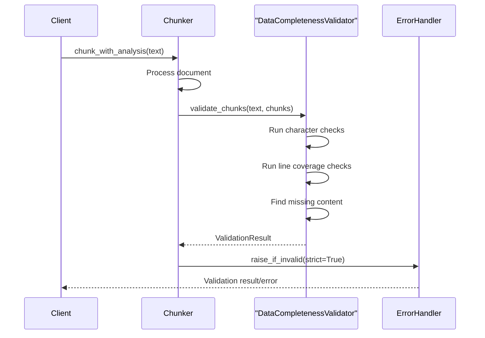

# Validation Framework

<cite>
**Referenced Files in This Document**
- [validator.py](file://markdown_chunker/chunker/validator.py)
- [test_data_completeness_validator.py](file://tests/chunker/test_data_completeness_validator.py)
- [errors.py](file://markdown_chunker/chunker/errors.py)
- [types.py](file://markdown_chunker/chunker/types.py)
- [basic_usage.py](file://examples/basic_usage.py)
- [api_usage.py](file://examples/api_usage.py)
</cite>

## Table of Contents
1. [Introduction](#introduction)
2. [Core Components](#core-components)
3. [Architecture Overview](#architecture-overview)
4. [DataCompletenessValidator Implementation](#datacompletenessvalidator-implementation)
5. [Validation Results and Error Handling](#validation-results-and-error-handling)
6. [Key Algorithms and Methods](#key-algorithms-and-methods)
7. [Practical Usage Examples](#practical-usage-examples)
8. [Common Issues and Solutions](#common-issues-and-solutions)
9. [Best Practices](#best-practices)
10. [Troubleshooting Guide](#troubleshooting-guide)

## Introduction

The DataCompletenessValidator is a sophisticated validation framework designed to ensure no data is lost during the markdown chunking process. It provides comprehensive checking mechanisms that validate character coverage, line coverage, and content completeness with configurable tolerance levels. The validator serves as a critical quality assurance component in the markdown chunking pipeline, preventing data loss while allowing for reasonable whitespace normalization differences.

The validation framework operates on multiple levels:
- **Character-level validation**: Ensures total character count matches within configurable tolerance
- **Line-level validation**: Identifies gaps in line coverage and prevents structural data loss
- **Content-level validation**: Detects missing content blocks and provides detailed reporting
- **Error classification**: Distinguishes between different types of data loss scenarios

## Core Components

The validation framework consists of several interconnected components that work together to provide comprehensive data integrity checking:



**Diagram sources**
- [validator.py](file://markdown_chunker/chunker/validator.py#L52-L354)
- [errors.py](file://markdown_chunker/chunker/errors.py#L111-L185)

**Section sources**
- [validator.py](file://markdown_chunker/chunker/validator.py#L14-L51)
- [errors.py](file://markdown_chunker/chunker/errors.py#L111-L185)

## Architecture Overview

The validation framework follows a layered architecture that separates concerns between validation logic, result modeling, and error handling:



**Diagram sources**
- [validator.py](file://markdown_chunker/chunker/validator.py#L70-L151)

## DataCompletenessValidator Implementation

The `DataCompletenessValidator` class serves as the central component for ensuring data integrity during chunking operations. It provides a comprehensive validation framework with configurable tolerance levels and detailed reporting capabilities.

### Initialization and Configuration

The validator accepts a configurable tolerance parameter that controls how much whitespace normalization is allowed:



**Diagram sources**
- [validator.py](file://markdown_chunker/chunker/validator.py#L60-L70)

### Core Validation Process

The `validate_chunks` method implements the primary validation logic with multiple checking stages:



**Diagram sources**
- [validator.py](file://markdown_chunker/chunker/validator.py#L70-L151)

**Section sources**
- [validator.py](file://markdown_chunker/chunker/validator.py#L70-L151)

## Validation Results and Error Handling

The validation framework produces detailed results through the `ValidationResult` dataclass and raises specific error types when validation fails.

### ValidationResult Dataclass

The `ValidationResult` captures all aspects of the validation outcome:

| Field | Type | Description |
|-------|------|-------------|
| `is_valid` | `bool` | Overall validation success flag |
| `input_chars` | `int` | Total characters in input text |
| `output_chars` | `int` | Total characters in output chunks |
| `missing_chars` | `int` | Number of missing characters |
| `char_coverage` | `float` | Character coverage ratio (0.0-1.0) |
| `missing_blocks` | `List[MissingContentBlock]` | Detailed missing content information |
| `warnings` | `List[str]` | Non-fatal validation warnings |

### Error Hierarchy

The framework provides a structured error hierarchy for different types of data loss:



**Diagram sources**
- [errors.py](file://markdown_chunker/chunker/errors.py#L111-L185)

**Section sources**
- [validator.py](file://markdown_chunker/chunker/validator.py#L25-L49)
- [errors.py](file://markdown_chunker/chunker/errors.py#L111-L185)

## Key Algorithms and Methods

### Character Coverage Calculation

The validator calculates character coverage with configurable tolerance:



**Diagram sources**
- [validator.py](file://markdown_chunker/chunker/validator.py#L87-L116)

### Line Coverage Detection

The `_check_line_coverage` method identifies gaps in line coverage:



**Diagram sources**
- [validator.py](file://markdown_chunker/chunker/validator.py#L227-L275)

### Missing Content Detection

The `find_missing_content` method identifies specific content blocks that are missing:



**Diagram sources**
- [validator.py](file://markdown_chunker/chunker/validator.py#L153-L225)

### Block Type Classification

The `_guess_block_type` method categorizes missing content blocks:

| Pattern | Block Type | Detection Method |
|---------|------------|------------------|
| Starts with `#` | `header` | Line starts with hash |
| Contains `|` and starts with `|` | `table` | Table structure detection |
| Starts with `- `, `* `, `+ `, `1. `, etc. | `list` | List marker detection |
| Starts with `    ` or ```` | `code` | Indentation/code fence |
| Default | `paragraph` | Standard text content |

**Section sources**
- [validator.py](file://markdown_chunker/chunker/validator.py#L153-L225)
- [validator.py](file://markdown_chunker/chunker/validator.py#L227-L275)
- [validator.py](file://markdown_chunker/chunker/validator.py#L277-L312)

## Practical Usage Examples

### Basic Validation Usage

The simplest way to use the validator is to call `validate_chunks`:

```python
# Example usage from test suite
validator = DataCompletenessValidator(tolerance=0.05)
result = validator.validate_chunks(input_text, chunks)

if result.is_valid:
    print(f"Validation passed: {result.char_coverage:.1%} coverage")
else:
    print(f"Validation failed: {result.missing_chars} chars missing")
    for block in result.missing_blocks:
        print(f"  Missing {block.size_chars} chars at lines {block.start_line}-{block.end_line}")
```

### Strict Validation Mode

The `raise_if_invalid` method provides automatic error raising:

```python
# Example usage from test suite
try:
    validator.raise_if_invalid(input_text, chunks, strict=True)
except MissingContentError as e:
    print(f"Missing content blocks: {len(e.missing_blocks)}")
except IncompleteCoverageError as e:
    print(f"Line coverage gaps: {len(e.gaps)}")
except DataLossError as e:
    print(f"General data loss: {e.missing_chars} chars")
```

### Integration with Chunking Pipeline

The validator integrates seamlessly with the chunking pipeline:



**Diagram sources**
- [basic_usage.py](file://examples/basic_usage.py#L38-L47)
- [api_usage.py](file://examples/api_usage.py#L25-L46)

**Section sources**
- [test_data_completeness_validator.py](file://tests/chunker/test_data_completeness_validator.py#L114-L164)
- [test_data_completeness_validator.py](file://tests/chunker/test_data_completeness_validator.py#L307-L324)

## Common Issues and Solutions

### False Positives in Whitespace Normalization

**Problem**: The validator may report data loss due to whitespace normalization differences.

**Solution**: Adjust the tolerance parameter based on expected formatting variations:

```python
# For documents with significant whitespace differences
validator = DataCompletenessValidator(tolerance=0.10)  # 10% tolerance

# For documents with minimal formatting changes
validator = DataCompletenessValidator(tolerance=0.02)  # 2% tolerance
```

### Large Gaps in Line Coverage

**Problem**: Documents with structural elements may show large gaps if line information is lost.

**Solution**: Ensure chunks maintain proper line numbering:

```python
# Proper chunk creation with line information
chunk = Chunk(
    content="content",
    start_line=1,      # Must be 1-based
    end_line=10,       # Must be >= start_line
    metadata={"strategy": "structural"}
)
```

### Missing Content Block Detection Limitations

**Problem**: The missing content detection may not catch all types of content loss.

**Solution**: Combine validation with additional checks:

```python
# Enhanced validation approach
result = validator.validate_chunks(input_text, chunks)
if not result.is_valid:
    # Additional analysis
    if result.missing_blocks:
        # Analyze missing blocks
        for block in result.missing_blocks:
            print(f"Missing {block.block_type} block: {block.size_chars} chars")
    
    # Check for line coverage issues
    line_gaps = validator._check_line_coverage(input_text, chunks)
    if line_gaps:
        print(f"Line coverage gaps: {len(line_gaps)}")
```

### Memory Usage with Large Documents

**Problem**: Processing very large documents may consume significant memory.

**Solution**: Use streaming or batch processing approaches:

```python
# Process large documents in chunks
def validate_large_document(validator, large_text, chunk_size=10000):
    # Split document into manageable chunks
    parts = [large_text[i:i+chunk_size] for i in range(0, len(large_text), chunk_size)]
    
    for part in parts:
        # Validate each part separately
        result = validator.validate_chunks(part, extract_chunks_for_part(part))
        if not result.is_valid:
            return result
    
    return ValidationResult(is_valid=True, ...)
```

**Section sources**
- [test_data_completeness_validator.py](file://tests/chunker/test_data_completeness_validator.py#L135-L164)
- [test_data_completeness_validator.py](file://tests/chunker/test_data_completeness_validator.py#L229-L242)

## Best Practices

### Configuration Guidelines

1. **Tolerance Selection**: Choose tolerance based on document type:
   - **Technical documentation**: 0.03-0.05 (strict)
   - **General documentation**: 0.05-0.08 (moderate)
   - **Creative writing**: 0.10-0.15 (flexible)

2. **Strict vs. Lenient Mode**: Use strict mode for production, lenient for development

3. **Error Handling**: Always handle validation errors appropriately

### Performance Optimization

1. **Early Termination**: Stop validation early when obvious failures occur
2. **Batch Processing**: Process multiple documents efficiently
3. **Memory Management**: Monitor memory usage with large documents

### Integration Patterns

1. **Pipeline Integration**: Integrate validation into chunking pipeline
2. **Monitoring**: Log validation results for quality tracking
3. **Fallback Strategies**: Implement fallback validation approaches

## Troubleshooting Guide

### Validation Always Fails

**Symptoms**: All validations return `is_valid=False`

**Possible Causes**:
- Incorrect chunk line numbering
- Missing line information in chunks
- Very high whitespace differences

**Solutions**:
- Verify chunk line numbers are correct (1-based)
- Ensure chunks have proper `start_line` and `end_line` attributes
- Increase tolerance if whitespace differences are expected

### Missing Content Blocks Not Detected

**Symptoms**: Validations pass despite obvious content loss

**Possible Causes**:
- Content is still present in chunks (false negative)
- Tolerance is too high
- Content is in unexpected format

**Solutions**:
- Verify content is actually missing from chunks
- Decrease tolerance for stricter validation
- Check content format assumptions in `_guess_block_type`

### Performance Issues

**Symptoms**: Slow validation with large documents

**Possible Causes**:
- Large document size
- Complex content structure
- Inefficient chunk processing

**Solutions**:
- Process documents in smaller chunks
- Optimize chunk extraction
- Use streaming validation approaches

### Error Classification Confusion

**Symptoms**: Unclear which error type to handle

**Solutions**:
- Use `MissingContentError` for specific content blocks
- Use `IncompleteCoverageError` for structural gaps
- Use `DataLossError` for general data loss scenarios

**Section sources**
- [test_data_completeness_validator.py](file://tests/chunker/test_data_completeness_validator.py#L307-L324)
- [test_data_completeness_validator.py](file://tests/chunker/test_data_completeness_validator.py#L380-L419)