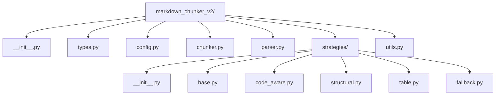
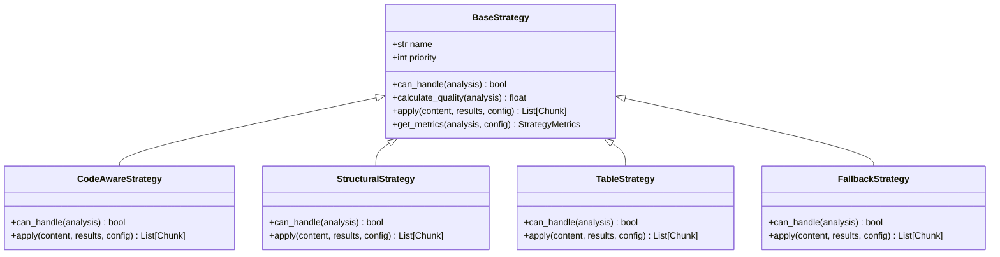
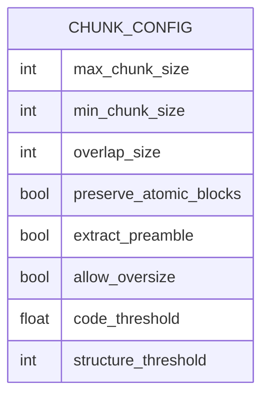
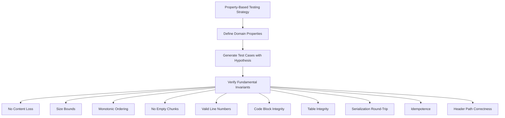

# Redesign Implementation Plan

<cite>
**Referenced Files in This Document**  
- [01-phase-breakdown.md](file://docs/architecture-audit-v2-redesign-plan/01-phase-breakdown.md)
- [02-testing-strategy.md](file://docs/architecture-audit-v2-redesign-plan/02-testing-strategy.md)
- [01-confirmed-findings.md](file://docs/architecture-audit-v2/01-confirmed-findings.md)
- [03-architectural-smells.md](file://docs/architecture-audit-v2/03-architectural-smells.md)
- [ARCHITECTURE_REDESIGN_SUMMARY.md](file://docs/ARCHITECTURE_REDESIGN_SUMMARY.md)
- [README.md](file://docs/architecture-audit-v2-to-be/README.md)
- [core.py](file://markdown_chunker/chunker/core.py)
- [orchestrator.py](file://markdown_chunker/chunker/orchestrator.py)
- [base.py](file://markdown_chunker/chunker/strategies/base.py)
</cite>

## Table of Contents
1. [Introduction](#introduction)
2. [Project Structure](#project-structure)
3. [Core Components](#core-components)
4. [Architecture Overview](#architecture-overview)
5. [Detailed Component Analysis](#detailed-component-analysis)
6. [Dependency Analysis](#dependency-analysis)
7. [Performance Considerations](#performance-considerations)
8. [Troubleshooting Guide](#troubleshooting-guide)
9. [Conclusion](#conclusion)

## Introduction
The Dify Markdown Chunker project has accumulated significant technical debt through iterative patching, resulting in a complex and difficult-to-maintain codebase. Despite satisfying all functional requirements, the system suffers from architectural issues including configuration bloat, redundant strategies, dual implementations of key features, and an excessive test suite. This document presents a comprehensive redesign implementation plan to address these issues by creating a simplified, domain-driven architecture that maintains all existing functionality while reducing complexity by approximately 80%.

The redesign is based on extensive architectural analysis documented in the `docs/architecture-audit-v2/` directory, which confirms 13 architectural smells ranging from critical to low severity. The proposed solution involves a complete rewrite rather than incremental refactoring due to the deeply intertwined nature of the issues, particularly the "fix-upon-fix" pattern that has created 12 distinct layers of patches.

**Section sources**
- [ARCHITECTURE_REDESIGN_SUMMARY.md](file://docs/ARCHITECTURE_REDESIGN_SUMMARY.md#L1-L234)
- [01-confirmed-findings.md](file://docs/architecture-audit-v2/01-confirmed-findings.md#L1-L384)

## Project Structure
The current project structure contains 55 Python files distributed across multiple modules, contributing to navigation difficulty and cognitive load. The `markdown_chunker/` directory is organized into four main modules: `chunker/` (26 files), `parser/` (15 files), `api/` (5 files), and root-level components (2 files). This excessive modularization has led to scattered concerns and complex dependency relationships.

The redesign will consolidate this structure into a simplified 12-file architecture as outlined in the target architecture documentation. The new structure will eliminate redundant files, merge overlapping functionality, and create a more intuitive organization that follows domain-driven design principles. This consolidation addresses the HIGH severity architectural smell SMELL-1 (Too Many Files) and SMELL-2 (Bloated Files) identified in the audit.



**Diagram sources**
- [README.md](file://docs/architecture-audit-v2-to-be/README.md#L129-L144)

## Core Components
The core components of the current system include the `MarkdownChunker` class, multiple chunking strategies, and a complex orchestration pipeline. The `MarkdownChunker` class in `core.py` initializes six different strategies and coordinates their execution through the `ChunkingOrchestrator`. This design has led to redundancy, particularly with the `ListStrategy` being excluded from auto-selection despite being loaded, representing 856 lines of effectively unused code.

The base strategy class defines a comprehensive interface that all strategies must implement, including methods for determining applicability, calculating quality scores, and applying the strategy to create chunks. This abstraction layer, while providing consistency, has also contributed to complexity and code duplication across the various strategy implementations.

**Section sources**
- [core.py](file://markdown_chunker/chunker/core.py#L41-L135)
- [base.py](file://markdown_chunker/chunker/strategies/base.py#L16-L426)
- [orchestrator.py](file://markdown_chunker/chunker/orchestrator.py#L44-L85)

## Architecture Overview
The current architecture follows a multi-stage pipeline with significant complexity and duplication. The system suffers from multiple HIGH severity architectural smells, including dual overlap mechanisms (SMELL-5), dual post-processing pipelines (SMELL-6), and configuration explosion (SMELL-3) with 32 parameters. The "fix-upon-fix" pattern (SMELL-12) represents a CRITICAL architectural smell, with at least 10 documented layers of patches applied over time.

The redesigned architecture will implement a simplified three-stage pipeline: Stage 1 (Parser analysis), Stage 2 (Strategy selection and application), and Stage 3 (Post-processing). This unified pipeline will eliminate the dual mechanisms and consolidate the scattered validation logic into a single point of truth. The redesign will reduce configuration parameters from 32 to 8 essential parameters, remove the unused ListStrategy, and merge the Code and Mixed strategies into a single CodeAwareStrategy.

```mermaid
graph TD
A[Input Markdown Text] --> B[Stage 1: Parser.analyze()]
B --> C[ContentAnalysis]
C --> D[Stage 2: Chunker.chunk()]
D --> E[Strategy Selection]
E --> F[Apply Strategy]
F --> G[List[Chunk]]
G --> H[Stage 3: Post-Processing]
H --> I[Apply Block Overlap]
I --> J[Enrich Metadata]
J --> K[Validate Properties]
K --> L[Output ChunkingResult]
```

**Diagram sources**
- [README.md](file://docs/architecture-audit-v2-to-be/README.md#L148-L172)

## Detailed Component Analysis

### Strategy Consolidation
The current system implements six chunking strategies: CodeStrategy, StructuralStrategy, MixedStrategy, ListStrategy, TableStrategy, and SentencesStrategy. This represents a MEDIUM severity architectural smell (SMELL-4: Redundant Strategies) with significant code duplication, particularly between CodeStrategy and MixedStrategy. The ListStrategy is particularly problematic as it is explicitly excluded from auto-selection despite being loaded, representing 856 lines of effectively dead code.

The redesign will consolidate these six strategies into four: CodeAwareStrategy (merging Code and Mixed), StructuralStrategy, TableStrategy, and FallbackStrategy (renamed from SentencesStrategy). This consolidation addresses the redundancy while preserving all functional capabilities. The CodeAwareStrategy will handle both code-heavy and mixed-content documents intelligently, using content analysis to determine the optimal approach.



**Diagram sources**
- [03-architectural-smells.md](file://docs/architecture-audit-v2/03-architectural-smells.md#L173-L192)
- [README.md](file://docs/architecture-audit-v2-to-be/README.md#L80-L85)

### Configuration Simplification
The current system suffers from configuration explosion (SMELL-3) with 32 parameters organized into multiple categories: size parameters, overlap parameters, strategy thresholds, behavior flags, bug fix parameters, and metadata options. This complexity creates decision paralysis for users and increases the testing burden exponentially.

The redesign will reduce this to 8 essential parameters that capture the core configuration needs:
- Size constraints (3): max_chunk_size, min_chunk_size, overlap_size
- Behavior (3): preserve_atomic_blocks, extract_preamble, allow_oversize
- Strategy thresholds (2): code_threshold, structure_threshold

This simplification eliminates derived parameters, removes fix flags (making all fixes default behavior), and removes unused parameters. The target configuration structure represents a 75% reduction in complexity while maintaining all essential functionality.



**Diagram sources**
- [README.md](file://docs/architecture-audit-v2-to-be/README.md#L89-L104)
- [03-architectural-smells.md](file://docs/architecture-audit-v2/03-architectural-smells.md#L96-L109)

### Testing Strategy
The current test suite contains 1,853 tests across 162 files, with the majority focused on implementation details rather than domain properties. This represents a HIGH severity issue (SMELL-6: Test Debt) that makes refactoring risky and locks in the current implementation. The tests validate HOW the system works rather than WHAT it should do, creating implementation coupling.

The redesign will adopt a property-based testing approach using Hypothesis, reducing the test count from 1,853 to approximately 50 while providing stronger guarantees. The new test suite will focus on 10 fundamental domain properties that define the system's correct behavior:
- PROP-1: No Content Loss
- PROP-2: Size Bounds
- PROP-3: Monotonic Ordering
- PROP-4: No Empty Chunks
- PROP-5: Valid Line Numbers
- PROP-6: Code Block Integrity
- PROP-7: Table Integrity
- PROP-8: Serialization Round-Trip
- PROP-9: Idempotence
- PROP-10: Header Path Correctness

This approach tests WHAT the system must do rather than HOW it does it, making the tests implementation-independent and more resilient to refactoring.



**Diagram sources**
- [02-testing-strategy.md](file://docs/architecture-audit-v2-redesign-plan/02-testing-strategy.md#L37-L557)
- [04-domain-properties.md](file://docs/architecture-audit-v2/04-domain-properties.md#L1-L330)

## Dependency Analysis
The current system has accumulated dependencies that contribute to its complexity. The parser module uses multiple Markdown parsing libraries (mistune and markdown) alongside the primary markdown-it-py library, creating redundancy. The extensive API surface with 52 public exports in the parser module (SMELL-8: API Pollution) creates maintenance burden and user confusion.

The redesign will streamline dependencies by removing redundant parsing libraries (mistune and markdown) and reducing the public API to 7 essential exports. This simplification addresses the MEDIUM severity architectural smell of API pollution and reduces the cognitive load for both users and maintainers. The dependency analysis confirms that the core functionality can be maintained with a minimal set of well-chosen dependencies.

**Section sources**
- [03-architectural-smells.md](file://docs/architecture-audit-v2/03-architectural-smells.md#L214-L230)
- [README.md](file://docs/architecture-audit-v2-to-be/README.md#L196-L208)

## Performance Considerations
The redesign prioritizes simplicity and maintainability over marginal performance gains, accepting a potential 20% performance variance compared to the current implementation. The simplified architecture may have slightly higher overhead due to the single-pass parser implementation, but this is considered an acceptable trade-off for the significant reduction in complexity.

The property-based testing approach will include performance benchmarking to ensure the system remains within acceptable performance parameters. The success criteria specify that performance must remain within 20% of the current implementation, providing a clear threshold for acceptance. This balanced approach acknowledges that developer productivity and code maintainability are critical performance factors that have been severely impacted by the current architecture's complexity.

**Section sources**
- [ARCHITECTURE_REDESIGN_SUMMARY.md](file://docs/ARCHITECTURE_REDESIGN_SUMMARY.md#L174-L175)
- [README.md](file://docs/architecture-audit-v2-to-be/README.md#L191-L192)

## Troubleshooting Guide
The current system's complexity creates significant troubleshooting challenges, with validation logic scattered across six components and error handling distributed throughout the codebase. The "fix-upon-fix" pattern has created a situation where it's difficult to determine which fixes are still necessary and which might be interfering with each other.

The redesign will centralize validation and error handling to create a more predictable and diagnosable system. All property validation will occur in a single post-processing stage, with clear error messages that identify which domain property was violated. The simplified configuration will eliminate the need for users to understand complex interactions between 32 parameters and multiple fix flags.

When troubleshooting issues in the redesigned system, users should:
1. Verify that all 10 domain properties pass using the property test suite
2. Check configuration parameters against the 8 essential parameters
3. Review the unified validation output for specific property violations
4. Consult the migration guide when upgrading from version 1.x

**Section sources**
- [01-confirmed-findings.md](file://docs/architecture-audit-v2/01-confirmed-findings.md#L280-L323)
- [03-architectural-smells.md](file://docs/architecture-audit-v2/03-architectural-smells.md#L194-L213)

## Conclusion
The Dify Markdown Chunker has accumulated significant technical debt through iterative patching without periodic architectural refactoring. While the system correctly satisfies all 10 essential domain properties, its implementation has become unnecessarily complex with 55 files, 32 configuration parameters, 6 chunking strategies (one unused), and 1,853 tests.

The proposed redesign addresses these issues through a complete rewrite that maintains all functionality while reducing complexity by approximately 80%. The new architecture will feature 12 files instead of 55, 8 configuration parameters instead of 32, 4 strategies instead of 6, and approximately 50 property-based tests instead of 1,853 implementation-focused tests.

This redesign represents the right time for a significant architectural improvement because the project is stable (all properties pass), the domain is well-understood (10 clear properties), and the benefits of a simpler, more maintainable system far outweigh the 3-week investment required for implementation. The success criteria are clear and measurable, focusing on code metrics, quality metrics, and functional equivalence.