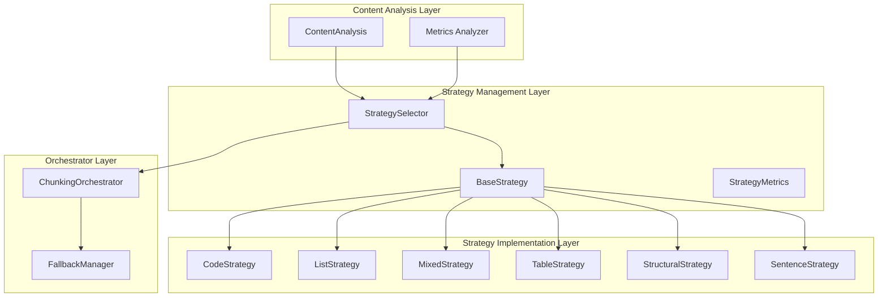
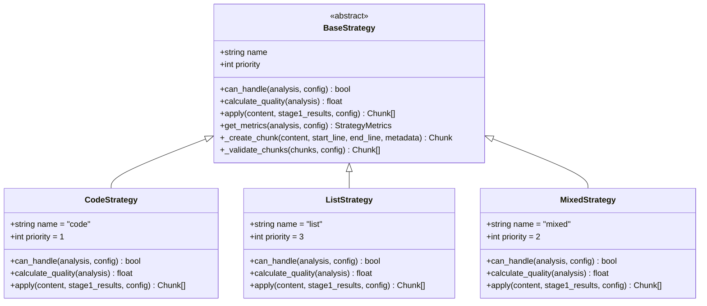
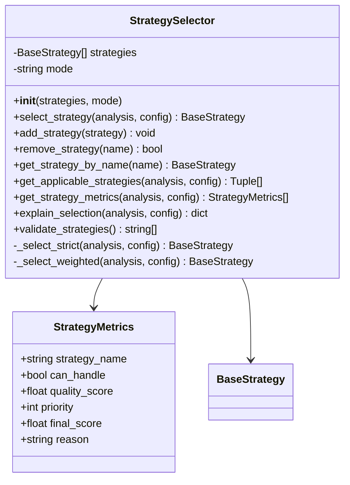
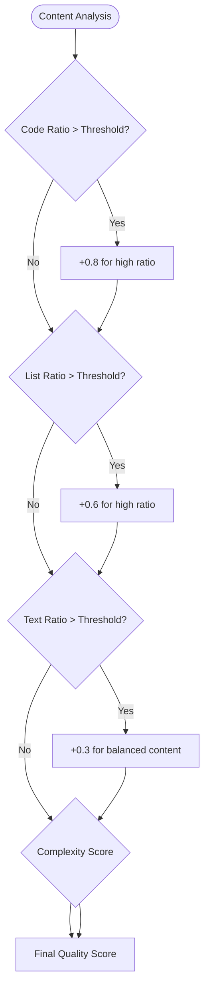
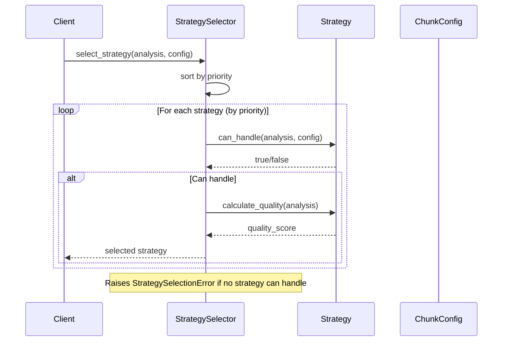
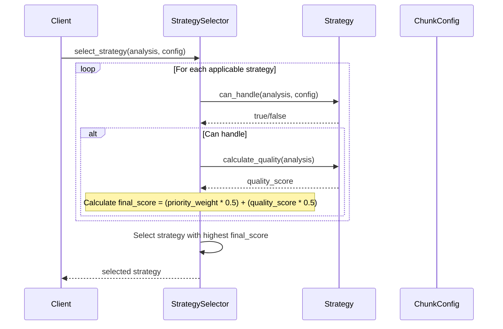
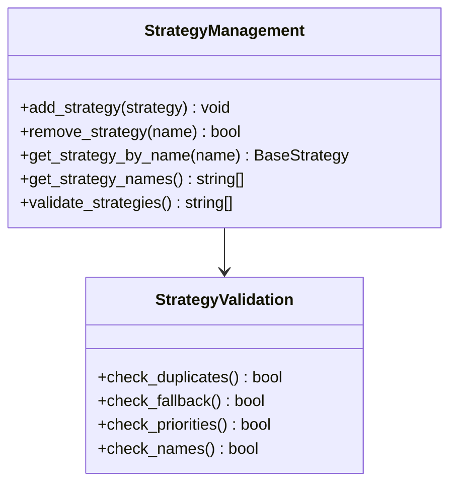
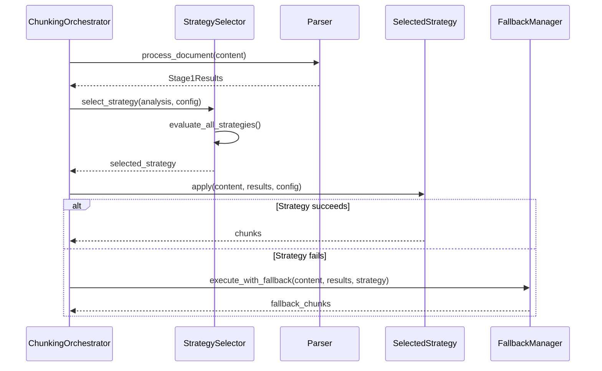
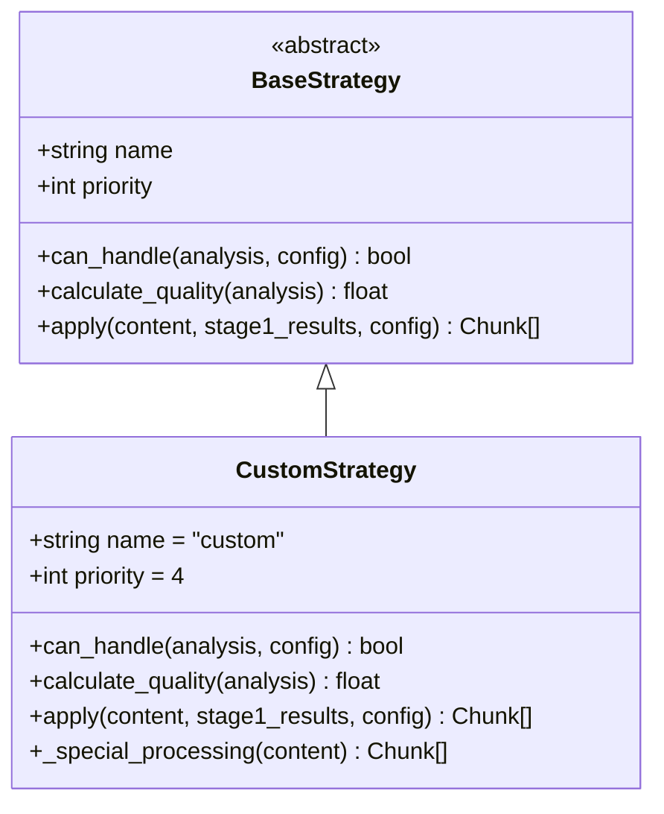

# Strategy Selector Architecture Documentation

<cite>
**Referenced Files in This Document**
- [selector.py](file://markdown_chunker/chunker/selector.py)
- [orchestrator.py](file://markdown_chunker/chunker/orchestrator.py)
- [base.py](file://markdown_chunker/chunker/strategies/base.py)
- [types.py](file://markdown_chunker/chunker/types.py)
- [code_strategy.py](file://markdown_chunker/chunker/strategies/code_strategy.py)
- [list_strategy.py](file://markdown_chunker/chunker/strategies/list_strategy.py)
- [mixed_strategy.py](file://markdown_chunker/chunker/strategies/mixed_strategy.py)
- [analyzer.py](file://markdown_chunker/parser/analyzer.py)
- [test_strategy_selector.py](file://tests/chunker/test_strategy_selector.py)
</cite>

## Table of Contents
1. [Introduction](#introduction)
2. [Architecture Overview](#architecture-overview)
3. [Strategy Pattern Implementation](#strategy-pattern-implementation)
4. [Factory Pattern for Strategy Management](#factory-pattern-for-strategy-management)
5. [Content Analysis and Metrics](#content-analysis-and-metrics)
6. [Strategy Selection Modes](#strategy-selection-modes)
7. [Dynamic Strategy Management](#dynamic-strategy-management)
8. [Integration with Orchestrator](#integration-with-orchestrator)
9. [Extensibility and Custom Strategies](#extensibility-and-custom-strategies)
10. [Performance Considerations](#performance-considerations)
11. [Testing and Validation](#testing-and-validation)
12. [Conclusion](#conclusion)

## Introduction

The Strategy Selector component is the core intelligence engine of the Dify Markdown Chunker system, implementing sophisticated algorithm selection based on content characteristics. It serves as the bridge between content analysis and strategy application, ensuring optimal chunking performance through intelligent decision-making.

The component implements both the Strategy Pattern and Factory Pattern to provide flexible, extensible, and maintainable chunking strategy selection. It evaluates ContentAnalysis metrics to score and rank available strategies, offering two distinct selection modes: strict priority-based selection and weighted adaptive selection.

## Architecture Overview

The Strategy Selector follows a layered architecture that separates concerns between strategy management, content analysis, and selection logic:

**Diagram sources**
- [selector.py](file://markdown_chunker/chunker/selector.py#L23-L322)
- [base.py](file://markdown_chunker/chunker/strategies/base.py#L16-L380)
- [orchestrator.py](file://markdown_chunker/chunker/orchestrator.py#L23-L340)

**Section sources**
- [selector.py](file://markdown_chunker/chunker/selector.py#L1-L322)
- [base.py](file://markdown_chunker/chunker/strategies/base.py#L1-L380)

## Strategy Pattern Implementation

The Strategy Pattern is implemented through the BaseStrategy abstract class, which defines a common interface for all chunking strategies:

**Diagram sources**
- [base.py](file://markdown_chunker/chunker/strategies/base.py#L16-L380)
- [code_strategy.py](file://markdown_chunker/chunker/strategies/code_strategy.py#L42-L625)
- [list_strategy.py](file://markdown_chunker/chunker/strategies/list_strategy.py#L58-L853)
- [mixed_strategy.py](file://markdown_chunker/chunker/strategies/mixed_strategy.py#L75-L849)

Each strategy implements three core methods:
- **can_handle()**: Determines if the strategy is applicable to the given content
- **calculate_quality()**: Rates the strategy's suitability for the content
- **apply()**: Implements the actual chunking logic

**Section sources**
- [base.py](file://markdown_chunker/chunker/strategies/base.py#L46-L95)
- [code_strategy.py](file://markdown_chunker/chunker/strategies/code_strategy.py#L109-L135)
- [list_strategy.py](file://markdown_chunker/chunker/strategies/list_strategy.py#L89-L101)

## Factory Pattern for Strategy Management

The StrategySelector implements the Factory Pattern by managing a collection of strategy instances and providing centralized creation and management functionality:

**Diagram sources**
- [selector.py](file://markdown_chunker/chunker/selector.py#L23-L322)
- [types.py](file://markdown_chunker/chunker/types.py#L1032-L1061)

The factory provides several key capabilities:
- **Strategy Registration**: Dynamic addition and removal of strategies
- **Priority Management**: Automatic sorting by strategy priority
- **Validation**: Ensures proper strategy configuration
- **Metrics Collection**: Comprehensive performance tracking

**Section sources**
- [selector.py](file://markdown_chunker/chunker/selector.py#L274-L307)
- [types.py](file://markdown_chunker/chunker/types.py#L1032-L1061)

## Content Analysis and Metrics

The Strategy Selector evaluates ContentAnalysis metrics to make informed decisions about strategy selection. The analysis encompasses several key dimensions:

### Content Characteristics Evaluation

| Metric Category | Description | Impact on Strategy Selection |
|----------------|-------------|----------------------------|
| **Code Ratio** | Percentage of content that is code blocks | Higher ratios favor CodeStrategy |
| **List Density** | Proportion of list content | Higher densities favor ListStrategy |
| **Table Presence** | Number and complexity of tables | Tables influence MixedStrategy |
| **Header Complexity** | Number and nesting depth of headers | Headers guide StructuralStrategy |
| **Text Ratio** | Pure text content proportion | Text-heavy content affects fallback |
| **Complexity Score** | Overall structural complexity | Universal quality indicator |

### Quality Scoring Algorithm

The quality scoring combines multiple factors into a unified metric:

**Diagram sources**
- [code_strategy.py](file://markdown_chunker/chunker/strategies/code_strategy.py#L136-L185)
- [list_strategy.py](file://markdown_chunker/chunker/strategies/list_strategy.py#L102-L133)
- [mixed_strategy.py](file://markdown_chunker/chunker/strategies/mixed_strategy.py#L120-L170)

**Section sources**
- [analyzer.py](file://markdown_chunker/parser/analyzer.py#L175-L206)
- [code_strategy.py](file://markdown_chunker/chunker/strategies/code_strategy.py#L136-L185)

## Strategy Selection Modes

The Strategy Selector operates in two distinct modes, each serving different use cases and performance requirements:

### Strict Mode Selection

Strict mode prioritizes determinism and predictability by selecting the first applicable strategy according to priority order:

**Diagram sources**
- [selector.py](file://markdown_chunker/chunker/selector.py#L79-L98)

**Characteristics of Strict Mode:**
- **Predictable Results**: Always selects the same strategy for identical content
- **Fast Execution**: Stops at first applicable strategy
- **Priority-Driven**: Respects strategy priority order
- **Deterministic**: No randomness in selection

### Weighted Mode Selection

Weighted mode provides adaptive selection by combining priority and quality scores:

**Diagram sources**
- [selector.py](file://markdown_chunker/chunker/selector.py#L100-L133)

**Weighted Mode Advantages:**
- **Adaptive Selection**: Chooses best overall strategy
- **Quality Optimization**: Balances priority and quality
- **Context-Aware**: Considers content characteristics
- **Optimal Performance**: May select lower-priority but higher-quality strategies

**Section sources**
- [selector.py](file://markdown_chunker/chunker/selector.py#L74-L77)
- [selector.py](file://markdown_chunker/chunker/selector.py#L100-L133)

## Dynamic Strategy Management

The Strategy Selector supports runtime modification of strategies through comprehensive API methods:

### Runtime Strategy Modification

**Diagram sources**
- [selector.py](file://markdown_chunker/chunker/selector.py#L274-L307)

### Strategy Lifecycle Management

| Operation | Purpose | Validation | Impact |
|-----------|---------|------------|---------|
| **add_strategy()** | Register new strategy | Duplicate name check | Updates strategy collection |
| **remove_strategy()** | Unregister strategy | Name existence check | Removes from selection pool |
| **get_strategy_by_name()** | Retrieve specific strategy | Name validation | Provides strategy instance |
| **validate_strategies()** | Configuration verification | Comprehensive checks | Ensures system integrity |

**Section sources**
- [selector.py](file://markdown_chunker/chunker/selector.py#L274-L307)

## Integration with Orchestrator

The Strategy Selector integrates seamlessly with the ChunkingOrchestrator to provide intelligent strategy selection:

**Diagram sources**
- [orchestrator.py](file://markdown_chunker/chunker/orchestrator.py#L169-L318)

**Integration Points:**
- **Content Analysis**: Receives Stage1Results from parser
- **Strategy Selection**: Calls select_strategy() with analysis
- **Error Handling**: Delegates to fallback manager on failure
- **Configuration**: Uses ChunkConfig for strategy thresholds

**Section sources**
- [orchestrator.py](file://markdown_chunker/chunker/orchestrator.py#L169-L318)

## Extensibility and Custom Strategies

The architecture supports unlimited extensibility through the BaseStrategy interface:

### Creating Custom Strategies

Custom strategies must inherit from BaseStrategy and implement required methods:

### Configuration Profiles

The system provides predefined configuration profiles for common use cases:

| Profile | Use Case | Strategy Focus | Configuration |
|---------|----------|----------------|---------------|
| **for_code_heavy()** | Code documentation | CodeStrategy dominance | High code_ratio_threshold |
| **for_dify_rag()** | RAG systems | Balanced mixed content | Moderate thresholds |
| **for_structured_docs()** | Technical manuals | StructuralStrategy | Header-focused |
| **for_search_indexing()** | Search optimization | SentenceStrategy | Small chunks |

**Section sources**
- [types.py](file://markdown_chunker/chunker/types.py#L870-L1061)

## Performance Considerations

The Strategy Selector is optimized for production performance with several key considerations:

### Selection Performance

- **Early Termination**: Strict mode stops at first applicable strategy
- **Lazy Evaluation**: Weighted mode evaluates only applicable strategies
- **Priority Sorting**: Strategies are sorted once during initialization
- **Cached Metrics**: Strategy metrics are cached during selection

### Memory Efficiency

- **Minimal State**: Selector maintains minimal internal state
- **Immutable Analysis**: ContentAnalysis objects are immutable
- **Efficient Collections**: Uses optimized data structures for strategy storage

### Scalability Factors

- **Linear Complexity**: Selection complexity scales linearly with strategy count
- **Parallel Processing**: Strategy evaluation can be parallelized
- **Memory Footprint**: Constant memory overhead regardless of content size

## Testing and Validation

The Strategy Selector undergoes comprehensive testing to ensure reliability:

### Unit Testing Coverage

- **Strategy Selection Logic**: Tests both strict and weighted modes
- **Priority Handling**: Validates priority-based selection behavior
- **Quality Scoring**: Verifies scoring algorithms
- **Edge Cases**: Handles empty content, no applicable strategies

### Integration Testing

- **End-to-End Workflow**: Tests complete strategy selection pipeline
- **Orchestrator Integration**: Validates integration with ChunkingOrchestrator
- **Fallback Behavior**: Tests fallback strategy activation
- **Configuration Profiles**: Validates profile-specific behavior

**Section sources**
- [test_strategy_selector.py](file://tests/chunker/test_strategy_selector.py#L1-L395)

## Conclusion

The Strategy Selector component exemplifies robust software architecture through its implementation of the Strategy Pattern and Factory Pattern. Its dual-mode selection approach (strict vs. weighted) provides flexibility for different use cases while maintaining deterministic behavior when required.

The component's strength lies in its comprehensive content analysis capabilities, adaptive selection algorithms, and seamless integration with the broader chunking system. The extensible design allows for easy addition of new strategies while maintaining backward compatibility and system stability.

Through careful attention to performance, testing, and validation, the Strategy Selector delivers reliable, efficient, and intelligent strategy selection that forms the foundation of the Dify Markdown Chunker's adaptive chunking capabilities.