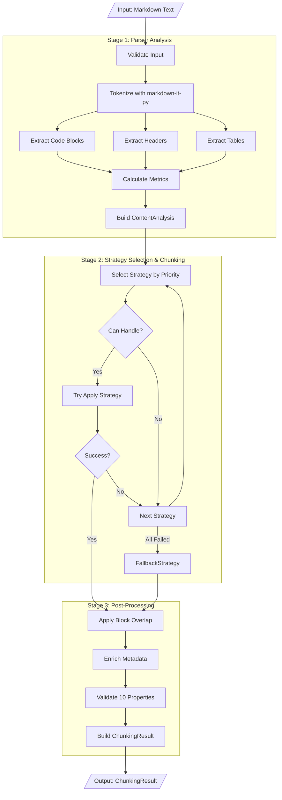

# To-Be Architecture

<cite>
**Referenced Files in This Document**   
- [README.md](file://docs/architecture-audit-v2-to-be/README.md)
- [01-module-structure.md](file://docs/architecture-audit-v2-to-be/01-module-structure.md)
- [02-data-flow.md](file://docs/architecture-audit-v2-to-be/02-data-flow.md)
- [markdown_chunker/__init__.py](file://markdown_chunker/__init__.py)
- [markdown_chunker/chunker/core.py](file://markdown_chunker/chunker/core.py)
- [markdown_chunker/chunker/types.py](file://markdown_chunker/chunker/types.py)
- [markdown_chunker/parser/core.py](file://markdown_chunker/parser/core.py)
</cite>

## Table of Contents
1. [Introduction](#introduction)
2. [Design Goals and Principles](#design-goals-and-principles)
3. [Module Structure](#module-structure)
4. [Data Flow Architecture](#data-flow-architecture)
5. [Configuration System](#configuration-system)
6. [Public API](#public-api)
7. [Key Changes from Current Architecture](#key-changes-from-current-architecture)
8. [Success Criteria](#success-criteria)
9. [Migration Strategy](#migration-strategy)
10. [Dependencies](#dependencies)

## Introduction

The To-Be Architecture document outlines the target design for the Dify Markdown Chunker redesign. This simplified architecture aims to maintain all functional requirements while dramatically reducing complexity, improving maintainability, and enhancing testability. The redesign is based on domain-driven design principles and focuses on the 10 core domain properties that define the system's behavior.

The target architecture represents a significant simplification from the current implementation, reducing the codebase from 55 files and ~24,000 lines of code to just 12 files and ~5,000 lines of code. This reduction is achieved through strategic consolidation of modules, elimination of redundant parameters, and streamlining of the processing pipeline.

**Section sources**
- [README.md](file://docs/architecture-audit-v2-to-be/README.md#L1-L246)

## Design Goals and Principles

### Design Goals

The redesign is guided by specific, measurable goals that aim to improve the overall quality and maintainability of the codebase:

| Goal | Target | Rationale |
|------|--------|-----------|
| **Simplicity** | 12 files vs 55 | Easier navigation and understanding |
| **Clarity** | 8 config params vs 32 | Clear decision-making |
| **Testability** | 50 tests vs 1,853 | Test behavior, not implementation |
| **Maintainability** | ~5,000 LOC vs ~24,000 | Easier to modify and extend |
| **Performance** | Within 20% | Simplicity may have minor cost |

### Design Principles

The architecture is built upon five core design principles that guide all implementation decisions:

#### 1. Domain-Driven Design
The system focuses on the 10 core domain properties (PROP-1 through PROP-10) that define its behavior. Business logic is separated from implementation details, and a clear ubiquitous language is established to ensure consistent understanding across the codebase.

#### 2. YAGNI (You Aren't Gonna Need It)
The design adheres to the YAGNI principle by eliminating speculative features and removing all unused parameters and deprecated code. This ensures that the codebase only contains functionality that is actually needed.

#### 3. Single Path
The architecture implements a single path for key processes:
- One overlap mechanism (block-based)
- One post-processing pipeline
- One validation point

This eliminates conditional logic and dual paths that complicate the code and make it harder to reason about.

#### 4. Fail Fast
The system is designed to fail fast with clear error messages. It avoids silent fallbacks through multiple layers and reduces the number of error types from 15+ to just 4, making error handling more predictable and easier to debug.

#### 5. Property-Based Testing
Testing is focused on validating the 10 core properties of the system rather than testing implementation details. The test suite uses Hypothesis for property-based testing, which generates test cases automatically. This approach replaces 1,853 implementation tests with approximately 50 property tests that provide better coverage and are less brittle.

**Section sources**
- [README.md](file://docs/architecture-audit-v2-to-be/README.md#L11-L47)

## Module Structure

The target architecture consists of 12 files organized in a clean, modular structure:

```
markdown_chunker/
├── __init__.py              # 7 public exports
├── types.py                 # All data structures
├── config.py                # 8-parameter config
├── chunker.py               # Main MarkdownChunker class
├── parser.py                # Stage1 analysis
├── strategies/
│   ├── __init__.py
│   ├── base.py              # BaseStrategy
│   ├── code_aware.py        # Code + Mixed
│   ├── structural.py        # Header-based
│   ├── table.py             # Table preservation
│   └── fallback.py          # Sentence-based
└── utils.py                 # Utilities
```

### File Specifications

#### `__init__.py` (~50 lines)
This file defines the public API surface with minimal exports. It contains exactly 7 public exports, providing a clean and focused interface for users of the library.

#### `types.py` (~600 lines)
This file consolidates all data structures from both the parser and chunker modules. It includes classes for Chunk, ChunkingResult, ContentAnalysis, MarkdownNode (AST), and supporting types like FencedBlock, Header, and Table.

#### `config.py` (~200 lines)
This file implements the 8-parameter configuration system with 3 predefined profiles (default, for_code_docs, and for_rag). It also defines derived values like target_chunk_size and min_effective_chunk_size.

#### `chunker.py` (~400 lines)
This file contains the main MarkdownChunker class with a unified 3-stage pipeline. The class orchestrates the entire chunking process from input to output.

#### `parser.py` (~800 lines)
This file implements Stage 1 markdown parsing and analysis as a single-pass operation. It consolidates AST building, code block extraction, element detection, and metric calculation.

#### `strategies/base.py` (~200 lines)
This file defines the BaseStrategy abstract class with shared utilities. All concrete strategies inherit from this base class.

#### `strategies/code_aware.py` (~600 lines)
This file implements the unified code handling strategy that merges the functionality of the current Code and Mixed strategies.

#### `strategies/structural.py` (~500 lines)
This file implements the header-based chunking strategy, simplified from the current implementation by removing Phase 2.

#### `strategies/table.py` (~300 lines)
This file implements the table preservation strategy, kept largely as-is from the current implementation since it is already simple and focused.

#### `strategies/fallback.py` (~400 lines)
This file implements the sentence-based universal fallback strategy that is guaranteed to work on any input.

#### `utils.py` (~300 lines)
This file contains shared utilities for validation, overlap, and metadata enrichment that are used across the system.

**Section sources**
- [01-module-structure.md](file://docs/architecture-audit-v2-to-be/01-module-structure.md#L1-L770)

## Data Flow Architecture

The redesigned architecture uses a unified 3-stage processing pipeline with a single-path, linear flow:



**Diagram sources**
- [02-data-flow.md](file://docs/architecture-audit-v2-to-be/02-data-flow.md#L1-L77)

### Stage 1: Parser Analysis

Stage 1 performs a single-pass analysis of the input markdown text to extract all structural elements and metrics. This replaces the current dual invocation pattern where the parser is called twice (once for initial analysis and again for preamble extraction).

The output of Stage 1 is a ContentAnalysis dataclass that contains all the information needed for subsequent stages, including content metrics, element counts, and content type classification.

### Stage 2: Strategy Selection & Chunking

Stage 2 selects the optimal strategy based on priority order and applies it to produce initial chunks. The strategy selection algorithm tries strategies in priority order until one succeeds:

1. CodeAwareStrategy (if code_ratio ≥ 0.3 or code_blocks ≥ 2)
2. StructuralStrategy (if headers ≥ 3 and depth > 1 and code_ratio < 0.3)
3. TableStrategy (if tables ≥ 3 or table_ratio ≥ 0.4)
4. FallbackStrategy (always applicable)

This simple priority-based approach replaces the current complex conditional logic with quality scoring and weighted selection.

### Stage 3: Post-Processing

Stage 3 applies the final transformations to the chunks before returning the result:

1. **Apply Block Overlap**: Uses the block-based overlap mechanism exclusively (no legacy/new switching)
2. **Enrich Metadata**: Adds standardized metadata to all chunks in a single operation
3. **Validate Properties**: Validates all 10 domain properties in one place
4. **Build Result**: Constructs the final ChunkingResult object

This single, linear pipeline replaces the current dual pipeline with conditional post-processing paths.

**Section sources**
- [02-data-flow.md](file://docs/architecture-audit-v2-to-be/02-data-flow.md#L1-L599)

## Configuration System

The target architecture simplifies the configuration system from 32 parameters to just 8 essential parameters:

```python
# Size constraints (3)
max_chunk_size: int = 4096
min_chunk_size: int = 512
overlap_size: int = 200  # 0 = disabled

# Behavior (3)
preserve_atomic_blocks: bool = True
extract_preamble: bool = True
allow_oversize: bool = True

# Strategy thresholds (2)
code_threshold: float = 0.3
structure_threshold: int = 3
```

### Removed Parameters Justification

Several parameters have been removed because they are either redundant or unnecessary:

- **target_chunk_size**: Derived as (min + max) / 2
- **overlap_percentage**: Use overlap_size only
- **enable_overlap**: overlap_size = 0 means disabled
- **All MC-* flags**: Make fixes default behavior
- **Phase 2 flags**: Simplified design doesn't need them
- **enable_streaming**: Not implemented
- **fallback_strategy**: Hardcoded to FallbackStrategy

The configuration system also provides three predefined profiles:
- **default()**: General markdown processing
- **for_code_docs()**: Optimized for technical documentation
- **for_rag()**: Optimized for RAG systems (embeddings)

**Section sources**
- [README.md](file://docs/architecture-audit-v2-to-be/README.md#L87-L114)

## Public API

The public API is simplified to just 7 exports, providing a clean and focused interface:

```python
__all__ = [
    "MarkdownChunker",      # Main class
    "ChunkConfig",          # Configuration
    "Chunk",                # Data type
    "ChunkingResult",       # Result type
    "ContentAnalysis",      # Analysis type
    "chunk_text",           # Convenience function
    "chunk_file",           # Convenience function
]
```

This minimal API surface reduces the cognitive load for users and makes the library easier to learn and use. The convenience functions `chunk_text` and `chunk_file` provide simple interfaces for common use cases, while the main classes provide full access to the library's functionality.

**Section sources**
- [README.md](file://docs/architecture-audit-v2-to-be/README.md#L115-L125)

## Key Changes from Current Architecture

The target architecture introduces several significant changes from the current implementation:

### Module Consolidation
- **Parser**: 15 files → 1 file (parser.py)
- **Chunker**: 26 files → 1 file (chunker.py) + 4 strategy files
- **API**: 5 files → removed (functionality in chunker.py)
- **Types**: 2 files (chunker/types.py, parser/types.py) → 1 file (types.py)

### Strategy Consolidation
- **CodeAwareStrategy**: Merges Code + Mixed strategies
- **StructuralStrategy**: Simplified, Phase 2 removed
- **TableStrategy**: Kept as-is (simple, focused)
- **FallbackStrategy**: Renamed from Sentences
- **ListStrategy**: Removed (was excluded from auto-selection)

### Configuration Simplification
Reduced from 32 parameters to 8 essential parameters, eliminating redundant and unused options.

### Pipeline Simplification
- **Single-pass analysis**: Eliminates dual invocation of parser
- **Single overlap mechanism**: Block-based only (no legacy/new switching)
- **Single validation point**: All properties validated in one place
- **Single post-processing pipeline**: Linear flow vs dual conditional paths

These changes result in a codebase that is significantly simpler, more maintainable, and easier to understand while preserving all functional requirements.

**Section sources**
- [README.md](file://docs/architecture-audit-v2-to-be/README.md#L74-L114)

## Success Criteria

The success of the redesign will be measured against specific criteria across code metrics, quality metrics, and functional metrics.

### Code Metrics
- ✓ Files ≤ 15 (target: 12)
- ✓ Lines of code ≤ 6,000 (target: ~5,000)
- ✓ Config parameters ≤ 10 (target: 8)
- ✓ No files > 800 lines
- ✓ No circular dependencies

### Quality Metrics
- ✓ All 10 domain properties pass
- ✓ Code coverage ≥ 85%
- ✓ Public API ≤ 10 exports (target: 7)

### Functional Metrics
- ✓ Output equivalence ≥ 95% on real documents
- ✓ Performance within 20% of current
- ✓ All Dify integration tests pass

These criteria ensure that the redesign achieves its goals of simplicity and maintainability without sacrificing functionality or performance.

**Section sources**
- [README.md](file://docs/architecture-audit-v2-to-be/README.md#L177-L193)

## Migration Strategy

The redesign will be released as version 2.0.0, a major version bump due to breaking changes.

### Public API Compatibility
- MarkdownChunker class interface preserved
- ChunkConfig simplified but maintains core parameters
- Chunk and ChunkingResult structures preserved

### Breaking Changes
- 24 configuration parameters removed
- 2 strategies removed (List, Mixed merged into Code)
- Parser module no longer exports 50+ symbols
- Deprecated Simple API removed

### Migration Support
- Migration guide (1.x → 2.0)
- Configuration migration utility
- Deprecation warnings in 2.0 (removed in 3.0)
- Old codebase archived for 1 month

This migration strategy ensures a smooth transition for existing users while allowing the codebase to evolve toward a simpler, more maintainable design.

**Section sources**
- [README.md](file://docs/architecture-audit-v2-to-be/README.md#L211-L229)

## Dependencies

The target architecture reduces dependencies from the current implementation:

### Required (3 dependencies):
- markdown-it-py >= 3.0.0  # Primary parser
- pydantic >= 2.0.0        # Data validation
- dify_plugin == 0.5.0b15  # Dify integration

### Development (2 dependencies):
- pytest >= 7.0.0
- hypothesis >= 6.0.0      # Property-based testing

### Removed (2 dependencies):
- mistune  # Redundant parser
- markdown # Redundant parser

This dependency reduction simplifies the build process and reduces potential security vulnerabilities.

**Section sources**
- [README.md](file://docs/architecture-audit-v2-to-be/README.md#L196-L207)