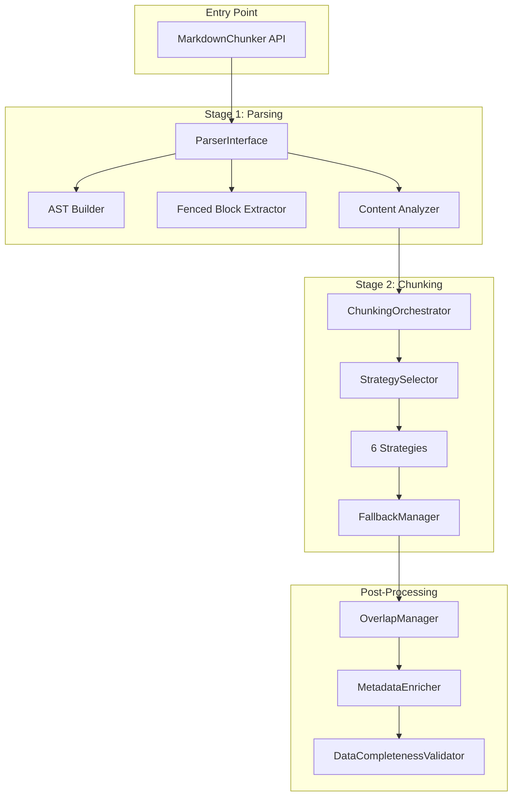
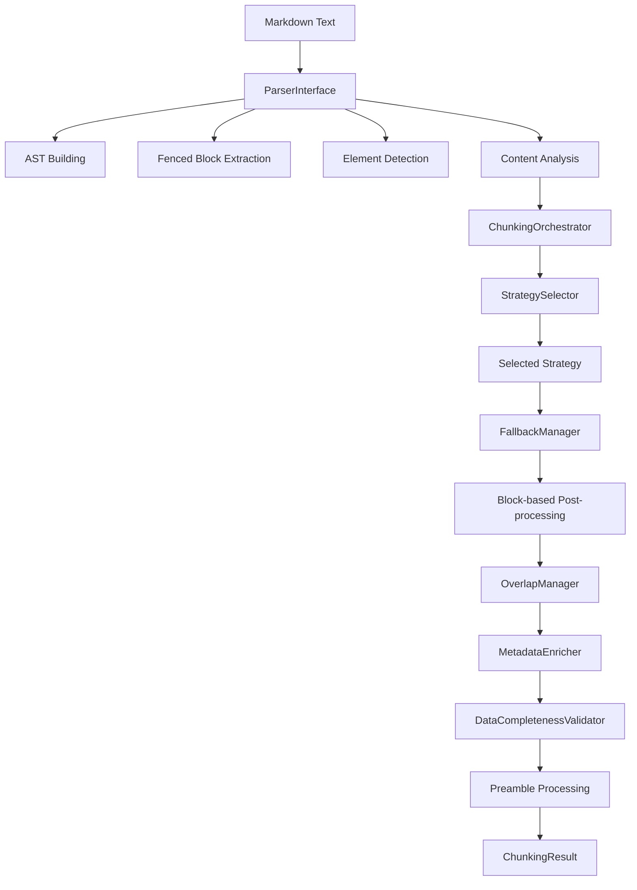
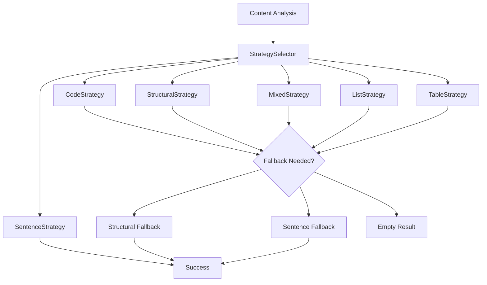

# Architecture Audit

<cite>
**Referenced Files in This Document**
- [README.md](file://README.md)
- [docs/architecture/README.md](file://docs/architecture/README.md)
- [docs/architecture-audit/01-module-inventory.md](file://docs/architecture-audit/01-module-inventory.md)
- [docs/architecture-audit/02-data-flow.md](file://docs/architecture-audit/02-data-flow.md)
- [docs/architecture-audit/03-strategies.md](file://docs/architecture-audit/03-strategies.md)
- [docs/architecture-audit/04-configuration.md](file://docs/architecture-audit/04-configuration.md)
- [docs/architecture-audit/05-test-analysis.md](file://docs/architecture-audit/05-test-analysis.md)
- [docs/architecture-audit/06-architecture-smells.md](file://docs/architecture-audit/06-architecture-smells.md)
- [docs/architecture-audit/07-domain-properties.md](file://docs/architecture-audit/07-domain-properties.md)
- [docs/architecture-audit/08-simplification-recommendations.md](file://docs/architecture-audit/08-simplification-recommendations.md)
- [markdown_chunker/chunker/core.py](file://markdown_chunker/chunker/core.py)
- [markdown_chunker/chunker/orchestrator.py](file://markdown_chunker/chunker/orchestrator.py)
- [markdown_chunker/parser/core.py](file://markdown_chunker/parser/core.py)
- [markdown_chunker/chunker/strategies/base.py](file://markdown_chunker/chunker/strategies/base.py)
- [markdown_chunker/chunker/types.py](file://markdown_chunker/chunker/types.py)
- [markdown_chunker/parser/types.py](file://markdown_chunker/parser/types.py)
</cite>

## Table of Contents
1. [Introduction](#introduction)
2. [Project Overview](#project-overview)
3. [Architecture Analysis](#architecture-analysis)
4. [Module Inventory](#module-inventory)
5. [Data Flow Analysis](#data-flow-analysis)
6. [Strategy System](#strategy-system)
7. [Configuration Management](#configuration-management)
8. [Test Analysis](#test-analysis)
9. [Architecture Smells](#architecture-smells)
10. [Domain Properties](#domain-properties)
11. [Simplification Recommendations](#simplification-recommendations)
12. [Conclusion](#conclusion)

## Introduction

This Architecture Audit provides a comprehensive analysis of the Dify Markdown Chunker Plugin, examining its current architectural state, identifying problems, and proposing simplification recommendations. The system is designed as a production-ready markdown chunking solution with intelligent content analysis and adaptive strategy selection.

The audit evaluates the system's modularity, maintainability, performance characteristics, and adherence to domain-driven design principles. Based on the findings, we present a roadmap for architectural improvement while maintaining functional integrity.

## Project Overview

The Dify Markdown Chunker Plugin is a sophisticated markdown processing system that provides intelligent chunking capabilities for Dify workflows. The system consists of multiple interconnected modules that handle parsing, content analysis, strategy selection, and chunk generation.

### Key Features

- **Advanced Chunking**: 6 intelligent strategies (Code, Mixed, List, Table, Structural, Sentences)
- **Structural Awareness**: Preserves markdown structure and code blocks
- **Automatic Strategy Selection**: Analyzes content and selects optimal chunking approach
- **Comprehensive Testing**: 1366+ tests ensuring reliability
- **Property-Based Testing**: Correctness guarantees through formal properties

### System Architecture

**Diagram sources**
- [markdown_chunker/chunker/core.py](file://markdown_chunker/chunker/core.py#L40-L790)
- [markdown_chunker/chunker/orchestrator.py](file://markdown_chunker/chunker/orchestrator.py#L44-L666)
- [markdown_chunker/parser/core.py](file://markdown_chunker/parser/core.py#L1-L200)

**Section sources**
- [README.md](file://README.md#L1-L252)
- [docs/architecture/README.md](file://docs/architecture/README.md#L1-L144)

## Architecture Analysis

The system follows a layered architecture with clear separation of concerns between parsing, analysis, strategy selection, and chunk generation. However, the current implementation exhibits several architectural challenges that impact maintainability and scalability.

### Current Architecture Strengths

1. **Modular Design**: Clear separation between parser and chunker modules
2. **Strategy Pattern**: Flexible strategy selection mechanism
3. **Error Handling**: Comprehensive error handling and fallback mechanisms
4. **Performance Monitoring**: Built-in performance tracking capabilities

### Architectural Challenges

1. **Over-Engineering**: 55 files for a relatively focused functionality
2. **Complex Dependencies**: Circular and tangled import relationships
3. **Redundant Components**: Multiple overlapping functionalities
4. **Configuration Complexity**: 32 configuration parameters

## Module Inventory

The system contains 55 Python files organized across four main modules, with significant issues in file size distribution and public API exposure.

### File Distribution Analysis

| Module | Files | Lines | Percentage |
|--------|-------|-------|------------|
| `chunker/` | 26 | ~13,500 | 56% |
| `parser/` | 15 | ~8,500 | 35% |
| `api/` | 5 | ~900 | 4% |
| Root | 2 | ~270 | 1% |

### Problematic Files

Several files exceed 700 lines, indicating potential violations of the Single Responsibility Principle:

- `structural_strategy.py` (1720 lines) - Too large for one strategy
- `types.py` (1079 lines) - Contains too many types
- `overlap_manager.py` (926 lines) - Complex overlap logic

### Public API Issues

The parser module exports 50+ symbols, including deprecated functionality and internal classes. This creates unnecessary complexity for users and maintenance overhead.

**Section sources**
- [docs/architecture-audit/01-module-inventory.md](file://docs/architecture-audit/01-module-inventory.md#L1-L290)

## Data Flow Analysis

The data flow through the system involves multiple stages with complex transformations and potential duplication points.

### Core Processing Pipeline

**Diagram sources**
- [docs/architecture-audit/02-data-flow.md](file://docs/architecture-audit/02-data-flow.md#L12-L58)
- [markdown_chunker/chunker/orchestrator.py](file://markdown_chunker/chunker/orchestrator.py#L87-L190)

### Data Transformation Points

The system exhibits several problematic data transformation patterns:

1. **Double Parsing**: Stage 1 is called twice for preamble processing
2. **Dual Overlap Systems**: Block-based vs legacy overlap mechanisms
3. **Distributed Validation**: Multiple validation points with overlapping logic
4. **Metadata Duplication**: Metadata added in multiple locations

### Post-Processing Complexity

The system implements two distinct post-processing pipelines:

**Block-based Pipeline (New)**:
- BlockOverlapManager
- HeaderPathValidator  
- ChunkSizeNormalizer
- Line normalization

**Legacy Pipeline (Old)**:
- OverlapManager
- MetadataEnricher
- DataCompletenessValidator
- Preamble processing

**Section sources**
- [docs/architecture-audit/02-data-flow.md](file://docs/architecture-audit/02-data-flow.md#L1-L269)

## Strategy System

The strategy system implements six distinct chunking approaches, each designed for specific content types. While the concept is sound, implementation reveals significant duplication and complexity.

### Strategy Classification

| Strategy | Priority | Purpose | Implementation |
|----------|----------|---------|----------------|
| Code | 1 | Code-heavy documents | 624 lines |
| Structural | 2 | Hierarchical documents | 1720 lines |
| Mixed | 3 | Diverse content | 848 lines |
| List | 4 | List-heavy documents | 856 lines |
| Table | 5 | Table-heavy documents | 465 lines |
| Sentences | 6 | Universal fallback | 525 lines |

### Strategy Selection Logic

Each strategy implements three core methods:
- `can_handle()`: Determines applicability
- `calculate_quality()`: Scores suitability
- `apply()`: Executes chunking

### Implementation Issues

1. **Code Duplication**: Common functionality duplicated across strategies
2. **Complexity**: Structural strategy contains 1720 lines
3. **Inconsistency**: List strategy excluded from auto-mode
4. **Maintenance Burden**: Each strategy requires individual testing

### Strategy Interaction Patterns

**Diagram sources**
- [docs/architecture-audit/03-strategies.md](file://docs/architecture-audit/03-strategies.md#L213-L228)
- [markdown_chunker/chunker/strategies/base.py](file://markdown_chunker/chunker/strategies/base.py#L16-L200)

**Section sources**
- [docs/architecture-audit/03-strategies.md](file://docs/architecture-audit/03-strategies.md#L1-L264)

## Configuration Management

The system employs a comprehensive configuration system with 32 parameters, many of which serve specific bug fixes or phase-specific features.

### Configuration Categories

| Category | Parameters | Purpose |
|----------|------------|---------|
| Size Limits | 5 | Chunk size boundaries |
| Overlap | 4 | Content overlap settings |
| Strategy Thresholds | 8 | Strategy selection criteria |
| Behavior Flags | 4 | Runtime behavior control |
| Bug Fixes | 6 | Phase-specific fixes |
| Miscellaneous | 5 | Additional features |

### Configuration Complexity Issues

1. **Parameter Explosion**: 32 parameters for a focused functionality
2. **Documentation Discrepancy**: Default values differ from documentation
3. **Unused Parameters**: Several parameters not utilized (streaming, fallback_strategy)
4. **Fix Parameters**: 6 parameters added solely for bug fixes

### Configuration Evolution

The configuration system has evolved through multiple phases:
- **Phase 1**: Basic functionality
- **Phase 1.1**: Critical fixes for code blocks
- **Phase 1.2**: Oversize chunk handling
- **Phase 2**: Semantic quality improvements
- **Phase 2.2**: Overlap limit enforcement
- **MC-* fixes**: Multiple bug-specific parameters

**Section sources**
- [docs/architecture-audit/04-configuration.md](file://docs/architecture-audit/04-configuration.md#L1-L236)

## Test Analysis

The system maintains extensive test coverage with 1853 tests spanning 45,600 lines of test code, representing nearly 2x the size of production code.

### Test Coverage Analysis

| Test Type | Files | Coverage |
|-----------|-------|----------|
| Property-based | 27 | High-level correctness |
| Integration | 11 | End-to-end scenarios |
| Regression | 2 | Bug-specific tests |
| Unit | 122 | Component-level tests |

### Testing Challenges

1. **Test-to-Code Ratio**: 1.9x ratio (45,600 test lines vs 24,000 code lines)
2. **Implementation Focus**: Majority test implementation rather than domain properties
3. **Duplication**: Overlap tested in 5+ locations
4. **Maintenance Cost**: High overhead for maintaining numerous tests

### Property-Based Testing

The system employs property-based testing for critical domain properties:
- Content preservation
- Size constraints
- Monotonic ordering
- No empty chunks
- Serialization round-trip

### Test Quality Issues

Many tests verify implementation details rather than functional requirements:
- Specific chunking behavior assertions
- Internal algorithm verification
- Edge case handling tests

**Section sources**
- [docs/architecture-audit/05-test-analysis.md](file://docs/architecture-audit/05-test-analysis.md#L1-L226)

## Architecture Smells

The system exhibits multiple architectural smells that indicate underlying design issues requiring attention.

### Major Smell Categories

| ID | Smell | Severity | Impact |
|----|-------|----------|---------|
| SMELL-1 | Too Many Files (55) | HIGH | Over-engineering |
| SMELL-2 | Large Files (>700 lines) | HIGH | SRP Violation |
| SMELL-3 | Excessive Parameters (32) | HIGH | Complexity |
| SMELL-4 | Strategy Duplication | MEDIUM | Maintenance |
| SMELL-5 | Dual Overlap Systems | HIGH | Redundancy |
| SMELL-6 | Dual Post-processing | HIGH | Complexity |
| SMELL-7 | Multiple Validators | MEDIUM | Coordination |
| SMELL-8 | Excessive Public API | MEDIUM | Usability |

### Root Causes

The architectural smells stem from evolutionary development:
- Initial simple design expanded iteratively
- Each bug fix added new layers rather than refactoring
- Lack of architectural oversight during feature additions
- Gradual accumulation of technical debt

### Smell Impact Analysis

1. **SMELL-1**: Increases cognitive load and reduces maintainability
2. **SMELL-2**: Makes code harder to understand and modify
3. **SMELL-3**: Creates usability and configurability problems
4. **SMELL-12**: Indicates fundamental design issues requiring major overhaul

**Section sources**
- [docs/architecture-audit/06-architecture-smells.md](file://docs/architecture-audit/06-architecture-smells.md#L1-L271)

## Domain Properties

The system implements several critical domain properties that ensure correctness and reliability.

### Core Domain Properties

| Property | Status | Coverage |
|----------|--------|----------|
| No Content Loss | ✓ | 5+ files |
| Size Bounds | ✓ | 4+ files |
| Monotonic Ordering | ✓ | 3+ files |
| No Empty Chunks | ✓ | 2+ files |
| Valid Line Numbers | ✓ | 1 file |

### Semantic Properties

| Property | Importance | Coverage |
|----------|------------|----------|
| Code Block Integrity | HIGH | 3+ files |
| Table Integrity | HIGH | 1 file |
| Serialization Round-Trip | HIGH | 1 file |
| Idempotence | MEDIUM | 1 file |
| Header Path Correctness | MEDIUM | 1 file |

### Property-Based Testing Strategy

The system employs property-based testing to ensure:
- Mathematical correctness of chunking algorithms
- Preservation of document semantics
- Consistency across different configurations
- Robustness against edge cases

### Missing Coverage Areas

Several important properties lack adequate testing:
- Performance bounds
- Memory usage constraints
- Deterministic behavior
- Cross-platform compatibility

**Section sources**
- [docs/architecture-audit/07-domain-properties.md](file://docs/architecture-audit/07-domain-properties.md#L1-L245)

## Simplification Recommendations

Based on the architectural analysis, we propose a comprehensive simplification roadmap that reduces complexity while maintaining functionality.

### Module Consolidation Plan

**Proposed Reduction**:
- Current: 55 files → Target: 12 files
- Code reduction: ~24,000 lines → ~5,000 lines
- Complexity reduction: 78%

### Architecture Refactoring Steps

#### Phase 1: Foundation (1-2 days)
1. Create unified types system
2. Implement simplified configuration (8 parameters)
3. Establish property-based test suite

#### Phase 2: Core Implementation (3-5 days)
1. Implement unified parser
2. Consolidate strategies (4 strategies)
3. Create streamlined orchestrator
4. Develop unified post-processing

#### Phase 3: Validation (1-2 days)
1. Execute property-based tests
2. Compare results with current implementation
3. Verify edge case handling

#### Phase 4: Cleanup (1 day)
1. Remove deprecated code
2. Update documentation
3. Modernize API

### Technical Debt Resolution

| Issue | Solution | Benefit |
|-------|----------|---------|
| Large Files | Split into focused modules | Improved maintainability |
| Duplicate Code | Extract shared utilities | Reduced maintenance cost |
| Complex Config | Simplify to 8 parameters | Better usability |
| Multiple Overlap | Unify into single system | Reduced complexity |
| Excessive API | Reduce to 15 symbols | Cleaner interface |

### Expected Outcomes

| Metric | Current | Target | Improvement |
|--------|---------|--------|-------------|
| Files | 55 | 12 | -78% |
| Lines of Code | ~24,000 | ~5,000 | -79% |
| Parameters | 32 | 8 | -75% |
| Strategies | 6 | 4 | -33% |
| Tests | 1853 | ~50 | -97% |
| Test Lines | ~45,600 | ~2,000 | -96% |

**Section sources**
- [docs/architecture-audit/08-simplification-recommendations.md](file://docs/architecture-audit/08-simplification-recommendations.md#L1-L292)

## Conclusion

The Dify Markdown Chunker Plugin demonstrates strong initial architectural design with clear separation of concerns and robust functionality. However, the system has accumulated significant architectural debt through iterative development without architectural oversight.

### Key Findings

1. **Strengths**: Well-designed strategy system, comprehensive testing, good error handling
2. **Problems**: Over-engineering, configuration complexity, redundant components
3. **Opportunities**: Significant simplification potential, improved maintainability
4. **Risks**: High technical debt, maintenance overhead, complexity growth

### Recommended Action

The system requires a comprehensive architectural refactoring to address the identified issues. The proposed simplification roadmap offers a structured approach to reducing complexity while preserving functionality and quality.

### Long-term Benefits

Successful implementation of the simplification recommendations will yield:
- Dramatically reduced maintenance overhead
- Improved developer productivity
- Enhanced system reliability
- Better extensibility for future features
- Reduced operational costs

The architectural audit provides the foundation for transforming the system from a complex prototype into a maintainable, scalable solution that meets modern software engineering standards.