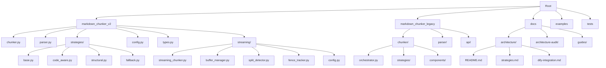
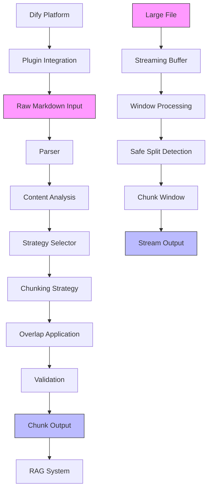
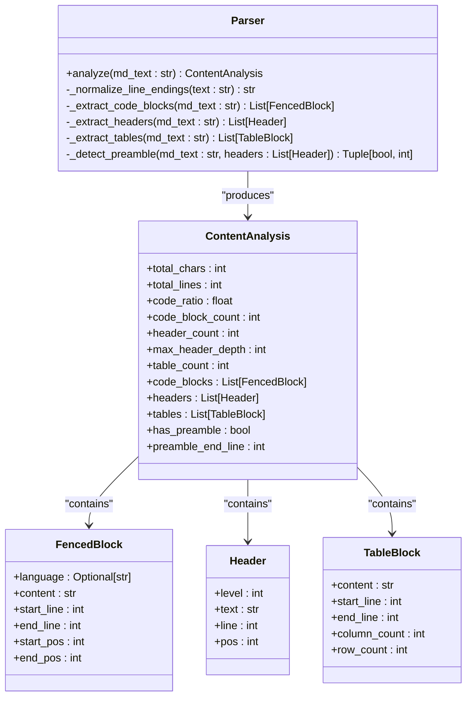
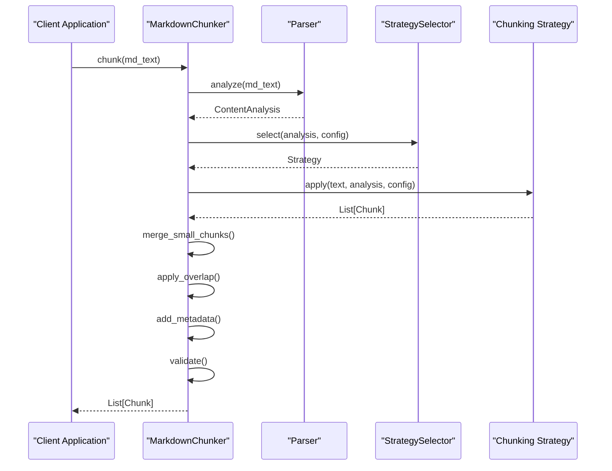
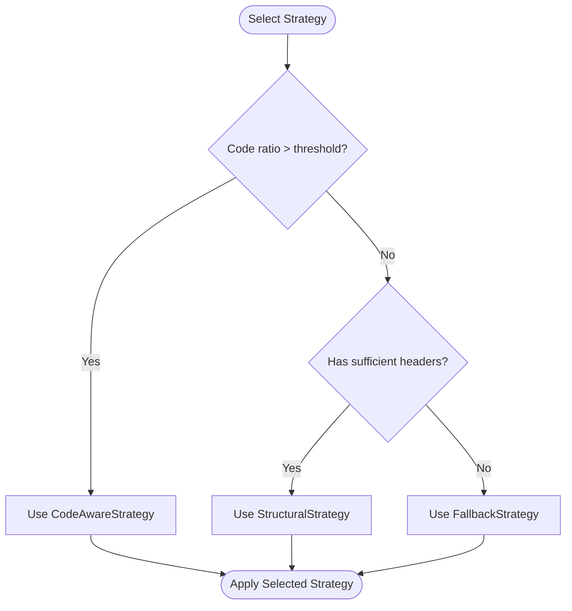
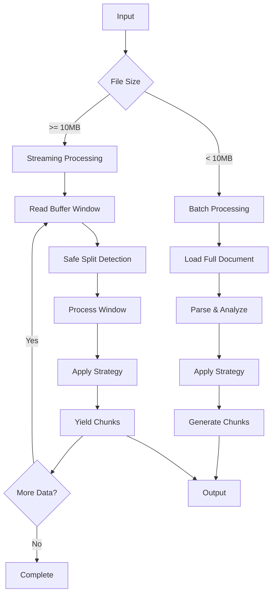
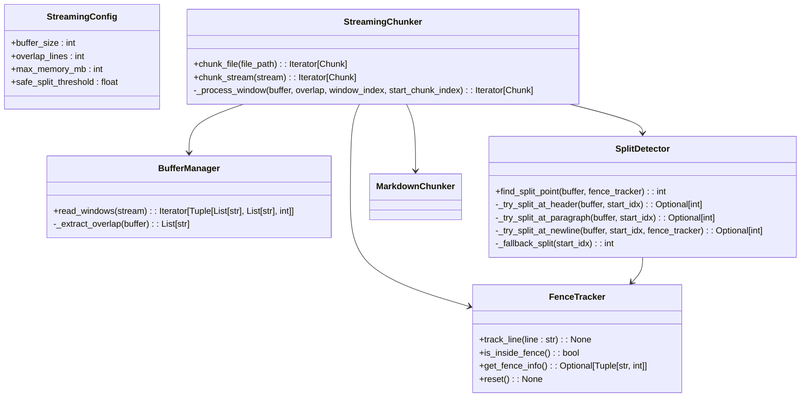
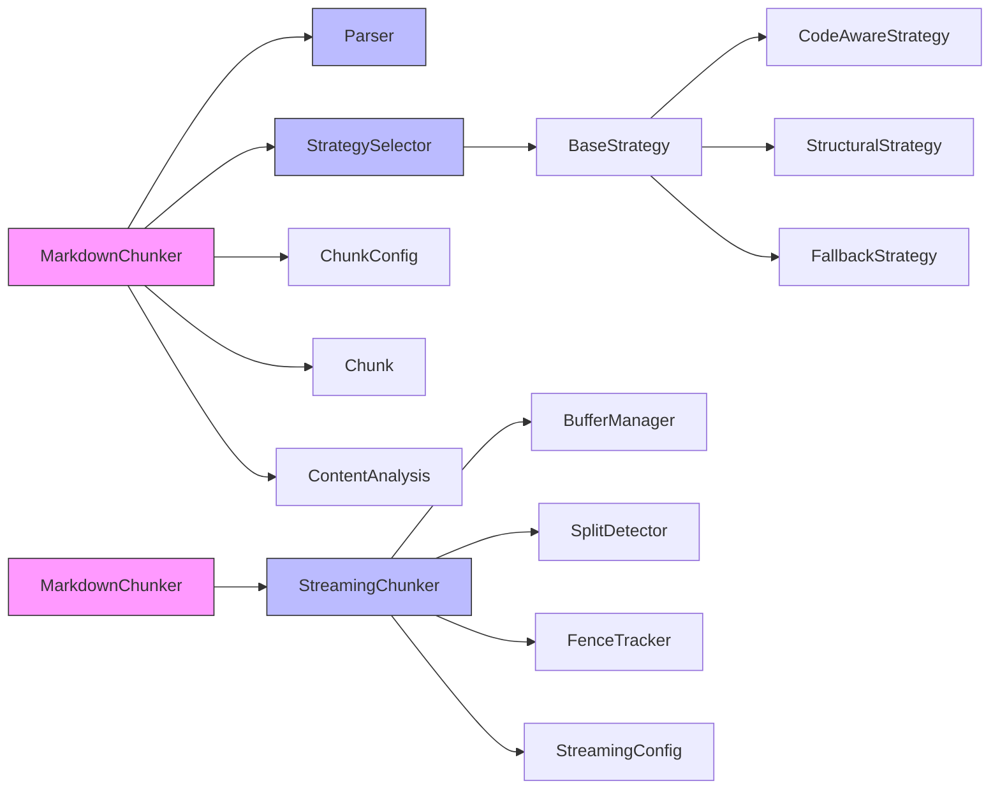

# Architecture Overview

<cite>
**Referenced Files in This Document**   
- [README.md](file://docs/architecture/README.md)
- [strategies.md](file://docs/architecture/strategies.md)
- [dify-integration.md](file://docs/architecture/dify-integration.md)
- [chunker.py](file://markdown_chunker_v2/chunker.py)
- [parser.py](file://markdown_chunker_v2/parser.py)
- [types.py](file://markdown_chunker_v2/types.py)
- [config.py](file://markdown_chunker_v2/config.py)
- [base.py](file://markdown_chunker_v2/strategies/base.py)
- [code_aware.py](file://markdown_chunker_v2/strategies/code_aware.py)
- [structural.py](file://markdown_chunker_v2/strategies/structural.py)
- [fallback.py](file://markdown_chunker_v2/strategies/fallback.py)
- [orchestrator.py](file://markdown_chunker_legacy/chunker/orchestrator.py)
- [streaming_chunker.py](file://markdown_chunker_v2/streaming/streaming_chunker.py)
- [buffer_manager.py](file://markdown_chunker_v2/streaming/buffer_manager.py)
- [split_detector.py](file://markdown_chunker_v2/streaming/split_detector.py)
- [fence_tracker.py](file://markdown_chunker_v2/streaming/fence_tracker.py)
- [config.py](file://markdown_chunker_v2/streaming/config.py)
</cite>

## Update Summary
**Changes Made**   
- Added new section on Parallel Processing Paths (Batch and Streaming)
- Introduced dedicated Streaming Module architecture
- Updated architecture overview diagram to include streaming path
- Added detailed component analysis for streaming components
- Enhanced performance considerations with streaming benchmarks
- Updated troubleshooting guide with streaming-specific issues

## Table of Contents
1. [Introduction](#introduction)
2. [Project Structure](#project-structure)
3. [Core Components](#core-components)
4. [Architecture Overview](#architecture-overview)
5. [Detailed Component Analysis](#detailed-component-analysis)
6. [Dependency Analysis](#dependency-analysis)
7. [Performance Considerations](#performance-considerations)
8. [Troubleshooting Guide](#troubleshooting-guide)
9. [Conclusion](#conclusion)

## Introduction

The Markdown Chunker system is a production-ready solution for intelligent markdown chunking, designed specifically for Retrieval-Augmented Generation (RAG) systems. The architecture follows modular design principles that enable extensibility and maintainability, with a clear separation of responsibilities between components. The system has evolved from a complex legacy implementation to a streamlined v2 architecture that simplifies the chunking pipeline while preserving critical functionality.

The system's primary purpose is to intelligently split markdown documents into semantically meaningful chunks while preserving structural integrity, particularly for code blocks, tables, and hierarchical content. It achieves this through a strategy-based approach that automatically selects the most appropriate chunking algorithm based on document analysis. The architecture supports both standalone usage and integration with the Dify platform as a tool plugin, making it versatile for various deployment scenarios.

## Project Structure

The project follows a layered architecture with distinct modules for parsing, chunking, strategies, and configuration. The directory structure reflects the evolution from legacy to v2 implementations, with parallel implementations that allow for backward compatibility while introducing a simplified, more maintainable architecture.

**Diagram sources**
- [README.md](file://docs/architecture/README.md)
- [project structure](file://)

**Section sources**
- [project structure](file://)

## Core Components

The Markdown Chunker system consists of several core components that work together to transform raw markdown input into properly chunked output. The v2 architecture simplifies the pipeline into four main components: parser, strategy selector, chunking orchestrator, and post-processing modules. The parser component analyzes the markdown document and extracts structural elements like headers, code blocks, and tables. The strategy selector evaluates the document characteristics and chooses the most appropriate chunking strategy. The chunking orchestrator applies the selected strategy to produce chunks, and post-processing modules handle tasks like overlap application and validation.

The system's design emphasizes structural accuracy through AST-based parsing and adaptive chunking through the strategy pattern. This allows the system to handle diverse document types appropriately, from code-heavy technical documentation to structured articles with hierarchical headers. The modular design enables easy extension with new strategies or parsing capabilities without affecting the core pipeline.

**Section sources**
- [chunker.py](file://markdown_chunker_v2/chunker.py#L1-L357)
- [parser.py](file://markdown_chunker_v2/parser.py#L1-L282)
- [types.py](file://markdown_chunker_v2/types.py#L1-L272)

## Architecture Overview

The Markdown Chunker system follows a modular, layered architecture that processes markdown documents through a well-defined pipeline. The architecture is designed around several key principles: modularity, structural accuracy, adaptive chunking, and error resilience. The system has evolved from a complex legacy implementation with multiple processing stages to a streamlined v2 architecture that maintains the same capabilities with significantly reduced complexity.

The core architectural pattern is a simplified pipeline that processes documents in four main phases: parsing, strategy selection, chunking, and post-processing. This linear flow replaces the more complex orchestration model of the legacy system while preserving all essential functionality. The v2 architecture consolidates 15 legacy files into just 5 core files, reducing the codebase from over 10,000 lines to approximately 2,000 lines while maintaining or improving functionality.

A significant architectural enhancement is the introduction of parallel processing paths: batch and streaming. This dual-path approach allows the system to handle both small-to-medium documents efficiently through the traditional batch processing path, while providing memory-efficient processing for large documents (>10MB) through the streaming path. The streaming complexity is isolated in a dedicated module, ensuring that the core batch processing pipeline remains simple and performant.

**Diagram sources**
- [chunker.py](file://markdown_chunker_v2/chunker.py#L43-L90)
- [parser.py](file://markdown_chunker_v2/parser.py#L38-L81)
- [README.md](file://docs/architecture/README.md#L148-L307)

## Detailed Component Analysis

### Parser Component

The parser component is responsible for analyzing markdown documents and extracting structural information that informs the chunking strategy selection. Unlike traditional parsers that convert markdown to HTML, this parser focuses on extracting metadata about the document's structure, including code blocks, headers, and tables. The parser normalizes line endings at the start of processing to ensure consistent behavior across platforms, then analyzes the document to calculate content ratios and extract structural elements.

The parser's output, encapsulated in the ContentAnalysis class, provides the strategy selector with the information needed to make intelligent decisions about chunking approaches. This includes metrics like code ratio, header count, and table count, which are critical for determining whether a document should be chunked using a code-aware strategy, structural strategy, or fallback approach.

#### For Object-Oriented Components:

**Diagram sources**
- [parser.py](file://markdown_chunker_v2/parser.py#L14-L82)
- [types.py](file://markdown_chunker_v2/types.py#L68-L97)

**Section sources**
- [parser.py](file://markdown_chunker_v2/parser.py#L14-L282)
- [types.py](file://markdown_chunker_v2/types.py#L11-L97)

### Strategy Selector and Chunking Orchestrator

The strategy selector and chunking orchestrator work together to determine the most appropriate way to chunk a document based on its characteristics. The strategy selector evaluates the content analysis results against configurable thresholds to determine which strategy should be applied. The chunking orchestrator then applies the selected strategy in a linear pipeline that ensures consistent processing.

The v2 architecture simplifies this process compared to the legacy implementation by eliminating the complex fallback manager and multiple validation stages. Instead, it uses a straightforward approach where the MarkdownChunker class coordinates the entire process: parsing the document once, selecting a strategy, applying that strategy, merging small chunks, applying overlap, adding metadata, and validating the results.

#### For API/Service Components:

**Diagram sources**
- [chunker.py](file://markdown_chunker_v2/chunker.py#L43-L90)
- [strategies/base.py](file://markdown_chunker_v2/strategies/base.py#L12-L67)

**Section sources**
- [chunker.py](file://markdown_chunker_v2/chunker.py#L21-L357)
- [strategies/base.py](file://markdown_chunker_v2/strategies/base.py#L12-L233)

### Chunking Strategies

The system implements a strategy pattern with three main strategies that replace the six strategies of the legacy implementation. The CodeAwareStrategy handles documents with code blocks or tables, preserving these atomic blocks intact while chunking the surrounding text. The StructuralStrategy processes documents with hierarchical headers by splitting at section boundaries while maintaining the header hierarchy. The FallbackStrategy provides a universal approach that works for any document by splitting on paragraph boundaries and grouping paragraphs to fit within size limits.

This consolidation from six to three strategies significantly reduces complexity while maintaining the same capabilities. The strategy selection algorithm uses configurable thresholds to determine which strategy to apply, with the ability to override automatic selection when needed. Each strategy inherits from the BaseStrategy abstract class, ensuring a consistent interface and shared functionality like chunk creation and metadata handling.

#### For Complex Logic Components:

**Diagram sources**
- [strategies/code_aware.py](file://markdown_chunker_v2/strategies/code_aware.py#L15-L149)
- [strategies/structural.py](file://markdown_chunker_v2/strategies/structural.py#L15-L151)
- [strategies/fallback.py](file://markdown_chunker_v2/strategies/fallback.py#L15-L96)

**Section sources**
- [strategies/code_aware.py](file://markdown_chunker_v2/strategies/code_aware.py#L1-L149)
- [strategies/structural.py](file://markdown_chunker_v2/strategies/structural.py#L1-L151)
- [strategies/fallback.py](file://markdown_chunker_v2/strategies/fallback.py#L1-L96)

### Parallel Processing Paths (Batch and Streaming)

The system now supports two parallel processing paths: batch and streaming. This architectural enhancement enables efficient processing of documents of all sizes while maintaining memory efficiency for large files.

The **batch processing path** follows the traditional approach of loading the entire document into memory, parsing it completely, and then chunking it. This path is optimal for small-to-medium documents (<10MB) and provides the fastest processing speed.

The **streaming processing path** is designed for large documents (>10MB) and operates on buffer windows to limit memory usage. This path processes the document in chunks, applying safe split detection to maintain chunk quality at window boundaries. The streaming complexity is isolated in a dedicated module (`markdown_chunker_v2/streaming/`), ensuring that the core batch processing pipeline remains simple and performant.

The streaming path includes several specialized components:
- **BufferManager**: Reads the file in configurable buffer windows (default: 100KB)
- **FenceTracker**: Maintains state across buffer boundaries to prevent splitting code blocks
- **SplitDetector**: Identifies safe split points using semantic boundaries (headers, paragraphs)
- **StreamingChunker**: Coordinates the streaming process and yields chunks incrementally

This dual-path approach provides backward compatibility while adding support for memory-constrained environments and very large documentation processing.

**Diagram sources**
- [README.md](file://docs/architecture/README.md#L148-L307)
- [streaming_chunker.py](file://markdown_chunker_v2/streaming/streaming_chunker.py#L17-L103)
- [buffer_manager.py](file://markdown_chunker_v2/streaming/buffer_manager.py#L13-L64)
- [split_detector.py](file://markdown_chunker_v2/streaming/split_detector.py#L12-L98)
- [fence_tracker.py](file://markdown_chunker_v2/streaming/fence_tracker.py#L11-L66)

**Section sources**
- [chunker.py](file://markdown_chunker_v2/chunker.py#L239-L263)
- [streaming_chunker.py](file://markdown_chunker_v2/streaming/streaming_chunker.py#L17-L103)
- [buffer_manager.py](file://markdown_chunker_v2/streaming/buffer_manager.py#L13-L64)
- [split_detector.py](file://markdown_chunker_v2/streaming/split_detector.py#L12-L98)
- [fence_tracker.py](file://markdown_chunker_v2/streaming/fence_tracker.py#L11-L66)

### Dedicated Streaming Module

The streaming complexity is isolated in a dedicated module (`markdown_chunker_v2/streaming/`) that contains all components related to streaming processing. This isolation ensures that the core chunking logic remains focused on batch processing while providing a clean, modular interface for streaming operations.

The module includes:
- **StreamingConfig**: Configuration class with parameters for buffer size, overlap lines, and memory limits
- **BufferManager**: Manages buffer windows and overlap between windows
- **FenceTracker**: Tracks code fence state across buffer boundaries to prevent mid-block splits
- **SplitDetector**: Detects safe split points using semantic boundaries with priority order
- **StreamingChunker**: Main class that coordinates the streaming process

The StreamingChunker class wraps the base MarkdownChunker and applies it to buffer windows, yielding chunks incrementally. It maintains streaming-specific metadata such as window index and bytes processed, enabling progress tracking for long-running operations.

This modular design allows for independent development and testing of the streaming components while maintaining compatibility with all existing chunking strategies.

**Diagram sources**
- [config.py](file://markdown_chunker_v2/streaming/config.py#L8-L23)
- [buffer_manager.py](file://markdown_chunker_v2/streaming/buffer_manager.py#L13-L64)
- [fence_tracker.py](file://markdown_chunker_v2/streaming/fence_tracker.py#L11-L66)
- [split_detector.py](file://markdown_chunker_v2/streaming/split_detector.py#L12-L98)
- [streaming_chunker.py](file://markdown_chunker_v2/streaming/streaming_chunker.py#L17-L103)

**Section sources**
- [config.py](file://markdown_chunker_v2/streaming/config.py#L8-L23)
- [buffer_manager.py](file://markdown_chunker_v2/streaming/buffer_manager.py#L13-L64)
- [fence_tracker.py](file://markdown_chunker_v2/streaming/fence_tracker.py#L11-L66)
- [split_detector.py](file://markdown_chunker_v2/streaming/split_detector.py#L12-L98)
- [streaming_chunker.py](file://markdown_chunker_v2/streaming/streaming_chunker.py#L17-L103)

## Dependency Analysis

The Markdown Chunker system has a well-defined dependency structure that supports its modular design. The v2 architecture significantly simplifies dependencies compared to the legacy implementation by consolidating functionality and removing circular dependencies. The core dependencies flow in a single direction from the main chunker class to supporting components, creating a clean, linear pipeline.

The system depends on standard Python libraries for regular expressions and dataclasses, with no external package dependencies for the core functionality. This design choice enhances reliability and reduces the attack surface. The backward compatibility layer depends on the v2 implementation, allowing legacy code to work with the new architecture without modification.

**Diagram sources**
- [chunker.py](file://markdown_chunker_v2/chunker.py#L17-L18)
- [__init__.py](file://markdown_chunker/__init__.py#L8-L15)

**Section sources**
- [chunker.py](file://markdown_chunker_v2/chunker.py#L1-L357)
- [__init__.py](file://markdown_chunker/__init__.py#L1-L33)

## Performance Considerations

The Markdown Chunker system is designed with performance in mind, particularly for processing large documents in RAG pipelines. The v2 architecture improves performance by reducing the number of processing passes from multiple to just one, eliminating redundant parsing and analysis. The parser normalizes line endings at the start of processing, which prevents repeated normalization operations throughout the pipeline.

The system uses efficient algorithms for extracting structural elements, leveraging regular expressions for pattern matching while maintaining accuracy. The strategy selection process is lightweight, relying on pre-computed metrics from the content analysis phase rather than performing additional document processing. For large documents, the system processes content in a streaming fashion where possible, minimizing memory usage.

The performance characteristics vary by strategy, with the FallbackStrategy being the fastest but potentially producing lower-quality chunks, while the StructuralStrategy and CodeAwareStrategy provide higher quality at the cost of additional processing. The system includes built-in metrics collection that allows monitoring of processing time, chunk quality, and resource usage, enabling optimization based on real-world performance data.

The introduction of the streaming path adds approximately 10-15% overhead compared to batch processing but provides guaranteed memory bounds regardless of file size. Streaming maintains constant memory usage (~15MB peak) even for multi-gigabyte documents, making it suitable for resource-constrained environments. The batch path remains optimal for smaller documents, providing the fastest processing speed.

**Section sources**
- [test_streaming_benchmarks.py](file://tests/integration/test_streaming_benchmarks.py#L1-L165)
- [streaming.md](file://docs/api/streaming.md#L180-L210)
- [README.md](file://docs/architecture/README.md#L240-L251)

## Troubleshooting Guide

The Markdown Chunker system includes several mechanisms for troubleshooting and error resilience. The architecture incorporates multiple layers of error handling, from input validation to fallback strategies that ensure chunking can proceed even when primary approaches fail. When issues occur, the system provides informative error messages and warnings that help identify the root cause.

Common issues include documents that are too large, malformed markdown that cannot be parsed correctly, or configuration settings that lead to suboptimal chunking. The system addresses these through sensible defaults, automatic fallback to simpler strategies, and comprehensive validation. For integration with Dify, specific troubleshooting steps are available for issues like missing plugins or configuration errors.

For streaming processing, specific issues may arise:
- **Memory limits exceeded**: Reduce buffer_size in StreamingConfig
- **File not found**: Verify file path and permissions
- **Encoding issues**: Specify encoding explicitly when opening files
- **Chunk quality at boundaries**: The system uses safe split detection to minimize boundary issues, but complex nested structures may occasionally be split

The architecture audit documents provide detailed guidance on identifying and resolving issues, including performance bottlenecks, content loss, and incorrect chunk boundaries. The test suite includes extensive edge case coverage that helps prevent regressions and ensures consistent behavior across different document types.

**Section sources**
- [dify-integration.md](file://docs/architecture/dify-integration.md#L126-L153)
- [orchestrator.py](file://markdown_chunker_legacy/chunker/orchestrator.py#L189-L188)
- [streaming.md](file://docs/api/streaming.md#L262-L293)

## Conclusion

The Markdown Chunker system represents a significant evolution from its legacy implementation to a more maintainable, performant, and reliable v2 architecture. By consolidating six chunking strategies into three, reducing the codebase size by over 80%, and simplifying the processing pipeline, the system achieves the same or better functionality with dramatically improved maintainability.

The architectural decisions to use AST-based parsing for structural accuracy and the strategy pattern for adaptive chunking have proven effective in handling diverse document types appropriately. The modular design enables easy extension with new strategies or parsing capabilities while maintaining backward compatibility through the compatibility layer.

The system successfully balances the competing demands of RAG applications: preserving semantic meaning while creating chunks of appropriate size, handling diverse content types effectively, and providing reliable performance at scale. Its integration with the Dify platform as a tool plugin demonstrates its versatility and readiness for production use in AI-powered applications.

A key enhancement in this version is the introduction of parallel processing paths (batch and streaming) with streaming complexity isolated in a dedicated module. This allows the system to efficiently process documents of all sizes while maintaining memory efficiency for large files. The streaming path provides a robust solution for processing very large documentation (100MB+) in memory-constrained environments, expanding the system's applicability to new use cases.