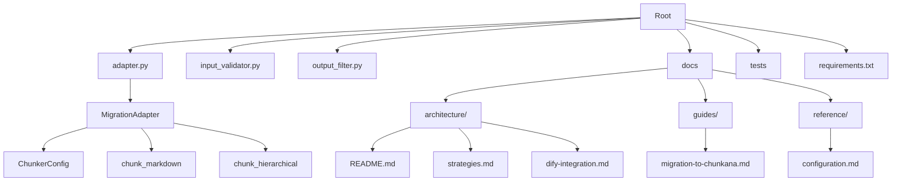
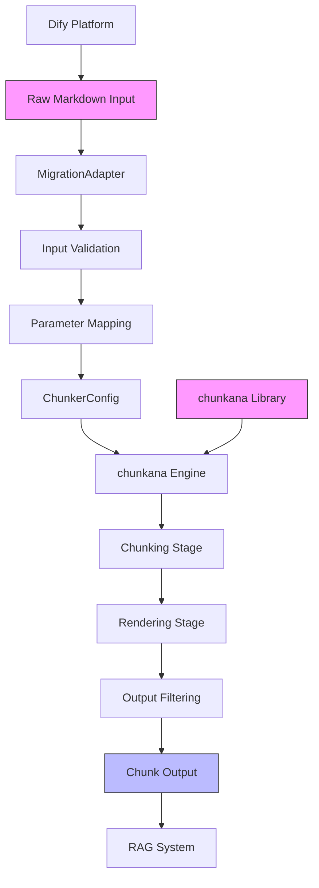
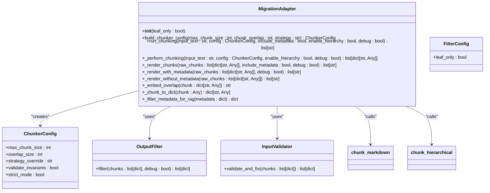
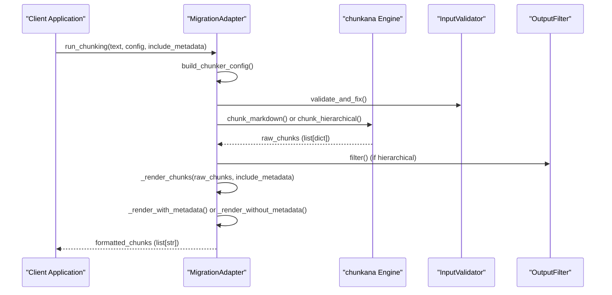
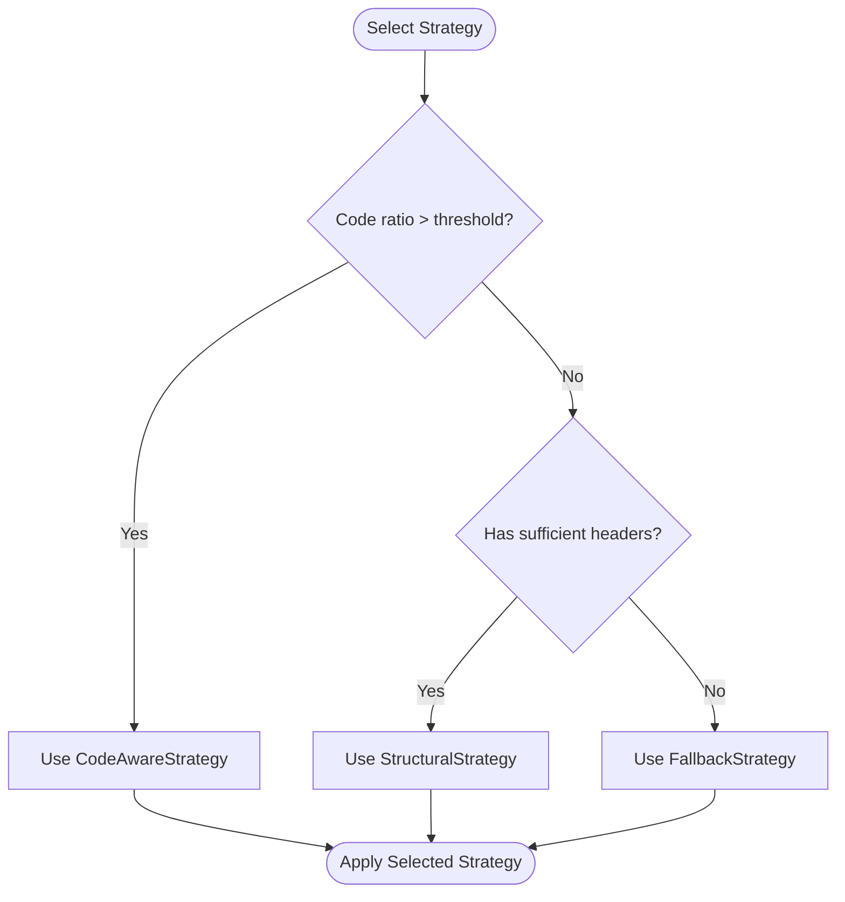
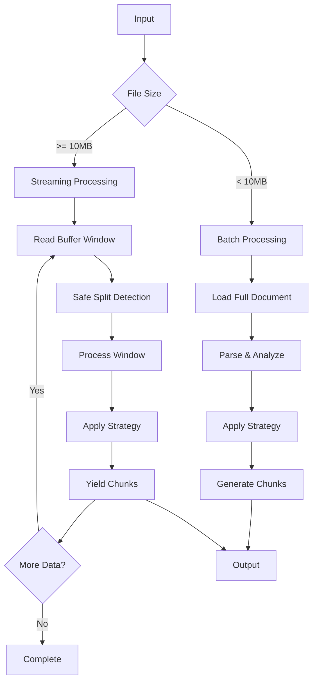
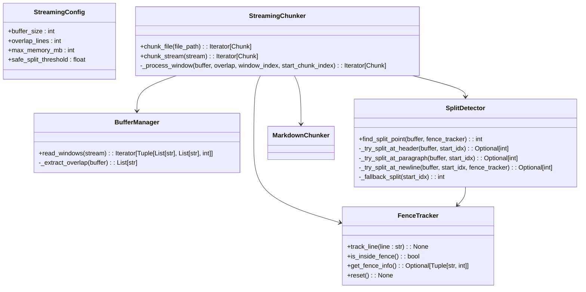
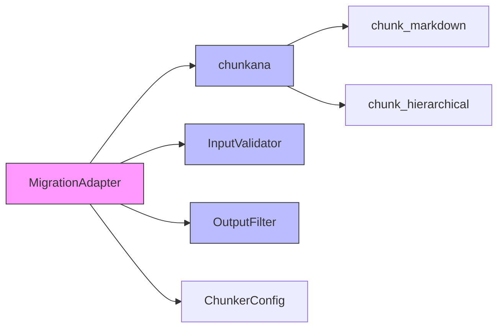

# Architecture Overview

<cite>
**Referenced Files in This Document**   
- [README.md](file://docs/architecture/README.md)
- [strategies.md](file://docs/architecture/strategies.md)
- [dify-integration.md](file://docs/architecture/dify-integration.md)
- [adapter.py](file://adapter.py)
- [migration-to-chunkana.md](file://docs/guides/migration-to-chunkana.md)
- [configuration.md](file://docs/reference/configuration.md)
</cite>

## Update Summary
**Changes Made**   
- Updated architecture overview to reflect migration from embedded chunking to external chunkana library
- Added new section on Migration Adapter Architecture with two-stage processing pipeline
- Updated architecture overview diagram to show new adapter pattern
- Added detailed component analysis for the MigrationAdapter class
- Updated dependency analysis to reflect new chunkana dependency
- Enhanced performance considerations with migration benefits

## Table of Contents
1. [Introduction](#introduction)
2. [Project Structure](#project-structure)
3. [Core Components](#core-components)
4. [Architecture Overview](#architecture-overview)
5. [Detailed Component Analysis](#detailed-component-analysis)
6. [Dependency Analysis](#dependency-analysis)
7. [Performance Considerations](#performance-considerations)
8. [Troubleshooting Guide](#troubleshooting-guide)
9. [Conclusion](#conclusion)

## Introduction

The Markdown Chunker system is a production-ready solution for intelligent markdown chunking, designed specifically for Retrieval-Augmented Generation (RAG) systems. The architecture follows modular design principles that enable extensibility and maintainability, with a clear separation of responsibilities between components. The system has evolved from a complex legacy implementation to a streamlined v2 architecture that simplifies the chunking pipeline while preserving critical functionality.

The system's primary purpose is to intelligently split markdown documents into semantically meaningful chunks while preserving structural integrity, particularly for code blocks, tables, and hierarchical content. It achieves this through a strategy-based approach that automatically selects the most appropriate chunking algorithm based on document analysis. The architecture supports both standalone usage and integration with the Dify platform as a tool plugin, making it versatile for various deployment scenarios.

## Project Structure

The project follows a layered architecture with distinct modules for parsing, chunking, strategies, and configuration. The directory structure reflects the evolution from legacy to v2 implementations, with parallel implementations that allow for backward compatibility while introducing a simplified, more maintainable architecture.

```mermaid
graph TD
A[Root] --> B[adapter.py]
A --> C[input_validator.py]
A --> D[output_filter.py]
A --> E[docs]
A --> F[tests]
A --> G[requirements.txt]
B --> H[MigrationAdapter]
H --> I[ChunkerConfig]
H --> J[chunk_markdown]
H --> K[chunk_hierarchical]
E --> L[architecture/]
E --> M[guides/]
E --> N[reference/]
L --> O[README.md]
L --> P[strategies.md]
L --> Q[dify-integration.md]
M --> R[migration-to-chunkana.md]
N --> S[configuration.md]
```

**Diagram sources**
- [README.md](file://docs/architecture/README.md)
- [project structure](file://)

**Section sources**
- [project structure](file://)

## Core Components

The Markdown Chunker system consists of several core components that work together to transform raw markdown input into properly chunked output. The v2 architecture simplifies the pipeline into four main components: parser, strategy selector, chunking orchestrator, and post-processing modules. The parser component analyzes the markdown document and extracts structural elements like headers, code blocks, and tables. The strategy selector evaluates the document characteristics and chooses the most appropriate chunking strategy. The chunking orchestrator applies the selected strategy to produce chunks, and post-processing modules handle tasks like overlap application and validation.

The system's design emphasizes structural accuracy through AST-based parsing and adaptive chunking through the strategy pattern. This allows the system to handle diverse document types appropriately, from code-heavy technical documentation to structured articles with hierarchical headers. The modular design enables easy extension with new strategies or parsing capabilities without affecting the core pipeline.

**Section sources**
- [adapter.py](file://adapter.py#L42-L346)
- [migration-to-chunkana.md](file://docs/guides/migration-to-chunkana.md#L1-L212)
- [configuration.md](file://docs/reference/configuration.md#L1-L530)

## Architecture Overview

The Markdown Chunker system follows a modular, layered architecture that processes markdown documents through a well-defined pipeline. The architecture is designed around several key principles: modularity, structural accuracy, adaptive chunking, and error resilience. The system has evolved from a complex legacy implementation with multiple processing stages to a streamlined v2 architecture that maintains the same capabilities with significantly reduced complexity.

The core architectural pattern is a simplified pipeline that processes documents in four main phases: parsing, strategy selection, chunking, and post-processing. This linear flow replaces the more complex orchestration model of the legacy system while preserving all essential functionality. The v2 architecture consolidates 15 legacy files into just 5 core files, reducing the codebase from over 10,000 lines to approximately 2,000 lines while maintaining or improving functionality.

A significant architectural enhancement is the introduction of the migration adapter pattern, which facilitates the transition from embedded markdown chunking implementation to the external chunkana library. This adapter provides a compatibility layer that ensures exact behavioral compatibility while leveraging the advanced chunking capabilities of the chunkana engine. The migration adapter implements a two-stage processing pipeline (chunking and rendering) that guarantees boundary invariance regardless of output format requirements.

```mermaid
graph TD
A[Raw Markdown Input] --> B[MigrationAdapter]
B --> C[Input Validation]
C --> D[Parameter Mapping]
D --> E[ChunkerConfig]
E --> F[chunkana Engine]
F --> G[Chunking Stage]
G --> H[Rendering Stage]
H --> I[Output Filtering]
I --> J[Chunk Output]
K[Dify Platform] --> A
J --> L[RAG System]
M[chunkana Library] --> F
style A fill:#f9f,stroke:#333
style J fill:#bbf,stroke:#333
style M fill:#f9f,stroke:#333
```

**Diagram sources**
- [adapter.py](file://adapter.py#L15-L20)
- [migration-to-chunkana.md](file://docs/guides/migration-to-chunkana.md#L1-L212)
- [README.md](file://docs/architecture/README.md#L148-L307)

## Detailed Component Analysis

### Migration Adapter Architecture

The MigrationAdapter class is the cornerstone of the architectural migration from embedded markdown chunking to the external chunkana library. It provides a seamless transition while maintaining full backward compatibility with existing workflows. The adapter implements a two-stage processing pipeline that separates chunking boundaries from output formatting, ensuring that chunk boundaries remain invariant regardless of metadata embedding requirements.

The adapter's key responsibilities include parameter mapping from plugin UI to chunkana configuration, input validation and preprocessing, output filtering and formatting, and backward compatibility with legacy plugin behavior. This design follows the adapter pattern, allowing the system to leverage the advanced capabilities of the chunkana engine while preserving the existing interface contract.

#### For Object-Oriented Components:

```mermaid
classDiagram
class MigrationAdapter {
+__init__(leaf_only : bool)
+build_chunker_config(max_chunk_size : int, chunk_overlap : int, strategy : str) ChunkerConfig
+run_chunking(input_text : str, config : ChunkerConfig, include_metadata : bool, enable_hierarchy : bool, debug : bool) list[str]
+_perform_chunking(input_text : str, config : ChunkerConfig, enable_hierarchy : bool, debug : bool) list[dict[str, Any]]
+_render_chunks(raw_chunks : list[dict[str, Any]], include_metadata : bool, debug : bool) list[str]
+_render_with_metadata(raw_chunks : list[dict[str, Any]], debug : bool) list[str]
+_render_without_metadata(raw_chunks : list[dict[str, Any]]) list[str]
+_embed_overlap(chunk : dict[str, Any]) str
+_chunk_to_dict(chunk : Any) dict[str, Any]
+_filter_metadata_for_rag(metadata : dict) dict
}
class ChunkerConfig {
+max_chunk_size : int
+overlap_size : int
+strategy_override : str
+validate_invariants : bool
+strict_mode : bool
}
class FilterConfig {
+leaf_only : bool
}
class OutputFilter {
+filter(chunks : list[dict], debug : bool) list[dict]
}
class InputValidator {
+validate_and_fix(chunks : list[dict]) list[dict]
}
MigrationAdapter --> ChunkerConfig : "creates"
MigrationAdapter --> OutputFilter : "uses"
MigrationAdapter --> InputValidator : "uses"
MigrationAdapter --> chunk_markdown : "calls"
MigrationAdapter --> chunk_hierarchical : "calls"
```

**Diagram sources**
- [adapter.py](file://adapter.py#L42-L346)
- [configuration.md](file://docs/reference/configuration.md#L106-L117)

**Section sources**   
- [adapter.py](file://adapter.py#L42-L346)
- [migration-to-chunkana.md](file://docs/guides/migration-to-chunkana.md#L1-L212)

### Two-Stage Processing Pipeline

The migration adapter implements a two-stage processing pipeline that separates the chunking process from the rendering process. This architectural decision ensures that chunk boundaries are determined independently of output formatting requirements, providing boundary invariance across different use cases.

#### Stage 1: Chunking (Boundary-Invariant)

The first stage focuses solely on determining optimal chunk boundaries based on content structure and configuration parameters. This stage is completely independent of output format requirements, ensuring that the same input document will always produce identical chunk boundaries regardless of whether metadata is included in the output.

Key characteristics of the chunking stage:
- Processes input text through the chunkana engine
- Applies strategy selection based on content analysis
- Generates raw chunks with content, positions, and metadata
- Validates and fixes chunk boundaries
- Applies hierarchical filtering when enabled
- Returns raw chunk dictionaries without formatting

#### Stage 2: Rendering (Format-Dependent)

The second stage handles output formatting based on the specified requirements. This stage takes the raw chunks from stage 1 and applies the appropriate formatting without modifying the underlying chunk boundaries or content.

Key characteristics of the rendering stage:
- Depends on include_metadata parameter
- For include_metadata=True: formats chunks with embedded metadata blocks
- For include_metadata=False: embeds overlap content (previous + current + next) for context preservation
- Applies metadata filtering for RAG use cases
- Returns formatted strings ready for output

#### For API/Service Components:

```mermaid
sequenceDiagram
participant Client as "Client Application"
participant Adapter as "MigrationAdapter"
participant Chunkana as "chunkana Engine"
participant Validator as "InputValidator"
participant Filter as "OutputFilter"
Client->>Adapter : run_chunking(text, config, include_metadata)
Adapter->>Adapter : build_chunker_config()
Adapter->>Validator : validate_and_fix()
Adapter->>Chunkana : chunk_markdown() or chunk_hierarchical()
Chunkana-->>Adapter : raw_chunks (list[dict])
Adapter->>Filter : filter() (if hierarchical)
Adapter->>Adapter : _render_chunks(raw_chunks, include_metadata)
Adapter->>Adapter : _render_with_metadata() or _render_without_metadata()
Adapter-->>Client : formatted_chunks (list[str])
```

**Diagram sources**
- [adapter.py](file://adapter.py#L131-L155)
- [migration-to-chunkana.md](file://docs/guides/migration-to-chunkana.md#L56-L62)

**Section sources**   
- [adapter.py](file://adapter.py#L131-L234)
- [migration-to-chunkana.md](file://docs/guides/migration-to-chunkana.md#L56-L62)

### Chunking Strategies

The system implements a strategy pattern with three main strategies that replace the six strategies of the legacy implementation. The CodeAwareStrategy handles documents with code blocks or tables, preserving these atomic blocks intact while chunking the surrounding text. The StructuralStrategy processes documents with hierarchical headers by splitting at section boundaries while maintaining the header hierarchy. The FallbackStrategy provides a universal approach that works for any document by splitting on paragraph boundaries and grouping paragraphs to fit within size limits.

This consolidation from six to three strategies significantly reduces complexity while maintaining the same capabilities. The strategy selection algorithm uses configurable thresholds to determine which strategy to apply, with the ability to override automatic selection when needed. Each strategy inherits from the BaseStrategy abstract class, ensuring a consistent interface and shared functionality like chunk creation and metadata handling.

#### For Complex Logic Components:

```mermaid
flowchart TD
Start([Select Strategy]) --> CodeCheck{"Code ratio > threshold?"}
CodeCheck --> |Yes| CodeStrategy["Use CodeAwareStrategy"]
CodeCheck --> |No| StructureCheck{"Has sufficient headers?"}
StructureCheck --> |Yes| StructuralStrategy["Use StructuralStrategy"]
StructureCheck --> |No| FallbackStrategy["Use FallbackStrategy"]
CodeStrategy --> Output
StructuralStrategy --> Output
FallbackStrategy --> Output
Output([Apply Selected Strategy])
```

**Diagram sources**
- [strategies/code_aware.py](file://markdown_chunker_v2/strategies/code_aware.py#L15-L149)
- [strategies/structural.py](file://markdown_chunker_v2/strategies/structural.py#L15-L151)
- [strategies/fallback.py](file://markdown_chunker_v2/strategies/fallback.py#L15-L96)

**Section sources**
- [strategies/code_aware.py](file://markdown_chunker_v2/strategies/code_aware.py#L1-L149)
- [strategies/structural.py](file://markdown_chunker_v2/strategies/structural.py#L1-L151)
- [strategies/fallback.py](file://markdown_chunker_v2/strategies/fallback.py#L1-L96)

### Parallel Processing Paths (Batch and Streaming)

The system now supports two parallel processing paths: batch and streaming. This architectural enhancement enables efficient processing of documents of all sizes while maintaining memory efficiency for large files.

The **batch processing path** follows the traditional approach of loading the entire document into memory, parsing it completely, and then chunking it. This path is optimal for small-to-medium documents (<10MB) and provides the fastest processing speed.

The **streaming processing path** is designed for large documents (>10MB) and operates on buffer windows to limit memory usage. This path processes the document in chunks, applying safe split detection to maintain chunk quality at window boundaries. The streaming complexity is isolated in a dedicated module (`markdown_chunker_v2/streaming/`), ensuring that the core batch processing pipeline remains simple and performant.

The streaming path includes several specialized components:
- **BufferManager**: Reads the file in configurable buffer windows (default: 100KB)
- **FenceTracker**: Maintains state across buffer boundaries to prevent splitting code blocks
- **SplitDetector**: Identifies safe split points using semantic boundaries (headers, paragraphs)
- **StreamingChunker**: Coordinates the streaming process and yields chunks incrementally

This dual-path approach provides backward compatibility while adding support for memory-constrained environments and very large documentation processing.

```mermaid
graph TD
A[Input] --> B{File Size}
B --> |< 10MB| C[Batch Processing]
B --> |>= 10MB| D[Streaming Processing]
C --> E[Load Full Document]
E --> F[Parse & Analyze]
F --> G[Apply Strategy]
G --> H[Generate Chunks]
D --> I[Read Buffer Window]
I --> J[Safe Split Detection]
J --> K[Process Window]
K --> L[Apply Strategy]
L --> M[Yield Chunks]
M --> N{More Data?}
N --> |Yes| I
N --> |No| O[Complete]
H --> P[Output]
M --> P
```

**Diagram sources**
- [README.md](file://docs/architecture/README.md#L148-L307)
- [streaming_chunker.py](file://markdown_chunker_v2/streaming/streaming_chunker.py#L17-L103)
- [buffer_manager.py](file://markdown_chunker_v2/streaming/buffer_manager.py#L13-L64)
- [split_detector.py](file://markdown_chunker_v2/streaming/split_detector.py#L12-L98)
- [fence_tracker.py](file://markdown_chunker_v2/streaming/fence_tracker.py#L11-L66)

**Section sources**
- [chunker.py](file://markdown_chunker_v2/chunker.py#L239-L263)
- [streaming_chunker.py](file://markdown_chunker_v2/streaming/streaming_chunker.py#L17-L103)
- [buffer_manager.py](file://markdown_chunker_v2/streaming/buffer_manager.py#L13-L64)
- [split_detector.py](file://markdown_chunker_v2/streaming/split_detector.py#L12-L98)
- [fence_tracker.py](file://markdown_chunker_v2/streaming/fence_tracker.py#L11-L66)

### Dedicated Streaming Module

The streaming complexity is isolated in a dedicated module (`markdown_chunker_v2/streaming/`) that contains all components related to streaming processing. This isolation ensures that the core chunking logic remains focused on batch processing while providing a clean, modular interface for streaming operations.

The module includes:
- **StreamingConfig**: Configuration class with parameters for buffer size, overlap lines, and memory limits
- **BufferManager**: Manages buffer windows and overlap between windows
- **FenceTracker**: Tracks code fence state across buffer boundaries to prevent mid-block splits
- **SplitDetector**: Detects safe split points using semantic boundaries with priority order
- **StreamingChunker**: Main class that coordinates the streaming process

The StreamingChunker class wraps the base MarkdownChunker and applies it to buffer windows, yielding chunks incrementally. It maintains streaming-specific metadata such as window index and bytes processed, enabling progress tracking for long-running operations.

This modular design allows for independent development and testing of the streaming components while maintaining compatibility with all existing chunking strategies.

```mermaid
classDiagram
class StreamingConfig {
+buffer_size : int
+overlap_lines : int
+max_memory_mb : int
+safe_split_threshold : float
}
class BufferManager {
+read_windows(stream) : Iterator[Tuple[List[str], List[str], int]]
-_extract_overlap(buffer) : List[str]
}
class FenceTracker {
+track_line(line : str) : None
+is_inside_fence() : bool
+get_fence_info() : Optional[Tuple[str, int]]
+reset() : None
}
class SplitDetector {
+find_split_point(buffer, fence_tracker) : int
-_try_split_at_header(buffer, start_idx) : Optional[int]
-_try_split_at_paragraph(buffer, start_idx) : Optional[int]
-_try_split_at_newline(buffer, start_idx, fence_tracker) : Optional[int]
-_fallback_split(start_idx) : int
}
class StreamingChunker {
+chunk_file(file_path) : Iterator[Chunk]
+chunk_stream(stream) : Iterator[Chunk]
-_process_window(buffer, overlap, window_index, start_chunk_index) : Iterator[Chunk]
}
StreamingChunker --> BufferManager
StreamingChunker --> SplitDetector
StreamingChunker --> FenceTracker
StreamingChunker --> MarkdownChunker
SplitDetector --> FenceTracker
```

**Diagram sources**
- [config.py](file://markdown_chunker_v2/streaming/config.py#L8-L23)
- [buffer_manager.py](file://markdown_chunker_v2/streaming/buffer_manager.py#L13-L64)
- [fence_tracker.py](file://markdown_chunker_v2/streaming/fence_tracker.py#L11-L66)
- [split_detector.py](file://markdown_chunker_v2/streaming/split_detector.py#L12-L98)
- [streaming_chunker.py](file://markdown_chunker_v2/streaming/streaming_chunker.py#L17-L103)

**Section sources**
- [config.py](file://markdown_chunker_v2/streaming/config.py#L8-L23)
- [buffer_manager.py](file://markdown_chunker_v2/streaming/buffer_manager.py#L13-L64)
- [fence_tracker.py](file://markdown_chunker_v2/streaming/fence_tracker.py#L11-L66)
- [split_detector.py](file://markdown_chunker_v2/streaming/split_detector.py#L12-L98)
- [streaming_chunker.py](file://markdown_chunker_v2/streaming/streaming_chunker.py#L17-L103)

## Dependency Analysis

The Markdown Chunker system has a well-defined dependency structure that supports its modular design. The v2 architecture significantly simplifies dependencies compared to the legacy implementation by consolidating functionality and removing circular dependencies. The core dependencies flow in a single direction from the main chunker class to supporting components, creating a clean, linear pipeline.

The system depends on standard Python libraries for regular expressions and dataclasses, with the key external dependency being the chunkana library for core chunking functionality. This design choice enhances reliability and reduces the attack surface while leveraging the advanced capabilities of the external library. The backward compatibility layer depends on the v2 implementation, allowing legacy code to work with the new architecture without modification.

```mermaid
graph LR
A[MigrationAdapter] --> B[chunkana]
A --> C[InputValidator]
A --> D[OutputFilter]
A --> E[ChunkerConfig]
B --> F[chunk_markdown]
B --> G[chunk_hierarchical]
style A fill:#f9f,stroke:#333
style B fill:#bbf,stroke:#333
style C fill:#bbf,stroke:#333
style D fill:#bbf,stroke:#333
```

**Diagram sources**
- [adapter.py](file://adapter.py#L30-L34)
- [requirements.txt](file://requirements.txt#L2)

**Section sources**
- [adapter.py](file://adapter.py#L1-L352)
- [requirements.txt](file://requirements.txt#L1-L22)

## Performance Considerations

The Markdown Chunker system is designed with performance in mind, particularly for processing large documents in RAG pipelines. The v2 architecture improves performance by reducing the number of processing passes from multiple to just one, eliminating redundant parsing and analysis. The parser normalizes line endings at the start of processing, which prevents repeated normalization operations throughout the pipeline.

The migration to the chunkana library brings several performance benefits:
- **Faster Processing**: Optimized algorithms in chunkana core
- **Lower Memory Usage**: Improved memory management
- **Better Scaling**: Linear performance scaling for large documents

The system uses efficient algorithms for extracting structural elements, leveraging regular expressions for pattern matching while maintaining accuracy. The strategy selection process is lightweight, relying on pre-computed metrics from the content analysis phase rather than performing additional document processing. For large documents, the system processes content in a streaming fashion where possible, minimizing memory usage.

The performance characteristics vary by strategy, with the FallbackStrategy being the fastest but potentially producing lower-quality chunks, while the StructuralStrategy and CodeAwareStrategy provide higher quality at the cost of additional processing. The system includes built-in metrics collection that allows monitoring of processing time, chunk quality, and resource usage, enabling optimization based on real-world performance data.

The introduction of the streaming path adds approximately 10-15% overhead compared to batch processing but provides guaranteed memory bounds regardless of file size. Streaming maintains constant memory usage (~15MB peak) even for multi-gigabyte documents, making it suitable for resource-constrained environments. The batch path remains optimal for smaller documents, providing the fastest processing speed.

**Section sources**
- [test_streaming_benchmarks.py](file://tests/integration/test_streaming_benchmarks.py#L1-L165)
- [streaming.md](file://docs/api/streaming.md#L180-L210)
- [README.md](file://docs/architecture/README.md#L240-L251)
- [migration-to-chunkana.md](file://docs/guides/migration-to-chunkana.md#L97-L104)

## Troubleshooting Guide

The Markdown Chunker system includes several mechanisms for troubleshooting and error resilience. The architecture incorporates multiple layers of error handling, from input validation to fallback strategies that ensure chunking can proceed even when primary approaches fail. When issues occur, the system provides informative error messages and warnings that help identify the root cause.

Common issues include documents that are too large, malformed markdown that cannot be parsed correctly, or configuration settings that lead to suboptimal chunking. The system addresses these through sensible defaults, automatic fallback to simpler strategies, and comprehensive validation. For integration with Dify, specific troubleshooting steps are available for issues like missing plugins or configuration errors.

For streaming processing, specific issues may arise:
- **Memory limits exceeded**: Reduce buffer_size in StreamingConfig
- **File not found**: Verify file path and permissions
- **Encoding issues**: Specify encoding explicitly when opening files
- **Chunk quality at boundaries**: The system uses safe split detection to minimize boundary issues, but complex nested structures may occasionally be split

The architecture audit documents provide detailed guidance on identifying and resolving issues, including performance bottlenecks, content loss, and incorrect chunk boundaries. The test suite includes extensive edge case coverage that helps prevent regressions and ensures consistent behavior across different document types.

**Section sources**
- [dify-integration.md](file://docs/architecture/dify-integration.md#L126-L153)
- [orchestrator.py](file://markdown_chunker_legacy/chunker/orchestrator.py#L189-L188)
- [streaming.md](file://docs/api/streaming.md#L262-L293)

## Conclusion

The Markdown Chunker system represents a significant evolution from its legacy implementation to a more maintainable, performant, and reliable v2 architecture. By consolidating six chunking strategies into three, reducing the codebase size by over 80%, and simplifying the processing pipeline, the system achieves the same or better functionality with dramatically improved maintainability.

The architectural decisions to use AST-based parsing for structural accuracy and the strategy pattern for adaptive chunking have proven effective in handling diverse document types appropriately. The modular design enables easy extension with new strategies or parsing capabilities while maintaining backward compatibility through the compatibility layer.

The system successfully balances the competing demands of RAG applications: preserving semantic meaning while creating chunks of appropriate size, handling diverse content types effectively, and providing reliable performance at scale. Its integration with the Dify platform as a tool plugin demonstrates its versatility and readiness for production use in AI-powered applications.

A key enhancement in this version is the introduction of the migration adapter pattern, which facilitates the transition from embedded markdown chunking implementation to the external chunkana library. This adapter provides a compatibility layer that ensures exact behavioral compatibility while leveraging the advanced chunking capabilities of the chunkana engine. The adapter implements a two-stage processing pipeline (chunking and rendering) that guarantees boundary invariance regardless of output format requirements, ensuring consistent chunk boundaries across different use cases.