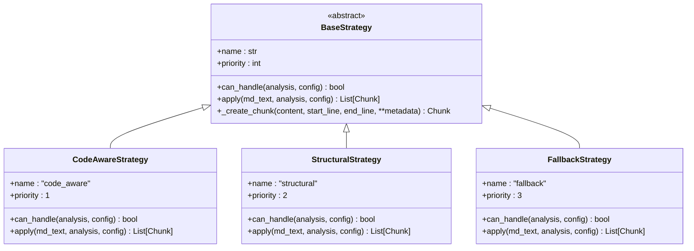
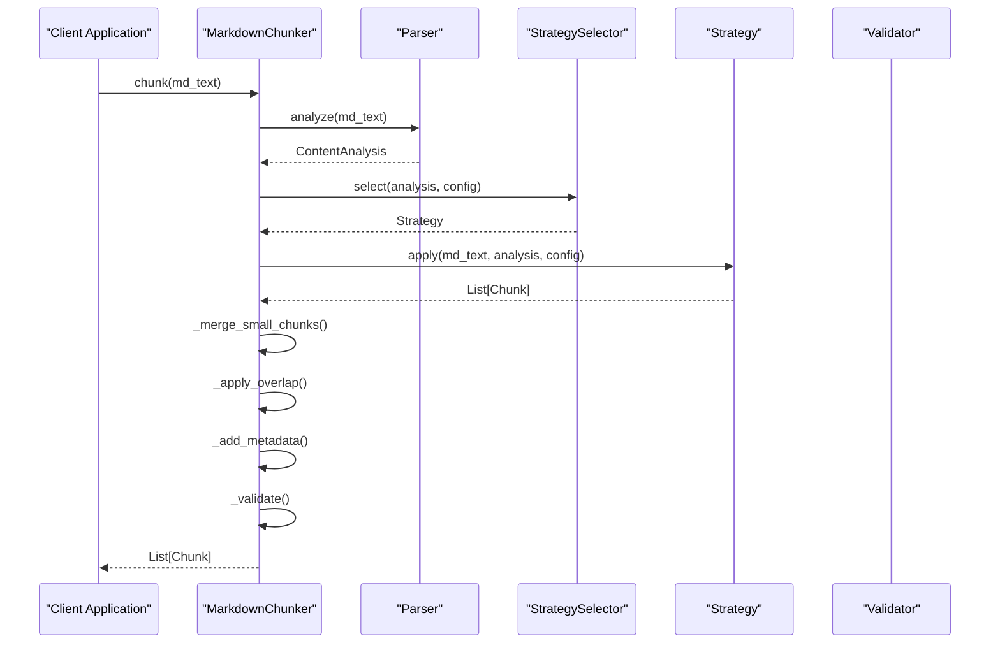
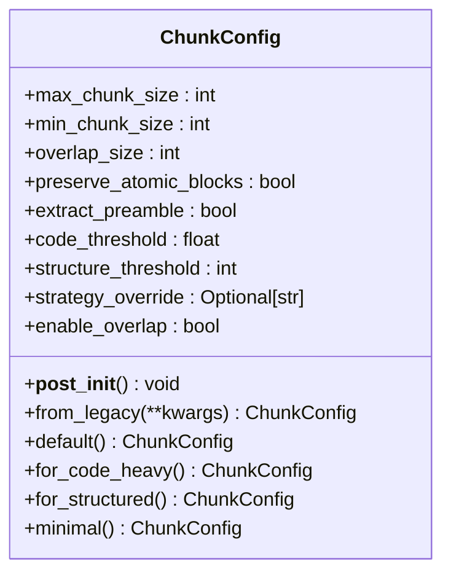
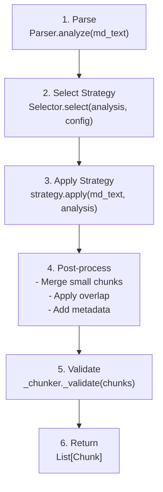

# Architecture

<cite>
**Referenced Files in This Document**   
- [markdown_chunker/__init__.py](file://markdown_chunker/__init__.py)
- [markdown_chunker_v2/chunker.py](file://markdown_chunker_v2/chunker.py)
- [markdown_chunker_v2/parser.py](file://markdown_chunker_v2/parser.py)
- [markdown_chunker_v2/config.py](file://markdown_chunker_v2/config.py)
- [markdown_chunker_v2/types.py](file://markdown_chunker_v2/types.py)
- [markdown_chunker_v2/strategies/base.py](file://markdown_chunker_v2/strategies/base.py)
- [markdown_chunker_v2/strategies/code_aware.py](file://markdown_chunker_v2/strategies/code_aware.py)
- [markdown_chunker_v2/strategies/structural.py](file://markdown_chunker_v2/strategies/structural.py)
- [markdown_chunker_v2/strategies/fallback.py](file://markdown_chunker_v2/strategies/fallback.py)
- [markdown_chunker_legacy/chunker/orchestrator.py](file://markdown_chunker_legacy/chunker/orchestrator.py)
- [markdown_chunker_legacy/chunker/selector.py](file://markdown_chunker_legacy/chunker/selector.py)
- [docs/architecture-audit-to-be/01-overview.md](file://docs/architecture-audit-to-be/01-overview.md)
- [provider/markdown_chunker.py](file://provider/markdown_chunker.py)
</cite>

## Table of Contents
1. [Introduction](#introduction)
2. [Design Principles](#design-principles)
3. [Architectural Patterns](#architectural-patterns)
4. [Component Interactions and Data Flow](#component-interactions-and-data-flow)
5. [Technology Stack and Dependencies](#technology-stack-and-dependencies)
6. [Cross-Cutting Concerns](#cross-cutting-concerns)
7. [Evolution Path](#evolution-path)
8. [System Context and Integration](#system-context-and-integration)
9. [Conclusion](#conclusion)

## Introduction

The Markdown chunker system is a production-ready solution for intelligent, structure-aware chunking of Markdown documents, specifically designed for Retrieval-Augmented Generation (RAG) systems. The architecture has evolved through multiple iterations, culminating in a simplified, robust v2 implementation that prioritizes reliability, performance, and ease of use. This document details the high-level design principles, key architectural patterns, component interactions, and the evolution from legacy to current implementations, providing a comprehensive overview of the system's architecture.

## Design Principles

The Markdown chunker system is built upon a foundation of core design principles that guide its architecture and implementation. These principles ensure the system is modular, extensible, and resilient, capable of handling a wide variety of Markdown documents with high reliability.

### Modularity

The system adheres to a strict single-responsibility principle, where each component is designed to solve one specific problem. The codebase is organized into distinct modules, each with a clear and focused purpose. The primary modules include:
- **Parser**: Responsible for analyzing the Markdown document and extracting structural elements like headers, code blocks, and tables.
- **Chunker**: The core orchestrator that manages the chunking pipeline.
- **Strategies**: A collection of algorithms that define different approaches to splitting the document.
- **Validator**: Ensures the output meets critical domain properties.
- **Types**: Contains all shared data structures and type definitions.

This modular design allows for independent development, testing, and maintenance of each component. For example, the `Parser` class in `parser.py` is completely decoupled from the `MarkdownChunker` class, communicating only through well-defined data structures like `ContentAnalysis`.

### Extensibility

The architecture is designed to be highly extensible, primarily through the use of the Strategy Pattern. New chunking algorithms can be added by creating a new class that inherits from the `BaseStrategy` abstract base class and implementing the required methods. The system automatically discovers and integrates new strategies without requiring changes to the core orchestration logic. This design allows the system to adapt to new document types and chunking requirements over time.

### Resilience

Resilience is a cornerstone of the system's design. The architecture incorporates multiple layers of error handling and fallback mechanisms to ensure that chunking operations succeed even in the face of malformed input or unexpected conditions. The system is designed to degrade gracefully, providing the best possible output even when ideal conditions are not met. For instance, if a primary strategy fails, the system will automatically fall back to a more universal strategy to ensure a result is always produced.

## Architectural Patterns

The Markdown chunker system employs several key architectural patterns to achieve its design goals of modularity, extensibility, and resilience.

### Strategy Pattern for Algorithm Selection

The Strategy Pattern is the central architectural pattern used for algorithm selection. It allows the system to dynamically choose the most appropriate chunking algorithm based on the document's content characteristics.

The pattern is implemented with a `BaseStrategy` abstract base class that defines the interface for all strategies. Concrete strategy classes like `CodeAwareStrategy`, `StructuralStrategy`, and `FallbackStrategy` inherit from this base class and provide specific implementations.



**Diagram sources**
- [markdown_chunker_v2/strategies/base.py](file://markdown_chunker_v2/strategies/base.py#L12-L233)
- [markdown_chunker_v2/strategies/code_aware.py](file://markdown_chunker_v2/strategies/code_aware.py#L15-L149)
- [markdown_chunker_v2/strategies/structural.py](file://markdown_chunker_v2/strategies/structural.py#L15-L151)
- [markdown_chunker_v2/strategies/fallback.py](file://markdown_chunker_v2/strategies/fallback.py#L15-L96)

The `StrategySelector` within the `MarkdownChunker` class evaluates the document's `ContentAnalysis` and selects the strategy with the highest priority that can handle the document's characteristics. This pattern decouples the algorithm selection logic from the execution logic, making it easy to add, remove, or modify strategies without affecting the rest of the system.

### Orchestrator Pattern for Pipeline Coordination

The Orchestrator Pattern is used to coordinate the entire chunking pipeline. The `MarkdownChunker` class acts as the orchestrator, managing the sequence of operations from input to output.



**Diagram sources**
- [markdown_chunker_v2/chunker.py](file://markdown_chunker_v2/chunker.py#L21-L357)
- [markdown_chunker_v2/parser.py](file://markdown_chunker_v2/parser.py#L14-L282)
- [markdown_chunker_v2/strategies/base.py](file://markdown_chunker_v2/strategies/base.py#L12-L233)

The orchestrator ensures a linear, predictable flow of data through the pipeline: Parse → Select Strategy → Apply Strategy → Post-process → Validate → Return. This pattern centralizes the control logic, making the overall process easier to understand and debug, while delegating specific tasks to specialized components.

### Dependency Injection for Component Flexibility

Dependency Injection (DI) is used to enhance component flexibility and testability. The `MarkdownChunker` class receives its dependencies (the `Parser` and internal selector logic) through its constructor, rather than creating them internally.

```python
def __init__(self, config: Optional[ChunkConfig] = None):
    self.config = config or ChunkConfig()
    self._parser = Parser()
    self._selector = StrategySelector()
```

This pattern allows for easy substitution of components, particularly valuable for testing. For example, a mock parser can be injected during unit tests to isolate the chunker's logic from the parsing logic. It also makes the system more flexible, as different parser implementations could theoretically be used without modifying the `MarkdownChunker` class.

### Factory Pattern for Configuration Profiles

The Factory Pattern is used to create pre-configured instances of `ChunkConfig` for common use cases. The `ChunkConfig` class provides several class methods that act as factories for different configuration profiles.



**Diagram sources**
- [markdown_chunker_v2/config.py](file://markdown_chunker_v2/config.py#L12-L170)

Methods like `for_code_heavy()`, `for_structured()`, and `minimal()` serve as factories that return `ChunkConfig` objects with parameters optimized for specific scenarios. This pattern simplifies configuration for end-users, providing sensible defaults for common tasks and reducing the likelihood of configuration errors.

## Component Interactions and Data Flow

The data flow within the Markdown chunker system follows a clean, linear pipeline, as defined in the target architecture documentation. This section details the interactions between components and the flow of data through the system.

### Linear Pipeline Execution

The entire chunking process is designed as a single-pass, linear pipeline to maximize performance and minimize complexity. The flow, as visualized in the target architecture, is as follows:



**Diagram sources**
- [docs/architecture-audit-to-be/01-overview.md](file://docs/architecture-audit-to-be/01-overview.md#L139-L178)

1. **Parse**: The `Parser` analyzes the input Markdown text in a single pass, normalizing line endings and extracting key elements like headers, code blocks, and tables. The result is a `ContentAnalysis` object containing all necessary metrics and extracted data.
2. **Select Strategy**: The `MarkdownChunker` uses the `ContentAnalysis` and `ChunkConfig` to determine which `BaseStrategy` is best suited for the document. This decision is based on thresholds like `code_threshold` and `structure_threshold`.
3. **Apply Strategy**: The selected strategy processes the normalized text and `ContentAnalysis` to produce a list of `Chunk` objects. Each strategy implements its own logic for splitting the document.
4. **Post-process**: The orchestrator performs several post-processing steps: merging small chunks, applying overlap between adjacent chunks, and enriching each chunk with metadata (e.g., content type, strategy used).
5. **Validate**: The final list of chunks is validated against critical domain properties (e.g., no content loss, monotonic ordering) to ensure quality and correctness.
6. **Return**: The final list of chunks is returned to the caller.

This linear design eliminates conditional branching and redundant operations, resulting in a predictable and efficient process.

### Key Data Structures

The system relies on a set of well-defined data structures to pass information between components. The primary types are defined in `types.py`:

```mermaid
erDiagram
ContentAnalysis {
int total_chars
int total_lines
float code_ratio
int code_block_count
int header_count
int max_header_depth
int table_count
List[FencedBlock] code_blocks
List[Header] headers
List[TableBlock] tables
bool has_preamble
int preamble_end_line
}
Chunk {
string content
int start_line
int end_line
Dict[str, Any] metadata
}
ChunkingResult {
List[Chunk] chunks
string strategy_used
float processing_time
int total_chars
int total_lines
}
FencedBlock {
string language
string content
int start_line
int end_line
int start_pos
int end_pos
}
Header {
int level
string text
int line
int pos
}
TableBlock {
string content
int start_line
int end_line
int column_count
int row_count
}
ContentAnalysis ||--o{ FencedBlock : contains
ContentAnalysis ||--o{ Header : contains
ContentAnalysis ||--o{ TableBlock : contains
ChunkingResult ||--o{ Chunk : contains
```

**Diagram sources**
- [markdown_chunker_v2/types.py](file://markdown_chunker_v2/types.py#L11-L272)

These data structures form the contract between components, ensuring type safety and clear data flow. The `ContentAnalysis` object, produced by the parser, is the primary input for strategy selection. The `Chunk` object is the fundamental unit of output, containing the text content, positional information, and rich metadata.

## Technology Stack and Dependencies

The Markdown chunker system is built using a minimal and focused technology stack, prioritizing simplicity and reliability.

### Core Technology

- **Python 3.8+**: The entire system is implemented in Python, leveraging its strong ecosystem for text processing and data analysis.
- **Standard Library**: The v2 implementation relies heavily on Python's standard library, particularly `dataclasses` for type definitions and `re` for regular expression-based parsing. This minimizes external dependencies and improves stability.
- **Type Hints**: The codebase uses extensive type hints from the `typing` module, enhancing code clarity, maintainability, and enabling better tooling support (e.g., IDEs, linters).

### Third-Party Dependencies

The v2 implementation has been drastically simplified, removing most third-party dependencies present in the legacy system. The current dependency list, as inferred from the codebase, is minimal:

- **None (v2 core)**: The core chunking logic in `markdown_chunker_v2` appears to have no external dependencies, relying solely on the Python standard library. This is a significant improvement over the legacy system, which used multiple Markdown parsing libraries (e.g., markdown-it-py, mistune).
- **Dify Plugin SDK**: The `provider/markdown_chunker.py` file imports `dify_plugin`, indicating integration with the Dify platform. This is an external dependency for the plugin interface but is separate from the core chunking logic.

The removal of external parsing libraries in favor of a custom, regex-based parser in `parser.py` is a key architectural decision for v2. While less feature-complete than dedicated Markdown parsers, this approach provides greater control, better performance, and eliminates a major source of complexity and potential bugs.

### Version Compatibility

The system is released as **version 2.0.0** according to Semantic Versioning, indicating a major release with breaking changes. The `__version__` constant in `markdown_chunker/__init__.py` confirms this. The `from_legacy` class method in `ChunkConfig` provides a migration path for users upgrading from v1.x, issuing deprecation warnings for renamed or removed parameters. This ensures backward compatibility while guiding users toward the new API.

## Cross-Cutting Concerns

The architecture addresses several cross-cutting concerns that are critical for a production-grade system.

### Logging

The system uses Python's built-in `logging` module for operational visibility. The `ChunkingOrchestrator` in the legacy system includes extensive logging at various levels (INFO, WARNING, DEBUG) to track the progress of chunking operations, strategy selection, and error conditions. While the v2 implementation appears to have reduced logging verbosity, the foundational support is present, and logging can be easily re-integrated as needed.

### Error Handling

Error handling is implemented at multiple levels:
- **Component Level**: Each component validates its inputs and handles expected exceptions. For example, `ChunkConfig.__post_init__` validates configuration parameters.
- **Orchestrator Level**: The `MarkdownChunker` uses a try-except block around critical sections and ensures a result is always returned, even if empty.
- **Domain Properties**: The `_validate` method enforces critical domain properties (e.g., no content loss, size bounds) and attempts to correct issues (e.g., sorting chunks) rather than failing outright.
- **Fallbacks**: The strategy system itself is a form of error handling; if a document doesn't fit a specific strategy, a more general one is used.

### Performance Monitoring

Performance is a primary design goal, reflected in the "Linear Pipeline" principle. The system is optimized for a single pass through the document, minimizing memory allocations and processing time. The `ChunkingMetrics` class provides built-in performance monitoring, calculating statistics like average chunk size, standard deviation, and counts of undersized/oversized chunks. These metrics can be used to tune the system and monitor its quality in production.

## Evolution Path

The architecture of the Markdown chunker system has undergone a significant evolution from its legacy implementation to the current v2 design.

### Legacy System (markdown_chunker_legacy)

The legacy system was complex and feature-rich but suffered from architectural bloat. Key characteristics included:
- **Multiple Parsing Libraries**: It supported adapters for `markdown-it-py`, `mistune`, and `commonmark`, adding significant complexity.
- **Numerous Strategies**: Six distinct strategies (`code`, `list`, `mixed`, `sentences`, `structural`, `table`) with overlapping responsibilities.
- **Complex Configuration**: Over 32 configuration parameters, many of which were bug-fix flags.
- **Multi-Stage Processing**: A two-stage process (Stage 1 analysis, Stage 2 chunking) with redundant parsing.
- **Extensive Components**: A large number of components (e.g., `BlockOverlapManager`, `ChunkSizeNormalizer`) for post-processing.

This complexity made the system difficult to maintain, test, and understand, leading to the need for a redesign.

### Target Architecture (v2)

The v2 redesign, as documented in `docs/architecture-audit-to-be/01-overview.md`, aimed to drastically simplify the system while preserving its core functionality. The key changes are:

| Metric | Legacy | v2 | Change |
|--------|--------|-----|--------|
| Files | 55 | 12 | -78% |
| Lines of Code | ~24,000 | ~5,000 | -79% |
| Configuration Parameters | 32 | 8 | -70% |
| Strategies | 6 | 3 | -50% |
| Public Symbols | 50+ | ~10 | -80% |

The v2 architecture consolidates functionality:
- **Strategies**: The six legacy strategies are consolidated into three: `CodeAwareStrategy` (replaces `code`, `mixed`, `table`), `StructuralStrategy`, and `FallbackStrategy`.
- **Configuration**: The 32 parameters are reduced to 8 core parameters, with legacy parameters handled via the `from_legacy` factory method.
- **Pipeline**: The two-stage process is replaced with a single, linear pipeline.
- **Parsing**: Multiple parser adapters are replaced with a single, custom regex-based parser.

This evolution represents a shift from a complex, multi-faceted system to a simple, focused tool that does one thing well. The v2 design prioritizes reliability and performance over configurability, acknowledging that most users benefit from sensible defaults rather than endless options.

## System Context and Integration

The Markdown chunker system is designed to integrate seamlessly with external systems, particularly RAG pipelines and AI platforms.

### Primary Integration: Dify Platform

The most direct integration point is with the Dify platform, as evidenced by the `provider/markdown_chunker.py` file. This file defines a `MarkdownChunkerProvider` class that implements the `ToolProvider` interface from the `dify_plugin` SDK.

```mermaid
graph TD
A[Dify Platform] < --> B[MarkdownChunkerProvider]
B --> C[MarkdownChunker]
C --> D[Parser]
C --> E[Strategies]
C --> F[Validator]
```

**Diagram sources**
- [provider/markdown_chunker.py](file://provider/markdown_chunker.py#L15-L36)

The `MarkdownChunkerProvider` acts as an adapter, exposing the local chunking functionality as a tool within the Dify environment. This allows Dify users to process Markdown documents as part of their AI workflows without needing external API calls or credentials, as the operation is entirely local.

### Integration with RAG Systems

The system's primary purpose is to prepare documents for RAG systems. Its output—structured `Chunk` objects with metadata like `header_path` and `content_type`—is ideal for ingestion into vector databases. The consistent, reliable chunking ensures that semantic context is preserved, improving the quality of retrieval.

### External System Interactions

The system has minimal external interactions:
- **File System**: It reads input from files via the `chunk_file` convenience function.
- **Standard Output/Logging**: It writes logs to standard output or configured logging handlers.
- **Dify Platform**: It communicates with the Dify platform through the plugin interface.

It does not make any external network calls for its core functionality, making it suitable for air-gapped or secure environments.

## Conclusion

The Markdown chunker system exemplifies a successful architectural evolution from a complex, feature-rich legacy system to a simple, robust, and performant v2 implementation. By adhering to core principles of modularity, extensibility, and resilience, and by leveraging key patterns like Strategy, Orchestrator, Dependency Injection, and Factory, the system provides a reliable solution for a critical task in the AI ecosystem. The drastic simplification from v1 to v2 demonstrates a mature understanding of the problem domain, prioritizing reliability and ease of use over configurability. Its clean integration with the Dify platform and its design for RAG systems make it a valuable tool for developers building AI-powered applications.