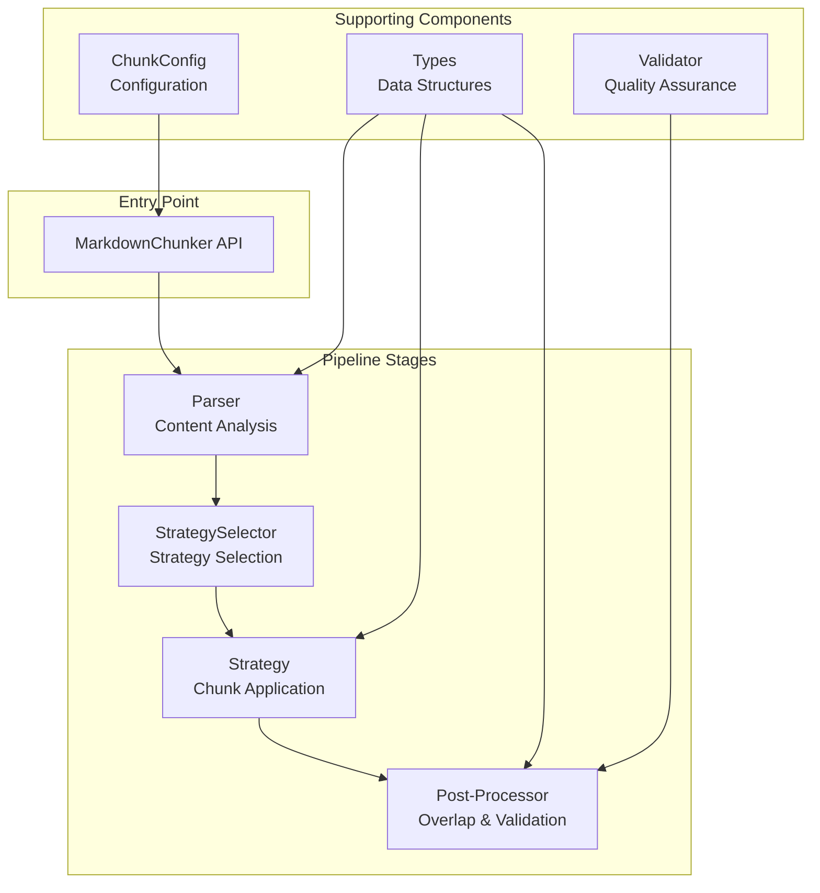
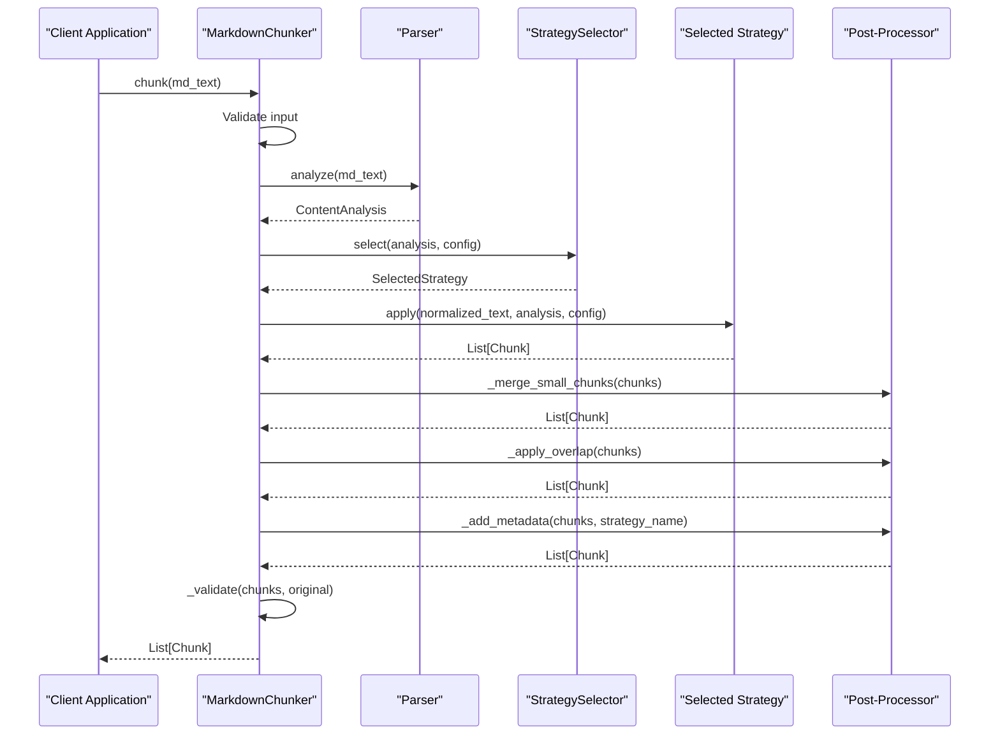
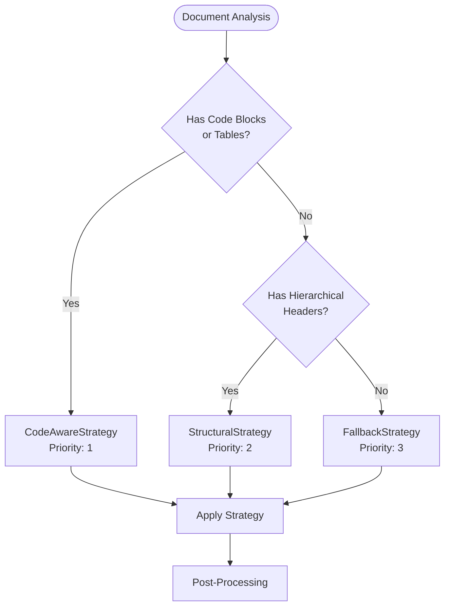
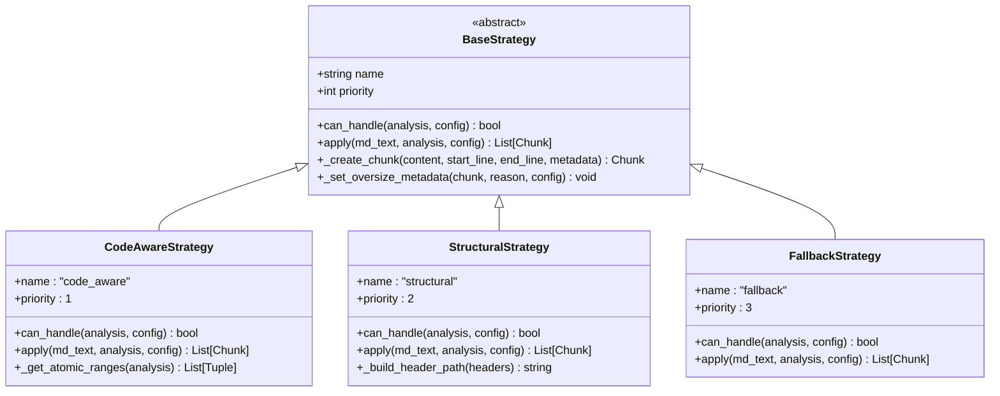
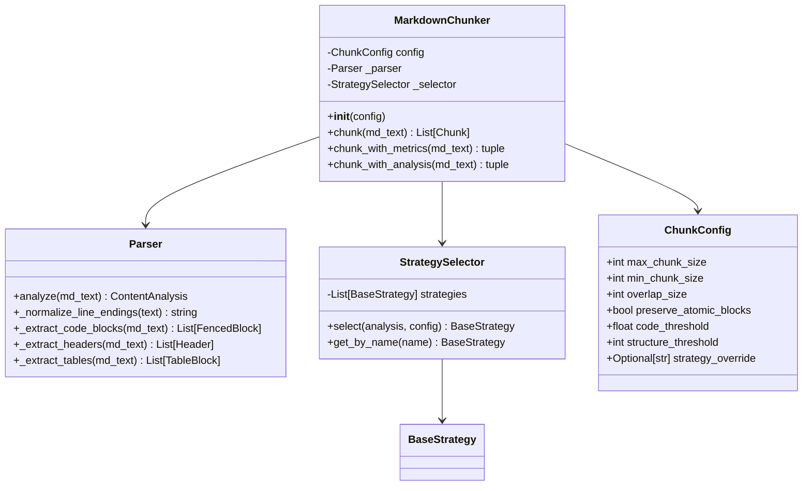
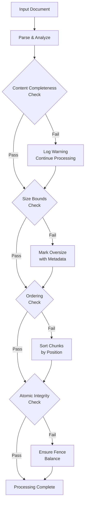
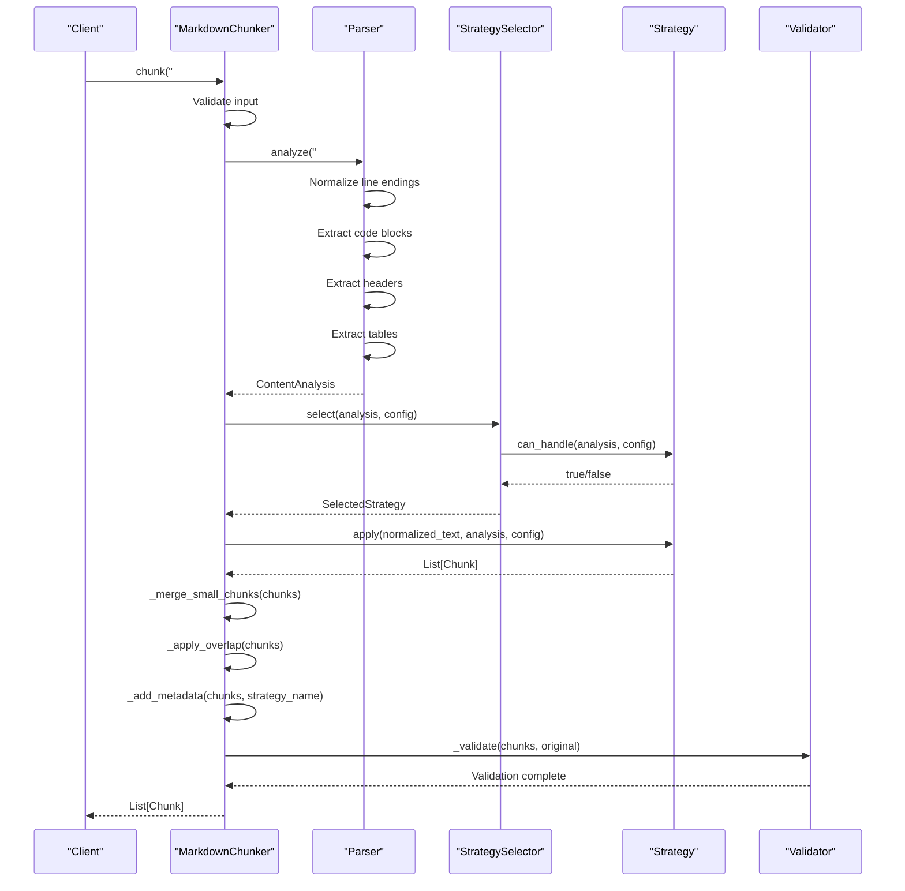
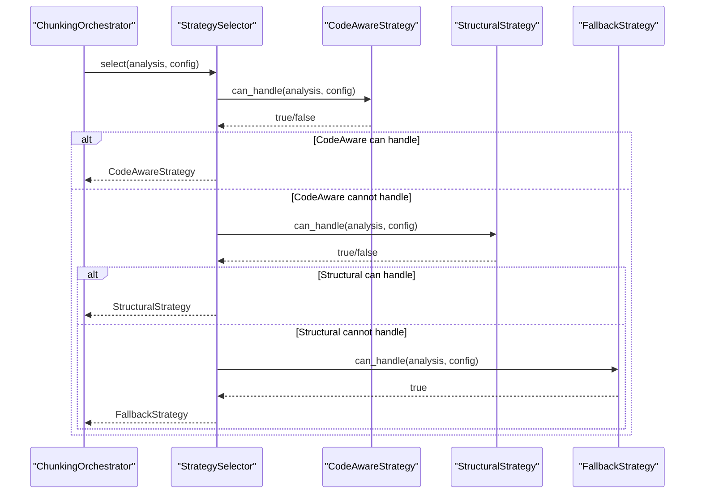
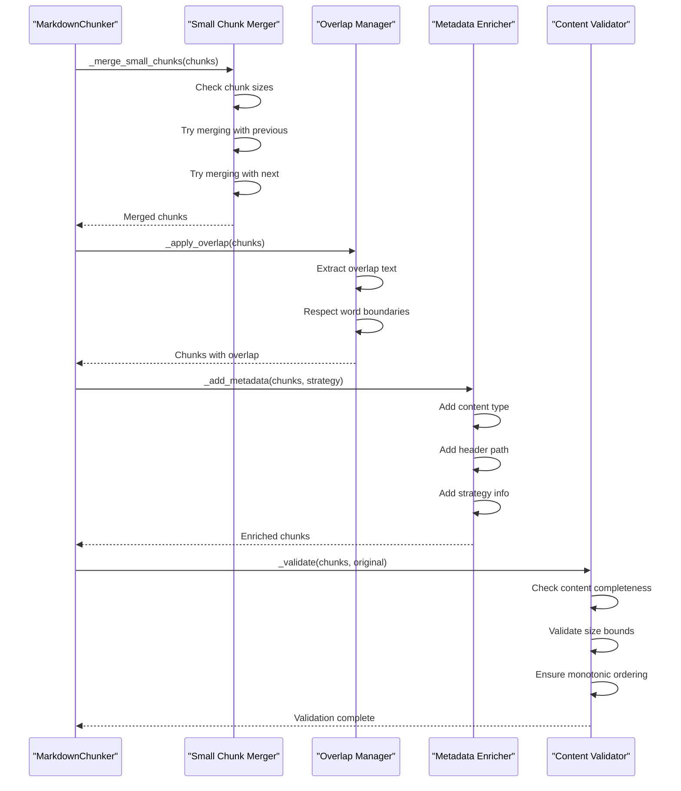

# Chunker Architecture

<cite>
**Referenced Files in This Document**
- [markdown_chunker_v2/chunker.py](file://markdown_chunker_v2/chunker.py)
- [markdown_chunker_v2/strategies/base.py](file://markdown_chunker_v2/strategies/base.py)
- [markdown_chunker_v2/strategies/__init__.py](file://markdown_chunker_v2/strategies/__init__.py)
- [markdown_chunker_v2/strategies/code_aware.py](file://markdown_chunker_v2/strategies/code_aware.py)
- [markdown_chunker_v2/strategies/structural.py](file://markdown_chunker_v2/strategies/structural.py)
- [markdown_chunker_v2/strategies/fallback.py](file://markdown_chunker_v2/strategies/fallback.py)
- [markdown_chunker_v2/config.py](file://markdown_chunker_v2/config.py)
- [markdown_chunker_v2/types.py](file://markdown_chunker_v2/types.py)
- [markdown_chunker_v2/parser.py](file://markdown_chunker_v2/parser.py)
- [markdown_chunker_legacy/chunker/orchestrator.py](file://markdown_chunker_legacy/chunker/orchestrator.py)
</cite>

## Table of Contents
1. [Introduction](#introduction)
2. [Architecture Overview](#architecture-overview)
3. [Orchestrator Pattern](#orchestrator-pattern)
4. [Pipeline Stages](#pipeline-stages)
5. [Strategy Selection and Execution](#strategy-selection-and-execution)
6. [Dependency Injection Mechanism](#dependency-injection-mechanism)
7. [Idempotence and Data Preservation](#idempotence-and-data-preservation)
8. [Sequence Diagrams](#sequence-diagrams)
9. [Component Relationships](#component-relationships)
10. [Performance Considerations](#performance-considerations)
11. [Conclusion](#conclusion)

## Introduction

The markdown chunker architecture implements a sophisticated orchestrator pattern that coordinates a pipeline of specialized components to transform markdown documents into optimally sized chunks suitable for retrieval-augmented generation (RAG) systems. The architecture emphasizes flexibility, reliability, and performance through a modular design that separates concerns across parsing, strategy selection, chunking, and post-processing phases.

The system operates on the principle that different types of markdown documents require different chunking strategies to maintain semantic integrity and contextual coherence. By intelligently selecting and applying appropriate strategies based on document characteristics, the chunker ensures that atomic blocks like code, tables, and hierarchical sections remain intact while producing chunks that meet size and overlap requirements.

## Architecture Overview

The chunker architecture follows a layered approach with clear separation of responsibilities:

**Diagram sources**
- [markdown_chunker_v2/chunker.py](file://markdown_chunker_v2/chunker.py#L21-L90)
- [markdown_chunker_v2/parser.py](file://markdown_chunker_v2/parser.py#L14-L50)
- [markdown_chunker_v2/strategies/__init__.py](file://markdown_chunker_v2/strategies/__init__.py#L20-L58)

The architecture consists of four primary layers:

1. **Entry Layer**: The main `MarkdownChunker` API that provides simplified interfaces for chunking operations
2. **Pipeline Layer**: Sequential processing stages that transform raw markdown through analysis, selection, and application
3. **Strategy Layer**: Specialized algorithms that handle different document types and structures
4. **Support Layer**: Configuration management, type definitions, and validation components

**Section sources**
- [markdown_chunker_v2/chunker.py](file://markdown_chunker_v2/chunker.py#L21-L357)
- [markdown_chunker_v2/config.py](file://markdown_chunker_v2/config.py#L12-L170)

## Orchestrator Pattern

The orchestrator pattern is central to the chunker's architecture, implemented primarily through the `MarkdownChunker` class. This pattern coordinates the interaction between multiple specialized components while maintaining loose coupling and high cohesion.

### ChunkingOrchestrator Role

The `MarkdownChunker` serves as the primary orchestrator, managing the entire chunking pipeline from input validation through output generation. It maintains state throughout the process and ensures that each pipeline stage receives the appropriate inputs and produces the expected outputs.

Key responsibilities of the orchestrator include:

- **Pipeline Coordination**: Managing the sequence of parsing, strategy selection, chunking, and post-processing
- **State Management**: Maintaining configuration and intermediate results across pipeline stages
- **Error Handling**: Providing fallback mechanisms and graceful degradation
- **Component Composition**: Integrating parser, strategy selector, and post-processing components

### Orchestration Workflow

The orchestrator follows a linear pipeline approach with the following stages:

**Diagram sources**
- [markdown_chunker_v2/chunker.py](file://markdown_chunker_v2/chunker.py#L43-L90)
- [markdown_chunker_v2/parser.py](file://markdown_chunker_v2/parser.py#L38-L68)
- [markdown_chunker_v2/strategies/__init__.py](file://markdown_chunker_v2/strategies/__init__.py#L37-L57)

**Section sources**
- [markdown_chunker_v2/chunker.py](file://markdown_chunker_v2/chunker.py#L21-L357)

## Pipeline Stages

The chunking pipeline consists of seven distinct stages, each with specific responsibilities and quality gates:

### Stage 1: Input Validation

The pipeline begins with input validation to ensure the markdown text is suitable for processing. This stage performs:

- **Empty Content Check**: Returns empty result for null or whitespace-only input
- **Format Normalization**: Converts line endings to Unix-style (LF) for consistent processing
- **Character Encoding**: Ensures proper UTF-8 encoding handling

### Stage 2: Configuration Application

Configuration parameters are applied to customize chunking behavior:

- **Size Constraints**: Enforcing `max_chunk_size` and `min_chunk_size` limits
- **Overlap Settings**: Configuring `overlap_size` for contextual continuity
- **Behavior Flags**: Enabling/disabling specific processing features

### Stage 3: Strategy Selection

The strategy selection phase determines the most appropriate chunking approach based on document characteristics:

**Diagram sources**
- [markdown_chunker_v2/strategies/__init__.py](file://markdown_chunker_v2/strategies/__init__.py#L20-L58)
- [markdown_chunker_v2/strategies/code_aware.py](file://markdown_chunker_v2/strategies/code_aware.py#L33-L41)
- [markdown_chunker_v2/strategies/structural.py](file://markdown_chunker_v2/strategies/structural.py#L32-L39)

### Stage 4: Strategy Execution

Each strategy implements specialized logic for its target document type:

- **CodeAwareStrategy**: Preserves atomic blocks (code, tables) while splitting surrounding text
- **StructuralStrategy**: Maintains header hierarchy and processes sections
- **FallbackStrategy**: Universal approach using paragraph-based splitting

### Stage 5: Overlap Management

Overlap management creates contextual continuity between adjacent chunks:

- **Previous Content**: Adds last N characters from previous chunk
- **Next Content**: Adds first N characters from next chunk  
- **Word Boundary Respect**: Ensures overlap occurs at natural boundaries
- **Size Calculation**: Tracks overlap size for validation

### Stage 6: Metadata Enrichment

Metadata enrichment adds contextual information to each chunk:

- **Content Type Detection**: Identifies text, code, table, or mixed content
- **Header Path Tracking**: Maintains hierarchical navigation information
- **Strategy Attribution**: Records which strategy produced each chunk
- **Size Classification**: Flags oversized chunks with reasons

### Stage 7: Output Validation

Final validation ensures chunking quality and compliance:

- **Content Completeness**: Verifies no content loss (within tolerance)
- **Size Bounds**: Validates chunks against configured limits
- **Monotonic Ordering**: Ensures chunks appear in document order
- **Atomic Integrity**: Maintains code fence balance and table structure

**Section sources**
- [markdown_chunker_v2/chunker.py](file://markdown_chunker_v2/chunker.py#L43-L90)
- [markdown_chunker_v2/chunker.py](file://markdown_chunker_v2/chunker.py#L130-L245)

## Strategy Selection and Execution

The strategy selection mechanism implements a priority-based approach that automatically chooses the most appropriate chunking strategy for each document type.

### Strategy Hierarchy

The system employs three strategies with predefined priorities:

| Strategy | Priority | Use Case | Key Features |
|----------|----------|----------|--------------|
| CodeAwareStrategy | 1 (Highest) | Documents with code blocks or tables | Atomic block preservation, intelligent splitting |
| StructuralStrategy | 2 | Documents with hierarchical headers | Header path maintenance, section-based processing |
| FallbackStrategy | 3 (Lowest) | Universal fallback | Paragraph-based splitting, guaranteed success |

### Strategy Selection Criteria

Each strategy defines specific criteria for document eligibility:

**Diagram sources**
- [markdown_chunker_v2/strategies/base.py](file://markdown_chunker_v2/strategies/base.py#L12-L67)
- [markdown_chunker_v2/strategies/code_aware.py](file://markdown_chunker_v2/strategies/code_aware.py#L15-L41)
- [markdown_chunker_v2/strategies/structural.py](file://markdown_chunker_v2/strategies/structural.py#L15-L39)
- [markdown_chunker_v2/strategies/fallback.py](file://markdown_chunker_v2/strategies/fallback.py#L15-L35)

### Strategy Implementation Details

#### CodeAwareStrategy
Focuses on documents containing code blocks or tables, preserving atomic integrity:

- **Atomic Block Identification**: Locates fenced code blocks and table boundaries
- **Intelligent Splitting**: Splits text around atomic blocks while maintaining context
- **Oversize Handling**: Marks oversized chunks with appropriate metadata
- **Fence Balance**: Ensures code fence integrity across chunk boundaries

#### StructuralStrategy  
Targets documents with hierarchical structure using header information:

- **Header Path Building**: Constructs hierarchical navigation paths
- **Section Processing**: Processes document sections based on header hierarchy
- **Preamble Handling**: Separates introductory content from structured sections
- **Level Maintenance**: Preserves header hierarchy across chunk boundaries

#### FallbackStrategy
Provides universal coverage with paragraph-based splitting:

- **Paragraph Detection**: Identifies natural document boundaries
- **Grouping Logic**: Combines paragraphs to maximize chunk utilization
- **Size Compliance**: Ensures chunks fit within configured limits
- **Guaranteed Success**: Always produces results regardless of document type

**Section sources**
- [markdown_chunker_v2/strategies/base.py](file://markdown_chunker_v2/strategies/base.py#L12-L233)
- [markdown_chunker_v2/strategies/code_aware.py](file://markdown_chunker_v2/strategies/code_aware.py#L15-L149)
- [markdown_chunker_v2/strategies/structural.py](file://markdown_chunker_v2/strategies/structural.py#L15-L151)
- [markdown_chunker_v2/strategies/fallback.py](file://markdown_chunker_v2/strategies/fallback.py#L15-L96)

## Dependency Injection Mechanism

The chunker architecture implements a flexible dependency injection system that enables component composition and testing isolation.

### Component Initialization

Components are initialized through constructor injection with minimal coupling:

**Diagram sources**
- [markdown_chunker_v2/chunker.py](file://markdown_chunker_v2/chunker.py#L32-L41)
- [markdown_chunker_v2/parser.py](file://markdown_chunker_v2/parser.py#L14-L26)
- [markdown_chunker_v2/strategies/__init__.py](file://markdown_chunker_v2/strategies/__init__.py#L30-L35)
- [markdown_chunker_v2/config.py](file://markdown_chunker_v2/config.py#L12-L46)

### Configuration Flexibility

The configuration system supports multiple approaches:

- **Default Configuration**: Predefined sensible defaults for common use cases
- **Custom Configuration**: User-defined parameters for specific requirements
- **Profile-Based Configuration**: Optimized configurations for specific document types
- **Legacy Migration**: Automatic conversion from legacy configuration parameters

### Testing and Mocking Support

The dependency injection design facilitates comprehensive testing:

- **Mock Components**: Easy substitution of components for unit testing
- **Isolated Testing**: Individual component testing without full pipeline
- **Integration Testing**: End-to-end testing with realistic components
- **Behavior Verification**: Testing component interactions and state changes

**Section sources**
- [markdown_chunker_v2/chunker.py](file://markdown_chunker_v2/chunker.py#L32-L41)
- [markdown_chunker_v2/config.py](file://markdown_chunker_v2/config.py#L12-L170)

## Idempotence and Data Preservation

The chunker architecture enforces strict guarantees around idempotence and data preservation to ensure reliable and predictable behavior.

### Idempotence Properties

The system maintains idempotence through several mechanisms:

- **Deterministic Processing**: Same input always produces identical output
- **Stateless Operations**: Processing stages don't depend on external state
- **Reversible Transformations**: Operations can be undone without data loss
- **Consistent Ordering**: Chunks always appear in document order

### Data Preservation Guarantees

Several properties ensure data integrity:

#### PROP-1: Content Completeness
The system guarantees that no content is lost during chunking, with configurable tolerance for overlap and normalization effects.

#### PROP-2: Size Bounds
All chunks conform to configured size constraints, with special handling for oversized content that requires atomic block preservation.

#### PROP-3: Monotonic Ordering
Chunks maintain document order, ensuring that subsequent chunks appear after preceding ones.

#### PROP-4: Atomic Integrity
Code blocks and tables remain intact across chunk boundaries, preventing corruption of executable code or tabular data.

#### PROP-5: Metadata Consistency
Chunk metadata accurately reflects the source content and processing history.

### Validation Mechanisms

The system implements comprehensive validation:

**Diagram sources**
- [markdown_chunker_v2/chunker.py](file://markdown_chunker_v2/chunker.py#L206-L244)

**Section sources**
- [markdown_chunker_v2/chunker.py](file://markdown_chunker_v2/chunker.py#L206-L244)

## Sequence Diagrams

### Basic Chunking Operation

**Diagram sources**
- [markdown_chunker_v2/chunker.py](file://markdown_chunker_v2/chunker.py#L43-L90)
- [markdown_chunker_v2/parser.py](file://markdown_chunker_v2/parser.py#L38-L68)
- [markdown_chunker_v2/strategies/__init__.py](file://markdown_chunker_v2/strategies/__init__.py#L37-L57)

### Strategy Selection Process

**Diagram sources**
- [markdown_chunker_legacy/chunker/orchestrator.py](file://markdown_chunker_legacy/chunker/orchestrator.py#L240-L389)
- [markdown_chunker_v2/strategies/__init__.py](file://markdown_chunker_v2/strategies/__init__.py#L37-L57)

### Post-Processing Pipeline

**Diagram sources**
- [markdown_chunker_v2/chunker.py](file://markdown_chunker_v2/chunker.py#L246-L357)

## Component Relationships

The chunker architecture establishes clear relationships between components through well-defined interfaces and dependency patterns.

### Interface Contracts

Each component adheres to specific interface contracts:

- **Parser Interface**: Defines content analysis and element extraction methods
- **Strategy Interface**: Specifies strategy selection and chunking behavior
- **Configuration Interface**: Establishes parameter validation and default values
- **Type Interface**: Defines data structures and serialization methods

### Component Coupling

The architecture minimizes coupling through:

- **Loose Coupling**: Components interact through well-defined interfaces
- **High Cohesion**: Each component focuses on a single responsibility
- **Dependency Inversion**: High-level modules don't depend on low-level modules
- **Interface Segregation**: Clients depend only on interfaces they use

### Data Flow Patterns

Data flows through the system in a predictable manner:

1. **Input Flow**: Raw markdown text enters the system
2. **Analysis Flow**: Content is analyzed and transformed into structured data
3. **Selection Flow**: Strategies are evaluated and selected
4. **Processing Flow**: Chunks are generated and enriched
5. **Output Flow**: Final chunks are validated and returned

**Section sources**
- [markdown_chunker_v2/chunker.py](file://markdown_chunker_v2/chunker.py#L21-L357)
- [markdown_chunker_v2/strategies/base.py](file://markdown_chunker_v2/strategies/base.py#L12-L67)
- [markdown_chunker_v2/parser.py](file://markdown_chunker_v2/parser.py#L14-L282)

## Performance Considerations

The chunker architecture incorporates several performance optimization strategies:

### Parsing Efficiency
- **Single-Pass Analysis**: Content analysis performed once per document
- **Incremental Processing**: Components process data incrementally
- **Memory Optimization**: Minimal memory footprint through streaming processing

### Strategy Selection Optimization
- **Early Termination**: Strategy selection stops at first matching strategy
- **Cached Analysis**: Analysis results reused across strategy evaluation
- **Priority-Based Selection**: Highest-priority strategies evaluated first

### Chunk Generation Optimization
- **Batch Processing**: Multiple chunks processed together when possible
- **Lazy Evaluation**: Expensive operations deferred until necessary
- **Resource Pooling**: Reuse of expensive resources across operations

### Memory Management
- **Garbage Collection**: Efficient cleanup of temporary objects
- **Streaming Processing**: Minimal memory usage for large documents
- **Object Reuse**: Reuse of objects where safe and beneficial

## Conclusion

The markdown chunker architecture successfully implements a sophisticated orchestrator pattern that coordinates multiple specialized components to produce high-quality, semantically meaningful chunks from markdown documents. Through careful separation of concerns, flexible dependency injection, and robust validation mechanisms, the system achieves both reliability and performance.

The architecture's emphasis on idempotence and data preservation ensures predictable behavior across different document types and processing scenarios. The strategy-based approach allows for extensible processing logic while maintaining clean interfaces and clear responsibilities.

Key strengths of the architecture include:

- **Modularity**: Clear separation of parsing, strategy selection, and processing
- **Flexibility**: Extensible strategy system with dependency injection
- **Reliability**: Comprehensive validation and error handling
- **Performance**: Optimized processing with minimal memory overhead
- **Maintainability**: Clean interfaces and well-defined contracts

The system provides a solid foundation for RAG applications while remaining adaptable to future enhancements and requirements. Its design principles of loose coupling, high cohesion, and clear interfaces ensure that the architecture can evolve while maintaining backward compatibility and system stability.