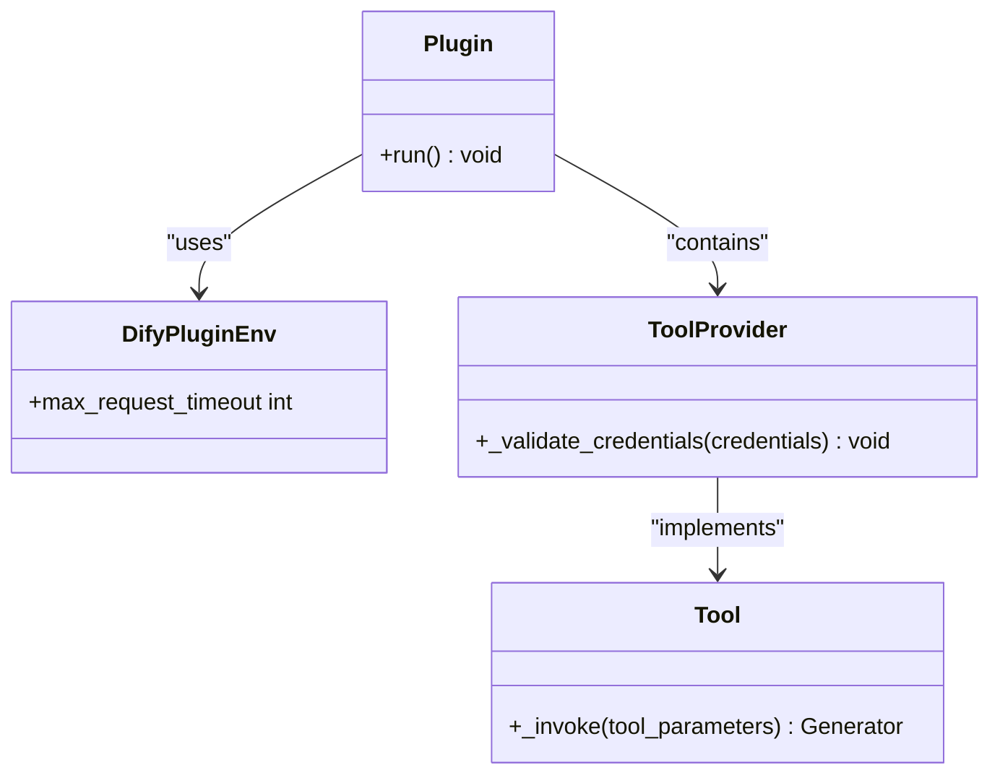
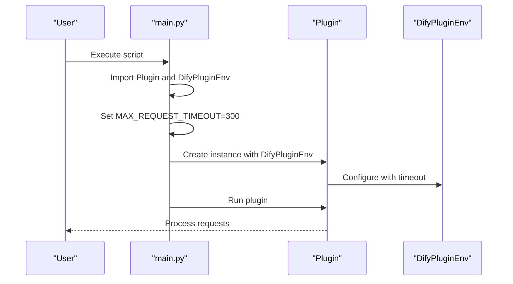
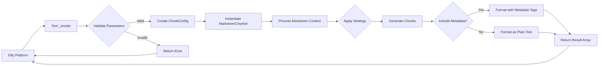
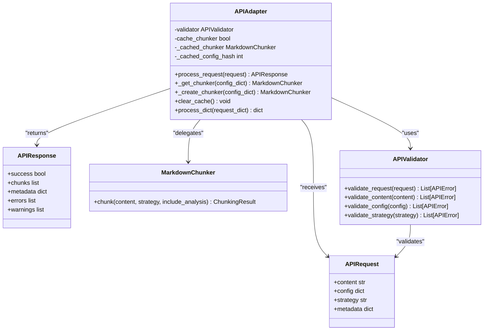
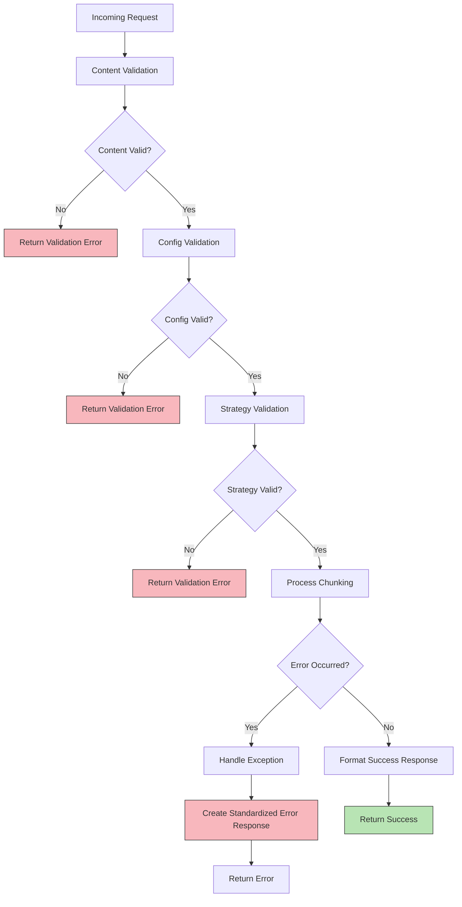
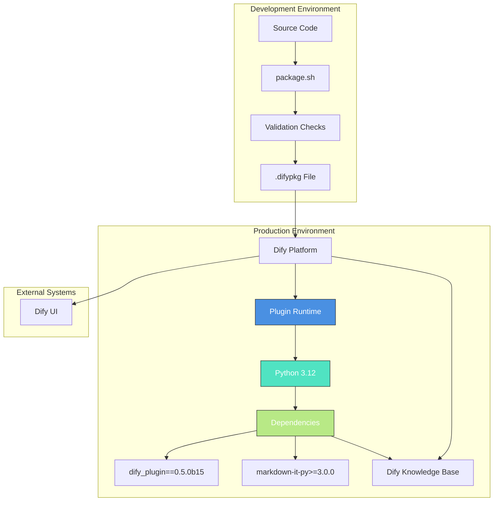
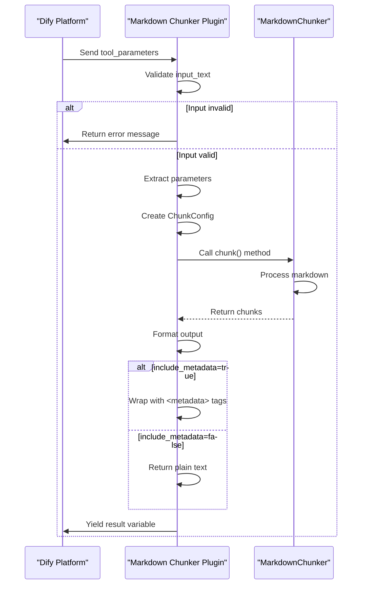
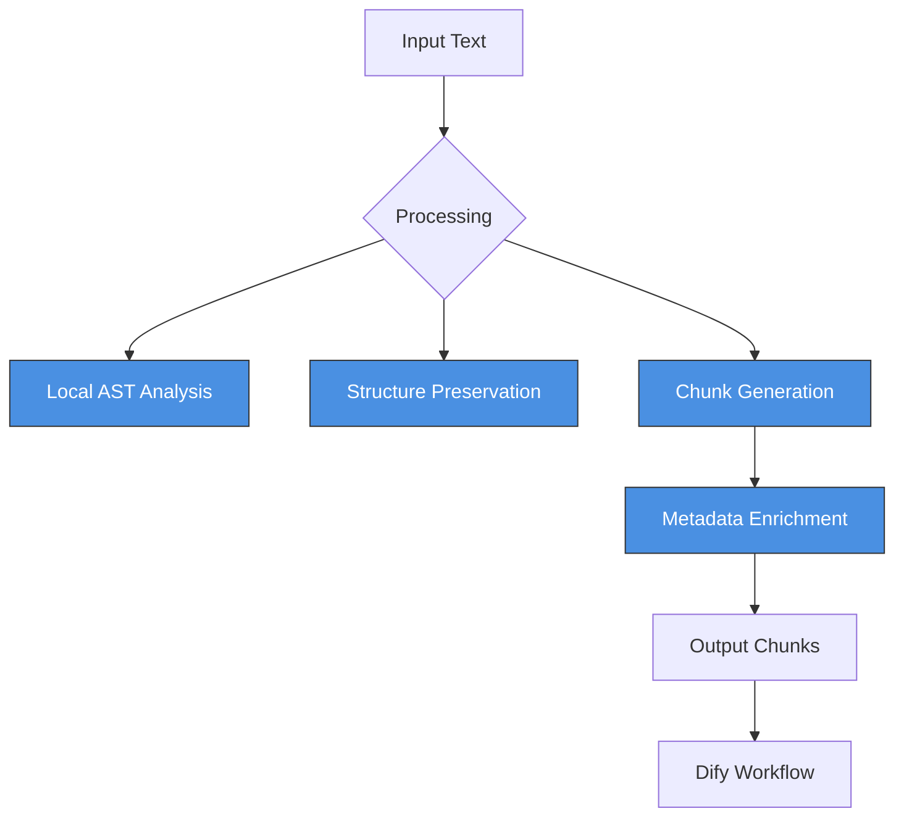

# Dify Integration Architecture

<cite>
**Referenced Files in This Document**   
- [main.py](file://main.py)
- [provider/markdown_chunker.py](file://provider/markdown_chunker.py)
- [manifest.yaml](file://manifest.yaml)
- [tools/markdown_chunk_tool.yaml](file://tools/markdown_chunk_tool.yaml)
- [tools/markdown_chunk_tool.py](file://tools/markdown_chunk_tool.py)
- [PRIVACY.md](file://PRIVACY.md)
</cite>

## Update Summary
**Changes Made**   
- Added privacy and data processing information from PRIVACY.md to reflect local-only processing and no data transmission
- Updated manifest.yaml references to include the privacy field pointing to PRIVACY.md
- Enhanced security considerations section with privacy policy details
- Added new section on privacy and data handling

## Table of Contents
1. [Introduction](#introduction)
2. [Plugin Architecture](#plugin-architecture)
3. [Entry Point Implementation](#entry-point-implementation)
4. [Configuration Mechanism](#configuration-mechanism)
5. [Tool Definition](#tool-definition)
6. [Data Flow Analysis](#data-flow-analysis)
7. [Adapter Pattern Implementation](#adapter-pattern-implementation)
8. [Security Considerations](#security-considerations)
9. [Deployment Topology](#deployment-topology)
10. [Communication Patterns](#communication-patterns)
11. [Privacy and Data Handling](#privacy-and-data-handling)

## Introduction
The Dify integration architecture enables seamless integration of the Advanced Markdown Chunker with the Dify platform. This documentation details the plugin architecture that facilitates intelligent, structure-aware chunking of Markdown documents for enhanced RAG (Retrieval-Augmented Generation) performance. The integration leverages the Dify plugin framework to expose the markdown_chunker library as a tool within Dify's Knowledge Base processing pipelines. The architecture incorporates an adapter pattern to translate between Dify's data format and the internal chunking API, ensuring compatibility and optimal performance. Security considerations are addressed through comprehensive input validation and error handling mechanisms.

## Plugin Architecture
The Dify plugin architecture is implemented through the DifyPlugin interface, which defines the contract for plugin functionality within the Dify ecosystem. The plugin architecture follows a modular design with clear separation of concerns between the entry point, provider implementation, tool definition, and configuration management. The core components work together to provide a robust integration that can handle various chunking strategies and configurations.



**Section sources**
- [main.py](file://main.py#L1-L31)
- [provider/markdown_chunker.py](file://provider/markdown_chunker.py#L1-L36)
- [tools/markdown_chunk_tool.py](file://tools/markdown_chunk_tool.py#L1-L157)

## Entry Point Implementation
The entry point implementation in main.py serves as the bootstrap for the Dify plugin, configuring the plugin environment and initiating execution. The entry point imports the necessary Dify plugin components and configures a 300-second timeout to accommodate processing of large documents. The plugin instance is created with the configured environment and executed when the script is run directly. This implementation supports both debug mode (connecting to a remote Dify instance via .env configuration) and production mode (running as a packaged plugin within Dify).



**Section sources**
- [main.py](file://main.py#L1-L31)

## Configuration Mechanism
The configuration mechanism is implemented through the manifest.yaml file, which defines the plugin's metadata, resource requirements, and integration points with the Dify platform. The manifest specifies the plugin version, author, name, and multi-language labels for internationalization. It defines the memory requirement (512MB) and specifies the Python runtime (version 3.12) with main.py as the entrypoint. The manifest also declares compatibility with Dify version 1.9.0 or later and includes tags for categorization within the Dify marketplace. The privacy field references PRIVACY.md, indicating compliance with Dify's marketplace requirements for data handling transparency.

```mermaid
flowchart TD
A[manifest.yaml] --> B[Plugin Metadata]
A --> C[Resource Configuration]
A --> D[Runtime Configuration]
A --> E[Tool Integration]
A --> F[Privacy Policy]
B --> F[version: 2.1.0]
B --> G[type: plugin]
B --> H[author: asukhodko]
B --> I[name: markdown_chunker]
B --> J[label: multilingual]
B --> K[description: multilingual]
B --> L[icon: icon.svg]
C --> M[resource: memory: 536870912]
D --> N[meta: arch: amd64, arm64]
D --> O[meta: runner: python, version: "3.12"]
D --> P[meta: entrypoint: main]
E --> Q[plugins: tools: provider/markdown_chunker.yaml]
F --> R[privacy: PRIVACY.md]
F --> Z[Plugin Registration]
M --> Z
O --> Z
Q --> Z
R --> Z
```

**Section sources**
- [manifest.yaml](file://manifest.yaml#L1-L49)

## Tool Definition
The tool definition in markdown_chunk_tool.yaml specifies the interface for the Markdown Chunker tool, including its parameters, input validation, and output schema. The tool accepts input text, maximum chunk size, chunk overlap, chunking strategy, and metadata inclusion as configurable parameters. Each parameter includes multi-language labels and descriptions for user guidance. The output schema references Dify's general structure JSON schema, ensuring compatibility with Dify's data processing pipeline. The tool implementation is specified in the extra.python.source field, pointing to the Python implementation file.

```mermaid
erDiagram
TOOL ||--o{ PARAMETERS : contains
TOOL ||--o{ OUTPUT_SCHEMA : defines
TOOL ||--o{ EXTRA : extends
TOOL {
string name "markdown_chunk_tool"
string author "asukhodko"
string icon "icon.svg"
}
PARAMETERS {
string name
string type
boolean required
any default
string form
string label
string human_description
string llm_description
}
OUTPUT_SCHEMA {
string type "object"
string $ref "https://dify.ai/schemas/v1/general_structure.json"
}
EXTRA {
string source "tools/markdown_chunk_tool.py"
}
PARAMETERS }|--|| STRATEGY_OPTIONS : includes
STRATEGY_OPTIONS {
string value
string label
}
```

**Section sources**
- [tools/markdown_chunk_tool.yaml](file://tools/markdown_chunk_tool.yaml#L1-L128)

## Data Flow Analysis
The data flow from Dify's API requests through the chunking pipeline involves multiple stages of processing, transformation, and validation. When a request is received from Dify, it enters the plugin through the Tool._invoke method, where parameters are extracted and validated. The input text is processed by the MarkdownChunker with the specified configuration, generating chunks with metadata. The chunks are then formatted according to Dify's expectations, with metadata included or excluded based on the include_metadata parameter. The final result is returned as a list of strings in the result variable, which Dify can process in its Knowledge Base pipeline.



**Section sources**
- [tools/markdown_chunk_tool.py](file://tools/markdown_chunk_tool.py#L1-L157)

## Adapter Pattern Implementation
The adapter pattern is implemented in the API adapter components to translate between Dify's data format and the internal chunking API. The APIAdapter class serves as the bridge between the external Dify interface and the internal MarkdownChunker implementation. It handles request validation, chunker instantiation with caching, and response formatting. The adapter processes API requests by validating input, creating or retrieving a cached chunker instance, executing the chunking operation, and transforming the results into the expected API response format. This pattern enables loose coupling between the Dify integration layer and the core chunking functionality, allowing for independent evolution of each component.



**Section sources**
- [markdown_chunker_legacy/api/adapter.py](file://markdown_chunker_legacy/api/adapter.py#L1-L169)

## Security Considerations
Security considerations in the integration are addressed through comprehensive input validation and error handling mechanisms. The APIValidator class performs thorough validation of all input parameters, including content size limits (10MB maximum), type checking, and range validation for numerical parameters. The validation process checks for required fields, proper data types, and acceptable value ranges, returning detailed error messages for invalid inputs. The APIErrorHandler class provides centralized error handling, converting exceptions into standardized API responses with appropriate error codes and messages while optionally including tracebacks for debugging. Input validation includes checks for UTF-8 encoding compliance and protection against excessively large inputs that could impact system performance.



**Section sources**
- [markdown_chunker_legacy/api/validator.py](file://markdown_chunker_legacy/api/validator.py#L1-L321)
- [markdown_chunker_legacy/api/error_handler.py](file://markdown_chunker_legacy/api/error_handler.py#L1-L235)

## Deployment Topology
The deployment topology for the Dify plugin follows a containerized microservices architecture, where the plugin operates as an isolated component within the Dify ecosystem. The plugin is packaged as a .difypkg file containing all necessary code, configuration, and dependencies. During deployment, the plugin is loaded into the Dify runtime environment, where it registers itself as a tool provider. The plugin communicates with the Dify platform through the defined API interface, processing requests and returning results. The topology supports both development and production environments, with the package.sh script ensuring proper validation before packaging.



**Section sources**
- [package.sh](file://package.sh#L1-L71)
- [requirements.txt](file://requirements.txt#L1-L21)

## Communication Patterns
The communication patterns between the Dify plugin and the Dify platform follow a request-response model with asynchronous processing capabilities. The plugin exposes a synchronous API through the Tool._invoke method, which processes requests and yields ToolInvokeMessage objects. The communication flow begins with Dify sending a tool_parameters dictionary containing the input text and configuration options. The plugin processes this request, performs validation, executes the chunking operation, and returns a response containing the chunked results. Error conditions are communicated through text messages with descriptive error information. The communication pattern supports both metadata-rich output (with metadata tags) and plain text output, depending on the include_metadata parameter.



**Section sources**
- [tools/markdown_chunk_tool.py](file://tools/markdown_chunk_tool.py#L1-L157)

## Privacy and Data Handling
The Advanced Markdown Chunker plugin adheres to strict privacy principles by processing all data locally within the Dify environment without any external data transmission. This section details the privacy policy and data handling practices that ensure user data remains secure and private.

### Privacy Policy Overview
The plugin operates entirely within the user's Dify instance and processes data locally. No user information, identifiers, or personal details are collected, stored, or transmitted at any point. The privacy policy explicitly states that the plugin does not collect personal data, transmit content to external services, or store data beyond the immediate processing session.



### Data Processing Principles
The plugin follows these core data processing principles:
- **Local Processing**: All Markdown text is processed locally within the Dify runtime environment
- **No Data Storage**: Input text exists only during processing and is not stored beyond the session
- **No External Transmission**: No data is sent to external APIs, services, or third parties
- **No Logging**: User content is not logged or recorded by the plugin
- **No Analytics**: No telemetry or usage data is collected

### Third-Party Services
The plugin does not integrate with or transmit data to any external services, APIs, or platforms. All processing is performed locally using built-in Python libraries. The only dependencies are open-source libraries for local processing:
- `markdown-it-py` — Markdown parsing (local processing only)
- `pydantic` — Data validation (local processing only)

These libraries do not collect or transmit any data.

### Data Security
Since all processing occurs locally within the Dify environment:
- Data security is managed by the Dify platform
- No additional network exposure is introduced by the plugin
- No credentials or API keys are required or stored

### Privacy Compliance
The manifest.yaml file includes a reference to PRIVACY.md in the privacy field, ensuring compliance with Dify marketplace requirements. This transparent declaration of data handling practices allows users to understand exactly how their data is processed and protected.

| Category | Status |
|----------|--------|
| Personal data collection | ❌ None |
| Content transmission | ❌ None |
| External API calls | ❌ None |
| Data storage | ❌ None (beyond Dify's standard handling) |
| Third-party sharing | ❌ None |
| Analytics/Telemetry | ❌ None |

**Section sources**
- [PRIVACY.md](file://PRIVACY.md)
- [manifest.yaml](file://manifest.yaml#L17)