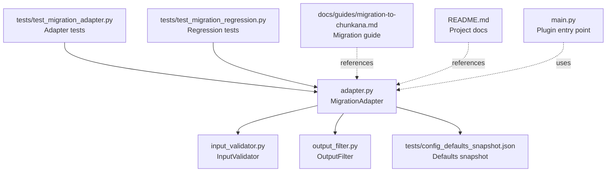
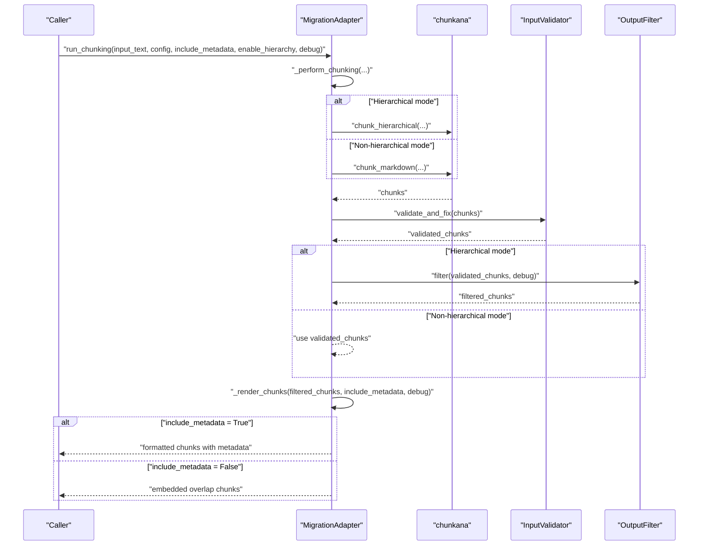
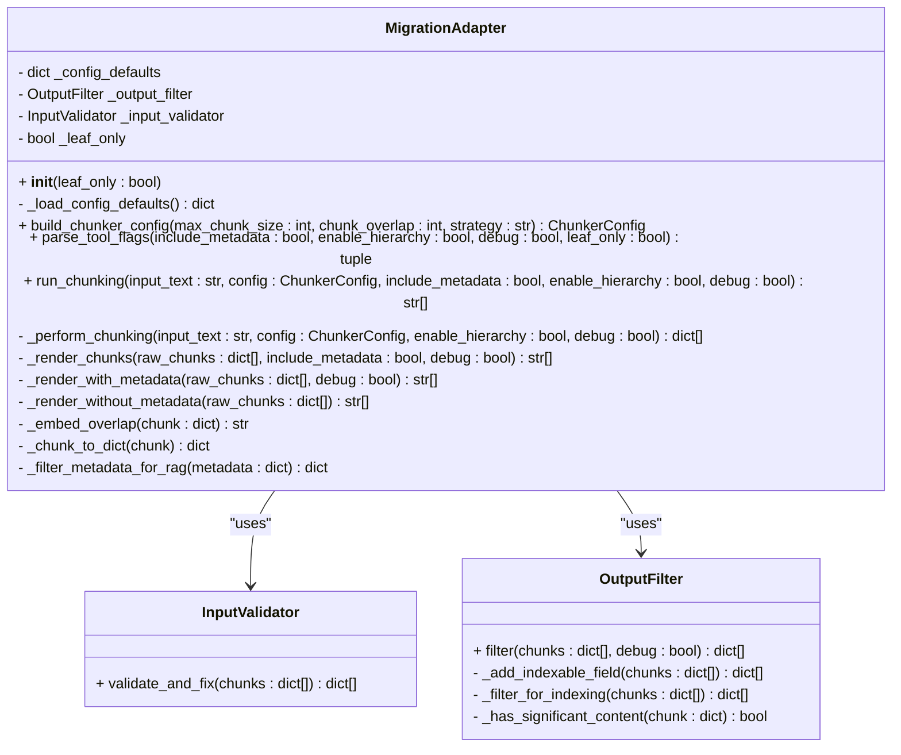
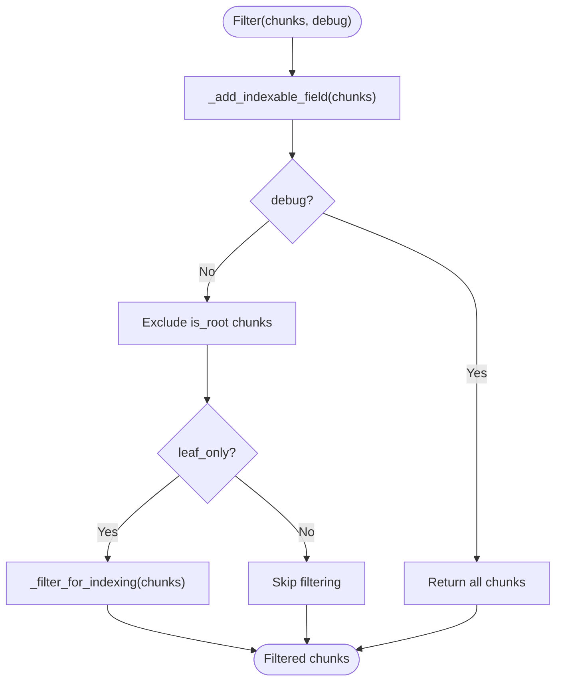
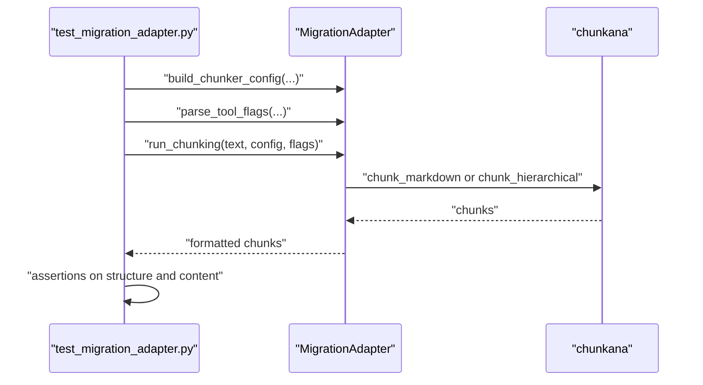
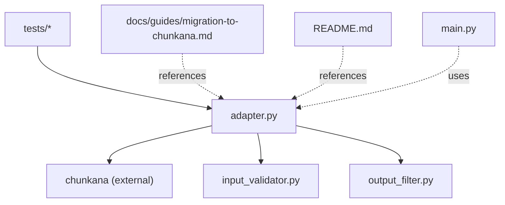

# Migration Adapter

<cite>
**Referenced Files in This Document**
- [adapter.py](file://adapter.py)
- [input_validator.py](file://input_validator.py)
- [output_filter.py](file://output_filter.py)
- [tests/config_defaults_snapshot.json](file://tests/config_defaults_snapshot.json)
- [tests/test_migration_adapter.py](file://tests/test_migration_adapter.py)
- [tests/test_migration_regression.py](file://tests/test_migration_regression.py)
- [docs/guides/migration-to-chunkana.md](file://docs/guides/migration-to-chunkana.md)
- [README.md](file://README.md)
- [main.py](file://main.py)
</cite>

## Table of Contents
1. [Introduction](#introduction)
2. [Project Structure](#project-structure)
3. [Core Components](#core-components)
4. [Architecture Overview](#architecture-overview)
5. [Detailed Component Analysis](#detailed-component-analysis)
6. [Dependency Analysis](#dependency-analysis)
7. [Performance Considerations](#performance-considerations)
8. [Troubleshooting Guide](#troubleshooting-guide)
9. [Conclusion](#conclusion)

## Introduction
This document explains the Migration Adapter that powers the Advanced Markdown Chunker plugin’s transition to the chunkana engine while preserving full backward compatibility. The adapter provides a compatibility layer between the plugin’s tool interface and the chunkana library, ensuring exact behavioral compatibility, robust input validation, configurable output filtering, and consistent chunk boundaries regardless of output format.

## Project Structure
The migration adapter lives alongside supporting modules that handle input validation and output filtering. It integrates with the plugin entry point and is validated by dedicated tests and regression checks.

**Diagram sources**
- [adapter.py](file://adapter.py#L1-L352)
- [input_validator.py](file://input_validator.py#L1-L46)
- [output_filter.py](file://output_filter.py#L1-L116)
- [tests/config_defaults_snapshot.json](file://tests/config_defaults_snapshot.json#L1-L22)
- [tests/test_migration_adapter.py](file://tests/test_migration_adapter.py#L1-L189)
- [tests/test_migration_regression.py](file://tests/test_migration_regression.py#L73-L111)
- [docs/guides/migration-to-chunkana.md](file://docs/guides/migration-to-chunkana.md#L1-L200)
- [README.md](file://README.md#L1380-L1469)
- [main.py](file://main.py#L1-L38)

**Section sources**
- [adapter.py](file://adapter.py#L1-L352)
- [input_validator.py](file://input_validator.py#L1-L46)
- [output_filter.py](file://output_filter.py#L1-L116)
- [tests/config_defaults_snapshot.json](file://tests/config_defaults_snapshot.json#L1-L22)
- [tests/test_migration_adapter.py](file://tests/test_migration_adapter.py#L1-L189)
- [tests/test_migration_regression.py](file://tests/test_migration_regression.py#L73-L111)
- [docs/guides/migration-to-chunkana.md](file://docs/guides/migration-to-chunkana.md#L1-L200)
- [README.md](file://README.md#L1380-L1469)
- [main.py](file://main.py#L1-L38)

## Core Components
- MigrationAdapter: Orchestrates two-stage processing—chunking (boundary-invariant) and rendering (format-dependent). It maps tool parameters to chunkana configuration, validates and fixes output, applies output filtering, and renders final chunks with or without metadata.
- InputValidator: Ensures chunk metadata stability by setting defaults for missing fields and logging warnings for resilience.
- OutputFilter: Filters hierarchical results for downstream consumers, adding an indexable flag and optionally restricting to leaf-only chunks.

Key responsibilities:
- Parameter mapping from plugin UI to chunkana configuration
- Input validation and preprocessing
- Output filtering and formatting (metadata embedding, hierarchy filtering)
- Backward compatibility with legacy plugin behavior
- Error handling and graceful degradation

**Section sources**
- [adapter.py](file://adapter.py#L43-L352)
- [input_validator.py](file://input_validator.py#L14-L46)
- [output_filter.py](file://output_filter.py#L16-L116)

## Architecture Overview
The adapter implements a two-stage pipeline:
1) Chunking stage: Produces raw chunks with content and metadata, independent of include_metadata.
2) Rendering stage: Formats output depending on include_metadata and debug flags.

**Diagram sources**
- [adapter.py](file://adapter.py#L131-L208)
- [adapter.py](file://adapter.py#L157-L191)
- [adapter.py](file://adapter.py#L193-L242)
- [input_validator.py](file://input_validator.py#L17-L46)
- [output_filter.py](file://output_filter.py#L30-L59)

## Detailed Component Analysis

### MigrationAdapter
Responsibilities:
- Build ChunkerConfig from tool parameters and defaults snapshot
- Parse tool flags for include_metadata, enable_hierarchy, debug, leaf_only
- Two-stage processing: _perform_chunking (boundary-invariant) and _render_chunks (format-dependent)
- Render with metadata (dify-style) or embed overlap for non-metadata mode
- Filter metadata for RAG-friendly output

Processing logic highlights:
- Boundary invariance: chunk boundaries do not depend on include_metadata.
- Hierarchical mode: flattens results unless debug is enabled; applies output filtering.
- Metadata filtering: excludes statistical and execution fields; preserves meaningful keys.

**Diagram sources**
- [adapter.py](file://adapter.py#L71-L352)
- [input_validator.py](file://input_validator.py#L14-L46)
- [output_filter.py](file://output_filter.py#L24-L116)

**Section sources**
- [adapter.py](file://adapter.py#L71-L352)

### InputValidator
Purpose:
- Ensure metadata stability by setting defaults for missing fields and logging warnings for resilience.

Behavior:
- Sets default for is_leaf if missing and logs a warning.
- Sets default for is_root if missing.

**Section sources**
- [input_validator.py](file://input_validator.py#L14-L46)

### OutputFilter
Purpose:
- Filter hierarchical output for downstream consumers (e.g., vector DB indexers) to avoid indexing structural nodes.

Behavior:
- Adds indexable field respecting library-set values.
- Excludes root chunks.
- Optionally filters to indexable chunks (leaf-only or non-leaf with significant content).

**Diagram sources**
- [output_filter.py](file://output_filter.py#L30-L59)
- [output_filter.py](file://output_filter.py#L60-L116)

**Section sources**
- [output_filter.py](file://output_filter.py#L16-L116)

### Configuration Defaults Snapshot
The adapter loads defaults from a pre-migration snapshot to preserve legacy behavior during migration.

Fields captured include:
- max_chunk_size, min_chunk_size, overlap_size
- preserve_atomic_blocks, extract_preamble
- code_threshold, structure_threshold, list_ratio_threshold, list_count_threshold
- strategy_override
- enable_code_context_binding, max_context_chars_before, max_context_chars_after
- related_block_max_gap, bind_output_blocks, preserve_before_after_pairs, enable_overlap

**Section sources**
- [tests/config_defaults_snapshot.json](file://tests/config_defaults_snapshot.json#L1-L22)
- [adapter.py](file://adapter.py#L82-L92)

### Tests and Validation
- Adapter tests verify parameter mapping, flag parsing, metadata filtering, and chunking behavior for both metadata and non-metadata modes, including hierarchical and debug modes.
- Regression tests compare adapter output against pre-migration snapshots to guarantee behavioral compatibility.

**Diagram sources**
- [tests/test_migration_adapter.py](file://tests/test_migration_adapter.py#L1-L189)
- [adapter.py](file://adapter.py#L94-L156)

**Section sources**
- [tests/test_migration_adapter.py](file://tests/test_migration_adapter.py#L1-L189)
- [tests/test_migration_regression.py](file://tests/test_migration_regression.py#L73-L111)

## Dependency Analysis
- Adapter depends on chunkana for chunking and uses InputValidator and OutputFilter for data preparation and filtering.
- Tests depend on the adapter to validate migration behavior and compatibility.
- Documentation references the adapter to explain migration and compatibility guarantees.

**Diagram sources**
- [adapter.py](file://adapter.py#L30-L38)
- [input_validator.py](file://input_validator.py#L1-L46)
- [output_filter.py](file://output_filter.py#L1-L116)
- [tests/test_migration_adapter.py](file://tests/test_migration_adapter.py#L1-L189)
- [docs/guides/migration-to-chunkana.md](file://docs/guides/migration-to-chunkana.md#L1-L200)
- [README.md](file://README.md#L1380-L1469)
- [main.py](file://main.py#L1-L38)

**Section sources**
- [adapter.py](file://adapter.py#L30-L38)
- [input_validator.py](file://input_validator.py#L1-L46)
- [output_filter.py](file://output_filter.py#L1-L116)
- [tests/test_migration_adapter.py](file://tests/test_migration_adapter.py#L1-L189)
- [docs/guides/migration-to-chunkana.md](file://docs/guides/migration-to-chunkana.md#L1-L200)
- [README.md](file://README.md#L1380-L1469)
- [main.py](file://main.py#L1-L38)

## Performance Considerations
- The migration leverages chunkana’s optimized algorithms, resulting in faster processing, lower memory usage, and better scaling for large documents.
- Hierarchical mode adds filtering overhead but improves downstream indexing quality.
- Metadata rendering is lightweight and only affects output formatting, not chunk boundaries.

[No sources needed since this section provides general guidance]

## Troubleshooting Guide
Common issues and resolutions:
- Module not found: Ensure the plugin is updated to v2.1.5 or later; chunkana is included as a dependency.
- Slightly different chunk boundaries: Expected due to improved algorithms; content quality and structure are improved.
- Different metadata values: Enhanced metadata provides more accurate information; adjust downstream logic accordingly.
- Debugging complex documents: Use debug mode to inspect chunk types and enhanced metadata.

Validation references:
- Migration guide outlines compatibility guarantees, performance improvements, and troubleshooting steps.
- README documents migration-related changes and links to migration resources.

**Section sources**
- [docs/guides/migration-to-chunkana.md](file://docs/guides/migration-to-chunkana.md#L136-L175)
- [README.md](file://README.md#L1389-L1411)

## Conclusion
The Migration Adapter seamlessly transitions the plugin to the chunkana engine while preserving backward compatibility. It enforces boundary invariance, applies robust input validation, and provides configurable output filtering tailored for RAG and vector database workflows. Thorough tests and regression validation ensure consistent behavior across modes and parameters.

[No sources needed since this section summarizes without analyzing specific files]