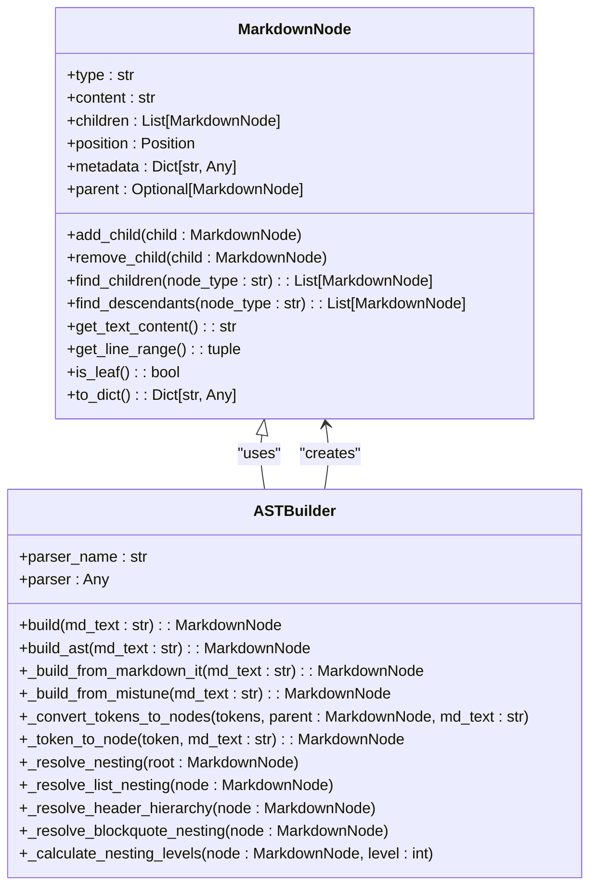
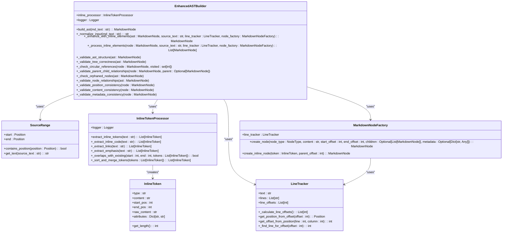
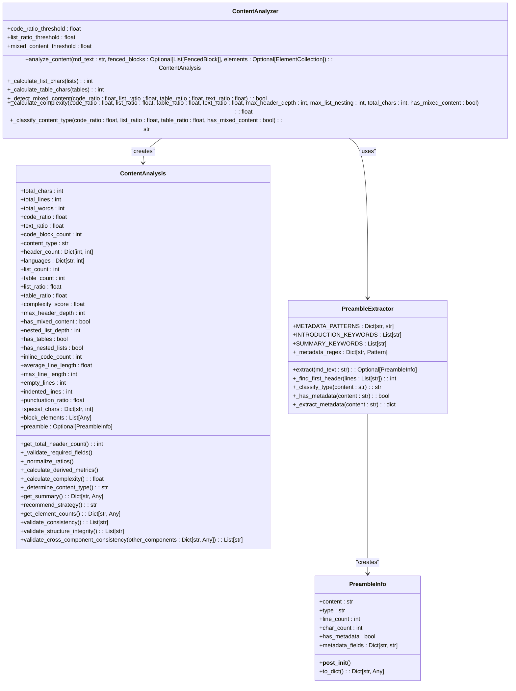
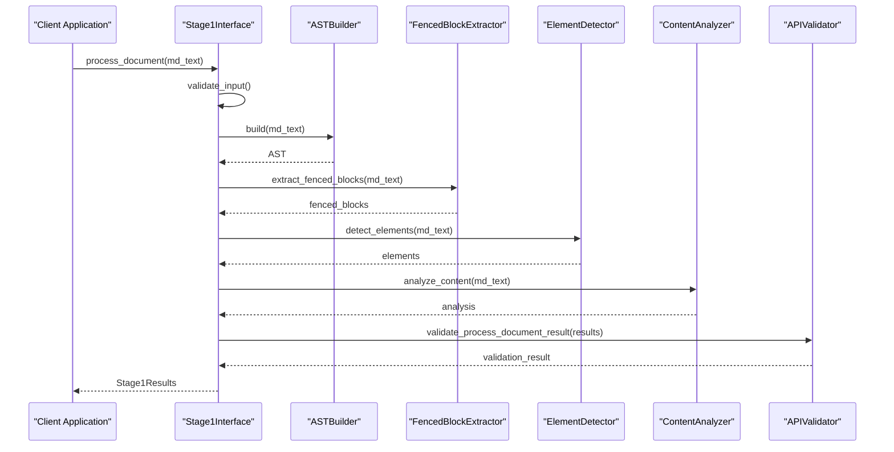
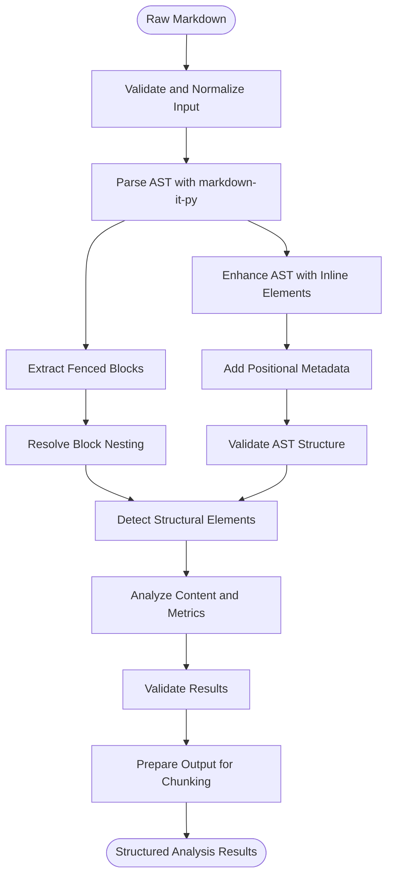
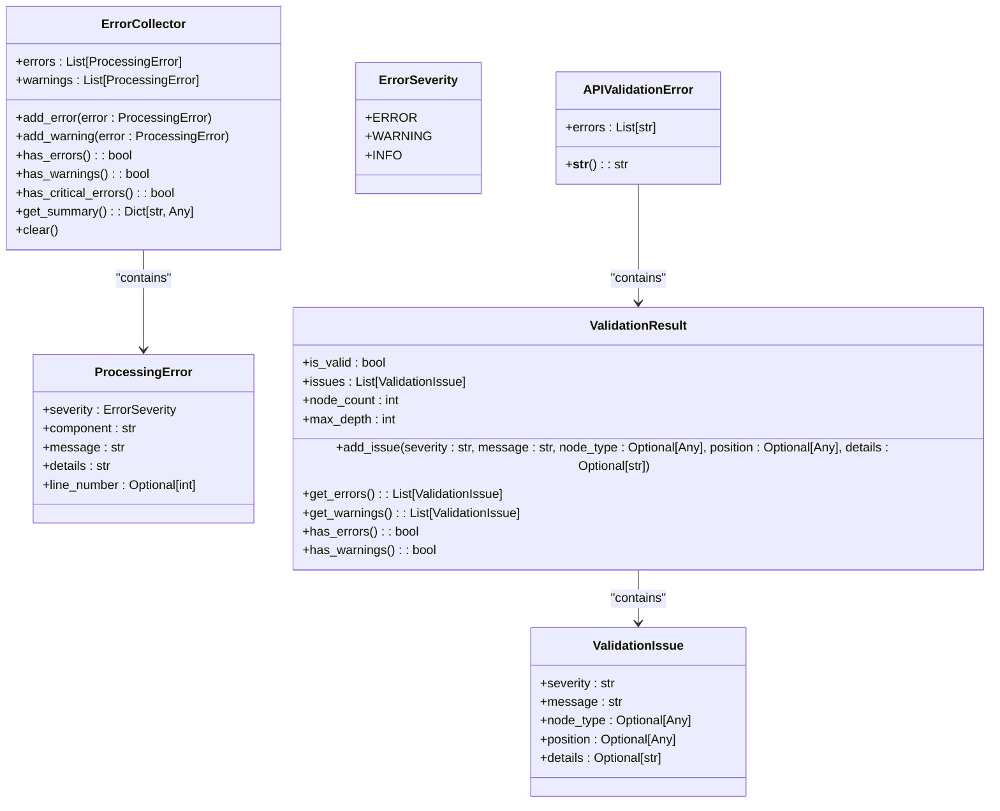

# Parser Architecture

<cite>
**Referenced Files in This Document**   
- [core.py](file://markdown_chunker_legacy/parser/core.py)
- [ast.py](file://markdown_chunker_legacy/parser/ast.py)
- [enhanced_ast_builder.py](file://markdown_chunker_legacy/parser/enhanced_ast_builder.py)
- [nesting_resolver.py](file://markdown_chunker_legacy/parser/nesting_resolver.py)
- [analyzer.py](file://markdown_chunker_legacy/parser/analyzer.py)
- [types.py](file://markdown_chunker_legacy/parser/types.py)
- [validation.py](file://markdown_chunker_legacy/parser/validation.py)
- [utils.py](file://markdown_chunker_legacy/parser/utils.py)
</cite>

## Table of Contents
1. [Introduction](#introduction)
2. [Core Components](#core-components)
3. [AST-Based Parsing Approach](#ast-based-parsing-approach)
4. [Enhanced AST Builder](#enhanced-ast-builder)
5. [Content Analysis Process](#content-analysis-process)
6. [Component Interactions](#component-interactions)
7. [Data Flow](#data-flow)
8. [Performance Considerations](#performance-considerations)
9. [Error Handling](#error-handling)

## Introduction
The parser component is responsible for analyzing Markdown documents and extracting structural information for downstream processing. It uses an AST-based approach with markdown-it-py as the primary parser, enhanced with additional metadata and structural analysis. The parser analyzes document structure, detects code blocks, lists, tables, and other elements, and generates metrics used for strategy selection in the chunking process.

**Section sources**
- [core.py](file://markdown_chunker_legacy/parser/core.py#L1-L654)

## Core Components
The parser architecture consists of several key components that work together to transform raw Markdown into structured analysis results. The core components include the AST builder, enhanced AST builder, nesting resolver, validation modules, and content analyzer. These components are orchestrated through the Stage1Interface, which provides the main entry point for parsing operations.

**Section sources**
- [core.py](file://markdown_chunker_legacy/parser/core.py#L401-L638)
- [ast.py](file://markdown_chunker_legacy/parser/ast.py#L30-L292)
- [enhanced_ast_builder.py](file://markdown_chunker_legacy/parser/enhanced_ast_builder.py#L319-L654)
- [nesting_resolver.py](file://markdown_chunker_legacy/parser/nesting_resolver.py#L74-L273)

## AST-Based Parsing Approach
The parser uses markdown-it-py to generate an Abstract Syntax Tree (AST) from Markdown content. The AST represents the document structure as a tree of nodes, with each node representing a Markdown element such as headers, paragraphs, lists, or code blocks. The parser first validates and normalizes the input text, then processes it through markdown-it-py to generate tokens, which are converted into AST nodes with positional metadata.

**Diagram sources **
- [ast.py](file://markdown_chunker_legacy/parser/ast.py#L30-L292)

**Section sources**
- [ast.py](file://markdown_chunker_legacy/parser/ast.py#L111-L292)
- [core.py](file://markdown_chunker_legacy/parser/core.py#L448-L450)

## Enhanced AST Builder
The enhanced AST builder extends the basic AST with additional structural and positional metadata. It processes inline elements such as code, links, emphasis, and strong text, creating a more detailed representation of the document. The builder uses a LineTracker to maintain accurate line and column positions, and a SourceRange to represent ranges in the source text. Inline elements are extracted using regular expressions and converted into appropriate node types.

**Diagram sources **
- [enhanced_ast_builder.py](file://markdown_chunker_legacy/parser/enhanced_ast_builder.py#L17-L654)

**Section sources**
- [enhanced_ast_builder.py](file://markdown_chunker_legacy/parser/enhanced_ast_builder.py#L319-L654)

## Content Analysis Process
The content analysis process generates metrics such as code_ratio and complexity_score that are used for strategy selection. The analyzer calculates various document metrics including total characters, lines, and words, as well as ratios of different content types (code, text, list, table). It also counts specific elements like code blocks, headers, lists, and tables, and extracts programming languages used in code blocks.

**Diagram sources **
- [analyzer.py](file://markdown_chunker_legacy/parser/analyzer.py#L18-L501)
- [types.py](file://markdown_chunker_legacy/parser/types.py#L436-L500)

**Section sources**
- [analyzer.py](file://markdown_chunker_legacy/parser/analyzer.py#L18-L501)
- [types.py](file://markdown_chunker_legacy/parser/types.py#L436-L500)

## Component Interactions
The parser components interact through well-defined interfaces and data structures. The Stage1Interface orchestrates the parsing process, coordinating between the AST builder, fenced block extractor, element detector, and content analyzer. Results are validated through the APIValidator to ensure consistency across components. The nesting resolver processes fenced blocks to establish parent-child relationships and calculate nesting levels.

**Diagram sources **
- [core.py](file://markdown_chunker_legacy/parser/core.py#L401-L638)
- [validation.py](file://markdown_chunker_legacy/parser/validation.py#L162-L588)

**Section sources**
- [core.py](file://markdown_chunker_legacy/parser/core.py#L401-L638)
- [validation.py](file://markdown_chunker_legacy/parser/validation.py#L162-L588)

## Data Flow
The data flow begins with raw Markdown text, which is validated and normalized before being processed by various components. The AST builder generates the document structure, while the fenced block extractor identifies code blocks. The element detector finds structural elements like headers, lists, and tables. The content analyzer calculates metrics based on the document content. All results are combined into a structured analysis result that includes the AST, detected elements, and calculated metrics.

**Diagram sources **
- [core.py](file://markdown_chunker_legacy/parser/core.py#L438-L510)
- [enhanced_ast_builder.py](file://markdown_chunker_legacy/parser/enhanced_ast_builder.py#L326-L349)

**Section sources**
- [core.py](file://markdown_chunker_legacy/parser/core.py#L438-L510)
- [enhanced_ast_builder.py](file://markdown_chunker_legacy/parser/enhanced_ast_builder.py#L326-L349)

## Performance Considerations
The parser is designed to handle large documents efficiently, with several performance optimizations in place. The AST construction process is optimized by using markdown-it-py's efficient tokenization, and positional metadata is calculated during parsing rather than in post-processing. For very large documents, the parser may fall back to mistune if markdown-it-py is not available. Memory usage is managed by processing the document in a single pass and avoiding unnecessary data duplication.

**Section sources**
- [ast.py](file://markdown_chunker_legacy/parser/ast.py#L114-L147)
- [core.py](file://markdown_chunker_legacy/parser/core.py#L448-L450)

## Error Handling
The parser includes comprehensive error handling mechanisms for malformed Markdown and edge cases. The ErrorCollector class aggregates errors and warnings throughout the parsing process. Input validation ensures that the text is properly encoded and normalized. The parser handles unclosed code blocks and overlapping fences gracefully, and includes phantom block prevention to avoid spurious block detection. Validation results include detailed error information that can be used for debugging.

**Diagram sources **
- [core.py](file://markdown_chunker_legacy/parser/core.py#L28-L29)
- [errors.py](file://markdown_chunker_legacy/parser/errors.py#L1-L100)
- [validation.py](file://markdown_chunker_legacy/parser/validation.py#L129-L785)

**Section sources**
- [core.py](file://markdown_chunker_legacy/parser/core.py#L28-L29)
- [validation.py](file://markdown_chunker_legacy/parser/validation.py#L129-L785)