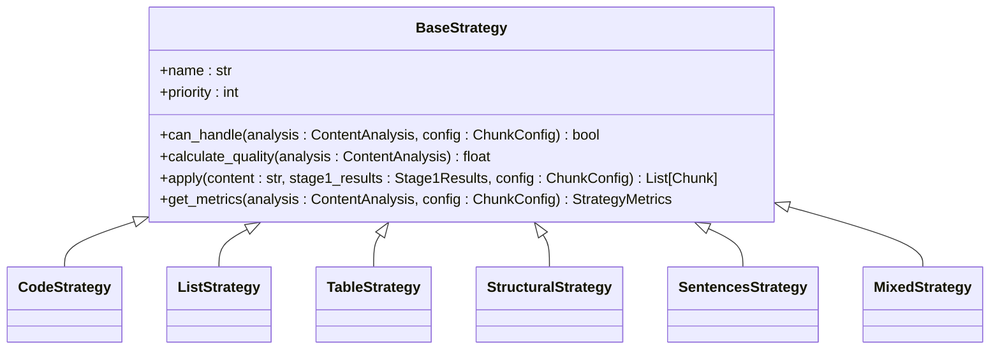
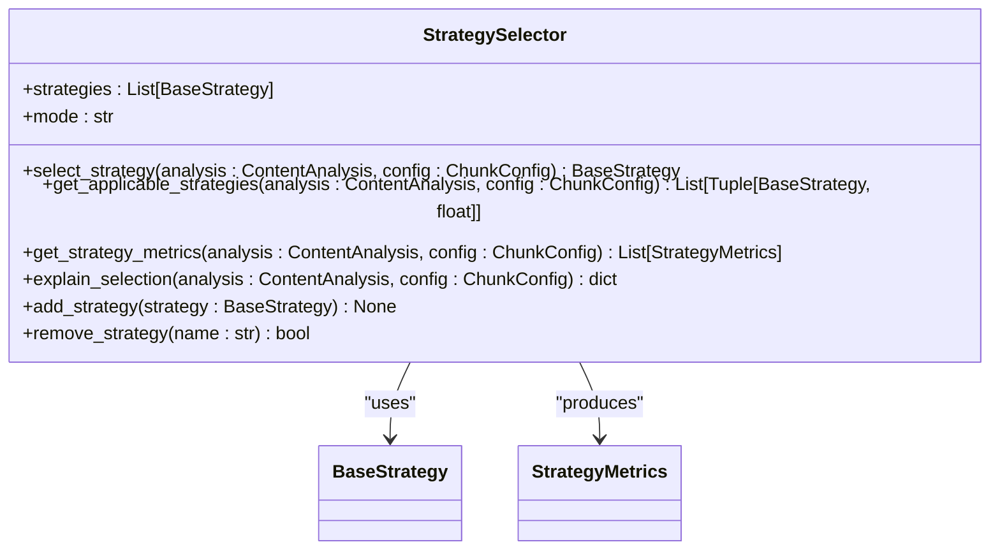
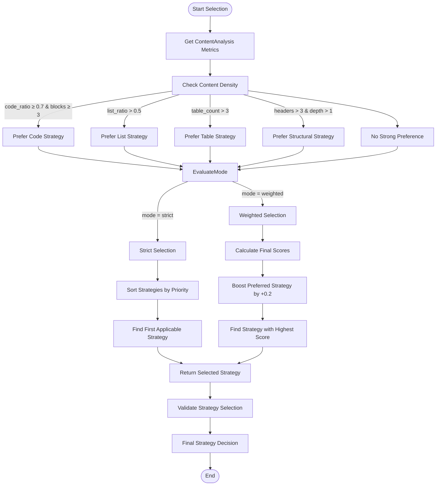

# Strategies Architecture

<cite>
**Referenced Files in This Document**   
- [selector.py](file://markdown_chunker_legacy/chunker/selector.py)
- [base.py](file://markdown_chunker_legacy/chunker/strategies/base.py)
- [code_strategy.py](file://markdown_chunker_legacy/chunker/strategies/code_strategy.py)
- [list_strategy.py](file://markdown_chunker_legacy/chunker/strategies/list_strategy.py)
- [table_strategy.py](file://markdown_chunker_legacy/chunker/strategies/table_strategy.py)
- [structural_strategy.py](file://markdown_chunker_legacy/chunker/strategies/structural_strategy.py)
- [sentences_strategy.py](file://markdown_chunker_legacy/chunker/strategies/sentences_strategy.py)
- [mixed_strategy.py](file://markdown_chunker_legacy/chunker/strategies/mixed_strategy.py)
- [types.py](file://markdown_chunker_legacy/chunker/types.py)
</cite>

## Table of Contents
1. [Introduction](#introduction)
2. [Strategy Pattern Implementation](#strategy-pattern-implementation)
3. [Base Strategy Interface](#base-strategy-interface)
4. [Concrete Strategies](#concrete-strategies)
   - [Code Strategy](#code-strategy)
   - [List Strategy](#list-strategy)
   - [Table Strategy](#table-strategy)
   - [Structural Strategy](#structural-strategy)
   - [Sentences Strategy](#sentences-strategy)
   - [Mixed Strategy](#mixed-strategy)
5. [Strategy Selection Process](#strategy-selection-process)
6. [StrategySelector Component](#strategyselector-component)
7. [Content Analysis Metrics](#content-analysis-metrics)
8. [Fallback Mechanism](#fallback-mechanism)
9. [Extensibility and Factory Pattern](#extensibility-and-factory-pattern)
10. [State Diagrams](#state-diagrams)

## Introduction
The strategies component implements a sophisticated algorithm selection system that enables optimal content chunking based on document analysis. This architecture employs the Strategy Pattern to dynamically select the most appropriate chunking approach based on the content's characteristics. The system evaluates various metrics such as code_ratio, list_density, and table_coverage to determine the best strategy for processing a given document. The design includes six concrete strategies—code, list, table, structural, sentences, and mixed—each specialized for different content types. The StrategySelector component orchestrates the selection process using priority-based rules and quality scoring, while providing a fallback mechanism for cases where primary strategies cannot handle the content. The architecture is designed for extensibility, allowing custom strategies to be registered and instantiated through a factory pattern.

**Section sources**
- [selector.py](file://markdown_chunker_legacy/chunker/selector.py#L1-L50)
- [base.py](file://markdown_chunker_legacy/chunker/strategies/base.py#L1-L50)

## Strategy Pattern Implementation
The strategies component implements the Strategy Pattern to enable algorithm selection based on content analysis. This design pattern allows the system to dynamically choose the most appropriate chunking algorithm at runtime based on the document's characteristics. The pattern consists of a common interface (BaseStrategy) that all concrete strategies implement, enabling them to be used interchangeably by the StrategySelector. Each strategy encapsulates a specific approach to chunking Markdown content, with implementations optimized for different content types such as code-heavy documents, list-heavy documents, or structurally complex documents. The Strategy Pattern provides several benefits including algorithm independence from the client code, easy addition of new strategies, and the ability to switch algorithms dynamically based on content analysis. This implementation follows the classic Strategy Pattern structure with a context (StrategySelector), a strategy interface (BaseStrategy), and concrete strategy classes that implement specific chunking algorithms.

**Section sources**
- [base.py](file://markdown_chunker_legacy/chunker/strategies/base.py#L1-L50)
- [selector.py](file://markdown_chunker_legacy/chunker/selector.py#L1-L50)

## Base Strategy Interface
The BaseStrategy class defines the abstract interface that all chunking strategies must implement, ensuring consistent behavior across different approaches. This abstract base class uses Python's ABC (Abstract Base Class) module to enforce implementation of critical methods. The interface includes several key components: the name property (human-readable strategy name), priority property (selection priority from 1=highest to 6=lowest), can_handle method (determines if the strategy can process the content), calculate_quality method (computes a quality score between 0.0 and 1.0 indicating suitability), and apply method (implements the actual chunking logic). The base class also provides a get_metrics method that combines priority and quality into a final score for strategy selection, along with helper methods for chunk creation and validation. This standardized interface allows the StrategySelector to evaluate and execute any strategy without knowing its specific implementation details.



**Diagram sources **
- [base.py](file://markdown_chunker_legacy/chunker/strategies/base.py#L15-L100)

**Section sources**
- [base.py](file://markdown_chunker_legacy/chunker/strategies/base.py#L15-L100)

## Concrete Strategies

### Code Strategy
The CodeStrategy specializes in handling documents with large amounts of code, preserving code block atomicity while maintaining context with surrounding text. This strategy is designed for code-heavy documents with a code_ratio ≥70% and at least three code blocks. It has the highest priority (1) in the selection system, indicating it should be preferred when applicable. The strategy extracts code blocks from the content and segments the document around these blocks, keeping each code block intact as an atomic unit. It performs language detection and extracts metadata such as function and class names from code content. For text segments between code blocks, it applies semantic boundary splitting at paragraph, sentence, or word levels. The quality score calculation favors documents with high code ratios, many code blocks, and multiple programming languages. When processing oversized code blocks, it allows them to exceed size limits to preserve atomicity.

**Section sources**
- [code_strategy.py](file://markdown_chunker_legacy/chunker/strategies/code_strategy.py#L42-L100)

### List Strategy
The ListStrategy preserves list hierarchy and handles nested structures, ensuring parent-child relationships remain intact. It is suitable for list-heavy documents with at least five lists or where list content comprises ≥60% of the document. This strategy extracts list items and builds a hierarchical structure based on indentation levels, maintaining parent-child relationships between nested list items. It groups related list items together and duplicates parent items when splitting large lists across chunks to maintain context. The strategy handles mixed list types including ordered, unordered, and task lists, preserving numbering for ordered lists. The quality score calculation considers list count, list ratio, and the presence of nested lists. Notably, the list strategy is excluded from auto-selection for safety reasons due to the risk of losing non-list content in mixed documents, though it can still be used via explicit strategy override.

**Section sources**
- [list_strategy.py](file://markdown_chunker_legacy/chunker/strategies/list_strategy.py#L58-L100)

### Table Strategy
The TableStrategy preserves table structure and handles large tables by splitting rows while duplicating headers for readability. It is designed for table-heavy documents with at least three tables or where table content comprises ≥40% of the document. This strategy detects markdown tables by identifying header rows, separator lines, and data rows. For tables that fit within size constraints, it preserves them intact. For oversized tables, it splits them by rows while duplicating the header and separator in each chunk to maintain readability and context. The quality score calculation favors documents with more tables and higher table ratios. The strategy ensures table structure and formatting are maintained, and it handles wide tables by allowing oversize chunks when necessary. It also preserves table metadata such as column count, row count, and alignment information in the chunk metadata.

**Section sources**
- [table_strategy.py](file://markdown_chunker_legacy/chunker/strategies/table_strategy.py#L56-L100)

### Structural Strategy
The StructuralStrategy chunks documents based on header hierarchy, creating semantically meaningful sections while preserving document structure. It requires at least three headers and a header hierarchy with multiple levels (max_header_depth > 1). This strategy extracts headers and builds a parent-child hierarchy based on header levels, then creates sections defined by header boundaries. It combines short adjacent sections to meet minimum size requirements and supports multi-level structures from H1 to H6. The strategy adds header path information to chunks, providing context about the document's structure. The quality score calculation favors documents with more headers, deeper hierarchies, and clear structure, with a penalty applied for high code ratios. When processing large sections, it can split them by subsections, paragraphs, or sentences while preserving atomic elements like code blocks.

**Section sources**
- [structural_strategy.py](file://markdown_chunker_legacy/chunker/strategies/structural_strategy.py#L59-L100)

### Sentences Strategy
The SentencesStrategy serves as a universal fallback that splits content into sentences and groups them into appropriately sized chunks. It has the lowest priority (6) and can handle any content type, making it the default fallback when other strategies cannot process the content. This strategy splits text into sentences using regex patterns that identify sentence boundaries, then groups sentences into chunks respecting size limits. It preserves paragraph boundaries when possible and provides reliable, predictable chunking for any content type. The quality score calculation gives a base score of 0.3 with penalties for structured content (code, headers, lists, tables) and bonuses for simple text with high text ratios and low complexity. This strategy ensures that even complex or unusual documents can be chunked successfully, providing a safety net for the system.

**Section sources**
- [sentences_strategy.py](file://markdown_chunker_legacy/chunker/strategies/sentences_strategy.py#L21-L50)

### Mixed Strategy
The MixedStrategy handles documents with mixed content types, preserving semantic relationships between different elements. It is suitable for documents with truly mixed content where no single type dominates, typically with code_ratio between 10-70%, list_ratio >10%, table_ratio >10%, and text_ratio >20%. This strategy detects all content elements (headers, code blocks, lists, tables) and groups them into logical sections based on proximity and semantic relationships. It splits around indivisible elements like code blocks and tables, ensuring these atomic units remain intact. The quality score calculation favors balanced content with multiple element types and penalizes documents where one type dominates. The strategy processes sections into chunks, either keeping complete sections intact or splitting them around indivisible elements, and includes metadata about the element types present in each chunk.

**Section sources**
- [mixed_strategy.py](file://markdown_chunker_legacy/chunker/strategies/mixed_strategy.py#L75-L100)

## Strategy Selection Process
The strategy selection process evaluates content analysis metrics to determine the optimal chunking approach. The system uses a two-phase evaluation: first determining if a strategy can handle the content through the can_handle method, then calculating a quality score through the calculate_quality method. The final selection combines both priority and quality into a comprehensive score. Strategies are evaluated in priority order (1=highest, 6=lowest), with the first applicable strategy selected in strict mode. In weighted mode, all applicable strategies are scored and the one with the highest combined score is chosen. The selection process considers content density rules: documents with >50% list elements suggest the list strategy, >3 tables suggest the table strategy, and >3 headers with hierarchy suggest the structural strategy. These suggestions boost the preferred strategy's score by 0.2 in weighted mode. The process also includes validation to ensure strategy names are unique and priorities are properly ordered.

**Section sources**
- [selector.py](file://markdown_chunker_legacy/chunker/selector.py#L74-L235)

## StrategySelector Component
The StrategySelector component evaluates ContentAnalysis metrics and selects the optimal strategy using priority-based rules. It maintains a list of available strategies sorted by priority and supports two selection modes: "strict" (selects the first applicable strategy by priority) and "weighted" (selects the best strategy by combined priority and quality score). The selector first checks for content density preferences based on code_ratio, list_density, and table_coverage metrics, then filters out the list strategy in auto mode for safety. In strict mode, it iterates through strategies in priority order, returning the first one that can handle the content. In weighted mode, it evaluates all applicable strategies, boosts the score of any preferred strategy by 0.2, and selects the one with the highest final score. The component provides methods to add or remove strategies dynamically, validate the strategy configuration, and explain the selection decision with detailed metrics for all strategies.



**Diagram sources **
- [selector.py](file://markdown_chunker_legacy/chunker/selector.py#L23-L50)

**Section sources**
- [selector.py](file://markdown_chunker_legacy/chunker/selector.py#L23-L50)

## Content Analysis Metrics
The strategy selection process relies on several key metrics derived from ContentAnalysis to make informed decisions. The primary metrics include code_ratio (proportion of code content to total content), list_density (measured by list_count and list_ratio), and table_coverage (measured by table_count and table_ratio). Additional metrics used in decision-making include total_headers (count of all headers), max_header_depth (maximum nesting level of headers), and complexity_score (overall document complexity). The system also considers secondary metrics such as text_ratio, inline_code_count, and has_mixed_content. These metrics are calculated during Stage 1 processing by analyzing the document's structure and content distribution. The code_ratio is calculated as the total characters in code blocks divided by total document characters. List density is determined by both the number of lists and the proportion of list content. Table coverage considers both the number of tables and their relative size in the document. These metrics collectively provide a comprehensive profile of the document's characteristics to guide optimal strategy selection.

**Section sources**
- [types.py](file://markdown_chunker_legacy/chunker/types.py#L449-L573)
- [selector.py](file://markdown_chunker_legacy/chunker/selector.py#L237-L277)

## Fallback Mechanism
The fallback mechanism activates when primary strategies fail to process content, ensuring robust handling of diverse document types. When a strategy's can_handle method returns false or the apply method encounters an error, the system triggers the fallback process. The mechanism first attempts to use alternative strategies in priority order, excluding the failed strategy. If no safe strategy can handle the content, it falls back to the structural strategy as a secondary option. As a final emergency fallback, it returns the first available safe strategy. The sentences strategy serves as the ultimate fallback with the lowest priority (6), capable of handling any content type by splitting text into sentences. The fallback process is configurable through ChunkConfig parameters including enable_fallback (whether to enable fallbacks), fallback_strategy (which strategy to use as fallback), and max_fallback_level (maximum depth of fallback attempts). Each fallback level is tracked in the ChunkingResult, providing transparency into the selection process. This multi-tiered approach ensures that even unusual or complex documents can be successfully chunked.

**Section sources**
- [selector.py](file://markdown_chunker_legacy/chunker/selector.py#L130-L149)
- [types.py](file://markdown_chunker_legacy/chunker/types.py#L500-L550)

## Extensibility and Factory Pattern
The architecture supports extensibility through a factory pattern that enables custom strategy registration and instantiation. The system allows new strategies to be added dynamically through the StrategySelector's add_strategy method, which validates the strategy's name and priority before adding it to the collection. Strategies are instantiated using a factory approach where the system can create instances of any strategy class that implements the BaseStrategy interface. The __init__.py file in the strategies package imports and exposes all concrete strategy classes, serving as a factory module. Custom strategies can be developed by extending BaseStrategy and implementing the required methods, then registered with the selector. The system validates new strategies to ensure they have unique names and proper priorities. This extensible design allows users to create specialized strategies for particular document types or organizational requirements without modifying the core selection logic. The factory pattern ensures consistent instantiation and integration of both built-in and custom strategies.

**Section sources**
- [__init__.py](file://markdown_chunker_legacy/chunker/strategies/__init__.py#L17-L37)
- [selector.py](file://markdown_chunker_legacy/chunker/selector.py#L418-L450)

## State Diagrams
The following state diagrams illustrate the strategy selection process and decision logic. The first diagram shows the overall workflow from content analysis to chunk generation, including the fallback mechanism. The second diagram details the decision logic within the StrategySelector, showing how it evaluates strategies based on content density preferences and selection mode.

```mermaid
stateDiagram-v2
[*] --> AnalyzeContent
AnalyzeContent --> SelectStrategy
SelectStrategy --> EvaluateStrategies
EvaluateStrategies --> CheckContentDensity
CheckContentDensity --> DetermineMode
DetermineMode --> "Strict Mode" : mode == "strict"
DetermineMode --> "Weighted Mode" : mode == "weighted"
"Strict Mode" --> FindFirstApplicable : iterate by priority
FindFirstApplicable --> SelectedStrategy : found
FindFirstApplicable --> FallbackToStructural : not found
FallbackToStructural --> EmergencyFallback : still not found
EmergencyFallback --> SelectedStrategy : return first safe strategy
"Weighted Mode" --> EvaluateAllStrategies : calculate final scores
EvaluateAllStrategies --> BoostPreferred : if matches content density
BoostPreferred --> SelectHighestScore : max(final_score)
SelectHighestScore --> SelectedStrategy
SelectedStrategy --> ApplyStrategy
ApplyStrategy --> Success : chunks generated
ApplyStrategy --> Failure : strategy cannot process content
Failure --> ActivateFallback
ActivateFallback --> TryAlternativeStrategies
TryAlternativeStrategies --> Success
TryAlternativeStrategies --> UseFallbackStrategy
UseFallbackStrategy --> Success
Success --> GenerateChunks
GenerateChunks --> [*]
```

**Diagram sources **
- [selector.py](file://markdown_chunker_legacy/chunker/selector.py#L58-L235)



**Diagram sources **
- [selector.py](file://markdown_chunker_legacy/chunker/selector.py#L237-L277)
- [base.py](file://markdown_chunker_legacy/chunker/strategies/base.py#L109-L114)